# บทช่วยสอน: สร้างคอลัมน์จากการคำนวณใน Power BI Desktop

ในบางครั้ง ข้อมูลที่คุณกำลังวิเคราะห์อยู่นั้นไม่มีเขตข้อมูลที่จำเป็นเพื่อให้ได้ผลลัพธ์ที่คุณต้องการ นี่คือที่มาของ*คอลัมน์จากการคำนวณ* คอลัมน์จากการคำนวณใช้สูตร Data Analysis Expressions (DAX) เพื่อกำหนดค่าของคอลัมน์ ตั้งแต่การรวมค่าข้อความจากสองคอลัมน์เข้าด้วยกัน จนถึงการคำนวณค่าตัวเลขจากค่าอื่น ๆ ตัวอย่างเช่น สมมติว่า ข้อมูลของคุณมีเขตข้อมูล**เมือง**และ**รัฐ** แต่คุณต้องการเขตข้อมูล**ตำแหน่งที่ตั้ง**เดียวที่มีทั้งสองอย่าง เช่น "Miami, FL" (เมืองไมอามี รัฐฟลอริดา) นี่คือสิ่งที่เราใช้คอลัมน์จากการคำนวณ

คอลัมน์จากการคำนวณจะคล้ายกับ[หน่วยวัด](desktop-tutorial-create-measures.md) ที่ทั้งสองมาจากสูตร DAX แต่แตกต่างกันตรงที่วิธีใช้ คุณมักจะใช้หน่วยวัดเป็น**ค่า**ในการแสดงภาพ เพื่อคำนวณผลลัพธ์ตามเขตข้อมูลอื่น ๆ คุณใช้คอลัมน์จากการคำนวณเป็น**เขตข้อมูล**ใหม่ในแถว, แกน, คำอธิบายแผนภูมิ และการจัดกลุ่มของการแสดงภาพ

บทช่วยสอนนี้จะแนะนำให้คุณทำความเข้าใจและสร้างคอลัมน์จากการคำนวณ และใช้ในการแสดงภาพรายงานใน Power BI Desktop

## ข้อกำหนดเบื้องต้น

- บทเรียนนี้มีไว้สำหรับผู้ใช้ Power BI ที่คุณคุ้นเคยกับการใช้ Power BI Desktop เพื่อสร้างแบบจำลองที่ขั้นสูงขึ้น คุณควรจะทราบวิธีใช้การรับข้อมูล และตัวแก้ไข Power Query เพื่อนำเข้าข้อมูล ทำงานกับตารางที่เกี่ยวข้องหลายตาราง และเพิ่มเขตข้อมูลไปยังพื้นที่ของรายงานแล้ว ถ้าคุณยังไม่คุ้นเคยกับ Power BI Desktop ให้ตรวจดู[เริ่มต้นใช้งาน Power BI Desktop](desktop-getting-started.md)
  
- บทช่วยสอนนี้ใช้[ตัวอย่างการขาย Contoso สำหรับ Power BI Desktop](https://download.microsoft.com/download/4/6/A/46AB5E74-50F6-4761-8EDB-5AE077FD603C/Contoso%20Sales%20Sample%20for%20Power%20BI%20Desktop.zip) ซึ่งเป็นตัวอย่างเดียวกับที่ใช้ในบทช่วยสอน[สร้างหน่วยวัดของคุณเองใน Power BI Desktop](desktop-tutorial-create-measures.md) ข้อมูลยอดขายจากบริษัทที่สมมุติขึ้นที่ชื่อ Contoso, Inc. ถูกนำเข้าจากฐานข้อมูล ดังนั้นคุณจะไม่สามารถเชื่อมต่อกับแหล่งข้อมูล หรือดูในตัวแก้ไข Power Query ได้ ดาวน์โหลด และแยกไฟล์บนคอมพิวเตอร์ของคุณ จากนั้นเปิดใน Power BI Desktop

## สร้างคอลัมน์จากการคำนวณ ด้วยค่าจากตารางที่เกี่ยวข้อง

ในรายงานการขายของคุณ คุณต้องการแสดงประเภทและประเภทย่อยของผลิตภัณฑ์เป็นค่าเดียว เช่น "Cell phones – Accessories", "Cell phones – Smartphones & PDAs" เป็นต้น ไม่มีเขตข้อมูลในรายการ**เขตข้อมูล**ที่ให้ข้อมูลนั้นแก่คุณ แต่มีเขตข้อมูล **ProductCategory** และ **ProductSubcategory** ในตารางของตัวเอง คุณสามารถสร้างคอลัมน์จากการคำนวณที่รวมค่าจากสองคอลัมน์นี้ สูตร DAX สามารถใช้ประโยชน์จากรูปแบบที่คุณมี รวมถึงความสัมพันธ์ระหว่างตารางต่าง ๆ ที่มีอยู่แล้วอย่างเต็มที่

 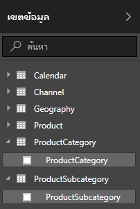

1. เพื่อสร้างคอลัมน์ใหม่ของคุณในตาราง **ProductSubcategory** คลิกขวาหรือเลือกจุดไข่ปลา **...** ที่อยู่ถัดจาก **ProductSubcategory** ในบานหน้าต่าง **เขตข้อมูล** และเลือก **คอลัมน์ใหม่** จากเมนู

   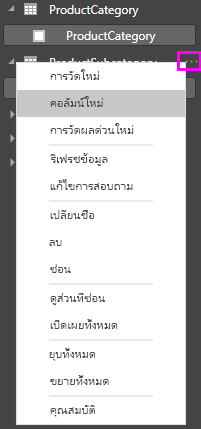

   เมื่อคุณเลือก **คอลัมน์ใหม่** **แถบสูตร** จะปรากฏที่ด้านบนของพื้นที่ทำงาน รายงาน ซึ่งพร้อมจะให้คุณตั้งชื่อคอลัมน์ของคุณ และป้อนสูตร DAX

   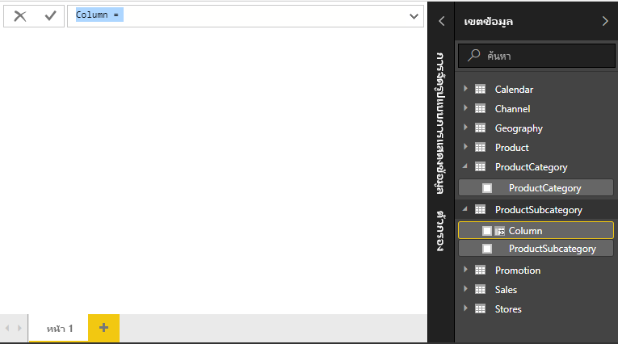

2. โดยค่าเริ่มต้น คอลัมน์ที่คำนวณใหม่จะมีชื่อว่า **คอลัมน์** หากคุณไม่เปลี่ยนชื่อ คอลัมน์ใหม่เพิ่มเติมจะชื่อว่า **คอลัมน์ 2**, **คอลัมน์ 3** และอื่น ๆ คุณต้องการให้คอลัมน์ของคุณสื่อความหมายมากขึ้น ดังนั้น ในเมื่อชื่อ **คอลัมน์** ถูกไฮไลต์อยู่แล้วในแถบสูตร ให้เปลี่ยนชื่อโดยพิมพ์ **ProductFullCategory** จากนั้น พิมพ์เครื่องหมายเท่ากับ ( **=** )

3. คุณต้องการให้ค่าต่าง ๆ ในคอลัมน์ใหม่ของคุณเริ่มด้วยชื่อในเขตข้อมูล **ProductCategory** เนื่องจากคอลัมน์นี้อยู่ในคนละตารางแต่เกี่ยวข้องกัน คุณสามารถใช้ฟังก์ชัน [RELATED](https://msdn.microsoft.com/library/ee634202.aspx) เพื่อช่วยให้คุณรับคอลัมน์มา

   หลังจากเครื่องหมายเท่ากับ พิมพ์ **r** รายการคำแนะนำแบบดรอปดาวน์แสดงทุกฟังก์ชัน DAX ที่ขึ้นต้น ด้วยตัวอักษร R การเลือกแต่ละฟังก์ชันจะแสดงคำอธิบายผลของฟังก์ชันนั้น เมื่อคุณพิมพ์ รายการคำแนะนำจะขยับเข้าใกล้ฟังก์ชันคุณที่ต้องการมากขึ้น เลือก **RELATED** แล้วกด **Enter**

   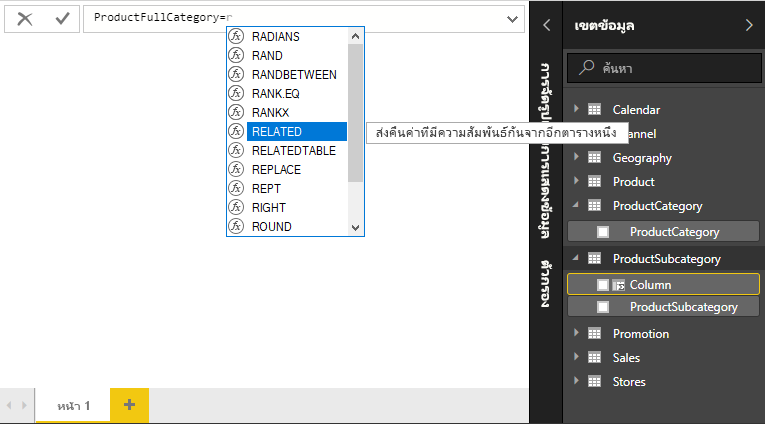

   วงเล็บเปิดจะปรากฏขึ้น พร้อมกับรายการแนะนำคอลัมน์ที่เกี่ยวข้อง ที่คุณสามารถส่งต่อไปยังฟังก์ชัน RELATED พร้อมคำอธิบาย และรายละเอียดของพารามิเตอร์ที่ต้องการ

   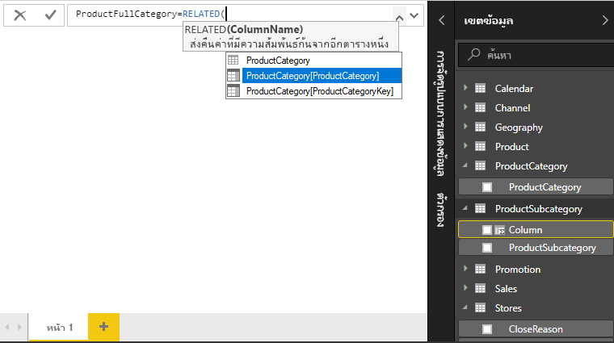

4. คุณต้องการคอลัมน์ **ProductCategory** จากตาราง **ProductCategory** เลือก **ProductCategory[ProductCategory]** กด **Enter** แล้วพิมพ์วงเล็บปิด

    > [!TIP]
    > ข้อผิดพลาดทางไวยากรณ์ มักเกิดจากวงเล็บปิดหายไป หรือวางผิดตำแหน่ง แม้ว่าบางครั้ง Power BI Desktop จะเพิ่มวงเล็บปิดให้คุณ

5. คุณต้องเป็นเส้นประและช่องว่าง เพื่อแยก **ProductCategories** และ **ProductSubcategories** ในค่าใหม่ ดังนั้น หลังจากวงเล็บปิดของนิพจน์แรก พิมพ์ช่องว่าง, เครื่องหมายและ ( **&** ), อัญประกาศ ( **"** ), ช่องว่าง, เส้นประ ( **-** ), ช่องว่างอีกช่อง, อัญประกาศอีกตัว และเครื่องหมายและอีกตัว ในตอนนี้สูตรของคุณควรมีลักษณะดังนี้:

    `ProductFullCategory = RELATED(ProductCategory[ProductCategory]) & " - " &`

    > [!TIP]
    > ถ้าคุณต้องการพื้นที่เพิ่มเติม เลือกเครื่องลูกศรลงทางด้านขวาของแถบสูตรเพื่อขยายตัวแก้ไขสูตร ในตัวแก้ไข กด **Alt + Enter** เพื่อย้ายลงหนึ่งบรรทัด และ**แท็บ**เพื่อเคลื่อนย้ายออกไป

6. ใส่วงเล็บก้ามปูเปิด ( **[** ) แล้วเลือกคอลัมน์ **[ProductSubcategory]** เพื่อจบสูตร 

    

    คุณไม่จำเป็นต้องใช้ฟังก์ชัน RELATED เพื่อเรียกใช้ตาราง **ProductSubcategory** ในนิพจน์ที่สอง เนื่องจากคุณกำลังสร้างคอลัมน์จากการคำนวณในตารางนี้ คุณสามารถใสj **[ProductSubcategory]** โดยมีคำนำหน้าเป็นชื่อตาราง (ชื่อแบบเต็ม) หรือไม่มี (แบบย่อ) ได้

7. จบการใส่สูตร โดยการกด **Enter** หรือเลือกเครื่องหมายถูกในแถบสูตร สูตรจะถูกตรวจสอบ และชื่อคอลัมน์ **ProductFullCategory** จะปรากฏในตาราง **ProductSubcategory** ในบานหน้าต่าง **เขตข้อมูล**

   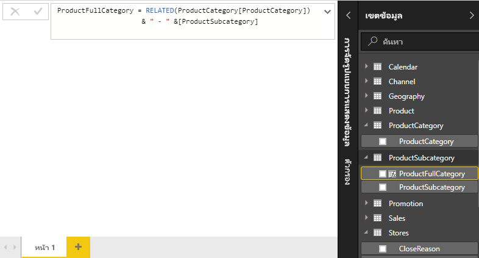

    >[!NOTE]
    >ใน Power BI Desktop คอลัมน์จากการคำนวณได้ไอคอนพิเศษในบานหน้าต่าง **เขตข้อมูล** แสดงว่าคอลัมน์ดังกล่าวประกอบด้วยสูตร ในบริการของ Power BI (ไซต์ Power BI ของคุณ) ไม่มีวิธีเปลี่ยนแปลงสูตร ดังนั้นคอลัมน์จากการคำนวณจะไม่มีไอคอน

## ใช้คอลัมน์ใหม่ของคุณในรายงาน

ตอนนี้ คุณสามารถใช้คอลัมน์ **ProductFullCategory** ใหม่ของคุณเพื่อดู **SalesAmount** ตาม **ProductFullCategory**

1. เลือกหรือลากคอลัมน์ **ProductFullCategory** จากตาราง **ProductSubcategory** ลงบนพื้นที่ทำงาน รายงาน เพื่อสร้างตารางที่แสดงชื่อ **ProductFullCategory** ทั้งหมด

   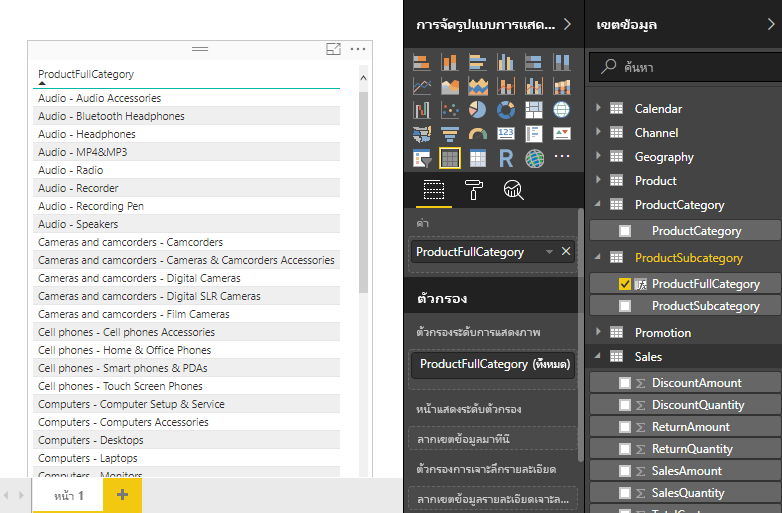

2. เลือกหรือลากเขตข้อมูล **SalesAmount** จากตาราง **ยอดขาย** ลงในตารางเพื่อแสดง**SalesAmount** สำหรับแต่ละ **ProductFullCategory**

   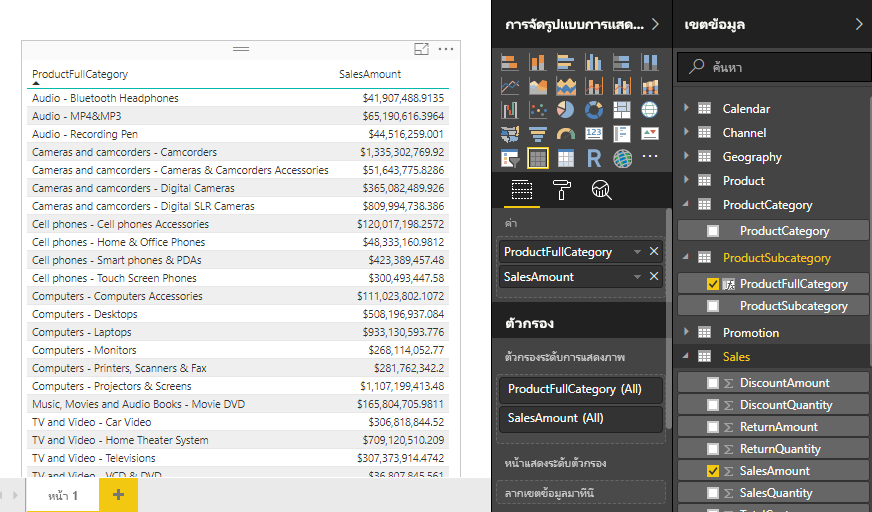

## สร้างคอลัมน์จากการคำนวณที่ใช้ฟังก์ชัน IF

ตัวอย่างการขายของ Contoso ประกอบด้วยข้อมูลยอดขายสำหรับร้านค้าที่ยังเปิดดำเนินงานอยู่ และที่ปิดไปแล้ว คุณต้องการให้แน่ใจว่า ยอดขายของร้านค้าที่ยังเปิดอยู่ แยกจากยอดขายของรัานที่ปิดไปแล้วอย่างชัดเจนในรายงานของคุณ โดยการสร้างเขตข้อมูลที่ชื่อ **Active StoreName** ในคอลัมน์ที่คำนวณ **StoreName ที่เปิด** ใหม่ ร้านค้าที่เปิดอยู่จะปรากฏเป็นชื่อเต็มของร้าน ในขณะที่ยอดขายสำหรับร้านที่ปิดแล้วจะถูกจัดกลุ่มเข้าด้วยกันในหนึ่งหน่วยข้อมูลบรรทัดที่ชื่อว่า **ปิดแล้ว**

โชคดีที่ตาราง **ร้านค้า** มีคอลัมน์ที่ชื่อว่า **สถานะ** ที่มีค่า "On" สำหรับร้านค้าที่ยังเปิดอยู่และ "Off" สำหรับร้านค้าที่ปิดไปแล้ว ซึ่งเราสามารถใช้เพื่อสร้างค่าสำหรับคอลัมน์ **StoreName ที่เปิด** ใหม่ของเรา สูตร DAX ของคุณจะใช้ฟังก์ชันตรรกะ [IF](https://msdn.microsoft.com/library/ee634824.aspx) เพื่อทดสอบ **สถานะ** ของแต่ละร้านค้า และแสดงค่าใดค่าหนึ่งขึ้นอยู่กับผลลัพธ์ ถ้า **สถานะ** ของร้านค้าคือ "On" สูตรจะแสดงผลลัพธ์เป็นชื่อของร้านค้า แต่ถ้าเป็น "Off" สูตรจะกำหนดค่า **StoreName ที่เปิดอยู่** เป็น "Inactive"

1. สร้างคอลัมน์จากการคำนวณใหม่ในตาราง **Stores** และตั้งชื่อเป็น **Active StoreName** ในแถบสูตร

2. หลังจากเครื่องหมาย **=** เริ่มพิมพ์ **IF** รายการคำแนะนำจะแสดงสิ่งที่คุณสามารถเพิ่ม เลือก**IF**

    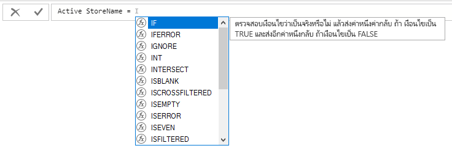

3. อาร์กิวเมนต์แรกสำหรับ **IF** เป็นการทดสอบตรรกะว่า **สถานะ** ของร้านค้าเป็น "On" หรือไม่ พิมพ์วงเล็บก้ามปูเปิด **[** ซึ่งจะแสดงรายการคอลัมน์จากตาราง **ร้านค้า** และเลือก **[Status]**

    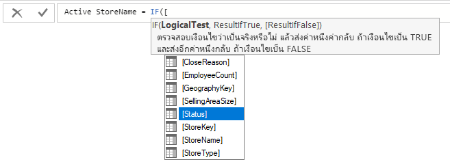

4. ต่อท้ายทันทีหลังจาก **[Status]** พิมพ์ **="On"** แล้วพิมพ์เครื่องหมายจุลภาค ( **,** ) เพื่อจบอาร์กิวเมนต์ คำแนะนำเครื่องมือแนะนำว่า คุณต้องเพิ่มค่าที่จะส่งกลับเมื่อผลลัพธ์เป็น TRUE

    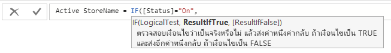

5. ถ้าสถานะของร้านค้าคือ "On" คุณต้องการแสดงชื่อของร้านค้า พิมพ์วงเล็บก้ามปูเปิด ( **[** ) และเลือกคอลัมน์ **[StoreName]** แล้วพิมพ์เครื่องหมายจุลภาคอีกตัว คำแนะนำในขณะนี้บอกว่า คุณต้องเพิ่มค่าที่จะส่งกลับเมื่อผลลัพธ์จะเป็น FALSE

    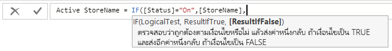

6. คุณต้องการให้ค่าเป็น "Inactive" ดังนั้น ให้พิมพ์ **“Inactive”** แล้วจบสูตรโดยการกด **Enter** หรือเลือกเครื่องหมายถูกในแถบสูตร สูตรจะถูกตรวจสอบ และชื่อของคอลัมน์ใหม่จะปรากฏขึ้นในตาราง **ร้านค้า** ในบานหน้าต่าง **เขตข้อมูล**

    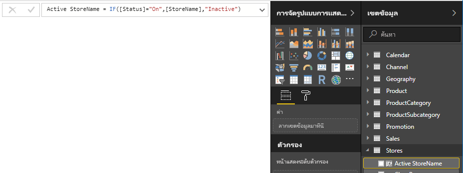

7. คุณสามารถใช้คอลัมน์ **StoreName ที่เปิดอยู่** ในการแสดงผลด้วยภาพ เช่นเดียวกันเขตข้อมูลอื่นใด เมื่อต้องการแสดง **SalesAmounts** ตาม **Active StoreName** เลือกเขตข้อมูล **StoreName ที่เปิดอยู่** หรือลากไปยังพื้นที่ทำงาน รายงาน จากนั้นเลือกเขตข้อมูล **SalesAmount** หรือลากไปยังตาราง ในตารางนี้ ร้านค้าที่ยังเปิดอยู่ปรากฏขึ้นทีละร้านตามชื่อ แต่ร้านค้าที่ไม่ได้เปิดแล้วจะถูกจัดกลุ่มเข้าด้วยกันที่ส่วนท้าย เป็นชื่อ **Inactive**

    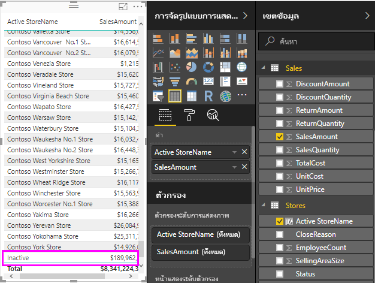

## สิ่งที่คุณได้เรียนรู้

คอลัมน์จากการคำนวณสามารถเสริมข้อมูลให้กับคุณ และให้ข้อมูลเชิงลึกได้ง่ายขึ้น คุณได้เรียนรู้วิธีการสร้างคอลัมน์จากการคำนวณในบานหน้าต่าง **เขตข้อมูล** และแถบสูตร ใช้รายการคำแนะนำ และคำแนะนำเครื่องมือเพื่อช่วยในการสร้างสูตรของคุณ เรียกใช้ฟังก์ชัน DAX เช่น RELATED และ IF ด้วยอาร์กิวเมนต์ที่เหมาะสม และใช้คอลัมน์จากการคำนวณของคุณในการแสดงภาพในรายงาน

## ขั้นตอนถัดไป

ถ้าคุณต้องการใช้การเจาะลึกลงในสูตร DAX และสร้างคอลัมน์จากการคำนวณด้วยสูตรขั้นสูงขึ้น ดู[พื้นฐาน DAX ใน Power BI Desktop](desktop-quickstart-learn-dax-basics.md) บทความนี้มุ่งเน้นแนวคิดพื้นฐานใน DAX เช่น ไวยากรณ์ ฟังก์ชัน และการทำความเข้าใจบริบทโดยละเอียด

โปรดให้แน่ใจว่าได้เพิ่ม[ข้ออ้างอิง Data Analysis Expressions (DAX)](https://msdn.microsoft.com/library/gg413422.aspx)ไปยังรายการโปรดของคุณ นี่คือที่ที่คุณจะพบข้อมูลเกี่ยวกับ ไวยากรณ์ ตัวดำเนินการ และฟังก์ชัน DAX มากกว่า 200 ฟังก์ชันโดยละเอียด
