# บทเรียน สร้างหน่วยวัดของคุณเองใน Power BI Desktop
คุณสามารถสร้างโซลูชันของการวิเคราะห์ข้อมูลมีประสิทธิภาพที่สุดบางอย่างใน Power BI Desktop โดยใช้หน่วยวัด หน่วยวัดที่ช่วยคุณด้วยการคำนวนบนข้อมูลของคุณ ตามที่คุณโต้ตอบกับรายงานของคุณ บทเรียนนี้จะแนะนำคุณโดยผ่านการทำความเข้าใจเกี่ยวกับหน่วยวัด และสร้างหน่วยวัดพื้นฐานของคุณเองใน Power BI Desktop

### ข้อกำหนดเบื้องต้น
- บทเรียนนี้มีไว้สำหรับผู้ใช้ Power BI ที่คุณคุ้นเคยกับการใช้ Power BI Desktop เพื่อสร้างแบบจำลองที่ขั้นสูงขึ้น คุณควรจะคุ้นเคยกับการใช้ Get Data และตัวแก้ไขคิวรีเพื่อนำเข้าข้อมูล ทำงานกับหลายตารางที่เกี่ยวข้อง และเพิ่มเขตข้อมูลไปยังพื้นที่รายงาน ถ้าคุณไม่คุ้นเคยกับ Power BI Desktop ตรวจดู[เริ่มต้นใช้งาน Power BI Desktop](desktop-getting-started.md)
  
- ดาวน์โหลดไฟล์[ตัวอย่างการขาย Contoso สำหรับ Power BI Desktop](http://download.microsoft.com/download/4/6/A/46AB5E74-50F6-4761-8EDB-5AE077FD603C/Contoso%20Sales%20Sample%20for%20Power%20BI%20Desktop.zip) ซึ่งรวมถึงข้อมูลยอดขายออนไลน์จากบริษัทจำลอง Contoso, inc ข้อมูลนี้ถูกนำเข้าจากฐานข้อมูล ดังนั้นคุณจะไม่สามารถเชื่อมต่อกับแหล่งข้อมูลหรือดูในตัวแก้ไขคิวรีได้ เอาไฟลจากคอมพิวเตอร์ของคุณเองออกมา และจากนั้นเปิดใน Power BI Desktop

## ทำความเข้าใจหน่วยวัด

หน่วยวัดบ่อยครั้งถูกสร้างขึ้นเพื่อคุณโดยอัตโนมัติ ในไฟล์ตัวอย่างการขาย Contoso ให้เลือกกล่องกาเครื่องหมายถัดจากเขตข้อมูล**ยอดขาย**ในตาราง**Sales**ในเขตข้อมูล หรือลาก**SalesAmount**ไปพื้นที่รายงาน แสดงภาพแผนภูมิคอลัมน์ใหม่ปรากฏขึ้น แสดงผลรวมผลรวมของค่าทั้งหมดในคอลัมน์ SalesAmount ของตาราง Sales

เขตข้อมูลใดๆ ที่ปรากฏในเขตข้อมูลที่มีไอคอน sigma  เป็นตัวเลข และสามารถรวมค่าได้ แทนที่จะแสดงตารางที่มีสองล้านแถวของค่า SalesAmount Power BI Desktop ได้ตรวจพบชนิดข้อมูลเป็นตัวเลข สร้างและคำนวณการวัดเพื่อจะรวมข้อมูลโดยอัตโนมัติ ผลรวมคือ การรวมค่าแบบเริ่มต้นสำหรับชนิดข้อมูลที่เป็นตัวเลข แต่คุณสามารถใช้การรวมข้อมูลอื่นๆเช่นหาค่าเฉลี่ยหรือการนับค่าได้อย่างง่ายดาย การทำความเข้าใจเกี่ยวกับรวมข้อมูลเป็นพื้นฐานเพื่อทำความเข้าใจเกี่ยวกับมาตรการวัด เนื่องจากหน่วยวัดทุกตัวมีการทำการรวมข้อมูลชนิดใดชนิดหนึ่ง 

เมื่อต้องเปลี่ยนการรวมแผนภูมิการเป็นการหาค่าเฉลี่ย ในพื้น**ค่า**ของบานหน้าต่างการแสดงภาพ คลิกลูกศรที่อยู่ถัดจาก**SalesAmount**แล้วเลือก**ค่าเฉลี่ย** การแสดงภาพเปลี่ยนเป็นค่าเฉลี่ยของยอดขายทั้งหมดในเขตข้อมูล SalesAmount

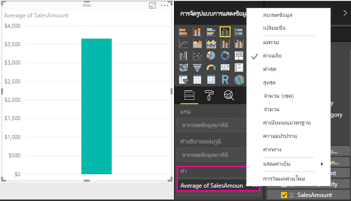

คุณสามารถเปลี่ยนชนิดของการรวมข้อมูลโดยขึ้นอยู่กับผลลัพธ์คที่คุณต้องการ แต่ชนิดของการรวมข้อมูลทั้งหมดจะไม่นำไปใช้กับทุกชนิดข้อมูลตัวเลข ตัวอย่างเช่น สำหรับเขตข้อมูล SalesAmount Sum และAverage ที่สมเหตุสมผล ค่าต่ำสุดและสูงสุดที่มีตำแหน่งของพวกมันเช่นกัน แต่ Count จะไม่ค่อยเหมาะสมกับเขตข้อมูล SalesAmount เนื่องจากในขณะที่ค่าเป็นตัวเลข แต่ที่จริงมันเป็นสกุลเงิน

ค่าที่คำนวณจากการเปลี่ยนแปลงตัววัดได้ตอบสนองต่อการโต้ตอบกับรายงานของคุณ ตัวอย่างเช่น ลากเขตข้อมูล**RegionCountryName** จากตาราง**Geography**ลงในแผนภูมิแสดงยอดขายโดยเฉลี่ยสำหรับแต่ละประเทศ

เมื่อผลลัพธ์ของการวัดเปลี่ยนแปลงเนื่องจากการโต้ตอบกับรายงานของคุณ คุณได้ทำผลกระทบกับหน่วยวัด*context*ของคุณ ทุกครั้งที่คุณโต้ตอบกับด้วยการแสดงภาพของคุณรายงาน คุณได้เปลี่ยนแปลงบริบท ซึ่งหน่วยวัดถูกคำนวณและแสดงผลลัพธ์

## สร้าง และใช้หน่วยวัดของคุณเอง

ในกรณีส่วนใหญ่ Power BI คำนวณและส่งกลับค่าตามชนิดของเขตข้อมูลและการรวมข้อมูลที่คุณเลือกโดยอัตโนมัติ แต่ในบางกรณี คุณอาจต้องการสร้างหน่วยวัดของคุณเองเพื่อทำการคำนวณที่ซับซ้อนมากขึ้น หรือการคำนวณที่ไม่ซ้ำเดิม กับ คุณสามารถสร้างหน่วยวัดของคุณด้วยภาษาสูตร Data Analysis Expressions (DAX) ด้วย Power BI Desktop 

สูตร DAX ใช้ฟังก์ชัน ตัวดำเนินการ และไวยากรณ์เดียวกับสูตร Excel เป็นจำนวนมาก อย่างไรก็ตาม ฟังก์ชัน DAX ถูกออกแบบมาให้ทำงานกับข้อมูลแบบสัมพันธ์ และทำการคำนวณแบบไดนามิกมากกว่าที่คุณโต้ตอบกับรายงาน มีฟังก์ชัน DAX มากกว่า 200 ตัว ที่ทำทุกอย่างตั้งแต่การรวมข้อมูลอย่างง่าย เช่น ผลรวมและค่าเฉลี่ย ไปยังฟังก์ชันทางสถิติ และการกรองที่ซับซ้อนมากขึ้น มีแหล่งข้อมูลมากมายเพื่อช่วยให้คุณเรียนรู้เพิ่มเติมเกี่ยวกับ DAX หลังจากที่คุณเสร็จสิ้นบทเรียนนี้ ขอให้เช็คว่าดู[พื้นฐาน DAX ใน Power BI Desktop](desktop-quickstart-learn-dax-basics.md)แล้ว

เมื่อคุณสร้างหน่วยวัดของคุณเอง มันจะถูกเพิ่มลงในรายการเขตข้อมูลสำหรับตารางที่คุณเลือก และจะถูกเรียกว่าหน่วยวัดของ*แบบจำลอง* ข้อดีบางประการของหน่วยวัดของแบบจำลอง ซึ่งจะให้คุณสามารถตั้งชื่อตามที่คุณต้องการได้ ทำให้สามารถระบุตัวได้ง่ายขึ้น คุณสามารถใช้เป็นอาร์กิวเมนต์ในนิพจน์ DAX อื่นๆและคุณสามารถทำดำเนินการการคำนวณที่ซับซ้อนได้อย่างรวดเร็ว

>[!TIP]
>สามารถใช้การคำนวณทั่วไปหลายแบบ ตั้งแต่ Power BI Desktop รุ่นเดือนกุมภาพันธ์ 2018 เช่น**ตัววัดแบบด่วน**ซึ่งเขียนสูตร DAX ให้คุณ โดยยึดตามข้อมูลที่คุณป้อนเข้าในกล่องโต้ตอบ คำนวณที่รวดเร็วและมีประสิทธิภาพเหล่านี้เหมาะสำหรับการเรียนรู้ DAX หรือเริ่มหน่วยวัดแบบกำหนดเองของคุณเอง เมื่อต้องการสร้างหรือสำรวจตัววัดผลแบบด่วน ให้เลือก**ตัววัดแบบด่วนใหม่**ในรายการ**ตัวเลือกเพิ่มเติม** หรือภายใต้แท็บ**คำนวณ**ในหน้าแรกของริบบอนของตาราง ดู[ใช้ตัววัดแบบด่วน](desktop-quick-measures.md)สำหรับข้อมูลเพิ่มเติมเกี่ยวกับการสร้างและการใช้ตัววัดแบบด่วน

### สร้างการวัด

คุณต้องการวิเคราะห์ยอดขายสุทธิของคุณ โดยลบส่วนลดและส่งกลับจากยอดขายรวม สำหรับบริบทใดก็ตามที่อยู่ในการแสดงภาพของคุณ คุณจำเป็นต้องมีหน่วยวัดที่ลบผลรวมของ DiscountAmount และ ReturnAmount จากผลรวมของ SalesAmount ไม่มีฟิลด์สำหรับยอดขายในรายการของเขตข้อมูล แต่คุณต้องมีบล๊อกเพื่อสร้างหน่วยวัดของคุณเองเพื่อคำนวณยอดขายสุทธิ 

1.  คลิกขวาตาราง**Sales**ในเขตข้อมูล well หรือวางเคอร์เซอร์เหนือตารางและเลือกจุดไข่ปลา (...)**ตัวเลือกเพิ่มเติม** จากนั้นเลือก**หน่วยวัดใหม่** จะบันทึกหน่วยวัดใหม่ของคุณในตาราง Sales ตำแหน่งที่จะหาได้ง่ายขึ้น
    
    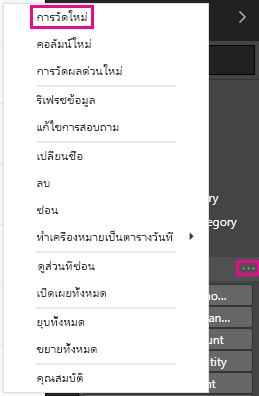
    
    คุณยังสามารถสร้างหน่วยวัดใหม่ โดยการเลือก**หน่วยวัดใหม่**ในกลุ่มการคำนวณบนแท็บหน้าแรกของริบบอน Power BI Desktop ได้
    
    
    
    >[!TIP]
    >เมื่อคุณสร้างตัววัดจากริบบอน มันจะสามารถถูกสร้างขึ้นในตารางใดก็ได้ แต่จะง่ายต่อการค้นหาถ้าคุณสร้างที่คุณวางมันในที่ที่คุณวางแผนจะใช้มัน ในกรณีนี้ เลือกตาราง Sales ก่อน เพื่อเปิดใช้งาน จากนั้นเลือก**หน่วยวัดใหม่** 
    
    แถบสูตรปรากฏขึ้นตามแนวด้านบนของพื้นที่รายงาน ตำแหน่งที่คุณสามารถเปลี่ยนชื่อหน่วยวัดของคุณ และใส่สูตร DAX
    
    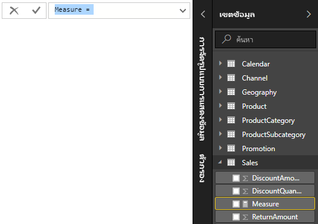
    
2.  ตามค่าเริ่มต้น หน่วยวัดใหม่ถูกตั้งชื่อว่า Measure เท่านั้น ถ้าคุณไม่เปลี่ยนชื่อ หน่วยวัดที่สร้างเพิ่มมาใหม่ จะชื่อว่า Measure 2 Measure 3 ไปเรื่อยๆ คุณต้องการหน่วยวัดของคุณสามารถระบุตัวได้ง่ายขึ้น ดังนั้นให้ ไฮไลต์**หน่วยวัด**ในแถบสูตร จากนั้นพิมพ์**ยอดขายสุทธิ**
    
3.  ในตอนนี้คุณสามารถใส่สูตร หลังจากเครื่องหมายเท่ากัน เริ่มพิมพ์**Sum** ขณะที่คุณพิมพ์ รายการคำแนะนำแบบดรอปดาวน์จะปรากฏขึ้น ซึ่งแสดงฟังก์ชัน DAX ทั้งหมดที่ขึ้นต้นด้วยตัวอักษรที่คุณพิมพ์ เลื่อนลง ถ้าจำเป็นต้องเลือก**SUM**จากรายการ จากนั้นกด Enter
    
    
    
    วงเล็บเปิดปรากฏ พร้อมกับรายการแนะนำแบบดรอปดาวน์สำหรับคอลัมน์พร้อมใช้งานทั้งหมด ที่คุณสามารถส่งไปยังฟังก์ชัน SUM
    
    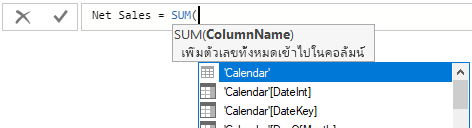
    
    นิพจน์ปรากฏตลอดเวลาระหว่างวงเล็บปิดและวงเล็บปิด นิพจน์ของคุณจะประกอบด้วยอาร์กิวเมนต์เดียว เพื่อส่งผ่านไปยังฟังก์ชัน SUM ของคอลัมน์ SalesAmount จนกว่าจะมีค่าที่เหลืออยู่ในรายการ Sales(SalesAmount) เพียงค่าเดียว ชื่อคอลัมน์ที่นำหน้าด้วยชื่อตารางจะถูกเรียกว่าการ*ชื่อที่ครบถ้วน*ของคอลัมน์ ชื่อคอลัมน์ที่ครบถ้วนทำให้สูตรของคุณอ่านง่ายขึ้น 
    
    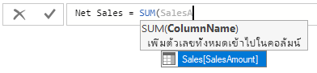
    
4. เลือก **Sales[SalesAmount]** แล้ว พิมพ์วงเล็บปิด
    
    > [!TIP]
    > ข้อผิดพลาดทางไวยากรณ์มักเกิดขึ้นจากวงเล็บปิดที่วางผิดตำแหน่ง หรือขาดหายไป
    
    
    
5.  เมื่อต้องลบสองคอลัมน์:
    1. หลังจากวงเล็บปิดในนิพจน์แรก พิมพ์ช่องว่าง ตัวดำเนินการเครื่องหมายลบ (**-**) และช่องว่างอีกช่อง 
    2. ใส่ฟังก์ชัน SUM อีกอัน และเริ่มพิมพ์ "DiscountAmount" จนกว่าคุณสามารถเลือกคอลัมน์ **Sales[DiscountAmount]** เป็นอาร์กิวเมนต์ เพิ่มวงเล็บปิด 
    3. พิมพ์ช่องว่าง เครื่องหมายลบเพิ่ม ช่องว่าง ฟังก์ชัน SUM เพิ่ม พร้อมกับ**Sales[ReturnAmount]** ในฐานะอาร์กิวเมนต์ และวงเล็บปิด
    
    
    
6.  คลิกที่เครื่องหมายถูกในแถบสูตรหรือกด Enter เพื่อตรวจและเติมเต็มสูตร ขณะนี้หน่วยวัดที่ได้รับตรวจสอบนั้นพร้อมใช้งานกับเขตข้อมูลสำหรับตาราง Sales 
    
    
    
ถ้าคุณมีห้องไม่พอสำหรับการป้อนค่าสูตร หรือต้องการให้แยกบรรทัด ให้เลือกเครื่องหมายบั้งลงทางด้านขวาของแถบสูตรเพื่อเปิดพื้นที่ว่างเพิ่มเติม

คุณสามารถแยกส่วนต่าง ๆ ของสูตรของคุณบนบรรทัดที่แตกต่างกัน โดยการกด**Alt-Enter**หรือย้ายสิ่งต่าง ๆ ไว้ โดยใช้**แท็บ**

### ใช้หน่วยวัดของคุณในรายงาน
ในตอนนี้ คุณสามารถเพิ่มหน่วยวัดยอดขายสุทธิของคุณไปยังพื้นที่รายงาน และคำนวณยอดขายสุทธิสำหรับเขตข้อมูลอื่นใดก็ตามที่คุณเพิ่มลงในรายงาน เมื่อต้องดูยอดขายสุทธิตามประเทศ

1. เลือก**ยอดขายสุทธิ**วัดจากการตาราง**Sales** หรือลากไปที่พื้นที่รายงาน
    
2. เลือกเขตข้อมูล**RegionCountryName** จากตาราง**Geography**หรือลากลงในแผนภูมิ
    
    
    
เมื่อต้องการดูความแตกต่างระหว่างยอดขายสุทธิและยอดขายรวมตามประเทศ เลือกเขตข้อมูล**SalesAmount** หรือลากลงในแผนภูมิ 

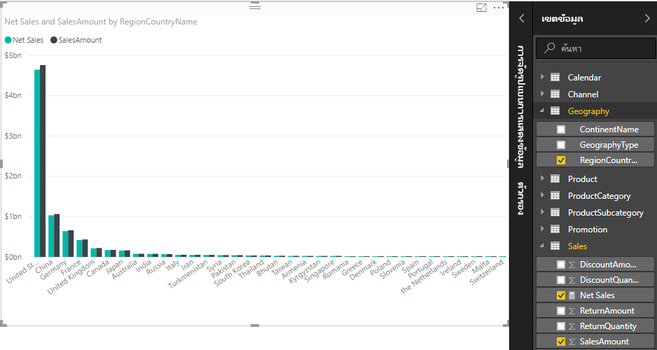

แผนภูมิตอนนี้ใช้หน่วยวัดสองตัว คือ SalesAmount ซึ่งเป็นผลรวมโดยอัตโนมัติ และยอดขายสุทธิที่คุณสร้างขึ้น ตัววัดแต่ละตัวมีการคำนวณในบริบทของเขตข้อมูลอื่นเช่น RegionCountryName
    
### ใช้หน่วยวัดของคุณกับตัวแบ่งส่วนข้อมูล

คุณสามารถเพิ่มตัวแบ่งส่วนข้อมูลเพื่อกรองยอดขายสุทธิและยอดขายตามปีปฏิทิน
    
1.  คลิกที่พื้นที่ว่างเปล่าอยู่ถัดจากแผนภูมิ จากนั้นใน**แสดงรูปภาพ** ให้เลือกแสดงภาพ**ตาราง** สิ่งนี้สร้างภาพตารางเปล่าบนพื้นที่รายงาน
    
    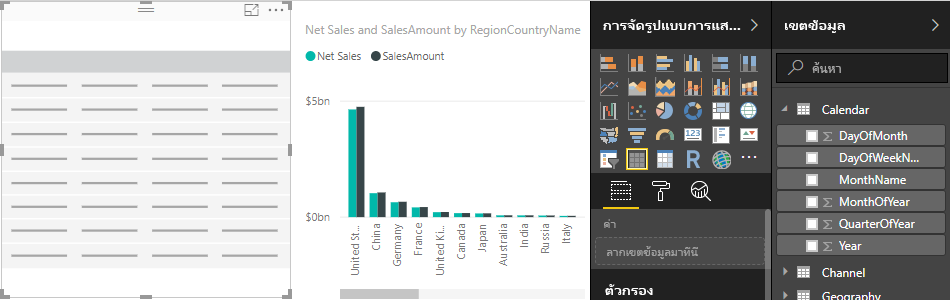
    
2.  ลากเขตข้อมูล**ปี**จากตาราง**ปฏิทิน** ลงในการแสดงภาพตารางเปล่าใหม่ เนื่องจากปีเป็นเขตข้อมูลตัวเลข Power BI Desktop หาผลรวม แต่ไม่มีเหตุผลที่จะทำรวมข้อมูล 
    
    
    
3.  ใน**ค่า**ในบานหน้าต่างการแสดงภาพ เลือกลูกศรลงถัดจาก**ปี**แล้ว เลือก**ไมหาผลรวม** ตารางแสดงรายการของแต่ละปี
    
    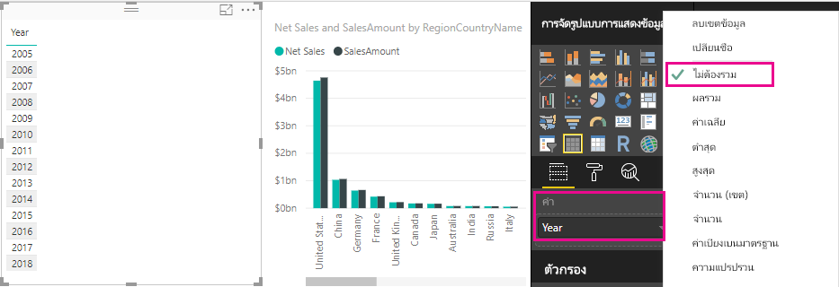
    
4.  เลือกไอคอน**ตัวแบ่งส่วนข้อมูล** ในบานหน้าต่างการแสดงภาพ เพื่อเปลี่ยตารางเป็นตัวแบ่งส่วนข้อมูล

    
    
5.  เลือกค่าใดๆ ในตัวแบ่งส่วนข้อมูลของ**ปี**เพื่อกรอง**ยอดขายสุทธิและแผนภูมิยอดขายตามประเทศ** หน่วยวัดยอดขายสุทธิและ SalesAmount ทำการคำนวณอีกครั้งและแสดงผลลัพธ์ในบริบทของเขตข้อมูลปีที่เลือก 
    
    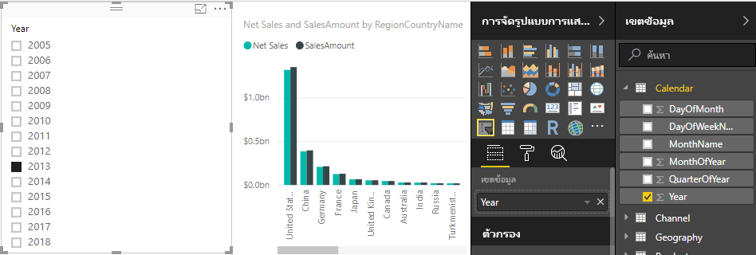

### ใช้การวัดในหน่วยวัดอื่น

คุณต้องการหาผลิตภัณฑ์ที่มียอดขายที่สุทธิสูงสุดต่อหน่วยที่ขาย ดังนั้นคุณต้องมีหน่วยวัดที่หารยอดขายสุทธด้วยปริมาณของหน่วยที่ขายได้ คุณสามารถสร้างหน่วยวัดใหม่ที่หารผลลัพธ์ของการวัดยอดขายสุทธิของคุณ ด้วยผลรวมของยอดขาย [SalesQuantity]

1.  สร้างตัววัดใหม่ที่ชื่อว่า**ยอดขายสุทธิต่อหน่วย**ในตาราง Sales
    
2.  ในแถบสูตร เริ่มพิมพ์**Net Sales** รายการคำแนะนำจะแสดงสิ่งที่คุณสามารถเพิ่ม เลือก **[ยอดขายสุทธิ]**
    
    
    
    คุณยังสามารถอ้างอิงหน่วยวัด โดยเพียงแค่พิมพ์วงเล็บเปิด (**[**) ได้ รายการคำแนะนำจะแสดงเพียงหน่วยวัด เมื่อคุณต้องเพิ่มลงในสูตรของคุณ
    
    
    
3.  ใส่ช่องว่าง เครื่องหมายการหาร (**/**) ช่องว่างอีกอัน ฟังก์ชัน SUM จากนั้น พิมพ์**Quantity** รายการคำแนะนำแสดงคอลัมน์ทั้งหมดทีมี Quantity อยู่ในชื่อ เลือก**Sales[SalesQuantity]** พิมพ์วงเล็บปิด แล้วกด ENTER หรือเลือกเครื่องหมายถูกเพื่อตรวจสอบสูตรของคุณ สูตรควรมีลักษณะดังนี้
    
    `Net Sales per Unit = [Net Sales] / SUM(Sales[SalesQuantity])`
    
4. เลือก**ยอดขายสุทธิต่อหน่วย**วัดจากตาราง Sales หรือลากไปยังพื้นที่ว่างในพื้นที่รายงาน แผนภูมิแสดงยอดขายสุทธิต่อหน่วยสูงกว่าผลิตภัณฑ์ที่ขายทั้งหมด ซึ่งไม่ให้ข้อมูลเป็นอย่างมาก 
    
    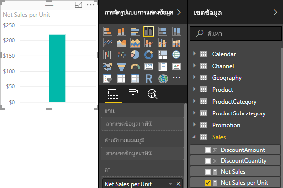
    
5. เพื่อให้มีลักษณะแตกต่างกัน เปลี่ยนชนิดของการแสดงภาพแผนภูมิสำหรับ**ทรีแมป**
    
    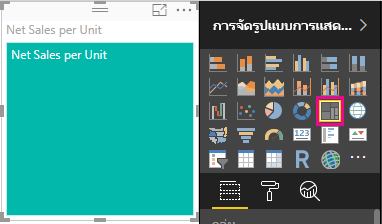
    
6. เลือกฟิลด์**ประเภทผลิตภัณฑ์** หรือลากลงใน treemap หรือลง ในกลุ่มเขตข้อมูลของบานหน้าต่างการแสดงรูปภาพ ขณะนี้ คุณมีข้อมูลดีบางอย่าง
    
    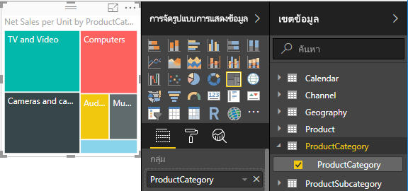
    
7. ให้พยายามลบฟิลด์ **ProductCategory** และลากเขตข้อมูล**ProductName**ลงในแผนภูมิแทน 
    
    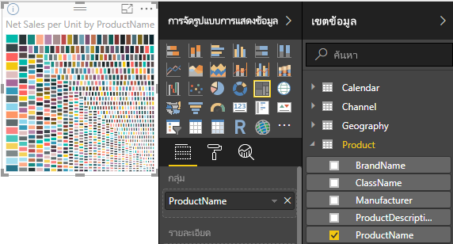
    
ตกลง ขณะนี้เรากำลังเล่นอยู่เท่านั้น แต่คุณจำเป็นต้องยอมรับว่ามันยอดเยี่ยม ทดลองใช้วิธีอื่นๆ ในการกรองและจัดรูปแบบการแสดงภาพ

## สิ่งที่คุณได้เรียนรู้
หน่วยวัดให้ความสามารถเพื่อรับข้อมูลเชิงลึกจากข้อมูลของคุณ คุณได้เรียนรู้วิธีการสร้างหน่วยวัดโดยใช้แถบสูตร ตั้งชือให้เหมาะสมที่สุด และค้นหาและเลือกองค์ประกอบของสูตรที่ใช่ โดยใช้รายการคำแนะนำของ DAX คุณถูกแนะนำให้รู้จักกับบริบท ซึ่งเป็นผลลัพธ์ของการคำนวณ ที่หน่วยวัดได้เปลี่ยนตามเขตข้อมูลอื่นๆ หรือนิพจน์อื่นๆในสูตรของคุณ

## ขั้นตอนถัดไป
- เมื่อต้องการเรียนรู้เพิ่มเติมเกี่ยวกับตัววัดแบบด่วนของ Power BI Desktop ที่มีการคำนวณหน่วยวัดทั่วไปมากมายให้คุณ ให้ดู[ใช้ตัววัดแบบด่วนเพื่อดำเนินการการคำนวณทั่วไปและแบบมีประสิทธิภาพได้อย่างง่ายดาย](desktop-quick-measures.md)
  
- ถ้าคุณต้องการเจาะลึกลงในสูตร DAX และสร้างหน่วยวัดขั้นสูงเพิ่มเติม ให้ดู[พื้นฐาน DAX ใน Power BI Desktop](desktop-quickstart-learn-dax-basics.md) บทความนี้มุ่งเน้นแนวคิดพื้นฐานใน DAX เช่นไวยากรณ์ ฟังก์ชัน และทำความเข้าใจบริบทโดยละเอียด
  
- โปรดให้แน่ใจว่าได้เพิ่ม[ข้ออ้างอิง Data Analysis Expressions (DAX)](https://msdn.microsoft.com/library/gg413422.aspx)ไปยังรายการโปรดของคุณ นี่คือที่ที่คุณจะพบข้อมูลเกี่ยวกับ ไวยากรณ์ ตัวดำเนินการ และฟังก์ชัน DAX มากกว่า 200 ฟังก์ชั่นโดยละเอียด

