# บทช่วยสอน: การวิเคราะห์ Facebook โดยใช้ Power BI Desktop

ในบทช่วยสอนนี้ คุณจะเรียนรู้วิธีการนำเข้าข้อมูลจาก Facebook และใช้ใน Power BI Desktop คุณจะเชื่อมต่อและนำเข้าข้อมูลจากหน้า Facebook ของ Power BI ทำการแปลงข้อมูลนำเข้า และใช้ข้อมูลในการแสดงภาพรายงาน

## เชื่อมต่อไปยังหน้า Facebook

บทช่วยสอนนี้ใช้ข้อมูลจาก[หน้า Facebook ของ Microsoft Power BI](https://www.facebook.com/microsoftbi) (*https://www.facebook.com/microsoftbi*) คุณไม่จำเป็นใช้ข้อมูลประจำตัวใด ๆ เป็นพิเศษเพื่อเชื่อมต่อ และนำเข้าข้อมูลจากหน้านี้ ยกเว้นบัญชี Facebook ส่วนบุคคล

1. เปิด Power BI Desktop แล้วเลือก**รับข้อมูล**ในกล่องโต้ตอบ**เริ่มต้นใช้งาน** หรือในแท็บ ribbon **หน้าแรก** เลือก**รับข้อมูล** แล้วเลือก**เพิ่มเติม...**
   
2. ในกล่องโต้ตอบ**รับข้อมูล** เลือก **Facebook** จากกลุ่ม**บริการออนไลน์** จากนั้นเลือก**เชื่อมต่อ**
   
   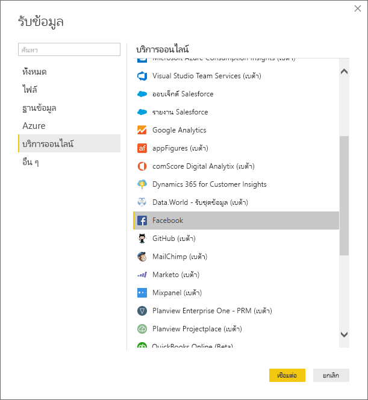
   
   กล่องโต้ตอบจะปรากฏเพื่อแจ้งเตือนคุณว่า มีความเสี่ยงจากการใช้บริการของบริษัทอื่น
   
   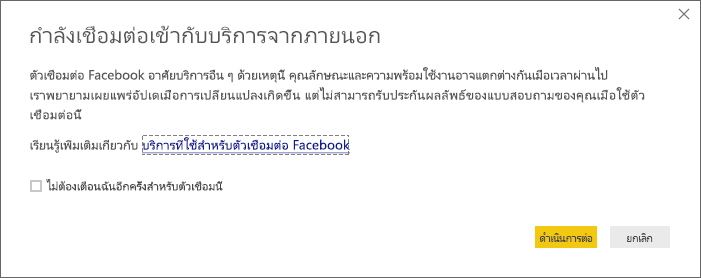
   
3. เลือก**ดำเนินต่อ** กล่องโต้ตอบ **Facebook** จะปรากฏขึ้น
   
4. พิมพ์ หรือวางชื่อหน้า **microsoftbi** ลงในกล่องข้อความ**ชื่อผู้ใช้** เลือก**โพสต์**จากดรอปดาวน์**เชื่อมต่อ** จากนั้น เลือก**ตกลง**
   
   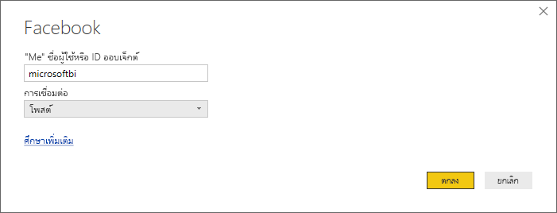
   
5. เมื่อได้รับพร้อมท์สำหรับข้อมูลประจำตัว ลงชื่อเข้าใช้บัญชีผู้ใช้ Facebook ของคุณ และอนุญาตให้ Power BI เข้าถึงบัญชีของคุณ
   
   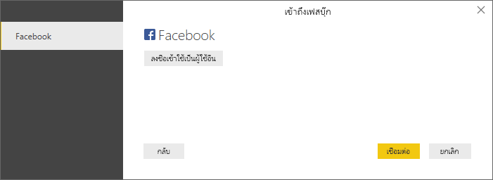

   หลังจากเชื่อมต่อไปยังหน้า Facebook ของ Power BI แล้ว คุณจะเห็นตัวอย่างของข้อมูลการ**โพสต์**ของหน้า Facebook 
   
   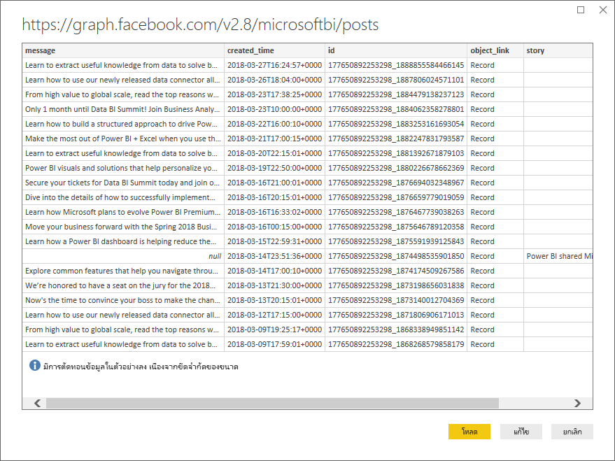
   
## จัดรูปทรง และแปลงข้อมูลนำเข้า

คุณต้องการเห็นและแสดงว่า โพสต์ไหนมีจำนวนความคิดเห็นมากที่สุดในแต่ละเวลา แต่คุณสังเกตเห็นในตัวอย่างข้อมูลการ**โพสต์** ว่าข้อมูล **created_time** อ่านและเข้าใจยาก และไม่มีข้อมูลความคิดเห็นอยู่เลย คุณจำเป็นต้องดำเนินการจัดรูปทรง และทำความสะอาดข้อมูล เพื่อดึงข้อมูลออกมาให้ได้มากที่สุด คุณสามารถใช้ **ตัวแก้ไข Power Query** ใน Power BI Desktop เพื่อแก้ไขข้อมูล ก่อนหรือหลังการนำเข้าใน Power BI Desktop ได้ 

### แยกคอลัมน์ วันที่/เวลา

ก่อนอื่น แยกค่าวันที่และเวลาในคอลัมน์ **created_time** เพื่อให้อ่านได้ง่ายขึ้น 

1. ในตัวอย่างข้อมูล Facebook เลือก**แก้ไข** 
   
   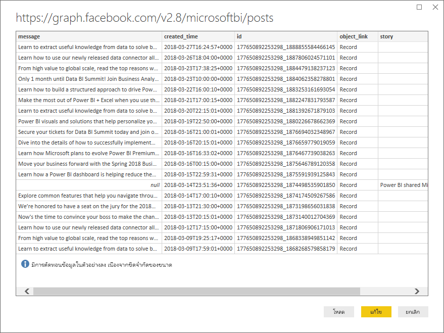
   
   **ตัวแก้ไข Power Query** ของ Power BI Desktop จะเปิดหน้าต่างใหม่ และแสดงตัวอย่างข้อมูลจากหน้า Facebook ของ Power BI 
   
   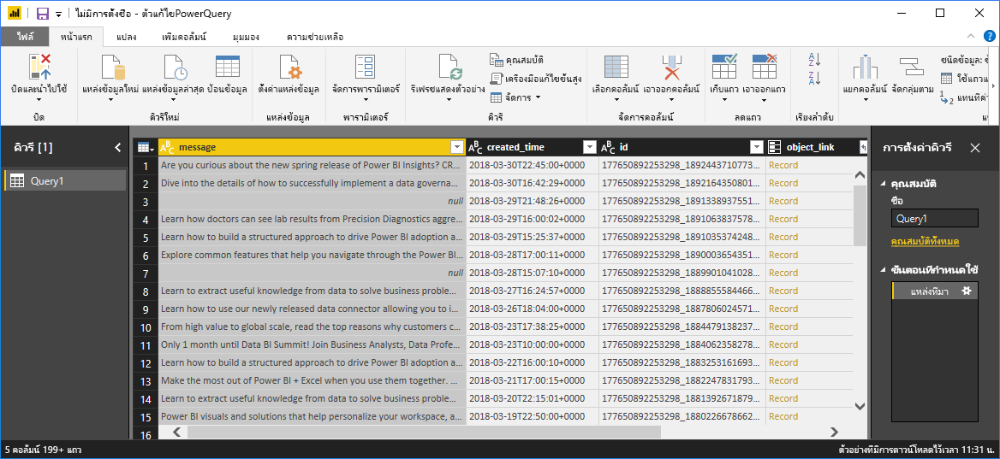
   
2. เลือกคอลัมน์ **created_time** โปรดสังเกตว่า ในขณะนี้คอลัมน์เป็นข้อมูลชนิดข้อความ ดูได้จากไอคอน **ABC** ในส่วนหัวของคอลัมน์ คลิกขวาที่ส่วนหัว แล้วเลือกในดรอปดาวน์**แบ่งคอลัมน์ > ตามตัวคั่น** หรือเลือก**แบ่งคอลัมน์ > ตามตัวคั่น** ภายใต้**แปลง**ในแท็บหน้าแรกของ ribbon  
   
   
   
3. ในกล่องโต้ตอบ**แบ่งคอลัมน์ตามตัวคั่น** เลือก**แบบกำหนดเอง**จากดรอปดาวน์ ใส่ **T** (ตัวอักษรที่เริ่มต้นเวลาใน created_time) ในฟิลด์ป้อนข้อมูล แล้วเลือก**ตกลง** 
   
   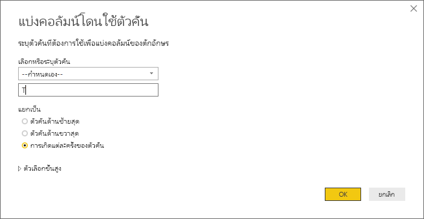
   
   คอลัมน์จะแบ่งออกเป็นสองคอลัมน์ที่ประกอบด้วย สตริงก่อนและหลังตัวคั่น **T** และตั้งชื่อว่า **created_time.1** และ **created_time.2** ตามลำดับ สังเกตว่า Power BI ตรวจสอบและเปลี่ยนชนิดข้อมูลเป็น**วันที่**สำหรับคอลัมน์แรก และ**เวลา**สำหรับคอลัมน์สองโดยอัตโนมัติ และจัดรูปแบบค่าวันที่และเวลาเพื่อให้อ่านง่ายขึ้น
   
4. เปลี่ยนชื่อคอลัมน์ โดยดับเบิลคลิกที่ส่วนหัวของแต่ละคอลัมน์ หรือเลือกทีละคอลัมน์ จากนั้นเลือก**เปลี่ยนชื่อ**ในกลุ่ม**คอลัมน์ใดก็ได้** ของแท็บ**แปลง**ใน ribbon และพิมพ์ส่วนหัวของคอลัมน์ใหม่เป็น **created_date** และ **created_time** ตามลำดับ
   
   
   
### ขยายคอลัมน์ซ้อนกัน

ตอนนี้ข้อมูลวันที่และเวลาอยู่ในรูปแบบที่คุณต้องการแล้ว คุณจะเปิดเผยข้อมูลความคิดเห็นโดยการขยายคอลัมน์ที่ซ้อนกัน 

1. เลือกคอลัมน์ **object_link** จากนั้นเลือกไอคอน  เพื่อเปิดกล่องโต้ตอบ**ขยาย/รวม** เลือก **connections** แล้วเลือก**ตกลง** 
   
   
   
   ส่วนหัวของคอลัมน์เปลี่ยนไปเป็น **object_link.connections**
2. เลือกไอคอน  อีกครั้งที่ด้านบนของคอลัมน์ **object_link.connections** เลือก **comments** แล้ว เลือก**ตกลง** ส่วนหัวของคอลัมน์เปลี่ยนไปเป็น **object_link.connections.comments**
   
3. เลือกไอคอน  ที่ด้านบนของคอลัมน์ **object_link.connections.comments** และตอนนี้เลือก**รวม**แทนที่จะเป็นขยายในกล่องโต้ตอบ เลือก**จำนวนของ id** แล้วเลือก**ตกลง** 
   
   
   
   ตอนนี้คอลัมน์แสดงจำนวนความคิดเห็นของแต่ละข้อความแล้ว 
   
4. เปลี่ยนชื่อคอลัมน์ **จำนวนของ object_link.connections.comments.id** เป็น **Number of comments**
   
5. เลือกลูกศรลงที่อยู่ถัดจากส่วนหัวของ**Number of comments** และเลือก**เรียงลำดับจากมากไปน้อย** เพื่อดูโพสต์เรียงลำดับความคิดเห็น จากมากที่สุดไปน้อยที่สุด 
   
   
   
### ตรวจสอบขั้นตอนคิวรี

ขณะที่คุณจัดรูปทรงและแปลงข้อมูลใน**ตัวแก้ไข Power Query** แต่ละขั้นตอนจะถูกบันทึกไว้ในพื้นที่ของ**ขั้นตอนที่กำหนดใช้** ของบานหน้าต่าง**ตั้งค่าคิวรี**ทางด้านขวาของ ตัวแก้ไข Power Query คุณสามารถย้อนกลับตามขั้นตอนที่กำหนดใช้ เพื่อดูว่าคุณได้เปลี่ยนแปลงอะไร และแก้ไข ลบ หรือจัดเรียงใหม่ได้ถ้าจำเป็น (แม้ว่าอาจมีความเสี่ยง เพราะการเปลี่ยนแปลงขั้นตอนก่อนหน้า สามารถทำให้ขั้นตอนภายหลังมีปัญหาได้) 

หลังจากทำการเปลี่ยนแปลงข้อมูลที่ผ่านมา ขั้นตอนที่กำหนดใช้ ของคุณควรเป็นดังต่อไปนี้:
   
   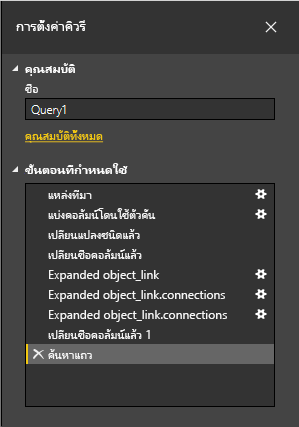
   
   >[!TIP]
   >ขั้นตอนที่กำหนดใช้ โดยพื้นฐานแล้วเป็นสูตรที่เขียนใน**ภาษา Power Query** หรือที่เรียกว่าภาษา **M** เมื่อต้องการดูและแก้ไขสูตร เลือก**เครื่องมือแก้ไขขั้นสูง**ในกลุ่ม**คิวรี** ของแท็บหน้าแรกของ ribbon 

### นำเข้าข้อมูลที่ถูกแปลง

เมื่อคุณพอใจกับข้อมูลแล้ว เลือก**ปิด & กำหนดใช้** > **ปิด & กำหนดใช้** ในแท็บหน้าแรกของ ribbon เพื่อนำเข้าไปใน Power BI Desktop 
   
   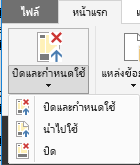
   
   กล่องโต้ตอบจะแสดงความคืบหน้าของการโหลดข้อมูลลงในรูปแบบข้อมูล Power BI Desktop 
   
   
   
   เมื่อข้อมูลถูกโหลดแล้ว จะปรากฏขึ้นในมุมมองรายงาน เป็นคิวรีใหม่ในรายการเขตข้อมูล
   
   
   
## ใช้ข้อมูลในการแสดงภาพรายงาน 

ตอนนี้คุณได้นำเข้าข้อมูลจากหน้า Facebook แล้ว คุณสามารถรับข้อมูลเชิงลึกเกี่ยวกับข้อมูลคุณได้อย่างรวดเร็ว และง่ายดาย โดยใช้การแสดงภาพ การสร้างการแสดงภาพเป็นเรื่องง่าย เพียงแค่เลือกเขตข้อมูล หรือลากจากรายการ**เขตข้อมูล**ลงในพื้นที่รายงาน

### สร้างแผนภูมิแท่ง

1. ในมุมมองรายงาน Power BI Desktop เลือก**ข้อความ**จากรายการเขตข้อมูล หรือลากไปที่พื้นที่ทำงาน ตารางแสดงโพสต์ข้อความทั้งหมดจะปรากฏบนพื้นที่ทำงาน 
   
   
   
2. เลือกที่ตาราง แล้วเลือก**Number of comments**จากรายการเขตข้อมูล หรือลากลงในตาราง 
   
3. เลือกไอคอน**แผนภูมิแท่งแบบเรียงซ้อน**ในบานหน้าต่าง การจัดรูปแบบการแสดงข้อมูล ตารางจะเปลี่ยนเป็นแผนภูมิแท่ง แสดงจำนวนความคิดเห็นของแต่ละโพสต์ 
   
   
   
4. เลือกจุดไข่ปลา (...) ที่มุมบนขวาของการแสดงภาพ แล้วเลือก**เรียงตาม Number of comments** เพื่อเรียงลำดับตารางตามจำนวนความคิดเห็น จากมากไปหาน้อย 
   
   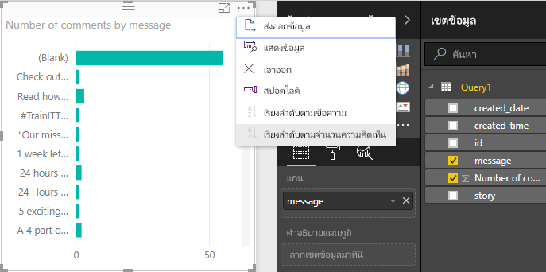
   
5. สังเกตว่า ความคิดเห็นจำนวนมากที่สุด ถูกเชื่อมโยงกับข้อความที่**ว่างเปล่า** (โพสต์เหล่านี้อาจเป็นเรื่องราว ลิงก์ วิดีโอ หรือเนื้อหาอื่น ๆ ที่ไม่ใช่ข้อความ) เมื่อต้องการกรองแถวที่ว่างออก เลือก**message (ทั้งหมด)** ภายใต้**ตัวกรอง**ที่ด้านล่างของบานหน้าต่าง การจัดรูปแบบการแสดงข้อมูล เลือก**เลือกทั้งหมด** แล้วเลือก**ว่าง**เพื่อยกเลิกการเลือกเฉพาะรายการนี้ รายการตัวกรองที่เปลี่ยนไปเป็น**message ที่ไม่ใช่ (ว่าง)** และแถวว่างได้หายไปจากการแสดงภาพแผนภูมิ 
   
   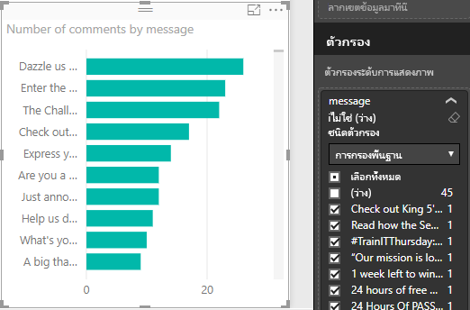
   
### จัดรูปแบบแผนภูมิ

การแสดงภาพกำลังน่าสนใจมากขึ้น แต่คุณไม่สามารถมองเห็นข้อความส่วนใหญ่ในแผนภูมิ เพื่อแสดงข้อความที่โพสต์ให้มากขึ้น:

1. ใช้ที่จับบนแผนภูมิ ปรับขนาดแผนภูมิให้มีขนาดใหญ่ที่สุดเท่าที่เป็นไปได้ 
   
2. เลือกที่แผนภูมิ แล้วเลือก**ไอคอนรูปแบบ** (รูปลูกกลิ้งทาสี) ในบานหน้าต่าง การจัดรูปแบบการแสดงข้อมูล
   
3. เลือกลูกศรลงที่อยู่ถัดจาก **แกน Y** แล้วลากตัวเลื่อนอยู่ถัดจาก**ขนาดสูงสุด**ไปทางด้านขวาจนสุด (50%) 
4. นอกจากนี้ ลด**ขนาดของข้อความ**ให้เหลือ **10** เพื่อแสดงข้อความได้มากขึ้น
   
   
   
   แผนภูมิตอนนี้แสดงเนื้อหาของโพสต์มากขึ้นแล้ว 
   
   
   
แกน X (จำนวนความคิดเห็น) ของแผนภูมิไม่ได้แสดงค่าที่ชัดเจน และดูหลุดหายไปที่ด้านล่างของแผนภูมิ คุณตัดสินใจใช้ป้ายชื่อข้อมูลแทน 

1. เลือกไอคอนรูปแบบ จากนั้น เลือกแถบเลื่อนที่อยู่ถัดจาก**แกน X** เพื่อ**ปิด**ใช้งาน 
   
2. เลือกแถบเลื่อนที่อยู่ถัดจาก**ป้ายชื่อข้อมูล** เพื่อ**เปิด**ใช้งาน ตอนนี้ แผนภูมิแสดงจำนวนความคิดเห็นของแต่ละโพสต์ที่ชัดเจน
   
   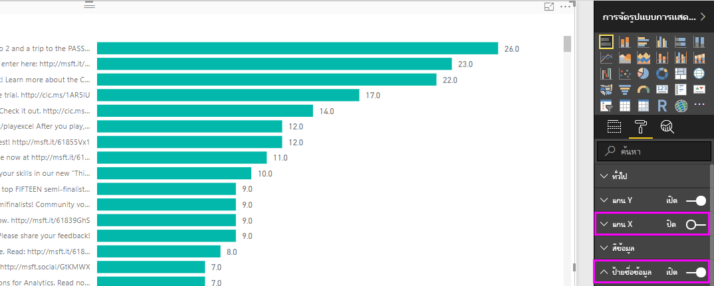
   
### แก้ไขชนิดข้อมูล

นั่นดีขึ้นแล้ว แต่มีป้ายชื่อข้อมูลทั้งหมดมีจุดทศนิยม **.0** ซึ่งดูขัดตาและไม่ถูกต้อง เพราะ**จำนวนความคิดเห็น**จะต้องเป็นจำนวนเต็ม คุณจำเป็นต้องเปลี่ยนชนิดข้อมูลของคอลัมน์**จำนวนความคิดเห็น**ให้เป็นจำนวนเต็ม

1. เพื่อแก้ไขชนิดของข้อมูล คลิกขวา **Query1** ในรายการเขตข้อมูล หรือโฮเวอร์เหนือคิวรีแล้วเลือกจุดไข่ปลา (...) **ตัวเลือกเพิ่มเติม** จากนั้นเลือก**แก้ไขคิวรี** คุณยังสามารถเลือก**แก้ไขคิวรี**จากบริเวณ**ข้อมูลภายนอก** ของแท็บหน้าแรกใน ribbon จากนั้นเลือก**แก้ไขคิวรี**จากดรอปดาวน์ Power BI Desktop เปิด **ตัวแก้ไข Power Query** เป็นอีกหน้าต่าง
   
   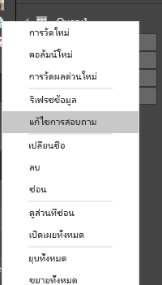     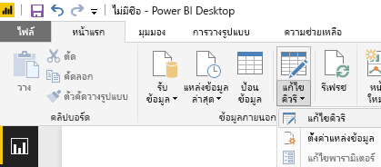
   
2. ในตัวแก้ไข Power Query เลือกคอลัมน์**Number of comments** และเปลี่ยนชนิดข้อมูลเป็น**จำนวนเต็ม** โดยวิธีใดวิธีหนึ่งต่อไปนี้: 
   - เลือกไอคอน **1.2** ที่อยู่ถัดจากส่วนหัวของคอลัมน์**Number of comments** และเลือก**จำนวนเต็ม**จากดรอปดาวน์ หรือ
   - คลิกขวาที่ส่วนหัวของคอลัมน์ และเลือก**เปลี่ยนชนิด > จำนวนเต็ม** หรือ
   - เลือก**ชนิดข้อมูล: เลขทศนิยม** ในกลุ่ม**แปลง**ของแท็บหน้าแรก หรือกลุ่ม**คอลัมน์ใดก็ได้** ของแท็บ**แปลง** แล้ว เลือก**จำนวนเต็ม**
   
   ไอคอนในส่วนหัวของคอลัมน์เปลี่ยนไปเป็น **123** ซึ่งระบุชนิดข้อมูลเป็นจำนวนเต็ม
   
   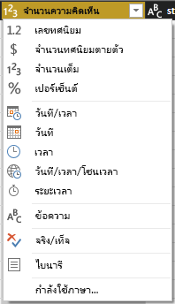
   
3. เลือก**ปิด & กำหนดใช้** หรือเพียงแค่**กำหนดใช้**เพื่อเปลี่ยน แต่ยังคงเปิดหน้าต่างตัวแก้ไข Power Query ไว้ ทันทีที่เปลี่ยน ป้ายชื่อข้อมูลบนแผนภูมิกลายเป็นจำนวนเต็ม 
   
   
   
### สร้างตัวแบ่งส่วนข้อมูลวันที่

คุณต้องการแสดงภาพ จำนวนความคิดเห็นบนโพสต์ เทียบกับเวลา คุณสามารถสร้างตัวแบ่งส่วนข้อมูล เพื่อกรองข้อมูลแผนภูมิที่ช่วงเวลาต่าง ๆ กัน 

1. คลิกที่พื้นที่ว่างของพื้นที่ทำงาน จากนั้นเลือก **ไอคอนตัวแบ่งส่วนข้อมูล** ในบานหน้าต่าง การจัดรูปแบบการแสดงข้อมูล ตัวแบ่งส่วนข้อมูลที่ว่างเปล่าจะปรากฏขึ้น 
   
   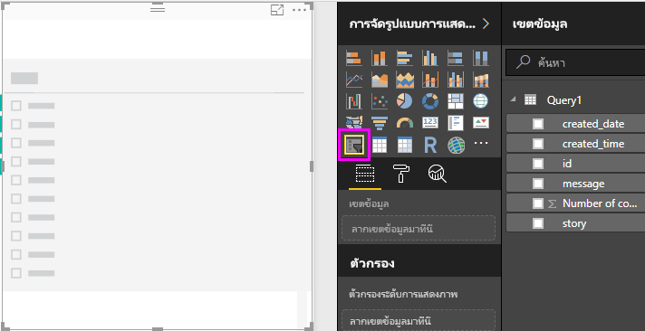
   
2. เลือกเขตข้อมูล **created_date** จากรายการเขตข้อมูล หรือลากลงในตัวแบ่งส่วนข้อมูลใหม่ ตัวแบ่งส่วนข้อมูลเปลี่ยนไปเป็นแถบเลื่อนช่วงวันที่ ตามชนิดของเขตข้อมูล
   
   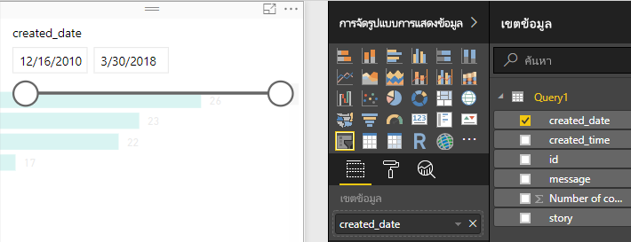
   
3. ย้ายจุดจับตัวเลื่อน เพื่อเลือกช่วงวันที่แตกต่างกัน และสังเกตว่าแผนภูมิกรองข้อมูลอย่างไร คุณยังสามารถเลือกเขตข้อมูลวันที่ในตัวแบ่งส่วนข้อมูล และพิมพ์ในวันที่ที่ต้องการ หรือเลือกจากปฏิทินที่ป็อปอัพ
    
   
   
### จัดรูปแบบการแสดงภาพ

คุณตัดสินใจที่จะตั้งชื่อที่สื่อความหมายและน่าสนใจให้กับแผนภูมิ 

1. เลือกที่แผนภูมิ และเลือกไอคอน**รูปแบบ** แล้วเลือกลูกศรดรอปดาวน์เพื่อขยาย**ชื่อเรื่อง**
2. การเปลี่ยนแปลง**ข้อความสำหรับชื่อเรื่อง**เมื่อต้องการ**จำนวนความคิดเห็นต่อโพสต์** 
3. เลือกลูกศรแบบหล่นลงที่อยู่ถัดจาก**สีแบบอักษร** เลือกสีเขียวเพื่อให้ตรงกับแถบสีเขียวของการแสดงภาพ
4. เพิ่ม**ขนาดแบบอักษร**เป็น **10** และเปลี่ยน**ตระกูลแบบอักษร**เป็น **Segoe (Bold)**

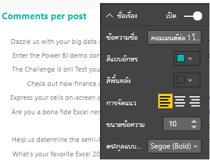

ทดลองตัวเลือกจัดรูปแบบและการตั้งค่าอื่น ๆ เพื่อปรับเปลี่ยนการแสดงภาพของคุณ 

## สร้างการแสดงภาพเพิ่มเติม

คุณน่าจะเห็นแล้วว่า การปรับเปลี่ยนการแสดงภาพในรายงานของคุณ เพื่อนำเสนอข้อมูลในแบบที่คุณต้องการนั้น เป็นเรื่องง่าย เพื่อเป็นตัวอย่าง ลองใช้ข้อมูลนำเข้าจาก Facebook เพื่อสร้างแผนภูมิเส้นที่แสดงจำนวนความคิดเห็นเทียบกับเวลา

Power BI Desktop ให้ประสบการณ์ที่ราบรื่น ตั้งแต่การรับข้อมูลจากแหล่งข้อมูลต่าง ๆ และจัดรูปทรงให้ตรงกับความต้องการการวิเคราะห์ของคุณ ไปจนถึงการแสดงข้อมูลนี้ในแบบที่สวยงามและโต้ตอบได้ เมื่อรายงานของคุณพร้อมแล้ว คุณสามารถ[อัปโหลดไปยังบริการของ Power BI](desktop-upload-desktop-files.md) และสร้างแดชบอร์ดจากรายงาน ซึ่งคุณสามารถแชร์ให้กับผู้ใช้ Power BI อื่นได้

## ขั้นตอนถัดไป
* [อ่านบทช่วยสอนอื่น ๆ ของ Power BI Desktop](http://go.microsoft.com/fwlink/?LinkID=521937)
* [ดูวิดีโอเกี่ยวกับ Power BI Desktop](http://go.microsoft.com/fwlink/?LinkID=519322)
* [เยี่ยมชมกระดานสนทนา Power BI](http://go.microsoft.com/fwlink/?LinkID=519326)
* [อ่านบล็อกของ Power BI](http://go.microsoft.com/fwlink/?LinkID=519327)

