# บทช่วยสอน: วิเคราะห์ข้อมูลเว็บเพจโดยใช้ Power BI Desktop

ในฐานะที่เป็นแฟนฟุตบอลมานาน คุณต้องการรายงานของแชมป์ ฟุตบอลชิงแชมป์แห่งชาติยุโรป (ถ้วยฟุตบอลยูโร) ในแต่ละปี ด้วย Power BI Desktop คุณสามารถนำเข้าข้อมูลนี้จากเว็บเพจลงในรายงาน และสร้างการแสดงภาพที่แสดงข้อมูล ในบทช่วยสอนนี้ คุณจะเรียนรู้วิธีการใช้ Power BI Desktop เพื่อ:

- เชื่อมต่อกับแหล่งข้อมูลบนเว็บ และนำทางไปยังตารางที่มี
- จัดรูปร่างและแปลงข้อมูลใน**ตัวแก้ไข Power Query**
- ตั้งชื่อคิวรี และนำเข้าข้อมูลลงในรายงาน Power BI Desktop และ 
- สร้าง และกำหนดแผนที่และภาพแผนภูมิวงกลม

## เชื่อมต่อกับแหล่งข้อมูลบนเว็บ

คุณสามารถรับข้อมูลแชมป์ UEFA จากตารางผลลัพธ์บนหน้า UEFA European Football Championship ของวิกิพีเดียที่ http://en.wikipedia.org/wiki/UEFA_European_Football_Championship ได้ 

สังเกตว่า การเชื่อมต่อเว็บจะใช้การรับรองความถูกต้องพื้นฐานเท่านั้น เว็บไซต์ที่จำเป็นต้องรับรองความถูกต้องอาจไม่ทำงานกับตัวเชื่อมต่อเว็บ

เพื่อนำเข้าข้อมูล:

1. ใน Power BI Desktop แท็บ ribbon **หน้าแรก** ดรอปดาวน์ลูกศรที่อยู่ถัดจาก**รับข้อมูล** แล้วเลือก**เว็บ**
   
   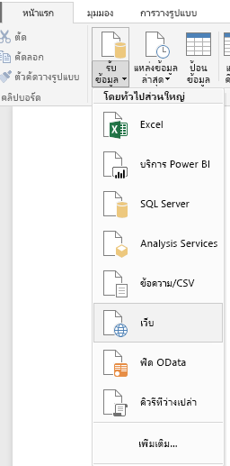 
   
   >[!NOTE]
   >คุณยังสามารถเลือกรายการ**รับข้อมูล**โดยตรง หรือเลือก**รับข้อมูล**จากกล่องโต้ตอบ**เริ่มต้นใช้งาน**ใน Power BI แล้วเลือก**เว็บ** จากส่วน**ทั้งหมด**หรือ**อื่นๆ**ของกล่องโต้ตอบ**รับข้อมูล** จากนั้นเลือก**เชื่อมต่อ**
   
2. ในกล่องโต้ตอบ**จากเว็บ** วาง URL `http://en.wikipedia.org/wiki/UEFA_European_Football_Championship`ลงในกล่องข้อความ **URL** จากนั้นเลือก**ตกลง**
   
    
   
   หลังจากที่เชื่อมต่อไปยังเว็บเพจวิกิพีเดียแล้ว กล่องโต้ตอบ**การนำทาง**ของ Power BI จะแสดงรายการตารางบนหน้าที่พร้อมใช้งาน คุณสามารถเลือกชื่อตารางใด ๆ เพื่อแสดงตัวอย่างของข้อมูล ตาราง **Results[edit]** มีข้อมูลที่คุณต้องการ ถึงแม้ว่าจะไม่อยู่ในรูปร่างที่คุณต้องการ คุณจะต้องจัดรูปร่างและล้างข้อมูล ก่อนที่จะโหลดลงในรายงานของคุณ 
   
   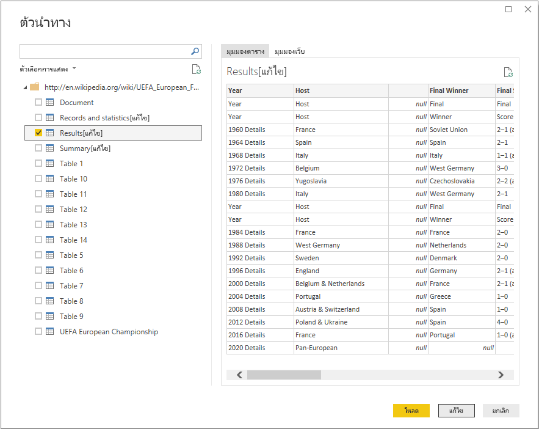
   
   >[!NOTE]
   >บานหน้าต่าง**ตัวอย่าง**แสดงตารางล่าสุดที่เลือก แต่ตารางที่เลือกทั้งหมดจะโหลดลงใน**ตัวแก้ไข Power Query** เมื่อคุณเลือก**แก้ไข**หรือ**โหลด** 
   
3. เลือกตาราง **Results[edit]** ในรายการ**การนำทาง** จากนั้นเลือก**แก้ไข** 
   
   ตัวอย่างของตารางเปิดขึ้นใน**ตัวแก้ไข Power Query** ที่คุณสามารถใช้การแปลงเพื่อล้างข้อมูล 
   
   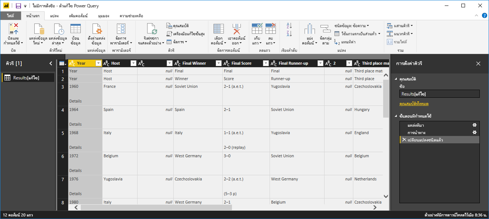
   
## จัดรูปร่างข้อมูลในตัวแก้ไข Power Query

คุณต้องการทำให้ข้อมูลง่ายต่อการอ่าน โดยการแสดงเฉพาะปีและประเทศที่ชนะ คุณสามารถใช้**ตัวแก้ไข Power Query** เพื่อทำขั้นตอนการจัดรูปร่างและล้างข้อมูลเหล่านี้ได้

ก่อนอื่น เอาคอลัมน์ทั้งหมดยกเว้น **Year** และ **Final Winners** ออกจากตาราง

1. ในตาราง**ตัวแก้ไข Power Query** เลือกคอลัมน์ **Year** และ **Final Winners** (กดแป้น **Ctrl** ค้างไว้เพื่อเลือกหลายรายการ)
   
2. คลิกขวา แล้วเลือก**เอาคอลัมน์อื่นออก**จากเมนูดรอปดาวน์ หรือเลือก **เอาคอลัมน์ออก** > **เอาคอลัมน์อื่นออก** จากกลุ่ม**จัดการคอลัมน์**ในแท็บ ribbon **หน้าแรก** เพื่อเอาคอลัมน์อื่น ๆ ทั้งหมดออกจากตาราง 
   
   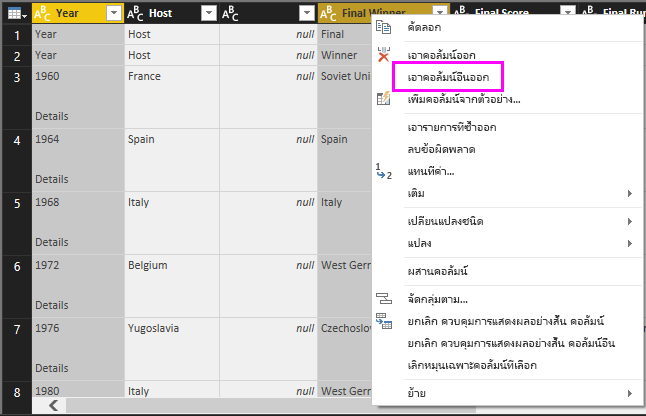 หรือ 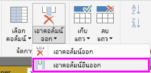

จากนั้น เอาคำว่า **Details** ออกจากเซลล์ในคอลัมน์ **Year**

1. เลือกคอลัมน์**ปี**
   
2. คลิกขวา แล้วเลือก**แทนที่ค่า**จากเมนูดรอปดาวน์ หรือเลือก**แทนที่ค่า**จากกลุ่ม**แปลง**ในแท็บ**หน้าแรก**ของ ribbon (ยังพบในกลุ่ม**คอลัมน์ใด ๆ** ในแท็บ**แปลง**) 
   
   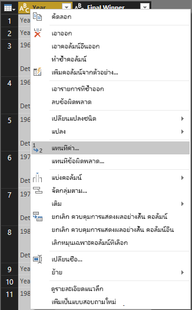 หรือ 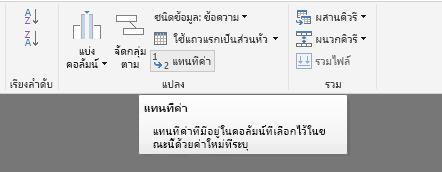
   
3. ในกล่องโต้ตอบ**แทนที่ค่า** พิมพ์ **Details** ในกล่องข้อความ**ค่าที่จะค้นหา** และปล่อยให้กล่องข้อความ**แทนที่ด้วย**ว่าง แล้วเลือก**ตกลง** เพื่อลบคำว่า "Details" จากรายการ **Year**
   
   

เซลล์ **Year** บางเซลล์มีคำว่า "Year" แทนที่จะเป็นค่าของปี คุณสามารถกรองคอลัมน์ **Year** เพื่อแสดงเฉพาะแถวที่ไม่มีคำว่า "Year" ได้ 

1. เลือกลูกศรดรอปดาวน์ตัวกรองบนคอลัมน์ **Year**
   
2. ในรายการดรอปดาวน์ เลื่อนลง และยกเลิกการเลือกกล่องกาเครื่องหมายที่ถัดจากตัวเลือก **Year** จากนั้นเลือก**ตกลง** เพื่อเอาแถวที่มีคำว่า "Year" ออกจากคอลัมน์ **Year** 

   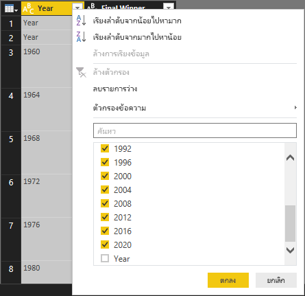

หลังจากที่คุณได้ล้างข้อมูลในคอลัมน์ **Year** แล้ว คุณสามารถทำงานต่อกับคอลัมน์ **Final Winner** ได้ เนื่องจากคุณกำลังหาข้อมูลผู้ชนะในตอนนี้ คุณสามารถเปลี่ยนชื่อคอลัมน์นี้เป็น **Country** ได้ เพื่อเปลี่ยนชื่อคอลัมน์:

1. ดับเบิลคลิก หรือแตะค้างไว้ในส่วนหัวของคอลัมน์ **Final Winner** หรือ 
   - คลิกขวาที่ส่วนหัวของคอลัมน์ **Final Winner** และเลือก**เปลี่ยนชื่อ**จากรายการดรอปดาวน์ หรือ 
   - เลือกคอลัมน์ **Final Winner** และเลือก**เปลี่ยนชื่อ**จากกลุ่ม**คอลัมน์ใดก็ได้** ในแท็บ**แปลง**ของ ribbon 
   
   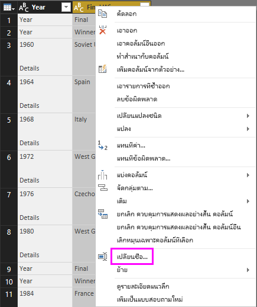 หรือ 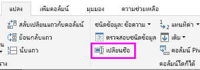
   
2. พิมพ์ **Country** ในส่วนหัวแล้วกด **Enter** เพื่อเปลี่ยนชื่อคอลัมน์

คุณยังต้องการกรองแถวเช่น "2020" ที่มีค่า null ในคอลัมน์ **Country** คุณสามารถใช้เมนูตัวกรอง เช่นเดียวกับที่คุณได้ทำกับค่า **Year** หรือคุณสามารถ:

1. คลิกขวาบนเซลล์ **Country** ในแถว **2020** ซึ่งมีค่าเป็น *null* 
2. เลือก **ตัวกรองข้อความ** > **ไม่เท่ากับ** ในเมนูบริบทเพื่อเอาแถวใด ๆ ที่ประกอบด้วยค่าของเซลล์ดังกล่าวออก
   
   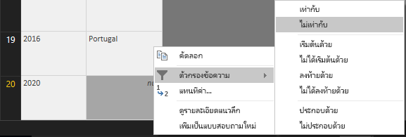
   
## นำเข้าคิวรีลงในมุมมองรายงาน

ตอนนี้คุณได้จัดรูปร่างข้อมูลตามที่คุณต้องการแล้ว คุณก็พร้อมที่จะตั้งชื่อคิวรีของคุณว่า "Euro Cup Winners" และนำเข้าข้อมูลลงในรายงานของคุณ

1. ในบานหน้าต่าง**ตั้งค่าคิวรี** ในกล่องข้อความ**ชื่อ** พิมพ์ **Euro Cup Winners** แล้วกด **Enter**
   
   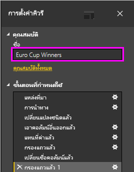

2. เลือก**ปิด & กำหนดใช้** > **ปิด & กำหนดใช้** จากแท็บ**หน้าแรก**ของ ribbon
   
   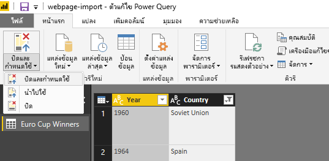
   
คิวรีจะโหลดลงใน**มุมมองรายงาน** Power BI Desktop ซึ่งคุณสามารถเห็นได้ในบานหน้าต่าง**เขตข้อมูล** 
   
   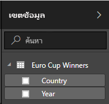
>[!TIP]
>คุณสามารถกลับไปยัง**ตัวแก้ไข Power Query** ได้เสมอ เพื่อแก้ไขและปรับปรุงคิวรีของคุณโดย:
>- เลือก **ตัวเลือกเพิ่มเติม** จุดไข่ปลา (**...** ) ถัดจาก **Euro Cup Winners** ในบานหน้าต่าง**เขตข้อมูล** และเลือก**แก้ไขคิวรี**จากรายการดรอปดาวน์ หรือ
>- เลือก **แก้ไขคิวรี** > **แก้ไขคิวรี** ในกลุ่ม**ข้อมูลภายนอก**ของแท็บ ribbon **หน้าแรก**ในมุมมองรายงาน 

## สร้างการแสดงภาพ

เพื่อสร้างการแสดงภาพตามข้อมูลของคุณ: 

1. เลือกเขตข้อมูล **Country** ในบานหน้าต่าง**เขตข้อมูล** หรือลากเขตข้อมูลนี้ไปยังพื้นที่รายงาน Power BI Desktop รู้จักข้อมูลว่าเป็นชื่อประเทศ และสร้างแสดงภาพ**แผนที่**โดยอัตโนมัติ 
   
   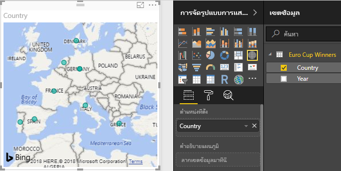
   
2. ขยายแผนที่ โดยการลากจุดจับที่มุมเพื่อให้ชื่อประเทศที่เป็นแชมป์ทั้งหมดมองเห็นได้  

   
   
3. แผนที่แสดงจุดข้อมูลสำหรับทุกประเทศที่เคยได้แชมป์ฟุตบอลยูโร เพื่อทำให้มีขนาดของแต่ละจุดข้อมูล แสดงจำนวนครั้งที่ประเทศได้แชมป์ ลากเขตข้อมูล **Year** ไปยัง**ลากเขตข้อมูลมาที่นี่** ภายใต้**ขนาด**ในส่วนล่างของบานหน้าต่าง**การจัดรูปแบบการแสดงข้อมูล** เขตข้อมูลจะเปลี่ยนเป็นหน่วยวัด**นับจำนวน Year** โดยอัตโนมัติ และการแสดงภาพของแผนที่ตอนนี้แสดงจุดข้อมูลขนาดใหญ่ขึ้นสำหรับประเทศที่เป็นแชมป์มากกว่า 
   
   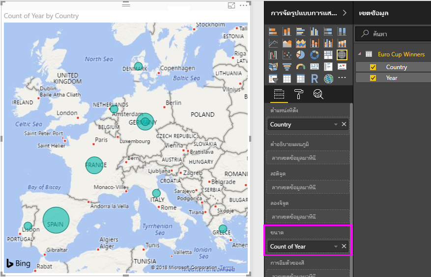
   

## การแสดงภาพที่กำหนดด้วยตนเอง

ตามที่คุณเห็น เป็นเรื่องง่ายมากที่จะสร้างการแสดงภาพจากข้อมูลของคุณ นอกจากนี้ยังเป็นเรื่องง่ายในการกำหนดการแสดงภาพของคุณ ให้นำเสนอข้อมูลในแบบที่คุณต้องการได้ดียิ่งขึ้น 

### จัดรูปแบบแผนที่
คุณสามารถเปลี่ยนลักษณะของการแสดงภาพโดยเลือกที่วิชวล แล้วเลือกไอคอน**รูปแบบ** (รูปลูกกลิ้งทาสี) ในบานหน้าต่าง**การจัดรูปแบบการแสดงข้อมูล**ได้ ตัวอย่างเช่น จุดข้อมูล "Germany" ในการแสดงภาพของคุณอาจทำให้เข้าใจผิดได้ เนื่องจากเยอรมนีตะวันตกชนะสองครั้ง และเยอรมนีชนะหนึ่งครั้ง และแผนที่แสดงเป็นจุดสองจุดซ้อนทับกัน แทนที่จะมาแยกหรือบวกเข้าด้วยกัน คุณสามารถลงสีให้สองจุดนี้มีสีแตกต่างกันเพื่อเน้นตรงนี้ คุณยังสามารถตั้งชื่อให้แผนที่ เพื่อให้สื่อความหมายและน่าสนใจมากขึ้น 

1. เลือกที่การแสดงภาพ แล้วเลือกไอคอน**รูปแบบ** จากนั้นเลือก**สีของข้อมูล** เพื่อขยายตัวเลือกสีของข้อมูล 
   
   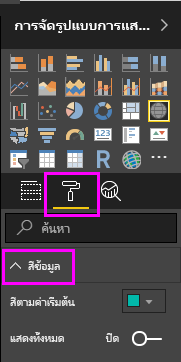
   
2. เปลี่ยนตัวเลือก**แสดงทั้งหมด**ให้เป็น**เปิด** จากนั้นเลือกรายการดรอปดาวน์ที่อยู่ถัดจาก **West Germany** แล้วเลือกสีเหลือง 
   
   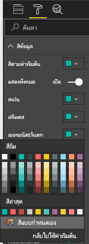
   
3. เลือก**ชื่อเรื่อง**เพื่อขยายตัวเลือกชื่อเรื่อง และในเขตข้อมูล**ข้อความสำหรับชื่อเรื่อง** พิมพ์ **Euro Cup Winners** แทนชื่อเรื่องปัจจุบัน 
4. เปลี่ยน**สีแบบอักษร**เป็นสีแดง **ขนาดของข้อความ**เป็น **12** และ**ตระกูลแบบอักษร**เป็น **Segoe (Bold)** 
   
   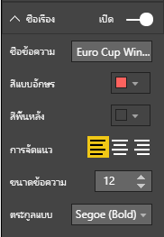
   

การแสดงภาพแผนที่ของคุณ ตอนนี้มีลักษณะดังนี้:

   
### การเปลี่ยนชนิดของการแสดงภาพ
คุณสามารถเปลี่ยนชนิดของการแสดงภาพ โดยเลือกที่ภาพดังกล่าว จากนั้น เลือกอีกไอคอนที่ด้านบนของบานหน้าต่าง**การจัดรูปแบบการแสดงข้อมูล** ตัวอย่างเช่น การแสดงภาพแผนที่ของคุณไม่มีข้อมูลสำหรับสหภาพโซเวียต และเชโกสโลวาเกีย เนื่องจากประเทศเหล่านั้นไม่มีอยู่บนแผนที่โลกอีกต่อไป การแสดงภาพอื่น เช่นแผนที่ต้นไม้ หรือแผนภูมิวงกลม อาจแม่นยำกว่าเนื่องจากจะแสดงทุกค่า 

เพื่อเปลี่ยนแผนที่ให้เป็นแผนภูมิวงกลม เลือกที่แผนที่ จากนั้นเลือกไอคอน**แผนภูมิวงกลม** ในบานหน้าต่าง**การจัดรูปแบบการแสดงข้อมูล** 
   
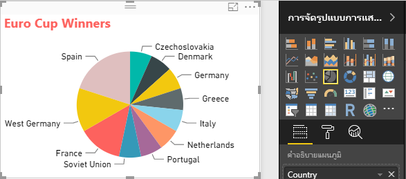

>[!TIP]
>- คุณสามารถใช้ตัวเลือกการจัดรูปแบบ**สีข้อมูล** เพื่อทำให้ "Germany" และ "West Germany" เป็นสีเดียวกัน 
>- เพื่อจัดกลุ่มประเทศที่ได้แชมป์มากที่สุดไว้ด้วยกันบนแผนภูมิวงกลม เลือกที่จุดไข่ปลา (**...** ) ที่มุมบนขวาของการแสดงภาพ จากนั้นเลือก**เรียงลำดับตามจำนวนของ Year** จากรายการดรอปดาวน์ 

Power BI Desktop ให้ประสบการณ์ที่ราบรื่น ตั้งแต่การรับข้อมูลจากแหล่งข้อมูลต่าง ๆ และจัดรูปทรงให้ตรงกับความต้องการการวิเคราะห์ของคุณ ไปจนถึงการแสดงข้อมูลนี้ในแบบที่สวยงามและโต้ตอบได้ เมื่อรายงานของคุณพร้อมแล้ว คุณสามารถ[อัปโหลดไปยัง Power BI](desktop-upload-desktop-files.md)ได้ และสร้างแดชบอร์ดโดยยึดตามรายงานดังกล่าวที่คุณสามารถใช้ร่วมกันกับผู้ใช้ Power BI อื่นได้

## ดูเพิ่มเติม
* [อ่านบทช่วยสอนอื่น ๆ Power BI Desktop](http://go.microsoft.com/fwlink/?LinkID=521937)
* [ดูวิดีโอ Power BI Desktop](http://go.microsoft.com/fwlink/?LinkID=519322)
* [เยี่ยมชมกระดานสนทนา Power BI](http://go.microsoft.com/fwlink/?LinkID=519326)
* [อ่านบล็อก Power BI](http://go.microsoft.com/fwlink/?LinkID=519327)

