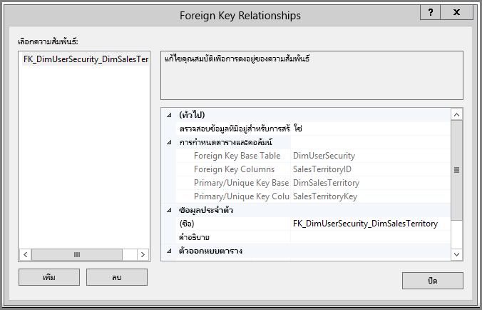
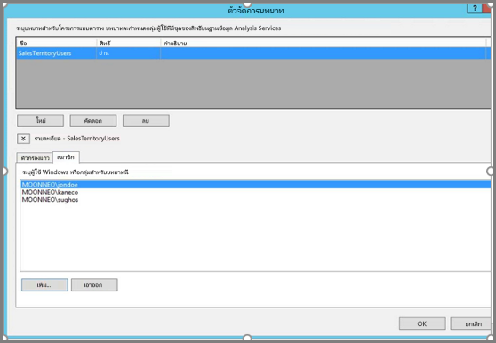
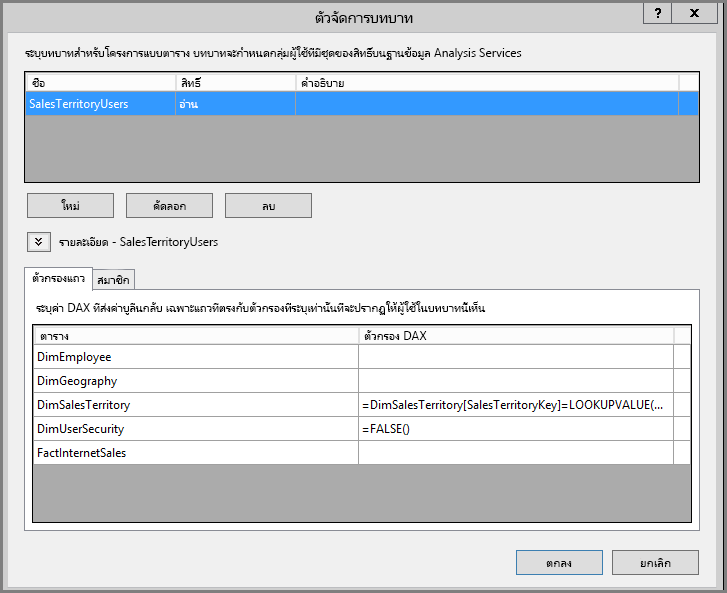
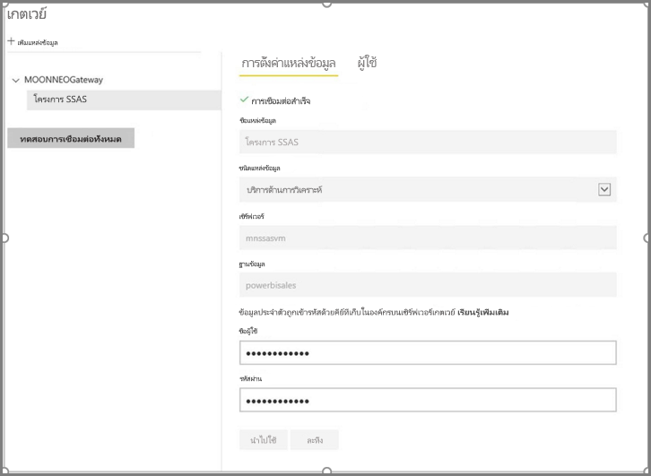
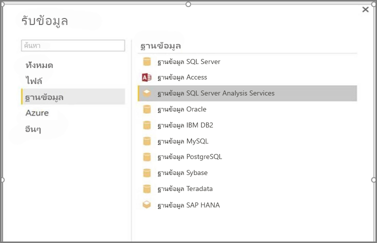
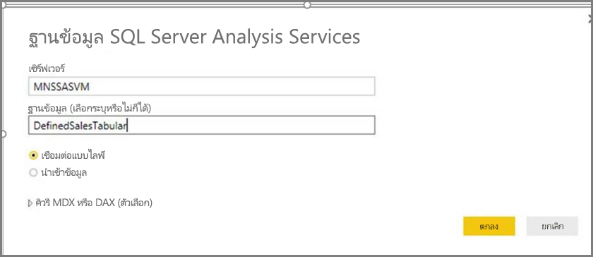
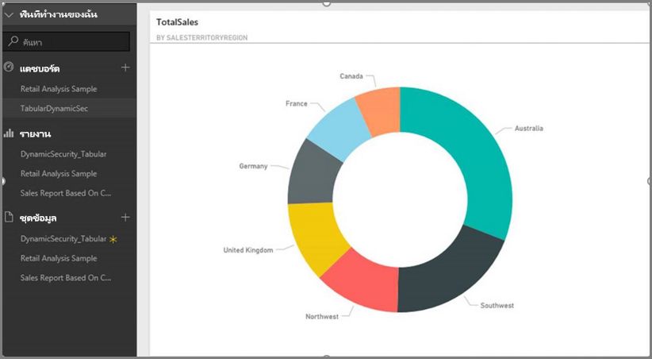
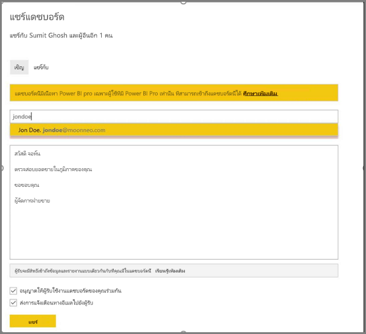
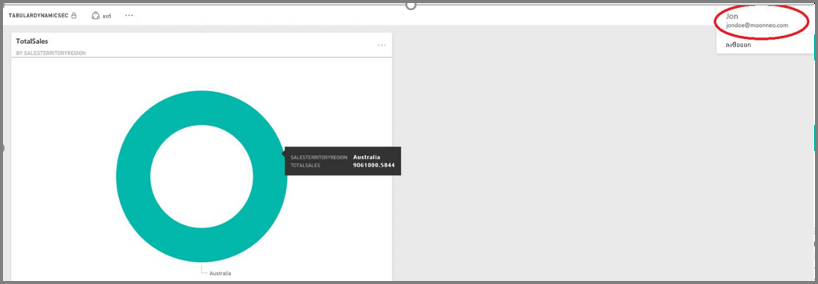

# <a name="implement-row-level-security-in-an-analysis-services-tabular-model"></a>ใช้การรักษาความปลอดภัยระดับแถวในแบบจำลองตาราง Analysis Services

ใช้ชุดข้อมูลตัวอย่างเพื่อทำงานผ่านขั้นตอนด้านล่าง บทช่วยสอนนี้จะแสดงวิธีใช้[**ความปลอดภัยระดับแถว**](service-admin-rls.md)ใน**รูปแบบตาราง Analysis Services**และใช้ในรายงาน Power BI 

* สร้างตารางความปลอดภัยใหม่ในฐานข้อมูล [**AdventureworksDW2012**](https://github.com/Microsoft/sql-server-samples/releases/tag/adventureworks)
* สร้างแบบจำลองแบบตารางด้วยตารางที่มีข้อเท็จจริงและมิติข้อมูลที่จำเป็น
* กำหนดบทบาทและสิทธิ์ของผู้ใช้
* ปรับใช้รูปแบบไปยังอินสแตนซ์**ตาราง Analysis Services**
* สร้างรายงาน Power BI Desktop ที่แสดงข้อมูลที่กำหนดให้เหมาะสมกับการเข้าถึงรายงานของผู้ใช้
* ปรับใช้รายงานไปยัง**บริการของ Power BI**
* สร้างแดชบอร์ดใหม่ตามรายงาน
* แชร์แดชบอร์ดกับเพื่อนร่วมงานของคุณ 

บทช่วยสอนนี้จะต้องมีฐานข้อมูล [**AdventureworksDW2012**](https://github.com/Microsoft/sql-server-samples/releases/tag/adventureworks)

## <a name="task-1-create-the-user-security-table-and-define-data-relationship"></a>งานที่ 1: สร้างตารางความปลอดภัยของผู้ใช้และกำหนดความสัมพันธ์ข้อมูล

คุณสามารถหาบทความมากมายที่อธิบายถึงวิธีกำหนดระดับการรักษาความปลอดภัยแบบไดนามิกระดับแถวด้วยรูปแบบ**ตาราง SQL Server Analysis Services (SSAS)** สำหรับตัวอย่างของเรา เราใช้ [การใช้การรักษาความปลอดภัยแบบไดนามิกโดยใช้ตัวกรองแถว](https://docs.microsoft.com/analysis-services/tutorial-tabular-1200/supplemental-lesson-implement-dynamic-security-by-using-row-filters) 

ขั้นตอนต่าง ๆ ในส่วนนี้จะต้องใช้ฐานข้อมูลเชิงสัมพันธ์ **AdventureworksDW2012**

1. ใน **AdventureworksDW2012** สร้างตาราง **DimUserSecurity** ตามที่แสดงด้านล่าง คุณสามารถใช้ [SQL Server Management Studio (SSMS)](https://docs.microsoft.com/sql/ssms/download-sql-server-management-studio-ssms) เพื่อสร้างตาราง
   
   

2. เมื่อสร้างและบันทึกตารางแล้ว คุณจะต้องสร้างความสัมพันธ์ระหว่างคอลัมน์ **SalesTerritoryID** ของตาราง **DimUserSecurity** และคอลัมน์ **SalesTerritoryKey** ของตาราง **DimSalesTerritory** ดังแสดงในรูปต่อไปนี้ 

   ใน **SSMS** คลิกขวาที่ตาราง **DimUserSecurity** และเลือก **ออกแบบ** จากนั้นเลือก **ตัวออกแบบตาราง -> ความสัมพันธ์...** เมื่อเสร็จสิ้น ให้บันทึกตาราง
   
   

3. เพิ่มผู้ใช้ในตาราง: คลิกขวาที่ตาราง **DimUserSecurity**ตาราง และเลือก **แก้ไขแถว 200 แถวแรก** เมื่อคุณเพิ่มผู้ใช้แล้ว ตาราง **DimUserSecurity** จะปรากฏคล้ายกับรายการต่อไปนี้ แม้ว่าจะมีผู้ใช้ของคุณเอง:
   
   
   
   เราจะเห็นผู้ใช้เหล่านี้ในงานที่กำลังจะเกิดขึ้น

4. ถัดไป ดำเนินการ *การรวมภายใน* กับตาราง **DimSalesTerritory** ซึ่งจะแสดงรายละเอียดภูมิภาคที่เกี่ยวข้องกับผู้ใช้ รหัส SQL ในส่วนนี้มี*การรวมภายใน* และรูปภาพจะแสดงลักษณะของตารางและปรากฏขึ้น
   
       select b.SalesTerritoryCountry, b.SalesTerritoryRegion, a.EmployeeID, a.FirstName, a.LastName, a.UserName from [dbo].[DimUserSecurity] as a join  [dbo].[DimSalesTerritory] as b on a.[SalesTerritoryID] = b.[SalesTerritoryKey]
   
   

   รูปภาพจะแสดงบุคคลที่รับผิดชอบในแต่ละภูมิภาคการขาย ตามความสัมพันธ์ที่สร้างขึ้นใน**ขั้นตอนที่ 2** ตัวอย่างเช่น คุณสามารถดู **Jon Doe** ที่รับผิดชอบใน**ออสเตรเลีย**ได้ 

## <a name="task-2-create-the-tabular-model-with-facts-and-dimension-tables"></a>งานที่ 2: สร้างแบบจำลองตารางด้วยตารางข้อเท็จจริงและมิติข้อมูล

1. เมื่อคลังข้อมูลเชิงสัมพันธ์ของคุณเสร็จเรียบร้อยแล้ว คุณจะต้องกำหนดแบบจำลองตารางของคุณ คุณสามารถสร้างแบบจำลองได้โดยใช้ [**SQL Server Data Tools (SSDT)** ](https://docs.microsoft.com/sql/ssdt/sql-server-data-tools) สำหรับข้อมูลเพิ่มเติม โปรดดูที่[สร้างโครงการแบบจำลองตารางใหม่](https://msdn.microsoft.com/library/hh231689.aspx)

2. นำเข้าตารางที่จำเป็นทั้งหมดลงในแบบจำลอง ดังที่แสดงด้านล่าง
   
    

3. เมื่อคุณนำเข้าตารางที่จำเป็น คุณต้องกำหนดบทบาทที่เรียกว่า **SalesTerritoryUsers** ที่มีสิทธิ์แบบ**อ่าน** เลือกเมนู **แบบจำลอง** ใน SQL Server Data Tools แล้วเลือก **บทบาท** ในกล่องโต้ตอบ **ตัวจัดการบทบาท** ให้คลิก **สร้าง**

4. ใต้แท็บ**สมาชิก**ใน**ตัวจัดการบทบาท** ให้เพิ่มผู้ใช้ที่คุณกำหนดไว้ในตาราง **DimUserSecurity** ใน**งาน 1 - ขั้นตอนที่ 3**
   
    

5. ถัดไป เพิ่มฟังก์ชันที่ถูกต้องสำหรับตาราง **DimSalesTerritory** และ **DimUserSecurity** ตามที่แสดงด้านล่าง ใต้แท็บ**ตัวกรองแถว**
   
    

6. ในขั้นตอนนี้ คุณใช้ฟังก์ชัน **LOOKUPVALUE** เพื่อส่งคืนค่าสำหรับคอลัมน์ซึ่งชื่อของผู้ใช้ Windows จะตรงกับชื่อผู้ใช้ที่ส่งกลับโดยฟังก์ชัน **USERNAME** จากนั้น คุณสามารถจำกัดการสอบถามไปยังตำแหน่งที่ **LOOKUPVALUE** ส่งคืนค่าที่ตรงกับค่าในตารางเดียวกันหรือที่เกี่ยวข้อง ในคอลัมน์**ตัวกรอง DAX** ให้พิมพ์สูตรต่อไปนี้:
   
       =DimSalesTerritory[SalesTerritoryKey]=LOOKUPVALUE(DimUserSecurity[SalesTerritoryID], DimUserSecurity[UserName], USERNAME(), DimUserSecurity[SalesTerritoryID], DimSalesTerritory[SalesTerritoryKey])

    ในสูตรนี้ ฟังก์ชัน **LOOKUPVALUE** จะส่งกลับค่าทั้งหมดสำหรับคอลัมน์ **DimUserSecurity [SalesTerritoryID]** ซึ่ง **DimUserSecurity [UserName]** จะเหมือนกับชื่อผู้ใช้ปัจจุบันที่เข้าสู่ระบบ Windows และ **DimUserSecurity [SalesTerritoryID]** จะเหมือนกับ **DimSalesTerritory [SalesTerritoryKey]**
   
    > [!IMPORTANT]
    > เมื่อใช้ความปลอดภัยระดับแถว ระบบจะไม่รองรับ [USERELATIONSHIP](https://msdn.microsoft.com/query-bi/dax/userelationship-function-dax) ของฟังก์ชัน DAX

   จากนั้นจะใช้ชุดการส่งคืน **LOOKUPVALUE** ของ SalesTerritoryKey เพื่อจำกัดแถวที่แสดงใน **DimSalesTerritory** เฉพาะแถวที่ค่า **SalesTerritoryKey** ที่อยู่ในรหัสเท่านั้นที่จะแสดงการส่งคืนฟังก์ชัน **LOOKUPVALUE**

7. สำหรับตาราง **DimUserSecurity** ในคอลัมน์**ตัวกรอง DAX** ให้เพิ่มสูตรต่อไปนี้:
   
       =FALSE()

    สูตรนี้ระบุว่า คอลัมน์ทั้งหมดจะแก้ไข `false` ซึ่งหมายความว่าคอลัมน์ตาราง **DimUserSecurity** ไม่สามารถสอบถามได้

8. ตอนนี้ คุณจะต้องประมวลผลและปรับใช้แบบจำลอง สำหรับข้อมูลเพิ่มเติม ให้ดูที่ [บทความการปรับใช้](https://msdn.microsoft.com/library/hh231693.aspx)

## <a name="task-3-add-data-sources-within-your-on-premises-data-gateway"></a>งานที่ 3: เพิ่มแหล่งข้อมูลภายในเกตเวย์ข้อมูลในองค์กรของคุณ

เมื่อแบบจำลองแบบตารางของคุณมีการปรับใช้ และพร้อมสำหรับการใช้ คุณต้องเพิ่มการเชื่อมต่อแหล่งข้อมูลไปยังเซิร์ฟเวอร์ Analysis Services แบบตารางในองค์กร

1. เพื่อให้**บริการของ Power BI** สามารถเข้าถึงบริการการวิเคราะห์ของคุณในสถานที่ คุณจะต้องติดตั้ง **[เกตเวย์ข้อมูลภายในองค์กร](service-gateway-onprem.md)** และกำหนดค่าในสภาพแวดล้อมของคุณ

2. เมื่อเกตเวย์ได้รับการกำหนดค่าอย่างถูกต้อง คุณต้องสร้างการเชื่อมต่อแหล่งข้อมูลสำหรับอินสแตนซ์ของตาราง **Analysis Services** ของคุณ สำหรับข้อมูลเพิ่มเติม โปรดดูที่ [จัดการแหล่งข้อมูลของคุณ - Analysis Services](service-gateway-enterprise-manage-ssas.md)
   
   

  เมื่อขั้นตอนก่อนหน้าเสร็จสมบูรณ์ เกตเวย์จะถูกกำหนดค่าและพร้อมสำหรับการโต้ตอบ กับแหล่งข้อมูล**Analysis Services** ในองค์กรของคุณ

## <a name="task-4-create-report-based-on-analysis-services-tabular-model-using-power-bi-desktop"></a>งานที่ 4: สร้างรายงานที่ยึดตามรูปแบบตารางข้อมูล Analysis Services โดยใช้ Power BI desktop

1. เปิดใช้งาน **Power BI Desktop** และเลือก**รับข้อมูล > ฐานข้อมูล**

2. จากรายการแหล่งข้อมูล ให้เลือก**ฐานข้อมูล SQL Server Analysis Services** และเลือก**เชื่อมต่อ**
   
   

3. กรอกรายละเอียดอินสแตนซ์ของ **Analysis Services** แบบตาราง และเลือก**เชื่อมต่อแบบไลฟ์** จากนั้นเลือก **ตกลง** ด้วย**Power BI** การรักษาความปลอดภัยแบบไดนามิกจะใช้ได้เฉพาะกับ**การเชื่อมต่อแบบไลฟ์** เท่านั้น
   
   

4. คุณจะเห็นว่า แบบจำลองที่ถูกปรับใช้อยู่ในอินสแตนซ์ของ **Analysis Services** เลือกแบบจำลองที่เกี่ยวข้อง แล้วเลือก**ตกลง**
   
   

   ขณะนี้ **Power BI Desktop** จะแสดงเขตข้อมูลทั้งหมดที่พร้อมใช้งาน ทางด้านขวาของพื้นที่ทำงานในบานหน้าต่าง**เขตข้อมูล**

5. ในบานหน้าต่าง**เขตข้อมูล**ทางด้านขวา ให้เลือกการวัด **SalesAmount** จากตาราง **FactInternetSales** และมิติ **SalesTerritoryRegion** จากตาราง **SalesTerritory**

6. เพื่อเก็บรายงานนี้อย่างง่ายๆ เราจะไม่เพิ่มคอลัมน์ใดๆ อีกในตอนนี้ เมื่อต้องการแสดงสื่อความหมายของข้อมูลให้มากขึ้น คุณสามารถเปลี่ยนการแสดงภาพเป็น**แผนภูมิโดนัท**
   
   

7. เมื่อรายงานของคุณพร้อมแล้ว คุณสามารถเผยแพร่ไปยังพอร์ทัล Power BI ได้โดยตรง จาก ribbon ของ**หน้าแรก**ใน **Power BI Desktop**ให้เลือก**เผยแพร่**

## <a name="task-5-create-and-share-a-dashboard"></a>งานที่ 5: สร้างและแชร์แดชบอร์ด

1. คุณได้สร้างรายงานและเผยแพร่ไปยังบริการของ **Power BI** ตอนนี้ คุณสามารถใช้ตัวอย่างที่สร้างขึ้นในขั้นตอนก่อนหน้าเพื่อสาธิตสถานการณ์ด้านการรักษาความปลอดภัยของแบบจำลอง
   
   ในบทบาทของ **ผู้จัดการฝ่ายขาย** สุมิตรสามารถดูข้อมูลได้จากทุกภูมิภาคการขาย สุมิตรสร้างรายงานนี้ (รายงานที่สร้างขึ้นในขั้นตอนงานก่อนหน้านี้) และเผยแพร่ไปยังบริการของ Power BI
   
   เมื่อสุมิตรเผยแพร่รายงาน ขั้นตอนต่อไปของพวกเขาคือการสร้างแดชบอร์ดในบริการของ Power BI ซึ่งเรียกว่า **TabularDynamicSec** โดยอิงกับรายงานนั้น ในภาพต่อไปนี้ โปรดสังเกตว่าสุมิตรสามารถดูข้อมูลที่เกี่ยวข้องกับภูมิภาคการขายทั้งหมดได้
   
   

2. ตอนนี้ สุมิตรแชร์แดชบอร์ดกับเพื่อนร่วมงาน Jon Doe ซึ่งเป็นผู้รับผิดชอบการขายในภูมิภาคออสเตรเลีย
   
   
   
   

3. เมื่อ Jon Doe ลงชื่อเข้าใช้บริการของ **Power BI** และดูหน้าแดชบอร์ดที่แชร์ซึ่ง Sumit สร้างไว้ เขาควรเห็น**เฉพาะ**ยอดขายจากภูมิภาคของเขาเท่านั้น 
   
   

    ยินดีด้วย! **บริการของ Power BI** จะแสดงความปลอดภัยระดับแถวแบบไดนามิกแบบจำลองแบบตาราง **Analysis Services** ในองค์กร Power BI ใช้คุณสมบัติ **effectiveusername** เพื่อส่งข้อมูลประจำตัวผู้ใช้ Power BI ปัจจุบันไปยังแหล่งข้อมูลในองค์กรเพื่อเรียกใช้คิวรี

## <a name="task-6-understand-what-happens-behind-the-scenes"></a>งานที่ 6: ทำความเข้าใจกับสิ่งที่เกิดขึ้นเบื้องหลัง

งานนี้อนุมานว่าคุณคุ้นเคยกับ [SQL Profiler](https://docs.microsoft.com/sql/tools/sql-server-profiler/sql-server-profiler) เนื่องจากคุณจำเป็นต้องจับภาพการติดตามโปรไฟล์ของ SQL Server ในอินสแตนซ์ตารางแบบ SSAS ในองค์กรของคุณ

1. เซสชันได้รับการเตรียมใช้งานทันทีที่ผู้ใช้ (Jon Doe ) เข้าถึงแดชบอร์ดในบริการของ Power BI คุณสามารถพบว่า บทบาท **salesterritoryusers** มีผลทันที โดยชื่อผู้ใช้ที่มีประสิทธิภาพมีฐานะเป็น **<EffectiveUserName>jondoe@moonneo.com</EffectiveUserName>**
   
       <PropertyList><Catalog>DefinedSalesTabular</Catalog><Timeout>600</Timeout><Content>SchemaData</Content><Format>Tabular</Format><AxisFormat>TupleFormat</AxisFormat><BeginRange>-1</BeginRange><EndRange>-1</EndRange><ShowHiddenCubes>false</ShowHiddenCubes><VisualMode>0</VisualMode><DbpropMsmdFlattened2>true</DbpropMsmdFlattened2><SspropInitAppName>PowerBI</SspropInitAppName><SecuredCellValue>0</SecuredCellValue><ImpactAnalysis>false</ImpactAnalysis><SQLQueryMode>Calculated</SQLQueryMode><ClientProcessID>6408</ClientProcessID><Cube>Model</Cube><ReturnCellProperties>true</ReturnCellProperties><CommitTimeout>0</CommitTimeout><ForceCommitTimeout>0</ForceCommitTimeout><ExecutionMode>Execute</ExecutionMode><RealTimeOlap>false</RealTimeOlap><MdxMissingMemberMode>Default</MdxMissingMemberMode><DisablePrefetchFacts>false</DisablePrefetchFacts><UpdateIsolationLevel>2</UpdateIsolationLevel><DbpropMsmdOptimizeResponse>0</DbpropMsmdOptimizeResponse><ResponseEncoding>Default</ResponseEncoding><DirectQueryMode>Default</DirectQueryMode><DbpropMsmdActivityID>4ea2a372-dd2f-4edd-a8ca-1b909b4165b5</DbpropMsmdActivityID><DbpropMsmdRequestID>2313cf77-b881-015d-e6da-eda9846d42db</DbpropMsmdRequestID><LocaleIdentifier>1033</LocaleIdentifier><EffectiveUserName>jondoe@moonneo.com</EffectiveUserName></PropertyList>

2. ตามคำขอชื่อผู้ใช้ที่มีประสิทธิภาพ Analysis Services จะแปลงคำขอเป็นข้อมูลประจำตัว moonneo/jondoe จริงหลังจากคิวรี Active Directory ในเครื่อง เมื่อ **Analysis Services** ได้รับข้อมูลประจำตัว **Analysis Services** จะส่งกลับข้อมูลที่ผู้ใช้มีสิทธิ์ในการดูและเข้าถึง

3. หากมีกิจกรรมอื่นๆ เกิดขึ้นกับแดชบอร์ด เช่น ถ้า Jon Doe ไปจากแดชบอร์ดไปยังรายงานพื้นฐาน ด้วย SQL Profiler คุณจะเห็นคิวรีเฉพาะอย่างไปยังรูปแบบตารางข้อมูล Analysis Services ในฐานะเป็นคิวรี DAX
   
   

4. นอกจากนี้ คุณยังสามารถดูคิวรี DAX ที่กำลังดำเนินการเพื่อใส่ข้อมูลรายงาน
   
   ```
   EVALUATE
     ROW(
       "SumEmployeeKey", CALCULATE(SUM(Employee[EmployeeKey]))
     )
   
   <PropertyList xmlns="urn:schemas-microsoft-com:xml-analysis">``
             <Catalog>DefinedSalesTabular</Catalog>
             <Cube>Model</Cube>
             <SspropInitAppName>PowerBI</SspropInitAppName>
             <EffectiveUserName>jondoe@moonneo.com</EffectiveUserName>
             <LocaleIdentifier>1033</LocaleIdentifier>
             <ClientProcessID>6408</ClientProcessID>
             <Format>Tabular</Format>
             <Content>SchemaData</Content>
             <Timeout>600</Timeout>
             <DbpropMsmdRequestID>8510d758-f07b-a025-8fb3-a0540189ff79</DbpropMsmdRequestID>
             <DbPropMsmdActivityID>f2dbe8a3-ef51-4d70-a879-5f02a502b2c3</DbPropMsmdActivityID>
             <ReturnCellProperties>true</ReturnCellProperties>
             <DbpropMsmdFlattened2>true</DbpropMsmdFlattened2>
             <DbpropMsmdActivityID>f2dbe8a3-ef51-4d70-a879-5f02a502b2c3</DbpropMsmdActivityID>
           </PropertyList>
   ```

## <a name="considerations"></a>ข้อควรพิจารณา

* การรักษาความปลอดภัยระดับแถวในองค์กรด้วย Power BI จะใช้ได้เฉพาะกับการเชื่อมต่อแบบไลฟ์เท่านั้น

* การเปลี่ยนแปลงข้อมูลหลังจากประมวลผลแบบจำลองจะพร้อมใช้งานในทันทีสำหรับผู้ใช้ที่เข้าถึงรายงานด้วย**การเชื่อมต่อแบบไลฟ์** จากบริการของ Power BI

