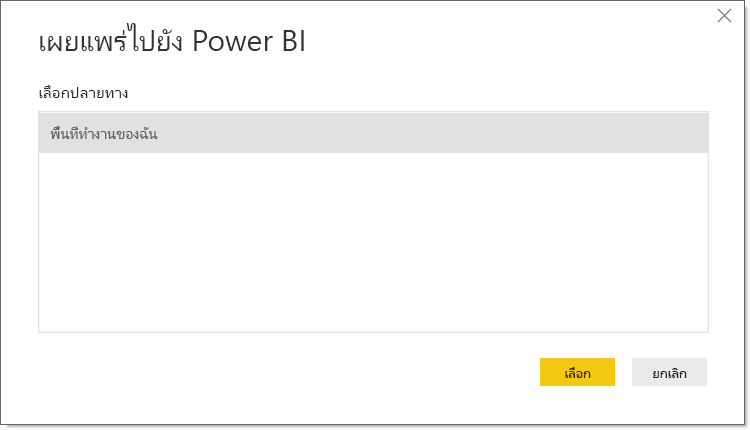
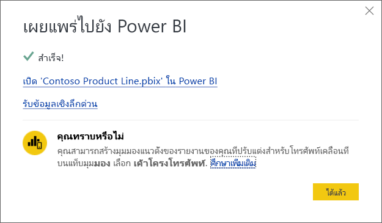

# เผยแพร่ชุดข้อมูลและรายงานจาก Power BI Desktop
เมื่อคุณเผยแพร่เป็นไฟล์**Power BI Desktop**ไปยัง**Power BI service** ข้อมูลอยู่ในรูปแบบและใด ๆ ที่คุณสร้างขึ้นในมุมมอง**รายงาน**ซึ่งเผยแพร่ไปยังพื้นที่ทำงาน Power BI ของคุณ คุณจะเห็นชุดข้อมูลใหม่ที่มีชื่อเดียวกัน และรายงานต่างๆในตัวนำทางของพื้นที่ทำงานของคุณ

โดยการเผยแพร่จาก**Power BI Desktop**มีผลเช่นเดียวกับการใช้การ**รับข้อมูล**ใน Power BI เพื่อเชื่อมต่อ และอัปโหลดไฟล์**Power BI Desktop**

> [!NOTE]
> การเปลี่ยนแปลงใดๆ ที่คุณทำกับรายงาน Power BI ตัวอย่างเช่น เพิ่ม, ลบ หรือเปลี่ยนแปลงการแสดงภาพในรายงาน จะไม่ถูกบันทึกลงในไฟล์ **Power BI Desktop** ต้นฉบับ
> 
> 

## เมื่อต้องการเผยแพร่ชุดข้อมูลและรายงาน Power BI Desktop
1. ใน Power BI Desktop เลือก **ไฟล์** \> **เผยแพร่** \> **เผยแพร่ไปยัง Power BI** หรือคลิก **เผยแพร่** บน ribbon  

   

2. ลงชื่อเข้าใช้ไปยัง Power BI
3. เลือกปลายทาง

   

เมื่อเสร็จแล้ว คุณจะได้รับลิงก์ไปยังรายงานของคุณ คลิกที่ลิงก์เพื่อเปิดรายงานในไซต์ Power BI ของคุณ

## เผยแพร่อีกครั้งหรือแทนที่ชุดข้อมูลที่เผยแพร่จาก Power BI Desktop
เมื่อคุณเผยแพร่ไฟล์**Power BI Desktop** ชุดข้อมูลและรายงานใด ๆ ที่คุณสร้างขึ้นใน**Power BI Desktop**ถูกอัปโหลดไปยังเไซต์ Power BI ของคุณ เมื่อคุณเผยแพร่แฟ้ม**Power BI Desktop**ของคุณอีกครั้ง ชุดข้อมูลในไซต์ Power BI ของคุณจะถูกแทนที่ด้วยชุดข้อมูลที่ถูกอัปเดจากไฟล์**Power BI Desktop**

เรื่องนี้ตรงไปตรงมา แต่ก็มีบางสิ่งที่คุณควรทราบ

* ถ้าคุณมีชุดข้อมูลสองรายการ หรือมากกว่าใน Power BI โดยใช้ชื่อเดียวกันกับไฟล์**Power BI Desktop** การเผยแพร่อาจล้มเหลวได้ ตรวจสอบให้แน่ใจว่า คุณมีชุดข้อมูลเดียวเท่านั้นใน Power BI ที่มีชื่อเดียวกัน นอกจากนี้คุณยังสามารถเปลี่ยนชื่อไฟล์และเผยแพร่ โดยสร้างชุดข้อมูลใหม่ชื่อเดียวกันกับไฟล์
* ถ้าคุณเปลี่ยนชื่อหรือลบคอลัมน์หรือหน่วยวัด การแสดงภาพใดๆที่คุณมีใน Power BI ที่มีเขตข้อมูลนั้นอาจจะไม่สามารถใช้งาน 
* Power BI ละเว้นการเปลี่ยนแปลงการจัดรูปแบบบางอย่างของคอลัมน์ที่มีอยู่ ตัวอย่างเช่น ถ้าคุณเปลี่ยนรูปแบบของคอลัมน์จาก 0.25 เป็น 25%
* ถ้าคุณมีการกำหนดเวลาการรีเฟรชสำหรับชุดข้อมูลของคุณใน Power BI และคุณได้เพิ่มแหล่งข้อมูลใหม่ลงในไฟล์ของคุณ แล้วเผยแพร่อีกครั้ง คุณจะต้องลงชื่อเข้าใช้*จัดการแหล่งข้อมูล*ก่อนที่จะมีการรีเฟรชตามกำหนดเวลาครั้งถัดไป
* เมื่อคุณเผยแพร่ชุดข้อมูลที่เผยแพร่จาก **Power BI Desktop**  ใหม่ และมีการกำหนดตารางเวลาการรีเฟรช การรีเฟรชชุดข้อมูลจะเริ่มต้นทันทีที่คุณเผยแพร่อีกครั้ง 

