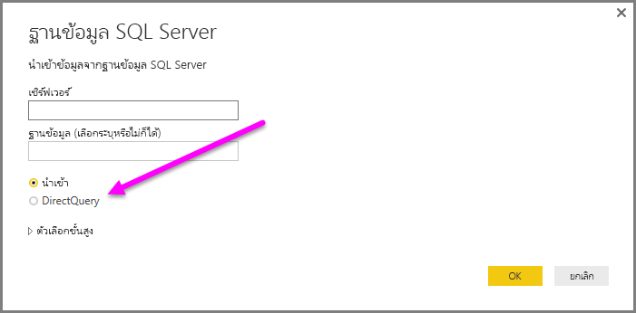
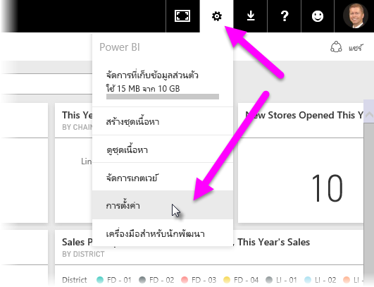
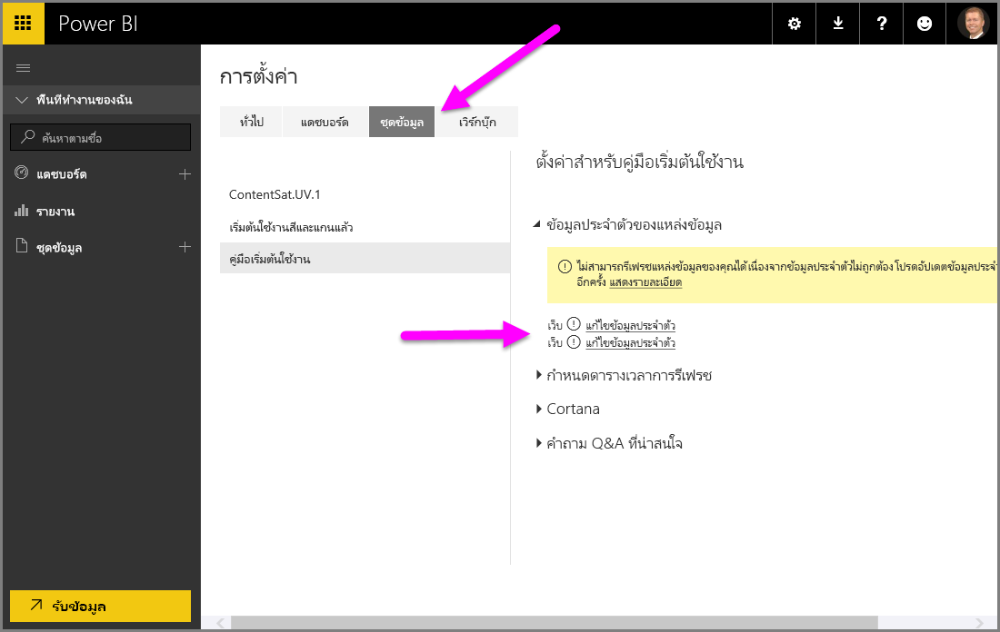

# ใช้ DirectQuery ใน Power BI Desktop
ด้วย **Power BI Desktop** เมื่อคุณเชื่อมต่อกับแหล่งข้อมูลของคุณ คุณสามารถนำเข้าสำเนาของข้อมูลลงใน **Power BI Desktop** ได้ สำหรับบางแหล่งข้อมูล คุณสามารถเลือกวิธีการอื่นได้: เชื่อมต่อโดยตรงกับแหล่งข้อมูลโดยใช้ **DirectQuery**

## แหล่งข้อมูลที่ได้รับการสนับสนุน
สำหรับรายการของแหล่งข้อมูลที่สนับสนุน **DirectQuery** โปรดดู[แหล่งข้อมูลที่ DirectQuery สนับสนุน](desktop-directquery-data-sources.md)

## วิธีการเชื่อมต่อโดยใช้ DirectQuery
เมื่อคุณใช้**รับข้อมูล**เพื่อเชื่อมต่อกับแหล่งข้อมูลที่ได้รับการสนับสนุนโดย **DirectQuery** หน้าต่างเชื่อมต่อจะช่วยให้คุณสามารถเลือกวิธีที่คุณต้องการจะเชื่อมต่อ  

ความแตกต่างระหว่างการเลือก**นำเข้า**และ **DirectQuery** มีดังนี้:

**นำเข้า** – มีการนำเข้าตารางและคอลัมน์ที่เลือกลงใน **Power BI Desktop** เมื่อคุณสร้างหรือโต้ตอบกับภาพข้อมูล **Power BI Desktop**จะใช้ข้อมูลที่นำเข้า คุณต้องรีเฟรชข้อมูล ซึ่งจะนำเข้าชุดข้อมูลเต็มรูปแบบอีกครั้ง เพื่อดูการเปลี่ยนแปลงใดๆ ที่เกิดขึ้นกับข้อมูลพื้นฐาน ตั้งแต่การนำเข้าเริ่มต้นหรือการรีเฟรชล่าสุด

**DirectQuery** – ไม่มีการนำเข้าหรือคัดลอกข้อมูลลงใน **Power BI Desktop** สำหรับแหล่งข้อมูลเชิงสัมพันธ์ จะปรากฏตารางและคอลัมน์ที่เลือกในรายการ**เขตข้อมูล** สำหรับแหล่งข้อมูลหลายมิติ เช่น SAP Business Warehouse มิติและการวัดของคิวบ์ที่ถูกเลือกจะปรากฏในรายการ**เขตข้อมูล** เมื่อคุณสร้างหรือโต้ตอบกับภาพข้อมูล **Power BI Desktop**จะคิวรีแหล่งข้อมูลพื้นฐาน ซึ่งหมายความว่า คุณกำลังดูข้อมูลที่เป็นปัจจุบันอยู่เสมอ

แบบจำลองข้อมูลและการแปลงข้อมูลจำนวนมากมีพร้อมให้บริการเมื่อใช้ **DirectQuery** แม้ว่าจะมีข้อจำกัดบ้าง เมื่อสร้างหรือโต้ตอบกับภาพข้อมูล แหล่งข้อมูลพื้นฐานต้องถูกคิวรีและเวลาที่จำเป็นในการรีเฟรชภาพข้อมูลจะขึ้นอยู่กับความสามารถของแหล่งข้อมูลพื้นฐาน เมื่อมีการร้องขอข้อมูลที่ให้บริการ Power BI Desktop ใช้ข้อมูลล่าสุดเพื่อลดเวลาที่ใช้ประมวลการแสดงภาพข้อมูล เลือก**รีเฟรช**จาก ribbon ของ**Home** จะทำให้ภาพข้อมูลถูกรีเฟรชด้วยข้อมูลปัจจุบัน

บทความ [Power BI และ DirectQuery](desktop-directquery-about.md) อธิบายเรื่อง **DirectQuery** ในรายละเอียด นอกจากนี้ โปรดดูหัวข้อต่อไปนี้สำหรับข้อมูลเพิ่มเติมเกี่ยวกับข้อดี ข้อจำกัด และข้อควรพิจารณาเมื่อใช้ **DirectQuery**

## ข้อดีของการใช้ DirectQuery
ประโยชน์บางอย่างเมื่อใช้ **DirectQuery**:

* **DirectQuery** ช่วยให้คุณสามารถสร้างภาพข้อมูลจากชุดข้อมูลที่มีขนาดใหญ่มาก ซึ่งตามปกติแล้ว การนำเข้าข้อมูลขนาดใหญ่ที่มีการรวมข้อมูลไว้ก่อนในตอนแรกอาจทำได้ยาก
* และตามปกตินั้น การเปลี่ยนแปลงข้อมูลพื้นฐานอาจทำให้ต้องรีเฟรชข้อมูล ซึ่งในบางรายงาน ความต้องการแสดงข้อมูลปัจจุบันอาจต้องใช้การถ่ายโอนข้อมูลขนาดใหญ่และอาจทำให้การนำเข้าข้อมูลนั้นอีกครั้งเป็นไม่ได้ ในทางตรงกันข้าม รายงาน **DirectQuery** มักใช้ข้อมูลปัจจุบัน
* ข้อจำกัดของชุดข้อมูลที่ 1 GB *ไม่*ใช้กับ **DirectQuery**

## ขีดจำกัดของ DirectQuery
ขณะนี้ มีข้อจำกัดบางอย่างเมื่อใช้ **DirectQuery**:

* ตารางทั้งหมดต้องมาจากฐานข้อมูลเดียว
* ถ้าคิวรีของ**ตัวแก้ไขคิวรี**ซับซ้อนเกินไป จะเกิดข้อผิดพลาด เมื่อต้องแก้ไขข้อผิดพลาด คุณต้องลบในขั้นตอนที่มีปัญหาใน**ตัวแก้ไขคิวรี**หรือ*นำเข้า*ข้อมูลแทนที่จะใช้ **DirectQuery** สำหรับแหล่งข้อมูลหลายมิติ เช่น SAP Business Warehouse ไม่มี**ตัวแก้ไขคิวรี**
* การกรองความสัมพันธ์จะเป็นทิศทางเดียว แทนที่จะเป็นสองทิศทาง (แม้ว่าอาจเป็นไปได้เมื่อต้องการเปิดใช้งานตัวกรองสองทิศทางสำหรับ **DirectQuery** ในฐานะเป็นฟีเจอร์การแสดงตัวอย่าง) สำหรับแหล่งข้อมูลหลายมิติ เช่น SAP Business Warehouse ไม่มีการกำหนดความสัมพันธ์ในแบบจำลอง
* ความสามารถด้านเวลาจะไม่พร้อมใช้งานใน **DirectQuery** ตัวอย่างเช่น ไม่มีการจัดการพิเศษของคอลัมน์วันที่ (ปี ไตรมาส เดือน วัน และอื่นๆ) ในโหมด **DirectQuery**
* โดยค่าเริ่มต้น จะมีข้อจำกัดของนิพจน์ DAX ที่ใช้กับการวัด ดูย่อหน้าถัดไป (หลังจากรายการมีสัญลักษณ์แสดงหัวข้อย่อย) สำหรับข้อมูลเพิ่มเติม
* มีข้อจำกัดของแถวที่ 1 ล้านแถวสำหรับการส่งคืนข้อมูลเมื่อใช้ **DirectQuery** ข้อจำกัดนี้ไม่มีผลต่อการรวมหรือการคำนวณที่ใช้ในการสร้างชุดข้อมูลที่  **DirectQuery** ส่งค่ากลับคืน เฉพาะแถวเท่านั้นที่จะถูกส่งคืน ตัวอย่างเช่น คุณสามารถรวม 10 ล้านแถวด้วยคิวรีที่ทำงานบนแหล่งข้อมูล และส่งคืนผลของการรวมดังกล่าวไปยัง Power BI ได้อย่างถูกต้องโดยใช้ **DirectQuery** ตราบเท่าที่ข้อมูลกลับคืนสู่ Power BI มีจำนวนน้อยกว่า 1 ล้านแถว ถ้า **DirectQuery** ส่งคืนมากกว่า 1 ล้านแถว Power BI จะแสดงข้อผิดพลาด

เพื่อให้แน่ใจว่าคิวรีที่ทำงานกับแหล่งข้อมูลพื้นฐานมีความสามารถยอมรับได้ ค่าดีฟอลต์จึงจำกัดการวัด ผู้ใช้ขั้นสูงสามารถหลีกเลี่ยงข้อจำกัดนี้ได้ โดยเลือก **ไฟล์> ตัวเลือกและการตั้งค่า> ตัวเลือก** แล้วเลือก **DirectQuery** จากนั้นเลือกตัวเลือก*อนุญาตการวัดที่ไม่จำกัดในโหมด DirectQuery* เมื่อเลือกตัวเลือกดังกล่าว คุณจะสามารถใช้นิพจน์ DAX ที่ใช้ได้กับการวัด อย่างไรก็ตาม ผู้ใช้ต้องตระหนักว่านิพจน์บางอย่างที่ทำงานได้ดีเมื่อนำเข้าข้อมูลอาจส่งผลให้คิวรีทำงานช้ามากกับแหล่งข้อมูล backend เมื่ออยู่ในโหมด DirectQuery

## ข้อควรพิจารณาเมื่อใช้ DirectQuery
ควรคำนึงถึงสามข้อต่อไปนี้เมื่อใช้ **DirectQuery**:

* **ประสิทธิภาพและภาระ** - คำขอ **DirectQuery** ทั้งหมดจะถูกส่งไปยังฐานข้อมูลต้นฉบับ ดังนั้นเวลาที่ใช้รีเฟรชภาพข้อมูลจะขึ้นอยู่กับความยาวนานที่แหล่งข้อมูล backend ใช้เพื่อตอบสนองกับผลลัพธ์จากคิวรี เวลาตอบสนอง (พร้อมส่งคืนข้อมูลที่ขอ) สำหรับการใช้ **DirectQuery** กับภาพคือ 5 วินาทีหรือน้อยกว่าโดยมีเวลาตอบสนองสูงสุดที่ 30 วินาที ยิ่งนานเท่าไร ผู้ใช้รายงานก็จะรู้สึกไม่พอใจ นอกจากนี้ เมื่อมีการตีพิมพ์รายงานไปยังบริการของ Power BI คิวรีที่ใช้เวลานานกว่าสองสามนาทีจะหมดเวลา และผู้ใช้จะได้รับข้อผิดพลาด
  
  ภาระต่อฐานข้อมูลต้นฉบับก็เป็นเรื่องที่ควรพิจารณา ทั้งนี้ขึ้นอยู่กับจำนวนผู้ใช้ Power BI ที่จะใช้รายงานที่ตีพิมพ์ การใช้*ความปลอดภัยระดับแถว* (RLS) อาจมีผลกระทบอย่างมากเช่นกัน ไทล์แดชบอร์ดแบบ non-RLS ที่แชร์โดยผู้ใช้หลายคนส่งผลให้มีการคิวรีเพียงอันเดียวกับฐานข้อมูล แต่การใช้ RLS บนไทล์แดชบอร์ดมักจะหมายความว่าการรีเฟรชไทล์หนึ่งๆต้องมีการเกิดหนึ่งคิวรี*ต่อหนึ่งผู้ใช้* ดังนั้น จึงเพิ่มภาระให้แก่ฐานข้อมูลต้นฉบับอย่างมากและอาจส่งผลกระทบต่อประสิทธิภาพการทำงาน
  
  Power BI สร้างคิวรีที่มีประสิทธิภาพเท่าที่เป็นไปได้ ในบางกรณี คิวรีที่สร้างอาจไม่มีประสิทธิภาพเพียงพอและจึงอาจทำให้การรีเฟรชล้มเหลว ตัวอย่างหนึ่งของสถานการณ์นี้คือ เมื่อคิวรีที่สร้างขึ้นดึงจำนวนแถวที่มากเกินไป (มากกว่า 1 ล้าน) จากแหล่งข้อมูล backend ซึ่งในกรณีดังกล่าว จะเกิดข้อผิดพลาดต่อไปนี้:
  
      The resultset of a query to external data source has exceeded
      the maximum allowed size of '1000000' rows.
  
  สถานการณ์นี้อาจเกิดขึ้นได้กับแผนภูมิแบบง่ายๆ ที่มีแถวในคอลัมน์หนึ่งๆ อย่างมาก โดยมีตัวเลือกการรวมกำหนดเป็น*อย่าสรุป* ภาพจะมีคอลัมน์ที่มีแถวต่ำกว่า 1 ล้านหรือต้องมีการใช้ตัวกรองที่เหมาะสม
* **ความปลอดภัย** – ผู้ใช้ทั้งหมดที่ใช้รายงานที่เผยแพร่จะเชื่อมต่อกับแหล่งข้อมูล backend โดยใช้ข้อมูลประจำตัวที่ถูกป้อนหลังจากการเผยแพร่ไปยังบริการ Power BI นี่คือสถานการณ์เดียวกับข้อมูลที่นำเข้า: ผู้ใช้ทุกคนเห็นข้อมูลเดียวกันโดยไม่คำนึงถึงกฎความปลอดภัยใดๆ ที่กำหนดไว้ในแหล่งข้อมูล backend ลูกค้าที่ต้องการความปลอดภัยสำหรับผู้ใช้ในการใช้งานแหล่งข้อมูล DirectQuery ควรใช้ RLS [เรียนรู้เพิ่มเติมเกี่ยวกับ RLS](service-admin-rls.md)
* **ฟีเจอร์ที่ได้รับการสนับสนุน** - ฟีเจอร์บางอย่างเท่านั้นใน **Power BI Desktop** ได้รับการสนับสนุนในโหมด **DirectQuery** หรือมีข้อจำกัดบางอย่าง นอกจากนี้ ยังมีความสามารถบางอย่างในบริการของ Power BI (เช่น *ข้อมูลเชิงลึกอย่างรวดเร็ว*) ที่ไม่มีให้ใช้กับชุดข้อมูลที่ใช้ **DirectQuery** ดังนั้น ควรคำนึงถึงข้อจำกัดของฟีเจอร์ดังกล่าวเมื่อใช้ **DirectQuery** เมื่อพิจารณาว่าควรใช้ **DirectQuery** หรือไม่   

## เผยแพร่ไปยังบริการ Power BI
รายงานที่สร้างขึ้นโดยใช้ **DirectQuery** สามารถเผยแพร่ไปยังบริการของ Power BI ได้

หากแหล่งข้อมูลที่ใช้ไม่จำเป็นต้องใช้ **เกตเวย์ข้อมูลในองค์กร** (**Azure SQL Database**, **Azure SQL Data Warehouse** หรือ **Redshift**) ต้องให้ข้อมูลประจำตัวก่อนรายงานจะถูกแสดงในบริการของ Power BI

คุณสามารถให้ข้อมูลประจำตัวได้โดยเลือกไอคอนเฟือง**การตั้งค่า**ใน Power BI จากนั้นเลือก**การตั้งค่า**

Power BI แสดงหน้าต่าง**การตั้งค่า** จากที่นั่น เลือกแท็บ**ชุดข้อมูล**และเลือกชุดข้อมูลที่ใช้ **DirectQuery** และเลือก**แก้ไขข้อมูลประจำตัว**

จนกว่าจะมีการให้ข้อมูลประจำตัว จะไม่สามารถเปิดรายงานที่เผยแพร่หรือทำการสำรวจชุดข้อมูลที่ถูกสร้างขึ้นโดยการเชื่อมต่อของ **DirectQuery** กับแหล่งข้อมูลดังกล่าว

สำหรับแหล่งข้อมูลอื่นที่ไม่ใช่ **Azure SQL Database**, **Azure SQL Data Warehouse** และ **Redshift** ที่ใช้ DirectQuery ต้องติดตั้ง**เกตเวย์ข้อมูลภายในองค์กร**และต้องลงทะเบียนแหล่งข้อมูลเพื่อสร้างการเชื่อมต่อข้อมูล คุณสามารถ[เรียนรู้เพิ่มเติมเกี่ยวกับเกตเวย์ข้อมูลภายในองค์กร](http://go.microsoft.com/fwlink/p/?LinkID=627094)ได้

## ขั้นตอนถัดไป
สำหรับข้อมูลเพิ่มเติมเกี่ยวกับ **DirectQuery** โปรดดูทรัพยากรต่อไปนี้:

* [DirectQuery ใน Power BI](desktop-directquery-about.md)
* [แหล่งข้อมูลที่สนับสนุนโดย DirectQuery](desktop-directquery-data-sources.md)
* [DirectQuery และ SAP BW](desktop-directquery-sap-bw.md)
* [DirectQuery และ SAP HANA](desktop-directquery-sap-hana.md)
* [เกตเวย์ข้อมูลภายในองค์กร](service-gateway-onprem.md)

