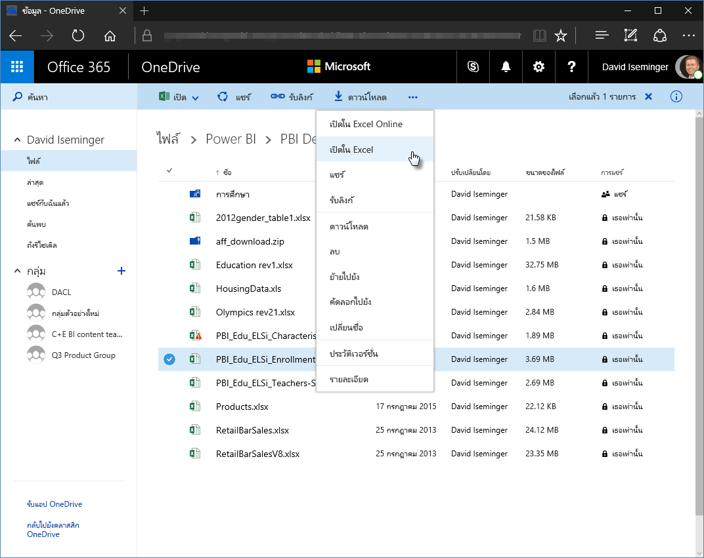
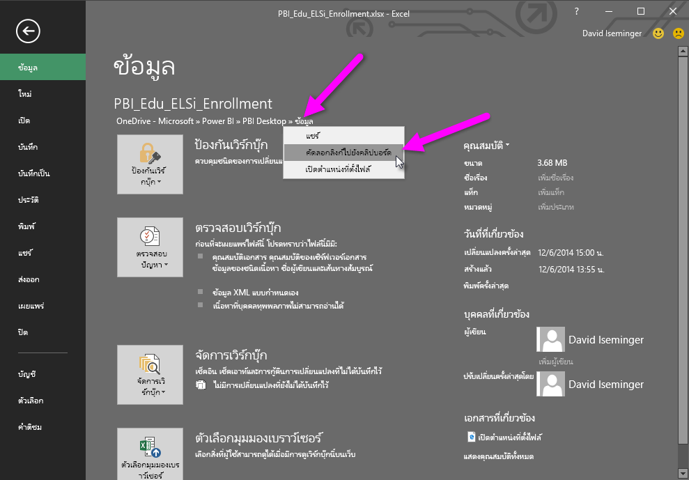
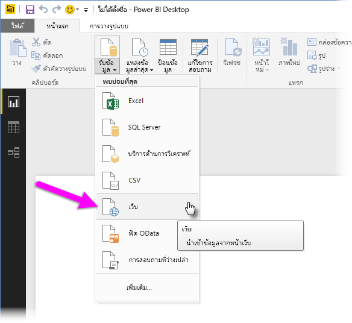
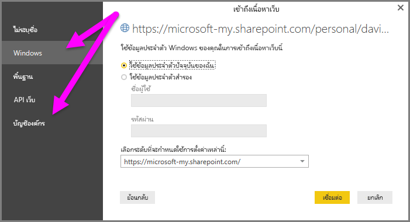

# ใช้ลิงก์ OneDrive for Business ใน Power BI Desktop
หลายคนมีเวิร์กบุ๊ก Excel ที่จัดเก็บบนไดรฟ์ OneDrive for Business ที่จะเหมาะสำหรับใช้งานกับ Power BI Desktop ด้วย **Power BI Desktop** คุณสามารถใช้การเชื่อมโยงออนไลน์สำหรับไฟล์ **Excel** ที่จัดเก็บใน **OneDrive for Business** เพื่อสร้างรายงานและวิชวลได้ คุณสามารถใช้บัญชีผู้ใช้กลุ่ม **OneDrive for Business** หรือบัญชีผู้ใช้บุคคล **OneDrive for Business** ของคุณก็ได้

การได้ลิงก์เชื่อมโยงออนไลน์จาก **OneDrive for Business** ต้องใช้ขั้นตอนที่เฉพาะเจาะจงสองสามขั้นตอน ส่วนต่อไปนี้จะอธิบายขั้นตอนดังกล่าว ให้คุณสามารถแชร์ลิงก์ของไฟล์ระหว่างกลุ่ม ระหว่างเครื่อง และกับเพื่อนร่วมงานของคุณ

## รับลิงก์จาก Excel เริ่มต้นจากในเบราว์เซอร์
1. นำทางไปยังที่ตั้ง OneDrive for Business ของคุณโดยใช้เบราว์เซอร์ คลิกขวาไฟล์ที่คุณต้องการใช้ และเลือก**เปิดใน Excel**
   
   > [!NOTE]
> อินเทอร์เฟซบนเบราว์เซอร์ของคุณอาจไม่เหมือนรูปต่อไปนี้ มีหลายวิธีในการเลือก**เปิดใน Excel** สำหรับไฟล์ในอินเทอร์เฟซบนเบราว์เซอร์ **OneDrive for Business** ของคุณ คุณสามารถใช้ทางเลือกใด ๆ ที่ทำให้คุณสามารถเปิดไฟล์ใน Excel
   > 
   > 
   
   
2. ใน **Excel** เลือก**ไฟล์ > ข้อมูล** และเลือกลิงก์ที่อยู่เหนือปุ่ม**ป้องกันเวิร์กบุ๊ก** เลือก**คัดลอกลิงก์ไปยังคลิปบอร์ด** (เวอร์ชันของคุณอาจพูดว่า **คัดลอกเส้นทางลงในคลิปบอร์ด**)
   
   

## ใช้ลิงก์ใน Power BI Desktop
ใน Power BI Desktop คุณสามารถใช้ลิงก์ที่คุณเพิ่งคัดลอกไปยังคลิปบอร์ด ทำตามขั้นตอนต่อไปนี้:

1. ใน Power BI Desktop เลือก**รับข้อมูล > เว็บ**
   
   
2. วางลิงก์ลงในโต้ตอบ**จากเว็บ** (**อย่า**เพิ่งเลือกตกลง)
   
    
3. ให้สังเกตสตริง *?web=1* ที่ส่วนท้ายของลิงก์ - คุณต้อง*เอาสตริงส่วนนั้นของ URL เว็บออก* **ก่อน**เลือก**ตกลง** เพื่อให้ **Power BI Desktop** นำทางไปยังไฟล์ของคุณได้อย่างถูกต้อง
4. ถ้า **Power BI Desktop** พร้อมท์คุณสำหรับข้อมูลประจำตัว เลือก **Windows** (สำหรับไซต์ SharePoint ภายในองค์กร) หรือ**บัญชีองค์กร** (สำหรับ Office 365 หรือ ไซต์ OneDrive for Business) อย่างใดอย่างหนึ่ง
   
   

หน้าต่าง**ตัวนำทาง**จะปรากฏขึ้น ให้คุณสามารถเลือกจากรายการของตาราง แผ่นงาน และช่วงที่พบในเวิร์กบุ๊ก Excel จากนั้น คุณสามารถใช้ไฟล์ OneDrive for Business เช่นเดียวกับไฟล์ Excel อื่น ๆ และสร้างรายงาน และใช้ในชุดข้อมูล เหมือนกับที่คุณทำกับแหล่งข้อมูลอื่น ๆ

> [!NOTE]
> เพื่อใช้ไฟล์ **OneDrive for Business** เป็นแหล่งข้อมูลในบริการของ Power BI ที่เปิดใช้งาน**การบริการรีเฟรช**สำหรับไฟล์ดังกล่าว ตรวจสอบให้แน่ใจว่า คุณเลือก **OAuth2** เป็น**วิธีการรับรองความถูกต้อง**เมื่อกำหนดค่าการตั้งค่าการรีเฟรชของคุณ มิฉะนั้น คุณอาจพบข้อผิดพลาด (เช่น*ไม่สามารถปรับปรุงข้อมูลประจำตัวสำหรับแหล่งข้อมูล*) เมื่อคุณพยายามเชื่อมต่อ หรือรีเฟรชได้ การเลือก **OAuth2** ให้เป็นวิธีการรับรองความถูกต้อง เป็นการแก้ไขข้อผิดพลาดข้อมูลประจำตัวนั้น
> 
> 

