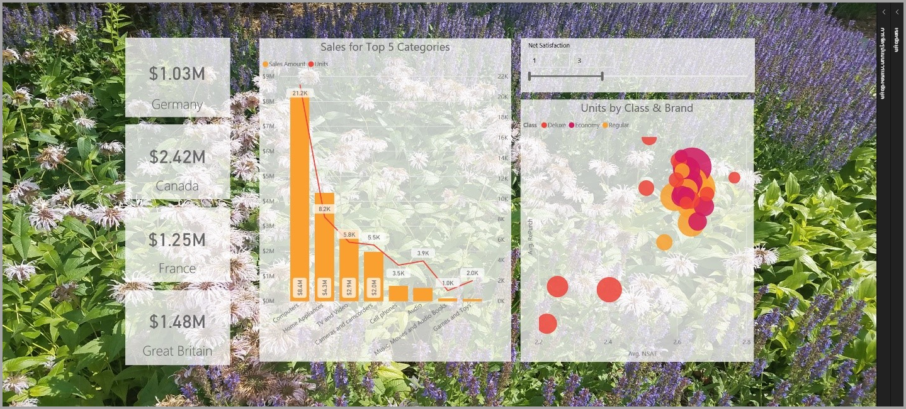
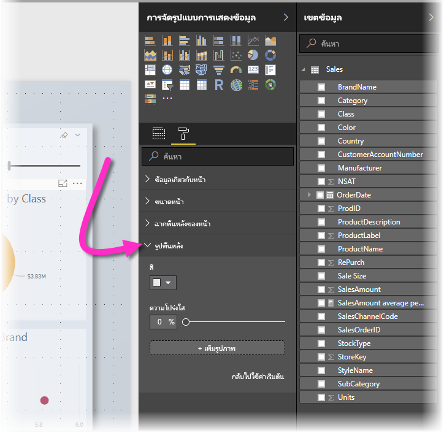
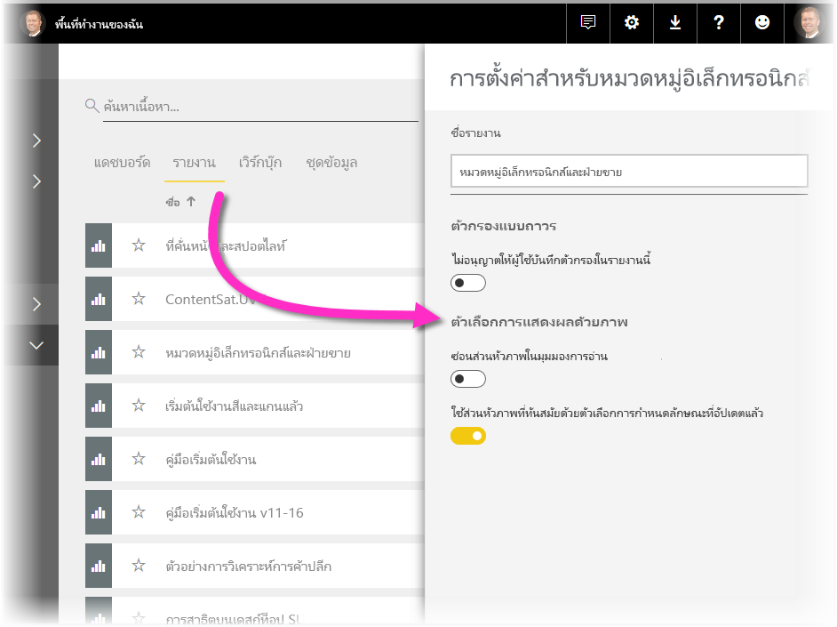
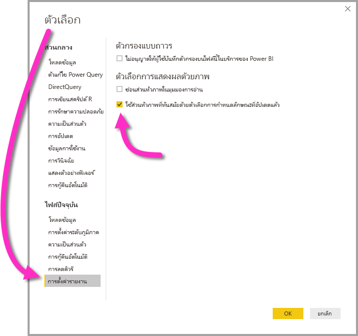

# ใช้องค์ประกอบด้านภาพเพื่อปรับแต่งรายงาน Power BI

ด้วย **Power BI Desktop** คุณสามารถใช้องค์ประกอบด้านภาพ เช่นพื้นพลังและภาพส่วนหัวที่ได้รับการปรับแต่งสำหรับการแสดงข้อมูล เพื่อปรับแต่งหน้าตาของรายงาน

นับตั้งแต่ **Power BI Desktop** รุ่นเดือนกรกฎาคม 2018 คุณสามารถเพิ่มการปรับแต่งให้กับรายงานและทำให้การวิเคราะห์และรายงานน่าดูยิ่งกว่าที่เคย การปรับแต่งที่พูดถึงในบทความนี้ประกอบด้วย: 

* เพิ่ม**พื้นหลัง**ไปยังรายงานเพื่อให้พื้นหลังช่วยเสริมหรือเน้นองค์ประกอบของเรื่องราวที่ต้องการเล่าด้วยข้อมูล
* ใช้**ภาพส่วนหัว**ที่ได้รับการปรับแต่งสำหรับการแสดงข้อมูลแต่ละชิ้นเพื่อสร้างงานภาพที่เป็นไปในทางเดียวกันบนผืนผ้าใบสำหรับรายงานของคุณ 

ส่วนต่อไปนี้อธิบายวิธีใช้การปรับแต่งเหล่านี้ และวิธีนำไปใช้กับรายงาน

## การใช้พื้นหลังในรายงาน Power BI

คุณสามารถจัดรูปแบบพื้นที่สีเทานอกหน้ารายงานได้ด้วยการใช้**พื้นหลัง** ภาพต่อไปนี้มีลูกศรที่ช่วยอธิบายว่าพื้นหลังมีขอบเขตถึงบริเวณไหน 

คุณสามารถตั้งค่าพื้นหลังเป็นต่อหน้ารายงาน หรือใช้พื้นหลังเดียวกันในรายงานทุกหน้า หากต้องการตั้งค่าพื้นหลัง ให้แตะหรือคลิกที่ไอคอน **การจัดรูปแบบ** เมื่อไม่ได้เลือกภาพใดในรายงานอยู่ และการ์ด **พื้นหลัง** ปรากฏในบานหน้าต่าง

คุณสามารถเลือกสีที่จะใช้เป็น**พื้นหลัง**ด้วยการเลือกรายการแบบหล่นลง **สี** หรือคุณสามารถเลือกปุ่ม **เพิ่มภาพ** เพื่อเลือกภาพที่จะใช้เป็นพื้นหลัง คุณยังสามารถกำหนดความโปร่งใสให้กับพื้นหลัง ไม่ว่าจะเป็นสีหรือภาพ โดยใช้แถบเลื่อน **ความโปร่งใส**

การจำคำนิยามที่เกี่ยวข้องกับ**พื้นหลัง**ต่อไปนี้ไว้จะมีประโยชน์กับคุณ:

* พื้นที่สีเทานอกรายงานคือพื้นที่**พื้นหลัง**
* พื้นที่ในผืนผ้าใบซึ่งคุณสามารถวางภาพเรียกว่า**หน้า**รายงาน และใน **บ้านหน้าต่างรูปแบบ** สามารถปรับแต่งโดยใช้เมนูแบบหล่นลง **พื้นหลังหน้า** ได้

**หน้า**รายงานจะอยู่เบื้องหน้าเสมอ (เมื่อเทียบกับพื้นหลัง) ในขณะที่**พื้นหลัง**จะอยู่ด้านหลังและเป็นองค์ประกอบที่อยู่ด้านหลังสุดในหน้ารายงาน เมื่อคุณใช้ความโปร่งใสกับหน้า ภาพในรายงานจะได้รับการใช้ความโปร่งใสด้วย ช่วยให้พื้นหลังของคุณปรากฏเป็นพื้นหลังผ่านภาพต่าง ๆ

สำหรับรายงานใหม่ ๆ ทั้งหมด ค่าเริ่มต้นเป็นดังนี้:

* **หน้า**รายงานได้รับการตั้งค่าเป็น**สีขาว**และความโปร่งใสได้รับการตั้งค่าเป็น **100%**
* **พื้นหลัง**ได้รับการตั้งค่าเป็น**สีขาว**และความโปร่งใสได้รับการตั้งค่าเป็น **0%**

เมื่อคุณตั้งค่าพื้นหลังของหน้าให้มีความโปร่งใสเกิน 50% กรอบเส้นประจะปรากฏขณะที่คุณกำลังสร้างหรือแก้ไขรายงาน เพื่อแสดงให้เห็นขอบเขตของขอบผืนผ้าใบรายงาน 

เป็นเรื่องสำคัญที่ต้องทราบไว้ว่ากรอบเส้นประจะแสดงเมื่อทำการแก้ไขรายงาน*เท่านั้น* และจะ*ไม่*ปรากฏต่อคนที่กำลังดูรายงานที่เผยแพร่ไปแล้วอยู่ อย่างเช่นเมื่อดูผ่าน**บริการ Power BI**

> [!NOTE]
> ถ้าคุณใช้พื้นหลังสีเข้มสำหรับรูปพื้นหลัง และตั้งค่าข้อความสีอ่อนมาก หรือสีขาว โปรดจำไว้ว่าคุณลักษณะ**การส่งออกเป็น PDF**ไม่รวมรูปพื้นหลัง ดังนั้นการส่งออกใด ๆ กับแบบอักษรสีขาวจะแทบมองไม่เห็นในการส่งออกไฟล์ PDF ดู[การส่งออกเป็น PDF](desktop-export-to-pdf.md)สำหรับข้อมูลเพิ่มเติมเกี่ยวกับ**การส่งออกเป็น PDF**

## การใช้ภาพส่วนหัวที่ได้รับการปรับแต่งในรายงาน Power BI

นับตั้งแต่ **Power BI Desktop** รุ่นเดือนกรกฎาคม 2018 ภาพส่วนหัวในรายงานจะได้รับการปรับแต่งให้ดีขึ้นมาก การปรับแต่งหลัก ๆ เลยก็คือส่วนหัวถูกแยกออกมาต่างหาก ทำให้สามารถปรับตำแหน่งได้ตามความต้องการ และส่วนหัวจะปรากฏภายในภาพแทนที่จะลอยอยู่เหนือขึ้นมา 

โดยค่าเริ่มต้น ส่วนหัวจะปรากฏภายในภาพ และสัมพันธ์กับชื่อเรื่อง ในภาพต่อไปนี้ คุณจะเห็นส่วนหัว (ไอคอนหมุด ไอคอนขยาย ไอคอนย่อ) ภายในภาพและถูกจัดชิดขวา ในระนาบเดียวกันกับชื่อเรื่อง

หากภาพของคุณไม่มีชื่อเรื่อง ส่วนหัวจะลอยอยู่เหนือภาพและจัดชิดขวา ดังที่แสดงในภาพด้านล่าง 

หากภาพของคุณได้รับการจัดตำแหน่งไว้ด้านบนสุด ภาพส่วนหัวจะไปติดอยู่ที่ด้านล่างสุดของภาพแทน 

แต่ละภาพจะมีการ์ดในส่วน **การจัดรูปแบบ** ของบานหน้าต่าง **การแสดงผลด้วยภาพ** ในชื่อ **ภาพส่วนหัว** ในการ์ดนั้นคุณสามารถปรับลักษณะของภาพส่วนหัวได้ทุกแบบ

> [!NOTE]
> การมองเห็นปุ่มสลับไม่ได้ส่งผลต่อรายงานเมื่อคุณเขียนหรือแก้ไขรายงาน คุณต้องเผยแพร่รายงานและดูในโหมดอ่านเพื่อดูผลลัพธ์ พฤติกรรมนี้ช่วยให้แน่ใจว่าตัวเลือกหลายอย่างที่มีให้ในภาพส่วนหัวเป็นสิ่งสำคัญในระหว่างการแก้ไข โดยเฉพาะไอคอนเตือนที่เตือนปัญหาในขณะที่ทำการแก้ไข

สำหรับรายงานที่ปรากฏใน **บริการ Power BI**เท่านั้น คุณสามารถปรับการใช้ภาพส่วนหัวได้โดยไปที่ **พื้นที่ทำงานของฉัน > รายงาน** และเลือกไอคอน **การตั้งค่า** คุณจะได้เห็นการตั้งค่าสำหรับรายงานที่คุณเลือกใน **การตั้งค่า** และคุณสามารถปรับการตั้งค่าได้ที่นี่ ดังที่แสดงในภาพด้านล่าง

### การเปิดใช้งานภาพส่วนหัวที่ได้รับการปรับแต่งสำหรับรายงานที่มีอยู่

ภาพส่วนหัวใหม่เป็นพฤติกรรมเริ่มต้นสำหรับรายงานใหม่ทั้งหมด สำหรับรายงานที่มีอยู่แล้ว คุณต้องเปิดใช้พฤติกรรมนี้ใน **Power BI Desktop** ด้วยการไปที่ **ไฟล์ > ตัวเลือกและการตั้งค่า > ตัวเลือก** และในส่วน **การตั้งค่ารายงาน** ให้กาเครื่องหมายในช่อง **ใช้ภาพส่วนหัวพร้อมตัวเลือกลักษณะที่ได้รับการอัปเดต**

## ขั้นตอนถัดไป
สำหรับข้อมูลเพิ่มเติมเกี่ยวกับ **Power BI Desktop** และวิธีการเริ่มต้นใช้งาน ตรวจสอบบทความต่อไปนี้

* [Power BI Desktop คืออะไร](desktop-what-is-desktop.md)
* [ภาพรวมคิวรี่กับ Power BI Desktop](desktop-query-overview.md)
* [แหล่งข้อมูลใน Power BI Desktop](desktop-data-sources.md)
* [เชื่อมต่อกับข้อมูลใน Power BI Desktop](desktop-connect-to-data.md)
* [จัดรูปร่างและรวมข้อมูลด้วย Power BI Desktop](desktop-shape-and-combine-data.md)
* [งานคิวรี่ที่ใช้บ่อยใน Power BI Desktop](desktop-common-query-tasks.md)   

