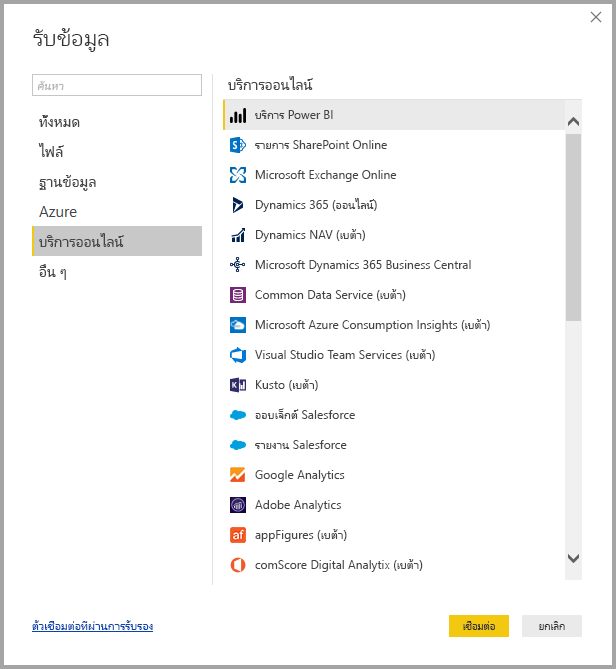
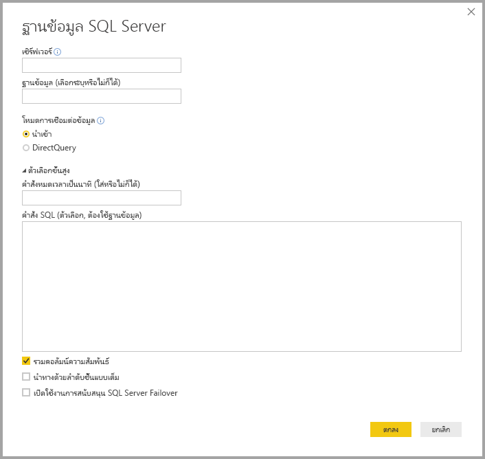
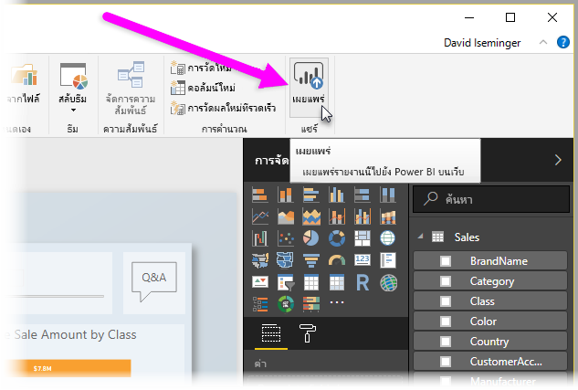

# Power BI Desktop คืออะไร

**Power BI Desktop** คือแอปพลิเคชันฟรีที่คุณสามารถติดตั้งบนคอมพิวเตอร์ของคุณ เพื่อช่วยให้คุณเชื่อมต่อ แปลง และแสดงข้อมูลของคุณ ด้วย **Power BI Desktop** คุณสามารถเชื่อมต่อกับหลายแหล่งข้อมูลที่แตกต่างกัน และรวมข้อมูลดังกล่าว (มักเรียกว่าจัดรูปแบบ) ให้เป็นรูปแบบข้อมูล ให้คุณสร้างวิชวลและคอลเลกชันของวิชวล ที่คุณสามารถแชร์ในรูปรายงานให้กับบุคคลอื่นภายในองค์กรของคุณ ผู้ใช้ส่วนใหญ่ที่ทำงานในโครงการข่าวกรองธุรกิจ ใช้ **Power BI Desktop** เพื่อสร้างรายงาน จากนั้นใช้**บริการของ Power BI** เพื่อแชร์รายงานของพวกเขาให้กับผู้อื่น

ต่อไปนี้คือการใช้งานที่บ่อยที่สุดของ **Power BI Desktop**:

* เชื่อมต่อกับข้อมูล
* แปลงและล้างข้อมูล เพื่อสร้างรูปแบบข้อมูล
* สร้างวิชวล เช่น แผนภูมิหรือกราฟ ที่แทนข้อมูลด้วยภาพ
* สร้างรายงานที่ประกอบด้วยคอลเลกชันของวิชวล บนหน้ารายงานหนึ่งหรือหลายหน้า
* แชร์รายงานให้กับผู้อื่นโดยใช้**บริการของ Power BI**

บุคคลที่มักรับผิดชอบงานดังกล่าว ถือว่าเป็น*นักวิเคราะห์ข้อมูล* (บางครั้งเรียกแค่*นักวิเคราะห์*) หรือผู้เชี่ยวชาญด้านข่าวกรองธุรกิจ (มักจะเรียกว่า*นักสร้างรายงาน*) แต่บุคคลจำนวนมากที่ไม่ได้มองตนเองว่าเป็นนักวิเคราะห์ข้อมูลหรือนักสร้างรายงาน ใช้ **Power BI Desktop** เพื่อสร้างรายงานที่น่าสนใจ หรือดึงข้อมูลจากแหล่งต่าง ๆ และสร้างรูปแบบข้อมูล ซึ่งสามารถแชร์ให้กับเพื่อนร่วมงานและองค์กรของพวกเขา

ด้วย **Power BI Desktop** คุณสามารถสร้างรายงานที่ซับซ้อนและสวยงาม โดยใช้ข้อมูลจากหลายแหล่งข้อมูล ทั้งหมดในรายงานเดียว ที่คุณสามารถแชร์ให้กับผู้อื่นในองค์กรของคุณได้ 

## เชื่อมต่อกับข้อมูล
เพื่อเริ่มต้นใช้งาน **Power BI Desktop** ขั้นตอนแรกคือการเชื่อมต่อกับข้อมูล มีแหล่งข้อมูลต่าง ๆ มากมายที่คุณสามารถเชื่อมต่อจาก **Power BI Desktop** เพื่อเชื่อมต่อกับข้อมูล เพียงเลือก ribbon **หน้าแรก** จากนั้นเลือก **รับข้อมูล > เพิ่มเติม** รูปภาพต่อไปนี้แสดงหน้าต่าง**รับข้อมูล**ที่ปรากฎขึ้น ซึ่งแสดงแหล่งข้อมูลหลายประเภทที่ Power BI Desktop สามารถเชื่อมต่อได้

เมื่อคุณเลือกชนิดข้อมูล คุณจะได้รับพร้อมท์สำหรับข้อมูล เช่น URL และข้อมูลประจำตัว ที่จำเป็นสำหรับให้ Power BI Desktop เชื่อมต่อกับแหล่งข้อมูลในนามของคุณ

เมื่อคุณเชื่อมต่อกับแหล่งข้อมูลหนึ่งหรือหลายแหล่ง คุณอาจต้องการแปลงข้อมูลเพื่อให้เป็นประโยชน์สำหรับคุณ

## แปลงและล้างข้อมูล แล้วสร้างรูปแบบ

ใน Power BI Desktop คุณสามารถล้างและแปลงข้อมูลโดยใช้ **ตัวแก้ไขคิวรี** ที่มีอยู่ภายในได้ ด้วยตัวแก้ไขคิวรี คุณสามารถทำการเปลี่ยนแปลงข้อมูลของคุณ เช่น เปลี่ยนชนิดของข้อมูล เอาคอลัมน์ออก หรือรวมข้อมูลจากหลายแหล่ง ซึ่งคล้ายกับการแกะสลัก - คุณเริ่มต้นจากดินเหนียว (หรือข้อมูล) ก้อนใหญ่ จากนั้นแกะเอาชิ้นส่วนออกไป หรือเพิ่มส่วนอื่นถ้าจำเป็น จนกระทั่งรูปร่างของข้อมูลเป็นแบบที่คุณต้องการ 

แต่ละขั้นตอนที่คุณใช้ปรับเปลี่ยนข้อมูล (เช่น เปลี่ยนชื่อตาราง, แปลงชนิดข้อมูล หรือลบคอลัมน์) ถูกบันทึกไว้โดย**ตัวแก้ไขคิวรี** และแต่ละครั้งที่คิวรีนี้เชื่อมต่อกับแหล่งข้อมูล ขั้นตอนเหล่านั้นจะดำเนินการ เพื่อให้ข้อมูลอยู่ในรูปที่คุณกำหนดไว้เสมอ

รูปภาพต่อไปนี้แสดง บานหน้าต่าง**การตั้งค่าแบบสอบถาม** สำหรับคิวรีที่ได้จัดรูป และกลายเป็นรูปแบบ

 

เมื่อข้อมูลของคุณอยู่ในแบบที่คุณต้องการแล้ว คุณสามารถสร้างวิชวล หรือการแสดงผลด้วยภาพ 

## สร้างการแสดงผลด้วยภาพ 

เมื่อคุณมีรูปแบบข้อมูล คุณสามารถลาก*เขตข้อมูล*ลงบนพื้นที่รายงานเพื่อสร้าง*วิชวล* หรือการแสดงผลด้วยภาพได้ *วิชวล*เป็นการแสดงข้อมูลในรูปแบบของคุณ ด้วยภาพกราฟิก วิชวลต่อไปนี้แสดงแผนภูมิคอลัมน์แบบง่าย 

มีวิชวลชนิดต่าง ๆ จำนวนมากให้เลือกจากใน Power BI Desktop เพื่อสร้างหรือเปลี่ยนวิชวล เพียงแค่เลือกไอคอนวิชวลจากบานหน้าต่าง**การจัดรูปแบบการแสดงข้อมูล** ถ้าคุณมีวิชวลที่เลือกแล้วบนพื้นที่รายงาน วิชวลที่เลือกจะเปลี่ยนเป็นชนิดคุณที่เลือก ถ้าไม่มีวิชวลถูกเลือกอยู่ก่อน วิชวลใหม่จะถูกสร้างขึ้นตามตัวเลือกของคุณ

## สร้างรายงาน

บ่อยครั้งที่คุณต้องการสร้างคอลเลกชันของวิชวล ที่แสดงข้อมูลคุณในแง่มุมต่างๆ กัน จากข้อมูลที่คุณใช้สร้างรูปแบบของคุณใน Power BI Desktop คอลเลกชันของวิชวลในไฟล์ Power BI Desktop หนึ่งไฟล์ จะเรียกว่า*รายงาน* รายงานสามารถมีหนึ่งหรือหลายหน้า เหมือนกับแฟ้ม Excel ที่สามารถมีเวิร์กชีตหนึ่งหรือหลายแผ่น ในรูปต่อไปนี้ คุณจะเห็นหน้าแรกของรายงาน Power BI Desktop ที่ชื่อว่า Overview (คุณสามารถเห็นจากแท็บที่ด้านล่างของรูปภาพ) รายงานนี้มีทั้งหมดสิบหน้า

## แชร์รายงาน

เมื่อรายงานพร้อมที่จะแชร์ให้กับผู้อื่น คุณสามารถ**เผยแพร่**รายงานไปยัง**บริการของ Power BI** และทำให้ทุกคนในองค์กรของคุณที่มีสิทธิ์การใช้งาน Power BI สามารถใช้รายงานได้ เพื่อเผยแพร่รายงาน Power BI Desktop คุณเลือกปุ่ม**เผยแพร่**จาก ribbon **หน้าแรก** ใน Power BI Desktop

เมื่อคุณเลือก**เผยแพร่** Power BI Desktop จะเชื่อมต่อคุณไปยัง**บริการของ Power BI** ด้วยบัญชี Power BI ของคุณและพร้อมท์ให้คุณเลือกตำแหน่งในบริการของ Power BI ที่คุณต้องการแชร์รายงาน เช่น พื้นที่ทำงานของคุณ, พื้นที่ทำงานของทีม หรือตำแหน่งที่ตั้งอื่นในบริการของ Power BI คุณต้องมีสิทธิ์การใช้งาน Power BI เพื่อแชร์รายงานไปยังบริการของ Power BI

## ขั้นตอนถัดไป

หากต้องการเริ่มต้นใช้งานด้วย **Power BI Desktop** สิ่งแรกที่คุณต้องทำคือดาวน์โหลด และติดตั้งแอปพลิเคชัน มีสองวิธีในการรับ **Power BI Desktop**:

* [ดาวน์โหลด Power BI Desktop จากเว็บ](desktop-get-the-desktop.md)
* [รับ Power BI Desktop จาก Windows Store](http://aka.ms/pbidesktopstore)
