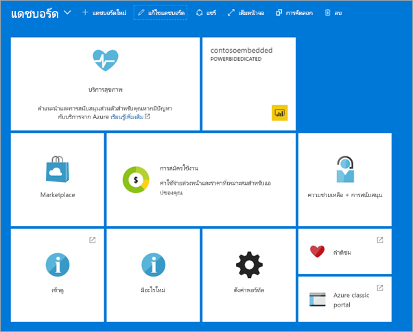

# สร้างความจุ Power BI Embedded ในพอร์ทัล Azure

บทความนี้แนะนำเกี่ยวกับวิธีการสร้างความจุ [Power BI Embedded](azure-pbie-what-is-power-bi-embedded.md) ใน Microsoft Azure Power BI Embedded ช่วยลดความสามารถของ Power BI ด้วยการช่วยให้คุณสามารถเพิ่มภาพ รายงาน และแดชบอร์ดที่สวยงามลงในแอปพลิเคชันของคุณได้อย่างรวดเร็ว

ถ้าคุณยังไม่มีการสมัครใช้งาน Azure สร้าง[บัญชีฟรี](https://azure.microsoft.com/free/)ก่อนที่คุณจะเริ่ม

> [!VIDEO https://www.youtube.com/embed/aXrvFfg_iSk]

## ก่อนที่คุณเริ่มต้น

เมื่อต้องการทำตามการเริ่มต้นใช้งานด่วน คุณจำเป็นต้อง:

* **สมัครใช้งาน azure:** เยี่ยมชม[ Azure รุ่นทดลองใช้ฟรี ](https://azure.microsoft.com/free/)เพื่อสร้างบัญชีผู้ใช้
* **Azure Active Directory:** การสมัครใช้งานของคุณต้องเชื่อมโยงกับผู้เช่าของ Azure Active Directory (AAD) นอกจากนี้ ***คุณต้องลงชื่อเข้าใช้ Azure ด้วยบัญชีผู้เช่ารายนั้น*** บัญชี Microsoft ไม่ได้รับการสนับสนุน หากต้องการเรียนรู้เพิ่มเติม ดู[การรับรองความถูกต้องและสิทธิ์ผู้ใช้](https://docs.microsoft.com/azure/analysis-services/analysis-services-manage-users)
* **ผู้เช่า Power BI:** บัญชีในผู้เช่า AAD ของคุณอย่างน้อยหนึ่งบัญชีต้องลงชื่อสมัครใช้งาน Power BI
* **กลุ่มทรัพยากร:** ใช้กลุ่มทรัพยากรที่คุณมีอยู่หรือ[สร้างกลุ่มใหม่](https://docs.microsoft.com/azure/azure-resource-manager/resource-group-overview)

## สร้างความจุ

1. ลงชื่อเข้าใช้[พอร์ทัล Azure](https://portal.azure.com/)

2. ในกล่องค้นหา ค้นหาสำหรับ*Power BI Embedded*

3. ภายใน Power BI Embedded เลือก**สร้าง**

4. กรอกข้อมูลที่จำเป็น จากนั้นเลือก**สร้าง**

    

    |การตั้งค่า |คำอธิบาย |
    |---------|---------|
    |**ชื่อทรัพยากร**|ชื่อเพื่อระบุความจุ ชื่อทรัพยากรจะแสดงอยู่ภายในพอร์ทัลผู้ดูแลระบบ Power BI นอกเหนือจากพอร์ทัล Azure|
    |**การสมัครใช้งาน**|การสมัครใช้งานที่คุณต้องการสร้างความจุ|
    |**กลุ่มทรัพยากร**|กลุ่มทรัพยากรที่ประกอบด้วยความจุใหม่นี้ เลือกจากกลุ่มทรัพยากรที่มีอยู่แล้วหรือสร้างกลุ่มอื่น สำหรับข้อมูลเพิ่มเติม ให้ดู[ภาพรวม Azure Resource Manager](https://docs.microsoft.com/azure/azure-resource-manager/resource-group-overview)|
    |**ผู้ดูแลระบบความจุ Power BI**|ผู้ดูแลระบบความจุ power BI สามารถดูความจุในพอร์ทัลผู้ดูแลระบบ Power BI และให้สิทธิ์ในการกำหนดผู้ใช้อื่นๆ ตามค่าเริ่มต้น ผู้ดูแลความจุคือ บัญชีของคุณ ผู้ดูแลระบบความจุต้องอยู่ภายในผู้เช่า Power BI ของคุณ|
    |**ตำแหน่งที่ตั้ง**|ตำแหน่งที่ตั้งที่โฮสต์ Power BI สำหรับผู้เช่าของคุณ ตำแหน่งเริ่มต้นของคุณคือ ภูมิภาคบ้านของคุณ แต่คุณสามารถเปลี่ยนตำแหน่งที่ตั้งโดยใช้[ตัวเลือก Multi-Geo](embedded-multi-geo.md)
    |**ระดับการกำหนดราคา**|เลือก SKU (วี-คอร์เคานต์และขนาดหน่วยความจำ) ที่ตรงตามความต้องการของคุณ  สำหรับรายละเอียดเพิ่มเติม ดู[การกำหนดราคา Power BI Embedded](https://azure.microsoft.com/pricing/details/power-bi-embedded/)|

คุณสามารถนำทางไปยัง **บริการทั้งหมด** > **Power BI Embedded**เพื่อดูว่าความจุของคุณพร้อมแล้วหรือยัง อีกวิธีหนึ่งคือ คุณสามารถเลือก**ปักหมุดลงในแดชบอร์ด**จากส่วนแจ้งเตือน หรือ จากภายในพาเนล การนำทางไปยังแดชบอร์ดของคุณเพื่อดูความจุของคุณใหม่ได้

## ขั้นตอนถัดไป

หากต้องการใช้ความจุ Power BI Embedded ใหม่ของคุณ โปรดเรียกดูพอร์ทัลผู้ดูแลระบบ Power BI เพื่อกำหนดพื้นที่ทำงาน สำหรับข้อมูลเพิ่มเติม โปรดดูที [จัดการความจุภายใน Power BI Premium และ Power BI Embedded](https://powerbi.microsoft.com/documentation/powerbi-admin-premium-manage/)

ถ้าคุณไม่จำเป็นต้องใช้ความจุนี้ คุณสามารถหยุดชั่วคราวเพื่อหยุดการเรียกเก็บเงินได้ สำหรับข้อมูลเพิ่มเติม โปรดดูที [เพื่อหยุดชั่วคราวและเริ่มต้นความจุ Power BI Embedded ในพอร์ทัล Azure](azure-pbie-pause-start.md)

ในการเริ่มต้นฝังเนื้อหา Power BI ในแอปพลิเคชันของคุณ โปรดดูที่[วิธีฝังแดชบอร์ด รายงาน และไทล์ใน Power BI ของคุณ](https://powerbi.microsoft.com/documentation/powerbi-developer-embedding-content/)

มีคำถามเพิ่มเติมหรือไม่ [ลองถามชุมชน Power BI](https://community.powerbi.com/)