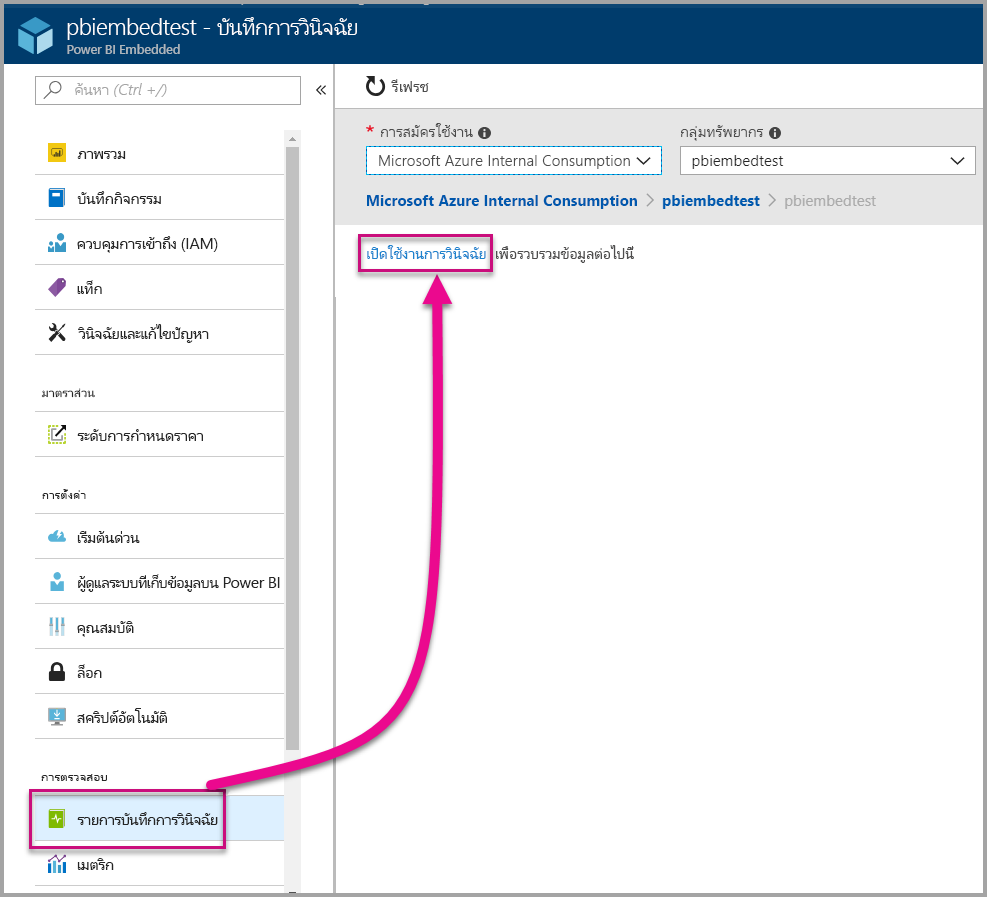
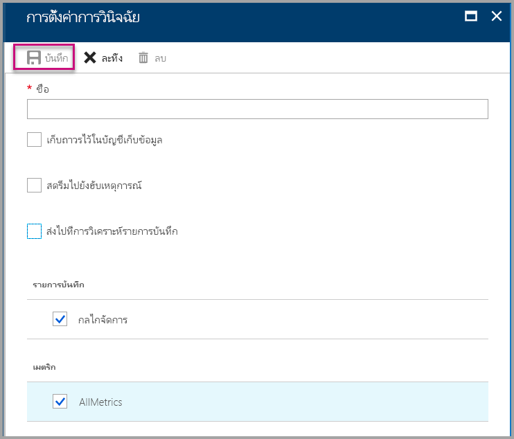
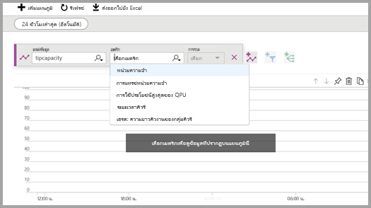
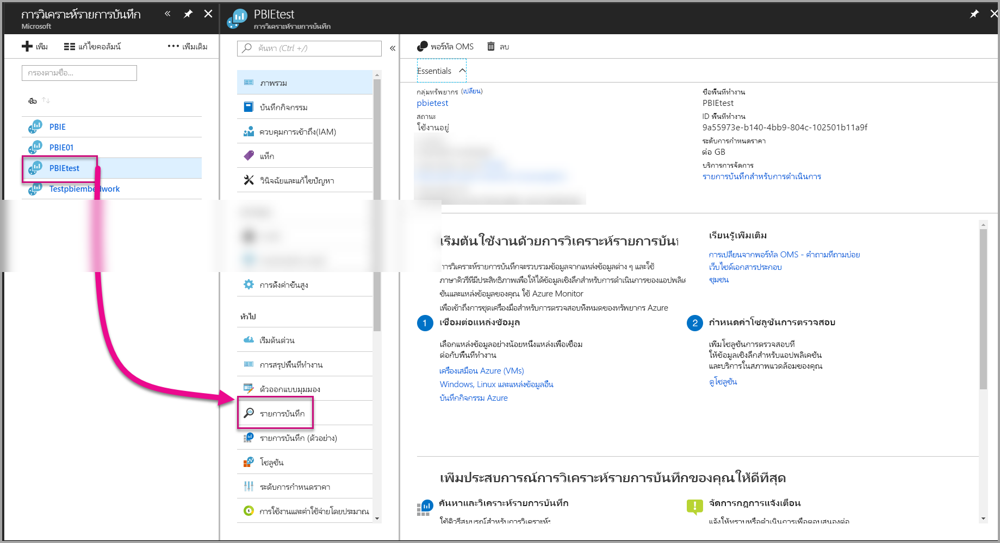
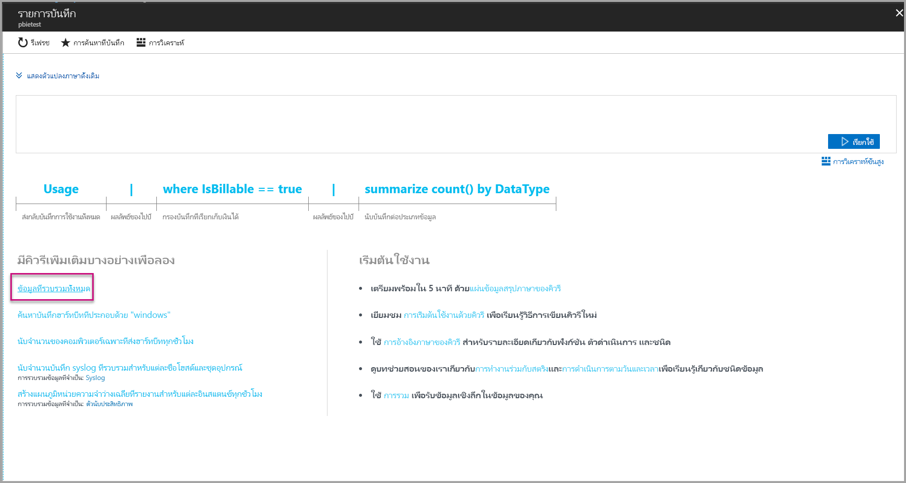
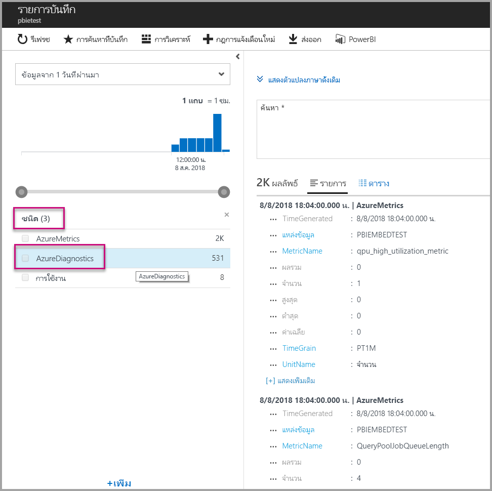
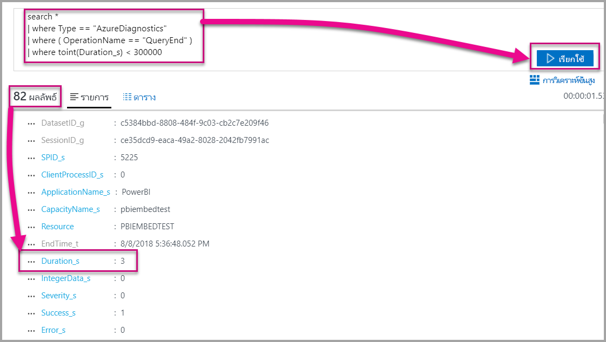
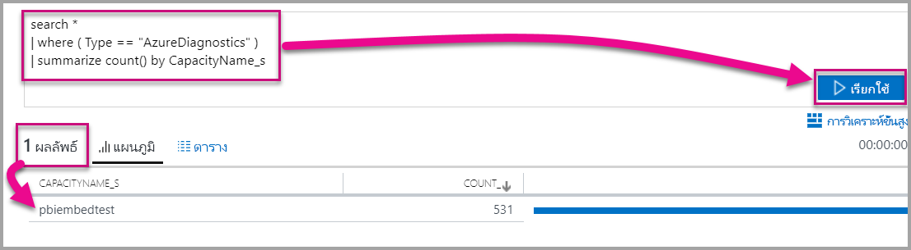

# <a name="diagnostic-logging-for-power-bi-embedded-in-azure"></a>บันทึกการวินิจฉัยสำหรับ Power BI Embedded ใน Azure

ด้วย[บันทึกการวินิจฉัยทรัพยากร Azure](https://docs.microsoft.com/azure/monitoring-and-diagnostics/monitoring-overview-of-diagnostic-logs)คุณสามารถบันทึกเหตุการณ์มากมายจากความจุของคุณ เพิ่มเหตุการณ์เหล่านั้นลงในเครื่องมือการวิเคราะห์ และรับข้อมูลเชิงลึกเกี่ยวกับการทำงานของทรัพยากรของคุณ

ใช้การวินิจฉัยสามารถตอบสถานการณ์จำลองได้ เช่น:

* ตรวจหาคิวรีที่ใช้งานเป็นเวลานานหรือมีปัญหา
* การจัดประเภทของ [เมตริกความจุ](https://powerbi.microsoft.com/blog/power-bi-developer-community-april-update/)
* ติดตามการใช้งานของชุดข้อมูลแบบเฉพาะเจาะจง

## <a name="set-up-diagnostics-logging"></a>ตั้งค่าการบันทึกการวินิจฉัย

### <a name="azure-portal"></a>พอร์ทัล Azure

1. ใน[พอร์ทัล Azure](https://portal.azure.com) > ทรัพยากร Power BI Embedded เลือก**บันทึกการวินิจฉัย**ในการนำทางด้านซ้าย แล้วเลือก**เปิดใช้งานการวินิจฉัย**

    

2. ใน**ตั้งค่าการวินิจฉัย**ระบุตัวเลือกต่อไปนี้:

    * **ชื่อ**-ใส่ชื่อสำหรับการตั้งค่าการวินิจฉัยเพื่อสร้าง

    * **เก็บถาวรไปยังบัญชีที่เก็บข้อมูล**- การใช้ตัวเลือกนี้ คุณจำเป็นต้องเชื่อมต่อกับบัญชีเก็บข้อมูลที่มีอยู่ ดู[สร้างบัญชีเก็บข้อมูล](https://docs.microsoft.com/azure/storage/common/storage-create-storage-account)และทำตามคำแนะนำเพื่อสร้างบัญชีเก็บข้อมูล หลังจากนั้นเลือกบัญชีที่เก็บข้อมูล โดยย้อนกลับไปยังหน้านี้ในพอร์ทัล ซึ่งอาจใช้เวลาสักครู่สำหรับบัญชีที่เก็บข้อมูลที่สร้างขึ้นใหม่เพื่อให้ปรากฏในเมนูดรอปดาวน์ ไฟล์บันทึกเก็บข้อมูลอยู่ในรูปแบบ JSON
    * **สตรีมไปยังฮับเหตุการณ์**- การใช้ตัวเลือกนี้ คุณจำเป็นต้องเชื่อมต่อกับอยู่ Event Hub namespace และเหตุการณ์ฮับ เมื่อต้องการเรียนรู้เพิ่มเติม ดู[สร้างมี namespace Event Hubs และฮับเหตุการณ์โดยใช้พอร์ทัล Azure](https://docs.microsoft.com/azure/event-hubs/event-hubs-create)
    * **ส่งไปยัง Log Analytics** - การใช้ตัวเลือกนี้ ต้องใช้พื้นที่ทำงานที่มีอยู่ หรือสร้างพื้นที่ทำงาน Log Analytics ใหม่ โดยทำตามขั้นตอนในการ[สร้างพื้นที่ทำงานใหม่](https://docs.microsoft.com/azure/log-analytics/log-analytics-quick-collect-azurevm#create-a-workspace)ในพอร์ทัล ใช้งาน[Azure Log Analytics](https://docs.microsoft.com/azure/log-analytics/log-analytics-overview)ซึ่งมีความสามารถในการวิเคราะห์ การทำแดชบอร์ด และการแจ้งเตือนอยู่ภายใน คุณสามารถใช้ Log Analytics เพื่อเชื่อมต่อข้อมูลเพิ่มเติมจากแหล่งข้อมูลอื่น ๆ และรับมุมมองเดียว ที่สมบูรณ์ของข้อมูลในแหล่งข้อมูลทั้งหมดของโปรแกรมประยุกต์ ซึ่งสามารถเชื่อมต่อกับ[Power BI ด้วยการคลิกครั้งเดียว](https://docs.microsoft.com/azure/log-analytics/log-analytics-powerbi)ได้ด้วย
    สำหรับข้อมูลเพิ่มเติมเกี่ยวกับการดูบันทึกของคุณใน Log Analytics ดู[ดูบันทึกใน Log Analytics](https://docs.microsoft.com/azure/log-analytics/log-analytics-activity)
    * **กลไกจัดการ** -เลือกตัวเลือกนี้เพื่อเข้าสู่ระบบชุดของกลไกจัดการ[เหตุการณ์ในรายการ](#whats-logged)ด้านล่าง
    * **AllMetrics** -เลือกตัวเลือกนี้เพื่อจัดเก็บข้อมูลโดยละเอียดใน[เมตริก](https://docs.microsoft.com/azure/analysis-services/analysis-services-monitor#server-metrics) ถ้าคุณเก็บถาวรไปยังบัญชีเก็บข้อมูล คุณสามารถเลือกระยะเวลาการเก็บข้อมูลสำหรับบันทึกการวินิจฉัยได้ บันทึกจะถูกลบโดยอัตโนมัติหลังจากรอบระยะเวลาเก็บข้อมูลหมดอายุลง

3. เลือก**บันทึก**

    หากต้องการเปลี่ยนวิธีบันทึกของบันทึกการวินิจฉัย คุณสามารถกลับไปยังหน้านี้เพื่อปรับเปลี่ยนการตั้งค่า

    

### <a name="using-powershell-to-enable-diagnostics"></a>ใช้ PowerShell เพื่อเปิดใช้งานการวินิจฉัย

เมื่อต้องการเปิดใช้งานเมตริกและเข้าสู่ระบบ โดยใช้ PowerShell การวินิจฉัย ให้ใช้คำสั่งต่อไปนี้:

* เมื่อต้องการเปิดใช้งานการเก็บข้อมูลของแฟ้มบันทึกการวินิจฉัยในบัญชีเก็บข้อมูล ให้ใช้คำสั่งนี้:

    ```powershell
    Set-AzureRmDiagnosticSetting -ResourceId [your resource id] -StorageAccountId [your storage account id] -Enabled $true
    ```
    ID บัญชีที่เก็บข้อมูลเป็น ID ทรัพยากรสำหรับบัญชีเก็บข้อมูลที่คุณต้องการส่งบันทึก

* เมื่อต้องการเปิดใช้งานสตรีมของแฟ้มบันทึกการวินิจฉัยไปยังฮับเหตุการณ์ ให้ใช้คำสั่งนี้:

    ```powershell
    Set-AzureRmDiagnosticSetting -ResourceId [your resource id] -ServiceBusRuleId [your service bus rule id] -Enabled $true
    ```
* ID กฎ Azure Service Bus คือสตริงที่มีรูปแบบนี้:

    ```powershell
    {service bus resource ID}/authorizationrules/{key name}
    ```

* เมื่อต้องการเปิดใช้งานการส่งบันทึกการวินิจฉัยไปยังพื้นที่ทำงาน Log Analytics ให้ใช้คำสั่งนี้:

    ```powershell
        Set-AzureRmDiagnosticSetting -ResourceId [your resource id] -WorkspaceId [resource id of the log analytics workspace] -Enabled $true
    ```

* คุณสามารถขอรับ ID ทรัพยากรของพื้นที่ทำงาน Log Analytics ของคุณ โดยใช้คำสั่งต่อไปนี้:

    ```powershell
    (Get-AzureRmOperationalInsightsWorkspace).ResourceId
    ```

คุณสามารถรวมพารามิเตอร์เหล่านี้เข้าด้วยกันเพื่อเปิดใช้งานผลลัพธ์หลายตัวเลือก

### <a name="rest-api"></a>REST API

เรียนรู้วิธีการ[เปลี่ยนการตั้งค่าการวินิจฉัย โดยใช้ตัวตรวจสอบ REST API Azure](https://docs.microsoft.com/rest/api/monitor/) 

### <a name="resource-manager-template"></a>เทมเพลต resource Manager

เรียนรู้วิธีการ[เปิดใช้งานการตั้งค่าการวินิจฉัยที่สร้างทรัพยากร โดยใช้เทมเพลต Resource Manager](https://docs.microsoft.com/azure/monitoring-and-diagnostics/monitoring-enable-diagnostic-logs-using-template)

## <a name="whats-logged"></a>บันทึกคืออะไร?

คุณสามารถเลือกประเภท**กลไก** / **AllMetrics**ได้

### <a name="engine"></a>กลไกจัดการ

ประเภทกลไกจัดการแนะนำทรัพยากรในการบันทึกเหตุการณ์ต่อไปนี้ และแต่ละเหตุการณ์มีคุณสมบัติ:

|     ชื่อเหตุการณ์     |     คำอธิบายเหตุการณ์     |
|----------------------------|----------------------------------------------------------------------------------|
|    เข้าสู่ระบบการตรวจสอบ    |    บันทึกการเชื่อมต่อใหม่ทั้งหมดลงในเหตุการณ์กลไกจัดการตั้งแต่เริ่มต้นใช้งานการติดตาม    |
|    เตรียมใช้งานเซสชัน    |    บันทึกเหตุการณ์เริ่มต้นเซสชันทั้งหมดตั้งแต่เริ่มต้นใช้งานการติดตาม    |
|    เริ่มต้นคิวรี Vertipaq    |    บันทึกเหตุการณ์เริ่มต้นคิวรี VertiPaq SE ทั้งหมด ตั้งแต่เริ่มต้นใช้งานการติดตาม    |
|    เริ่มต้นคิวรี    |    บันทึกเหตุการณ์เริ่มต้นคิวรีทั้งหมด ตั้งแต่เริ่มต้นใช้งานการติดตาม    |
|    คิวรีสิ้นสุด    |    บันทึกเหตุการณ์สิ้นสุดคิวรีทั้งหมด ตั้งแต่เริ่มต้นใช้งานการติดตาม    |
|    คิวรี Vertipaq สิ้นสุด    |    บันทึกเหตุการณ์สิ้นสุดคิวรี VertiPaq SE ทั้งหมด ตั้งแต่เริ่มต้นใช้งานการติดตาม    |
|    ออกจากระบบการตรวจสอบ    |    บันทึกเหตุการณ์ยกเลิกการเชื่อมจากกลไกจัดการทั้งหมดตั้งแต่เริ่มต้นใช้งานการติดตาม    |
|    ข้อผิดพลาด    |    บันทึกเหตุการณ์ข้อผิดพลาดโปรแกรมทั้งหมดตั้งแต่เริ่มต้นใช้งานการติดตาม    |

<br>
<br>

| ชื่อคุณสมบัติ | ตัวอย่างสิ้นสุดคิวรี Vertipaq | คำอธิบายคุณสมบัติ |
|-------------------|---------------------------------------------------------------------------------------------------------------------------------------------------------------------------------------------------------|--------------------------------------------------------------------------------------------------------------------------|
| EventClass | XM_SEQUERY_END | คลาสเหตุการณ์ถูกใช้เพื่อจัดประเภทเหตุการณ์ |
| EventSubclass | 0 | เหตุการณ์คลาสย่อยกิจกรรมมีข้อมูลเพิ่มเติมเกี่ยวกับแต่ละคลาสกิจกรรม (ตัวอย่าง 0: VertiPaq Scan) |
| RootActivityId | ff217fd2-611d-43c0-9c12-19e202a94f70 | ID กิจกรรมราก |
| CurrentTime | 2018-04-06T18:30:11.9137358Z | เวลาที่เหตุการณ์เริ่มต้นเมื่อพร้อมใช้งาน |
| startTime | 2018-04-06T18:30:11.9137358Z | เวลาที่เหตุการณ์เริ่มต้นเมื่อพร้อมใช้งาน |
| JobID | 0 | ID งานสำหรับความคืบหน้า |
| ObjectID | 464 | ID ของออบเจ็กต์ |
| ObjectType | 802012 | ObjectType |
| เวลาสิ้นสุด | 2018-04-06T18:30:11.9137358Z | เวลาที่เหตุการณ์สิ้นสุด |
| ระยะเวลา | 0 | ระยะเวลา (ในหน่วยมิลลิวินาที) ที่ใช้โดยกิจกรรม |
| SessionType | ผู้ใช้ | ประเภทเซสชัน (เอนทิตีใดที่เป็นเหตุให้เกิดการดำเนินการ) |
| ProgressTotal | 0 | ความคืบหน้าทั้งหมด |
| IntegerData | 0 | ข้อมูลจำนวนเต็ม |
| ความรุนแรง | 0 | ระดับความรุนแรงของข้อยกเว้น |
| ความสำเร็จ | 1 | 1 = สำเร็จ 0 = ล้มเหลว (ตัวอย่างเช่น 1 หมายถึงการตรวจสอบสิทธิ์เสร็จเรียบร้อยแล้ว และ 0 หมายถึงการตรวจสอบล้มเหลว) |
| ข้อผิดพลาด | 0 | จำนวนข้อผิดพลาดของกิจกรรมที่ให้ไว้ |
| ConnectionID | 3 | ID การเชื่อมต่อเฉพาะ |
| DatasetID | 5eaa550e-06ac-4adf-aba9-dbf0e8fd1527 | ID ของฐานข้อมูลที่คำสั่งของผู้ใช้กำลังทำงานอยู่ |
| SessionID | 3D063F66-A111-48EE-B960-141DEBDA8951 | GUID เซสชัน |
| SPID | 180 | ID กระบวนการของเซิร์ฟเวอร์ ซึ่งระบุเซสชันผู้ใช้โดยเฉพาะ ซึ่งสอดคล้องกับเซสชัน GUID ที่ใช้ โดย XML/a โดยตรง |
| ClientProcessID | null | ID กระบวนการของแอปพลิเคชันไคลเอ็นต์ |
| ApplicationName | null | ชื่อของแอปพลิเคชันไคลเอ็นต์ที่สร้างการเชื่อมต่อกับเซิร์ฟเวอร์ |
| CapacityName | pbi641fb41260f84aa2b778a85891ae2d97 | ชื่อของทรัพยากรความจุ Power BI Embedded |


### <a name="allmetrics"></a>AllMetrics

ตรวจสอบตัวเลือก**AllMetrics**บันทึกข้อมูลของเมตริกทั้งหมดที่คุณสามารถใช้กับทรัพยากร Power BI Embedded

   

## <a name="manage-your-logs"></a>จัดการบันทึกของคุณ

บันทึกจะพร้อมใช้งานโดยทั่วไปภายในสองสามชั่วโมงหลังจากการตั้งค่าการบันทึก การจัดการบันทึกของคุณในบัญชีที่เก็บข้อมูลของคุณนั้นขึ้นอยู่กับคุณ:

* ใช้วิธีการควบคุมการเข้าถึง Azure แบบมาตรฐานเพื่อรักษาความปลอดภัยบันทึกของคุณ โดยการจำกัดว่าใครสามารถเข้าถึงได้บ้าง
* ลบไฟล์บันทึกที่คุณไม่ต้องการเก็บไว้ในบัญชีที่เก็บข้อมูลของคุณ
* ตรวจสอบให้แน่ใจว่าได้ทำการตั้งค่าระยะเวลาการเก็บข้อมูล เพื่อบันทึกเก่าจะถูกลบออกจากบัญชีที่เก็บข้อมูลของคุณ

## <a name="view-logs-in-log-analytics"></a>มุมมองบันทึกใน Log Analytics

เหตุการณ์เมตริกและเซิร์ฟเวอร์ผสานเข้ากับ xEvents ใน Log Analytics สำหรับการวิเคราะห์แบบเปรียบเทียบกัน นอกจากนี้ยังสามารถกำหนดค่า log Analytics เพื่อรับเหตุการณ์จากบริการอื่น ๆ ของ Azure ที่มีมุมมองภาพรวมของข้อมูลบันทึกการวินิจฉัยทั่วทั้งสถาปัตยกรรมของคุณ

เมื่อต้องการดูข้อมูลการวินิจฉัยของคุณใน Log Analytics ให้เปิดหน้า**บันทึก**จากเมนูทางด้านซ้ายหรือบริเวณการจัดการ ดังที่แสดงด้านล่าง



หลังจากที่คุณได้เปิดใช้งานคอลเลกชันข้อมูล ใน**บันทึก**เลือก**ทั้งหมดรวบรวมข้อมูล**



ใน**ชนิด**เลือก**AzureDiagnostics**และจากนั้น เลือก**นำไปใช้** AzureDiagnostics มีกลไกจัดการเหตุการณ์ โปรดสังเกตว่า คิวรี Log Analytics ได้ถูกสร้างขึ้นในทันที



เลือก**EventClass\_s**หรือชื่อเหตุการณ์และ Log Analytics จะยังคงสร้างคิวรีต่อไป อย่าลืมบันทึกคิวรีของคุณเพื่อนำมาใช้ใหม่ในภายหลัง

โปรดดู[Log Analytics](https://docs.microsoft.com/azure/log-analytics/)ซึ่งมีเว็บไซต์กับคิวรีขั้นสูง การทำแดชบอร์ด และความสามารถในการแจ้งเตือนบนข้อมูลที่รวบรวม

### <a name="queries"></a>คิวรี

มีหลายร้อยคิวรีที่คุณสามารถใช้ได้ นี่คือบางคิวรีที่คุณสามารถเริ่มใช้งานได้ เมื่อต้องการเรียนรู้เพิ่มเติมเกี่ยวกับการใช้ภาษาคิวรีค้นหาบันทึกใหม่ ดู[ค้นหาบันทึกการทำความเข้าใจใน Log Analytics](https://docs.microsoft.com/azure/log-analytics/log-analytics-log-search)

* คิวรีส่งกลับที่ใช้เวลาน้อยกว่าห้านาที (300,000 มิลลิวินาที) เพื่อทำให้เสร็จสมบูรณ์

    ```
    search *
    | where Type == "AzureDiagnostics"
    | where ( OperationName == "QueryEnd" )
    | where toint(Duration_s) < 300000
    ```

    

* ระบุชื่อกำลังการผลิต

    ```
    search *
    | where ( Type == "AzureDiagnostics" )
    | summarize count() by CapacityName_s 
    ```

    

## <a name="next-steps"></a>ขั้นตอนถัดไป

คุณสามารถเรียนรู้เพิ่มเติมเกี่ยวกับบันทึกการวินิจฉัยทรัพยากร Azure

> [!div class="nextstepaction"]
> [บันทึกการวินิจฉัยทรัพยากร azure](https://docs.microsoft.com/azure/monitoring-and-diagnostics/monitoring-overview-of-diagnostic-logs)

> [!div class="nextstepaction"]
> [ชุด-AzureRmDiagnosticSetting](https://docs.microsoft.com/powershell/module/azurerm.insights/Set-AzureRmDiagnosticSetting)
