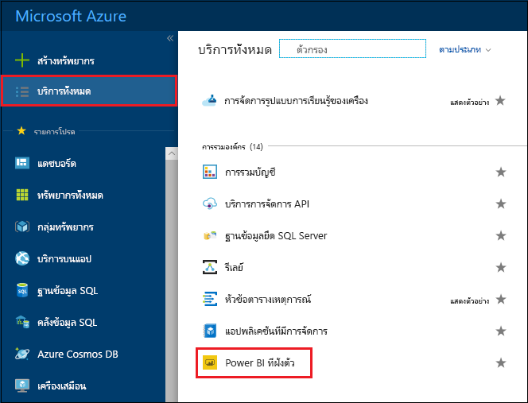
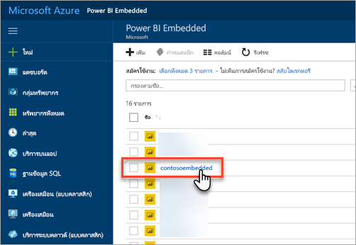
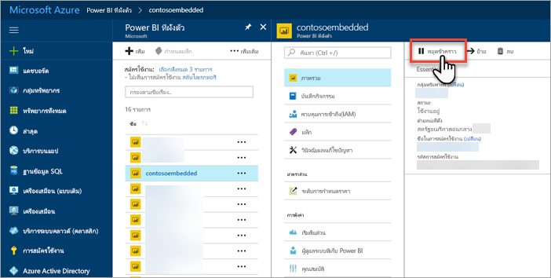
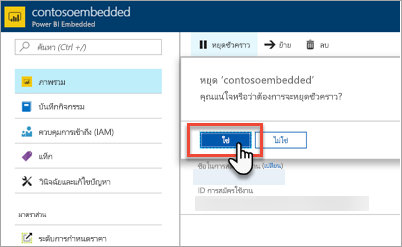
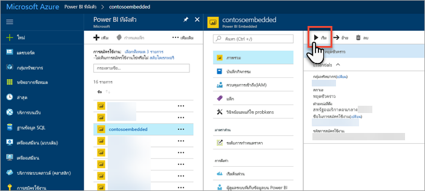
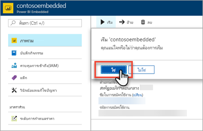

# เพื่อหยุดชั่วคราวและเริ่มต้นความจุ Power BI Embedded ในพอร์ทัล Azure

บทความนี้แนะนำเกี่ยวกับวิธีการหยุดชั่วคราวและเริ่มต้น Power BI Embedded ใน Microsoft Azure ซึ่งถือว่า คุณได้สร้างขีดความจุ Power BI Embedded แล้ว หากคุณยังไม่ได้สร้าง ให้ดู[สร้างความจุ Power BI Embedded ในพอร์ทัล Azure](azure-pbie-create-capacity.md) เพื่อเริ่มใช้งาน

ถ้าคุณยังไม่มีการสมัครใช้งาน Azure สร้าง[บัญชีฟรี](https://azure.microsoft.com/free/)ก่อนที่คุณจะเริ่ม

## หยุดความจุของคุณชั่วคราว

การหยุดความจุของคุณชั่วคราวช่วยป้องกันไม่ให้คุณถูกเรียกเก็บเงิน การหยุดความจุของคุณชั่วคราวจะเป็นเรื่องที่เยี่ยมยอด ่ถ้าคุณไม่จำเป็นต้องใช้ความจุเป็นระยะเวลาหนึ่ง ใช้ขั้นตอนต่อไปนี้เพื่อหยุดความจุของคุณชั่วคราว

> [!NOTE]
> การหยุดความจุชั่วคราวอาจทำให้เนื้อหาไม่พร้อมใช้งานภายใน Power BI ตรวจสอบว่าได้ยกเลิกการมอบหมายพื้นที่ทำงานจากความจุของคุณก่อนที่จะหยุดชั่วคราวเพื่อป้องกันไม่ให้ถูกขัดจังหวะ

1. ลงชื่อเข้าใช้[พอร์ทัล Azure](https://portal.azure.com/)

2. เลือก**บริการทั้งหมด** > **Power BI Embedded**เพื่อดูความจุของคุณ

    

3. เลือกความจุที่คุณต้องการหยุดชั่วคราว

    

4. เลือก**หยุดชั่วคราว**ภายในรายละเอียดความจุ

    

5. เลือก**ใช่** ซึ่งยืนยันว่าคุณต้องการหยุดความจุชั่วคราว

    

## เริ่มต้นความจุของคุณชั่วคราว

กลับมาใช้งานโดยเริ่มต้นความจุของคุณอีกครั้ง เริ่มต้นความจุของคุณ รวมถึงดำเนินการเรียกเก็บเงินต่ออีกด้วย

1. ลงชื่อเข้าใช้[พอร์ทัล Azure](https://portal.azure.com/)

2. เลือก**บริการทั้งหมด** > **Power BI Embedded**เพื่อดูความจุของคุณ

    

3. เลือกความจุที่คุณต้องการเริ่มต้น

    

4. เลือก **เริ่มต้น** ภายในรายละเอียดความจุ

    

5. เลือก **ใช่** ซึ่งยืนยันว่าคุณต้องกาเริ่มต้นความจุ

    

หากมีการกำหนดเนื้อหาไปยังความจุนี้ เนื้อหาจะสามารถใช้งานได้เมื่อเริ่มต้นแล้ว

## ขั้นตอนถัดไป

ถ้าคุณต้องการปรับขนาดความจุของคุณขึ้นหรือลงดู[ปรับขนาดความจุ Power BI Embedded ของคุณ](azure-pbie-scale-capacity.md)

ในการเริ่มต้นฝังเนื้อหา Power BI ในแอปพลิเคชันของคุณ โปรดดูที่[วิธีฝังแดชบอร์ด รายงาน และไทล์ใน Power BI ของคุณ](https://powerbi.microsoft.com/documentation/powerbi-developer-embedding-content/)

มีคำถามเพิ่มเติมหรือไม่ [ลองถามชุมชน Power BI](https://community.powerbi.com/)