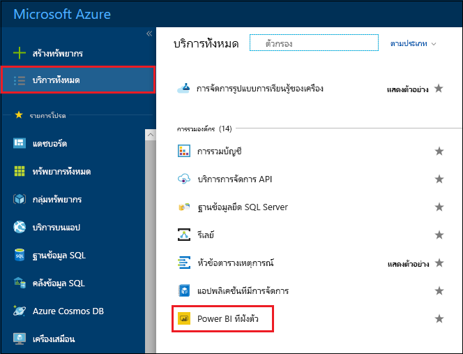
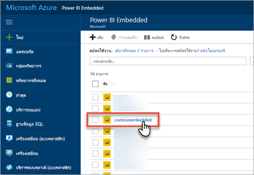
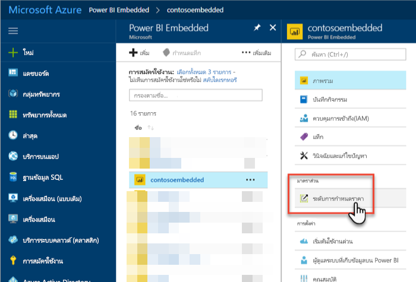
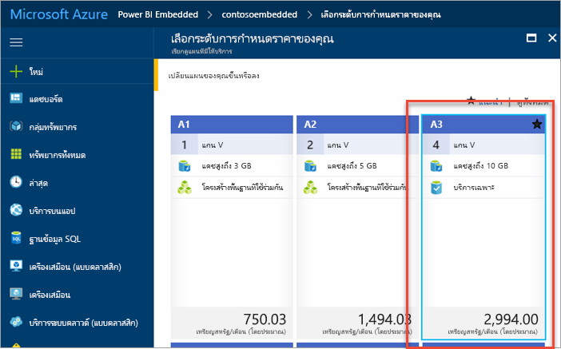
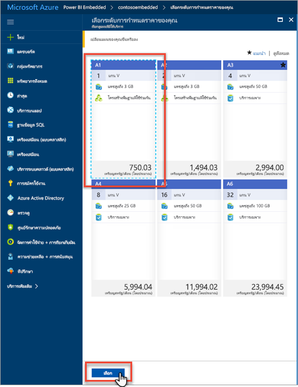
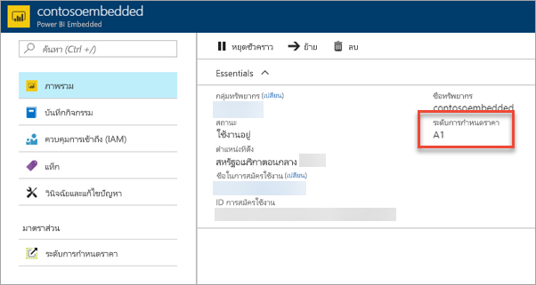

# ปรับขนาดความจุ Power BI Embedded ในพอร์ทัล Azure

บทความนี้แนะนำเกี่ยวกับวิธีการปรับขนาดความจุ Power BI Embedded ใน Microsoft Azure การปรับขนาดช่วยให้คุณสามารถเพิ่มหรือลดขนาดความจุของคุณได้

ซึ่งถือว่า คุณได้สร้างขีดความจุ Power BI Embedded แล้ว หากคุณยังไม่ได้สร้าง ให้ดู[สร้างความจุ Power BI Embedded ในพอร์ทัล Azure](azure-pbie-create-capacity.md) เพื่อเริ่มใช้งาน

> [!NOTE]
> การดำเนินการปรับขนาดอาจใช้เวลาประมาณหนึ่งนาที ในช่วงเวลานี้ จะไม่สามารถใช้งานความจุได้ การโหลดเนื้อหาแบบฝังตัวอาจล้มเหลว

## ปรับขนาดความจุ

1. ลงชื่อเข้าใช้[พอร์ทัล Azure](https://portal.azure.com/)

2. เลือก**บริการทั้งหมด** > **Power BI Embedded**เพื่อดูความจุของคุณ

    

3. เลือกความจุที่คุณต้องการปรับขนาด

    

4. เลือก **ระดับราคา** ภายใต้ **มาตราส่วน** ภายในความจุของคุณ

    

    ระดับการกำหนดราคาปัจจุบันของคุณจะมีกรอบเป็นสีฟ้า

    

5. เมื่อต้องการปรับมาตราส่วนขึ้นหรือลง เลือกระดับใหม่เพื่อย้ายไปยังตำแหน่งที่ต้องการ การเลือกระดับใหม่จะวางเส้นขอบสีฟ้าล้อมรอบบริเวณที่เลือกไว้ เลือก**เลือก**เพื่อปรับขนาดเป็นระดับใหม่

    

    การปรับขนาดความจุของคุณอาจใช้เวลาสักครู่หรือสองนาทีจึงจะเสร็จสมบูรณ์

6. ยืนยันระดับของคุณโดยดูจากแท็บภาพรวม ระดับการกำหนดราคาปัจจุบันจะแสดงอยู่ในรายการ

    

## ขั้นตอนถัดไป

ในการหยุดชั่วคราวหรือเริ่มต้นความจุของคุณ ให้ดูที[่หยุดชั่วคราวและเริ่มต้นความจุ Power BI Embedded ในพอร์ทัล Azure](azure-pbie-pause-start.md)

ในการเริ่มต้นฝังเนื้อหา Power BI ในแอปพลิเคชันของคุณ โปรดดูที่[วิธีฝังแดชบอร์ด รายงาน และไทล์ใน Power BI ของคุณ](https://powerbi.microsoft.com/documentation/powerbi-developer-embedding-content/)

มีคำถามเพิ่มเติมหรือไม่ [ลองถามชุมชน Power BI](http://community.powerbi.com/)
