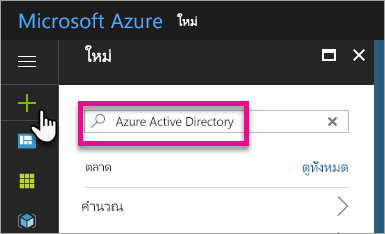
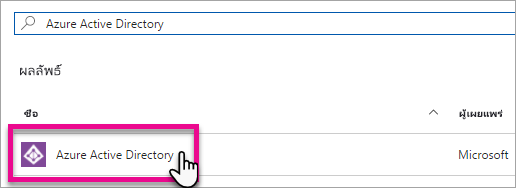
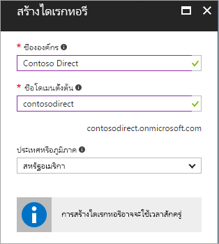
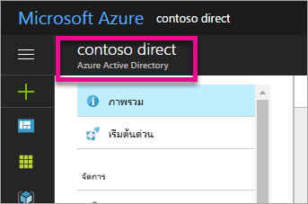
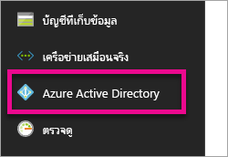
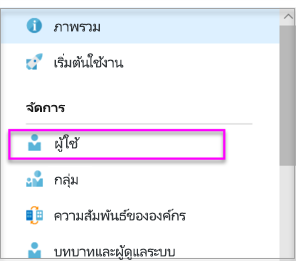
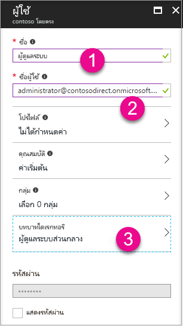
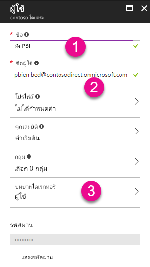
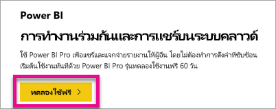

# สร้างผู้เช่า Azure Active Directory เพื่อใช้กับ Power BI

เรียนรู้วิธีการสร้างผู้เช่า Azure Active Directory (Azure AD) ใหม่สำหรับแอปพลิเคชันแบบกำหนดเองที่เรียกใช้ [Power BI REST API](rest-api-reference.md)

ผู้เช่าเป็นตัวแทนองค์กรใน Azure Active Directory ซึ่งเป็นอินสแตนซ์เฉพาะของบริการ Azure AD ที่องค์กรได้รับและเป็นเจ้าของเมื่อลงทะเบียนสมัครใช้บริการระบบคลาวด์ของ Microsoft เช่น Azure, Microsoft Intune หรือ Office 365 ผู้เช่า Azure AD แต่ละรายจะแตกต่างกันและแยกต่างหากจากผู้เช่า Azure AD อื่น ๆ

เมื่อมีผู้เช่า Azure AD คุณสามารถกำหนดแอปพลิเคชันและกำหนดสิทธิเพื่อให้แอปพลิเคชันของคุณสามารถเรียกใช้ [Power BI REST API](rest-api-reference.md) ได้

องค์กรของคุณอาจมีผู้เช่า Azure AD ที่คุณสามารถใช้สำหรับแอปพลิเคชันของคุณอยู่แล้ว นอกจากนี้คุณยังสามารถสร้างผู้เช่าใหม่เฉพาะสำหรับแอปพลิเคชันของคุณได้อีกด้วย บทความนี้แสดงถึ่งวิธีการสร้างผู้เช่าใหม่

## สร้างผู้เช่า Azure Active Directory

เพื่อรวม Power BI ลงในแอปพลิเคชันแบบกำหนดเองของคุณ คุณจำเป็นต้องกำหนดแอปพลิเคชันภายใน Azure AD ซึ่งจำเป็นต้องมีไดเรกทอรีของ Azure AD ไดเรกทอรีนี้เป็น*ผู้เช่า* ของคุณ ถ้าองค์กรของคุณยังไม่มีผู้เช่า เนื่องจากพวกเขาไม่ได้ใช้ Power BI หรือ Office 365 จากนั้น [คุณต้องตั้งค่าเครื่องมือที่ช่วยพัฒนาโปรแกรม](https://docs.microsoft.com/azure/active-directory/develop/active-directory-howto-tenant) นอกจากนี้ คุณยังต้องสร้างหนึ่งสภาพแวดล้อมถ้าไม่ต้องการให้แอปพลิเคชันของคุณผสมปะปนกับผู้เช่าขององค์กรของคุณ อนุญาตให้คุณเก็บสิ่งที่แยกออกมาต่างหากได้ หรือคุณอาจเพียงแค่ต้องการสร้างผู้เช่าเพื่อทำการทดสอบ

เมื่อต้องสร้างผู้เช่า Azure AD ใหม่:

1. เรียกดู [พอร์ทัล Azure](https://portal.azure.com)และลงชื่อเข้าใช้ด้วยบัญชีผู้ใช้ที่มีการสมัครใช้งาน Azure

2. เลือก **ไอคอนเครื่องหมายบวก (+)**  และค้นหา **Azure Active Directory**

    

3. เลือก **Azure Active Directory** ในผลลัพธ์การค้นหา

    

4. เลือก **สร้าง**

5. ระบุ**ชื่อองค์กร**และ**ชื่อโดเมนเริ่มต้น** แล้วเลือก **สร้าง** ไดเรกทอรีของคุณจะถูกสร้างขึ้น

    

   > [!NOTE]
   > โดเมนเริ่มต้นของคุณคือ ส่วนหนึ่งของ onmicrosoft.com คุณสามารถเพิ่มชื่อโดเมนอื่น ๆ ได้ในภายหลัง ไดเรกทอรีผู้เช่าอาจมีได้หลายโดเมนที่กำหนดไว้

6. หลังจากการสร้างไดเรกทอรีของคุณเสร็จสมบูรณ์ เลือกกล่องข้อมูลเพื่อจัดการไดเรกทอรีใหม่ของคุณ

ถัดไป คุณกำลังจะเพิ่มผู้ใช้ที่เป็นผู้เช่า

## สร้างผู้ใช้ที่เป็นผู้เช่า Azure Active Directory

ตอนนี้เรามีไดเรกทอรีแล้ว มาสร้างผู้ใช้อย่างน้อยสองรายกัน หนึ่งคือ ผู้ดูแลระบบส่วนกลางผู้เช่า และอีกรายคือ ผู้ใช้หลักสำหรับการฝังตัว คุณสามารถนึกภาพหลังจากนั้นเป็นบัญชีบริการได้

1. ภายในพอร์ทัล Azure ตรวจสอบให้แน่ใจว่าคุณกำลังอยู่บน Azure Active Directory ที่ปรากฎขึ้นทางด้านข้าง

    

    ถ้าไม่เป็นเช่นนั้น เลือกไอคอน Azure Active Directory จากแถบบริการทางด้านซ้าย

    

2. ภายใต้ **จัดการ** เลือก **ผู้ใช้**

    

3. เลือก **ผู้ใช้ทั้งหมด** แล้วเลือก **+ ผู้ใช้ใหม่**

4. ระบุ**ชื่อ**และ**ชื่อผู้ใช้**สำหรับผู้ดูแลระบบส่วนกลางผู้เช่าของคุณ เปลี่ยน **บทบาทไดเรกทอรี**ให้เป็น**ผู้ดูแลระบบส่วนกลาง** คุณยังสามารถแสดงรหัสผ่านชั่วคราวได้ เมื่อคุณทำเสร็จแล้ว เลือก **สร้าง**

    

5. ให้ทำแบบเดียวกันสำหรับผู้ใช้ที่เป็นผู้เช่าทั่วไป คุณสามารถใช้บัญชีนี้สำหรับบัญชีฝังตัวหลักของคุณ ในเวลานี้ สำหรับ**บทบาทไดเรกทอรี** ปล่อยให้เป็น **ผู้ใช้** จดรหัสผ่าน จากนั้นเลือก **สร้าง**

    

6. ลงทะเบียนสมัครใช้สำหรับ Power BI ด้วยบัญชีผู้ใช้ที่คุณสร้างในขั้นตอนที่ 5 ไปที่ [powerbi.com](https://powerbi.microsoft.com/get-started/) และเลือก **ทดลองใช้ฟรี** ภายใต้ **Power BI - การทำงานร่วมกันและการแชร์บนระบบคลาวด์**

    

    เมื่อคุณลงทะเบียนสมัครใช้ คุณจะได้รับแจ้งให้ทดลองใช้ Power BI Pro ฟรีเป็นเวลา 60 วัน คุณสามารถเลือกเพื่อกลายเป็นผู้ใช้ระดับ Pro ซึ่งทำให้คุณมีตัวเลือกในการ[เริ่มต้นพัฒนาโซลูชันแบบฝังตัว](embedding-content.md)ได้

   > [!NOTE]
   > ตรวจสอบให้แน่ใจว่าคุณลงทะเบียนสมัครใช้ด้วยที่อยู่อีเมลของบัญชีผู้ใช้ของคุณ

## ขั้นตอนถัดไป

ตอนนี้คุณมีผู้เช่า Azure AD แล้ว คุณสามารถใช้ผู้เช่านี้เพื่อทดสอบรายการภายใน Power BI ได้ คุณยังสามารถฝังแดชบอร์ด Power BI และรายงานในแอปพลิเคชันของคุณได้อีกด้วย สำหรับข้อมูลเพิ่มเติม ดู [วิธีฝังแดชบอร์ด รายงานและไทล์ Power BI ของคุณ](embedding-content.md)

[แล้ว Azure Active Directory คืออะไร?](https://docs.microsoft.com/azure/active-directory/active-directory-whatis) 
 
[เริ่มต้นใช้งานด่วน: ตั้งค่าเครื่องมือที่ช่วยในการพัฒนาโปรแกรม](https://docs.microsoft.com/azure/active-directory/develop/active-directory-howto-tenant)  

มีคำถามเพิ่มเติมหรือไม่? [ลองถามชุมชน Power BI](http://community.powerbi.com/)
