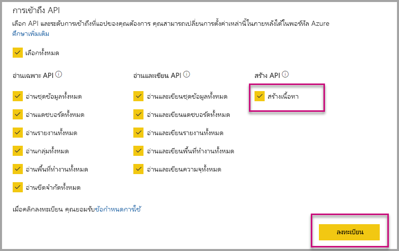

# แอป Power BI ติดตั้งโดยอัตโนมัติเมื่อมีการฝังสำหรับองค์กรของคุณ

ต้องมีผู้ใช้ที่ถูกฝังการฝังเนื้อหาจากแอป[เข้าถึงแอ](../service-create-distribute-apps.md) ถ้าคุณติดตั้งแอปสำหรับผู้ใช้ ฝังแล้ว ทำงานได้อย่างราบรื่น สำหรับข้อมูลเพิ่มเติม ดู[ฝังรายงานหรือแดชบอร์ดจากแอ](embed-from-apps.md) จำเป็นต้องกำหนดใน PowerBI.com ที่สามารถแอปทั้งหมด[ติดตั้งโดยอัตโนมัติ](https://powerbi.microsoft.com/blog/automatically-install-apps/) อย่างไรก็ตาม การดำเนินการนี้เสร็จแล้วที่ระดับผู้เช่า และนำไปใช้กับแอปทั้งหมด

## แอปติดตั้งโดยอัตโนมัติบนฝัง

ถ้าผู้ใช้มีสิทธิ์เข้าถึงแอป แต่ยังไม่ได้ติด ตั้งแอป แล้ว ฝังล้มเหลว เพื่อให้คุณสามารถหลีกเลี่ยงความล้มเหลวเหล่านี้เมื่อมีการฝังจากแอป คุณสามารถอนุญาตให้ติดตั้งโดยอัตโนมัติ app เมื่อมีการฝัง การดำเนินการนี้หมายความว่า ถ้าไม่ได้ติดตั้งแอปผู้ใช้พยายามฝัง จะถูกติดตั้งโดยอัตโนมัติสำหรับคุณ ดังนั้น เนื้อหาคุณต้องรับฝังทันที ได้ผลลัพธ์เป็นประสบการณ์ราบรื่นสำหรับผู้ใช้

## ฝังตัวสำหรับผู้ใช้ Power BI (ผู้ใช้เป็นเจ้าของข้อมูล)

เพื่ออนุญาตให้ติดตั้งแอปโดยอัตโนมัติสำหรับผู้ใช้ของคุณ คุณจำเป็นต้องให้สิทธิ์ 'สร้างเนื้อหา' แอปพลิเคชันของคุณเมื่อ[ลงทะเบียนแอปพลิเคชัน](register-app.md#register-with-the-power-bi-application-registration-tool)หรือเพิ่มถ้าคุณลงทะเบียนแอปของคุณ

ถัดไป คุณต้องระบุ ID โปรแกรมประยุกต์ใน URL ฝัง เมื่อต้องใส่ ID แอป ผู้สร้างแอปก่อนอื่นต้องติดตั้งแอปจาก นั้นใช้หนึ่งได้รับการสนับสนุน[Power BI Rest API](https://docs.microsoft.com/rest/api/power-bi/)โทร - [Get Reports](https://docs.microsoft.com/rest/api/power-bi/reports/getreports)หรือ[รับแดชบอร์ด](https://docs.microsoft.com/rest/api/power-bi/dashboards/getdashboards) แล้ว ผู้สร้างแอปจำเป็นต้องใช้ Url ฝังจากคำตอบ REST API ID แอปปรากฏใน URL ถ้าเนื้อหาจากแอป  หลังจากที่คุณมี URL ฝัง คุณสามารถใช้เพื่อฝังอย่างสม่ำเสมอ

## รักษาความปลอดภัยฝัง

เมื่อต้องใช้ติดตั้งโดยอัตโนมัติของแอป ผู้สร้างแอปก่อนอื่นต้องติดตั้งแอปจาก นั้นไปยัง app บน PowerBI.com นำทางไปยังรายงาน และรับลิงก์ในปกติ ผู้ใช้อื่น ๆ ทั้งหมดที่สามารถเข้าถึงแอปที่สามารถใช้การเชื่อมโยงสามารถฝังรายงาน

## ข้อควรพิจารณาและข้อจำกัด

* เฉพาะคุณสามารถฝังรายงานและแดชบอร์ดสำหรับสถานการณ์สมมตินี้

* คุณลักษณะนี้ในขณะนี้ไม่สนับสนุนสำหรับแอปเป็นเจ้าของข้อมูล และสถานการณ์ที่ฝังใน SharePoint