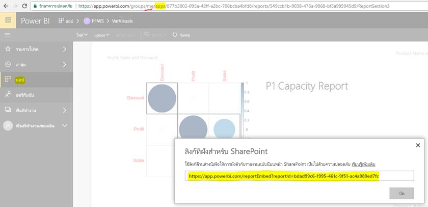

# ฝังรายงานหรือแดชบอร์ดจากแอป

ใน Power BI คุณสามารถสร้างแอปเพื่อนำแดชบอร์ดและรายงานที่เกี่ยวข้องเข้าด้วยกัน ทั้งหมดในที่เดียว จากนั้นคุณสามารถเผยแพร่แอปที่เสร็จแล้วไปยังกลุ่มบุคคลขนาดใหญ่ต่างๆ ในองค์กรของคุณได้ การใช้งานของแอปเหล่านั้นจะเกี่ยวข้องเมื่อผู้ใช้ทั้งหมดของคุณคือ ผู้ใช้ Power BI ดังนั้น คุณสามารถแชร์เนื้อหากับบุคคลเหล่านั้น โดยใช้แอป Power BI ได้ เราต้องการแชร์ขั้นตอนที่รวดเร็วเกี่ยวกับวิธีการฝังเนื้อหาออกจากแอป Power BI ที่เผยแพร่ และลงในแอปพลิเคชันของบริษัทอื่น

## จับ embedURL รายงานสำหรับการฝังตัว

1. สร้างอินสแตนซ์ของแอปพลิเคชันในพื้นที่ทำงานของผู้ใช้**พื้นที่ทำงานของฉัน** ไม่ว่าจะแชร์ด้วยตัวคุณเอง หรือผู้ใช้อื่นจะทำตามขั้นตอนนี้ให้คำแนะนำ

2. เปิดรายงานคุณต้องการในบริการ Power BI

3. ไปยัง **แฟ้ม** > **ฝังใน SharePoint Online**และจับ embedURL รายงานจากที่นั่น ตัวอย่างการ embedURL ถูกแสดงบริเวณด้านล่างสแนปช็อต อีกทางเลือกหนึ่ง คุณสามารถเรียกใช้ GetReports/GetReport REST API และแยกฟิลด์ embedURL รายงานเกี่ยวข้องออกจากการตอบสนอง การเรียก REST ไม่ควรมีตัวระบุพื้นที่ทำงานเป็นส่วนหนึ่งของ URL ตามที่ได้รับการสร้างอินสแตนซ์ในพื้นที่ทำงานของผู้ใช้แอป

    

4. ใช้ embedURL เรียกใช้ในขั้นตอนที่ 3 ด้วย JavaScript SDK

## จับ embedURL รายงานสำหรับการฝังตัว

1. สร้างอินสแตนซ์ของแอปพลิเคชันในพื้นที่ทำงานของผู้ใช้**พื้นที่ทำงานของฉัน** ไม่ว่าจะแชร์ด้วยตัวคุณเอง หรือผู้ใช้อื่นจะทำตามขั้นตอนนี้ให้คำแนะนำ

2. หรือเรียกใช้ REST API และแยกเขตข้อมูลแดชบอร์ด embedURL ออกจากการตอบสนอง การเรียก REST ไม่ควรมีตัวระบุพื้นที่ทำงานเป็นส่วนหนึ่งของ URL ตามที่ได้รับการสร้างอินสแตนซ์ในพื้นที่ทำงานของผู้ใช้แอป

3. ใช้ embedURL เรียกใช้ในขั้นตอนที่ 2 มี JavaScript SDK

## ขั้นตอนถัดไป

ตรวจสอบวิธีการฝังตัวจากพื้นที่ทำงานสำหรับลูกค้าของบริษัทอื่นและองค์กรของคุณ:

> [!div class="nextstepaction"]
>[แบบฝังตัวสำหรับลูกค้าของบริษัทอื่น](embed-sample-for-customers.md)

> [!div class="nextstepaction"]
>[ฝังตัวสำหรับองค์กรของคุณ](embed-sample-for-your-organization.md)
