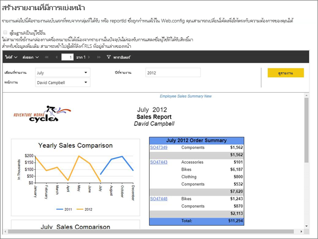
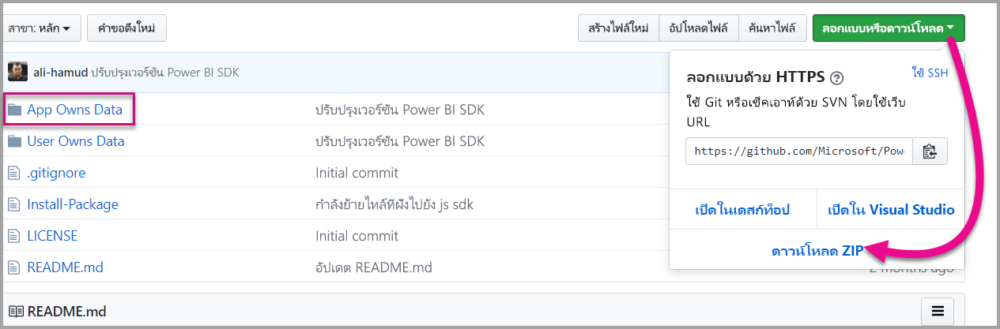
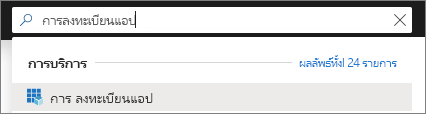
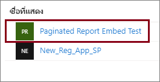
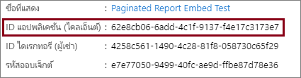
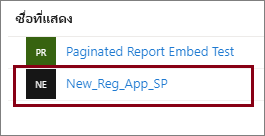
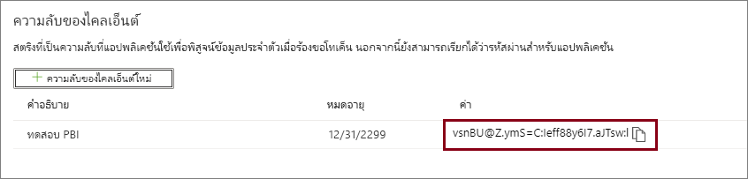
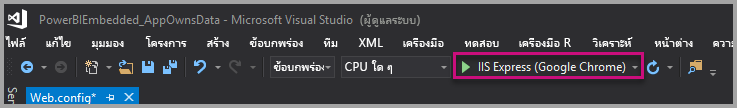
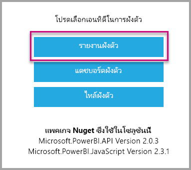

# <a name="tutorial-embed-power-bi-paginated-reports-into-an-application-for-your-customers-preview"></a>บทช่วยสอน: ฝังรายงานที่มีการแบ่งหน้าของ Power BI ในแอปพลิเคชันสำหรับลูกค้าของคุณ (ตัวอย่าง)

ด้วย **Power BI Embedded in Azure** หรือ **Power BI embedding in Office** คุณสามารถฝังรายงานที่มีการแบ่งหน้าลงในแอปพลิเคชันโดยใช้ข้อมูลที่แอปเป็นเจ้าของ **แอปเป็นเจ้าของข้อมูล** เกี่ยวกับแอปพลิเคชันที่ใช้ Power BI เป็นแพลตฟอร์มการวิเคราะห์แบบฝังตัว ในฐานะที่เป็น **ISV** หรือ **นักพัฒนา** คุณสามารถสร้างเนื้อหา Power BI ที่แสดงรายงานที่มีการแบ่งหน้าในแอปพลิเคชันที่รวมงานทั้งหมดไว้ด้วยกันและที่โต้ตอบได้ โดยผู้ใช้ไม่ต้องมีสิทธิ์การใช้งาน Power BI บทช่วยสอนนี้สาธิตวิธีการรวมรายงานที่มีการแบ่งหน้าลงในแอปพลิเคชัน โดยใช้ Power BI SDK .NET กับ Power BI JavaScript API



ในบทช่วยสอนนี้ คุณจะเรียนรู้วิธีการ:
> [!div class="checklist"]
> * ลงทะเบียนแอปพลิเคชันใน Azure
> * ฝังรายงานที่มีการแบ่งหน้าของ Power BI ลงในแอปพลิเคชัน

## <a name="prerequisites"></a>ข้อกำหนดเบื้องต้น

เมื่อต้องเริ่มต้นใช้งาน คุณจำเป็นต้องมี:

* [องค์ประกอบหลักของบริการ (โทเค็นเฉพาะแอป)](embed-service-principal.md)
* การสมัครใช้งาน [Microsoft Azure](https://azure.microsoft.com/)
* การตั้งค่า [ผู้เช่า Azure Active Directory](create-an-azure-active-directory-tenant.md) ของคุณเอง
* [ความจุ](#create-a-dedicated-capacity)อย่างน้อย A4 หรือ P1 โดยมีการเปิดใช้งานปริมาณงาน [รายงานที่มีการแบ่งหน้า](../service-admin-premium-workloads.md#paginated-reports)

ถ้าคุณยังไม่มีการสมัครใช้งาน Azure สร้าง[บัญชีฟรี](https://azure.microsoft.com/free/?WT.mc_id=A261C142F)ก่อนที่คุณจะเริ่ม

## <a name="set-up-your-power-bi-environment"></a>ตั้งค่าสภาพแวดล้อม Power BI ของคุณ

การฝังรายงานที่มีการแบ่งหน้าต้องกำหนดพื้นที่ทำงานให้กับความจุเฉพาะก่อน และต้องอัปโหลดรายงานไปยังพื้นที่ทำงานด้วย

### <a name="create-an-app-workspace"></a>สร้างพื้นที่ทำงานสำหรับแอป

ถ้าคุณกำลังใช้ [องค์ประกอบหลักของบริการ](embed-service-principal.md) เพื่อเข้าสู่ระบบแอปพลิเคชันของคุณ คุณจำเป็นต้องใช้[พื้นที่ทำงานใหม่](../service-create-the-new-workspaces.md) ในฐานะที่เป็น *องค์ประกอบหลักของบริการ* คุณต้องเป็นผู้ดูแลระบบหรือสมาชิกของพื้นที่ทำงานแอปที่เกี่ยวข้องกับแอปพลิเคชันของคุณ

### <a name="create-a-dedicated-capacity"></a>สร้างความจุเฉพาะ

ก่อนที่คุณจะนำเข้าหรืออัปโหลดรรายงานที่มีการแบ่งหน้าเพื่อทำการฝัง คุณต้องกำหนดพื้นที่ทำงานที่มีรายงานอยู่ ให้มีความจุอยู่ในระดับอย่างน้อย A4 หรือ P1 มีความจุสองชนิดที่คุณสามารถเลือกได้จาก:
* **Power BI Premium** - สำหรับการฝังรายงานที่มีการแบ่งหน้า ต้องการความจุ SKU ระดับ *P* เมื่อมีการฝังเนื้อหา Power BI โซลูชันนี้เรียกว่า *การฝัง Power BI* สำหรับข้อมูลเพิ่มเติมเกี่ยวกับการสมัครสมาชิกนี้ โปรดดู [Power BI Premium คืออะไร](../service-premium-what-is.md)
* **Azure Power BI Embedded** - คุณสามารถซื้อความจุเฉพาะจาก [พอร์ทัล Microsoft Azure](https://portal.azure.com) การสมัครสมาชิกนี้ใช้ SKU ระดับ *A* สำหรับการฝังรรายงานที่มีการแบ่งหน้า คุณจำเป็นต้องมีการสมัครใช้งานอย่างน้อย *A4* สำหรับรายละเอียดเกี่ยวกับวิธีการสร้างความจุ Power BI Embedded โปรดดู[สร้างความจุ Power BI Embedded ในพอร์ทัล Azure](azure-pbie-create-capacity.md)

ตารางด้านล่างอธิบายแหล่งข้อมูลและขีดจำกัดของแต่ละ SKU หากต้องการตรวจสอบความจุที่เหมาะสมที่สุดกับความต้องการของคุณ ให้ดูตาราง [SKU ใดที่ฉันควรซื้อสำหรับสถานการณ์ของฉัน](https://docs.microsoft.com/power-bi/developer/embedded-faq#power-bi-now-offers-three-skus-for-embedding-a-skus-em-skus-and-p-skus-which-one-should-i-purchase-for-my-scenario)

| โหนดความจุ | วี-คอร์รวม | Backend v-cores | RAM (GB) | Frontend v-cores | 
| --- | --- | --- | --- | --- |
| P1/A4 | 8 | 4 | 25 | 4 |
| P2/A5 | 16 | 8 | 50 | 8 |
| P3/A6 | 32 | 16 | 100 | 16 |
| | | | | |

### <a name="assign-an-app-workspace-to-a-dedicated-capacity"></a>กำหนดพื้นที่ทำงานของแอปให้กับความจุเฉพาะ

เมื่อคุณสร้างความจุเฉพาะแล้ว คุณสามารถกำหนดพื้นที่ทำงานแอปไปยังความจุเฉพาะนั้นได้

เมื่อต้องกำหนดความจุเฉพาะกับพื้นที่ทำงานโดยใช้[บริการหลัก](embed-service-principal.md) ให้ใช้[Power BI REST API](https://docs.microsoft.com/rest/api/power-bi/capacities/groups_assigntocapacity) เมื่อคุณกำลังใช้ Power BI REST API ทำให้แน่ใจว่าใช้[ ID ออบเจ็กต์ของบริการหลัก](embed-service-principal.md#how-to-get-the-service-principal-object-id)

### <a name="create-and-upload-your-paginated-reports"></a>สร้างและอัปโหลดรายงานที่มีการแบ่งหน้าของคุณ

คุณสามารถสร้างรายงานที่มีการแบ่งหน้าโดยใช้ [เครื่องมือสร้างรายงาน Power BI](../paginated-reports-report-builder-power-bi.md#create-reports-in-power-bi-report-builder) จากนั้น [อัปโหลดรายงานไปยังบริการ](../paginated-reports-quickstart-aw.md#upload-the-report-to-the-service)

คุณสามารถนำเข้ารายงานที่มีการแบ่งหน้าไปยังพื้นที่ทำงานใหม่ได้โดยใช้ [Power BI REST API](https://docs.microsoft.com/rest/api/power-bi/imports/postimportingroup)

## <a name="embed-content-using-the-sample-application"></a>ฝังเนื้อหาโดยใช้แอปพลิเคชันตัวอย่าง

ตัวอย่างนี้ถูกเก็บไว้อย่างตั้งใจเพื่อวัตถุประสงค์ในการสาธิต ซึ่งขึ้นอยู่กับคุณหรือผู้พัฒนาของคุณเพื่อปกป้องความลับของแอปพลิเคชัน

ทำตามขั้นตอนด้านล่างเพื่อเริ่มการฝังเนื้อหาของคุณโดยใช้แอปพลิเคชันตัวอย่าง

1. ดาวน์โหลด[Visual Studio](https://www.visualstudio.com/) (เวอร์ชัน 2013 หรือใหม่กว่า) ทำให้แน่ใจว่าได้ดาวน์โหลด[แพคเกจ NuGet](https://www.nuget.org/profiles/powerbi)ล่าสุด

2. ดาวน์โหลด[ตัวอย่างแอปเป็นเจ้าของข้อมูล](https://github.com/Microsoft/PowerBI-Developer-Samples)จาก GitHub เพื่อเริ่มต้น

    

3. เปิดไฟล์**Web.config**ในแอปพลิเคชันตัวอย่าง มีเขตข้อมูลที่คุณต้องกรอกข้อมูลเพื่อเรียกใช้แอปพลิเคชันให้สำเร็จ เลือก **ServicePrincipal** สำหรับ **AuthenticationType**

    กรอกข้อมูลในเขตข้อมูลต่อไปนี้:
    * [applicationId](#application-id)
    * [workspaceId](#workspace-id)
    * [reportId](#report-id)
    * [applicationsecret](#application-secret)
    * [tenant](#tenant)

    > [!Note]
    > **AuthenticationType**ค่าเริ่มต้นในตัวอย่างนี้คือ MasterUser ตรวจสอบให้แน่ใจว่าคุณได้เปลี่ยนเป็น **ServicePrincipal** 


    

### <a name="application-id"></a>รหัสแอปพลิเคชัน

ป้อนข้อมูล **applicationId** ด้วย **ID แอปพลิเคชัน** จาก **Azure** แอปพลิเชันจะใช้ **applicationId** เพื่อระบุตัวเองไปยังผู้ใช้จากที่คุณกำลังขอสิทธิ์

สำหรับวิธีรับ **applicationId** ให้ทำตามขั้นตอนต่อไปนี้:

1. ลงชื่อเข้าใช้[พอร์ทัล Azure](https://portal.azure.com)

2. ในบานหน้าต่างนำทางซ้ายมือ ให้เลือก **บริการทั้งหมด** และค้นหา **การลงทะเบียนแอป**

    

3. เลือกแอปพลิเคชันที่ต้องใช้ **ApplicationID**

    

4. มี **ID แอปพลิเคชัน** ที่แสดงในรูปของ GUID ใช้ **ID แอปพลิเคชัน** นี้เป็น **applicationId** สำหรับแอปพลิเคชัน

    

### <a name="workspace-id"></a>ID พื้นที่ทำงาน

กรอกข้อมูล **workspaceId** ด้วย พื้นที่ทำงานแอป (กลุ่ม) GUID จาก Power BI คุณสามารถดูข้อมูลนี้จาก URL เมื่อลงชื่อเข้าใช้บริการ Power BI หรือโดยการใช้ Powershell

URL <br>


PowerShell <br>

```powershell
Get-PowerBIworkspace -name "Paginated Report Embed"
```

   

### <a name="report-id"></a>รหัสรายงาน

กรอกข้อมูล **reportId** ด้วย GUID รายงานจาก Power BI คุณสามารถดูข้อมูลนี้จาก URL เมื่อลงชื่อเข้าใช้บริการ Power BI หรือโดยการใช้ Powershell

URL<br>


PowerShell <br>

```powershell
Get-PowerBIworkspace -name "Paginated Report Embed" | Get-PowerBIReport
```


### <a name="application-secret"></a>ข้อมูลลับของแอปพลิเคชัน

ป้อนข้อมูล **ApplicationSecret** จากส่วน **คีย์** ของส่วน **การลงทะเบียนแอปพลิเคชัน** ใน **Azure**

สำหรับวิธีรับ **ApplicationSecret** ให้ทำตามขั้นตอนต่อไปนี้:

1. ลงชื่อเข้าใช้ไปยัง [พอร์ทัล Azure](https://portal.azure.com)

2. ในบานหน้าต่างนำทางซ้ายมือ ให้เลือก **บริการทั้งหมด** และค้นหา **การลงทะเบียนแอป**

    

3. เลือกแอปพลิเคชันที่ต้องใช้ **ApplicationSecret**

    

4. เลือก **ใบรับรองและข้อมูลลับ** ภายใต้ **จัดการ**

5. เลือก **ข้อมูลลับไคลเอ็นต์ใหม่**

6. ป้อนชื่อในกล่อง **Description** และเลือกระยะเวลา จากนั้นเลือก **บันทึก** เพื่อรับ **ค่า** สำหรับแอปพลิเคชัน เมื่อคุณเลือกบานหน้าต่าง **คีย์** หลังจากการบันทึกค่าคีย์แล้ว ช่องค่าจะถูกซ่อนเท่านั้น ในขั้นตอนนี้คุณจะไม่สามารถเรียกดูค่าคีย์ได้ หากคุณทำค่าคีย์หาย ให้สร้างใหม่ในพอร์ทัล Azure

    

### <a name="tenant"></a>ผู้เช่า

กรอกข้อมูล**ผู้เช่า** ด้วย ID ผู้เช่า azure ของคุณ คุณสามารถรับข้อมูลนี้ได้จาก [ศูนย์ผู้ดูแลระบบ Azure AD](/onedrive/find-your-office-365-tenant-id) เมื่อลงชื่อเข้าใช้บริการของ Power BI หรือใช้ Powershell

### <a name="run-the-application"></a>เรียกใช้แอปพลิเคชัน

1. เลือก**เรียกใช้**ใน **Visual Studio**

    

2. จากนั้นเลือก **Embed Report**

    

3. ตอนนี้ คุณสามารถดูรายงานในแอปพลิเคชันตัวอย่างได้แล้ว

    

## <a name="embed-power-bi-paginated-reports-within-your-application"></a>ฝังรายงานที่มีการแบ่งหน้าของ Power BI ภายในแอปพลิเคชันของคุณ

แม้ว่าขั้นตอนในการฝังรายงานที่มีการแบ่งหน้าของคุณอาจทำได้ด้วย [Power BI REST API](https://docs.microsoft.com/rest/api/power-bi/) แต่ตัวอย่างรหัสที่อธิบายในบทความนี้ถูกสร้างด้วย **.NET SDK**

การฝังรายงานที่มีการแบ่งหน้าของ Power BI สำหรับลูกค้าของคุณภายในแอปพลิเคชันของคุณ คุณจะต้องมี **Azure AD** [องค์ประกอบหลักของบริการ](embed-service-principal.md) และได้รับ [โทเค็นการเข้าถึง Azure AD](get-azuread-access-token.md#access-token-for-non-power-bi-users-app-owns-data) สำหรับแอปพลิเคชัน Power BI ของคุณ ก่อนที่คุณจะทำการเรียกใช้ [Power BI REST APIs](https://docs.microsoft.com/rest/api/power-bi/)

หากต้องการสร้าง Power BI Client ด้วย **โทเค็นการเข้าถึง** ให้สร้างออบเจ็กต์ไคลเอ็นต์ Power BI ซึ่งช่วยให้คุณสามารถติดต่อกับ [Power BI REST APIs](https://docs.microsoft.com/rest/api/power-bi/) ได้ คุณสร้างวัตถุไคลเอ็นต์ Power BI ได้โดยการคลุม **AccessToken** ด้วยวัตถุ ***Microsoft.Rest.TokenCredentials***

```csharp
using Microsoft.IdentityModel.Clients.ActiveDirectory;
using Microsoft.Rest;
using Microsoft.PowerBI.Api.V2;

var tokenCredentials = new TokenCredentials(authenticationResult.AccessToken, "Bearer");

// Create a Power BI Client object. it's used to call Power BI APIs.
using (var client = new PowerBIClient(new Uri(ApiUrl), tokenCredentials))
{
    // Your code to embed items.
}
```

### <a name="get-the-paginated-report-you-want-to-embed"></a>เตรียมรายงานที่มีการแบ่งหน้าที่คุณต้องการฝัง

คุณสามารถใช้วัตถุไคลเอ็นต์ Power BI เพื่อดึงตัวอ้างอิงไปยังเนื้อหาที่คุณต้องการฝังตัว

นี่คือตัวอย่างรหัสวิธีการดึงรายงานตัวแรกจากพื้นที่ทำงานที่ระบุไว้

*ตัวอย่างของการรับรายการเนื้อหาไม่ว่าจะเป็นรายงาน แดชบอร์ด หรือไทล์ที่คุณต้องการฝังจะมีให้ในไฟล์ Services\EmbedService.cs ใน[แอปพลิเคชันตัวอย่าง](https://github.com/Microsoft/PowerBI-Developer-Samples)*

```csharp
using Microsoft.PowerBI.Api.V2;
using Microsoft.PowerBI.Api.V2.Models;

// You need to provide the workspaceId where the dashboard resides.
ODataResponseListReport reports = await client.Reports.GetReportsInGroupAsync(workspaceId);

// Get the first report in the group.
Report report = reports.Value.FirstOrDefault();
```

### <a name="create-the-embed-token"></a>สร้างโทเค็นแบบฝังตัว

สร้างโทเค็นแบบฝัง ซึ่งสามารถใช้ได้จาก API ของ JavaScript หากต้องการสร้างโทเค็นแบบฝังสำหรับการฝังรายงานที่มีการแบ่งหน้าของ Power BI ให้ใช้รายงาน API [Reports GenerateTokenForCreateInGroup](https://docs.microsoft.com/rest/api/power-bi/embedtoken/reports_generatetokenforcreateingroup)

ตัวอย่างของการสร้างโทเค็นแบบฝังจะมีให้ในไฟล์   *Services\EmbedService.cs* ใน [แอปพลิเคชันตัวอย่าง](https://github.com/Microsoft/PowerBI-Developer-Samples)

```csharp
using Microsoft.PowerBI.Api.V2;
using Microsoft.PowerBI.Api.V2.Models;

// Generate Embed Token.
var generateTokenRequestParameters = new GenerateTokenRequest(accessLevel: "view");
EmbedToken tokenResponse = client.Reports.GenerateTokenInGroup(workspaceId, report.Id, generateTokenRequestParameters);

// Generate Embed Configuration.
var embedConfig = new EmbedConfig()
{
    EmbedToken = tokenResponse,
    EmbedUrl = report.EmbedUrl,
    Id = report.Id
};
```

### <a name="load-an-item-using-javascript"></a>โหลดเนื้อหาโดยใช้ JavaScript

คุณสามารถใช้ JavaScript เพื่อโหลดรายงานที่มีการแบ่งหน้าลงในองค์ประกอบ div บนเว็บเพจของคุณ

สำหรับตัวอย่างแบบเต็มของการใช้ JavaScript API คุณสามารถใช้[เครื่องมือ Playground](https://microsoft.github.io/PowerBI-JavaScript/demo) ได้ เครื่องมือ Playground คือวิธีที่รวดเร็วเพื่อลองเล่นกับตัวอย่าง Power BI Embedded ชนิดต่าง ๆ กัน คุณยังสามารถรับข้อมูลเพิ่มเติมเกี่ยวกับ JavaScript API โดยเข้าดูที่หน้า [Powerbi-javascript wiki](https://github.com/Microsoft/powerbi-javascript/wiki) ได้

## <a name="next-steps"></a>ขั้นตอนถัดไป

ในบทช่วยสอนนี้ คุณจะได้เรียนรู้วิธีฝังรายงานที่มีการแบ่งหน้าของ Power BI ในแอปพลิเคชันสำหรับลูกค้าของคุณ คุณยังสามารถทดลองฝังเนื้อหา Power BI สำหรับองค์กรของคุณ

มีคำถามเพิ่มเติมหรือไม่? [ลองถามชุมชน Power BI](https://community.powerbi.com/)
