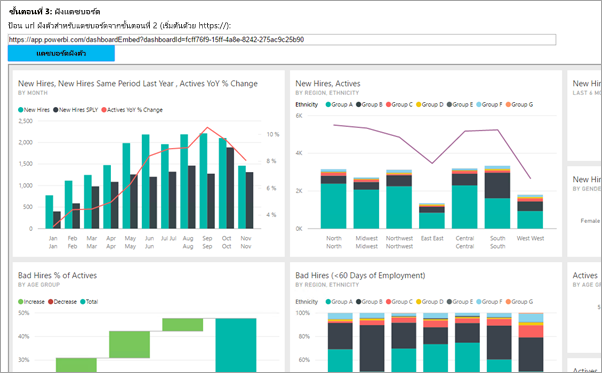
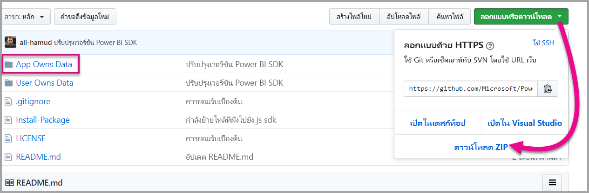

# <a name="tutorial-embed-a-power-bi-content-into-your-application-for-national-clouds"></a>บทช่วยสอน: ฝังเนื้อหาของ Power BI ลงในแอปพลิเคชันสำหรับบริการคลาวด์แห่งชาติ

เรียนรู้วิธีการฝังเนื้อหาวิเคราะห์ภายในองค์กรของคุณที่ดำเนินการสร้างแอปพลิเคชั่นสำหรับบริการคลาวด์แห่งชาติ คุณสามารถใช้ Power BI .NET SDK ด้วยกันกับ Power BI JavaScript API เพื่อฝังรายงาน แดชบอร์ด หรือ ไทล์ ลงในเว็บแอปพลิเคชันของคุณ

Power BI ยังสนับสนุน[บริการคลาวด์แห่งชาติ](https://docs.microsoft.com/azure/active-directory/develop/authentication-national-cloud)

บริการคลาวด์แห่งชาติที่แตกต่างกันคือ:

* U.S. ชุมชน Cloud สำหรับรัฐบาล (GCC)

* U. S. ผู้รับเหมากองทัพ (DoDCON)

* U. S. กองทัพ (DoD)

* คลาวด์ Power BI สำหรับประเทศเยอรมนี

* Power BI สำหรับคลาวด์ประเทศจีน



เมื่อต้องการเริ่มต้นการฝึกปฏิบัตินี้ คุณต้องการ**บัญชี Power BI** ถ้าคุณไม่มีการตั้งค่าบัญชี คุณสามารถเลือกบริการคลาวด์สาธารณะที่เหมาะสมสำหรับคุณ ทั้งนี้ขึ้นอยู่กับชนิดของภาครัฐหรือแห่งชาติ คุณสามารถ[ลงทะเบียนบัญชี Power BI สำหรับรัฐบาลสหรัฐ](../service-govus-signup.md) หรือ [บัญชี Power BI สำหรับผู้ใช้คลาวด์เยอรมนี](https://powerbi.microsoft.com/power-bi-germany/?ru=https%3A%2F%2Fapp.powerbi.de%2F%3FnoSignUpCheck%3D1) หรือ [Power BI สำหรับผู้ใช้คลาวด์ประเทศจีน](http://www.21vbluecloud.com/powerbi/)

> [!NOTE]
> กำลังมองหาวิธีฝังแดชบอร์ดสำหรับองค์กรของคุณแทน ดูที่ [รวมแดชบอร์ดลงในแอปสำหรับองค์กรของคุณ](integrate-dashboard.md)

เพื่อรวมแดชบอร์ดลงในเว็บแอป คุณใช้ **Power BI** API และ**โทเค็นการเข้าถึง**สำหรับรับรองตัวตนกับ Azure Active Directory (AD) เพื่อรับแดชบอร์ด หลังจากนั้น คุณโหลดแดชบอร์ดโดยใช้โทเค็นแบบฝังตัว **Power BI** API ให้การเข้าถึงทางการเขียนโปรแกรมสำหรับทรัพยากร **Power BI** เฉพาะ สำหรับข้อมูลเพิ่มเติม โปรดดูที่ [Power BI REST API](https://docs.microsoft.com/rest/api/power-bi/) [Power BI .NET SDK และ [Power BI JavaScript API](https://github.com/Microsoft/PowerBI-JavaScript)

## <a name="download-the-sample"></a>ดาวน์โหลดตัวอย่าง

บทความนี้แสดงรหัสที่ใช้ใน [ตัวอย่างการที่แอปเป็นเจ้าของข้อมูล](https://github.com/Microsoft/PowerBI-Developer-Samples) ใน GitHub ถ้าต้องการทำตามการฝึกปฏิบัตินี้ คุณสามารถดาวน์โหลดตัวอย่าง 



* ชุมชน Cloud สำหรับส่วนราชการ (GCC):

    > [!Note]
    > บัญชีผู้ใช้ GCC รองรับเฉพาะความจุ P และ EM เท่านั้น

1. เขียนทับแฟ้ม Cloud.config ด้วยเนื้อหา GCCCloud.config

2. อัปเดต applicationId (applicationId ของเนทีฟแอป), workspaceId, ผู้ใช้ (ผู้ใช้หลักของคุณ) และรหัสผ่านในไฟล์ Web.config

3. เพิ่มพารามิเตอร์ GCC ในแฟ้ม web.config ดังนี้

```xml
<add key="authorityUrl" value="https://login.microsoftonline.net/common/" />
<add key="resourceUrl" value="https://analysis.usgovcloudapi.net/powerbi/api" />
<add key="apiUrl" value="https://api.powerbigov.us/" />
<add key="embedUrlBase" value="https://app.powerbigov.us" />
```

* ผู้รับจ้างทางการทหาร (DoDCON):

1. เขียนทับแฟ้ม Cloud.config ด้วยเนื้อหา TBCloud.config

2. อัปเดต applicationId (applicationId ของเนทีฟแอป), workspaceId, ผู้ใช้ (ผู้ใช้หลักของคุณ) และรหัสผ่านในไฟล์ Web.config

3. เพิ่มพารามิเตอร์ DoDCON ในแฟ้ม web.config ดังนี้

```xml
<add key="authorityUrl" value="https://login.microsoftonlineS.net/common/" />
<add key="resourceUrl" value="https://high.analysis.usgovcloudapi.net/powerbi/api" />
<add key="apiUrl" value="https://api.high.powerbigov.us/" />
<add key="embedUrlBase" value="https://app.high.powerbigov.us" />
```

* กองทัพ (DoD):

1. เขียนทับแฟ้ม Cloud.config ด้วยเนื้อหา PFCloud.config

2. อัปเดต applicationId (applicationId ของเนทีฟแอป), workspaceId, ผู้ใช้ (ผู้ใช้หลักของคุณ) และรหัสผ่านในไฟล์ Web.config

3. เพิ่มพารามิเตอร์ DoDCON ในแฟ้ม web.config ดังนี้

```xml
<add key="authorityUrl" value="https://login.microsoftonline.net/common/" />
<add key="resourceUrl" value="https://mil.analysis.usgovcloudapi.net/powerbi/api" />
<add key="apiUrl" value="https://api.mil.powerbigov.us/" />
<add key="embedUrlBase" value="https://app.mil.powerbigov.us" />
```

* พารามิเตอร์ Power BI สำหรับคลาวด์ประเทศเยอรมนี

1. เขียนทับแฟ้ม Cloud.config ด้วยเนื้อหา Power BI สำหรับ cloud Germany

2. อัปเดต applicationId (applicationId ของเนทีฟแอป), workspaceId, ผู้ใช้ (ผู้ใช้หลักของคุณ) และรหัสผ่านในไฟล์ Web.config

3. เพิ่มพารามิเตอร์ Power BI สำหรับคลาวด์เยอรมนีในแฟ้ม web.config ดังนี้

```xml
<add key="authorityUrl" value="https://login.microsoftonline.de/common/" />
<add key="resourceUrl" value="https://analysis.cloudapi.de/powerbi/api" />
<add key="apiUrl" value="https://api.powerbi.de/" />
<add key="embedUrlBase" value="https://app.powerbi.de" />
```

* พารามิเตอร์ Power BI สำหรับคลาวด์ประเทศจีน

1. เขียนทับแฟ้ม Cloud.config ด้วย[เนื้อหา Power BI สำหรับคลาวด์ประเทศจีน](https://github.com/Microsoft/PowerBI-Developer-Samples/blob/master/App%20Owns%20Data/PowerBIEmbedded_AppOwnsData/CloudConfigs/Power%20BI%20operated%20by%2021Vianet%20in%20China/Cloud.config)

2. อัปเดต applicationId (applicationId ของเนทีฟแอป), workspaceId, ผู้ใช้ (ผู้ใช้หลักของคุณ) และรหัสผ่านในไฟล์ Web.config

3. เพิ่มพารามิเตอร์ Power BI สำหรับคลาวด์ประเทศจีนในแฟ้ม web.config ดังนี้

```xml
<add key="authorityUrl" value="https://login.chinacloudapi.cn/common/" />
<add key="resourceUrl" value="https://analysis.chinacloudapi.cn/powerbi/api" />
<add key="apiUrl" value="https://api.powerbi.cn/" />
<add key="embedUrlBase" value="https://app.powerbi.cn" />
```

## <a name="step-1---register-an-app-in-azure-ad"></a>ขั้นตอนที่ 1 - การลงทะเบียนแอปใน Azure AD

ลงทะเบียนแอปพลิเคชันของคุณด้วย Azure AD เพื่อเรียกใช้ Rest API สำหรับข้อมูลเพิ่มเติม ดู[ลงทะเบียนแอป Azure AD เพื่อฝังเนื้อหา Power BI](register-app.md) เนื่องจากมีพันธมิตรบริการคลาวด์แห่งชาติที่แตกต่างกัน ดังนั้นจึงมี URL สำหรับลงทะเบียนแอปพลิเคชันของคุณที่แตกต่างกันออกไป

* ชุมชน Cloud สำหรับรัฐบาล (GCC) - ```https://app.powerbigov.us/apps```

* ผู้รับเหมากองทัพ (DoDCON) - ```https://app.high.powerbigov.us/apps```

* กองทัพ (DoD) - ```https://app.mil.powerbigov.us/apps```

* Power BI สำหรับคลาวด์ประเทศเยอรมน - ี ```https://app.powerbi.de/apps```

* Power BI สำหรับคลาวด์ประเทศจีน - ```https://app.powerbi.cn/apps```

ถ้าคุณได้ดาวน์โหลด[ตัวอย่างการฝังสำหรับลูกค้าของคุณ](https://github.com/Microsoft/PowerBI-Developer-Samples/tree/master/App%20Owns%20Data)ไว้ คุณจะได้ใช้ **applicationID** ที่คุณได้รับมา เพื่อให้ตัวอย่างสามารถยืนยันตัวตนกับ Azure AD ได้ ในการกำหนดค่าตัวอย่าง ให้เปลี่ยน **applicationId** ในไฟล์ *web.config*

## <a name="step-2---get-an-access-token-from-azure-ad"></a>ขั้นตอนที่ 2 - รับโทเค็นเพื่อเข้า จาก Azure AD

ภายในแอปพลิเคชันของคุณ คุณจะต้องรับ **โทเค็นการเข้าถึง** จาก Azure AD ก่อนที่คุณสามารถเรียกใช้ Power BI REST API ได้ สำหรับข้อมูลเพิ่มเติม ให้ดู[การรับรองตัวตนผู้ใช้และรับโทเค็นการเข้า Azure AD สำหรับแอป Power BI ของคุณ](get-azuread-access-token.md) เนื่องจากมีพันธมิตรบริการคลาวด์แห่งชาติที่แตกต่างกัน ดังนั้นจึงมี URL เพื่อเพื่อรับโทเค็นการเข้าถึงแอปพลิเคชันของคุณที่แตกต่างกันออกไป

* ชุมชน Cloud สำหรับรัฐบาล (GCC) - ```https://login.microsoftonline.com```

* ผู้รับเหมากองทัพ (DoDCON) - ```http://login.microsoftonline.us```

* กองทัพ (DoD) - ```https://login.microsoftonline.us```

* Power BI สำหรับคลาวด์ประเทศเยอรมน - ี ```https://login.microsoftonline.de```

* Power BI สำหรับคลาวด์ประเทศจีน - ```https://login.chinacloudapi.cn```

คุณสามารถดูตัวอย่างโทเค็นการเข้าใช้ในรายการเนื้อหาแต่ละงานได้ในไฟล์ **Controllers\HomeController.cs**

## <a name="step-3---get-a-content-item"></a>ขั้นตอนที่ 3 รับเนื้อหา

เมื่อต้องฝังเนื้อหา Power BI ของคุณ คุณจะจำเป็นต้องทำสิ่งสองสิ่งนี้ให้แน่ใจว่า การฝังตัวนั้นถูกต้อง ถึงแม้ว่าขั้นตอนเหล่านี้สามารถทำได้ใน REST API โดยตรง แอปพลิเคชันตัวอย่าง และตัวอย่างนี้จะใช้ .NET SDK

### <a name="create-the-power-bi-client-with-your-access-token"></a>สร้างไคลเอ็นต์ Power BI ด้วยโทเค็นการเข้าของคุณ

ด้วยโทเค็นการเข้าใช้ของคุณ คุณสามารถสร้างวัตถุไคลเอ็นต์ Power BI ซึ่งทำให้คุณสามารถโต้ตอบกับ Power BI API ได้ คุณสร้างวัตถุไคลเอ็นต์ Power BI ของคุณได้โดยการคลุม AccessToken ด้วยวัตถุ *Microsoft.Rest.TokenCredentials*

```csharp
using Microsoft.IdentityModel.Clients.ActiveDirectory;
using Microsoft.Rest;
using Microsoft.PowerBI.Api.V2;

var tokenCredentials = new TokenCredentials(authenticationResult.AccessToken, "Bearer");

// Create a Power BI Client object. This is used to call the Power BI APIs.
using (var client = new PowerBIClient(new Uri(ApiUrl), tokenCredentials))
{
    // Your code to embed items.
}
```

### <a name="get-the-content-item-you-want-to-embed"></a>รับเนื้อหาที่คุณต้องการฝังตัว

คุณใช้วัตถุไคลเอ็นต์ Power BI เพื่อดึงเอาตัวอ้างอิงไปยังเนื้อหา ที่คุณต้องการฝังตัว คุณสามารถฝังแดชบอร์ด ไทล์ หรือรายงานได้ นี่คือตัวอย่างของวิธีการเรียกแดชบอร์ด ไทล์ หรือรายงานตัวแรกจากพื้นที่ทำงานที่ให้ไว้

มีตัวอย่างอยู่ใน **Controllers\HomeController.cs** ของ[ตัวอย่างการที่แอปเป็นเจ้าของข้อมูล](https://github.com/Microsoft/PowerBI-Developer-Samples/tree/master/App%20Owns%20Data)

#### <a name="reports"></a>รายงาน

```csharp
using Microsoft.PowerBI.Api.V2;
using Microsoft.PowerBI.Api.V2.Models;

// You need to provide the workspaceId where the dashboard resides.
ODataResponseListReport reports = client.Reports.GetReportsInGroupAsync(workspaceId);

// Get the first report in the group.
Report report = reports.Value.FirstOrDefault();
```

#### <a name="dashboards"></a>แดชบอร์ด

```csharp
using Microsoft.PowerBI.Api.V2;
using Microsoft.PowerBI.Api.V2.Models;

// You need to provide the workspaceId where the dashboard resides.
ODataResponseListDashboard dashboards = client.Dashboards.GetDashboardsInGroup(workspaceId);

// Get the first report in the group.
Dashboard dashboard = dashboards.Value.FirstOrDefault();
```

#### <a name="tiles"></a>ไทล์

```csharp
using Microsoft.PowerBI.Api.V2;
using Microsoft.PowerBI.Api.V2.Models;

// To retrieve the tile, you first need to retrieve the dashboard.

// You need to provide the workspaceId where the dashboard resides.
ODataResponseListDashboard dashboards = client.Dashboards.GetDashboardsInGroup(workspaceId);

// Get the first report in the group.
Dashboard dashboard = dashboards.Value.FirstOrDefault();

// Get a list of tiles from a specific dashboard
ODataResponseListTile tiles = client.Dashboards.GetTilesInGroup(workspaceId, dashboard.Id);

// Get the first tile in the group.
Tile tile = tiles.Value.FirstOrDefault();
```

### <a name="create-the-embed-token"></a>สร้างโทเค็นแบบฝังตัว

คุณสามารถสร้างโทเค็นการฝังได้โดยใช้ JavaScript API โทเค็นแบบฝังตัวจะเป็นแบบเฉพาะเจาะจงกับรายการที่คุณจะฝัง ซึ่งหมายความว่า ทุกครั้งที่คุณต้องการฝังเนื้อหาของ Power BI ชิ้นหนึ่ง คุณต้องสร้างโทเค็นแบบฝังตัวใหม่ขึ้นมา สำหรับข้อมูลเพิ่มเติม รวมไปถึง **accessLevel** ที่จะใช้ ดู[โทเค็นที่ฝัง](https://docs.microsoft.com/rest/api/power-bi/embedtoken)

> [!IMPORTANT]
> เนื่องจากโทเค็นแบบฝังตัวมีไว้สำหรับการทดสอบของนักพัฒนาเท่านั้น จำนวนโทเค็นแบบฝังตัวที่บัญชีหลักของ Power BI สร้างได้ มีได้จำกัด [ต้องซื้อความจุ](https://docs.microsoft.com/power-bi/developer/embedded-faq#technical) สำหรับสถานการณ์ที่มีการฝังในโปรดักชั่น ไม่จำกัดจำนวนโทเค็นแบบฝังตัวที่สร้างเมื่อซื้อความจุแล้ว

มีตัวอย่างอยู่ใน **Controllers\HomeController.cs** ของ[ตัวอย่างการฝังสำหรับองค์กรของคุณ](https://github.com/Microsoft/PowerBI-Developer-Samples/tree/master/App%20Owns%20Data)

คลาสถูกสร้างให้สำหรับ **EmbedConfig** และ **TileEmbedConfig** มีตัวอย่างอยู่ใน **Models\EmbedConfig.cs** และ **Models\TileEmbedConfig.cs**

#### <a name="reports"></a>รายงาน

```csharp
using Microsoft.PowerBI.Api.V2;
using Microsoft.PowerBI.Api.V2.Models;

// Generate Embed Token.
var generateTokenRequestParameters = new GenerateTokenRequest(accessLevel: "view");
EmbedToken tokenResponse = client.Reports.GenerateTokenInGroup(workspaceId, report.Id, generateTokenRequestParameters);

// Generate Embed Configuration.
var embedConfig = new EmbedConfig()
{
    EmbedToken = tokenResponse,
    EmbedUrl = report.EmbedUrl,
    Id = report.Id
};
```

#### <a name="dashboards"></a>แดชบอร์ด

```csharp
using Microsoft.PowerBI.Api.V2;
using Microsoft.PowerBI.Api.V2.Models;

// Generate Embed Token.
var generateTokenRequestParameters = new GenerateTokenRequest(accessLevel: "view");
EmbedToken tokenResponse = client.Dashboards.GenerateTokenInGroup(workspaceId, dashboard.Id, generateTokenRequestParameters);

// Generate Embed Configuration.
var embedConfig = new EmbedConfig()
{
    EmbedToken = tokenResponse,
    EmbedUrl = dashboard.EmbedUrl,
    Id = dashboard.Id
};
```

#### <a name="tiles"></a>ไทล์

```csharp
using Microsoft.PowerBI.Api.V2;
using Microsoft.PowerBI.Api.V2.Models;

// Generate Embed Token for a tile.
var generateTokenRequestParameters = new GenerateTokenRequest(accessLevel: "view");
EmbedToken tokenResponse = client.Tiles.GenerateTokenInGroup(workspaceId, dashboard.Id, tile.Id, generateTokenRequestParameters);

// Generate Embed Configuration.
var embedConfig = new TileEmbedConfig()
{
    EmbedToken = tokenResponse,
    EmbedUrl = tile.EmbedUrl,
    Id = tile.Id,
    dashboardId = dashboard.Id
};
```

## <a name="step-4---load-an-item-using-javascript"></a>ขั้นตอนที่ 4 - โหลดเนื้อหาโดยใช้ JavaScript

คุณสามารถใช้ JavaScript เพื่อโหลดแดชบอร์ดลงใน องค์ประกอบ div บนเว็บเพจของคุณ ตัวอย่างนี้ใช้รูปแบบ EmbedConfig/TileEmbedConfig พร้อมกับมุมมองสำหรับแดชบอร์ด ไทล์ หรือรายงาน สำหรับตัวอย่างแบบเต็มของการใช้ JavaScript API คุณสามารถใช้ [ตัวอย่างแบบฝังตัวของ Microsoft Power BI](https://microsoft.github.io/PowerBI-JavaScript/demo)

ตัวอย่างแอปพลิเคชันพร้อมใช้งานภายใน [การฝังสำหรับตัวอย่างองค์กรของคุณ](https://github.com/Microsoft/PowerBI-Developer-Samples/tree/master/App%20Owns%20Data)

### <a name="viewshomeembeddashboardcshtml"></a>Views\Home\EmbedDashboard.cshtml

```csharp
<script src="~/scripts/powerbi.js"></script>
<div id="dashboardContainer"></div>
<script>
    // Read embed application token from Model
    var accessToken = "@Model.EmbedToken.Token";

    // Read embed URL from Model
    var embedUrl = "@Html.Raw(Model.EmbedUrl)";

    // Read dashboard Id from Model
    var embedDashboardId = "@Model.Id";

    // Get models. models contains enums that can be used.
    var models = window['powerbi-client'].models;

    // Embed configuration used to describe the what and how to embed.
    // This object is used when calling powerbi.embed.
    // This also includes settings and options such as filters.
    // You can find more information at https://github.com/Microsoft/PowerBI-JavaScript/wiki/Embed-Configuration-Details.
    var config = {
        type: 'dashboard',
        tokenType: models.TokenType.Embed,
        accessToken: accessToken,
        embedUrl: embedUrl,
        id: embedDashboardId
    };

    // Get a reference to the embedded dashboard HTML element
    var dashboardContainer = $('#dashboardContainer')[0];

    // Embed the dashboard and display it within the div container.
    var dashboard = powerbi.embed(dashboardContainer, config);
</script>
```

### <a name="viewshomeembedtilecshtml"></a>Views\Home\EmbedTile.cshtml

```csharp
<script src="~/scripts/powerbi.js"></script>
<div id="tileContainer"></div>
<script>
    // Read embed application token from Model
    var accessToken = "@Model.EmbedToken.Token";

    // Read embed URL from Model
    var embedUrl = "@Html.Raw(Model.EmbedUrl)";

    // Read tile Id from Model
    var embedTileId = "@Model.Id";

    // Read dashboard Id from Model
    var embedDashboardId = "@Model.dashboardId";

    // Get models. models contains enums that can be used.
    var models = window['powerbi-client'].models;

    // Embed configuration used to describe the what and how to embed.
    // This object is used when calling powerbi.embed.
    // This also includes settings and options such as filters.
    // You can find more information at https://github.com/Microsoft/PowerBI-JavaScript/wiki/Embed-Configuration-Details.
    var config = {
        type: 'tile',
        tokenType: models.TokenType.Embed,
        accessToken: accessToken,
        embedUrl: embedUrl,
        id: embedTileId,
        dashboardId: embedDashboardId
    };

    // Get a reference to the embedded tile HTML element
    var tileContainer = $('#tileContainer')[0];

    // Embed the tile and display it within the div container.
    var tile = powerbi.embed(tileContainer, config);
</script>
```

### <a name="viewshomeembedreportcshtml"></a>Views\Home\EmbedReport.cshtml

```csharp
<script src="~/scripts/powerbi.js"></script>
<div id="reportContainer"></div>
<script>
    // Read embed application token from Model
    var accessToken = "@Model.EmbedToken.Token";

    // Read embed URL from Model
    var embedUrl = "@Html.Raw(Model.EmbedUrl)";

    // Read report Id from Model
    var embedReportId = "@Model.Id";

    // Get models. models contains enums that can be used.
    var models = window['powerbi-client'].models;

    // Embed configuration used to describe the what and how to embed.
    // This object is used when calling powerbi.embed.
    // This also includes settings and options such as filters.
    // You can find more information at https://github.com/Microsoft/PowerBI-JavaScript/wiki/Embed-Configuration-Details.
    var config = {
        type: 'report',
        tokenType: models.TokenType.Embed,
        accessToken: accessToken,
        embedUrl: embedUrl,
        id: embedReportId,
        permissions: models.Permissions.All,
        settings: {
            filterPaneEnabled: true,
            navContentPaneEnabled: true
        }
    };

    // Get a reference to the embedded report HTML element
    var reportContainer = $('#reportContainer')[0];

    // Embed the report and display it within the div container.
    var report = powerbi.embed(reportContainer, config);
</script>
```

## <a name="next-steps"></a>ขั้นตอนถัดไป

* มีตัวอย่างแอปพลิเคชันบน GitHub ให้คุณได้ศึกษา ตัวอย่างต่างๆ ข้างบนมาจากตัวอย่างนั้น สำหรับข้อมูลเพิ่มเติม ให้ดูการ[ฝังตัวเพื่อตัวอย่างขององค์กรของคุณ](https://github.com/Microsoft/PowerBI-Developer-Samples/tree/master/App%20Owns%20Data)

* สำหรับข้อมูลเพิ่มเติมเกี่ยวกับ JavaScript API โปรดดูที่ [Power BI JavaScript API](https://github.com/Microsoft/PowerBI-JavaScript)

* สำหรับข้อมูลเพิ่มเติมเกี่ยวกับ Power BI ของคลาวด์ประเทศเยอรมนี โปรดดูที่ [คำถามที่พบบ่อยเกี่ยวกับ Power BI ](https://docs.microsoft.com/power-bi/service-govde-faq)สำหรับคลาวด์ประเทศเยอรมนี

* [วิธีการย้ายเนื้อหาจาก Power BI Workspace Collection ไปยัง Power BI](migrate-from-powerbi-embedded.md)

ข้อควรพิจารณาและข้อจำกัด

มีคำถามเพิ่มเติมหรือไม่? [ลองถามชุมชน Power BI](http://community.powerbi.com/)
