# <a name="tutorial-embed-a-power-bi-report-dashboard-or-tile-into-an-application-for-your-customers"></a>บทช่วยสอน: ฝังรายงาน, แดชบอร์ด หรือไทล์ Power BI ลงในแอปพลิเคชันสำหรับลูกค้าของคุณ
ด้วย **Power BI Embedded ใน Azure** คุณสามารถฝังรายงาน, แดชบอร์ด หรือไทล์ลงในการใช้แอปพลิเคชันโดยใช้**แอปเป็นเจ้าของข้อมูล**ได้ **แอปเป็นเจ้าของข้อมูล** เกี่ยวกับแอปพลิเคชันที่ใช้ Power BI เป็นแพลตฟอร์มการวิเคราะห์แบบฝังตัว นี่คือสถานการณ์ทั่วไปของ**นักพัฒนา ISV** ในฐานะเป็น**นักพัฒนา ISV** คุณสามารถสร้างเนื้อหา Power BI ที่แสดงรายงาน, แดชบอร์ด หรือไทล์ในแอปพลิเคชันที่รวมงานทั้งหมดไว้ด้วยกันและโต้ตอบได้ โดยไม่ต้องให้ผู้ใช้แอปพลิเคชันต้องมีสิทธิ์การใช้งาน Power BI หรือแม้แต่รู้ว่ามี Power BI อยู่ภายใน บทช่วยสอนนี้สาธิตวิธีการรวมรายงานลงในแอปพลิเคชัน โดยใช้ **Power BI** SDK .NET พร้อมกับ **Power BI** JavaScript API เมื่อใช้ **Power BI Embedded ใน Azure** สำหรับลูกค้าของคุณโดยใช้**แอปเป็นเจ้าของข้อมูล**

ในบทช่วยสอนนี้ คุณจะได้เรียนรู้วิธีการ:
>[!div class="checklist"]
>* ลงทะเบียนแอปพลิเคชันใน Azure
>* ฝังรายงาน Power BI ลงในแอปพลิเคชัน

## <a name="prerequisites"></a>ข้อกำหนดเบื้องต้น
เพื่อเริ่มต้นใช้งาน คุณต้องการบัญชีผู้ใช้ **Power BI Pro** (ซึ่งจะเป็น**บัญชีหลัก**ของคุณ) และการสมัครใช้งาน **Microsoft Azure**

* ถ้าคุณยังไม่ได้ลงทะเบียนสำหรับ **Power BI Pro** [ลงทะเบียนทดลองใช้ฟรี](https://powerbi.microsoft.com/en-us/pricing/)ก่อนที่คุณจะเริ่ม
* ถ้าคุณยังไม่มีการสมัครใช้งาน Azure สร้าง[บัญชีฟรี](https://azure.microsoft.com/free/?WT.mc_id=A261C142F)ก่อนที่คุณจะเริ่ม
* คุณจำเป็นต้องตั้งค่า[ผู้เช่า Azure Active Directory](create-an-azure-active-directory-tenant.md) ของคุณเอง
* คุณต้องติดตั้ง [Visual Studio](https://www.visualstudio.com/) (เวอร์ชัน 2013 หรือใหม่กว่า)

## <a name="setup-your-embedded-analytics-development-environment"></a>ตั้งค่าสภาพแวดล้อมการพัฒนา การวิเคราะห์แบบฝังตัวของคุณ

ก่อนที่คุณจะเริ่มการฝังรายงาน, แดชบอร์ด หรือไทล์ ลงในแอปพลิเคชันของคุณ คุณจำเป็นต้องตรวจสอบให้แน่ใจว่า สภาพแวดล้อมของคุณถูกตั้งค่าเพื่ออนุญาตให้ทำการฝัง โดยถือเป็นส่วนหนึ่งของการตั้งค่า คุณจะต้องทำสิ่งต่อไปนี้

คุณสามารถเข้าถึง[เครื่องมือประสบการณ์การเตรียมความพร้อม](https://aka.ms/embedsetup/AppOwnsData) เพื่อเริ่มต้นใช้งาน และดาวน์โหลดแอปพลิเคชันตัวอย่างที่ช่วยแนะนำคุณไปตามขั้นตอนการสร้างสภาพแวดล้อม และการฝังรายงานได้

แต่ถ้าคุณเลือกที่จะตั้งค่าสภาพแวดล้อมด้วยตนเอง คุณสามารถดำเนินต่อตามด้านล่าง
### <a name="register-an-application-in-azure-active-directory-azure-ad"></a>ลงทะเบียนแอปพลิเคชันใน Azure Active Directory (Azure AD)

คุณลงทะเบียนแอปพลิเคชันของคุณกับ Azure Active Directory เพื่ออนุญาตให้แอปพลิเคชันของคุณเข้าถึง Power BI REST API ซึ่งจะช่วยให้คุณสร้างข้อมูลประจำตัวสำหรับแอปพลิเคชันของคุณ และระบุสิทธิ์ไปยังแหล่งข้อมูล REST ของ Power BI ได้

1. ยอมรับ[เงื่อนไขของ Microsoft Power BI API](https://powerbi.microsoft.com/api-terms)

2. ลงชื่อเข้าใช้[พอร์ทัล Azure](https://portal.azure.com)
 
    

3. ในบานหน้าต่างนำทางด้านซ้าย เลือก**บริการทั้งหมด** เลือก**การลงทะเบียนแอป** แล้วเลือก**ลงทะเบียนแอปพลิเคชันใหม่**
   
    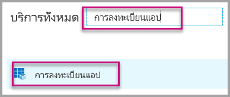</br>
    

4. ทำตามพร้อมท์และสร้างแอปพลิเคชัน์ใหม่ สำหรับแอปเป็นเจ้าของข้อมูล คุณจำเป็นต้องใช้ชนิดของแอปพลิเคชันแบบ**ดั้งเดิม** คุณยังต้องให้ **URI ที่เปลี่ยนเส้นทาง** ซึ่ง **Azure AD** ใช้เพื่อส่งกลับผลลัพธ์โทเค็น ใส่ค่าที่เฉพาะสำหรับแอปพลิเคชันของคุณ (ตัวอย่างเช่น: `http://localhost:13526/redirect`)

    

### <a name="apply-permissions-to-your-application-within-azure-active-directory"></a>นำสิทธิ์ไปใช้กับแอปพลิเคชันของคุณภายใน Azure Active Directory

คุณจะต้องเปิดใช้งานสิทธิ์เพิ่มเติมให้กับแอปพลิเคชันของคุณ นอกเหนือจากสิทธิ์ที่มีในหน้าลงทะเบียนแอปพลิเคชัน คุณจะต้องเข้าสู่ระบบ ด้วยบัญชี*หลัก*ที่ใช้สำหรับฝังตัว หรือบัญชีผู้ดูแลระบบส่วนกลาง

### <a name="use-the-azure-active-directory-portal"></a>ใช้พอร์ทัล Azure Active Directory

1. เรียกดู[การลงทะเบียนแอป](https://portal.azure.com/#blade/Microsoft_AAD_IAM/ApplicationsListBlade)ภายในพอร์ทัล Azure และเลือกแอปที่คุณกำลังใช้สำหรับการฝัง
   
    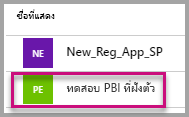

2. เลือก**การตั้งค่า** จากนั้นภายใต้**การเข้าถึง API** เลือก**สิทธิ์ที่จำเป็น**
   
    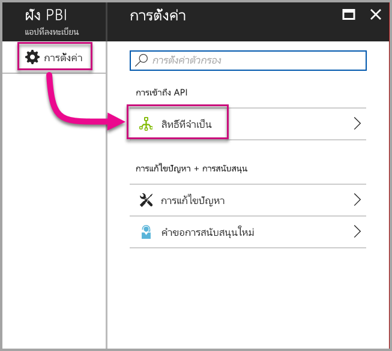

3. เลือก **Azure Active Directory Windows** จากนั้นตรวจสอบว่าได้เลือก**การเข้าถึงไดเรกทอรีในฐานะผู้ใช้ที่เข้าสู่ระบบ** เลือก**บันทึก**
   
    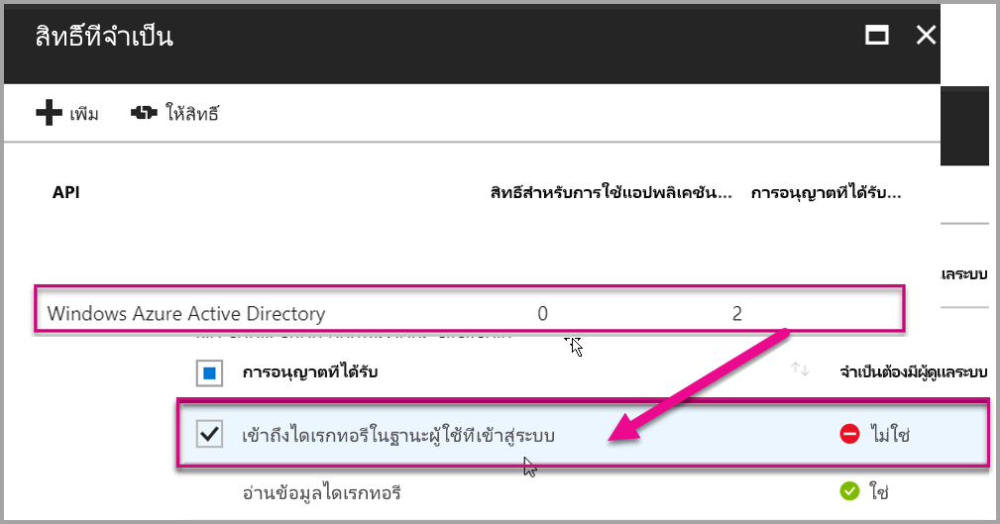

4. เลือก**เพิ่ม**

    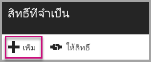

5. เลือก**เลือก API**

    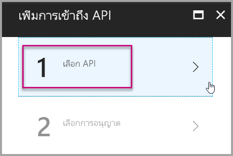

6. เลือก**บริการของ Power BI** แล้วเลือก**เลือก**

    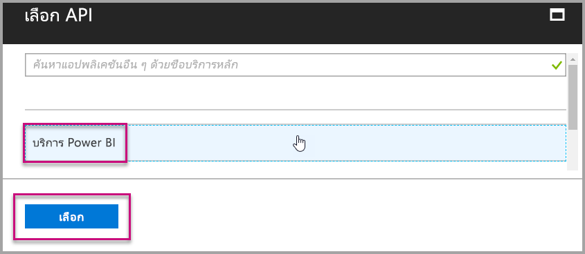

7. เลือกสิทธิ์ทั้งหมดใต้**สิทธิ์ที่ได้รับมอบ** คุณจำเป็นต้องเลือกทีละสิทธิ์ เพื่อบันทึกการเลือก เลือก**บันทึก**เมื่อทำเสร็จแล้ว
   
    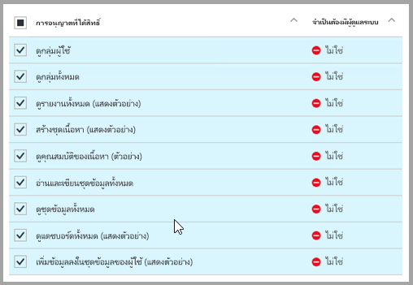

8. ภายใน**สิทธิ์ที่ต้องใช้**เลือก**ให้สิทธิ์**
   
    เมื่อดำเนินการ**การให้สิทธิ์** คุณจำเป็นต้องมี*บัญชีหลัก*เพื่อมิต้องให้ Azure AD พร้อมท์ให้คุณทำการยินยอม ถ้าบัญชีที่ดำเนินการนี้เป็นผู้ดูแลระบบส่วนกลาง คุณจะต้องมอบสิทธิ์ให้แก่ผู้ใช้ทั้งหมดภายในองค์กรของคุณสำหรับแอปพลิเคชันนี้ ถ้าบัญชีที่ดำเนินการนี้เป็น*บัญชีผู้ใช้หลัก* และไม่ใช่ผู้ดูแลระบบส่วนกลาง คุณจะให้สิทธิ์แก่*บัญชีหลัก*สำหรับแอปพลิเคชันนี้ได้เท่านั้น
   
    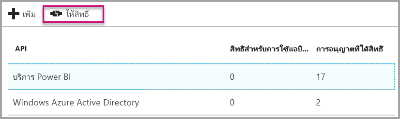

## <a name="setup-your-power-bi-environment"></a>ตั้งค่าสภาพแวดล้อม Power BI ของคุณ

### <a name="create-an-app-workspace"></a>สร้างพื้นที่ทำงานสำหรับแอปฯ

ถ้าคุณมีการฝังรายงาน, แดชบอร์ด หรือไทล์สำหรับลูกค้าของคุณ คุณจะต้องวางเนื้อหาของคุณภายในพื้นที่ทำงานแอป บัญชี*หลัก*จะต้องเป็นผู้ดูแลระบบของพื้นที่ทำงานแอป

1. เริ่มต้นโดยการสร้างพื้นที่ทำงาน เลือก **พื้นที่ทำงาน** > **สร้างพื้นที่ทำงานแอป** นี่จะเป็นตำแหน่งที่วางเนื้อหาที่แอปพลิเคชันของคุณจะเข้าถึง

    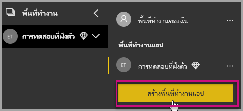

2. ตั้งชื่อพื้นที่ทำงาน ถ้าชื่อ **ID พื้นที่ทำงาน**ที่ตรงกันไม่สามารถใช้ได้ แก้ไขให้ ID ใหม่มีค่าไม่ซ้ำกัน นี่จะเป็นชื่อของแอปด้วย

    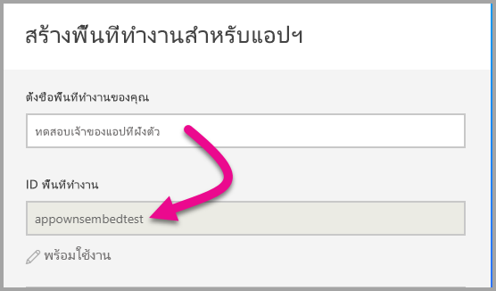

3. คุณมีสองสามตัวเลือกที่จะตั้งค่า ถ้าคุณเลือก**สาธารณะ** ทุกคนในองค์กรคุณสามารถดูสิ่งที่อยู่ในพื้นที่ทำงานได้ ในทางกลับกัน **ส่วนตัว** หมายถึง เฉพาะสมาชิกของพื้นที่ทำงานเท่านั้นที่สามารถดูเนื้อหา

    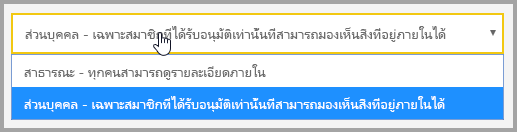

    คุณไม่สามารถเปลี่ยนการตั้งค่า สาธารณะ/ส่วนตัว ได้หลังจากคุณสร้างกลุ่มแล้ว

4. คุณยังสามารถเลือกว่าสมาชิกสามารถเข้าถึงแบบ**แก้ไข**ได้หรือ**ดูเท่านั้น**

    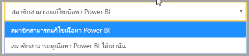

5. ใส่ที่อยู่อีเมลของบุคคลที่คุณต้องการให้เข้าถึงพื้นที่ทำงาน และเลือก**เพิ่ม** คุณไม่สามารถเพิ่มนามแฝงของกลุ่ม เพิ่มได้แค่บุคคลอย่างเดียว

6. ตัดสินใจว่า แต่ละคนเป็นสมาชิกหรือผู้ดูแลระบบ ผู้ดูแลระบบสามารถแก้ไขพื้นที่ทำงาน รวมถึงการเพิ่มสมาชิกคนอื่น ๆ สมาชิกสามารถแก้ไขเนื้อหาในพื้นที่ทำงาน นอกจากว่าพวกเขามีสิทธิ์เข้าถึงแบบดูเท่านั้น ทั้งผู้ดูแลระบบและสมาชิกสามารถเผยแพร่แอป

    ในตอนนี้ คุณสามารถดูพื้นที่ทำงานใหม่แล้ว Power BI จะสร้างพื้นที่ทำงาน และเปิดพื้นที่ทำงานนั้น ซึ่งจะปรากฏขึ้นในรายการของพื้นที่ทำงานที่คุณเป็นสมาชิก เนื่องจากคุณเป็นผู้ดูแล คุณสามารถเลือกจุดไข่ปลา (...) เพื่อกลับมา และทำการเปลี่ยนแปลง เพิ่มสมาชิกใหม่ หรือเปลี่ยนแปลงสิทธิ์ของพวกเขาได้

    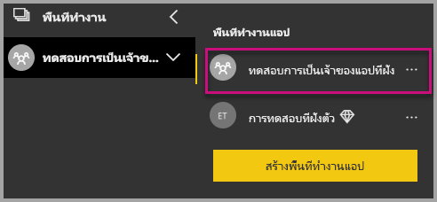

### <a name="create-and-publish-your-reports"></a>สร้าง และเผยแพร่รายงานของคุณ

คุณสามารถสร้างรายงานและชุดข้อมูลของคุณโดยใช้ Power BI Desktop แล้วจึงเผยแพร่รายงานเหล่านั้นไปยังพื้นที่ทำงานของแอป ผู้ใช้ปลายทางที่เผยแพร่รายงาน จำเป็นต้องมีสิทธิ์การใช้งาน Power BI Pro เพื่อเผยแพร่ไปยังพื้นที่ทำงานของแอป

1. ดาวน์โหลดตัวอย่าง[การสาธิตบล็อก](https://github.com/Microsoft/powerbi-desktop-samples)จาก GitHub

    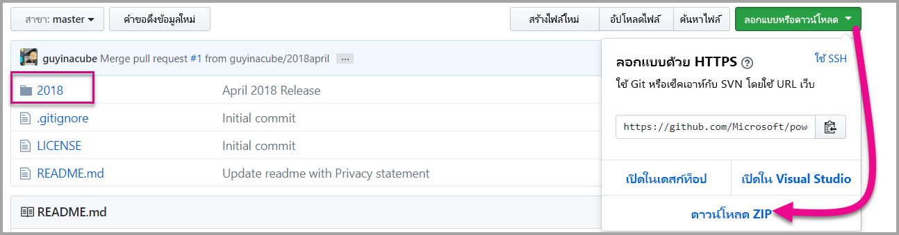

2. เปิดรายงาน PBIX ตัวอย่างใน **Power BI Desktop**

   

3. เผยแพร่ไปยัง**พื้นที่ทำงานแอป**

   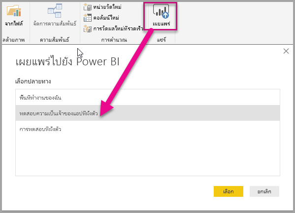

    ในตอนนี้ คุณสามารถดูรายงานในบริการของ Power BI แบบออนไลน์

   

## <a name="embed-your-content-using-the-sample-application"></a>ฝังเนื้อหาของคุณโดยใช้แอปพลิเคชันตัวอย่าง

ทำตามขั้นตอนเหล่านี้เพื่อเริ่มการฝังเนื้อหาของคุณโดยใช้แอปพลิเคชันตัวอย่าง

1. ดาวน์โหลด[ตัวอย่างแอปเป็นเจ้าของข้อมูล](https://github.com/Microsoft/PowerBI-Developer-Samples)จาก GitHub เพื่อเริ่มต้น

    

2. เปิดแฟ้ม Web.config ในแอปพลิเคชันตัวอย่าง มีเขตข้อมูล 5 เขตที่คุณจะต้องใส่ เพื่อให้เรียกใช้แอปพลิเคชัน **clientID**, **groupId**, **reportId**, **pbiUsername** และ **pbiPassword**

    

    กรอกข้อมูล **clientId** ด้วย **ID แอปพลิเคชัน**จาก **Azure** **clientId** ให้แอปพลิเคชันใช้ระบุตัวเองระหว่างการร้องขอสิทธิ์กับผู้ใช้ เพื่อรับ **clientId** ทำตามขั้นตอนเหล่านี้:

    ลงชื่อเข้าใช้[พอร์ทัล Azure](https://portal.azure.com)

    

    ในบานหน้าต่างนำทางด้านซ้าย เลือก**บริการทั้งหมด** และเลือก**การลงทะเบียนแอป**

     เลือกแอปพลิเคชั่นที่คุณต้องการรับ**clientId** ที่ต้องการใช้

    

    คุณควรจะเห็น **ID แอปพลิเคชัน** ที่แสดงในรูปของ GUID ใช้ **ID แอปพลิเคชัน**นี้เป็นค่า **clientId** สำหรับแอปพลิเคชัน

    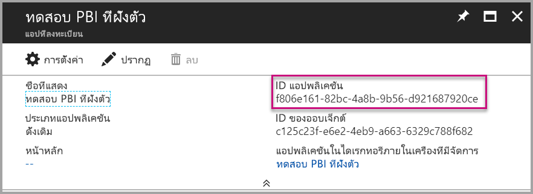

    กรอกข้อมูล **groupId** ด้วย **GUID พื้นที่ทำงานของแอป**จาก Power BI

    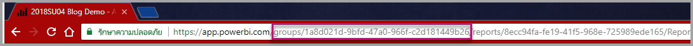

    กรอกข้อมูล **reportId** ด้วย **GUID รายงาน**จาก Power BI

    

    * กรอกข้อมูล **pbiUsername** ด้วยบัญชีผู้ใช้หลัก Power BI
    * กรอกข้อมูล **pbiPassword** ด้วยรหัสผ่านสำหรับบัญชีผู้ใช้หลัก Power BI

3. เรียกใช้แอปพลิเคชัน

    ก่อนอื่น ให้เลือก**เรียกใช้**ใน **Visual Studio**

    

    จากนั้นเลือก **Embed Report** ขึ้นอยู่กับเนื้อหาที่คุณเลือกที่จะทดสอบ - รายงาน, แดชบอร์ด หรือไทล์ - แล้วเลือกตัวเลือกนั้นในแอปพลิเคชัน

    

    ตอนนี้ คุณสามารถดูรายงานในแอปพลิเคชันตัวอย่างได้แล้ว

    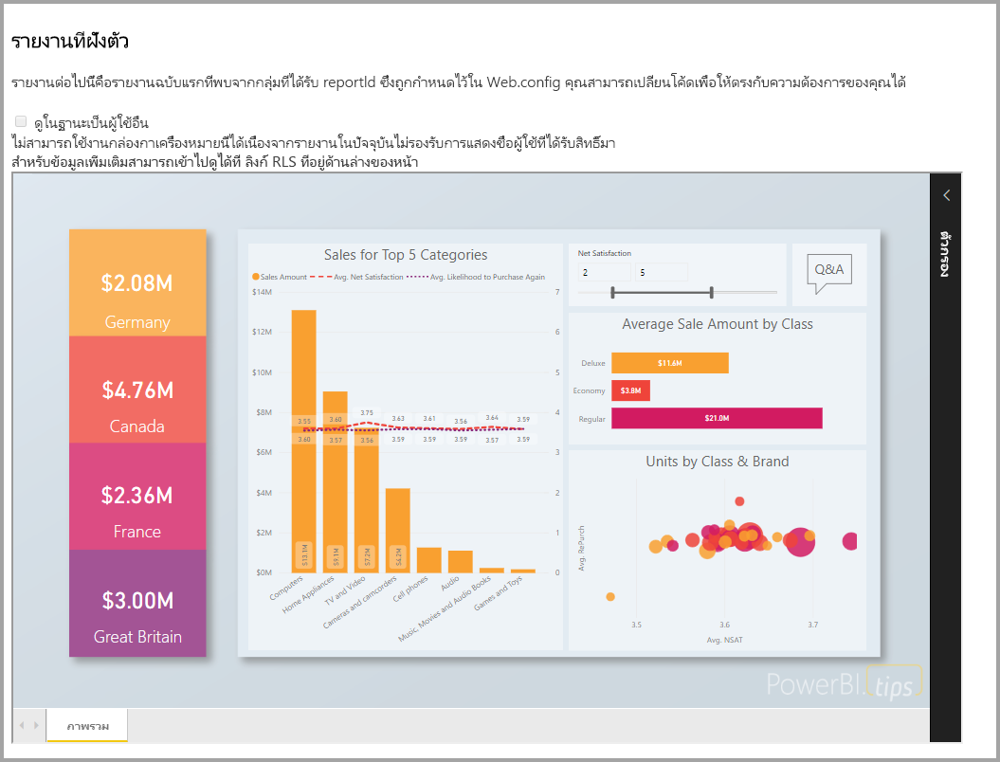

## <a name="embed-your-content-within-your-application"></a>ฝังเนื้อหาของคุณภายในแอปพลิเคชันของคุณ
ถึงแม้ว่าขั้นตอนการฝังเนื้อหาของคุณสามารถทำได้ด้วย [Power BI REST APIs](https://docs.microsoft.com/rest/api/power-bi/)รหัสตัวอย่างที่อธิบายไว้ในบทความนี้ถูกสร้างด้วย **.NET SDK**

การฝังตัวสำหรับลูกค้าของคุณภายในแอปพลิเคชันคุณ จำเป็นต้องให้คุณรับ**โทเค็นการเข้าถึง**สำหรับบัญชีหลักของคุณจาก **Azure AD** จำเป็นต้องได้รับ[โทเค็นการเข้าถึง Azure AD](get-azuread-access-token.md#access-token-for-non-power-bi-users-app-owns-data) สำหรับแอปพลิเคชัน Power BI ของคุณ**โดยใช้แอปเป็นเจ้าของข้อมูล** ก่อนที่คุณจะเรียกใช้ [Power BI REST APIs](https://docs.microsoft.com/rest/api/power-bi/).

เมื่อสร้าง Power BI Client ด้วย**โทเค็นการเข้าถึง**ของคุณ คุณสามารถสร้างวัตถุ Power BI Client ได้ ซึ่งจะทำให้คุณสามารถโต้ตอบกับ[Power BI REST APIs](https://docs.microsoft.com/rest/api/power-bi/) สิ่งนี้ทำได้โดยการนำ **โทเค็นการเข้าถึง** ด้วยวัตถุ ***Microsoft.Rest.TokenCredentials***

```csharp
using Microsoft.IdentityModel.Clients.ActiveDirectory;
using Microsoft.Rest;
using Microsoft.PowerBI.Api.V2;

var tokenCredentials = new TokenCredentials(authenticationResult.AccessToken, "Bearer");

// Create a Power BI Client object. It is used to call Power BI APIs.
using (var client = new PowerBIClient(new Uri(ApiUrl), tokenCredentials))
{
    // Your code to embed items.
}
```

### <a name="get-the-content-item-you-want-to-embed"></a>รับเนื้อหาที่คุณต้องการฝังตัว
คุณสามารถใช้วัตถุไคลเอ็นต์ Power BI เพื่อดึงตัวอ้างอิงไปยังเนื้อหาที่คุณต้องการฝังตัว

นี่คือตัวอย่างรหัสวิธีการดึงรายงานตัวแรกจากพื้นที่ทำงานที่ระบุไว้

*ตัวอย่างของการรับรายการเนื้อหาไม่ว่าจะเป็นรายงาน แดชบอร์ด หรือไทล์ที่คุณต้องการฝังจะมีให้ในไฟล์ Controllers\HomeController.cs ใน[ตัวอย่างแอปพลิเคชัน](#embed-your-content-within-a-sample-application)*

```csharp
using Microsoft.PowerBI.Api.V2;
using Microsoft.PowerBI.Api.V2.Models;

// You need to provide the GroupID where the dashboard resides.
ODataResponseListReport reports = client.Reports.GetReportsInGroupAsync(GroupId);

// Get the first report in the group.
Report report = reports.Value.FirstOrDefault();
```

### <a name="create-the-embed-token"></a>สร้างโทเค็นแบบฝังตัว
โทเค็นแบบฝังตัวจะต้องถูกสร้างขึ้น ซึ่งสามารถใช้ได้จาก JavaScript API โทเค็นแบบฝังตัวจะเป็นแบบเฉพาะเจาะจงกับรายการที่คุณจะฝัง ซึ่งหมายความว่า ทุกครั้งที่คุณต้องการฝังเนื้อหาของ Power BI ชิ้นหนึ่ง คุณต้องสร้างโทเค็นการฝังใหม่ขึ้นมา สำหรับข้อมูลเพิ่มเติม รวมไปถึง **accessLevel** ที่จะใช้ ดู[GenerateToken API](https://msdn.microsoft.com/library/mt784614.aspx)

นี่คือตัวอย่างของการเพิ่มโทเค็นฝังตัวสำหรับรายงานให้กับแอปพลิเคชันของคุณ

*ตัวอย่างของการสร้างโทเค็นฝังตัวสำหรับรายงาน แดชบอร์ด หรือไทล์จะมีให้ในไฟล์ Controllers\HomeController.cs ใน[ตัวอย่างแอปพลิเคชัน](#embed-your-content-within-a-sample-application)*

```csharp
using Microsoft.PowerBI.Api.V2;
using Microsoft.PowerBI.Api.V2.Models;

// Generate Embed Token.
var generateTokenRequestParameters = new GenerateTokenRequest(accessLevel: "view");
EmbedToken tokenResponse = client.Reports.GenerateTokenInGroup(GroupId, report.Id, generateTokenRequestParameters);

// Generate Embed Configuration.
var embedConfig = new EmbedConfig()
{
    EmbedToken = tokenResponse,
    EmbedUrl = report.EmbedUrl,
    Id = report.Id
};
```

ตัวอย่างต่อไปนี้ ถือว่ามีการสร้างคลาสสำหรับ **EmbedConfig** และ **TileEmbedConfig** อยู่ก่อนแล้ว ตัวอย่างมีให้ในไฟล์ **Models\EmbedConfig.cs** และไฟล์ **Models\TileEmbedConfig.cs**

### <a name="load-an-item-using-javascript"></a>โหลดเนื้อหาโดยใช้ JavaScript
คุณสามารถใช้ JavaScript เพื่อโหลดรายงานลงในองค์ประกอบ div บนเว็บเพจของคุณ 

ตัวอย่างนี้ใช้รูปแบบ **EmbedConfig** และรูปแบบ **TileEmbedConfig** พร้อมกับมุมมองรายงาน

*ตัวอย่างของการเพิ่มมุมมองรายงาน แดชบอร์ด หรือไทล์มีให้ในไฟล์ Views\Home\EmbedReport.cshtml, Views\Home\EmbedDashboard.cshtml หรือ Views\Home\Embedtile.cshtml ใน[ตัวอย่างแอปพลิเคชัน](#embed-your-content-within-a-sample-application)*

```javascript
<script src="~/scripts/powerbi.js"></script>
<div id="reportContainer"></div>
<script>
    // Read embed application token from Model
    var accessToken = "@Model.EmbedToken.Token";

    // Read embed URL from Model
    var embedUrl = "@Html.Raw(Model.EmbedUrl)";

    // Read report Id from Model
    var embedReportId = "@Model.Id";

    // Get models. models contains enums that can be used.
    var models = window['powerbi-client'].models;

    // Embed configuration used to describe the what and how to embed.
    // This object is used when calling powerbi.embed.
    // This also includes settings and options such as filters.
    // You can find more information at https://github.com/Microsoft/PowerBI-JavaScript/wiki/Embed-Configuration-Details.
    var config = {
        type: 'report',
        tokenType: models.TokenType.Embed,
        accessToken: accessToken,
        embedUrl: embedUrl,
        id: embedReportId,
        permissions: models.Permissions.All,
        settings: {
            filterPaneEnabled: true,
            navContentPaneEnabled: true
        }
    };

    // Get a reference to the embedded report HTML element
    var reportContainer = $('#reportContainer')[0];

    // Embed the report and display it within the div container.
    var report = powerbi.embed(reportContainer, config);
</script>
```

สำหรับตัวอย่างแบบเต็มของการใช้ JavaScript API คุณสามารถใช้[เครื่องมือ Playground](https://microsoft.github.io/PowerBI-JavaScript/demo) ได้ นี่คือวิธีที่รวดเร็วเพื่อลองเล่นกับตัวอย่าง Power BI Embedded ชนิดต่าง ๆ กัน คุณยังสามารถรับข้อมูลเพิ่มเติมเกี่ยวกับ JavaScript API โดยไปที่หน้า [PowerBI-JavaScript wiki](https://github.com/Microsoft/powerbi-javascript/wiki) ได้

## <a name="move-to-production"></a>ย้ายไปยังการผลิต

หลังจากที่คุณพัฒนาแอปพลิเคชันของคุณเสร็จแล้ว ก็ถึงเวลาที่จะรองรับพื้นที่ทำงานของแอปคุณด้วยความจุเฉพาะ ความจุเฉพาะ จำเป็นสำหรับการย้ายไปยังการผลิต

### <a name="create-a-dedicated-capacity"></a>สร้างความจุเฉพาะ
เมื่อสร้างความจุเฉพาะ คุณสามารถใช้ประโยชน์จากการมีทรัพยากรเฉพาะที่จัดสรรไว้สำหรับลูกค้าของคุณ สำหรับพื้นที่ทำงานที่ไม่ได้กำหนดความจุเฉพาะ พื้นที่ทำงานเหล่านั้นจะอยู่ในความจุที่แชร์กัน คุณสามารถสร้างความจุเฉพาะโดยใช้โซลูชัน[ความจุเฉพาะ Power BI Embedded](https://docs.microsoft.com/azure/power-bi-embedded/create-capacity) ใน Azure ได้

โทเค็นฝังตัวที่มีสิทธิ์การใช้งาน PRO มีไว้สำหรับทดสอบการพัฒนา ดังนั้น บัญชีหลัก Power BI จึงสามารถสร้าง จำนวนโทเค็นฝังตัวได้อย่างจำกัด คุณต้องซื้อความจุเฉพาะสำหรับการฝังตัวในสภาพแวดล้อมการผลิต ไม่มีข้อจำกัดในจำนวนโทเค็นแบบฝังตัวที่คุณสามารถสร้างด้วยความจุเฉพาะ ไปยัง[คุณลักษณะที่มี](https://docs.microsoft.com/rest/api/power-bi/availablefeatures/getavailablefeatures) เพื่อตรวจสอบค่าการใช้งาน ที่สามารถบอกได้ว่าปัจจุบันมีการใช้งานฝังตัวแล้วกี่เปอร์เซ็นต์ ปริมาณการใช้งานขึ้นอยู่กับบัญชีผู้ใช้หลัก

### <a name="assign-an-app-workspace-to-a-dedicated-capacity"></a>กำหนดพื้นที่ทำงานของแอปให้กับความจุเฉพาะ

เมื่อมีการสร้างความจุเฉพาะแล้ว กำหนดพื้นที่ทำงานแอปไปยังความจุเฉพาะนั้น เพื่อทำให้เสร็จสมบูรณ์ ทำตามขั้นตอนเหล่านี้

1. ภายใน**บริการของ Power BI** ขยายพื้นที่ทำงาน และเลือกที่จุดไข่ปลาสำหรับพื้นที่ทำงานที่คุณกำลังใช้เพื่อฝังเนื้อหา แล้วเลือก**แก้ไขพื้นที่ทำงาน**

    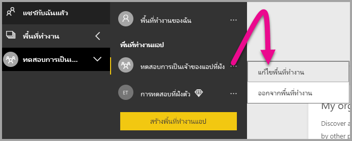

2. ขยาย**ขั้นสูง** แล้วเปิดใช้งาน**ความจุเฉพาะ** จากนั้นเลือกความจุเฉพาะที่คุณสร้างขึ้น จากนั้นเลือก**บันทึก**

    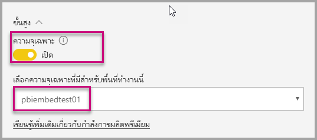

สำหรับคำถามเพิ่มเติมเกี่ยวกับ Power BI Embedded โปรดไปที่หน้า[คำถามที่ถามบ่อย](embedded-faq.md)  ถ้าคุณกำลังมีปัญหากับ Power Bi Embedded ภายในแอปพลิเคชันของคุณ แล้วโปรดไปที่หน้า[การแก้ไขปัญหา](embedded-troubleshoot.md)

มีคำถามเพิ่มเติมหรือไม่ [ลองถามชุมชน Power BI](http://community.powerbi.com/)