# <a name="tutorial-embed-a-power-bi-report-dashboard-or-tile-into-an-application-for-your-organization"></a>การสอน: ฝังรายงานรายงาน, แดชบอร์ด หรือไทล์ Power BI เข้าไปในแอปพลิเคชันสำหรับองค์กรของคุณ

การสอนนี้จะแสดงวิธีวิธีการรวมรายงานเข้าไปในแอปพลิเคชัน ใช้ Power BI .NET SDK พร้อมกับ Power BI JavaScript API เพื่อฝัง Power BI เข้าไปในแอปพลิเคชันสำหรับองค์กรของคุณ ใน Power BI คุณสามารถฝังรายงาน, แดชบอร์ด หรือไทล์ iแอปพลิเคชันโดยการใช้ **ผู้ใช้ที่เป็นเจ้าของข้อมูล** **ผู้ใช้ที่เป็นเจ้าของข้อมูล** ช่วยให้แอปพลิเคชันของคุณขยายบริการ Power BI


ในการสอนนี้ คุณจะได้เรียนรู้งานต่อไปนี้:
>[!div class="checklist"]
>* ลงทะเบียนแอปพลิเคชันใน Azure
>* ฝังรายงาน Power BI ลงในแอปพลิเคชัน

## <a name="prerequisites"></a>ข้อกำหนดเบื้องต้น

ก่อนเริ่ม คุณต้องมีบัญชี Power BI Pro และ เป็นสมาชิก Microsoft Azure:

* หากคุณยังไม่ได้สมัคร Power BI Pro ให้ [สมัครทดลองใช้งานฟรี](https://powerbi.microsoft.com/en-us/pricing/) ก่อนที่คุณจะเริ่ม
* ถ้าคุณยังไม่มีการสมัครใช้งาน Azure สร้าง[บัญชีฟรี](https://azure.microsoft.com/free/?WT.mc_id=A261C142F)ก่อนที่คุณจะเริ่ม
* ตั้งค่า [Azure Active Directory (Azure AD) ผู้เช่า](create-an-azure-active-directory-tenant.md) ของคุณ
* ติดตั้ง [Visual Studio](https://www.visualstudio.com/) เวอร์ชัน 2013 หรือใหม่กว่า

## <a name="set-up-your-embedded-analytics-development-environment"></a>ตั้งค่าสภาพแวดล้อมการพัฒนาการวิเคราะห์แบบฝังตัวของคุณ

ก่อนที่จะเริ่มฝังรายงาน, แดชบอร์ด, หรือไทล์เข้าไปในแอปพลิเคชันของคุณ โปรดตรวจสอบให้แน่ใจว่าสภาพแวดล้อมของคุณถูกตั้งค่าสำหรับการฝัง สำหรับการตั้งค่า โปรดเลือกหนึ่งในการดำเนินการเหล่านี้:

- คุณสามารถไปที่ [เครื่องมือตั้งค่าการฝังตัว](https://aka.ms/embedsetup/UserOwnsData) เพื่อเริ่มและดาวน์โหลดตัวอย่างแอปพลิเคชันที่จะพาคุณสร้างสภาพแวดล้อมและฝังรายงานแบบรวดเร็ว

- หากคุณเลือกตั้งค่าสภาพแวดล้อมด้วยตนเอง โปรดทำตามขั้นตอนในส่วนต่อไปนี้

### <a name="register-an-application-in-azure-active-directory"></a>ลงทะเบียนแอปพลิเคชันใน Azure Active Directory

เพื่อรับแอปพลิเคชันในการเข้าถึง Power BI REST APIs ให้ลงทะเบียนด้วย Azure Active Directory จากนั้นคุณสามารถสร้างอัตลักษณ์สำหรับแอปพลิเคชันของคุณและระบุสิทธิ์ไปยังทรัพยากร Power BI REST

1. ยอมรับ [ข้อกำหนด Microsoft Power BI API](https://powerbi.microsoft.com/api-terms)

2. ลงชื่อเข้าใช้ไปยัง [พอร์ทัล Azure](https://portal.azure.com)

    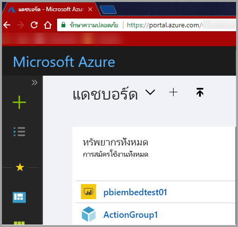

3. ในหน้าต่างนำทางซ้ายมือ เลือก **บริการทั้งหมด** และเลือก **การลงทะเบียนแอป** จากนั้นเลือก **ลงทะเบียนแอปพลิเคชันใหม่**

    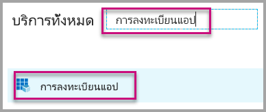</br>

    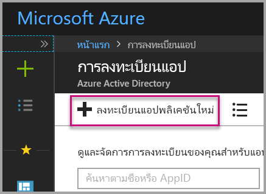

4. ทำตามพร้อมท์และสร้างแอปพลิเคชัน์ใหม่ สำหรับ **ผู้ใช้ที่เป็นเจ้าของข้อมูล** ให้ใช้**เว็บแอป/ API** สำหรับ **ประเภทแอปพลิเคชัน** คุณจะต้องให้ **URL ที่สมัคร** ซึ่ง Azure AD ใช้เพื่อส่งกลับผลลัพธ์โทเค็น ป้อนค่าที่จำเพาะไปยังแอปพลิเคชันของคุณ ตัวอย่างคือ `http://localhost:13526/`

    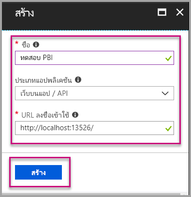

### <a name="apply-permissions-to-your-application-within-azure-active-directory"></a>นำสิทธิ์ไปใช้กับแอปพลิเคชันของคุณภายใน Azure Active Directory

คุณจะต้องเปิดใช้สิทธิ์สำหรับแอปพลิเคชันของคุณนอกเหนือจากสิ่งที่คุณให้ในหน้าลงทะเบียนแอป ลงชื่อเข้าใช้ด้วยบัญชีผู้ดูแลทั่วไปเพื่อเปิดใช้สิทธิ์

### <a name="use-the-azure-active-directory-portal"></a>ใช้พอร์ทัล Azure Active Directory

1. เรียกดู [การลงทะเบียนแอป](https://portal.azure.com/#blade/Microsoft_AAD_IAM/ApplicationsListBlade) ภายในพอร์ทัล Azure และเลือกแอปที่คุณกำลังใช้เพื่อการฝังตัว

    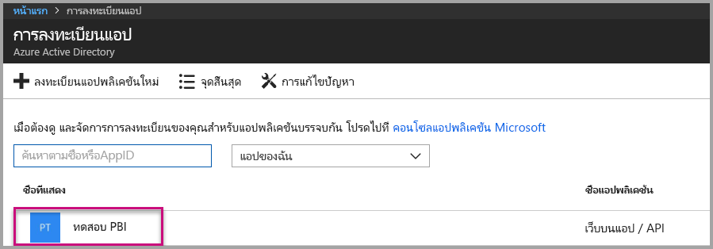

2. เลือก **การตั้งค่า** จากนั้นด้านล่าง **การเข้าถึง API** เลือก **สิทธิ์ที่จำเป็น**

    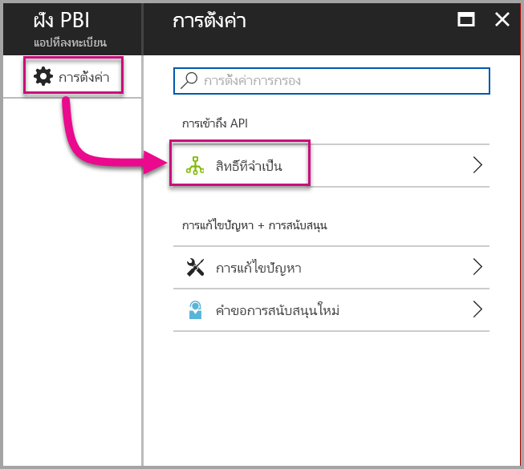

3. เลือก **Windows Azure Active Directory** จากนั้นตรวจสอบให้แน่ใจว่าได้เลือก **การเข้าถึงไดเรกทอรีในฐานะผู้ใช้ที่เข้าสู่ระบบ** เลือก**บันทึก**

    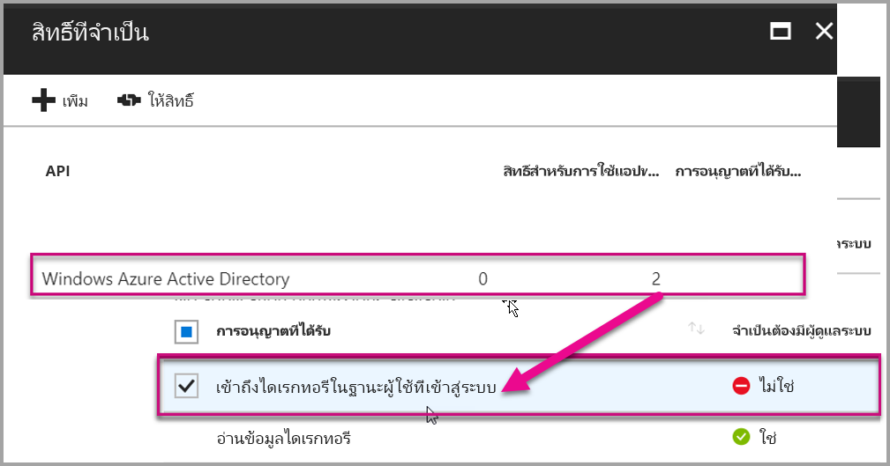

4. เลือก**เพิ่ม**

    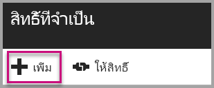

5. เลือก **เลือก API**

    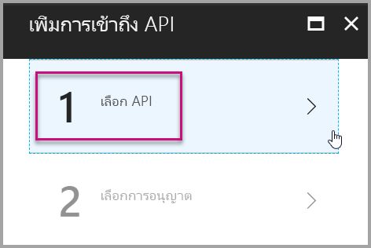

6. เลือก **บริการของ Power BI** จากนั้นเลือก **เลือก**

    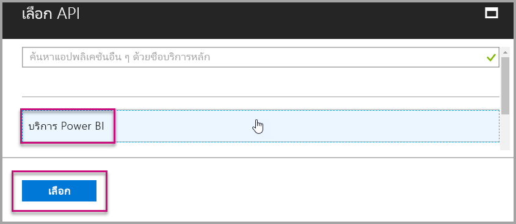

7. เลือกสิทธิ์ทั้งหมดใต้**สิทธิ์ที่ได้รับมอบ** เลือกทีละตัวเลือกเพื่อบันทึกการเลือก เลือก **บันทึก** เมื่อเสร็จสิ้น

    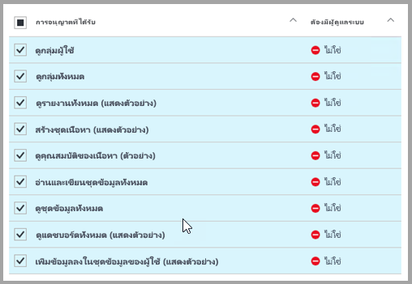

## <a name="set-up-your-power-bi-environment"></a>ตั้งค่าสภาพแวดล้อม Power BI ของคุณ

### <a name="create-an-app-workspace"></a>สร้างพื้นที่ทำงานสำหรับแอปฯ

หากคุณกำลังฝังรายงาน, แดชบอร์ด หรือไทล์สำหรับลูกค้า คุณต้องวางเนื้อหาลงในพื้นที่ทำงานแอป:

1. เริ่มต้นโดยการสร้างพื้นที่ทำงาน เลือก**พื้นที่ทำงาน** > **สร้างพื้นที่ทำงานแอป** พื้นที่ทำงานนี้จะเป็นพื้นที่สำหรับวางเนื้อหาที่แอปพลิเคชันของคุณจำเป็นต้องเข้าถึง

    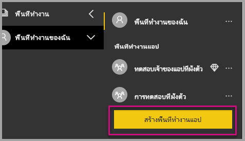

2. ตั้งชื่อพื้นที่ทำงาน ถ้าชื่อ **ID พื้นที่ทำงาน**ที่ตรงกันไม่สามารถใช้ได้ แก้ไขให้ ID ใหม่มีค่าไม่ซ้ำกัน ชื่อนี้ต้องเป็นชื่อของแอปด้วย

    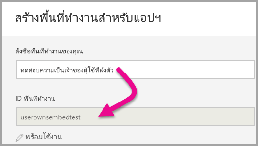

3. คุณมีสองสามตัวเลือกที่จะตั้งค่า ถ้าคุณเลือก**สาธารณะ** ทุกคนในองค์กรคุณสามารถดูสิ่งที่อยู่ในพื้นที่ทำงานได้ **ส่วนตัว** หมายถึงมีเพียงสมาชิกเท่าของพื้นที่ทำงานเท่านั้นที่สามารถเห็นเนื้อหาได้

    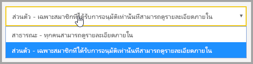

    คุณจะไม่สามารถเปลี่ยนการตั้งค่าของ สาธารณะหรือส่วนตัวหลังจากสร้างกลุ่มแล้ว

4. นอกจากนี้คุณยังสามารถเลือกการเข้าถึงของสมาชิกแบบแก้ไขได้หรือดูเท่านั้น

    

5. เพิ่มที่อยู่อีเมลของบุคคลที่คุณต้องการให้เข้าถึงพื้นที่ทำงานและเลือก **เพิ่ม** คุณไม่สามารถเพิ่มนามแฝงของกลุ่ม เพิ่มได้แค่บุคคลอย่างเดียว

6. ตัดสินใจว่า แต่ละคนเป็นสมาชิกหรือผู้ดูแลระบบ ผู้ดูแลระบบสามารถแก้ไขพื้นที่ทำงาน รวมถึงการเพิ่มสมาชิกคนอื่น ๆ สมาชิกสามารถแก้ไขเนื้อหาในพื้นที่ทำงาน นอกจากว่าพวกเขามีสิทธิ์เข้าถึงแบบดูเท่านั้น ทั้งผู้ดูแลระบบและสมาชิกสามารถเผยแพร่แอป

    ในตอนนี้ คุณสามารถดูพื้นที่ทำงานใหม่แล้ว Power BI จะสร้างพื้นที่ทำงาน และเปิดพื้นที่ทำงานนั้น จะแสดงในรายการของพื้นที่ทำงานที่คุณเป็นสมาชิก เนื่องจากคุณเป็นผู้ดูแล คุณสามารถเลือกจุดไข่ปลา (...) เพื่อกลับมา และทำการเปลี่ยนแปลง เพิ่มสมาชิกใหม่ หรือเปลี่ยนแปลงสิทธิ์ของพวกเขาได้

    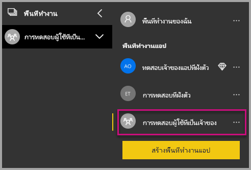

### <a name="create-and-publish-your-reports"></a>สร้าง และเผยแพร่รายงานของคุณ

คุณสามารถสร้างรายงานและชุดข้อมูลโดยการใช้ Power BI Desktop จากนั้นคุณสามารถเผยแพร่รายงานเหล่านั้นไปยังพื้นที่ทำงานแอป ผู้ใช้ปลายทางที่เผยแพร่รายงานจำเป็นต้องมีสิทธิ์การใช้งาน Power BI Pro เพื่อเผยแพร่ไปยังพื้นที่ทำงานแอป

1. ดาวน์โหลดตัวอย่าง[การสาธิตบล็อก](https://github.com/Microsoft/powerbi-desktop-samples)จาก GitHub

    

2. เปิดรายงานตัวอย่าง .pbix ใน Power BI Desktop

   

3. เผยแพร่ไปยังพื้นที่ทำงานแอป

   

    ในตอนนี้ คุณสามารถดูรายงานในบริการของ Power BI แบบออนไลน์

   

## <a name="embed-your-content-by-using-the-sample-application"></a>ฝังเนื้อหาของคุณโดยการใช้แอปพลิเคชันตัวอย่าง

สำหรับวิธีฝังเนื้อหาโดยการใช้แอปพลิเคชันตัวอย่าง ให้ทำตามขั้นตอนต่อไปนี้:

1. เริ่มจากดาวน์โหลด [ตัวอย่างผู้ใช้ที่เป็นเจ้าของข้อมูล](https://github.com/Microsoft/PowerBI-Developer-Samples) จาก GitHub. แอปพลิเคชันตัวอย่างจะมี 3 แบบ: แบบแรกคือ [รายงาน](https://github.com/Microsoft/PowerBI-Developer-Samples/tree/master/User%20Owns%20Data/integrate-report-web-app) แบบที่สองคือ [แดชบอร์ด](https://github.com/Microsoft/PowerBI-Developer-Samples/tree/master/User%20Owns%20Data/integrate-dashboard-web-app) และแบบสุดท้ายคือ [ไทล์](https://github.com/Microsoft/PowerBI-Developer-Samples/tree/master/User%20Owns%20Data/integrate-tile-web-app) บทความนี้จะพูดถึงแอปพลิเคชัน **รายงาน**

    

2. เปิดไฟล์ **Cloud.config** ในแอปพลิเคชันตัวอย่าง จะมีช่องที่คุณต้องป้อนเพื่อเรียกใช้งานแอปพลิเคชันให้เรียบร้อย: **ApplicationID** และ **ApplicationSecret**

    

    ป้อนข้อมูลช่อง **ApplicationID** ด้วย **ID แอปพลิเคชัน** จาก Azure แอปพลิเคชันจะใช้ **ApplicationID** ในการระบุตัวเองไปยังผู้ใช้ที่คุณกำลังขอสิทธิ์

    สำหรับวิธีรับ **ApplicationID** ให้ทำตามขั้นตอนต่อไปนี้:

    1. ลงชื่อเข้าใช้ไปยัง [พอร์ทัล Azure](https://portal.azure.com)

        

    1. ในบานหน้าต่างนำทางซ้ายมือ เลือก **บริการทั้งหมด** และเลือก **การลงทะเบียนแอป**

        

    1. เลือกแอปพลิเคชันที่ต้องใช้ **ApplicationID**

        

    1. คุณควรจะเห็น **Application ID** ที่แสดงในรูปของ GUID ใช้ **ID แอปพลิเคชัน** นี้เป็น **ApplicationID** สำหรับแอปพลิเคชัน

        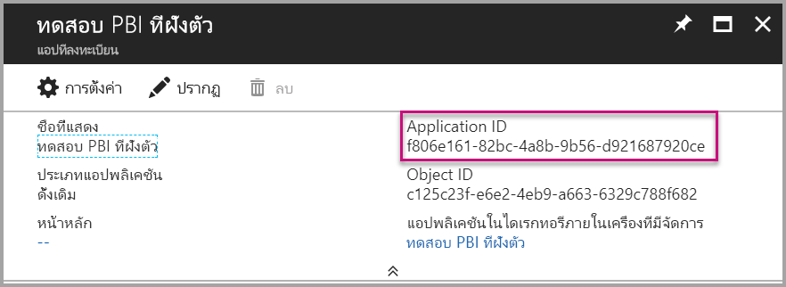

    1. ป้อนข้อมูล **ApplicationSecret** จากส่วน **คีย์** ของส่วน **การลงทะเบียนแอปพลิเคชัน** ใน **Azure**

    1. สำหรับวิธีรับ **ApplicationSecret** ให้ทำตามขั้นตอนต่อไปนี้:

        1. ลงชื่อเข้าใช้ไปยัง [พอร์ทัล Azure](https://portal.azure.com)

            

        1. ในบานหน้าต่างนำทางซ้ายมือ เลือก **บริการทั้งหมด** และเลือก **การลงทะเบียนแอป**

            

        1. เลือกแอปพลิเคชันที่ต้องใช้ **ApplicationSecret**

            

        1. เลือก **การตั้งค่า**

            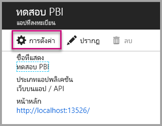

        1. เลือก **คีย์**

            

    1. ป้อนชื่อในกล่อง **Description** และเลือกระยะเวลา จากนั้นเลือก **บันทึก** เพื่อรับ **ค่า** สำหรับแอปพลิเคชัน เมื่อคุณเลือกบานหน้าต่าง **คีย์** หลังจากการบันทึกค่าคีย์แล้ว ช่องค่าจะถูกซ่อนเท่านั้น ในขั้นตอนนี้คุณจะไม่สามารถเรียกดูค่าคีย์ได้ หากคุณทำค่าคีย์หาย ให้สร้างใหม่ในพอร์ทัล Azure

        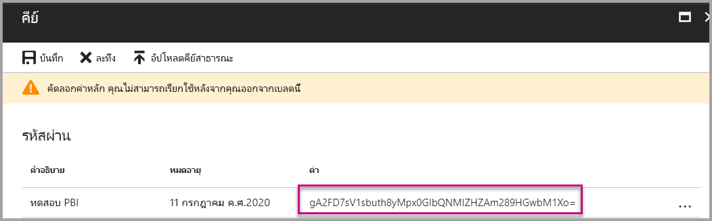

    1. สำหรับ **groupId** ป้อนพื้นที่ทำงานแอป GUID จาก Power BI

        

    1. สำหรับช่อง **reportId** ป้อนพื้นที่ทำงานแอป GUID จาก Power BI

        

3. เรียกใช้แอปพลิเคชัน:

    1. ก่อนอื่น ให้เลือก**เรียกใช้**ใน **Visual Studio**

        

    1. แล้ว เลือก **รับรายงาน**

        

    1. ตอนนี้ คุณสามารถดูรายงานในแอปพลิเคชันตัวอย่างได้แล้ว

        

## <a name="embed-your-content-within-your-application"></a>ฝังเนื้อหาของคุณภายในแอปพลิเคชันของคุณ

แม้ว่าขั้นตอนในการฝังเนื้อหาของคุณอาจทำได้ด้วย [Power BI REST APIs](https://docs.microsoft.com/rest/api/power-bi/) แต่ตัวอย่างรหัสที่อธิบายในบทความนี้ถูกสร้างด้วย .NET SDK

วิธีรวมรายงานเข้าไปในเว็บแอป ให้ใช้ Power BI REST API หรือ Power BI C# SDK และใช้โทเค็นการเข้าถึงคำอนุญาต Azure Active Directory เพื่อรับรายงาน จากนั้นโหลดรายงานโดยการใช้โทเค็นการเข้าถึงอันเดิม Power BI Rest API จะให้การเข้าถึงแบบโปรแกรมเพื่อระบุทรัพยากร Power BI สำหรับข้อมูลเพิ่มเติม โปรดดู [Power BI REST APIs](https://docs.microsoft.com/rest/api/power-bi/) และ [Power BI JavaScript API](https://github.com/Microsoft/PowerBI-JavaScript)

### <a name="get-an-access-token-from-azure-ad"></a>รับโทเค็นการเข้าถึงจาก Azure AD

ภายในแอปพลิเคชัน คุณจะต้องรับโทเค็นการเข้าถึงจาก Azure AD ก่อนที่คุณจะเรียกใช้ Power BI REST API สำหรับข้อมูลเพิ่มเติม ให้ดู[การรับรองตัวตนผู้ใช้และรับโทเค็นการเข้า Azure AD สำหรับแอป Power BI ของคุณ](get-azuread-access-token.md)

### <a name="get-a-report"></a>รับรายงาน

สำหรับการรับรายงาน Power BI ให้ใช้การดำเนินการ [รับรายงาน](https://docs.microsoft.com/rest/api/power-bi/reports/getreports) ซึ่งจะรับรายการของรายงาน Power BI จากรายการรายงาน คุณสามารถรับ ID รายงาน

### <a name="get-reports-by-using-an-access-token"></a>รับรายงานโดยการใช้โทเค็นการเข้าถึง

[Get Reports](https://docs.microsoft.com/rest/api/power-bi/reports/getreports)operation จะส่งคืนค่ารายการของรายงาน จากรายการของรายงาน คุณสามารถรับรายงานชิ้นหนึ่ง

เพื่อเรียกใช้ REST API คุณต้องใส่ส่วนหัว *Authorization* ในรูปแบบ *Bearer {โทเค็นการเข้าถึง}*

#### <a name="get-reports-with-the-rest-api"></a>รับรายงาน ด้วย REST API

ตัวอย่างรหัสต่อไปนี้จะแสดงวิธีการเรียกดูรายงานด้วย **REST API**:

> [!NOTE]  
> ตัวอย่างของการรับรายการเนื้อหาที่คุณต้องการฝังมีให้บริการในไฟล์ **Default.aspx.cs** ซึ่งอยู่ใน [แอปพลิเคชันตัวอย่าง](#embed-your-content-using-the-sample-application) ตัวอย่าง ได้แก่ รายงาน, แดชบอร์ด หรือไทล์

```csharp
using Newtonsoft.Json;

//Get a Report. In this sample, you get the first Report.
protected void GetReport(int index)
{
    //Configure Reports request
    System.Net.WebRequest request = System.Net.WebRequest.Create(
        String.Format("{0}/Reports",
        baseUri)) as System.Net.HttpWebRequest;

    request.Method = "GET";
    request.ContentLength = 0;
    request.Headers.Add("Authorization", String.Format("Bearer {0}", accessToken.Value));

    //Get Reports response from request.GetResponse()
    using (var response = request.GetResponse() as System.Net.HttpWebResponse)
    {
        //Get reader from response stream
        using (var reader = new System.IO.StreamReader(response.GetResponseStream()))
        {
            //Deserialize JSON string
            PBIReports Reports = JsonConvert.DeserializeObject<PBIReports>(reader.ReadToEnd());

            //Sample assumes at least one Report.
            //You could write an app that lists all Reports
            if (Reports.value.Length > 0)
            {
                var report = Reports.value[index];

                txtEmbedUrl.Text = report.embedUrl;
                txtReportId.Text = report.id;
                txtReportName.Text = report.name;
            }
        }
    }
}

//Power BI Reports used to deserialize the Get Reports response.
public class PBIReports
{
    public PBIReport[] value { get; set; }
}
public class PBIReport
{
    public string id { get; set; }
    public string name { get; set; }
    public string webUrl { get; set; }
    public string embedUrl { get; set; }
}
```

#### <a name="get-reports-by-using-the-net-sdk"></a>รับตัวอย่างโดยการใช้ .NET SDK

คุณสามารถใช้ .NET SDK เพื่อเรียกดูรายการของรายงานแทนที่จะเรียก REST API โดยตรง ตัวอย่างรหัสต่อไปนี้จะแสดงวิธีการลงรายการรายงาน:

```csharp
using Microsoft.IdentityModel.Clients.ActiveDirectory;
using Microsoft.PowerBI.Api.V2;
using Microsoft.PowerBI.Api.V2.Models;

var tokenCredentials = new TokenCredentials(<ACCESS TOKEN>, "Bearer");

// Create a Power BI Client object. It is used to call Power BI APIs.
using (var client = new PowerBIClient(new Uri(ApiUrl), tokenCredentials))
{
    // Get the first report all reports in that workspace
    ODataResponseListReport reports = client.Reports.GetReports();

    Report report = reports.Value.FirstOrDefault();

    var embedUrl = report.EmbedUrl;
}
```

### <a name="load-a-report-by-using-javascript"></a>โหลดรายงานโดยการใช้ JavaScript

คุณสามารถใช้ JavaScript เพื่อโหลดรายงานลงในองค์ประกอบ div บนเว็บเพจของคุณ ตัวอย่างรหัสต่อไปนี้จะแสดงวิธีการเรียกดูรายงานจากพื้นที่ทำงานที่ระบุ:

> [!NOTE]  
> ตัวอย่างของการโหลดรายการเนื้อหาที่คุณต้องการฝังมีให้บริการในไฟล์ **Default.aspx** ซึ่งอยู่ใน [แอปพลิเคชันตัวอย่าง](#embed-your-content-using-the-sample-application) ตัวอย่าง ได้แก่ รายงาน, แดชบอร์ด หรือไทล์

```javascript
<!-- Embed Report-->
<div> 
    <asp:Panel ID="PanelEmbed" runat="server" Visible="true">
        <div>
            <div><b class="step">Step 3</b>: Embed a report</div>

            <div>Enter an embed url for a report from Step 2 (starts with https://):</div>
            <input type="text" id="tb_EmbedURL" style="width: 1024px;" />
            <br />
            <input type="button" id="bEmbedReportAction" value="Embed Report" />
        </div>

        <div id="reportContainer"></div>
    </asp:Panel>
</div>
```

#### <a name="sitemaster"></a>Site.master

```javascript
window.onload = function () {
    // client side click to embed a selected report.
    var el = document.getElementById("bEmbedReportAction");
    if (el.addEventListener) {
        el.addEventListener("click", updateEmbedReporte, false);
    } else {
        el.attachEvent('onclick', updateEmbedReport);
    }

    // handle server side post backs, optimize for reload scenarios
    // show embedded report if all fields were filled in.
    var accessTokenElement = document.getElementById('MainContent_accessTokenTextbox');
    if (accessTokenElement !== null) {
        var accessToken = accessTokenElement.value;
        if (accessToken !== "")
            updateEmbedReport();
    }
};

// update embed report
function updateEmbedReport() {

    // check if the embed url was selected
    var embedUrl = document.getElementById('tb_EmbedURL').value;
    if (embedUrl === "")
        return;

    // get the access token.
    accessToken = document.getElementById('MainContent_accessTokenTextbox').value;

    // Embed configuration used to describe the what and how to embed.
    // This object is used when calling powerbi.embed.
    // You can find more information at https://github.com/Microsoft/PowerBI-JavaScript/wiki/Embed-Configuration-Details.
    var config = {
        type: 'report',
        accessToken: accessToken,
        embedUrl: embedUrl
    };

    // Grab the reference to the div HTML element that will host the report.
    var reportContainer = document.getElementById('reportContainer');

    // Embed the report and display it within the div container.
    var report = powerbi.embed(reportContainer, config);

    // report.on will add an event handler which prints to Log window.
    report.on("error", function (event) {
        var logView = document.getElementById('logView');
        logView.innerHTML = logView.innerHTML + "Error<br/>";
        logView.innerHTML = logView.innerHTML + JSON.stringify(event.detail, null, "  ") + "<br/>";
        logView.innerHTML = logView.innerHTML + "---------<br/>";
    }
  );
}
```

## <a name="using-a-power-bi-premium-dedicated-capacity"></a>ใช้ความจุเฉพาะของ Power BI Premium

เมื่อคุณเสร็จสิ้นการพัฒนาแอปพลิเคชันของคุณ ถัดไปคือการสนับสนุนพื้นที่ทำงานแอปด้วยความจุเฉพาะ

### <a name="create-a-dedicated-capacity"></a>สร้างความจุเฉพาะ

โดยการสร้างความจุเฉพาะ คุณสามารถใช้ประโยชน์จากการมีทรัพยากรเฉพาะสำหรับเนื้อหาในพื้นที่ทำงานแอปของคุณ คุณสามารถสร้างความจุเฉพาะโดยการใช้ [Power BI Premium](../service-premium.md)

ตารางต่อไปนี้ลงรายการ Power BI Premium SKUs ที่ให้บริการใน [Microsoft Office 365](../service-admin-premium-purchase.md):

| โหนดของความจุ | vCores ทั้งหมด<br/>(back end + front end) | Back-end vCores | Front-end vCores | การจำกัดการเชื่อมต่อ DirectQuery/live | หน้าสูงสุดที่แสดงในชั่วโมงที่เรียกใช้มากที่สุด |
| --- | --- | --- | --- | --- | --- |
| EM1 |1 vCore |0.5 vCore, 10 GB ของ RAM |0.5 vCore |3.75 ต่อวินาที |150-300 |
| EM2 |2 vCores |1 vCore, 10 GB ของ RAM |1 vCores |7.5 ต่อวินาที |301-600 |
| EM3 |4 vCores |2 vCore, 10 GB ของ RAM |2 vCores |15 ต่อวินาที |601-1,200 |
| P1 |8 vCores |4 vCore, 25 GB ของ RAM |4 vCores |30 ต่อวินาที |1,201-2,400 |
| P2 |16 vCores |8 vCores, 50 GB ของ RAM |8 vCores |60 ต่อวินาที |2,401-4,800 |
| P3 |32 vCores |16 vCores, 100 GB ของ RAM |16 vCores |120 ต่อวินาที |4,801-9,600 |
| P4 |64 vCores |32 vCores, 200 GB ของ RAM |32 vCores |240 ต่อวินาที |9,601-19,200 |
| P5 |128 vCores |64 vCores, 400 GB ของ RAM |64 vCores |480 ต่อวินาที |19,201-38,400 |

> [!NOTE]
> - เมื่อคุณพยายามฝังด้วยแอป Microsoft Office คุณสามารถใช้ EM SKUs เพื่อเข้าถึงเนื้อหาด้วยสิทธิ์การใช้งานฟรีของ Power BI แต่จะไม่สามารถเข้าถึงเนื้อหาด้วยสิทธิ์การใช้งานฟรีของ Power BI หากคุณกำลังใช้ Powerbi.com หรือ Power BI mobile
> - เมื่อคุณพยายามฝังด้วยแอป Microsoft Office โดยการใข้ Powerbi.com หรือ Power BI mobile คุณสามารถเข้าถึงเนื้อหาด้วยสิทธิ์การใช้งานฟรีของ Power BI Power BI

### <a name="assign-an-app-workspace-to-a-dedicated-capacity"></a>กำหนดพื้นที่ทำงานของแอปให้กับความจุเฉพาะ

หลังจากคุณสร้างความจุเฉพาะแล้ว คุณสามารถกำหนดพื้นที่ทำงานแอปไปยังความจุเฉพาะได้ สำหรับวิธีจบกระบวนการนี้ ให้ทำตามขั้นตอนต่อไปนี้:

1. ภายในบริการของ Power BI ให้ขยายพื้นที่ทำงานและเลือกจุดไข่ปลาสำหรับพื้นที่ทำงานที่คุณกำลังใช้เพื่อการฝังเนื้อหา แล้วเลือก**แก้ไขพื้นที่ทำงาน**

    

2. ขยาย **ขั้นสูง** และเปิดใช้งาน **ความจุเฉพาะ** เลือกความจุเฉพาะที่คุณสร้าง จากนั้นเลือก**บันทึก**

    

3. หลังจากเลือก **บันทึก** คุณควรจะเห็นรูปข้าวหลามตัดถัดจากชื่อพื้นที่ทำงานแอป

    

## <a name="admin-settings"></a>การตั้งค่าผู้ดูแลระบบ

ผู้ดูแลทั่วไปหรือผู้ดูแลบริการของ Power BI สามารถเปิด/ปิดความสามารถในการใช้ REST APIs ของผู้เช่าได้ ผู้ดูแล Power BI สามารถตั้งการตั้งค่าสำหรับทั้งองค์กรหรือกลุ่มรักษาความปลอดภัยแยกต่างหากได้ เปิดใช้งานสำหรับทั้งองค์กรโดยค่าเริ่มต้น คุณสามารถแก้ไขเปลี่ยนแปลงได้ใน [พอร์ทัลผู้ดูแล Power BI](../service-admin-portal.md)

## <a name="next-steps"></a>ขั้นตอนถัดไป

ในการสอนนี้ คุณจะได้เรียนรู้วิธีการฝังเนื้อหา Power BI เข้าไปในแอปพลิเคชันโดยการใช้บัญชีองค์กร Power BI คุณสามารถลองฝังเนื้อหา Power BI content เข้าไปในแอปพลิเคชันโดยการใช้แอปได้แล้ว นอกจากนี้คุณยังสามารถลองฝังเนื้อหา Power BI สำหรับลูกค้าได้เช่นกัน:

> [!div class="nextstepaction"]
> [ฝังตัวจากแอป](embed-from-apps.md)

> [!div class="nextstepaction"]
>[ฝังสำหรับลูกค้าของคุณ](embed-sample-for-customers.md)

หากมีข้อสงสัย [ลองถามชุมชน Power BI](http://community.powerbi.com/)
