# <a name="tutorial-embed-power-bi-content-into-an-application-for-your-organization"></a>บทช่วยสอน: ฝังเนื้อหา Power BI ลงในแอปพลิเคชันสำหรับองค์กรของคุณ

ใน **Power BI** คุณสามารถฝังรายงาน (Power BI หรือรายงานที่มีการแบ่งหน้า) แดชบอร์ด หรือไทล์เข้าไปในแอปพลิเคชันโดยการใช้ผู้ใช้ที่เป็นเจ้าของข้อมูล **ผู้ใช้ที่เป็นเจ้าของข้อมูล** ช่วยให้แอปพลิเคชันของคุณขยายบริการ Power BI เพื่อใช้การวิเคราะห์แบบฝังตัว บทช่วยสอนนี้จะแสดงวิธีการรวมรายงาน (Power BI หรือรายงานที่มีการแบ่งหน้า) เข้าไปในแอปพลิเคชัน คุณใช้ Power BI .NET SDK กับ Power BI JavaScript API เพื่อฝัง Power BI เข้าไปในแอปพลิเคชันสำหรับองค์กรของคุณ

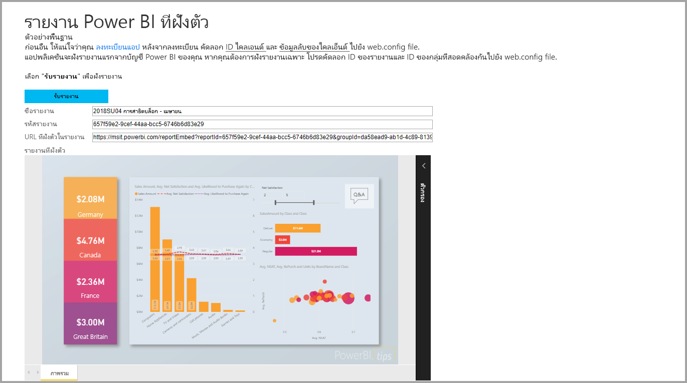

ในการสอนนี้ คุณจะได้เรียนรู้งานต่อไปนี้:
> [!div class="checklist"]
> * ลงทะเบียนแอปพลิเคชันใน Azure
> * ฝังรายงาน Power BI หรือรายงานที่มีการแบ่งหน้าเข้าไปในแอปพลิเคชันโดยใช้ผู้เช่า Power BI ของคุณ

## <a name="prerequisites"></a>ข้อกำหนดเบื้องต้น

เมื่อต้องเริ่มต้นใช้งาน คุณจำเป็นต้องมี:

* [บัญชี Power BI Pro](../service-self-service-signup-for-power-bi.md)
* การสมัครใช้งาน [Microsoft Azure](https://azure.microsoft.com/)
* คุณจำเป็นต้องตั้งค่า[ผู้เช่า Azure Active Directory](create-an-azure-active-directory-tenant.md) ของคุณเอง
* สำหรับการฝังรายงานที่มีการแบ่งหน้า อย่างน้อยคุณจำเป็นต้องมีความ จุ P1 [ดูขนาดความจุพรีเมียมใดที่จำเป็นสำหรับรายงานที่มีการแบ่งหน้าของฉัน](../paginated-reports-faq.md#what-size-premium-capacity-do-i-need-for-paginated-reports)

ถ้าคุณยังไม่ได้ลงทะเบียนสำหรับ **Power BI Pro**[ลงทะเบียนทดลองใช้ฟรี](https://powerbi.microsoft.com/pricing/)ก่อนที่คุณจะเริ่ม

ถ้าคุณยังไม่มีการสมัครใช้งาน Azure สร้าง[บัญชีฟรี](https://azure.microsoft.com/free/?WT.mc_id=A261C142F)ก่อนที่คุณจะเริ่ม

## <a name="set-up-your-embedded-analytics-development-environment"></a>ตั้งค่าสภาพแวดล้อมการพัฒนาการวิเคราะห์แบบฝังตัวของคุณ

ก่อนที่คุณจะเริ่มฝังรายการ, แดชบอร์ด หรือไทล์ลงในแอปพลิเคชันของคุณ คุณจำเป็นต้องตรวจสอบให้แน่ใจว่าสภาพแวดล้อมเอื้ออำนวยต่อการฝังด้วย Power BI

คุณสามารถเข้าถึง [เครื่องมือตั้งค่าการฝังตัว](https://aka.ms/embedsetup/UserOwnsData) เพื่อให้คุณสามารถเริ่มต้นใช้งาน และดาวน์โหลดแอปพลิเคชันตัวอย่างที่ช่วยแนะนำคุณไปตามขั้นตอนการสร้างสภาพแวดล้อม และการฝังรายงานได้ ในกรณีของการฝังรายงานที่มีการแบ่งหน้า คุณจำเป็นต้องกำหนดความจุ P1 ให้กับพื้นที่ทำงานที่สร้างขึ้นเป็นอย่างน้อย

แต่หากคุณเลือกที่จะตั้งค่าสภาพแวดล้อมด้วยตนเอง คุณสามารถดำเนินต่อตามด้านล่าง

### <a name="register-an-application-in-azure-active-directory"></a>ลงทะเบียนแอปพลิเคชันใน Azure Active Directory

[ลงทะเบียนแอปพลิเคชัน](register-app.md)กับ Azure Active Directory เพื่ออนุญาตให้เข้าถึงแอปพลิเคชัน[Power BI REST ](https://docs.microsoft.com/rest/api/power-bi/) การลงทะเบียนแอปพลิเคชันจะทำให้คุณสร้างอัตลักษณ์แอปพลิเคชันของคุณและระบุสิทธิ์ไปยังทรัพยากร Power BI REST

คุณจำเป็นต้องดำเนินการลงทะเบียนแอป **เว็บแอปพลิเคชันฝั่งเซิร์ฟเวอร์** คุณลงทะเบียนแอปพลิเคชันเว็บฝั่งเซิร์ฟเวอร์เพื่อสร้างเป็นความลับของแอปพลิเคชัน

## <a name="set-up-your-power-bi-environment"></a>ตั้งค่าสภาพแวดล้อม Power BI ของคุณ

### <a name="create-a-workspace"></a>สร้างพื้นที่ทำงาน

หากคุณกำลังฝังรายงาน, แดชบอร์ด หรือไทล์สำหรับลูกค้า คุณต้องวางเนื้อหาลงในพื้นที่ทำงาน พื้นที่ทำงานมีหลายประเภทที่คุณสามารถตั้งค่า: [พื้นที่ทำงานแบบดั้งเดิม](../service-create-workspaces.md)หรือ[พื้นที่ทำงานใหม่](../service-create-the-new-workspaces.md)

### <a name="create-and-publish-your-power-bi-reports"></a>สร้าง และเผยแพร่รายงาน Power BI ของคุณ

คุณสามารถสร้างรายงานและชุดข้อมูลโดยการใช้ Power BI Desktop จากนั้นคุณสามารถเผยแพร่รายงานเหล่านั้นไปยังพื้นที่ทำงาน ผู้ใช้ปลายทางที่เผยแพร่รายงานจำเป็นต้องมีสิทธิ์การใช้งาน Power BI Pro เพื่อเผยแพร่ไปยังพื้นที่ทำงาน

1. ดาวน์โหลดตัวอย่าง [การสาธิต](https://github.com/Microsoft/powerbi-desktop-samples) จาก GitHub

    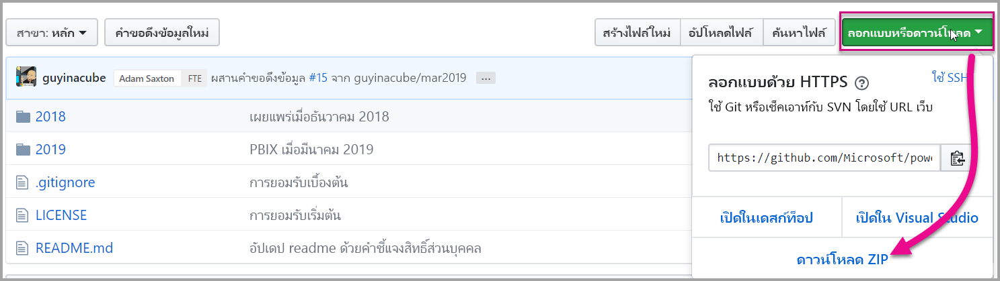

2. เปิดรายงานตัวอย่าง .pbix ใน Power BI Desktop

   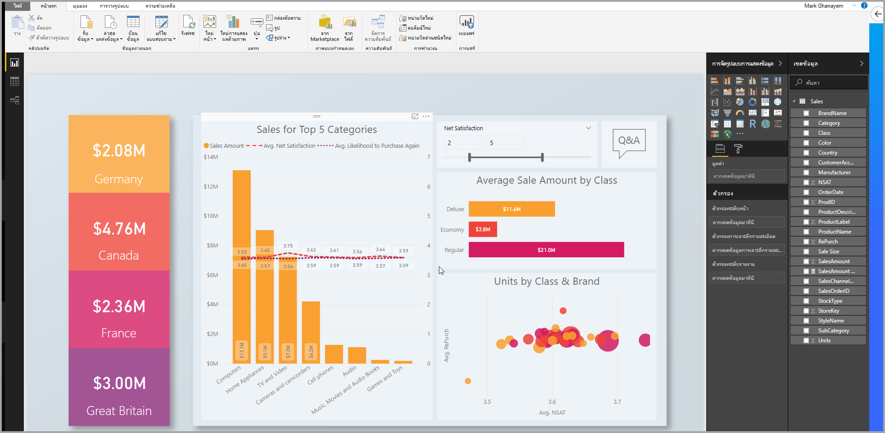

3. เผยแพร่ไปยังพื้นที่ทำงาน

   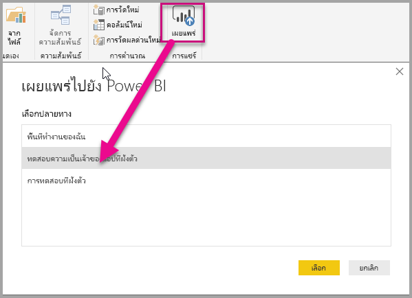

    ในตอนนี้ คุณสามารถดูรายงานในบริการของ Power BI แบบออนไลน์

   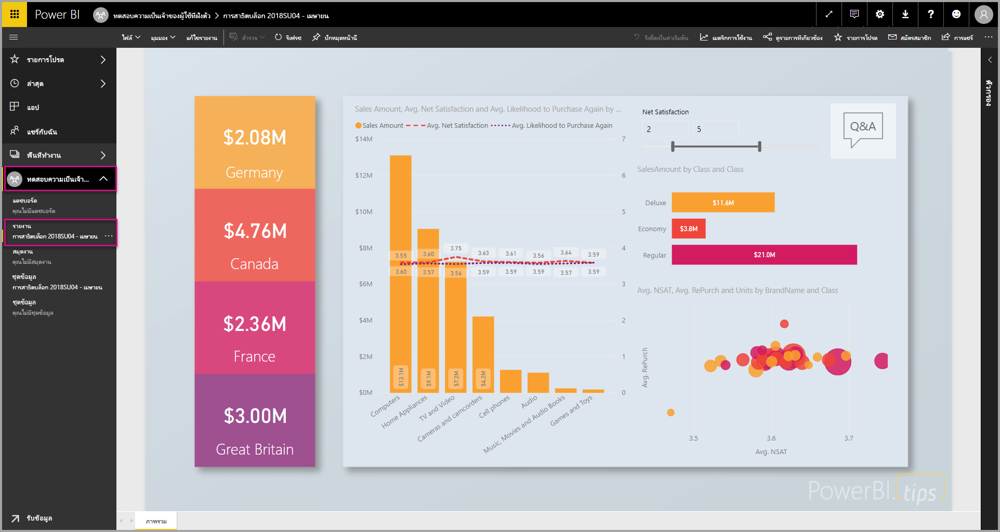
   
### <a name="create-and-publish-your-paginated-reports"></a>สร้าง และเผยแพร่รายงานที่มีการแบ่งหน้าของคุณ

คุณสามารถสร้างรายงานที่มีการแบ่งหน้าของคุณได้โดยใช้[ตัวสร้างรายงาน Power BI](../paginated-reports-report-builder-power-bi.md#create-reports-in-power-bi-report-builder) จากนั้นคุณสามารถ[อัปโหลดรายงาน](../paginated-reports-quickstart-aw.md#upload-the-report-to-the-service)ไปยังพื้นที่ทำงานที่กำหนดให้เป็นความจุ P1 อย่างน้อย ผู้ใช้ปลายทางที่อัปโหลดรายงานจำเป็นต้องมีสิทธิ์การใช้งาน Power BI Pro เพื่อเผยแพร่ไปยังพื้นที่ทำงาน
   
## <a name="embed-your-content-by-using-the-sample-application"></a>ฝังเนื้อหาของคุณโดยการใช้แอปพลิเคชันตัวอย่าง

ตัวอย่างนี้ถูกเก็บไว้อย่างตั้งใจเพื่อวัตถุประสงค์ในการสาธิต

ทำตามขั้นตอนด้านล่างเพื่อเริ่มการฝังเนื้อหาของคุณโดยใช้แอปพลิเคชันตัวอย่าง

1. ดาวน์โหลด[Visual Studio](https://www.visualstudio.com/) (เวอร์ชัน 2013 หรือใหม่กว่า) ทำให้แน่ใจว่าได้ดาวน์โหลด[แพคเกจ NuGet](https://www.nuget.org/profiles/powerbi)ล่าสุด

2. ดาวน์โหลด [ตัวอย่างผู้ใช้ที่เป็นเจ้าของข้อมูล](https://github.com/Microsoft/PowerBI-Developer-Samples) จาก GitHub เพื่อเริ่มต้นใช้งาน

    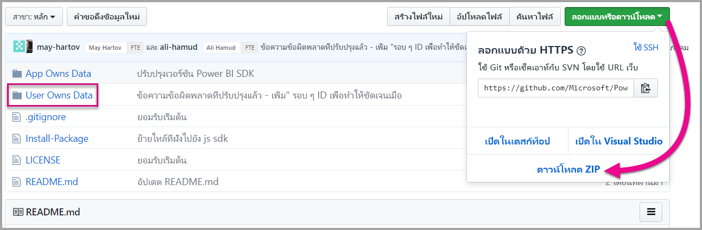

3. เปิดไฟล์ **Cloud.config** ในแอปพลิเคชันตัวอย่าง

    มีเขตข้อมูลที่คุณต้องกรอกข้อมูลเพื่อเรียกใช้แอปพลิเคชันให้สำเร็จ

    | เขตข้อมูล |
    |--------------------|
    | **[รหัสแอปพลิเคชัน](#application-id)** |
    | **[รหัสพื้นที่ทำงาน](#workspace-id)** |
    | **[รหัสรายงาน](#report-id)** |
    | **[AADAuthorityUrl](#aadauthorityurl)** |

    

### <a name="application-id"></a>รหัสแอปพลิเคชัน

ป้อนข้อมูล **applicationId** ด้วย **ID แอปพลิเคชัน** จาก **Azure** แอปพลิเชันจะใช้ **applicationId** เพื่อระบุตัวเองไปยังผู้ใช้จากที่คุณกำลังขอสิทธิ์

สำหรับวิธีรับ **applicationId** ให้ทำตามขั้นตอนต่อไปนี้:

1. ลงชื่อเข้าใช้[พอร์ทัล Azure](https://portal.azure.com)

2. ในบานหน้าต่างนำทางซ้ายมือ เลือก **บริการทั้งหมด** และเลือก **การลงทะเบียนแอป**

3. เลือกแอปพลิเคชันที่ต้องใช้ **ApplicationID**

    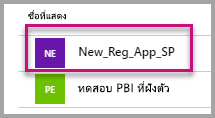

4. มี **ID แอปพลิเคชัน** ที่แสดงในรูปของ GUID ใช้ **ID แอปพลิเคชัน** นี้เป็น **applicationId** สำหรับแอปพลิเคชัน

    

### <a name="workspace-id"></a>ID พื้นที่ทำงาน

กรอกข้อมูล**workspaceId**ด้วย GUID พื้นที่ทำงาน (กลุ่ม) จาก Power BI คุณสามารถดูข้อมูลนี้จาก URL เมื่อลงชื่อเข้าใช้บริการ Power BI หรือโดยการใช้ Powershell

URL <br>


PowerShell <br>

```powershell
Get-PowerBIworkspace -name "User Owns Embed Test"
```

   

### <a name="report-id"></a>รหัสรายงาน

กรอกข้อมูล **reportId** ด้วย GUID รายงานจาก Power BI คุณสามารถดูข้อมูลนี้จาก URL เมื่อลงชื่อเข้าใช้บริการ Power BI หรือโดยการใช้ Powershell

URL รายงาน Power BI <br>


URL รายงานที่มีการแบ่งหน้า<br>


PowerShell <br>

```powershell
Get-PowerBIworkspace -name "User Owns Embed Test" | Get-PowerBIReport
```


### <a name="aadauthorityurl"></a>AADAuthorityUrl

กรอกข้อมูลใน **AADAuthorityUrl** พร้อม URL ที่อนุญาตให้คุณฝังภายในผู้เช่าองค์กรของคุณหรือฝังด้วยผู้ใช้ที่เป็นผู้เยี่ยมชม

สำหรับการฝังกับผู้เช่าขององค์กรของคุณ กรุณาใช้ URL - *https://login.microsoftonline.com/common/oauth2/authorize*

สำหรับการฝังกับผู้เยี่ยมชม กรุณาใช้ URL - *https://login.microsoftonline.com/report-owner-tenant-id* - ที่ซึ่งคุณเพิ่มรหัสผู้เช่าของเจ้าของรายงานในการแทนที่ของ*report-owner-tenant-id*

### <a name="run-the-application"></a>เรียกใช้แอปพลิเคชัน

1. เลือก**เรียกใช้**ใน **Visual Studio**

    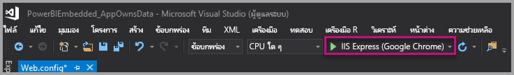

2. จากนั้นเลือก **Embed Report** ขึ้นอยู่กับเนื้อหาที่คุณเลือกที่จะทดสอบ - รายงาน, แดชบอร์ด หรือไทล์ - แล้วเลือกตัวเลือกนั้นในแอปพลิเคชัน

    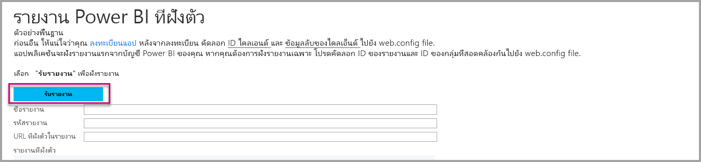

3. ตอนนี้ คุณสามารถดูรายงานในแอปพลิเคชันตัวอย่างได้แล้ว

    

## <a name="embed-your-content-within-your-application"></a>ฝังเนื้อหาของคุณภายในแอปพลิเคชันของคุณ

แม้ว่าขั้นตอนในการฝังเนื้อหาของคุณอาจทำได้ด้วย [Power BI REST APIs](https://docs.microsoft.com/rest/api/power-bi/) แต่ตัวอย่างรหัสที่อธิบายในบทความนี้ถูกสร้างด้วย .NET SDK

วิธีรวมรายงานเข้าไปในเว็บแอป ให้ใช้ Power BI REST API หรือ Power BI C# SDK และใช้โทเค็นการเข้าถึงคำอนุญาต Azure Active Directory เพื่อรับรายงาน จากนั้นโหลดรายงานโดยการใช้โทเค็นการเข้าถึงอันเดิม Power BI Rest API จะให้การเข้าถึงแบบโปรแกรมเพื่อระบุทรัพยากร Power BI สำหรับข้อมูลเพิ่มเติม โปรดดู [Power BI REST APIs](https://docs.microsoft.com/rest/api/power-bi/) และ [Power BI JavaScript API](https://github.com/Microsoft/PowerBI-JavaScript)

### <a name="get-an-access-token-from-azure-ad"></a>รับโทเค็นการเข้าถึงจาก Azure AD

ภายในแอปพลิเคชัน คุณจะต้องรับโทเค็นการเข้าถึงจาก Azure AD ก่อนที่คุณจะเรียกใช้ Power BI REST API สำหรับข้อมูลเพิ่มเติม ให้ดู[การรับรองตัวตนผู้ใช้และรับโทเค็นการเข้า Azure AD สำหรับแอป Power BI ของคุณ](get-azuread-access-token.md)

### <a name="get-a-report"></a>รับรายงาน

สำหรับการรับรายงาน Power BI หรือรายงานที่มีการแบ่งหน้า คุณสามารถใช้การดำเนินการ [รับรายงาน](https://docs.microsoft.com/rest/api/power-bi/reports/getreports) ซึ่งจะรับรายการของรายงาน Power BI และรายงานที่มีการแบ่งหน้า จากรายการรายงาน คุณสามารถรับ ID รายงาน

### <a name="get-reports-by-using-an-access-token"></a>รับรายงานโดยการใช้โทเค็นการเข้าถึง

[Get Reports](https://docs.microsoft.com/rest/api/power-bi/reports/getreports)operation จะส่งคืนค่ารายการของรายงาน จากรายการของรายงาน คุณสามารถรับรายงานชิ้นหนึ่ง

เพื่อเรียกใช้ REST API คุณต้องใส่ส่วนหัว *Authorization* ในรูปแบบ *Bearer {โทเค็นการเข้าถึง}*

#### <a name="get-reports-with-the-rest-api"></a>รับรายงาน ด้วย REST API

ตัวอย่างรหัสต่อไปนี้จะแสดงวิธีการเรียกดูรายงานด้วย REST API:

> [!Note]
> ตัวอย่างของการรับรายการเนื้อหาที่คุณต้องการฝังมีให้บริการในไฟล์ Default.aspx.cs ซึ่งอยู่ใน [แอปพลิเคชันตัวอย่าง](https://github.com/Microsoft/PowerBI-Developer-Samples) ตัวอย่าง ได้แก่ รายงาน, แดชบอร์ด หรือไทล์

```csharp
using Newtonsoft.Json;

//Get a Report. In this sample, you get the first Report.
protected void GetReport(int index)
{
    //Configure Reports request
    System.Net.WebRequest request = System.Net.WebRequest.Create(
        String.Format("{0}/Reports",
        baseUri)) as System.Net.HttpWebRequest;

    request.Method = "GET";
    request.ContentLength = 0;
    request.Headers.Add("Authorization", String.Format("Bearer {0}", accessToken.Value));

    //Get Reports response from request.GetResponse()
    using (var response = request.GetResponse() as System.Net.HttpWebResponse)
    {
        //Get reader from response stream
        using (var reader = new System.IO.StreamReader(response.GetResponseStream()))
        {
            //Deserialize JSON string
            PBIReports Reports = JsonConvert.DeserializeObject<PBIReports>(reader.ReadToEnd());

            //Sample assumes at least one Report.
            //You could write an app that lists all Reports
            if (Reports.value.Length > 0)
            {
                var report = Reports.value[index];

                txtEmbedUrl.Text = report.embedUrl;
                txtReportId.Text = report.id;
                txtReportName.Text = report.name;
            }
        }
    }
}

//Power BI Reports used to deserialize the Get Reports response.
public class PBIReports
{
    public PBIReport[] value { get; set; }
}
public class PBIReport
{
    public string id { get; set; }
    public string reportType { get; set }
    public string name { get; set; }
    public string webUrl { get; set; }
    public string embedUrl { get; set; }
}
```

#### <a name="get-reports-by-using-the-net-sdk"></a>รับตัวอย่างโดยการใช้ .NET SDK

คุณสามารถใช้ .NET SDK เพื่อเรียกดูรายการของรายงานแทนที่จะเรียก REST API โดยตรง ตัวอย่างรหัสต่อไปนี้จะแสดงวิธีการลงรายการรายงาน:

```csharp
using Microsoft.IdentityModel.Clients.ActiveDirectory;
using Microsoft.PowerBI.Api.V2;
using Microsoft.PowerBI.Api.V2.Models;

var tokenCredentials = new TokenCredentials(<ACCESS TOKEN>, "Bearer");

// Create a Power BI Client object. It is used to call Power BI APIs.
using (var client = new PowerBIClient(new Uri(ApiUrl), tokenCredentials))
{
    // Get the first report all reports in that workspace
    ODataResponseListReport reports = client.Reports.GetReports();

    Report report = reports.Value.FirstOrDefault();

    var embedUrl = report.EmbedUrl;
}
```

### <a name="load-a-report-by-using-javascript"></a>โหลดรายงานโดยการใช้ JavaScript

คุณสามารถใช้ JavaScript เพื่อโหลดรายงานลงในองค์ประกอบ div บนเว็บเพจของคุณ ตัวอย่างรหัสต่อไปนี้จะแสดงวิธีการเรียกดูรายงานจากพื้นที่ทำงานที่ระบุ:

> [!NOTE]  
> ตัวอย่างของการโหลดรายการเนื้อหาที่คุณต้องการฝังมีให้บริการในไฟล์ **Default.aspx** ซึ่งอยู่ใน [แอปพลิเคชันตัวอย่าง](https://github.com/Microsoft/PowerBI-Developer-Samples)

```javascript
<!-- Embed Report-->
<div> 
    <asp:Panel ID="PanelEmbed" runat="server" Visible="true">
        <div>
            <div><b class="step">Step 3</b>: Embed a report</div>

            <div>Enter an embed url for a report from Step 2 (starts with https://):</div>
            <input type="text" id="tb_EmbedURL" style="width: 1024px;" />
            <br />
            <input type="button" id="bEmbedReportAction" value="Embed Report" />
        </div>

        <div id="reportContainer"></div>
    </asp:Panel>
</div>
```

#### <a name="sitemaster"></a>Site.master

```javascript
window.onload = function () {
    // client side click to embed a selected report.
    var el = document.getElementById("bEmbedReportAction");
    if (el.addEventListener) {
        el.addEventListener("click", updateEmbedReport, false);
    } else {
        el.attachEvent('onclick', updateEmbedReport);
    }

    // handle server side post backs, optimize for reload scenarios
    // show embedded report if all fields were filled in.
    var accessTokenElement = document.getElementById('MainContent_accessTokenTextbox');
    if (accessTokenElement !== null) {
        var accessToken = accessTokenElement.value;
        if (accessToken !== "")
            updateEmbedReport();
    }
};

// update embed report
function updateEmbedReport() {

    // check if the embed url was selected
    var embedUrl = document.getElementById('tb_EmbedURL').value;
    if (embedUrl === "")
        return;

    // get the access token.
    accessToken = document.getElementById('MainContent_accessTokenTextbox').value;

    // Embed configuration used to describe the what and how to embed.
    // This object is used when calling powerbi.embed.
    // You can find more information at https://github.com/Microsoft/PowerBI-JavaScript/wiki/Embed-Configuration-Details.
    var config = {
        type: 'report',
        accessToken: accessToken,
        embedUrl: embedUrl
    };

    // Grab the reference to the div HTML element that will host the report.
    var reportContainer = document.getElementById('reportContainer');

    // Embed the report and display it within the div container.
    var report = powerbi.embed(reportContainer, config);

    // report.on will add an event handler which prints to Log window.
    report.on("error", function (event) {
        var logView = document.getElementById('logView');
        logView.innerHTML = logView.innerHTML + "Error<br/>";
        logView.innerHTML = logView.innerHTML + JSON.stringify(event.detail, null, "  ") + "<br/>";
        logView.innerHTML = logView.innerHTML + "---------<br/>";
    }
  );
}
```

## <a name="using-a-power-bi-premium-dedicated-capacity"></a>ใช้ความจุเฉพาะของ Power BI Premium

ตอนนี้คุณได้พัฒนาแอปพลิเคชันของคุณเรียบร้อยแล้ว ก็ถึงเวลาที่จะต้องสนับสนุนพื้นที่ทำงานของคุณด้วยความจุเฉพาะ

### <a name="create-a-dedicated-capacity"></a>สร้างความจุเฉพาะ

โดยการสร้างความจุเฉพาะ คุณสามารถใช้ประโยชน์จากการมีทรัพยากรเฉพาะสำหรับเนื้อหาในพื้นที่ทำงานของคุณ สำหรับรายงานที่มีการแบ่งหน้า คุณต้องสนับสนุนพื้นที่ทำงานของคุณด้วยความจุ P1 เป็นอย่างน้อย คุณสามารถสร้างความจุเฉพาะโดยการใช้ [Power BI Premium](../service-premium-what-is.md)

ตารางต่อไปนี้ลงรายการ Power BI Premium SKUs ที่ให้บริการใน [Microsoft Office 365](../service-admin-premium-purchase.md):

| โหนดของความจุ | vCores ทั้งหมด<br/>(back end + front end) | Back-end vCores | Front-end vCores | การจำกัดการเชื่อมต่อ DirectQuery/live |
| --- | --- | --- | --- | --- | --- |
| EM1 |1 vCore |0.5 vCore, 10 GB ของ RAM |0.5 vCore |3.75 ต่อวินาที |
| EM2 |2 vCores |1 vCore, 10 GB ของ RAM |1 vCores |7.5 ต่อวินาที |
| EM3 |4 vCores |2 vCore, 10 GB ของ RAM |2 vCores |15 ต่อวินาที |
| P1 |8 vCores |4 vCore, 25 GB ของ RAM |4 vCores |30 ต่อวินาที |
| P2 |16 vCores |8 vCores, 50 GB ของ RAM |8 vCores |60 ต่อวินาที |
| P3 |32 vCores |16 vCores, 100 GB ของ RAM |16 vCores |120 ต่อวินาที |
| P4 |64 vCores |32 vCores, 200 GB ของ RAM |32 vCores |240 ต่อวินาที |
| P5 |128 vCores |64 vCores, 400 GB ของ RAM |64 vCores |480 ต่อวินาที |

> [!NOTE]
> - เมื่อคุณพยายามฝังด้วยแอป Microsoft Office คุณสามารถใช้ EM SKUs เพื่อเข้าถึงเนื้อหาด้วยสิทธิ์การใช้งานฟรีของ Power BI แต่จะไม่สามารถเข้าถึงเนื้อหาด้วยสิทธิ์การใช้งานฟรีของ Power BI หากคุณกำลังใช้ Powerbi.com หรือ Power BI mobile
> - เมื่อคุณพยายามฝังด้วยแอป Microsoft Office โดยการใข้ Powerbi.com หรือ Power BI mobile คุณสามารถเข้าถึงเนื้อหาด้วยสิทธิ์การใช้งานฟรีของ Power BI Power BI

### <a name="assign-a-workspace-to-a-dedicated-capacity"></a>กำหนดพื้นที่ทำงานสำหรับความจุเฉพาะ

หลังจากคุณสร้างความจุเฉพาะแล้ว คุณสามารถกำหนดพื้นที่ทำงานสำหรับความจุเฉพาะดังกล่าวได้ สำหรับวิธีจบกระบวนการนี้ ให้ทำตามขั้นตอนต่อไปนี้:

1. ภายในบริการของ Power BI ให้ขยายพื้นที่ทำงานและเลือกจุดไข่ปลาสำหรับพื้นที่ทำงานที่คุณกำลังใช้เพื่อการฝังเนื้อหา แล้วเลือก**แก้ไขพื้นที่ทำงาน**

    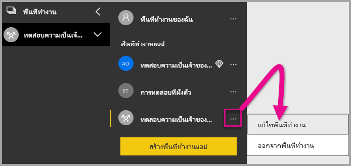

2. ขยาย **ขั้นสูง** และเปิดใช้งาน **ความจุเฉพาะ** เลือกความจุเฉพาะที่คุณสร้าง จากนั้นเลือก**บันทึก**

    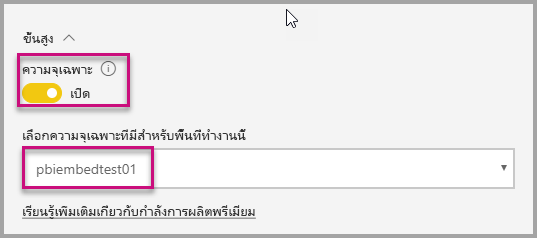

3. หลังจากเลือก **บันทึก** คุณควรจะเห็นรูปข้าวหลามตัดถัดจากชื่อพื้นที่ทำงาน

    

## <a name="admin-settings"></a>การตั้งค่าผู้ดูแลระบบ

ผู้ดูแลทั่วไปหรือผู้ดูแลบริการของ Power BI สามารถเปิด/ปิดความสามารถในการใช้ REST APIs ของผู้เช่าได้ ผู้ดูแล Power BI สามารถตั้งการตั้งค่าสำหรับทั้งองค์กรหรือกลุ่มรักษาความปลอดภัยแยกต่างหากได้ เปิดใช้งานสำหรับทั้งองค์กรโดยค่าเริ่มต้น คุณสามารถแก้ไขเปลี่ยนแปลงได้ใน [พอร์ทัลผู้ดูแล Power BI](../service-admin-portal.md)

## <a name="next-steps"></a>ขั้นตอนถัดไป

ในการสอนนี้ คุณจะได้เรียนรู้วิธีการฝังเนื้อหา Power BI เข้าไปในแอปพลิเคชันโดยการใช้บัญชีองค์กร Power BI คุณสามารถลองฝังเนื้อหา Power BI content เข้าไปในแอปพลิเคชันโดยการใช้แอปได้แล้ว นอกจากนี้คุณยังสามารถลองฝังเนื้อหา Power BI สำหรับลูกค้าของคุณ (ยังไม่ได้รับการสนับสนุนสำหรับการฝังรายงานที่มีการแบ่งหน้า):

> [!div class="nextstepaction"]
> [ฝังตัวจากแอป](embed-from-apps.md)

> [!div class="nextstepaction"]
>[ฝังสำหรับลูกค้าของคุณ](embed-sample-for-customers.md)

หากมีข้อสงสัย [ลองถามชุมชน Power BI](https://community.powerbi.com/)
