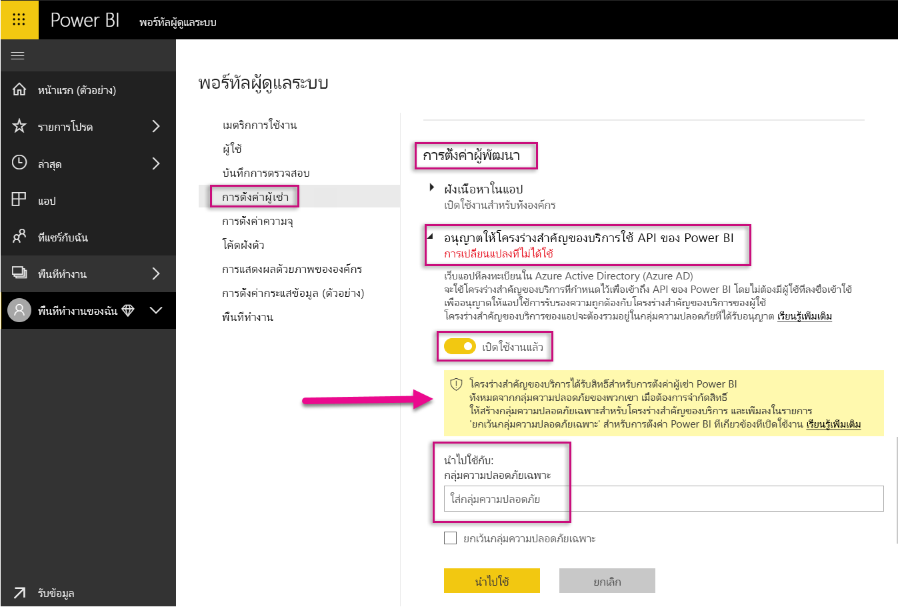
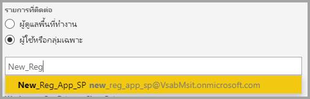
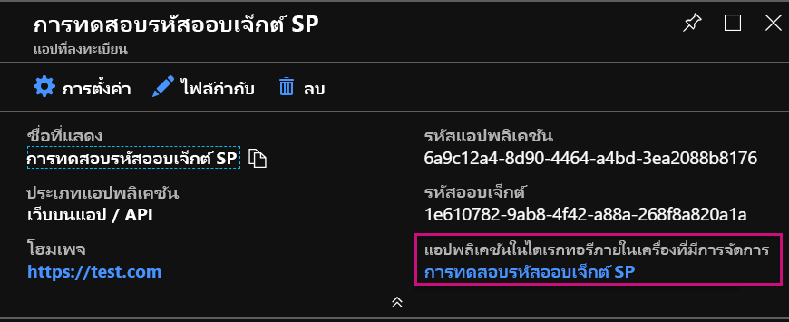
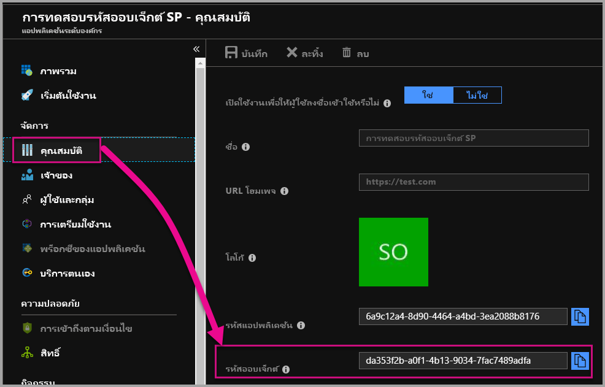

# <a name="service-principal-with-power-bi"></a>บริการหลักพร้อมด้วย Power BI

ด้วย**บริการหลัก**คุณสามารถฝังเนื้อหา Power BI ลงในแอปพลิเคชัน และใช้ระบบอัตโนมัติด้วย Power BI โดยใช้**โทเค็นเฉพาะแอป**ได้ บริการหลักเป็นประโยชน์เมื่อใช้**Power BI Embedded**หรือเมื่อ**ทำให้งานและกระบวนการ Power BI เป็นอัตโนมัติ**

เมื่อทำงานกับ Power BI Embedded มีประโยชน์เมื่อใช้บริการหลัก ประโยชน์หลักคือ คุณไม่จำเป็นต้องใช้บัญชีหลัก (ใบอนุญาต Power BI ที่จะเป็นเพียงแค่ชื่อผู้ใช้และรหัสผ่านสำหรับลงชื่อเข้าใช้) เพื่อรับรองความถูกต้องในแอปพลิเคชันของคุณ บริการหลักใช้ ID แอปพลิเคชันและข้อมูลลับของแอปพลิเคชันเพื่อรับรองความถูกต้องของแอปพลิเคชัน

หากต้องการทำให้ Power BI เป็นอัตโนมัติ คุณสามารถสคริปต์วิธีการประมวลผล และการจัดการบริการหลักเพื่อที่จะปรับขนาด

## <a name="application-and-service-principal-relationship"></a>ความสัมพันธ์ของแอปพลิเคชันและบริการหลัก

เมื่อต้องการเข้าถึงแหล่งข้อมูลที่รักษาความปลอดภัยของผู้เช่า Azure AD เอนทิตีที่จำเป็นต้องเข้าถึงจะแสดงหลักเกณฑ์ความปลอดภัย การดำเนินการนี้จะเป็นจริงสำหรับทั้งผู้ใช้ (ผู้ใช้หลัก) และแอปพลิเคชัน (บริการหลัก)

หลักเกณฑ์ความปลอดภัยจะกำหนดนโยบายการเข้าถึงและสิทธิ์สำหรับผู้ใช้และแอปพลิเคชันในผู้เช่า Azure AD นโยบายการเข้าถึงนี้จะเปิดใช้งานคุณลักษณะหลักเช่น การรับรองความถูกต้องของผู้ใช้และแอปพลิเคชันในระหว่างการลงชื่อเข้าใช้ และการรับรองความถูกต้องในระหว่างการเข้าถึงทรัพยากร สำหรับข้อมูลเพิ่มเติม อ้างอิง[แอปพลิเคชันและบริการหลักใน Azure Active Directory (AAD)](https://docs.microsoft.com/azure/active-directory/develop/app-objects-and-service-principals)

เมื่อคุณลงทะเบียนแอปพลิเคชัน Azure AD ในพอร์ทัล Azure จะมีสองออบเจ็กต์ถูกสร้างขึ้นในผู้เช่า Azure AD ของคุณ ได้แก่

* [ออบเจ็กต์แอปพลิเคชัน](https://docs.microsoft.com/azure/active-directory/develop/app-objects-and-service-principals#application-object)
* [ออบเจ็กต์บริการหลัก](https://docs.microsoft.com/azure/active-directory/develop/app-objects-and-service-principals#service-principal-object)

กำหนดให้ออบเจ็กต์แอปพลิเคชันเป็นงานการนำเสนอ*ทั่วไป*ของแอปพลิเคชันของคุณสำหรับการใช้ข้ามผู้เช่าทั้งหมด และออบเจ็กต์บริการหลักเป็นงานการนำเสนอ*เฉพาะ*สำหรับใช้ในผู้เช่าเฉพาะ

ออบเจ็กต์แอปพลิเคชันทำหน้าที่เป็นเทมเพลตจากที่คุณสมบัติทั่วไปและคุณสมบัติเริ่มต้น*ได้มา*สำหรับใช้ในการสร้างออบเจ็กต์บริการหลักที่สอดคล้องกัน

บริการหลักจำเป็นต้องมีสำหรับผู้เช่าที่มีใช้แอปพลิเคชัน ซึ่งช่วยให้สามารถสร้างข้อมูลประจำตัวสำหรับการเข้าสู่ระบบและการเข้าถึงแหล่งข้อมูลที่มีการรักษาความปลอดภัยโดยผู้เช่า แอปพลิเคชันผู้เช่าเดียวมีเพียงหนึ่งบริการหลัก (ในผู้เช่าหลักของแอปพลิเคชัน) สร้าง และอนุญาตให้ทำสำหรับใช้ระหว่างการลงทะเบียนแอปพลิเคชัน

## <a name="service-principal-with-power-bi-embedded"></a>บริการหลักพร้อมด้วย Power BI Embedded

ด้วยบริการหลัก คุณสามารถซ่อนดังกล่าวข้อมูลบัญชีหลักในแอปพลิเคชันของคุณโดยใช้ ID แอปพลิเคชันและข้อมูลลับของแอปพลิเคชัน คุณไม่จำเป็นต้องเข้ารหัสบัญชีหลักตายตัวในแอปพลิเคชันของคุณเพื่อรับรองความถูกต้อง

เนื่องจากขณะนี้**Power BI API**และ**Power BI .NET SDK**สนับสนุนการเรียกใช้บริการหลัก คุณสามารถใช้การ[Power BI REST API](https://docs.microsoft.com/rest/api/power-bi/)ด้วยบริการหลัก ตัวอย่าง คุณสามารถทำการเปลี่ยนแปลงพื้นที่ทำงานเช่น สร้างพื้นที่ทำงาน เพิ่ม หรือเอาผู้ใช้ออกจากพื้นที่ทำงาน และนำเข้าเนื้อหาลงในพื้นที่ทำงาน

คุณสามารถใช้บริการหลักเท่านั้นถ้าอาร์ทิแฟกต์ Power BI และแหล่งข้อมูลของคุณถูกเก็บไว้ใน[พื้นที่ทำงาน Power BI ใหม่](../service-create-the-new-workspaces.md)ได้

## <a name="service-principal-vs-master-account"></a>บริการหลักเทียบกับบัญชีหลัก

มีความแตกต่างระหว่างการใช้บริการหลักและบัญชีหลักมาตรฐาน (ใบอนุญาต Power BI Pro) สำหรับการรับรองความถูกต้อง ตารางด้านล่างเน้นความแตกต่างที่สำคัญบางอย่าง

| ฟังก์ชัน | บัญชีผู้ใช้หลัก <br> (ใบอนุญาต Power BI Pro) | บริการหลัก <br> (โทเค็นเฉพาะแอปเท่านั้น) |
|------------------------------------------------------|---------------------|-------------------|
| สามารถลงชื่อเข้าใช้บริการ Power BI  | ใช่ | ไม่ใช่ |
| เปิดใช้งานพอร์ทัลผู้ดูแลระบบของ Power BI แล้ว | ไม่ใช่ | ใช่ |
| [ทำงานร่วมกับพื้นที่ทำงาน (v1)](../service-create-workspaces.md) | ใช่ | ไม่ใช่ |
| [ทำงานร่วมกับพื้นที่ทำงานใหม่ (v2)](../service-create-the-new-workspaces.md) | ใช่ | ใช่ |
| ต้องเป็นผู้ดูแลระบบพื้นที่ทำงานถ้าใช้กับ Power BI Embedded | ใช่ | ใช่ |
| สามารถใช้ Power BI REST API | ใช่ | ใช่ |
| ต้องเป็นผู้ดูแลระบบส่วนกลางเพื่อสร้าง | ใช่ | ไม่ใช่ |
| สามารถติดตั้งและจัดการเกตเวย์ข้อมูลภายในองค์กร | ใช่ | ไม่ใช่ |

## <a name="get-started-with-a-service-principal"></a>เริ่มต้นใช้งานด้วยบริการหลัก

ใกล้เคียงกับการใช้บริการหลัก (โทเค็นเฉพาะแอป) จำเป็นต้องมีสองสามชิ้นแตกต่างกันเมื่อต้องตั้งค่า ซึ่งแตกต่างจากการใช้บัญชีหลักแบบดั้งเดิม เมื่อต้องเริ่มต้นใช้งานด้วยบริการหลัก (โทเค็นเฉพาะแอป) คุณต้องตั้งค่าสภาพแวดล้อมที่เหมาะสม

1. [ลงทะเบียนแอปพลิเคชันเว็บฝั่งเซิร์ฟเวอร์](register-app.md)ใน Azure Active Directory (AAD) เพื่อใช้กับ Power BI คุณสามารถจับภาพ ID แอปพลิเคชัน ข้อมูลลับของแอปพลิเคชัน และ ID ออบเจ็กต์หลักของบริการหลักเพื่อเข้าถึงเนื้อหา Power BI ของคุณหลังจากลงทะเบียนแอปพลิเคชัน คุณสามารถสร้างบริการหลักด้วย[PowerShell](https://docs.microsoft.com/powershell/azure/create-azure-service-principal-azureps?view=azps-1.1.0)ได้

    ด้านล่างนี้คือตัวอย่างสคริปต์ที่จะสร้างแอปพลิเคชัน Azure Active Directory ใหม่

    ```powershell
    # The app id - $app.appid
    # The service principal object id - $sp.objectId
    # The app key - $key.value

    # Sign in as a user that is allowed to create an app.
    Connect-AzureAD

    # Create a new AAD web application
    $app = New-AzureADApplication -DisplayName "testApp1" -Homepage "https://localhost:44322" -ReplyUrls "https://localhost:44322"

    # Creates a service principal
    $sp = New-AzureADServicePrincipal -AppId $app.AppId

    # Get the service principal key.
    $key = New-AzureADServicePrincipalPasswordCredential -ObjectId $sp.ObjectId
    ```

   > [!Important]
   > เมื่อคุณเปิดใช้งานบริการหลักที่จะใช้กับ Power BI สิทธิ์ AD ของแอปพลิเคชันไม่มีผลบังคับใช้อีกต่อไป มีจัดการสิทธิ์ของแอปพลิเคชันแล้วผ่านทางพอร์ทัลผู้ดูแลระบบ Power BI

2.  **แนะนำ** - สร้าง[กลุ่มความปลอดภัยใน Azure Active Directory (AAD)](https://docs.microsoft.com/azure/active-directory/fundamentals/active-directory-groups-create-azure-portal) และเพิ่มแอปพลิเคชันที่คุณสร้างในกลุ่มความปลอดภัยนั้น คุณสามารถสร้างกลุ่มความปลอดภัย AAD ด้วย[PowerShell](https://docs.microsoft.com/powershell/azure/create-azure-service-principal-azureps?view=azps-1.1.0)ได้

    ด้านล่างเป็นตัวอย่างสคริปต์ในการสร้างกลุ่มความปลอดภัยใหม่และเพิ่มแอปพลิเคชันในกลุ่มความปลอดภัยนั้น

    ```powershell
    # Required to sign in as a tenant admin
    Connect-AzureAD

    # Create an AAD security group
    $group = New-AzureADGroup -DisplayName <Group display name> -SecurityEnabled $true -MailEnabled $false -MailNickName notSet

    # Add the service principal to the group
    Add-AzureADGroupMember -ObjectId $($group.ObjectId) -RefObjectId $($sp.ObjectId)
    ```

3. ในฐานะผู้ดูแลระบบ Power BI คุณจำเป็นต้องเปิดใช้งานบริการหลักใน**การตั้งค่านักพัฒนา**ในพอร์ทัลผู้ดูแลระบบ Power BI เพิ่มกลุ่มความปลอดภัยที่คุณสร้างใน Azure AD สำหรับส่วนกลุ่มความปลอดภัยเฉพาะใน**การตั้งค่านักพัฒนา** คุณยังสามารถเปิดใช้สิทธิ์การเข้าถึงโครงร่างสำคัญของบริการสำหรับทั้งองค์กร ในกรณีดังกล่าว ขั้นตอนที่ 2 ไม่จำเป็น

   > [!Important]
   > โครงร่างสำคัญของบริการสามารถเข้าถึงการตั้งค่าผู้เช่าที่เปิดใช้งานสำหรับทั้งองค์กร หรือเปิดใช้งานสำหรับกลุ่มความปลอดภัยที่มีโครงร่างสำคัญของบริการเป็นส่วนหนึ่งของกลุ่ม เมื่อต้องจำกัดการเข้าถึงโครงร่างสำคัญของบริการไปยังการตั้งค่าผู้เช่าเฉพาะ อนุญาตให้เข้าถึงกลุ่มความปลอดภัยเฉพาะเท่านั้น หรือสร้างกลุ่มความปลอดภัยเฉพาะสำหรับโครงร่างสำคัญของบริการและแยกมันออก

    

4. ตั้งค่า[สภาพแวดล้อม Power BI](embed-sample-for-customers.md#set-up-your-power-bi-environment)ุ ของคุณ

5. เพิ่มบริการหลักเป็น**ผู้ดูแลระบบ**ในพื้นที่ทำงานใหม่ที่คุณสร้างขึ้น คุณสามารถจัดการงานนี้ผ่าน[API](https://docs.microsoft.com/rest/api/power-bi/groups/addgroupuser)หรือด้วยบริการของ Power BI ได้

    

6. ในตอนนี้ เลือกเพื่อฝังเนื้อหาของคุณภายในแอปพลิเคชันตัวอย่าง หรือภายในแอปพลิเคชันของคุณเอง

    * [ฝังเนื้อหาโดยใช้แอปพลิเคชันตัวอย่าง](embed-sample-for-customers.md#embed-content-using-the-sample-application)
    * [ฝังเนื้อหาภายในแอปพลิเคชันของคุณ](embed-sample-for-customers.md#embed-content-within-your-application)

7. ในตอนนี้คุณพร้อมที่จะ[ย้ายไปยังการผลิต](embed-sample-for-customers.md#move-to-production)แล้ว

## <a name="migrate-to-service-principal"></a>โยกย้ายไปยังบริการหลัก

คุณสามารถโยกย้ายไปใช้บริการหลักถ้าคุณกำลังใช้บัญชีหลักที่มี Power BI หรือ Power BI Embedded

ทำตามสามขั้นตอนแรกในส่วน[เริ่มต้นใช้งานด้วยบริการหลัก ](#get-started-with-a-service-principal)และเมื่อเสร็จสมบูรณ์ ทำตามข้อมูลด้านล่าง

ถ้าคุณใช้งานอยู่ใน[พื้นที่ทำงานใหม่](../service-create-the-new-workspaces.md)ใน Power BI แล้ว เพิ่มบริการหลักเป็น**ผู้ดูแลระบบ** ในพื้นที่ทำงานด้วยอาร์ทิแฟกต์ Power BI ของคุณ อย่างไรก็ตาม ถ้าคุณกำลังใช้[พื้นที่ทำงานแบบดั้งเดิม](../service-create-workspaces.md) คัดลอก หรือย้ายออบเจ็กต์ Power BI และแหล่งข้อมูลของคุณไปยังพื้นที่ทำงานใหม่ และจากนั้นเพิ่มบริการหลักเป็น**ผู้ดูแลระบบ**ในพื้นที่ทำงานเหล่านั้น

ไม่มีคุณลักษณะ UI ที่จะย้ายอาร์ทิแฟกต์ Power BI และแหล่งข้อมูลจากพื้นที่ทำงานหนึ่งไปอีกที่หนึ่ง ดังนั้นคุณจำเป็นต้องใช้[API](https://powerbi.microsoft.com/pt-br/blog/duplicate-workspaces-using-the-power-bi-rest-apis-a-step-by-step-tutorial/)ในการทำงานนี้ เมื่อใช้ API ด้วยบริการหลัก คุณจำเป็นต้องมี ID ออบเจ็กต์ของบริการหลัก

### <a name="how-to-get-the-service-principal-object-id"></a>วิธีการขอรับ ID ออบเจ็กต์ของบริการหลัก

เมื่อต้องการกำหนดบริการหลักสำหรับพื้นที่ทำงานใหม่ คุณต้องใช้[Power BI REST API](https://docs.microsoft.com/rest/api/power-bi/groups/addgroupuser) เมื่อต้องการอ้างอิงบริการหลักสำหรับการดำเนินการ หรือทำการเปลี่ยนแปลงที่คุณใช้ **ID ออบเจ็กต์ของบริการหลัก**— เช่น การใช้บริการหลักเป็นผู้ดูแลระบบในพื้นที่ทำงาน

ด้านล่างนี้คือขั้นตอนการขอรับ ID ออบเจ็กต์ของบริการหลักจากพอร์ทัล Azure

1. สร้างการลงทะเบียนแอปใหม่ในพอร์ทัล Azure  

2. จากนั้นภายใต้**แอปพลิเคชันที่ได้รับการจัดการในไดเรกทอรีภายในเครื่อง** เลือกชื่อของแอปพลิเคชันที่คุณสร้างขึ้น

   

    > [!Note]
    > Id ออบเจ็กต์ในรูปด้านบนไม่ใช่ออบเจ็กต์ที่ใช้กับบริการหลัก

3. เลือก**คุณสมบัติ**เพื่อดู ID ของออบเจ็กต์

    

ด้านล่างคือตัวอย่างสคริปต์ที่จะเรียกใช้ ID ออบเจ็กต์ของบริการหลักด้วย PowerShell

   ```powershell
   Get-AzureADServicePrincipal -Filter "DisplayName eq '<application name>'"
   ```

## <a name="considerations-and-limitations"></a>ข้อควรพิจารณาและข้อจำกัด

* บริการหลักจะทำงานร่วมกับ[พื้นที่ทำงานใหม่](../service-create-the-new-workspaces.md)เท่านั้น
* **ความจุเฉพาะของฉัน** ไม่ได้รับการสนับสนุนเมื่อใช้บริการหลัก
* ต้องใช้ความจุเฉพาะเมื่อย้ายไปยังการผลิต
* คุณไม่สามารถลงชื่อเข้าใช้พอร์ทัล Power BI ด้วยบริการหลัก
* คุณจำเป็นต้องมีสิทธิ์ของผู้ดูแลระบบ Power BI เพื่อเปิดใช้งานบริการหลักในการตั้งค่านักพัฒนาภายในพอร์ทัลผู้ดูแลระบบของ Power BI
* คุณไม่สามารถติดตั้ง หรือจัดการเกตเวย์ข้อมูลภายในองค์กรโดยใช้บริการหลัก
* แอปพลิเคชัน[แบบฝังตัวสำหรับองค์กรของคุณ](embed-sample-for-your-organization.md)ไม่สามารถใช้บริการหลักได้
* [Dataflows](../service-dataflows-overview.md) การจัดการไม่ได้รับการสนับสนุน
* ปัจจุบัน โครงร่างสำคัญของบริการไม่สนับสนุนผู้ดูแลระบบ APIs

## <a name="next-steps"></a>ขั้นตอนถัดไป

* [ลงทะเบียนแอป](register-app.md)
* [Power BI Embedded สำหรับลูกค้าของคุณ](embed-sample-for-customers.md)
* [แอปพลิเคชันและออบเจ็กต์บริการหลักใน Azure Active Directory](https://docs.microsoft.com/azure/active-directory/develop/app-objects-and-service-principals)
* [ความปลอดภัยระดับแถวโดยใช้เกตเวย์ข้อมูลภายในองค์กรที่มีโครงร่างสำคัญของบริการ](embedded-row-level-security.md#on-premises-data-gateway-with-service-principal)
