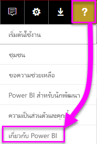
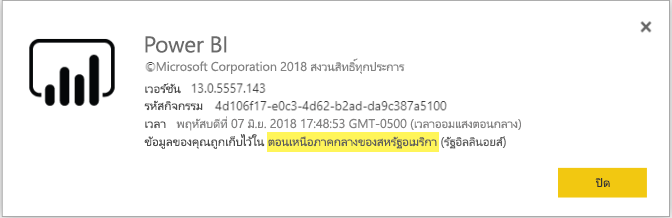

# <a name="frequently-asked-questions-about-power-bi-embedded"></a>คำถามที่ถามบ่อยเกี่ยวกับ Power BI Embedded

* ถ้าคุณมีคำถามอื่น [ลองถามชุมชน Power BI](http://community.powerbi.com/)
* ยังคงมีปัญหาใช่หรือไม่? โปรดเยี่ยมชม[หน้าการสนับสนุน Power BI](https://powerbi.microsoft.com/support/)

## <a name="general"></a>ทั่วไป

### <a name="what-is-power-bi-embedded"></a>Power BI Embedded คืออะไร?

Microsoft Power BI Embedded (PBIE) อนุญาตให้นักพัฒนาแอปพลิเคชันฝังและโต้ตอบได้อย่างน่าทึ่ง ลงในแอปพลิเคชัน โดยไม่ต้องเสียเวลาและค่าใช้จ่ายพัฒนาการแสดงภาพและการควบคุมของตัวเองใหม่ทั้งหมด

### <a name="who-is-the-target-audience-for-power-bi-embedded"></a>ใครคือกลุ่มเป้าหมายสำหรับ Power BI Embedded?

นักพัฒนาและบริษัทซอฟต์แวร์ ที่สร้างแอปพลิเคชันของตนเองที่เรียกกันว่า ผู้จัดจำหน่ายซอฟต์แวร์อิสระ (ISV)

### <a name="how-is-power-bi-embedded-different-from-power-bi-the-service"></a>Power BI Embedded แตกต่างจากบริการของ Power BI อย่างไร?

Power BI Embedded มีไว้สำหรับ ISV หรือนักพัฒนาที่กำลังสร้างแอปพลิเคชัน และต้องการฝังวิชวลลงในแอปพลิเคชันเหล่านั้น เพื่อช่วยให้ลูกค้าของพวกเขาตัดสินใจโดยไม่ต้องการสร้างโซลูชันการวิเคราะห์ขึ้นมาใหม่ทั้งหมด การฝังตัวการวิเคราะห์ ช่วยให้ผู้ใช้ทางธุรกิจเข้าถึงข้อมูลธุรกิจ และดำเนิการนคิวรี เพื่อสร้างข้อมูลเชิงลึกด้วยข้อมูลนี้ภายในแอปพลิเคชัน

Power BI คือโซลูชันการให้บริการซอฟต์แวร์การวิเคราะห์ ที่ช่วยให้องค์กรของพวกเขามีภาพเดียวกันสำหรับข้อมูลทางธุรกิจที่สำคัญที่สุดของพวกเขา

### <a name="what-is-the-difference-between-power-bi-premium-and-power-bi-embedded"></a>อะไรคือความแตกต่างระหว่าง Power BI Premium และ Power BI Embedded?

Power BI Premium มีความจุที่ปรับให้เหมาะกับองค์กร ที่ต้องการโซลูชัน BI ที่สมบูรณ์ ที่ให้มุมมองเดียวกันแก่ หน่วยงาน คู่ค้า ลูกค้า และผู้จัดหาสินค้าขององค์กร Power BI Premium ช่วยให้องค์กรของคุณตัดสินใจ Power BI Premium เป็นผลิตภัณฑ์ SaaS ที่ให้ผู้ใช้สามารถบริโภคเนื้อหาผ่านทางพอร์ทัล Power BI แอปสำหรับอุปกรณ์เคลื่อนที่ และผ่านแอปที่พัฒนาขึ้นเองภายใน

Power BI Embedded มีไว้สำหรับ ISV หรือนักพัฒนาที่กำลังสร้างแอปพลิเคชัน และต้องการฝังวิชวลลงในแอปพลิเคชันเหล่านั้น Power BI Embedded ช่วยการตัดสินใจของลูกค้าคุณ เนื่องจาก Power BI Embedded ออกแบบมาสำหรับนักพัฒนาแอปพลิเคชัน ลูกค้าของแอปพลิเคชันนั้นสามารถใช้เนื้อหาที่เก็บไว้ในความจุของ Power BI Embedded รวมไปถึงทุกคนภายใน หรือภายนอกองค์กร เนื้อหาที่บรรจุใน Power BI Embedded ไม่สามารถแชร์ผ่านการ แสดงผลเว็บด่วน หรือแสดงผลด่วนไปยัง SharePoint และจะไม่สนับสนุนรายงาน SSRS

### <a name="what-is-the-microsoft-recommendation-for-when-a-customer-should-buy-power-bi-premium-vs-power-bi-embedded"></a>Microsoft จะแนะนำลูกค้าอย่างไร ว่าเมื่อไรที่ลูกค้าควรซื้อ Power BI Embedded และเมื่อไรที่ควรซื้อ Power BI Premium?

คำแนะนำของ Microsoft คือ องค์กรซื้อ Power BI Premium ซึ่งเป็นโซลูชัน BI บนระบบคลาวด์ ระดับองค์กร แบบบริการตนเอง และ ISV ซื้อ Power BI Embedded ซึ่งเป็นคอมโพเนนต์การวิเคราะห์แบบฝังตัวที่ทำงานด้วยคลาวด์ อย่างไรก็ตาม ไม่มีข้อจำกัดว่าลูกค้าสามารถซื้อผลิตภัณฑ์ใดได้บ้าง

อาจมีบางกรณีที่ ISV (มักมีขนาดใหญ่) ต้องการใช้ P SKU เพื่อรับประโยชน์เพิ่มเติมของบริการ Power BI ที่รวมให้อยู่แล้ว ภายในองค์กรของพวกเขา ตลอดจนการฝังตัวในแอปพลิเคชันของพวกเขา บางองค์กรอาจตัดสินใจที่จะใช้ A SKU ใน Azure หากพวกเขาสนใจเฉพาะการสร้างแอปพลิเคชันทางธุรกิจ และการฝังการวิเคราะห์ลงไป และไม่สนใจที่จะใช้บริการ Power BI ที่รวมให้อยู่แล้ว

### <a name="how-many-embed-tokens-can-i-create"></a>ฉันสามารถสร้างโทเค็นฝังตัวได้มากแค่ไหน?

เนื่องจากโทเค็นฝังตัวด้วยสิทธิ์การใช้งาน PRO มีไว้สำหรับการพัฒนาและการทดสอบ จึงจำกัดจำนวนโทเค็นฝังตัวของบัญชีหลัก Power BI ที่สามารถสร้างขึ้นได้ คุณต้อง[ซื้อความจุ](#technical)สำหรับการฝังตัวในสภาพแวดล้อมการทำงานจริง ไม่มีข้อจำกัดเกี่ยวกับจำนวนโทเค็นฝังตัวที่คุณสามารถสร้างขึ้นเมื่อซื้อความจุแล้ว ไปยัง[คุณลักษณะที่มี](https://docs.microsoft.com/rest/api/power-bi/availablefeatures) เพื่อตรวจสอบค่าการใช้งาน ที่สามารถบอกได้ว่าปัจจุบันมีการใช้งานฝังตัวแล้วกี่เปอร์เซ็นต์

## <a name="technical"></a>ทางเทคนิค

### <a name="what-is-the-difference-between-the-a-skus-in-azure-and-the-em-skus-in-office-365"></a>อะไรคือความแตกต่างระหว่าง A SKU ใน Azure และ EM SKU ใน Office 365

PowerBI.com เป็นโซลูชันระดับองค์กรที่มีความสามารถมากมายเช่น การทำงานร่วมกันทางสังคม การสมัครอีเมล ฯลฯ ในรูปของ SaaS

Power BI Embedded คือ ชุดของ API ที่มีให้กับนักพัฒนา เพื่อสร้างโซลูชันการวิเคราะห์แบบฝังตัวในรูปของ Platform as a Service สำหรับสถานการณ์การฝังตัวการวิเคราะห์ PowerBI.com ช่วย ISV และนักพัฒนาจัดการโซลูชันการฝังตัวการวิเคราะห์ และตั้งค่าในระดับผู้เช่า

ต่อไปนี้เป็นความแตกต่างบางส่วน ที่คุณอาจใช้งานแต่ละผลิตภัณฑ์

| ลักษณะการทำงาน | Power BI Embedded | ความจุ Power BI Premium | ความจุ Power BI Premium |
|----------------------------------------------------------------------------------|-------------------|---------------------------|---------------------------|
|   | (A SKU) | (EM SKUs) | (P SKUs) |
| ฝังวัตถุจากพื้นที่ทำงานแอป Power BI | ความจุ Azure | ความจุ Office 365 | ความจุ Office 365 |
| ใช้รายงาน Power BI ในแอปพลิเคชันแบบฝังตัว | ใช่ | ใช่ | ใช่ |
| ใช้รายงาน Power BI ใน SharePoint | ไม่ใช่ | ใช่ | ใช่ |
| ใช้รายงาน Power BI ใน Dynamics | ไม่ใช่ | ใช่ | ใช่ |
| ใช้รายงาน Power BI ใน Teams (ไม่รวมแอปสำหรับอุปกรณ์เคลื่อนที่) | ไม่ใช่ | ใช่ | ใช่ |
| เข้าถึงเนื้อหาที่มีใบอนุญาต Power BI ฟรีใน Powerbi.com และ Power BI mobile | ไม่ใช่ | ไม่ใช่ | ใช่ |
| เข้าถึงเนื้อหาด้วยสิทธิ์การใช้งาน Power BI ฟรีที่ฝังในแอป MS Office | ไม่ใช่ | ใช่ | ใช่ |

### <a name="power-bi-now-offers-three-skus-for-embedding-a-skus-em-skus-and-p-skus-which-one-should-i-purchase-for-my-scenario"></a>Power BI ในตอนนี้มี SKU สามตัวสำหรับการฝังตัว: A SKU, EM SKU และ P SKU ฉันควรซื้อแบบไหนสำหรับสถานการณ์ของฉัน?

|  |A SKU (Power BI Embedded)  |EM SKU (Power BI Premium)  |P SKU (Power BI Premium)  |
|---------|---------|---------|---------|
|การซื้อ  |พอร์ทัล Azure |Office |Office |
|ใช้กรณี | ฝังเนื้อหาในแอปพลิเคชันของคุณเอง | <li> ฝังเนื้อหาในแอปพลิเคชันของคุณเอง <br><br></br> <li> ฝังเนื้อหาในแอปพลิเคชัน MS Office: <br> - [SharePoint](https://powerbi.microsoft.com/blog/integrate-power-bi-reports-in-sharepoint-online/) <br> - [ทีม (ไม่รวมแอปสำหรับอุปกรณ์เคลื่อนที่)](https://powerbi.microsoft.com/blog/power-bi-teams-up-with-microsoft-teams/) <br> - [Dynamics 365](https://docs.microsoft.com/dynamics365/customer-engagement/basics/add-edit-power-bi-visualizations-dashboard) | <li> ฝังเนื้อหาในแอปพลิเคชันของคุณเอง <br><br></br> <li> ฝังเนื้อหาในแอปพลิเคชัน MS Office: <br> - [SharePoint](https://powerbi.microsoft.com/blog/integrate-power-bi-reports-in-sharepoint-online/) <br> - [ทีม (ไม่รวมแอปสำหรับอุปกรณ์เคลื่อนที่)](https://powerbi.microsoft.com/blog/power-bi-teams-up-with-microsoft-teams/) <br> - [Dynamics 365](https://docs.microsoft.com/dynamics365/customer-engagement/basics/add-edit-power-bi-visualizations-dashboard) <br><br></br> <li> แชร์เนื้อหากับผู้ใช้ Power BI ผ่าน [บริการ Power BI](https://powerbi.microsoft.com/en-us/)  |
|การเรียกเก็บเงิน |รายชั่วโมง |รายเดือน |รายเดือน |
|ข้อผูกมัด  |ไม่มีข้อผูกมัด |รายปี  |รายเดือน/รายปี |
|ความแตกต่าง |มีความยือหยุ่มเต็มที่ - สามารถสเกลขึ้น/ลง, หยุด/ทำงานต่อ ทรัพยากรในพอร์ทัล Azure หรือผ่าน API  |สามารถใช้เพื่อฝังเนื้อหาใน SharePoint Online และ Microsoft Teams ได้ (ไม่รวมแอปสำหรับอุปกรณ์เคลื่อนที่) |รวมการฝังในแอปพลิเคชัน และการใช้บริการของ Power BI ในความจุเดียวกัน |

### <a name="what-are-the-prerequisites-to-create-a-pbie-capacity-in-azure"></a>ข้อกำหนดเบื้องต้นเพื่อสร้างความจุ PBIE ใน Azure คืออะไร?

* คุณจำเป็นต้องลงชื่อเข้าใช้ไดเรกทอรีขององค์กรของคุณ (บัญชีผู้ใช้ MSA จะไม่ได้รับการสนับสนุน)
* คุณจำเป็นต้องมีผู้เช่า Power BI อย่างน้อยหนึ่งคนในไดเรกทอรีของคุณลงทะเบียนกับ Power BI 
* คุณต้องมีการสมัครใช้งาน Azure ในไดเรกทอรีขององค์กรของคุณ

### <a name="how-can-i-monitor-power-bi-embedded-capacity-consumption"></a>ฉันสามารถตรวจสอบปริมาณการใช้ความจุของ Power BI Embedded ได้อย่างไร

* ใช้[พอร์ทัลผู้ดูแลระบบ Power BI](../service-admin-portal.md#power-bi-embedded)

* ดาวน์โหลด[แอปเมตริก](https://review.docs.microsoft.com/power-bi/service-admin-premium-monitor-capacity)ใน Power BI

* ใช้[การบันทึกการวินิจฉัย Azure](azure-pbie-diag-logs.md)

### <a name="will-my-capacity-scale-automatically-to-adjust-to-the-consumption-of-my-app"></a>ความจุของฉันจะปรับตามปริมาณการใช้แอปของฉันได้ตามอัตโนมัติหรือไม่?

ขณะนี้ยังไม่มีการ scale โดยอัตโนมัติ แต่ APIs ทั้งหมดสามารถ scale ได้ทุกเวลา

### <a name="why-creatingscalingresuming-a-capacity-results-in-putting-the-capacity-into-a-suspended-state"></a>ทำไม การสร้าง/ปรับขนาด/กลับมาใช้ความจุทำให้ความจุอยู่ในสถานะถูกระงับชั่วคราว?

การจัดความจุ (ปรับขนาด/กลับมาใช้/สร้าง) อาจล้มเหลว ผู้เรียกการจัดควรตรวจสอบ ProvisioningState ของความจุโดยใช้ รับรายละเอียด API: [ความจุ - รับรายละเอียด](https://docs.microsoft.com/rest/api/power-bi-embedded/capacities/getdetails)

### <a name="can-i-only-create-power-bi-embedded-capacities-in-a-specific-region"></a>ฉันสามารถสร้างความจุแบบฝังตัวของ Power BI ในพื้นที่เฉพาะได้หรือไม่

ด้วยคุณลักษณะ[หลายภูมิศาสตร์ (ตัวอย่าง)](embedded-multi-geo.md) คุณสามารถซื้อ[ความจุแบบฝังตัวของ Power BI](azure-pbie-create-capacity.md) ในภูมิภาคอื่นนอกจากตำแหน่งที่ตั้งหลักของผู้เช่า Power BI ของคุณ

### <a name="how-can-i-find-what-is-my-pbi-tenant-region"></a>ฉันสามารถค้นหาภูมิภาคผู้เช่า PBI ของฉันได้อย่างไร?

คุณสามารถใช้พอร์ทัล PBI เพื่อทำความเข้าใจว่าภูมิภาคผู้เช่า PBI ของคุณคืออะไร

[https://app.powerbi.com/](https://app.powerbi.com/) > ? เกี่ยวกับ Power BI




### <a name="what-is-supported-with-the-cloud-solution-provider-csp-channel"></a>สิ่งที่ได้รับการสนับสนุนจาก Cloud Solution Provide (CSP) คืออะไร?

* คุณสามารถสร้าง PBIE ให้ผู้เช่าของคุณด้วยการสมัครใช้งานชนิด CSP
* บัญชีคู่ค้าสามารถลงชื่อเข้าใช้ในนามผู้เช่าของลูกค้า และซื้อ PBIE สำหรับผู้เช่าของลูกค้า กำหนดให้ผู้ใช้ที่เป็นผู้เช่าของลูกค้าเป็นผู้ดูแลความจุ Power BI

### <a name="why-do-i-get-an-unsupported-account-message"></a>เหตุใดฉันจึงได้รับข้อความว่า เป็นบัญชีที่ไม่สนับสนุน

Power BI ให้คุณต้องลงทะเบียนด้วยบัญชีผู้ใช้ขององค์กร ไม่รองรับการลงทะเบียน Power BI โดยใช้ MSA (บัญชี Microsoft)

### <a name="can-i-use-apis-to-create--manage-azure-capacities"></a>ฉันสามารถใช้ Api สร้างและจัดการความจุ Azure ได้หรือไม่?

มีทั้ง Powershell cmdlets และ Azure Resource Manager APIs ที่คุณสามารถใช้สร้างและจัดการทรัพยากร PBIE

* Rest APIs - https://docs.microsoft.com/rest/api/power-bi-embedded/
* cmdlets ของ Powershell - https://docs.microsoft.com/powershell/module/azurerm.powerbiembedded/

### <a name="what-is-the-pbi-embedded-dedicated-capacity-role-in-a-pbi-embedded-solution"></a>บทบาทความจุเฉพาะของ PBI ฝังตัว ในโซลูชัน PBI ฝังตัวคืออะไร?

หากต้องการ [โปรโมตโซลูชันของคุณไปยังการผลิต](https://docs.microsoft.com/power-bi/developer/embedding-content#step-3-promote-your-solution-to-production) คุณต้องมีเนื้อหา Power BI (พื้นที่ทำงานของแอปที่คุณใช้ในแอปพลิเคชันของคุณเพื่อกำหนดความจุ Power BI Embedded (A SKU)

### <a name="what-are-the-azure-regions-pbi-embedded-is-available"></a>PBI ฝังตัวของภูมิภาค Azure มีอะไรบ้าง?

[PAM](https://ecosystemmanager.azurewebsites.net/home) (EcoManager) - ดูตัวจัดการความพร้อมใช้งานผลิตภัณฑ์

ภูมิภาคที่พร้อมใช้งาน (16 - ภูมิภาคเดียวกันกับ Power BI)

* สหรัฐอเมริกา (6) - สหรัฐอเมริกาตะวันออก สหรัฐอเมริกาตะวันออก 2 สหรัฐอเมริกากลางเหนือ สหรัฐอเมริกากลางใต้สหรัฐอเมริกาตะวันตก สหรัฐอเมริกาตะวันตก 2
* ยุโรป (2) - ยุโรปเหนือ ยุโรปตะวันตก
* เอเชียแปซิฟิก (2) - เอเชียตะวันออกเฉียงใต้ เอเชียตะวันออก
* บราซิล (1) - บราซิลใต้
* ญี่ปุ่น (1) - ญี่ปุ่นตะวันออก
* ออสเตรเลีย (1) - ออสเตรเลียตะวันออกเฉียงใต้
* อินเดีย (1) - อินเดียตะวันตก
* แคนาดา (1) - กลางแคนาดา
* สหราชอาณาจักร (1) - สหราชอาณาจักรใต้

### <a name="what-is-the-authentication-model-for-power-bi-embedded"></a>อะไรคือรูปแบบการรับรองความถูกต้องสำหรับ Power BI Embedded?

Power BI Embedded ยังคงใช้ Azure AD สำหรับการรับรองความถูกต้องของผู้ใช้หลัก (ผู้ใช้ Power BI Pro ที่ได้รับการกำหนดสิทธิ์) และการรับรองความถูกต้องแอปพลิเคชันภายใน Power BI

การรับรองความถูกต้องและการอนุญาตของผู้ใช้แอปพลิเคชัน จะพัฒนาโดย ISV โดยที่ ISV สามารถสร้างการรับรองความถูกต้องของตนเองสำหรับแอปพลิเคชันของพวกเขา

ถ้าคุณมีผู้เช่า Azure AD อยู่แล้ว คุณสามารถใช้ไดเรกทอรีที่มีอยู่ หรือสร้างผู้เช่า Azure AD ใหม่สำหรับความปลอดภัยของเนื้อหาในแอปพลิเคชันแบบฝังตัว

เพื่อรับโทเค็น AAD คุณสามารถใช้หนึ่งใน Azure Active Directory Authentication Library - https://docs.microsoft.com/azure/active-directory/develop/active-directory-authentication-libraries ไลบรารีเหล่านี้เป็นไลบรารีไคลเอ็นต์ ที่พร้อมใช้งานบนหลายแพลตฟอร์ม

### <a name="my-application-already-uses-aad-for-user-authentication-how-can-we-use-this-identity-when-authenticating-to-power-bi-in-an-user-owns-data-scenario"></a>แอปพลิเคชันของฉันใช้ AAD สำหรับการรับรองความถูกต้องผู้ใช้แล้ว เราสามารถใช้ข้อมูลประจำตัวนี้เมื่อรับรองความถูกต้องไปยัง Power BI ในสถานการณ์ "ผู้ใช้เป็นเจ้าของข้อมูล" ได้อย่างไร?

OAuth เป็นแบบมาตรฐานสำหรับการรับส่ง (https://docs.microsoft.com/azure/active-directory/develop/active-directory-authentication-scenarios#web-application-to-web-api) แอปพลิเคชันต้องได้รับการกำหนดค่าให้มีสิทธิ์ในการให้บริการ BI (มีขอบเขตที่จำเป็น) และเมื่อคุณมีโทเค็นผู้ใช้ไปยังแอปพลิเคชันของคุณ ADAL API AcquireTokenAsync จะใช้โทเค็นการเข้าถึงของผู้ใช้และระบุ URL ทรัพยากร BI เป็นรหัสทรัพยากร ดูตัวอย่างโค้ดที่แสดงวิธีการนี้ด้านล่าง:

```csharp
var context = new AD.AuthenticationContext(authorityUrl);
var userAssertion = new AD.UserAssertion(userAccessToken);
var clientAssertion = new AD.ClientAssertionCertificate(MyAppId, MyAppCertificate)
var authenticationResult = await context.AcquireTokenAsync(resourceId, clientAssertion, userAssertion);
```

### <a name="how-is-power-bi-embedded-different-from-other-azure-services"></a>Power BI Embedded แตกต่างจากบริการอื่น ๆ ของ Azure อย่างไร?

ISV/นักพัฒนาต้องมีบัญชี Power BI ก่อนที่จะซื้อ Power BI Embedded ใน Azure ภูมิภาคการปรับใช้งาน Power BI Embedded ของคุณถูกกำหนดโดยบัญชี Power BI ของคุณ จัดการทรัพยากร Power BI Embedded ของคุณใน Azure เพื่อ:

* Scale up/down
* เพิ่มผู้ดูแลความจุ
* หยุดบริการ/ทำงานต่อ

ใช้ PowerBI.com เพื่อกำหนด/ยกเลิก การกำหนดพื้นที่ทำงานให้กับความจุ Power BI Embedded ของคุณ

### <a name="what-deploy-regions-are-supported"></a>ภูมิภาคใดที่ได้รับการสนับสนุน?

Australia Southeast, Brazil South, Canada Central, East US 2, India West, Japan East, North Central US, North Europe, South Central US, Southeast Asia, UK South, West Europe, West US และ West US 2

### <a name="what-type-of-content-pack-data-can-be-embedded"></a>ข้อมูลชุดเนื้อหาชนิดใดบ้างที่สามารถฝังตัวได้?

**แดชบอร์ด**และ**ไทล์**ที่สร้างจากชุดข้อมูลชุดเนื้อหา*ไม่สามารถ*ฝังตัวได้ แต่**รายงาน**ซึ่งสร้างขึ้นจากชุดข้อมูลชุดเนื้อหา*สามารถ*ฝังตัวได้

### <a name="what-is-the-difference-between-using-rls-vs-javascript-filters"></a>อะไรคือความแตกต่างระหว่างการใช้ RLS เปรียบเทียบกับ ตัวกรอง JavaScript?

ผู้ใช้มักเกิดความสับสนเมื่อต้องใช้ RLS เปรียบเทียบกับ ตัวกรอง JavaScript สาเหตุเพราะวิธีหนึ่งเน้นควบคุมการมองเห็นของผู้ใช้ที่ถูกระบุเฉพาะ และอีกอันหนึ่งเน้นเกี่ยวกับการปรับมุมมองของผู้ใช้ให้เหมาะสม

สำหรับ RLS นักพัฒนา ISV ควบคุมกรองให้เป็นส่วนหนึ่งของการสร้างแบบจำลองข้อมูล และสร้างโทเค็นฝังตัว ดังนั้นผู้ใช้งานปลายทางจึงจะได้เห็นข้อมูลเฉพาะสิ่งที่ ISV อนุญาตให้เห็นเท่านั้น ในกรณีนี้ ผู้ใช้สามารถเลือกดูข้อมูลที่อยู่ภายใต้สิ่งที่ถูกกรองมาแล้วเท่านั้น แต่จะไม่ได้รับอนุญาตหรือไม่สามารถดูข้อมูลที่อยู่นอกเหนือการกำหนดค่าโดย RLS ได้

สำหรับฝั่งลูกค้าการกรอง (JavaScript), ISV อาจตัดสินใจว่า ผู้ใช้ปลายทางควรเห็นอะไรตั้งแต่เริ่มต้นการดูข้อมูล แต่ ISV ไม่สามารถควบคุมการเปลี่ยนแปลงที่ผู้ใช้ปลายทางอาจนำไปใช้กับมุมมองเอง แม้ว่าการกรองข้อมูลสามารถเกิดขึ้นได้ในส่วนของ backend แต่การกรองข้อมูลจะไม่สามารถทำได้หากไม่มีการสั่งการมาจากโค้ด JavaScript ของลูกค้า ดังนั้นลูกค้าปลายทางจะสามารถเปลี่ยนแปลงได้ซึ่งไม่ปลอดภัย

อ้างอิงข้อมูลเพิ่มเติมเกี่ยวกับ[RLS กับตัวกรอง JavaScript](embedded-row-level-security.md#using-rls-vs-javascript-filters)

### <a name="what-are-the-best-practices-to-improve-performance"></a>อะไรคือแนวทางปฏิบัติที่ดีที่สุดเพื่อปรับปรุงประสิทธิภาพการทำงาน?

[ประสิทธิภาพการทำงานของ Power BI Embedded](embedded-performance-best-practices.md)

## <a name="licensing"></a>สิทธิ์การใช้งาน

### <a name="how-do-i-purchase-power-bi-embedded"></a>ฉันซื้อ Power BI Embedded ได้อย่างไร

Power BI Embedded มีให้ผ่านทาง Azure

### <a name="what-happens-if-i-already-purchased-power-bi-premium-and-now-i-want-some-of-the-benefits-of-power-bi-embedded-in-azure"></a>เกิดอะไรขึ้นถ้าฉันซื้อ Power BI Premium แล้ว และตอนนี้ฉันต้องการคุณสมบัติบางประการของ Power BI Embedded ใน Azure

ลูกค้าจะยังคงต้องชำระเงินสำหรับการซื้อ Power BI Premium ใด ๆ ที่มีอยู่ จนกว่าจะถึงจุดสิ้นสุตตามข้อตกลงปัจจุบัน จากนั้นก็สามารถเปลี่ยนการซื้อ Power BI Premium ตามความจำเป็นเมื่อถึงเวลานั้น

### <a name="do-i-still-have-to-buy-power-bi-premium-to-get-access-to-power-bi-embedded"></a>ฉันยังต้องซื้อ Power BI Premium เพื่อเข้าถึง Power BI Embedded หรือไม่?

ไม่ Power BI Embedded รวมความจุ Azure ที่คุณต้องปรับใช้ และแจกจ่ายโซลูชันของคุณไปยังลูกค้า

### <a name="whats-the-purchase-commitment-for-power-bi-embedded"></a>อะไรคือข้อผูกมัดการซื้อสำหรับ Power BI Embedded?

ลูกค้าอาจเปลี่ยนแปลงการใช้งานของพวกเขาเป็นรายชั่วโมง ไม่มีข้อผูกมัดรายเดือน หรือรายปี สำหรับบริการ Power BI Embedded

### <a name="how-does-the-usage-of-power-bi-embedded-show-up-on-my-bill"></a>ปริมาณการใช้ Power BI Embedded แสดงขึ้นมาบนใบเรียกเก็บเงินของฉันได้อย่างไร?

Power BI Embedded เรียกเก็บเงินตามอัตรารายชั่วโมง ขึ้นกับชนิดของโหนดที่ปรับใช้ ตราบใดที่ทรัพยากรของคุณยังเปิดใช้งาน คุณจะถูกเรียกเก็บเงินแม้ว่าจะไม่มีการใช้งานก็ตาม เพื่อหยุดการเรียกเก็บเงิน คุณต้องหยุดทรัพยากรของคุณชั่วคราว

### <a name="who-needs-a-power-bi-pro-license-for-power-bi-embedded-and-why"></a>ใครต้องมีสิทธิ์การใช้งาน Power BI Pro สำหรับ Power BI Embedded และทำไม?

นักวิเคราะห์ใด ๆ ที่จำเป็นต้องเพิ่มรายงานไปยังพื้นที่ทำงาน Power BI จำเป็นต้องมีสิทธิ์การใช้งาน Power BI นักพัฒนาใด ๆ ที่จำเป็นต้องใช้ REST APIs ต้องมีสิทธิ์การใช้งาน Power BI Pro ผู้ดูแลระบบผู้เช่าใด ๆ ที่จำเป็นต้องจัดการผู้เช่า Power BI และความจุจำเป็นต้องมีสิทธิ์การใช้งาน Power BI Pro

เนื่องจาก Power BI Embedded อนุญาตให้ใช้ พอร์ทัล Power BI สำหรับการจัดการ และตรวจสอบเนื้อหาแบบฝังตัว สิทธิ์การใช้งาน Power BI Pro เป็นสิ่งจำเป็นเพื่อรับรองความถูกต้องแอปภายใน PowerBI.com เพื่อเข้าถึงรายงานในเก็บข้อมูลที่ถูกต้อง

อย่างไรก็ตาม สำหรับ[สร้าง/แก้ไขรายงานที่ฝังตัว](https://github.com/Microsoft/PowerBI-JavaScript/wiki/Create-Report-in-Embed-View)ภายในของแอปพลิเคชันของคุณ ผู้ใช้ปลายทางไม่จำเป็นต้องมีสิทธิ์การใช้งาน Pro เนื่องจากผู้ใช้ไม่ต้องเป็นผู้ใช้ Power BI

### <a name="can-i-get-started-for-free"></a>ฉันสามารถเริ่มต้นใช้งานฟรีได้หรือไม่?

ได้ คุณสามารถใช้[เครดิต Azure](https://azure.microsoft.com/free/) ของคุณสำหรับ Power BI Embedded ได้

### <a name="can-i-get-a-trial-experience-for-power-bi-embedded-in-azure"></a>ฉันสามารถทดลองใช้ Power BI Embedded ใน Azure ได้หรือไม่?

เนื่องจาก Power BI Embedded เป็นส่วนหนึ่งของ Azure คุณสามารถใช้บริการด้วย[เครดิตจำนวน 200 ดอลลาร์สหรัฐฯ ที่คุณได้รับตอนลงทะเบียนสำหรับ Azure](https://azure.microsoft.com/free/)

### <a name="is-power-bi-embedded-available-for-sovereign-clouds-us-government-germany-china"></a>Power BI Embedded มีสำหรับ sovereign cloud (รัฐบาลสหรัฐ, เยอรมนี, จีน) หรือไม่?

Power BI Embedded พร้อมใช้งานสำหรับบาง [sovereign cloud](embed-sample-for-customers-sovereign-clouds.md) ยัง**ไม่**พร้อมใช้งานสำหรับคลาวด์ประเทศจีน

### <a name="is-power-bi-embedded-available-for-non-profits-and-educational"></a>Power BI Embedded มีให้สำหรับองค์กรไม่แสวงหากำไร และสถานศึกษาหรือไม่?

องค์กรที่ไม่แสวงหากำไร และสถานศึกษาสามารถซื้อ Azure ได้ ไม่มีราคาพิเศษสำหรับลูกค้า Azure ชนิดเหล่านี้

## <a name="power-bi-workspace-collection"></a>คอลเลกชันพื้นที่ทำงาน Power BI

### <a name="what-is-power-bi-workspace-collection"></a>คอลเลกชันพื้นที่ทำงาน Power BI คืออะไร?

**คอลเลกชันพื้นที่ทำงาน Power BI** (**Power BI Embedded**รุ่น 1) เป็นโซลูชันที่มาจาก**คอลเลกชันพื้นที่ทำงานของ Power BI** ของทรัพยากร Azure โซลูชันนี้ช่วยให้คุณสามารถสร้างแอปพลิเคชัน **Power BI Embedded** สำหรับลูกค้าของคุณโดยใช้เนื้อหา Power BI ภายใต้ โซลูชัน**Power BI Workspace Collection** API เฉพาะและคอลเลกชันคีย์พื้นที่ทำงานเพื่อตรวจสอบสิทธิ์แอ็พพลิเคชันกับ Power BI

### <a name="can-i-migrate-from-power-bi-workspace-collection-to-power-bi-embedded"></a>ฉันสามารถย้ายจากคอลเลกชันพื้นที่ทำงาน Power BI ไปยัง Power BI Embedded ได้หรือไม่?

1. คุณสามารถใช้เครื่องมือการย้ายเพื่อโคลนเนื้อหา**คอลเลกชันพื้นที่ทำงานของ Power BI** ไปยัง Power BI - https://docs.microsoft.com/power-bi/developer/migrate-from-powerbi-embedded#content-migration ได้

2. เริ่มต้นด้วยแอปพลิเคชัน POC **Power BI Embedded** ที่ใช้เนื้อหา Power BI

3. เมื่อคุณพร้อมสำหรับการใช้งานจริง ซื้อความจุเฉพาะของ **Power BI Embedded** และกำหนดเนื้อหา Power BI (พื้นที่ทำงาน) ของคุณลงในความจุนั้น

    > [!Note]
    > คุณยังสามารถใช้**คอลเลกชันพื้นที่ทำงานของ Power BI** ต่อ ขณะที่สร้างโซลูชัน **Power BI Embedded** ไปพร้อม ๆ กันได้ เมื่อคุณพร้อม คุณสามารถย้ายลูกค้าของคุณไปยังโซลูชัน **Power BI Embedded** ใหม่ และถอนโซลูชัน**คอลเลกชันพื้นที่ทำงานของ Power BI** ได้

สำหรับข้อมูลเพิ่มเติม โปรดอ้างอิง[วิธีการย้ายเนื้อหาคอลเลกชันพื้นที่ทำงานของ Power BI ไปยัง Power BI Embedded](https://docs.microsoft.com/power-bi/developer/migrate-from-powerbi-embedded)

### <a name="is-power-bi-workspace-collection-on-a-path-to-be-deprecated"></a>คอลเลกชันพื้นที่ทำงานของ Power BI อยู่ในเส้นทางที่จะยกเลิกการสนับสนุนหรือไม่?

ใช่ แต่ลูกค้าที่กำลังใช้โซลูชัน**คอลเลกชันพื้นที่ทำงานของ Power BI** อยู่ สามารถใช้ได้จนกว่าจะถูกยกเลิก ลูกค้ายังสามารถสร้างคอลเลกชันพื้นที่ทำงานใหม่ และสร้างแอปพลิเคชัน **Power BI Embedded** ที่ยังใช้โซลูชัน**คอลเลกชันพื้นที่ทำงานของ Power BI** ได้

แต่นั่นหมายความว่า คุณลักษณะใหม่จะไม่ถูกเพิ่มไปยังโซลูชัน**คอลเลกชันพื้นที่ทำงานของ Power BI** และลูกค้าจะได้รับการแนะนำให้วางแผนการย้ายไปยังโซลูชัน **Power BI Embedded** ใหม่

### <a name="when-is-power-bi-workspace-collection-support-discontinued"></a>เมื่อไรที่คอลเลกชันพื้นที่ทำงาน Power BI จะยกเลิกการสนับสนุน?

ลูกค้าที่กำลังใช้โซลูชัน**คอลเลกชันพื้นที่ทำงาน Power BI** อยู่ สามารถใช้งานต่อจนถึงปลายเดือนมิถุนายน 2018 หรือจนถึงจุดสิ้นสุดของข้อตกลงการสนับสนุนของพวกเขา

### <a name="in-what-regions-can-pbi-workspace-collection-be-created"></a>ในภูมิภาคใดที่สามารถสร้างคอลเลกชันพื้นที่ทำงาน PBI ได้?

ภูมิภาคที่มี ได้แก่ Australia Southeast, Brazil South, Canada Central, East US 2, Japan East, North Central US, North Europe, South Central US, Southeast Asia, UK South, West Europe, West India และ West US

### <a name="why-should-i-migrate-from-pbi-workspace-collection-to-power-bi-embedded"></a>ทำไมฉันถึงต้องย้ายจากคอลเลกชันพื้นที่ทำงาน PBI ไปยัง Power BI Embedded?

มีคุณลักษณะและความสามารถใหม่ ที่นำมาใช้ในโซลูชัน **Power BI Embedded** ที่คุณไม่สามารถทำได้ด้วย**คอลเลกชันพื้นที่ทำงานของ Power BI**

ตัวอย่างของคุณลักษณะ ได้แก่:

* แหล่งข้อมูล PBI ทั้งหมดได้รับการสนับสนุน แทนที่จะเป็นแหล่งข้อมูล 2 แหล่งที่มีใน **คอลเลกชันพื้นที่ทำงานของ Power BI**) 
* คุณลักษณะใหม่ ๆ เช่น Q&A การรีเฟรชบุ๊กมาร์ก การฝังหน้าแดชบอร์ดและเมนูแบบกำหนดเอง และเมนูที่กำหนดเองจะได้รับการสนับสนุนเฉพาะในโซลูชัน **Power BI Embedded**
* รูปแบบการเรียกเก็บเงินตามความจุ

## <a name="embedding-setup-tool"></a>เครื่องมือตั้งค่าการฝังตัว

### <a name="what-is-the-embedding-setup-tool"></a>อะไรคือเครื่องมือตั้งค่าการฝังตัว

[เครื่องมือตั้งค่าการฝังตัว](https://aka.ms/embedsetup) ช่วยให้คุณสามารถเริ่มต้นใช้งานได้อย่างรวดเร็ว และดาวน์โหลดแอปพลิเคชันตัวอย่างเพื่อเริ่มต้นการฝังตัวด้วย Power BI

### <a name="which-solution-should-i-choose"></a>ฉันควรจะเลือกโซลูชันใด?

* [การฝังตัวสำหรับลูกค้าของคุณ](embedding.md#embedding-for-your-customers) จะมอบความสามารถในการฝังแดชบอร์ดและรายงานสำหรับผู้ใช้ที่ไม่มีบัญชี Power BI เรียกใช้โซลูชัน[การฝังตัวสำหรับลูกค้าของคุณ](https://aka.ms/embedsetup/AppOwnsData)
* [การฝังตัวสำหรับองค์กรของคุณ](embedding.md#embedding-for-your-organization) ให้คุณสามารถขยายบริการของ Power BI เรียกใช้โซลูชัน[การฝังตัวสำหรับองค์กรของคุณ](https://aka.ms/embedsetup/UserOwnsData)

### <a name="ive-downloaded-the-sample-app-which-solution-do-i-choose"></a>ฉันได้ดาวน์โหลดแอปตัวอย่างแล้ว ฉันควรจะเลือกโซลูชันใด?

ถ้าคุณกำลังทำงานกับประสบการณ์**ฝังตัวสำหรับลูกค้าของคุณ** บันทึกและคลายการบีบอัดไฟล์ *PowerBI-Developer-Samples.zip* จากนั้น เปิดโฟลเดอร์ *PowerBI-Developer-Samples-master\App Owns Data* และเรียกใช้ไฟล์ *PowerBIEmbedded_AppOwnsData.sln*

ถ้าคุณกำลังทำงานกับประสบการณ์**ฝังตัวสำหรับองค์กรของคุณ** บันทึกและคลายการบีบอัดไฟล์ *PowerBI-Developer-Samples.zip* จากนั้น เปิดโฟลเดอร์ *PowerBI-Developer-Samples-master\User Owns Data\integrate-report-web-app* และเรียกใช้ไฟล์ *pbi-saas-embed-report.sln*

### <a name="how-can-i-edit-my-registered-application"></a>ฉันสามารถแก้ไขแอปพลิเคชันของฉันที่ลงทะเบียนแล้วได้อย่างไร?

คุณสามารถเรียนรู้วิธีการแก้ไขแอปพลิเคชัน AAD ที่ลงทะเบียนแล้ว[ที่นี่](https://docs.microsoft.com/azure/active-directory/develop/active-directory-integrating-applications#updating-an-application)

### <a name="how-can-i-edit-my-power-bi-user-profile-or-data"></a>ฉันสามารถแก้ไขโปรไฟล์หรือข้อมูลผู้ใช้ Power BI ของฉันได้อย่างไร?

คุณสามารถเรียนรู้วิธีการแก้ไขข้อมูล Power BI ของคุณได้[ที่นี่](https://docs.microsoft.com/power-bi/service-basic-concepts)

สำหรับข้อมูลเพิ่มเติม ดู[การแก้ไขปัญหาแอปพลิเคชันแบบฝังตัวของคุณ](embedded-troubleshoot.md)

มีคำถามเพิ่มเติมหรือไม่? [ลองไปที่ชุมชน Power BI](http://community.powerbi.com/)