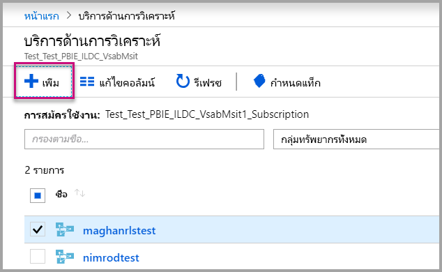
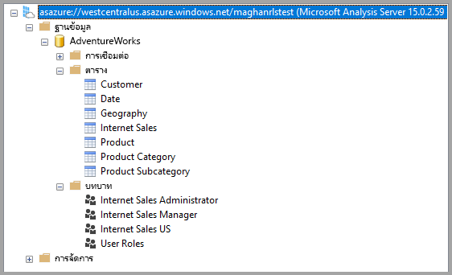
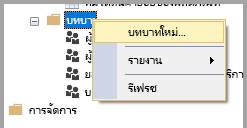
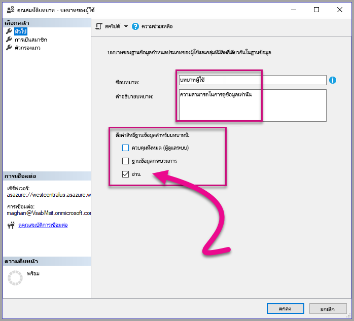
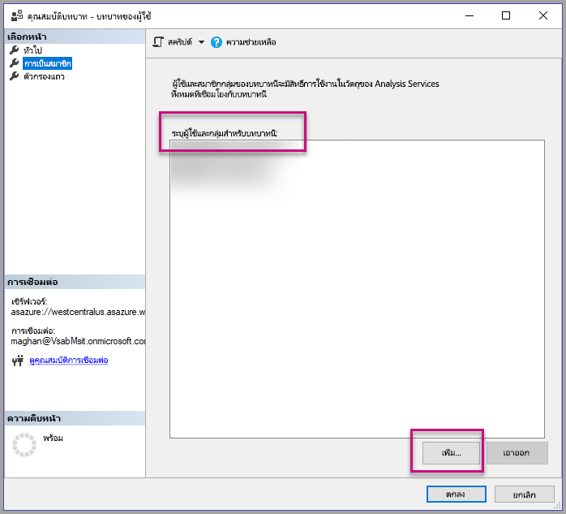
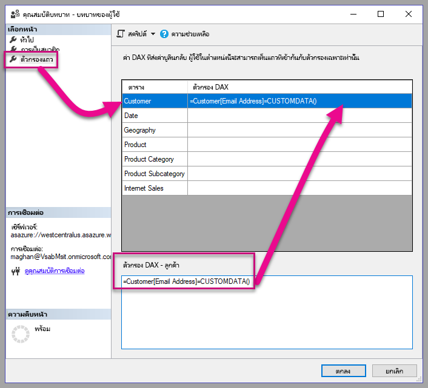
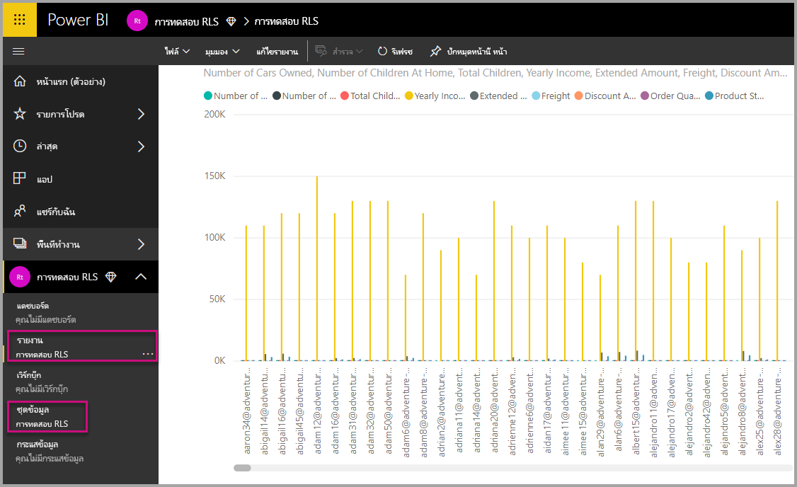
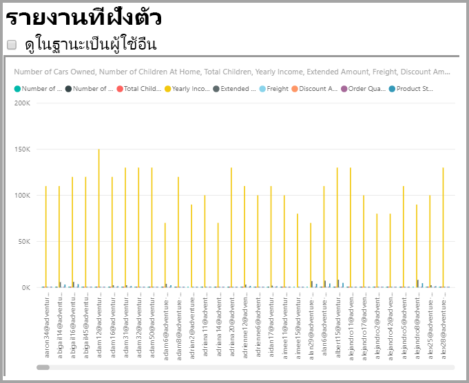
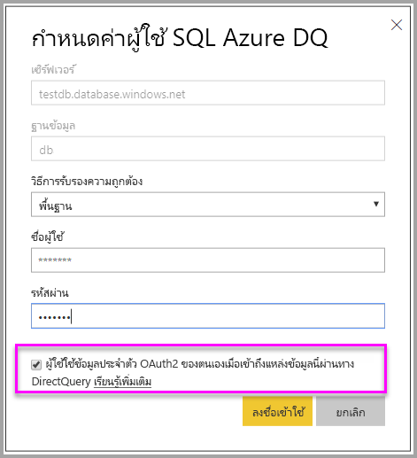
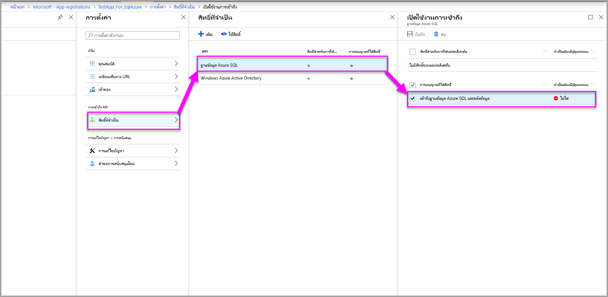

# <a name="row-level-security-with-power-bi-embedded"></a>การรักษาความปลอดภัยระดับแถวด้วย Power BI Embedded

**การรักษาความปลอดภัยระดับแถว (RLS)** สามารถใช้เพื่อจำกัดการเข้าถึงข้อมูลภายในแดชบอร์ด ไทล์ รายงาน และชุดข้อมูลของผู้ใช้ ผู้ใช้ที่แตกต่างกันสามารถทำงานกับวัตถุเดียวกันทั้งหมดเหล่านั้นในขณะที่ดูข้อมูลที่แตกต่างกันได้ การฝัง RLS ที่สนับสนุน

ถ้าคุณกำลังฝังสำหรับผู้ใช้ที่ไม่ใช่ผู้ใช้ Power BI (แอปเป็นเจ้าของข้อมูล) ซึ่งโดยปกติคือสถานการณ์ ISV บทความนี้เหมาะสำหรับคุณ กำหนดค่าโทเค็นแบบฝังลงในบัญชีสำหรับผู้ใช้และบทบาท

ถ้าคุณกำลังฝังสำหรับผู้ใช้ Power BI (ผู้ใช้เป็นเจ้าของข้อมูล) ภายในองค์กรของคุณ RLS จะทำงานแบบเดียวกับที่ทำงานในบริการ Power BI โดยตรง คุณไม่จำเป็นต้องทำอะไรเพิ่มเติมในแอปพลิเคชันอีก สำหรับข้อมูลเพิ่มเติม โปรดดู[การรักษาความปลอดภัยระดับแถว (RLS) ด้วย Power BI](../service-admin-rls.md)


เป็นสิ่งสำคัญที่คุณจะต้องทำความเข้าใจแนวคิดหลักสามแนวคิด ซึ่งได้แก่ ผู้ใช้ บทบาท และกฎเพื่อใช้ประโยชน์จาก RLS มาดูรายละเอียดของแต่ละแนวคิดกัน:

**ผู้ใช้**– ผู้ใช้ปลายทางดูอาร์ทิแฟกต์ (แดชบอร์ด ไทล์ รายงาน หรือชุดข้อมูล) ใน Power BI Embedded ผู้ใช้จะถูกระบุโดยพร็อพเพอร์ตี้ชื่อผู้ใช้ในโทเค็นที่ฝัง

**บทบาท** – ผู้ใช้จะมีสิทธิ์ตามบทบาท บทบาทเป็นคอนเทนเนอร์สำหรับกฎและสามารถตั้งชื่อ เช่น *ผู้จัดการฝ่ายขาย*หรือ*พนักงานขาย*ได้ คุณสร้างบทบาทภายใน Power BI Desktop สำหรับข้อมูลเพิ่มเติม โปรดดู[การรักษาความปลอดภัยระดับแถว (RLS) ด้วย Power BI Desktop](../desktop-rls.md)

**กฎ** – บทบาทจะมีกฎ และกฎเหล่านั้นคือตัวกรองจริงที่กำลังจะถูกนำไปใช้กับข้อมูลนั้น กฏอาจจะเป็นคำง่ายๆ เช่น "ประเทศ =สหรัฐอเมริกา" หรือคำที่เป็นแบบไดนามิกมากขึ้น
สำหรับส่วนที่เหลือของบทความนี้ มีตัวอย่างของการเขียน RLS และการใช้งาน RLS ภายในแอปพลิเคชันแบบฝังตัว ตัวอย่างของเราใช้ไฟล์ PBIX [ตัวอย่างการวิเคราะห์ด้านการขายปลีก](http://go.microsoft.com/fwlink/?LinkID=780547)


## <a name="adding-roles-with-power-bi-desktop"></a>การเพิ่มบทบาทด้วย Power BI Desktop

**ตัวอย่างการวิเคราะห์ด้านการขายปลีก**ของเราแสดงยอดขายสำหรับร้านค้าทั้งหมดในกลุ่มร้านค้าปลีก หากไม่มี RLS ผู้จัดการสาขาทุกคนที่ลงชื่อเข้าใช้และดูรายงานจะเห็นข้อมูลเดียวกัน ผู้จัดการอาวุโสที่ได้กำหนดผู้จัดการเขตแต่ละรายแล้วควรจะเห็นยอดขายสำหรับการร้านค้าที่พวกเขาจัดการเท่านั้น ใช้ RLS ในการอนุญาตให้ผู้จัดการอาวุโสสามารถจำกัดฐานข้อมูลได้ตามผู้จัดการเขต

RLS ถูกเขียนใน Power BI Desktop เมื่อเปิดชุดข้อมูลและรายงาน เราจะสามารถสลับไปยังมุมมองไดอะแกรมเพื่อดู Schema ได้:


นี่คือบางสิ่งบางอย่างที่ควรสังเกตสำหรับ Schema นี้:

* หน่วยวัดทั้งหมด เช่น **ยอดขายรวม** จะเก็บไว้ในตาราง**ยอดขาย**จริง
* มีตารางมิติที่เกี่ยวข้องเพิ่มเติมสี่ตาราง: **รายการ** **เวลา** **ร้านค้า** และ**เขต**
* ลูกศรบนเส้นของความสัมพันธ์จะระบุวิธีที่ตัวกรองดำเนินการจากตารางหนึ่งไปอีกตาราง ตัวอย่างเช่น ถ้าตัวกรองถูกใช้กับ**เวลา[วันที่]** ใน Schema ปัจจุบัน ตัวกรองนี้จะกรองค่าในตาราง**ยอดขาย**เท่านั้น ตารางอื่นๆ จะไม่ได้รับผลกระทบจากตัวกรองนี้เนื่องจากลูกศรทั้งหมดในเส้นของความสัมพันธ์ชี้ไปยังตารางยอดขายเท่านั้น
* ตาราง**สาขา**จะบ่งชี้ว่าใครเป็นผู้จัดการแต่ละสาขา:
  
    

ตาม schema นี้ ถ้าเราใช้ตัวกรองกับคอลัมน์**ผู้จัดการเขต**ในตาราง**เขต** และถ้าตัวกรองนั้นตรงกับผู้ใช้ที่ดูรายงาน ตัวกรองนั้นจะกรองตาราง**ร้านค้า**และ**ยอดขาย**เพื่อแสดงข้อมูลสำหรับผู้จัดการเขตคนนั้น

ต่อไปนี้คือวิธีการ:

1. บนแท็บ**การวางรูปแบบ** ให้เลือก**จัดการบทบาท**

    
2. สร้างบทบาทใหม่ที่ชื่อว่า**ผู้จัดการ**

    
3. ในตาราง**สาขา** ให้ใส่นิพจน์ DAX: **[ผู้จัดการสาขา] = ชื่อผู้ใช้()**

    
4. ถ้าต้องการตรวจสอบให้แน่ใจว่ากฎกำลังทำงานอย่างถูกต้อง บนแท็บ**การวางรูปแบบ** ให้เลือก**มุมมองบทบาท** แล้วเลือกทั้งบทบาท**ผู้จัดการ**ที่คุณสร้างและ**ผู้ใช้อื่นๆ** ใส่ **AndrewMa**เป็นผู้ใช้

    

    รายงานจะแสดงข้อมูลเหมือนกับว่าคุณได้ลงชื่อเข้าใช้ในฐานะ **AndrewMa**

การใช้ตัวกรองอย่างที่เราได้ทำที่นี่ จะกรองระเบียนทั้งหมดในตาราง**เขต**, **ร้าน** และ**ยอดขาย** อย่างไรก็ตาม เนื่องจากทิศทางของตัวกรองกับความสัมพันธ์ระหว่าง**ยอดขาย**และ**เวลา** จะไม่มีการกรองตาราง**ยอดขาย**และ**สินค้า**และ**สินค้า**และ**เวลา** เมื่อต้องการเรียนรู้เพิ่มเติมเกี่ยวกับการกรองสองทิศทางแบบไขว้ โปรดดาวน์โหลดเอกสารทางเทคนิคเรื่อง[การกรองสองทิศทางแบบไขว้ใน SQL Server Analysis Services 2016 และ Power BI Desktop](http://download.microsoft.com/download/2/7/8/2782DF95-3E0D-40CD-BFC8-749A2882E109/Bidirectional%20cross-filtering%20in%20Analysis%20Services%202016%20and%20Power%20BI.docx)

## <a name="applying-user-and-role-to-an-embed-token"></a>การนำผู้ใช้และบทบาทไปใช้กับโทเค็นที่ฝัง

หลังจากที่คุณกำหนดค่าบทบาท Power BI Desktop แล้ว คุณจำเป็นต้องทำงานบางอย่างในแอปพลิเคชันเพื่อใช้ประโยชน์จากบทบาท

ผู้ใช้จะได้รับการรับรองความถูกต้องและได้รับอนุญาตโดยแอปพลิเคชัน และโทเค็นที่ฝังจะถูกใช้เพื่ออนุญาตให้ผู้ใช้รายนั้นเข้าถึงรายงาน Power BI Embedded ที่เฉพาะเจาะจง Power BI Embedded ไม่มีข้อมูลที่ระบุได้ว่าผู้ใช้ของคุณคือใคร คุณจำเป็นต้องส่งบริบทเพิ่มเติมบางอย่างเป็นส่วนหนึ่งของโทเค็นที่ฝังในรูปแบบข้อมูลประจำตัวเพื่อให้ RLS ทำงาน คุณสามารถส่งข้อมูลประจำตัว โดยใช้[โทเค็นที่ฝัง](https://docs.microsoft.com/rest/api/power-bi/embedtoken)API ได้

API รับรายการของข้อมูลประจำตัว ที่ระบุชุดข้อมูลที่เกี่ยวข้อง เพื่อให้ RLS ทำงานได้ คุณจำเป็นต้องส่งข้อมูลด้านล่างนี้เพื่อให้เป็นส่วนหนึ่งของข้อมูลประจำตัว

* **ชื่อผู้ใช้ (จำเป็น)** – สตริงที่สามารถใช้เพื่อช่วยในการระบุตัวตนผู้ใช้เมื่อนำกฎ RLS ไปใช้ ผู้ใช้รายเดียวเท่านั้นที่สามารถอยู่ในรายการได้ ชื่อผู้ใช้ของคุณสามารถใช้อักขระ *ASCII* ได้
* **บทบาท (จำเป็น)** – สตริงที่ประกอบด้วยบทบาทที่เลือกเมื่อนำกฎการรักษาความปลอดภัยระดับแถวไปใช้ ถ้าส่งบทบาทมากกว่าหนึ่งรายการ คุณควรส่งเป็นอาร์เรย์แบบสตริง
* **ชุดข้อมูล (จำเป็น)** – ชุดข้อมูลที่สามารถใช้ได้กับวัตถุที่คุณจะฝัง

คุณสามารถสร้างโทเค็นที่ฝังได้โดยใช้เมธอด **GenerateTokenInGroup** บน **PowerBIClient.Reports**

ตัวอย่างเช่น คุณสามารถเปลี่ยนตัวอย่าง [PowerBIEmbedded_AppOwnsData](https://github.com/Microsoft/PowerBI-Developer-Samples/tree/master/App%20Owns%20Data) ได้ *Services\EmbedService.cs บรรทัด 76 และ 77*สามารถอัปเดตจาก:

```csharp
// Generate Embed Token.
var generateTokenRequestParameters = new GenerateTokenRequest(accessLevel: "view");

var tokenResponse = await client.Reports.GenerateTokenInGroupAsync(GroupId, report.Id, generateTokenRequestParameters);
```

ถึง

```csharp
var generateTokenRequestParameters = new GenerateTokenRequest("View", null, identities: new List<EffectiveIdentity> { new EffectiveIdentity(username: "username", roles: new List<string> { "roleA", "roleB" }, datasets: new List<string> { "datasetId" }) });

var tokenResponse = await client.Reports.GenerateTokenInGroupAsync("groupId", "reportId", generateTokenRequestParameters);
```

ถ้าคุณกำลังเรียกใช้ REST API แล้ว ตอนนี้ API ที่อัปเดตจะยอมรับอาร์เรย์ JSON เพิ่มเติม รวมถึง**ข้อมูลประจำตัว**ที่มีชื่อที่ประกอบด้วยชื่อผู้ใช้ รายการบทบาทสตริง และรายการชุดข้อมูลสตริง 

ใช้รหัสด้านล่างต่อไปนี้เป็นตัวอย่าง:

```json
{
    "accessLevel": "View",
    "identities": [
        {
            "username": "EffectiveIdentity",
            "roles": [ "Role1", "Role2" ],
            "datasets": [ "fe0a1aeb-f6a4-4b27-a2d3-b5df3bb28bdc" ]
        }
    ]
}
```

ตอนนี้เมื่อมีส่วนประกอบทั้งหมดแล้ว เมื่อมีคนเข้าสู่ระบบแอปพลิเคชันของคุณเพื่อดูวัตถุนี้ พวกเขาจะสามารถดูข้อมูลที่ได้รับอนุญาตให้ดูเท่านั้นตามที่กำหนดไว้โดยการรักษาความปลอดภัยระดับแถวของเรา

## <a name="working-with-analysis-services-live-connections"></a>การทำงานกับการเชื่อมต่อแบบสดของ Analysis Services

การรักษาความปลอดภัยระดับแถวสามารถใช้กับการเชื่อมต่อแบบสดของ Analysis Services สำหรับเซิร์ฟเวอร์ภายในองค์กร มีแนวคิดเฉพาะบางอย่างที่คุณควรทำความเข้าใจเมื่อใช้การเชื่อมต่อประเภทนี้

ข้อมูลประจำตัวที่มีผลบังคับใช้ที่ระบุไว้สำหรับพร็อพเพอร์ตี้ชื่อผู้ใช้จะต้องเป็นผู้ใช้ Windows ที่มีสิทธิ์บนเซิร์ฟเวอร์ Analysis Services

### <a name="on-premises-data-gateway-configuration"></a>การกำหนดค่าเกตเวย์ข้อมูลภายในองค์กร

[เกตเวย์ข้อมูลภายในองค์กร](../service-gateway-onprem.md)จะถูกใช้เมื่อทำงานกับการเชื่อมต่อแบบสดของ Analysis Services เมื่อสร้างโทเค็นที่ฝังด้วยข้อมูลประจำตัวที่อยู่ในรายการ บัญชีผู้ใช้หลักจำเป็นต้องอยู่ในรายการในฐานะผู้ดูแลระบบเกตเวย์ ถ้าบัญชีผู้ใช้หลักไม่ได้อยู่ในรายการ จะไม่ใช้ความปลอดภัยระดับแถวกับคุณสมบัติของข้อมูล ผู้ใช้ที่ไม่ใช่ผู้ดูแลระบบเกตเวย์สามารถระบุบทบาทได้ แต่ต้องระบุชื่อผู้ใช้ของตนเองสำหรับข้อมูลประจำตัวที่มีผลบังคับใช้

### <a name="use-of-roles"></a>ใช้บทบาท

สามารถกำหนดบทบาทด้วยข้อมูลประจำตัวในโทเค็นฝังตัว ถ้าไม่มีการระบุบทบาท สามารถใช้ชื่อผู้ใช้ที่ระบุพื่อแก้ไขปัญหาบทบาทเกี่ยวข้อง

### <a name="using-the-customdata-feature"></a>ใช้ฟีเจอร์ CustomData

ฟีเจอร์ CustomData จะทำงานสำหรับแบบจำลองที่อยู่ใน **Azure Analysis Services** เท่านั้นและจะทำงานเฉพาะในโหมด**ถ่ายทอดสด** คุณลักษณะข้อมูลแบบกำหนดเองไม่สามารถตั้งค่าภายในไฟล์ .pbix ได้ซึ่งต่างจากผู้ใช้และบทบาท เมื่อสร้างโทเค็นด้วยคุณลักษณะข้อมูลแบบกำหนดเอง คุณต้องมีชื่อผู้ใช้

ฟีเจอร์ CustomData อนุญาตให้คุณเพิ่มตัวกรองแถวเมื่อดูข้อมูล Power BI ในแอปพลิเคชันของคุณเมื่อใช้**Azure Analysis Services**เป็นแหล่งข้อมูลของคุณ (ดูข้อมูล Power BI ที่เชื่อมต่อกับ Azure Analysis Services ในแอปพลิเคชันของคุณ ).

ฟีเจอร์ CustomData อนุญาตให้ส่งข้อความอิสระ (สตริง) โดยใช้พร็อพเพอร์ตี้สตริงการเชื่อมต่อ CustomData Analysis Services ใช้ค่านี้ผ่านการฟังก์ชัน*CUSTOMDATA()*

วิธีเดียวที่จะมี RLS แบบไดนามิกได้ (ซึ่งใช้การประเมินค่าไดนามิกตัวกรอง) ใน**Azure Analysis Services**คือต้องใช้ฟังก์ชัน*CUSTOMDATA()*

คุณสามารถใช้ภายในคิวรี DAX บทบาท และคุณสามารถใช้ได้โดยไม่ต้องมีบทบาทใดๆ ในคิวรี DAX หน่วยวัด
ฟีเจอร์ CustomData เป็นส่วนหนึ่งของฟังก์ชันการสร้างโทเค็นสำหรับวัตถุต่อไปนี้: แดชบอร์ด รายงาน และไทล์ แดชบอร์ดสามารถมีข้อมูลประจำตัว CustomData ได้หลายรายการ (1 รายการต่อไทล์/แบบจำลอง)

#### <a name="customdata-sdk-additions"></a>การเพิ่ม CustomData SDK

พร็อพเพอร์ตี้สตริง CustomData ถูกเพิ่มลงในข้อมูลประจำตัวที่มีผลบังคับใช้ของเราในสถานการณ์การสร้างโทเค็น

```json
[JsonProperty(PropertyName = "customData")]
public string CustomData { get; set; }
```

ข้อมูลประจำตัวสามารถสร้างขึ้นด้วยข้อมูลแบบกำหนดเองโดยใช้การเรียกใช้ต่อไปนี้:

```csharp
public EffectiveIdentity(string username, IList<string> datasets, IList<string> roles = null, string customData = null);
```

#### <a name="customdata-sdk-usage"></a>การใช้งาน CustomData SDK

ถ้าคุณกำลังเรียกใช้ REST API คุณจะสามารถเพิ่มข้อมูลแบบกำหนดเองภายในข้อมูลประจำตัวแต่ละรายการได้

```json
{
    "accessLevel": "View",
    "identities": [
        {
            "username": "EffectiveIdentity",
            "roles": [ "Role1", "Role2" ],
            "customData": "MyCustomData",
            "datasets": [ "fe0a1aeb-f6a4-4b27-a2d3-b5df3bb28bdc" ]
        }
    ]
}
```

ต่อไปนี้คือขั้นตอนในการเริ่มต้นตั้งค่าฟีเจอร์ของ customdata ()กับแอปพลิเคชัน Power BI Embedded

1. สร้างฐานข้อมูล Azure Analysis Services แล้วลงชื่อเข้าใช้ในเซิร์ฟเวอร์ Azure Analysis Services ของคุณผ่านทาง[SQL Server Management Studio](https://docs.microsoft.com/sql/ssms/download-sql-server-management-studio-ssms?view=sql-server-2017)

    

    

2. กำหนดบทบาทในเซิร์ฟเวอร์ Analysis Services

    

3. ตั้ง**ค่าทั่วไป**ของคุณ  ในส่วนนี้คุณสามารถตั้ง**ชื่อบทบาท**และตั้งค่าการอนุญาตให้เข้าถึงฐานข้อมูลเป็น**อ่าน**เท่านั้น

    

4. ตั้งค่า**การเป็นสมาชิก** ในส่วนนี้คุณสามารถเพิ่มผู้ใช้ที่ได้รับผลจากบทบาทนี้

    

5. ตั้งค่า**แถวตัวกรอง**ของคุณโดยใช้ใช้คิวรี DAX *customdata ()* ฟังก์ชัน

    

6. สร้างรายงาน PBI และเผยแพร่ไปยังพื้นที่ทำงานด้วยความจุเฉพาะ

    

7. ใช้ Power BI API เพื่อใช้ฟีเจอร์ CustomData ในแอปพลิเคชันของคุณ  เมื่อสร้างโทเค็นด้วยคุณลักษณะข้อมูลแบบกำหนดเอง คุณต้องมีชื่อผู้ใช้ ชื่อผู้ใช้ต้องตรงกันกับ UPN ของผู้ใช้หลัก ผู้ใช้หลักต้องเป็นสมาชิกของบทบาทคุณสร้างขึ้น ทุกบทบาทของผู้ใช้หลักที่เข้าเป็นสมาชิกจะถูกประเมินโดย RLS ถ้าไม่มีการกำหนดบทบาทอย่างชัดเจน

    > [!Note]
    > เมื่อคุณพร้อมที่จะให้แอปพลิเคชันของคุณเข้าสู่กระบวนการผลิต ข้อมูลบัญชีของผู้ใช้หลักจะต้องไม่ให้ผู้ใช้ปลายทางสามารถมองเห็นได้

    ดู[โค้ด](#customdata-sdk-additions)เมื่อต้องเพิ่มฟีเจอร์ใน CustomData

8. ตอนนี้คุณสามารถดูรายงานในแอปพลิเคชันก่อนที่จะใช้ค่าข้อมูลแบบกำหนดเองเพื่อดูข้อมูลทั้งหมดที่อยู่ในรายงานของคุณ

    

    แล้วใช้ค่าข้อมูลแบบกำหนดเองเพื่อดูว่ารายงานแสดงชุดข้อมูลที่แตกต่างกันอื่น ๆ อย่างไร
    

## <a name="using-rls-vs-javascript-filters"></a>ใช้ RLS เทียบกับ ตัวกรอง JavaScript

เมื่อตัดสินใจกรองข้อมูลในรายงานของคุณ คุณสามารถใช้**ระดับแถวความปลอดภัย (RLS)** หรือ**ตัวกรอง JavaScript**ได้

[ความปลอดภัยระดับแถว](../service-admin-rls.md)เป็นคุณลักษณะที่กรองข้อมูลในระดับแบบจำลองข้อมูล แหล่งข้อมูล backend ควบคุมการตั้งค่า RLS ของคุณ อ้างอิงจากแบบจำลองข้อมูลของคุณ โทเค็นฝังตัวเป็นตัวกำหนดชื่อผู้ใช้และบทบาทสำหรับเซสชัน ซึ่งไม่สามารถถูกบันทึกแทน ลบ หรือควบคุมโดยโค้ดฝั่งลูกค้าได้ และนั่นคือเหตุผลว่าทำไมระบบจึงปลอดภัย เราขอแนะนำให้ใช้ RLS สำหรับการกรองข้อมูลได้อย่างปลอดภัย คุณสามารถกรองข้อมูล ด้วย RLS โดยใช้หนึ่งในตัวเลือกด้านล่าง

* [กำหนดบทบาทในรายงาน Power BI](../desktop-rls.md)
* กำหนดบทบาทที่ระดับแหล่งข้อมูล (Analysis Services ซึ่งเชื่อมต่อสดเท่านั้น)
* ด้วยการเขียนโปรแกรมด้วย[ใช้](https://docs.microsoft.com/rest/api/power-bi/embedtoken/datasets_generatetokeningroup)โทเค็นที่ฝัง`EffectiveIdentity` เมื่อใช้โทเค็นที่ฝัง ตัวกรองจริงจะผ่านโทเค็นฝังตัวสำหรับเซสชันที่เฉพาะ

[ตัวกรอง JavaScript](https://github.com/Microsoft/PowerBI-JavaScript/wiki/Filters#page-level-and-visual-level-filters)ใช้เพื่ออนุญาตให้ผู้ใช้งานสามารถลด จำกัด หรือกรองมุมมองในการดูข้อมูล อย่างไรก็ตาม ผู้ใช้ยังคงสามารถเข้าถึงแบบจำลองแบบตาราง คอลัมน์ และหน่วยวัด และอาจจะสามารถเข้าถึงข้อมูลใด ๆ ที่นั่นได้ จำกัดการเข้าถึงข้อมูลสามารถใช้ได้เฉพาะกับ RLS และไม่ผ่านตัวกรอง API จากฝั่งลูกค้า

## <a name="token-based-identity-with-azure-sql-database-preview"></a>ข้อมูลประจำตัวที่ใช้โทเค็นพร้อมฐานข้อมูล Azure SQL (ตัวอย่าง)

**ข้อมูลประจำตัวที่ใช้โทเค็น**ช่วยให้คุณระบุข้อมูลประจำตัวที่มีผลบังคับใช้สำหรับโทเค็นที่ฝังไว้โดยใช้โทเค็นการเข้าถึงของ **Azure Active Directory (AAD)** สำหรับ**ฐานข้อมูล Azure SQL**

ลูกค้าที่เก็บข้อมูลไว้ใน**ฐานข้อมูล Azure SQL** สามารถเพลิดเพลินกับความสามารถใหม่ในการจัดการผู้ใช้และการเข้าถึงข้อมูลใน Azure SQL เมื่อรวมกับ **Power BI Embedded**

เมื่อคุณกำลังสร้างโทเค็นที่ฝังไว้ คุณสามารถระบุข้อมูลประจำตัวที่มีผลบังคับใช้ของผู้ใช้ใน Azure SQL คุณสามารถระบุข้อมูลประจำตัวที่มีผลบังคับใช้ของผู้ใช้ โดยผ่านโทเค็นการเข้าถึง AAD ไปยังเซิร์ฟเวอร์ โทเค็นการเข้าถึงจะใช้เพื่อดึงเฉพาะข้อมูลที่เกี่ยวข้องสำหรับผู้ใช้จาก Azure SQL สำหรับเซสชันเฉพาะดังกล่าว

ซึ่งสามารถใช้เพื่อจัดการแต่ละมุมมองของผู้ใช้ใน Azure SQL หรือเพื่อลงชื่อเข้าใช้ Azure SQL ในฐานะลูกค้าเฉพาะในฐานข้อมูลแบบหลายผู้เช่า ซึ่งยังสามารถนำไปใช้กับการรักษาความปลอดภัยระดับแถวบนเซสชันดังกล่าวใน Azure SQL และเรียกใช้เฉพาะข้อมูลที่เกี่ยวข้องสำหรับเซสชันดังกล่าว เพื่อลดภาระการจัดการ RLS ใน Power BI

ปัญหาข้อมูลประจำตัวที่มีผลบังคับใช้ดังกล่าวจะนำไปใช้กับกฎ RLS บน Azure SQL Server โดยตรง Power BI Embedded จะใช้โทเค็นการเข้าถึงที่มีให้เมื่อสอบถามข้อมูลจาก Azure SQL Server สามารถเข้าถึง UPN ของผู้ใช้ได้ (ในกรณีที่มีโทเค็นการเข้าถึง) เนื่องจากฟังก์ชัน USER_NAME() SQL

ข้อมูลประจำตัวที่ใช้โทเค็นจะใช้ได้กับแบบจำลอง DirectQuery บนความจุเฉพาะเท่านั้น ซึ่งเชื่อมต่อกับฐานข้อมูล Azure SQL โดยได้รับการกำหนดค่าเพื่ออนุญาตการรับรองความถูกต้อง AAD ([เรียนรู้เพิ่มเติมเกี่ยวกับการรับรองความถูกต้อง AAD สำหรับฐานข้อมูล Azure SQL](https://docs.microsoft.com/azure/sql-database/sql-database-manage-logins)) แหล่งข้อมูลของชุดข้อมูลต้องได้รับการกำหนดค่าเพื่อใช้ข้อมูลประจำตัว OAuth2 ของผู้ใช้ปลายทาง เพื่อใช้ข้อมูลประจำตัวที่ใช้โทเค็น

   

### <a name="token-based-identity-sdk-additions"></a>การเพิ่ม SDK ของข้อมูลประจำตัวที่ใช้โทเค็น

คุณสมบัติ blob ของข้อมูลประจำตัวถูกเพิ่มลงในข้อมูลประจำตัวที่มีผลบังคับใช้ของเราในสถานการณ์จำลองการสร้างโทเค็น

```JSON
[JsonProperty(PropertyName = "identityBlob")]
public IdentityBlob IdentityBlob { get; set; }
```

ประเภทของ Blob ของข้อมูลประจำตัวจะเป็นโครงสร้าง JSON อย่างง่าย ซึ่งจะเก็บคุณสมบัติค่าสตริงไว้

```JSON
[JsonProperty(PropertyName = "value")]
public string value { get; set; }
```

สามารถสร้างข้อมูลประจำตัวที่มีผลบังคับใช้ด้วย blob ของข้อมูลประจำตัวโดยใช้การเรียกใช้ต่อไปนี้:

```C#
public EffectiveIdentity(string username, IList<string> datasets, IList<string> roles = null, string customData = null, IdentityBlob identityBlob = null);
```

สามารถสร้าง blob ของข้อมูลประจำตัวโดยใช้การเรียกใช้ต่อไปนี้

```C#
public IdentityBlob(string value);
```

### <a name="token-based-identity-rest-api-usage"></a>การใช้ REST API ของข้อมูลประจำตัวที่ใช้โทเค็น

ถ้าคุณกำลังเรียกใช้ [REST API](https://docs.microsoft.com/rest/api/power-bi/embedtoken/reports_generatetoken#definitions) คุณสามารถเพิ่ม blob ของข้อมูลประจำภายในข้อมูลประจำตัวแต่ละรายการได้

```JSON
{
    "accessLevel": "View",
    "identities": [
        {
            "datasets": ["fe0a1aeb-f6a4-4b27-a2d3-b5df3bb28bdc"],
        “identityBlob”: {
            “value”: “eyJ0eXAiOiJKV1QiLCJh….”
         }
        }
    ]
}
```

ค่าที่มีให้ใน blob ข้อมูลประจำตัวควรเป็นโทเค็นการเข้าถึงที่ถูกต้องสำหรับ Azure SQL Server (มี URL ทรัพยากรของ (<https://database.windows.net/>)

   > [!Note]
   > ในการสร้างโทเค็นการเข้าถึงสำหรับ Azure SQL นั้น แอปพลิเคชันต้องมี**ฐานข้อมูล Azure SQL การเข้าถึงและคลังข้อมูล**ที่มอบหมายสิทธิ์แก่ API ของ**ฐานข้อมูล Azure SQL** ในการกำหนดค่าการลงทะเบียนแอป AAD ในพอร์ทัล Azure

   

## <a name="on-premises-data-gateway-with-service-principal-preview"></a>เกตเวย์ข้อมูลภายในองค์กรด้วยบริการหลัก (ตัวอย่าง)

ลูกค้าที่กำหนดค่าการรักษาความปลอดภัยระดับแถว (RLS) ใช้แหล่งข้อมูลแบบเชื่อมต่อสดภายในองค์กรของ SQL Server Analysis Services (SSAS) สามารถเพลิดเพลินไปกับความจุของ [บริการหลัก](embed-service-principal.md)ใหม่ในการจัดการผู้ใช้และการเข้าถึงข้อมูลใน SSAS ของพวกเขาเมื่อรวมเข้ากับ**Power BI Embedded**

การใช้[Power BI REST API](https://docs.microsoft.com/rest/api/power-bi/) ช่วยให้คุณสามารถระบุข้อมูลประจำตัวที่มีผลบังคับใช้สำหรับการเชื่อมต่อแบบสดภายในองค์กรของ SSAS สำหรับโทเค็นแบบฝังโดยใช้[ออบเจ็กต์ของบริการหลัก](https://docs.microsoft.com/azure/active-directory/develop/app-objects-and-service-principals#service-principal-object)

จนถึงตอนนี้ เพื่อให้สามารถระบุข้อมูลประจำตัวที่มีผลบังคับใช้สำหรับการเชื่อมต่อแบบสดภายในองค์กรของ SSAS ผู้ใช้หลักที่สร้างโทเค็นแบบฝังตัวต้องเป็นผู้ดูแลระบบเกตเวย์ ตอนนี้ แทนที่จะต้องเป็นผู้ดูแลระบบเกตเวย์ ผู้ดูแลระบบเกตเวย์สามารถให้สิทธิ์เฉพาะแก่ผู้ใช้สำหรับแหล่งข้อมูลนั้นที่อนุญาตให้ผู้ใช้สามารถเขียนทับข้อมูลประจำตัวที่มีผลบังคับใช้เมื่อสร้างโทเค็นแบบฝังตัว ความสามารถใหม่นี้จะเปิดใช้งานการฝังด้วยบริการหลักสำหรับการเชื่อมต่อแบบสดของ SSAS

เมื่อต้องการเปิดใช้งานสถานการณ์สมมตินี้ ผู้ดูแลระบบเกตเวย์สามารถใช้[เพิ่ม REST API ของผู้ใช้แหล่งข้อมูล ](https://docs.microsoft.com/rest/api/power-bi/gateways/adddatasourceuser)เพื่อให้สิทธิ์ *ReadOverrideEffectiveIdentity* ของบริการหลักสำหรับ Power BI Embedded

คุณไม่สามารถตั้งค่าสิทธิ์นี้โดยใช้พอร์ทัลผู้ดูแลระบบ สิทธิ์นี้สามารถตั้งค่าได้เฉพาะด้วย API เท่านั้น ในพอร์ทัลผู้ดูแลระบบ คุณเห็นการระบุสำหรับผู้ใช้และ SPN ที่มีสิทธิ์ดังกล่าว

## <a name="considerations-and-limitations"></a>ข้อควรพิจารณาและข้อจำกัด

* การกำหนดบทบาทให้ผู้ใช้ภายในบริการ Power BI จะไม่ส่งผลต่อ RLS เมื่อใช้โทเค็นที่ฝัง
* แม้ว่าบริการ Power BI จะไม่ใช้การตั้งค่า RLS กับผู้ดูแลระบบหรือสมาชิกที่มีสิทธิ์แก้ไข แต่เมื่อคุณใส่ข้อมูลประจำตัวที่มีโทเค็นที่ฝังไว้ การตั้งค่าดังกล่าวจะนำไปใช้กับข้อมูล
* การเชื่อมต่อแบบสดของ Analysis Services ได้รับการสนับสนุนสำหรับเซิร์ฟเวอร์ภายในองค์กร
* การเชื่อมต่อแบบสดของ Azure Analysis Services Azure สนับสนุนการกรองด้วยบทบาท การกรองแบบไดนามิกสามารถทำได้โดยใช้ CustomData
* ถ้าชุดข้อมูลพื้นฐานไม่จำเป็นต้องใช้ RLS คำขอ GenerateToken ต้อง**ไม่มี**ข้อมูลประจำตัวที่มีผลบังคับใช้
* ถ้าชุดข้อมูลพื้นฐานคือแบบจำลองบนคลาวด์ (แบบจำลองที่แคชหรือ DirectQuery) ข้อมูลประจำตัวที่มีผลบังคับใช้ต้องมีอย่างน้อยหนึ่งบทบาท มิฉะนั้นการมอบหมายบทบาทจะไม่เกิดขึ้น
* รายการข้อมูลประจำตัวจะเปิดใช้โทเค็นข้อมูลประจำตัวสำหรับการฝังแดชบอร์ด สำหรับวัตถุอื่นๆ ทั้งหมด รายการจะประกอบด้วยข้อมูลประจำตัวรายการเดียว

### <a name="token-based-identity-limitations-preview"></a>การจำกัดข้อมูลประจำตัวที่ใช้โทเค็น (ตัวอย่าง)

* ความสามารถนี้จะจำกัดการใช้กับ Power BI Premium เท่านั้น
* ความสามารถนี้จะใช้ไม่ได้กับ SQL Server ภายในองค์กร
* ความสามารถนี้จะใช้ไม่ได้กับ multi-geo

มีคำถามเพิ่มเติมหรือไม่? [ลองถามชุมชน Power BI](https://community.powerbi.com/)
