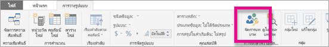
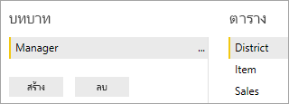
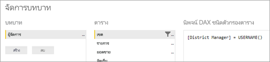
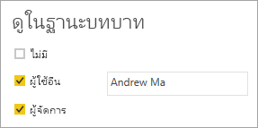

# <a name="use-row-level-security-with-power-bi-embedded-content"></a>ใช้ความปลอดภัยระดับแถวด้วยเนื้อหา Power BI Embedded

การรักษาความปลอดภัยระดับแถว (RLS) สามารถใช้เพื่อจำกัดการเข้าถึงข้อมูลภายในแดชบอร์ด ไทล์ รายงาน และชุดข้อมูลของผู้ใช้ ผู้ใช้ที่แตกต่างกันหลายๆ คนสามารถทำงานกับวัตถุเดียวกันทั้งหมดเหล่านั้นในขณะที่ดูข้อมูลที่แตกต่างกันได้ การฝัง RLS ที่สนับสนุน

ถ้าคุณกำลังฝังสำหรับผู้ใช้ที่ไม่ใช่ผู้ใช้ Power BI (แอปเป็นเจ้าของข้อมูล) ซึ่งโดยปกติคือสถานการณ์ ISV บทความนี้เหมาะสำหรับคุณ คุณจำเป็นต้องกำหนดค่าโทเค็นแบบฝังลงในบัญชีสำหรับผู้ใช้และบทบาท อ่านต่อเพื่อเรียนรู้วิธีดำเนินการ

ถ้าคุณกำลังฝังสำหรับผู้ใช้ Power BI (ผู้ใช้เป็นเจ้าของข้อมูล) ภายในองค์กรของคุณ RLS จะทำงานแบบเดียวกับที่ทำงานในบริการ Power BI โดยตรง คุณไม่จำเป็นต้องทำอะไรเพิ่มเติมในแอปพลิเคชันอีก สำหรับข้อมูลเพิ่มเติม โปรดดู[การรักษาความปลอดภัยระดับแถว (RLS) ด้วย Power BI](../service-admin-rls.md)


เป็นสิ่งสำคัญที่คุณจะต้องทำความเข้าใจแนวคิดหลักสามแนวคิด ซึ่งได้แก่ ผู้ใช้ บทบาท และกฎเพื่อใช้ประโยชน์จาก RLS มาดูรายละเอียดของแต่ละแนวคิดกัน:

**ผู้ใช้**– ผู้ใช้ปลายทางดูอาร์ทิแฟกต์ (แดชบอร์ด ไทล์ รายงาน หรือชุดข้อมูล) ใน Power BI Embedded ผู้ใช้จะถูกระบุโดยพร็อพเพอร์ตี้ชื่อผู้ใช้ในโทเค็นที่ฝัง

**บทบาท** – ผู้ใช้จะมีสิทธิ์ตามบทบาท บทบาทเป็นคอนเทนเนอร์สำหรับกฎและสามารถตั้งชื่อ เช่น *ผู้จัดการฝ่ายขาย*หรือ*พนักงานขาย*ได้ คุณสร้างบทบาทภายใน Power BI Desktop สำหรับข้อมูลเพิ่มเติม โปรดดู[การรักษาความปลอดภัยระดับแถว (RLS) ด้วย Power BI Desktop](../desktop-rls.md)

**กฎ** – บทบาทจะมีกฎ และกฎเหล่านั้นคือตัวกรองจริงที่กำลังจะถูกนำไปใช้กับข้อมูลนั้น ซึ่งอาจเป็นชื่อง่ายๆ เช่น "ประเทศ =สหรัฐอเมริกา" หรือชื่อที่เป็นแบบไดนามิกมากขึ้น
สำหรับส่วนที่เหลือของบทความนี้ มีตัวอย่างของการเขียน RLS และการใช้งาน RLS ภายในแอปพลิเคชันแบบฝังตัว ตัวอย่างของเราใช้ไฟล์ PBIX [ตัวอย่างการวิเคราะห์ด้านการขายปลีก](http://go.microsoft.com/fwlink/?LinkID=780547)


## <a name="adding-roles-with-power-bi-desktop"></a>การเพิ่มบทบาทด้วย Power BI Desktop

ตัวอย่างการวิเคราะห์ด้านการขายปลีกของเราแสดงยอดขายสำหรับร้านค้าทั้งหมดในกลุ่มร้านค้าปลีก หากไม่มี RLS ผู้จัดการสาขาทุกคนที่ลงชื่อเข้าใช้และดูรายงานจะเห็นข้อมูลเดียวกัน ผู้จัดการอาวุโสที่ได้กำหนดผู้จัดการเขตแต่ละรายแล้วควรจะเห็นยอดขายสำหรับการร้านค้าที่พวกเขาจัดการเท่านั้น และในการทำเช่นนี้ เราสามารถใช้ RLS ได้

RLS ถูกเขียนใน Power BI Desktop เมื่อเปิดชุดข้อมูลและรายงาน เราจะสามารถสลับไปยังมุมมองไดอะแกรมเพื่อดู Schema ได้:


นี่คือบางสิ่งบางอย่างที่ควรสังเกตสำหรับ Schema นี้:

* หน่วยวัดทั้งหมด เช่น **ยอดขายรวม** จะเก็บไว้ในตาราง**ยอดขาย**จริง
* มีตารางมิติข้อมูลที่เกี่ยวข้องเพิ่มเติมสี่ตาราง: **สินค้า** **เวลา** **ร้านค้า** และ**สาขา**
* ลูกศรบนเส้นของความสัมพันธ์จะระบุวิธีที่ตัวกรองดำเนินการจากตารางหนึ่งไปอีกตาราง ตัวอย่างเช่น ถ้าตัวกรองถูกใช้กับ**เวลา[วันที่]** ใน Schema ปัจจุบัน ตัวกรองนี้จะกรองค่าในตาราง**ยอดขาย**เท่านั้น ตารางอื่นๆ จะไม่ได้รับผลกระทบจากตัวกรองนี้เนื่องจากลูกศรทั้งหมดในเส้นของความสัมพันธ์ชี้ไปยังตารางยอดขายเท่านั้น
* ตาราง**สาขา**จะบ่งชี้ว่าใครเป็นผู้จัดการแต่ละสาขา:
  
    

ตาม schema นี้ ถ้าเราใช้ตัวกรองกับคอลัมน์**ผู้จัดการเขต**ในตาราง**เขต** และถ้าตัวกรองนั้นตรงกับผู้ใช้ที่ดูรายงาน ตัวกรองนั้นจะกรองตาราง**ร้าน** และ**ยอดขาย**เพื่อแสดงข้อมูลสำหรับผู้จัดการเขตคนนั้น

ต่อไปนี้คือวิธีการ:

1. บนแท็บ**การวางรูปแบบ** ให้เลือก**จัดการบทบาท**

    
2. สร้างบทบาทใหม่ที่ชื่อว่า**ผู้จัดการ**

    
3. ในตาราง**สาขา** ให้ใส่นิพจน์ DAX ต่อไปนี้: **[ผู้จัดการสาขา] = ชื่อผู้ใช้()**

    
4. ถ้าต้องการตรวจสอบให้แน่ใจว่ากฎกำลังทำงานอย่างถูกต้อง บนแท็บ**การวางรูปแบบ** ให้เลือก**มุมมองบทบาท** แล้วเลือกทั้งบทบาท**ผู้จัดการ**ที่คุณเพิ่งสร้างและ**ผู้ใช้อื่นๆ** ใส่ **AndrewMa**เป็นผู้ใช้

    

    รายงานจะแสดงข้อมูลเหมือนกับว่าคุณได้ลงชื่อเข้าใช้ในฐานะ **AndrewMa**

การใช้ตัวกรองอย่างที่เราได้ทำที่นี่ จะกรองระเบียนทั้งหมดในตาราง**เขต**, **ร้าน** และ**ยอดขาย** อย่างไรก็ตาม เนื่องจากทิศทางของตัวกรองกับความสัมพันธ์ระหว่าง**ยอดขาย**และ**เวลา** จะไม่มีการกรองตาราง**ยอดขาย**และ**สินค้า**และ**สินค้า**และ**เวลา** เมื่อต้องการเรียนรู้เพิ่มเติมเกี่ยวกับการกรองสองทิศทางแบบไขว้ โปรดดาวน์โหลดเอกสารทางเทคนิคเรื่อง[การกรองสองทิศทางแบบไขว้ใน SQL Server Analysis Services 2016 และ Power BI Desktop](http://download.microsoft.com/download/2/7/8/2782DF95-3E0D-40CD-BFC8-749A2882E109/Bidirectional%20cross-filtering%20in%20Analysis%20Services%202016%20and%20Power%20BI.docx)

## <a name="applying-user-and-role-to-an-embed-token"></a>การนำผู้ใช้และบทบาทไปใช้กับโทเค็นที่ฝัง

หลังจากที่คุณกำหนดค่าบทบาท Power BI Desktop แล้ว คุณจำเป็นต้องทำงานบางอย่างในแอปพลิเคชันเพื่อใช้ประโยชน์จากบทบาท

ผู้ใช้จะได้รับการรับรองความถูกต้องและได้รับอนุญาตโดยแอปพลิเคชัน และโทเค็นที่ฝังจะถูกใช้เพื่ออนุญาตให้ผู้ใช้รายนั้นเข้าถึงรายงาน Power BI Embedded ที่เฉพาะเจาะจง Power BI Embedded ไม่มีข้อมูลที่ระบุได้ว่าผู้ใช้ของคุณคือใคร คุณจำเป็นต้องส่งบริบทเพิ่มเติมบางอย่างเป็นส่วนหนึ่งของโทเค็นที่ฝังในรูปแบบข้อมูลประจำตัวเพื่อให้ RLS ทำงาน ซึ่งสามารถทำได้โดย API [โทเค็นฝังตัว](https://docs.microsoft.com/rest/api/power-bi/embedtoken)

API รับรายการของข้อมูลประจำตัว ที่ระบุชุดข้อมูลที่เกี่ยวข้อง เพื่อให้ RLS ทำงานได้ คุณจำเป็นต้องส่งข้อมูลต่อไปนี้เป็นส่วนหนึ่งของข้อมูลประจำตัว

* **ชื่อผู้ใช้ (จำเป็น)** – นี่คือสตริงที่สามารถใช้เพื่อช่วยในการระบุตัวตนผู้ใช้เมื่อนำกฎ RLS ไปใช้ ผู้ใช้รายเดียวเท่านั้นที่สามารถอยู่ในรายการได้ ชื่อผู้ใช้ของคุณสามารถใช้อักขระ *ASCII* ได้
* **บทบาท (จำเป็น)** – สตริงที่ประกอบด้วยบทบาทที่เลือกเมื่อนำกฎการรักษาความปลอดภัยระดับแถวไปใช้ ถ้าส่งบทบาทมากกว่าหนึ่งรายการ คุณควรส่งเป็นอาร์เรย์แบบสตริง
* **ชุดข้อมูล (จำเป็น)** – ชุดข้อมูลที่สามารถใช้ได้กับวัตถุที่คุณจะฝัง

คุณสามารถสร้างโทเค็นที่ฝังได้โดยใช้เมธอด **GenerateTokenInGroup** บน **PowerBIClient.Reports**

ตัวอย่างเช่น คุณสามารถเปลี่ยนตัวอย่าง [PowerBIEmbedded_AppOwnsData](https://github.com/Microsoft/PowerBI-Developer-Samples/tree/master/App%20Owns%20Data) ได้ *Home\HomeController.cs บรรทัด 76 และ 77* สามารถอัปเดตได้จาก:

```csharp
// Generate Embed Token.
var generateTokenRequestParameters = new GenerateTokenRequest(accessLevel: "view");

var tokenResponse = await client.Reports.GenerateTokenInGroupAsync(GroupId, report.Id, generateTokenRequestParameters);
```

ถึง

```csharp
var generateTokenRequestParameters = new GenerateTokenRequest("View", null, identities: new List<EffectiveIdentity> { new EffectiveIdentity(username: "username", roles: new List<string> { "roleA", "roleB" }, datasets: new List<string> { "datasetId" }) });

var tokenResponse = await client.Reports.GenerateTokenInGroupAsync("groupId", "reportId", generateTokenRequestParameters);
```

ถ้าคุณกำลังเรียกใช้ REST API แล้ว ตอนนี้ API ที่อัปเดตจะยอมรับอาร์เรย์ JSON เพิ่มเติม รวมถึง**ข้อมูลประจำตัว**ที่มีชื่อที่ประกอบด้วยชื่อผู้ใช้ รายการบทบาทสตริง และรายการชุดข้อมูลสตริง เช่น:

```json
{
    "accessLevel": "View",
    "identities": [
        {
            "username": "EffectiveIdentity",
            "roles": [ "Role1", "Role2" ],
            "datasets": [ "fe0a1aeb-f6a4-4b27-a2d3-b5df3bb28bdc" ]
        }
    ]
}
```

ตอนนี้เมื่อมีส่วนประกอบทั้งหมดแล้ว เมื่อมีคนเข้าสู่ระบบแอปพลิเคชันของคุณเพื่อดูวัตถุนี้ พวกเขาจะสามารถดูข้อมูลที่ได้รับอนุญาตให้ดูเท่านั้นตามที่กำหนดไว้โดยการรักษาความปลอดภัยระดับแถวของเรา

## <a name="working-with-analysis-services-live-connections"></a>การทำงานกับการเชื่อมต่อแบบสดของ Analysis Services

การรักษาความปลอดภัยระดับแถวสามารถใช้กับการเชื่อมต่อแบบสดของ Analysis Services สำหรับเซิร์ฟเวอร์ภายในองค์กร มีแนวคิดเฉพาะบางอย่างที่คุณควรทำความเข้าใจเมื่อใช้การเชื่อมต่อประเภทนี้

ข้อมูลประจำตัวที่มีผลบังคับใช้ที่ระบุไว้สำหรับพร็อพเพอร์ตี้ชื่อผู้ใช้จะต้องเป็นผู้ใช้ Windows ที่มีสิทธิ์บนเซิร์ฟเวอร์ Analysis Services

**การกำหนดค่าเกตเวย์ข้อมูลภายในองค์กร**

[เกตเวย์ข้อมูลภายในองค์กร](../service-gateway-onprem.md)จะถูกใช้เมื่อทำงานกับการเชื่อมต่อแบบสดของ Analysis Services เมื่อสร้างโทเค็นที่ฝังด้วยข้อมูลประจำตัวที่อยู่ในรายการ บัญชีผู้ใช้หลักจำเป็นต้องอยู่ในรายการในฐานะผู้ดูแลระบบเกตเวย์ ถ้าบัญชีผู้ใช้หลักไม่ได้อยู่ในรายการ จะไม่ใช้ความปลอดภัยระดับแถวกับคุณสมบัติของข้อมูล ผู้ใช้ที่ไม่ใช่ผู้ดูแลระบบเกตเวย์สามารถระบุบทบาทได้ แต่ต้องระบุชื่อผู้ใช้ของตนเองสำหรับข้อมูลประจำตัวที่มีผลบังคับใช้

**ใช้บทบาท**

สามารถกำหนดบทบาทด้วยข้อมูลประจำตัวในโทเค็นฝังตัว ถ้าไม่มีการระบุบทบาท สามารถใช้ชื่อผู้ใช้ที่ระบุพื่อแก้ไขปัญหาบทบาทเกี่ยวข้อง

**ใช้ฟีเจอร์ CustomData**

ฟีเจอร์ CustomData อนุญาตให้ส่งข้อความอิสระ (สตริง) โดยใช้พร็อพเพอร์ตี้สตริงการเชื่อมต่อ CustomData ซึ่งเป็นค่าที่จะใช้โดย AS (ผ่านฟังก์ชัน CUSTOMDATA())
คุณสามารถใช้วิธีนี้เป็นวิธีสำรองในการกำหนดปริมาณการใช้ข้อมูล
คุณสามารถใช้ภายในคิวรี DAX บทบาท และคุณสามารถใช้ได้โดยไม่ต้องมีบทบาทใดๆ ในคิวรี DAX หน่วยวัด
ฟีเจอร์ CustomData เป็นส่วนหนึ่งของฟังก์ชันการสร้างโทเค็นสำหรับวัตถุต่อไปนี้: แดชบอร์ด รายงาน และไทล์ แดชบอร์ดสามารถมีข้อมูลประจำตัว CustomData ได้หลายรายการ (1 รายการต่อไทล์/แบบจำลอง)

> [!NOTE]
> ฟีเจอร์ CustomData จะทำงานสำหรับแบบจำลองที่อยู่ใน Azure Analysis Services เท่านั้นและจะทำงานเฉพาะในโหมดถ่ายทอดสด ฟีเจอร์ข้อมูลแบบกำหนดเองไม่สามารถตั้งค่าภายในไฟล์ .pbix ได้ซึ่งต่างจากผู้ใช้และบทบาท เมื่อสร้างโทเค็นด้วยฟีเจอร์ข้อมูลแบบกำหนดเอง คุณต้องมีชื่อผู้ใช้

**การเพิ่ม CustomData SDK**

พร็อพเพอร์ตี้สตริง CustomData ถูกเพิ่มลงในข้อมูลประจำตัวที่มีผลบังคับใช้ของเราในสถานการณ์การสร้างโทเค็น

        [JsonProperty(PropertyName = "customData")]
        public string CustomData { get; set; }

ข้อมูลประจำตัวสามารถสร้างขึ้นด้วยข้อมูลแบบกำหนดเองโดยใช้การเรียกใช้ต่อไปนี้:

        public EffectiveIdentity(string username, IList<string> datasets, IList<string> roles = null, string customData = null);

**การใช้ CustomData SDK**

ถ้าคุณกำลังเรียกใช้ REST API คุณจะสามารถเพิ่มข้อมูลแบบกำหนดเองภายในข้อมูลประจำตัวแต่ละรายการได้ เช่น:

```json
{
    "accessLevel": "View",
    "identities": [
        {
            "username": "EffectiveIdentity",
            "roles": [ "Role1", "Role2" ],
            "customData": "MyCustomData",
            "datasets": [ "fe0a1aeb-f6a4-4b27-a2d3-b5df3bb28bdc" ]
        }
    ]
}
```

## <a name="considerations-and-limitations"></a>ข้อควรพิจารณาและข้อจำกัด

* การกำหนดบทบาทให้ผู้ใช้ภายในบริการ Power BI จะไม่ส่งผลต่อ RLS เมื่อใช้โทเค็นที่ฝัง
* แม้ว่าบริการ Power BI จะไม่ใช้การตั้งค่า RLS กับผู้ดูแลระบบหรือสมาชิกที่มีสิทธิ์แก้ไข แต่เมื่อคุณใส่ข้อมูลประจำตัวที่มีโทเค็นที่ฝัง การตั้งค่าดังกล่าวจะนำไปใช้กับข้อมูล
* การเชื่อมต่อแบบสดของ Analysis Services ได้รับการสนับสนุนสำหรับเซิร์ฟเวอร์ภายในองค์กร
* การเชื่อมต่อแบบสดของ Azure Analysis Services Azure สนับสนุนการกรองด้วยบทบาท การกรองแบบไดนามิกสามารถทำได้โดยใช้ CustomData
* ถ้าชุดข้อมูลพื้นฐานไม่จำเป็นต้องใช้ RLS คำขอ GenerateToken ต้อง**ไม่มี**ข้อมูลประจำตัวที่มีผลบังคับใช้
* ถ้าชุดข้อมูลพื้นฐานคือโมเดลคลาวด์ (แบบจำลองที่แคชหรือ DirectQuery) ข้อมูลประจำตัวที่มีผลบังคับใช้ต้องมีอย่างน้อยหนึ่งบทบาทมิฉะนั้นการมอบหมายบทบาทจะไม่เกิดขึ้น
* รายการข้อมูลประจำตัวจะเปิดใช้โทเค็นข้อมูลประจำตัวสำหรับการฝังแดชบอร์ด สำหรับวัตถุอื่นๆ ทั้งหมด รายการจะประกอบด้วยข้อมูลประจำตัวรายการเดียว

มีคำถามเพิ่มเติมหรือไม่ [ลองถามชุมชน Power BI](https://community.powerbi.com/)
