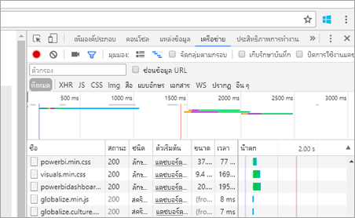
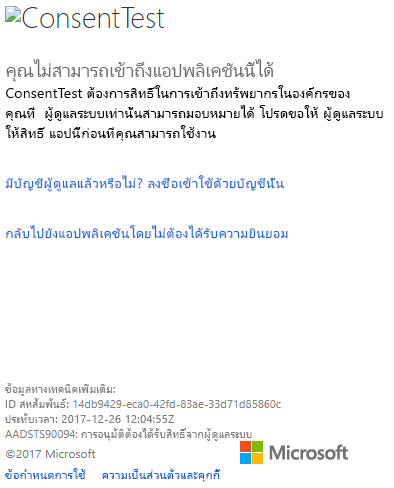

# <a name="troubleshoot-your-embedded-application"></a>แก้ไขปัญหาแอปพลิเคชันแบบฝังตัวของคุณ

บทความนี้อธิบายถึงปัญหาทั่วไปที่คุณอาจพบเมื่อฝังเนื้อหาจาก Power BI

## <a name="tools-to-troubleshoot"></a>เครื่องมือการแก้ไขปัญหา

### <a name="fiddler-trace"></a>ติดตาม Fiddler

[Fiddler](http://www.telerik.com/fiddler) เป็นเครื่องมือฟรีจาก Telerik ที่ใช้ตรวจดูการรับส่งข้อมูลใน HTTP  คุณสามารถดูปริมาณการใช้งานได้ด้วย Power BI API จากเครื่องของลูกค้า ซึ่งอาจจะแสดงข้อผิดพลาดและข้อมูลอื่น ๆ ที่เกี่ยวข้อง


### <a name="f12-in-browser-for-front-end-debugging"></a>F12 ในเบราว์เซอร์สำหรับการแก้ไขปัญหาโปรแกรมเสริมหน้า (Front-end)

F12 จะเปิดใช้หน้าต่างผู้พัฒนาภายในเบราว์เซอร์ของคุณ ซึ่งมีความสามารถในการดูปริมาณการใช้งานเครือข่ายและข้อมูลอื่น ๆ



### <a name="extract-error-details-from-power-bi-response"></a>แยกรายละเอียดข้อผิดพลาดจากคำตอบของ Power BI

ส่วนของรหัสนี้แสดงวิธีการแยกรายละเอียดข้อผิดพลาดจากข้อยกเว้น HTTP:

```csharp
public static string GetExceptionText(this HttpOperationException exc)
{
    var errorText = string.Format("Request: {0}\r\nStatus: {1} ({2})\r\nResponse: {3}",
    exc.Request.Content, exc.Response.StatusCode, (int)exc.Response.StatusCode, exc.Response.Content);
    if (exc.Response.Headers.ContainsKey("RequestId"))
    {
        var requestId = exc.Response.Headers["RequestId"].FirstOrDefault();
        errorText += string.Format("\r\nRequestId: {0}", requestId);
    }

    return errorText;
}
```

เราแนะนำให้บันทึกรหัสคำขอ (และรายละเอียดข้อผิดพลาดสำหรับการแก้ไขปัญหา)
โปรดระบุรหัสคำขอเมื่อติดต่อฝ่ายสนับสนุนของ Microsoft

## <a name="app-registration"></a>การลงทะเบียนแอปฯ

### <a name="app-registration-failure"></a>ความล้มเหลวในการลงทะเบียนแอปฯ

ข้อความข้อผิดพลาดภายในพอร์ทัล Azure หรือหน้าการลงทะเบียนแอป Power BI จะบอกถึงสิทธิ์ที่ไม่เพียงพอ หากต้องการลงทะเบียนแอปพลิเคชัน คุณต้องเป็นผู้ดูแลระบบในผู้เช่า Azure AD หรือต้องเปิดใช้งานการลงทะเบียนแอปพลิเคชันสำหรับผู้ใช้ที่ไม่ใช่ผู้ดูแลระบบ

### <a name="power-bi-service-doesnt-appear-in-the-azure-portal-when-registering-a-new-app"></a>บริการ Power BI ไม่ปรากฏในพอร์ทัล Azure เมื่อลงทะเบียนแอปใหม่

ต้องมีผู้ใช้อย่างน้อยหนึ่งรายลงทะเบียนสำหรับ Power BI ถ้าคุณไม่เห็น**บริการ Power BI**แสดงอยู่ภายในรายการ API แสดงว่าไม่มีผู้ใช้ที่ลงทะเบียนสำหรับ Power BI

## <a name="rest-api"></a>REST API

### <a name="api-call-returning-401"></a>API เรียกให้ส่งกลับ 401

อาจต้องมีการจับภาพ Fiddler เพื่อการตรวจสอบเพิ่มเติม ขอบเขตการอนุญาตสิทธิ์ที่จำเป็นอาจสูญหายสำหรับแอปพลิเคชันที่ลงทะเบียนไว้ภายใน Azure AD ตรวจสอบให้แน่ใจว่าขอบเขตที่จำเป็นต้องมีปรากฏอยู่ภายในการลงทะเบียนแอปฯสำหรับ Azure AD ภายในพอร์ทัล Azure

### <a name="api-call-returning-403"></a>API เรียกให้ส่งกลับ 403

อาจต้องมีการจับภาพ Fiddler เพื่อการตรวจสอบเพิ่มเติม อาจมีหลายสาเหตุสำหรับข้อผิดพลาด 403

* ผู้ใช้มีจำนวนโทเค็นแบบฝังเกินจำนวนที่สามารถสร้างขึ้นได้ในความจุที่ใช้ร่วมกัน ซื้อความจุ Azure เพื่อสร้างโทเค็นแบบฝัง และกำหนดพื้นที่ทำงานให้กับขีดความจุนั้น ดู[ขีดความสามารถในการสร้าง Power BI แบบฝังในพอร์ทัล Azure](https://docs.microsoft.com/azure/power-bi-embedded/create-capacity)
* โทเค็นรับรองความถูกต้องของ Azure AD หมดอายุแล้ว
* ผู้ใช้ที่ได้รับการรับรองความถูกต้องไม่เป็นสมาชิกของกลุ่ม (พื้นที่ทำงานของแอปฯ)
* ผู้ใช้ที่ได้รับการรับรองความถูกต้องไม่เป็นผู้ดูแลระบบของกลุ่ม (พื้นที่ทำงานของแอปฯ)
* หัวข้อการรับรองความถูกต้องอาจไม่อยู่ในรายการอย่างถูกต้อง ตรวจสอบให้แน่ใจว่าไม่มีการพิมพ์ผิด

ส่วนหลังของแอปพลิเคชันอาจจำเป็นต้องรีเฟรชโทเค็นการรับรองความถูกต้องก่อนที่จะเรียก GenerateToken

    ```
    GET https://wabi-us-north-central-redirect.analysis.windows.net/metadata/cluster HTTP/1.1
    Host: wabi-us-north-central-redirect.analysis.windows.net
    ...
    Authorization: Bearer eyJ0eXAiOi...
    ...

    HTTP/1.1 403 Forbidden
    ...

    {"error":{"code":"TokenExpired","message":"Access token has expired, resubmit with a new access token"}}
    ```

## <a name="authentication"></a>การรับรองความถูกต้อง

### <a name="authentication-failed-with-aadsts90002-tenant-authorize-not-found"></a>การรับรองความถูกต้องล้มเหลวเนื่องจาก AADSTS90002 ไม่พบผู้เช่าที่ได้รับ 'การอนุญาต'

 หากคุณได้รับข้อความการลงชื่อเข้าใช้ เช่น ***error: invalid_request, error_description: AADSTS90002: ไม่พบผู้เช่าที่ได้รับ 'การอนุญาต'*** ซึ่งก็คือเนื่องจากไม่สนับสนุน ADAL 4.x "https://login.microsoftonline.com/{Tenant}/oauth2/authorize/" เป็น url ผู้มีสิทธิ์
 
ในการแก้ไขปัญหานี้คุณควรตัด "oauth2/authorize/" จากท้าย URL ผู้มีสิทธิ์ของคุณ โปรดดู [ตัวอย่างนักพัฒนา Power BI](https://github.com/Microsoft/PowerBI-Developer-Samples) สำหรับการอ้างอิง

 ตรวจสอบ [การตรวจสอบความถูกต้องผู้มีสิทธิ์ที่ดีขึ้น](https://github.com/AzureAD/azure-activedirectory-library-for-dotnet/wiki/Changes-adalnet-4.0#better-authority-validation) จากบันทึกย่อประจำรุ่น ADAL 4.x

### <a name="authentication-failed-with-aadsts70002-or-aadsts50053"></a>การรับรองความถูกต้องล้มเหลวเนื่องจาก AADSTS70002 หรือ AADSTS50053

**_(AADSTS70002: ข้อมูลประจำตัวผิดพลาด AADSTS50053: คุณได้พยายามลงชื่อเข้าใช้หลายครั้งเกินไปด้วยรหัสผู้ใช้หรือรหัสผ่านที่ไม่ถูกต้อง)_**

หากคุณกำลังใช้ Power BI Embedded และการรับรองความถูกต้องโดยตรงของ Azure AD และคุณได้รับข้อความที่เข้าสู่ระบบ เช่น ***ข้อผิดพลาด: unauthorized_client, error_description:AADSTS70002: ข้อมูลประจำตัวที่ตรวจสอบผิดพลาด AADSTS50053: คุณได้พยายามลงชื่อเข้าใช้หลายครั้งเกินไปด้วยรหัสผู้ใช้หรือรหัสผ่านที่ไม่ถูกต้อง*** นั่นเนื่องจากการรับรองความถูกต้องโดยตรงไม่สามารถใช้งานได้อีกต่อไปตั้งแต่วันที่ 14 มิถุนายน 2018 ตามค่าเริ่มต้น

นั่นคือวิธีการเปลี่ยนไปใช้ [นโยบาย Azure AD ](https://docs.microsoft.com/azure/active-directory/manage-apps/configure-authentication-for-federated-users-portal#enable-direct-authentication-for-legacy-applications)ที่กำหนดขอบเขตสำหรับองค์กรหรือ[ผู้ให้บริการหลัก](https://docs.microsoft.com/azure/active-directory/develop/active-directory-application-objects#service-principal-object)

เราขอแนะนำให้คุณเปิดใช้งานนโยบายนี้เป็นแบบต่อแอปเท่านั้น

เมื่อต้องสร้างนโยบายนี้ คุณจำเป็นต้องเป็น**ผู้ดูแลระบบส่วนกลาง**สำหรับไดเรกทอรีที่คุณกำลังสร้างนโยบายและกำหนดสิ่งต่างๆ นี่คือสคริปต์ตัวอย่างสำหรับการสร้างนโยบาย และกำหนดนโยบายให้กับ SP สำหรับแอปพลิเคชันนี้:

1. ติดตั้ง[การแสดงโมดูล Powershell ของ Azure AD](https://docs.microsoft.com/powershell/azure/active-directory/install-adv2?view=azureadps-2.0)

2. เรียกใช้คำสั่ง Powershell แบบบรรทัดต่อบรรทัดต่อไปนี้ (ตรวจสอบให้แน่ใจว่าตัวแปร $sp ไม่มีแอปพลิเคชันมากกว่าหนึ่ง)

```powershell
Connect-AzureAD
```

```powershell
$sp = Get-AzureADServicePrincipal -SearchString "Name_Of_Application"
```

```powershell
$policy = New-AzureADPolicy -Definition @("{`"HomeRealmDiscoveryPolicy`":{`"AllowCloudPasswordValidation`":true}}") -DisplayName EnableDirectAuth -Type HomeRealmDiscoveryPolicy -IsOrganizationDefault $false
```

```powershell
Add-AzureADServicePrincipalPolicy -Id $sp.ObjectId -RefObjectId $policy.Id 
```

หลังจากกำหนดนโยบาย โปรดรอประมาณ 15-20 วินาทีสำหรับการเผยแพร่ก่อนการทดสอบ

### <a name="generate-token-fails-when-providing-effective-identity"></a>การสร้างโทเค็นล้มเหลวเมื่อระบุข้อมูลประจำตัวที่ใช้ได้

GenerateToken สามารถล้มเหลวได้เมื่อใช้งานข้อมูลประจำตัวที่ให้มาด้วยเหตุผลสองสามประการ

* ชุดข้อมูลไม่รองรับข้อมูลประจำตัวที่ใช้ได้
* ไม่ได้ระบุชื่อผู้ใช้
* ไม่ได้ระบุบทบาท
* ไม่ได้ระบุรหัสชุดข้อมูล
* ผู้ใช้ไม่มีสิทธิ์ที่ถูกต้อง

เพื่่อตรวจสอบว่ามีสาเหตุจากอะไร ให้ลองทำตามขั้นตอนต่อไปนี้

* ดำเนินการ[รับชุดข้อมูล](https://docs.microsoft.com/rest/api/power-bi/datasets) คุณสมบัติ IsEffectiveIdentityRequired เป็นจริงหรือไม่?
* ชื่อผู้ใช้เป็นข้อบังคับสำหรับ EffectiveIdentity ใด ๆ
* ถ้า IsEffectiveIdentityRolesRequired เป็นจริง ดังนั้นต้องมีบทบาท
* รหัสชุดข้อมูลเป็นข้อบังคับสำหรับ EffectiveIdentity ใด ๆ
* สำหรับ Analysis Services ผู้ใช้หลักจะต้องเป็นผู้ดูแลระบบเกตเวย์

### <a name="aadsts90094-the-grant-requires-admin-permission"></a>AADSTS90094: การอนุมัติต้องใช้สิทธิของผู้ดูแลระบบ

**_ปัญหา:_**<br>
เมื่อผู้ใช้ที่ไม่ใช่ผู้ดูแลระบบพยายามลงชื่อเข้าใช้แอปพลิเคชันเป็นครั้งแรกในขณะที่ให้การยินยอม จากนั้นจะเกิดข้อผิดพลาดอย่างใดอย่างหนึ่งต่อไปนี้:

* ConsentTest ต้องการสิทธิ์ในการเข้าถึงทรัพยากรในองค์กรของคุณที่ผู้ดูแลระบบเท่านั้นสามารถมอบหมายได้ สอบถามผู้ดูแลระบบเพื่อขอสิทธิการใช้งานแอปนี้ก่อนที่คุณสามารถใช้งาน
* AADSTS90094: การอนุมัติต้องได้รับสิทธิ์จากผู้ดูแลระบบ

    

ผู้ใช้ที่เป็นผู้ดูแลระบบสามารถลงชื่อเข้าใช้ และให้การยินยอมเรียบร้อยแล้ว

**_สาเหตุ:_**<br>
การอนุมัติของผู้ใช้ถูกปิดใช้งานสำหรับผู้เช่า

**_แก้ไขปัญหาได้ดังนี้้:_**

*เปิดใช้งานการอนุมัติของผู้ใข้สำหรับผู้เช่าทั้งหมด (ผู้ใช้ทั้งหมด แอปพลิเคชั้นทั้งหมด)*

1. ในพอร์ทัล Azure ไปที่ "Azure Active Directory" = > "ผู้ใช้และกลุ่ม" = > "การตั้งค่าผู้ใช้"
2. เปิดใช้งานการตั้งค่า “ผู้ใช้สามารถยินยอมให้แอปเข้าถึงข้อมูลของบริษัทในนามของพวกเขา” แล้วเลือก บันทึก การเปลี่ยนแปลง

    

*ให้สิทธิ*ในแอปพลิเคชันโดยผู้ดูแลระบบบ - สำหรับผู้เช่าทั้งหมดหรือผู้ใช้ที่ระบุ

## <a name="data-sources"></a>แหล่งข้อมูล

### <a name="isv-wants-to-have-different-credentials-for-the-same-data-source"></a>ISV ต้องการข้อมูลประจำตัวอื่นสำหรับแหล่งข้อมูลเดียวกัน

แหล่งข้อมูลสามารถมีหนึ่งชุดข้อมูลประจำตัวสำหรับผู้ใช้หลักหนึ่งราย ถ้าคุณจำเป็นต้องใช้ข้อมูลประจำตัวอื่น ให้สร้างผู้ใช้หลักเพิ่มเติม จากนั้น กำหนดข้อมูลประจำตัวอื่นในบริบทผู้ใช้หลักแต่ละคน จากนั้นฝังโดยใช้โทเค็น Azure AD ของผู้ใช้นั้น

## <a name="troubleshoot-your-embedded-application-with-the-ierror-object"></a>แก้ไขปัญหาแอปพลิเคชันแบบฝังตัวของคุณด้วยออบเจ็กต์ IError

ใช้ [**วัตถุ IError** ถูกส่งกลับด้วยเหตุการณ์ *ข้อผิดพลาด* จาก **JavaScript SDK**](https://github.com/Microsoft/PowerBI-JavaScript/wiki/Troubleshooting-and-debugging-of-embedded-parts)เพื่อแก้จุดบกพร่องของแอปพลิเคชันของคุณ และทำความเข้าใจสาเหตุของข้อผิดพลาดของคุณได้ดียิ่งขึ้น

หลังจากการรับวัตถุ IError คุณควรดูที่ตารางข้อผิดพลาดทั่วไปที่เหมาะสมกับชนิดฝังตัวที่คุณกำลังใช้ เปรียบเทียบ **คุณสมบัติ IError** ด้วยคุณสมบัติที่อยู่ในตารางและค้นหาเหตุผลสำหรับความล้มเหลวที่เป็นไปได้

### <a name="typical-errors-when-embedding-for-power-bi-users"></a>ข้อผิดพลาดทั่วไปเมื่อมีการฝังสำหรับผู้ใช้ Power BI

| ข้อความ | ข้อความรายละเอียด | รหัสข้อผิดพลาด | เหตุผลที่เป็นไปได้ |
|-------------------------------------------------------|-----------------------------------------------------------------------------------------------------------------------------|-----------|--------------------------------------------------------|
| TokenExpired | โทเค็นการเข้าถึงหมดอายุแล้ว ส่งอีกครั้งด้วยโทเค็นการเข้าถึงใหม่ | 403 | โทเค็นหมดอายุแล้ว  |
| PowerBIEntityNotFound | รับรายงานล้มเหลว | 404 | <li> รหัสรายงานผิด <li> ไม่มีรายงาน  |
| พารามิเตอร์ไม่ถูกต้อง | ไม่ได้ระบุพารามิเตอร์ powerbiToken | N/A | <li> ไม่มีโทเค็นการเข้าถึงให้ <li> ไม่มีรหัสรายงานให้ |
| LoadReportFailed | การเตรียมใช้งานล้มเหลว - ไม่สามารถแก้ไขคลัสเตอร์ได้ | 403 | * โทเค็นการเข้าถึงไม่ดี * ชนิดที่ฝังไม่ตรงกับชนิดของโทเค็น |
| PowerBINotAuthorizedException | รับรายงานล้มเหลว | 401 | <li> รหัสกลุ่มไม่ถูกต้อง <li> กลุ่มที่ไม่ได้รับอนุญาต |
| TokenExpired | โทเค็นการเข้าถึงหมดอายุ ให้ส่งอีกครั้งด้วยโทเค็นการเข้าถึงใหม่ ไม่สามารถแสดงชื่อเรื่องภาพรายงานได้: <visual title> | N/A | โทเค็นที่หมดอายุแล้วของข้อมูลการสอบถาม |
| OpenConnectionError | ไม่สามารถแสดงภาพได้ ไม่สามารถแสดงชื่อเรื่องภาพรายงานได้: <visual title> | N/A | หยุดกำลังการผลิตชั่วคราว หรือลบในขณะที่รายงานที่เกี่ยวข้องกับความจุถูกเปิดในเซสชัน |
| ExplorationContainer_FailedToLoadModel_DefaultDetails | ไม่สามารถโหลด schema สำหรับโมเดลที่เกี่ยวข้องกับรายงานนี้ ตรวจสอบให้แน่ใจว่าคุณมีการเชื่อมต่อไปยังเซิร์ฟเวอร์ แล้วลองอีกครั้ง | N/A | <li> หยุดกำลังการผลิตชั่วคราว <li> ลบกำลังการผลิต |

### <a name="typical-errors-when-embedding-for-non-power-bi-users-using-an-embed-token"></a>เกิดข้อผิดพลาดทั่วไปเมื่อมีการฝังสำหรับผู้ใช้ที่ไม่ใช่ Power BI (โดยใช้โทเค็นแบบฝัง)

| ข้อความ | ข้อความรายละเอียด | รหัสข้อผิดพลาด | เหตุผล |
|-------------------------------------------------------|-------------------------------------------------------------------------------------------------------------------------------|------------|-------------------------------------------------|
| TokenExpired | โทเค็นการเข้าถึงหมดอายุแล้ว ส่งอีกครั้งด้วยโทเค็นการเข้าถึงใหม่ | 403 | โทเค็นหมดอายุแล้ว  |
| LoadReportFailed | รับรายงานล้มเหลว | 404 | <li> รหัสรายงานผิด <li> ไม่มีรายงาน  |
| LoadReportFailed | รับรายงานล้มเหลว | 403 | รหัสรายงานไม่ตรงกับโทเค็น |
| LoadReportFailed | รับรายงานล้มเหลว | 500 | รหัสที่ระบุในรายงานไม่ใช่รหัสเฉพาะ |
| พารามิเตอร์ไม่ถูกต้อง | ไม่ได้ระบุพารามิเตอร์ powerbiToken | N/A | <li> ไม่มีโทเค็นการเข้าถึงให้ <li> ไม่มีรหัสรายงานให้ |
| LoadReportFailed | การเตรียมใช้งานล้มเหลว - ไม่สามารถแก้ไขคลัสเตอร์ได้ | 403 | ชนิดโทเค็นไม่ถูกต้อง โทเค็นไม่เหมาะสม |
| PowerBINotAuthorizedException | การรับรายงานล้มเหลว | 401 | รหัสกลุ่มไม่ถูกต้อง/ไม่ได้รับอนุญาต |
| TokenExpired | โทเค็นการเข้าถึงหมดอายุ ให้ส่งอีกครั้งด้วยโทเค็นการเข้าถึงใหม่ ไม่สามารถแสดงชื่อเรื่องภาพรายงานได้: <visual title> | N/A | โทเค็นที่หมดอายุแล้วของข้อมูลการสอบถาม |
| OpenConnectionError | ไม่สามารถแสดงภาพได้ ไม่สามารถแสดงชื่อเรื่องภาพรายงานได้: <visual title> | N/A | หยุดกำลังการผลิตชั่วคราว หรือลบในขณะที่รายงานที่เกี่ยวข้องกับความจุถูกเปิดในเซสชัน |
| ExplorationContainer_FailedToLoadModel_DefaultDetails | ไม่สามารถโหลด schema สำหรับโมเดลที่เกี่ยวข้องกับรายงานนี้ ตรวจสอบให้แน่ใจว่าคุณมีการเชื่อมต่อไปยังเซิร์ฟเวอร์ แล้วลองอีกครั้ง | N/A | <li> หยุดกำลังการผลิตชั่วคราว <li> ลบกำลังการผลิต |

## <a name="content-rendering"></a>แสดงเนื้อหา

### <a name="performance"></a>ประสิทธิภาพการทำงาน

[ประสิทธิภาพการทำงานของ Power BI Embedded](embedded-performance-best-practices.md)

### <a name="rendering-or-consumption-of-embedded-content-fails-or-times-out"></a>การแสดงหรือการใช้เนื้อหาแบบฝังตัวล้มเหลวหรือหมดเวลา

ตรวจสอบให้แน่ใจว่าโทเค็นฝังตัวไม่หมดอายุ ตรวจสอบให้แน่ใจว่าคุณกำลังตรวจสอบวันหมดอายุของโทเค็นแบบฝังตัวและรีเฟรชโทเค็น สำหรับข้อมูลเพิ่มเติม ดู[รีเฟรชโทเค็นโดยใช้ JavaScript SDK](https://github.com/Microsoft/PowerBI-JavaScript/wiki/Refresh-token-using-JavaScript-SDK-example)

### <a name="report-or-dashboard-doesnt-load"></a>รายงานหรือแดชบอร์ดไม่โหลด

ถ้าผู้ใช้ไม่สามารถดูรายงานหรือแดชบอร์ดได้ ตรวจสอบให้แน่ใจว่ารายงานหรือแดชบอร์ดโหลดอย่างถูกต้องภายใน powerbi.com รายงานหรือแดชบอร์ดจะไม่ทำงานภายในแอปพลิเคชันของคุณหากไม่โหลดภายใน powerbi.com

### <a name="report-or-dashboard-is-performing-slowly"></a>รายงานหรือแดชบอร์ดทำงานช้า

เปิดไฟล์จาก Power BI Desktop หรือภายใน powerbi.com และตรวจสอบว่าประสิทธิภาพการทำงานนั้นยอมรับได้สำหรับการไม่รวมปัญหากับแอปพลิเคชันของคุณหรือ API ที่ฝัง

## <a name="embed-setup-tool"></a>เครื่องมือตั้งค่าแบบฝัง

คุณสามารถเข้าถึง[เครื่องมือตั้งค่าการฝังตัว](https://aka.ms/embedsetup) เพื่อดาวน์โหลดแอปพลิเคชันตัวอย่างได้อย่างรวดเร็ว จากนั้น คุณสามารถเปรียบเทียบแอปพลิเคชันของคุณกับตัวอย่าง

### <a name="prerequisites"></a>ข้อกำหนดเบื้องต้น

ตรวจสอบว่าคุณผ่านข้อกำหนดเบื้องต้นทั้งหมด ก่อนที่จะใช้เครื่องมือตั้งค่าการฝังตัว คุณต้องมีบัญชี **Power BI Pro** และการสมัครใช้งาน **Microsoft Azure**

* ถ้าคุณยังไม่ได้ลงทะเบียนสำหรับ **Power BI Pro** [ลงทะเบียนทดลองใช้ฟรี](https://powerbi.microsoft.com/pricing/)ก่อนที่คุณจะเริ่ม
* ถ้าคุณยังไม่มีการสมัครใช้งาน Azure สร้าง[บัญชีฟรี](https://azure.microsoft.com/free/?WT.mc_id=A261C142F)ก่อนที่คุณจะเริ่ม
* คุณจำเป็นต้องตั้งค่า[ผู้เช่า Azure Active Directory](create-an-azure-active-directory-tenant.md) ของคุณเอง
* คุณต้องติดตั้ง [Visual Studio](https://www.visualstudio.com/) (เวอร์ชัน 2013 หรือใหม่กว่า)

### <a name="common-issues"></a>ปัญหาที่พบบ่อย

ปัญหาทั่วไปที่คุณอาจพบขณะทดสอบเครื่องมือตั้งค่าแบบฝังตัวคือ:

#### <a name="using-the-embed-for-your-customers-sample-application"></a>การใช้แอปพลิเคชันตัวอย่าง การฝังตัวสำหรับของลูกค้าคุณ

ถ้าคุณกำลังทำงานกับประสบการณ์**ฝังตัวสำหรับลูกค้าของคุณ** บันทึกและคลายการบีบอัดไฟล์ *PowerBI-Developer-Samples.zip* จากนั้น เปิดโฟลเดอร์ *PowerBI-Developer-Samples-master\App Owns Data* และเรียกใช้ไฟล์ *PowerBIEmbedded_AppOwnsData.sln*

เมื่อเลือก**ให้สิทธิ์** (ขั้นตอนการให้สิทธิ์) คุณได้รับข้อผิดพลาดต่อไปนี้:

    AADSTS70001: Application with identifier <client ID> wasn't found in the directory <directory ID>

ทางแก้คือ ปิดหน้าต่างที่ผุดขึ้น รอสักครู่ แล้วลองอีกครั้ง คุณอาจต้องทำซ้ำหลายครั้ง ระยะเวลาจากการเสร็จสิ้นกระบวนการลงทะเบียนแอปพลิเคชันจนถึงเวลาที่พร้อมใช้งานสำหรับ API ภายนอกคือต้นเหตุของปัญหา

ข้อผิดพลาดต่อไปนี้ปรากฏขึ้นเมื่อเรียกใช้แอปตัวอย่าง:

    Password is empty. Please fill password of Power BI username in web.config.

ข้อผิดพลาดนี้เกิดขึ้นเนื่องจากค่ารหัสผ่านผู้ใช้ของคุณยังไม่ได้ใส่เข้าไปในแอปพลิเคชันตัวอย่าง เปิดแฟ้ม Web.config ในโซลูชัน และกรอกเขตข้อมูล pbiPassword ด้วยรหัสผ่านผู้ใช้ของคุณ

ถ้าคุณได้รับข้อผิดพลาด - AADSTS50079: ผู้ใช้จะต้องใช้การรับรองความถูกต้องแบบหลายปัจจัย

    Need to use an AAD account that doesn't have MFA enabled.

#### <a name="using-the-embed-for-your-organization-sample-application"></a>การใช้แอปพลิเคชันตัวอย่าง การฝังตัวสำหรับองค์กรของคุณ

ถ้าคุณกำลังทำงานกับประสบการณ์**ฝังตัวสำหรับองค์กรของคุณ** บันทึกและคลายการบีบอัดไฟล์ *PowerBI-Developer-Samples.zip* จากนั้น เปิดโฟลเดอร์ *PowerBI-Developer-Samples-master\User Owns Data\integrate-report-web-app* และเรียกใช้ไฟล์ *pbi-saas-embed-report.sln*

เมื่อคุณเรียกใช้แอปตัวอย่าง**ฝังตัวสำหรับองค์กรของคุณ** คุณได้รับข้อผิดพลาดต่อไปนี้:

    AADSTS50011: The reply URL specified in the request doesn't match the reply URLs configured for the application: <client ID>

ข้อผิดพลาดนี้เกิดจาก URL เปลี่ยนเส้นทางที่ระบุสำหรับเว็บเซิร์ฟเวอร์แอปพลิเคชันแตกต่างจาก URL ของตัวอย่าง ถ้าคุณต้องการลงทะเบียนแอปพลิเคชันตัวอย่าง ใช้ `http://localhost:13526/` เป็น URL เปลี่ยนเส้นทาง

หากคุณต้องการแก้ไขแอปพลิเคชันที่ลงทะเบียนไว้ ให้เรียนรู้วิธี [อัปเดตแอปพลิเคชัน  Azure AD ที่ลงทะเบียนไว้](https://docs.microsoft.com/azure/active-directory/develop/quickstart-v1-update-azure-ad-app) เพื่อที่แอปพลิเคชันจะสามารถให้สิทธิ์เข้าถึง API ของเว็บได้

ถ้าคุณต้องการแก้ไขโปรไฟล์หรือข้อมูลผู้ใช้ Power BI ของคุณ เรียนรู้วิธีการแก้ไข[ข้อมูล Power BI](https://docs.microsoft.com/power-bi/service-basic-concepts) ของคุณ

ถ้าคุณได้รับข้อผิดพลาด - AADSTS50079: ผู้ใช้จะต้องใช้การรับรองความถูกต้องแบบหลายปัจจัย

    Need to use an AAD account that doesn't have MFA enabled.

สำหรับข้อมูลเพิ่มเติม โปรดดู [คำถามที่ถามบ่อยของ Power BI Embedded](embedded-faq.md)

มีคำถามเพิ่มเติมหรือไม่? [ลองไปที่ชุมชน Power BI](http://community.powerbi.com/)

หากคุณต้องการความช่วยเหลือเพิ่มเติม โปรด [ติดต่อฝ่ายสนับสนุน](https://powerbi.microsoft.com/support/pro/?Type=documentation&q=power+bi+embedded) หรือ [สร้างตั๋วการสนับสนุนผ่านพอร์ทัล Azure](https://ms.portal.azure.com/#blade/Microsoft_Azure_Support/HelpAndSupportBlade/newsupportrequest) และระบุข้อความแสดงข้อผิดพลาดที่คุณพบ

## <a name="next-steps"></a>ขั้นตอนถัดไป

สำหรับข้อมูลเพิ่มเติม ให้ดู [คำถามที่พบบ่อย](embedded-faq.md)

มีคำถามเพิ่มเติมหรือไม่? [ลองไปที่ชุมชน Power BI](http://community.powerbi.com/)
