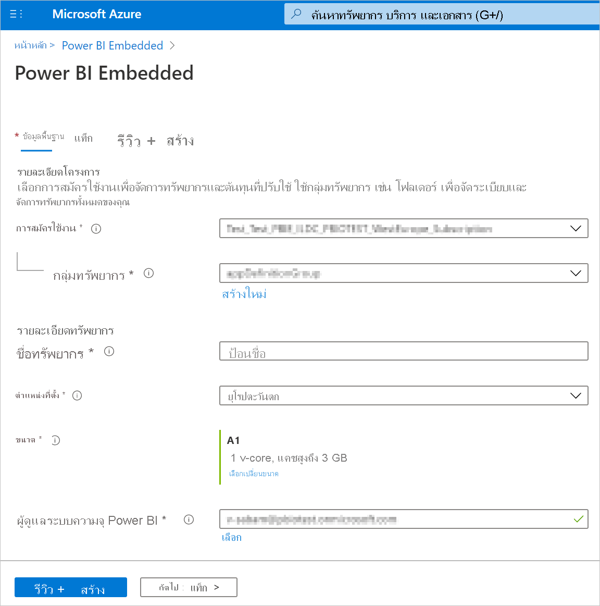
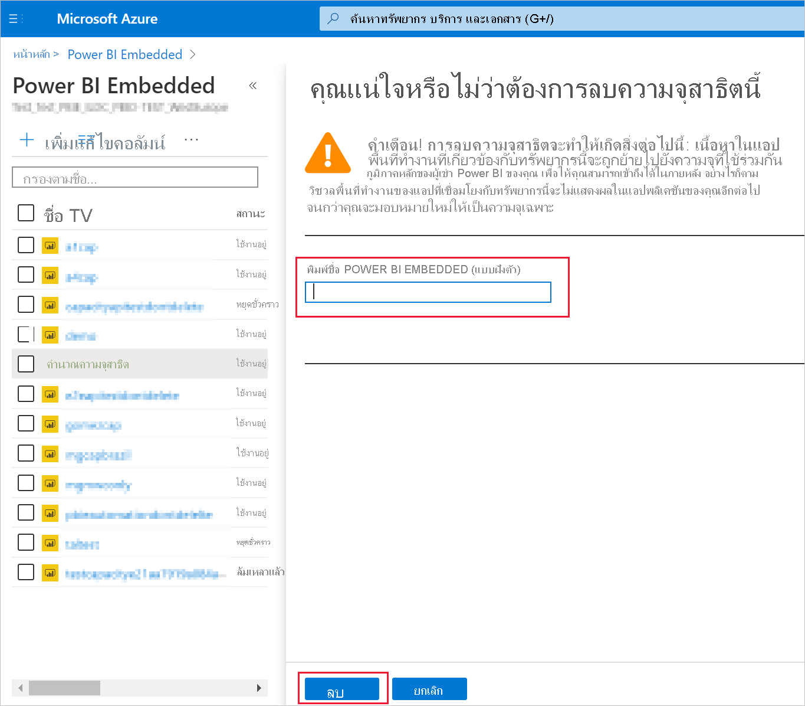

# <a name="create-power-bi-embedded-capacity-in-the-azure-portal"></a>สร้างความจุ Power BI Embedded ในพอร์ทัล Azure

บทความนี้แนะนำเกี่ยวกับวิธีการสร้างความจุ [Power BI Embedded](azure-pbie-what-is-power-bi-embedded.md) ใน Microsoft Azure Power BI Embedded ช่วยลดความสามารถของ Power BI ด้วยการช่วยให้คุณสามารถเพิ่มภาพ รายงาน และแดชบอร์ดที่สวยงามลงในแอปพลิเคชันของคุณได้อย่างรวดเร็ว

## <a name="before-you-begin"></a>ก่อนที่คุณเริ่มต้น

เมื่อต้องการทำตามการเริ่มต้นใช้งานด่วน คุณจำเป็นต้อง:

* **สมัครใช้งาน azure:** เยี่ยมชม[ Azure รุ่นทดลองใช้ฟรี ](https://azure.microsoft.com/free/)เพื่อสร้างบัญชีผู้ใช้

* **Azure Active Directory:** การสมัครใช้งานของคุณต้องเชื่อมโยงกับผู้เช่าของ Azure Active Directory (Azure AD) นอกจากนี้ ***คุณต้องลงชื่อเข้าใช้ Azure ด้วยบัญชีผู้เช่ารายนั้น*** บัญชี Microsoft ไม่ได้รับการสนับสนุน หากต้องการเรียนรู้เพิ่มเติม ดู[การรับรองความถูกต้องและสิทธิ์ผู้ใช้](https://docs.microsoft.com/azure/analysis-services/analysis-services-manage-users)

* **ผู้เช่า Power BI:** ค้องมีบัญชีในผู้เช่า Azure AD ของคุณอย่างน้อยหนึ่งบัญชีที่ลงชื่อสมัครใช้งาน Power BI

* **กลุ่มทรัพยากร:** ใช้กลุ่มทรัพยากรที่คุณมีอยู่หรือ[สร้างกลุ่มใหม่](https://docs.microsoft.com/azure/azure-resource-manager/resource-group-overview)

## <a name="create-a-capacity"></a>สร้างความจุ

ก่อนที่จะสร้างความจุ Power BI Embedded ตรวจสอบให้แน่ใจว่าคุณได้ลงชื่อเข้าใช้ Power BI อย่างน้อยหนึ่งครั้ง

# <a name="portal"></a>[พอร์ทัล](#tab/portal)

1. ลงชื่อเข้าใช้[พอร์ทัล Azure](https://portal.azure.com/)

2. ในกล่องค้นหา ค้นหาสำหรับ*Power BI Embedded*

3. ภายใน Power BI Embedded เลือก**เพิ่ม**

4. กรอกข้อมูลที่จำเป็น จากนั้นเลือก**ตรวจสอบ + สร้าง**

    

    * **การสมัครใช้งาน** - การสมัครใช้งานที่คุณต้องการสร้างความจุด้วย

    * **กลุ่มทรัพยากร** - กลุ่มทรัพยากรที่ประกอบด้วยความจุใหม่นี้ เลือกจากกลุ่มทรัพยากรที่มีอยู่แล้วหรือสร้างกลุ่มอื่น สำหรับข้อมูลเพิ่มเติม ให้ดู[ภาพรวม Azure Resource Manager](https://docs.microsoft.com/azure/azure-resource-manager/resource-group-overview)

    * **ชื่อทรัพยากร** - ชื่อทรัพยากรของความจุ

    * **ตำแหน่งที่ตั้ง** - ตำแหน่งที่ตั้งที่มีโฮสต์ Power BI สำหรับผู้เช่าของคุณ ตำแหน่งเริ่มต้นของคุณคือ ภูมิภาคบ้านของคุณ แต่คุณสามารถเปลี่ยนตำแหน่งที่ตั้งโดยใช้[ตัวเลือก Multi-Geo](embedded-multi-geo.md)

    * **ขนาด**-[SKU](../../admin/service-admin-premium-purchase.md#purchase-a-skus-for-testing-and-other-scenarios) ที่คุณต้องการ สำหรับข้อมูลเพิ่มเติมดู [หน่วยความจำ SKU และกำลังสำหรับการประมวลผล](/power-bi/developer/embedded/embedded-capacity)

    * **ผู้ดูแลระบบความจุของ Power BI**-ผู้ดูแลระบบสำหรับความจุ
        >[!NOTE]
        >* ตามค่าเริ่มต้นผู้ดูแลระบบความจุคือผู้ใช้ที่สร้างความจุ
        >* คุณสามารถเลือกผู้ใช้อื่นหรือบริการหลักเป็นผู้ดูแลระบบความจุ
        >* ผู้ดูแลระบบความจุต้องเป็นสมาชิกของผู้เช่าที่มีการเตรียมใช้งานความจุ ผู้ใช้ทางธุรกิจไปยังธุรกิจ (B2B) ไม่สามารถเป็นผู้ดูแลระบบความจุได้

# <a name="azure-cli"></a>[Azure CLI](#tab/CLI)

### <a name="use-azure-cloud-shell"></a>ใช้ Azure Cloud Shell

Azure ให้บริการระบบ Azure Cloud Shell ซึ่งเป็นสภาพแวดล้อมของ Shell แบบโต้ตอบที่คุณสามารถใช้ผ่านเบราว์เซอร์ของคุณ คุณสามารถใช้ Bash หรือ PowerShell กับ Cloud Shell เพื่อทำงานร่วมกับบริการต่าง ๆ ของ Azure ได้ คุณสามารถใช้คำสั่ง Cloud Shell ที่ติดตั้งไว้ล่วงหน้าเพื่อเรียกใช้รหัสในบทความนี้ได้โดยไม่จำเป็นต้องติดตั้งสิ่งใดๆในสภาพแวดล้อมภายในที่ตั้งของคุณ

การเริ่มใช้ Azure Cloud Shell

| ตัวเลือก | ตัวอย่าง/การเชื่อมโยง |
|-----------------------------------------------|---|
| เลือก **ลอง** ที่มุมบนขวาของบล็อกรหัส การเลือก **ลอง** จะไม่คัดลอกรหัสไปยัง Cloud Shell โดยอัตโนมัติ |  |
| ไปที่ [https://shell.azure.com](https://shell.azure.com)หรือเลือกปุ่ม **เปิดใช้งานระบบ Cloud Shell** เพื่อเปิดระบบ Cloud Shell ในเบราว์เซอร์ของคุณ | [](https://shell.azure.com) |
| เลือกปุ่ม **Cloud Shell** บนแถบเมนูที่มุมขวาบนใน [พอร์ทัล Azure](https://portal.azure.com) |  |

เมื่อต้องการเรียกใช้โค้ดในบทความนี้ใน Azure Cloud Shell:

1. เริ่มระบบ Cloud Shell

2. เลือกปุ่ม **คัดลอก** บนบล็อกรหัสเพื่อคัดลอกโค้ด

3. วางรหัสลงในเซสชันของ Cloud Shell โดยการเลือก **Ctrl**+**Shift**+**V** บน Windows และ Linux หรือโดยการเลือก **Cmd**+**Shift**+**V** บน macOS

4. เลือก **ใส่** เพื่อเรียกใช้รหัส

## <a name="prepare-your-environment"></a>เตรียมสภาพแวดล้อมของคุณ

คำสั่งความจุ Power BI embedded จำเป็นต้องใช้เวอร์ชัน 2.3.1 หรือใหม่กว่าของ Azure CLI เรียกใช้ `az --version` เพื่อค้นหารุ่นและไลบรารีขึ้นต่อกันที่ติดตั้งอยู่ หากต้องการติดตั้งหรืออัปเกรดดู [ติดตั้ง Azure CLI](/cli/azure/install-azure-cli)

1. ลงชื่อเข้าใช้

   ลงชื่อเข้าใช้ด้วยคำสั่งการเข้าสู่ระบบ [az](/cli/azure/reference-index#az-login) หากคุณกำลังใช้การติดตั้ง CLI ภายในเครื่อง

    ```azurecli
    az login
    ```

    ทำตามขั้นตอนที่แสดงในเครื่องของคุณเพื่อดำเนินกระบวนการตรวจสอบสิทธิ์ให้เสร็จสมบูรณ์

2. ติดตั้งส่วนขยาย Azure CLI

    เมื่อทำงานกับการอ้างอิงส่วนขยายสำหรับ Azure CLI คุณต้องติดตั้งส่วนขยายก่อน  ส่วนขยาย Azure CLI ช่วยให้คุณสามารถเข้าถึงคำสั่งแบบทดลองและรุ่นก่อนวางจำหน่ายที่ยังไม่ได้ส่งเป็นส่วนหนึ่งของแกนหลัก CLI  หากต้องการเรียนรู้เพิ่มเติมเกี่ยวกับส่วนขยายรวมทั้งการอัปเดตและการถอนการติดตั้งดู [ใช้ส่วนขยายกับ Azure CLI](/cli/azure/azure-cli-extensions-overview)

    ติดตั้งส่วนขยายสำหรับความจุแบบฝังตัวของ Power BI โดยการเรียกใช้คำสั่งต่อไปนี้:

    ```azurecli
    az extension add --name powerbidedicated
    ```

### <a name="create-a-capacity-with-azure-cli"></a>สร้างความจุด้วย Azure CLI

ใช้การสร้างคำสั่ง [az Power BI embedded-capacity ](https://docs.microsoft.com/cli/azure/ext/powerbidedicated/powerbi/embedded-capacity?view=azure-cli-latest#ext-powerbidedicated-az-powerbi-embedded-capacity-create) เพื่อสร้างความจุ

```azurecli
az powerbi embedded-capacity create --location westeurope
                                    --name
                                    --resource-group
                                    --sku-name "A1"
                                    --sku-tier "PBIE_Azure"
```

### <a name="delete-a-capacity-with-azure-cli"></a>การลบความจุด้วย Azure CLI

หากต้องการลบความจุโดยใช้ Azure CLI ให้ใช้คำสั่งการลบ [az powerbi embedded - capacity](https://docs.microsoft.com/cli/azure/ext/powerbidedicated/powerbi/embedded-capacity?view=azure-cli-latest#ext-powerbidedicated-az-powerbi-embedded-capacity-delete)

```azurecli
az powerbi embedded-capacity delete --name
                                    --resource-group
```

### <a name="manage-your-capacity-with-azure-cli"></a>การจัดการความจุด้วย Azure CLI

คุณสามารถดูคำสั่ง Power BI Embedded Azure CLI ทั้งหมดใน [az powerbi](https://docs.microsoft.com/cli/azure/ext/powerbidedicated/powerbi?view=azure-cli-latest)

# <a name="arm-template"></a>[เทมเพลต ARM](#tab/ARM-template)

### <a name="use-resource-manager-template"></a>ใช้เทมเพลตของตัวจัดการทรัพยากร

[เทมเพลตของตัวจัดการทรัพยากร](https://docs.microsoft.com/azure/azure-resource-manager/templates/overview) เป็นแฟ้ม JavaScript Object Notation (JSON) ที่กำหนดโครงสร้างพื้นฐานและการกำหนดค่าสำหรับโครงการของคุณ เทมเพลตนี้ใช้ไวยากรณ์ที่เปิดเผยซึ่งช่วยให้คุณสามารถระบุสิ่งที่คุณต้องการปรับใช้ได้โดยไม่ต้องเขียนลำดับของคำสั่งการเขียนโปรแกรมเพื่อสร้างขึ้น หากคุณต้องการเรียนรู้เพิ่มเติมเกี่ยวกับการพัฒนาเทมเพลตตัวจัดการทรัพยากร ดูที่ [คู่มือของตัวจัดการทรัพยากร](https://docs.microsoft.com/azure/azure-resource-manager/) และที่ [อ้างอิงเทมเพลต](https://docs.microsoft.com/azure/templates/)

ถ้าคุณยังไม่มีการสมัครใช้งาน Azure สร้าง[บัญชีฟรี](https://azure.microsoft.com/free/)ก่อนที่คุณจะเริ่ม

### <a name="review-the-template"></a>ตรวจสอบเทมเพลต

เทมเพลตที่ใช้ใน เริ่มต้นใช้งานด่วน นี้มาจาก [เทมเพลตเริ่มต้นใช้งานด่วน Azure](https://azure.microsoft.com/resources/templates/101-power-bi-embedded)

```json
{
    "$schema": "https://schema.management.azure.com/schemas/2019-04-01/deploymentTemplate.json#",
    "contentVersion": "1.0.0.0",
    "parameters": {
        "name": {
            "type": "string",
            "metadata": {
              "description": "The capacity name, which is displayed in the Azure portal and the Power BI admin portal"
            }
        },
        "location": {
            "type": "string",
            "defaultValue": "[resourceGroup().location]",
            "metadata": {
              "description": "The location where Power BI is hosted for your tenant"
            }
        },
        "sku": {
            "type": "string",
            "allowedValues": [
                "A1",
                "A2",
                "A3",
                "A4",
                "A5",
                "A6"
            ],
            "metadata": {
              "description": "The pricing tier, which determines the v-core count and memory size for the capacity"
            }
        },
        "admin": {
            "type": "string",
            "metadata": {
              "description": "A user within your Power BI tenant, who will serve as an admin for this capacity"
            }
        }
    },
    "resources": [
        {
            "type": "Microsoft.PowerBIDedicated/capacities",
            "apiVersion": "2017-10-01",
            "name": "[parameters('name')]",
            "location": "[parameters('location')]",
            "sku": {
                "name": "[parameters('sku')]"
            },
            "properties": {
                "administration": {
                    "members": [
                        "[parameters('admin')]"
                    ]
                }
            }
        }
    ]
}
```

มีการกำหนดทรัพยากร Azure หนึ่งรายการในเทมเพลต [Microsoft PowerBIDedicated/ความจุ Az](https://docs.microsoft.com/azure/templates/microsoft.powerbidedicated/allversions)-สร้าง Power BI Embedded ความจุ

### <a name="deploy-the-template"></a>การปรับใช้เทมเพลต

1. เลือกลิงก์ต่อไปนี้เพื่อลงชื่อเข้าใช้ Azure และเปิดเทมเพลต เทมเพลตจะสร้างความจุ Power BI Embedded

    [](https://portal.azure.com/#create/Microsoft.Template/uri/https%3a%2f%2fraw.githubusercontent.com%2fAzure%2fazure-quickstart-templates%2fmaster%2f101-power-bi-embedded%2fazuredeploy.json)

2. กรอกข้อมูลที่จำเป็น จากนั้นเลือก**ตรวจสอบ + สร้าง**

    

    * **การสมัครใช้งาน** - การสมัครใช้งานที่คุณต้องการสร้างความจุด้วย

    * **กลุ่มทรัพยากร** - กลุ่มทรัพยากรที่ประกอบด้วยความจุใหม่นี้ เลือกจากกลุ่มทรัพยากรที่มีอยู่แล้วหรือสร้างกลุ่มอื่น สำหรับข้อมูลเพิ่มเติม ให้ดู[ภาพรวม Azure Resource Manager](https://docs.microsoft.com/azure/azure-resource-manager/resource-group-overview)

    * **ภูมิภาค**-ภูมิภาคที่ความจุจะสังกัดอยู่

    * **ชื่อ** - ชื่อความจุ

    * **ตำแหน่งที่ตั้ง** - ตำแหน่งที่ตั้งที่มีโฮสต์ Power BI สำหรับผู้เช่าของคุณ ตำแหน่งเริ่มต้นของคุณคือ ภูมิภาคบ้านของคุณ แต่คุณสามารถเปลี่ยนตำแหน่งที่ตั้งโดยใช้[ตัวเลือก Multi-Geo](https://docs.microsoft.com/power-bi/developer/embedded/embedded-multi-geo
)

    * **ขนาด**-[SKU](../../admin/service-admin-premium-purchase.md#purchase-a-skus-for-testing-and-other-scenarios) ที่คุณต้องการ สำหรับข้อมูลเพิ่มเติมดู [หน่วยความจำ SKU และกำลังสำหรับการประมวลผล](/power-bi/developer/embedded/embedded-capacity)

    * **ผู้ดูแลระบบ**-ผู้ดูแลระบบสำหรับความจุ
        >[!NOTE]
        >* ตามค่าเริ่มต้นผู้ดูแลระบบความจุคือผู้ใช้ที่สร้างความจุ
        >* คุณสามารถเลือกผู้ใช้อื่นหรือบริการหลักเป็นผู้ดูแลระบบความจุ
        >* ผู้ดูแลระบบความจุต้องเป็นสมาชิกของผู้เช่าที่มีการเตรียมใช้งานความจุ ผู้ใช้ทางธุรกิจไปยังธุรกิจ (B2B) ไม่สามารถเป็นผู้ดูแลระบบความจุได้

### <a name="validate-the-deployment"></a>ตรวจสอบการปรับใช้

เมื่อต้องการตรวจสอบการปรับใช้งานให้ทำดังต่อไปนี้:

1. ลงชื่อเข้าใช้[พอร์ทัล Azure](https://portal.azure.com/)

2. ในกล่องค้นหา ค้นหาสำหรับ*Power BI Embedded*

3. ตรวจสอบรายการของความจุ Power BI Embedded และตรวจสอบว่าความจุใหม่ที่คุณสร้างขึ้นอยู่ในรายการ

    

### <a name="clean-up-resources"></a>ล้างแหล่งข้อมูล

หากต้องการลบความจุที่คุณสร้างขึ้นให้ทำตามขั้นตอนเหล่านี้:

1. ลงชื่อเข้าใช้[พอร์ทัล Azure](https://portal.azure.com/)

2. ในกล่องค้นหา ค้นหาสำหรับ*Power BI Embedded*

3. เปิดเมนูบริบทของความจุที่คุณสร้างขึ้นและคลิก **ลบ**

    

4. ในหน้าการยืนยันให้ใส่ชื่อของความจุและคลิก **ลบ**

    

---

## <a name="next-steps"></a>ขั้นตอนถัดไป

>[!div class="nextstepaction"]
>[การจัดการความจุ](../../admin/service-admin-premium-manage.md)

>[!div class="nextstepaction"]
>[หยุดชั่วคราวและเริ่มความจุ Power BI Embedded ของคุณในพอร์ทัล Azure](azure-pbie-pause-start.md)

>[!div class="nextstepaction"]
>[ฝังเนื้อหา Power BI ลงในแอปพลิเคชันสำหรับลูกค้าของคุณ](embed-sample-for-customers.md)

>[!div class="nextstepaction"]
>[มีคำถามเพิ่มเติมหรือไม่? ลองถามชุมชน Power BI](https://community.powerbi.com/)
