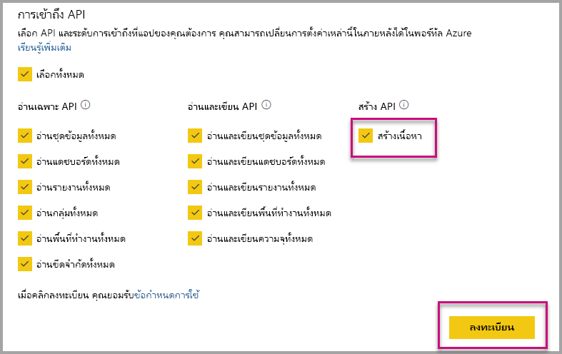

# ติดตั้งแอป Power BI อัตโนมัติเมื่อมีการฝังสำหรับองค์กรของคุณ

หากต้องการฝังเนื้อหาจากแอป ผู้ใช้ที่เป็นผู้ฝังจะต้องมี[สิทธิ์การเข้าถึงแอป](../../collaborate-share/service-create-distribute-apps.md) ถ้าติดตั้งแอปสำหรับผู้ใช้แล้ว การฝังจะทำงานได้อย่างราบรื่น สำหรับข้อมูลเพิ่มเติม โปรดดูที่[ฝังรายงานหรือแดชบอร์ดจากแอป](embed-from-apps.md) คุณสามารถกำหนดใน PowerBI.com ที่ทุกแอปสามารถ[ติดตั้งได้โดยอัตโนมัติ](https://powerbi.microsoft.com/blog/automatically-install-apps/) อย่างไรก็ตาม การดำเนินการนี้จะต้องทำในระดับผู้เช่า และใช้กับทุกแอป

## ติดตั้งแอปโดยอัตโนมัติเมื่อมีการฝัง

ถ้าผู้ใช้มีสิทธิ์เข้าถึงแอป แต่ยังไม่ได้ติดตั้งแอป การฝังจะล้มเหลว เพื่อหลีกเลี่ยงความล้มเหลวเหล่านี้เมื่อมีการฝังจากแอป คุณสามารถอนุญาตให้ติดตั้งแอปโดยอัตโนมัติ เมื่อมีการฝังได้ การดำเนินการนี้หมายความว่า ถ้าไม่ได้ติดตั้งแอปที่ผู้ใช้พยายามที่จะฝัง ระบบจะติดตั้งให้คุณโดยอัตโนมัติ ดังนั้น เนื้อหาคุณที่ต้องการจะถูกฝังทันที ซึ่งเป็นประสบการณ์การใช้งานที่ราบรื่นสำหรับผู้ใช้

## การฝังสำหรับผู้ใช้ Power BI (ผู้ใช้เป็นเจ้าของข้อมูล)

หากต้องการอนุญาตให้ติดตั้งแอปโดยอัตโนมัติสำหรับผู้ใช้ของคุณ คุณจะต้องให้สิทธิ์ 'สร้างเนื้อหา' แก่แอปพลิเคชันของคุณเมื่อ[ลงทะเบียนแอปพลิเคชัน](register-app.md#register-with-the-power-bi-application-registration-tool) หรือเพิ่ม ถ้าคุณลงทะเบียนแอปไว้อยู่แล้ว

ถัดไป คุณจะต้องระบุ ID แอปใน URL ที่ฝังไว้ ในการให้ข้อมูล ID แอป ผู้สร้างแอปจะต้องติดตั้งแอปก่อน จากนั้นใช้การเรียกใช้ [Power BI Rest API](https://docs.microsoft.com/rest/api/power-bi/) รายการใดรายการหนึ่งที่รองรับ - [รับรายงาน](https://docs.microsoft.com/rest/api/power-bi/reports/getreports)หรือ[รับแดชบอร์ด](https://docs.microsoft.com/rest/api/power-bi/dashboards/getdashboards) จากนั้น ผู้สร้างแอปจะต้องใช้ Url ที่ฝังไว้จากการตอบสนอง REST API ID แอปจะปรากฏใน URL ถ้าเนื้อหามาจากแอป  หลังจากที่คุณฝัง URL แล้ว คุณจะสามารถใช้เพื่อฝังได้อย่างสม่ำเสมอ

## การฝังที่ปลอดภัย

หากต้องการใช้ติดตั้งแอปโดยอัตโนมัติ ผู้สร้างแอปจะต้องติดตั้งแอปก่อน จากนั้นไปที่แอปบน PowerBI.com นำทางไปยังรายงาน และรับลิงก์ตามปกติ ผู้ใช้อื่น ๆ ทั้งหมดที่มีสิทธิ์การเข้าถึงแอปที่สามารถใช้ลิงก์จะสามารถฝังรายงานได้

## ข้อควรพิจารณาและข้อจำกัด

* คุณสามารถฝังรายงานและแดชบอร์ดสำหรับสถานการณ์นี้ได้เท่านั้น

* ในขณะน้ี ระบบไม่รองรับคุณลักษณะนี้สำหรับแอปที่เป็นเจ้าของข้อมูล และสถานการณ์ที่ฝังใน SharePoint