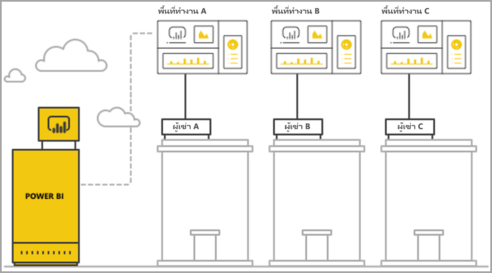
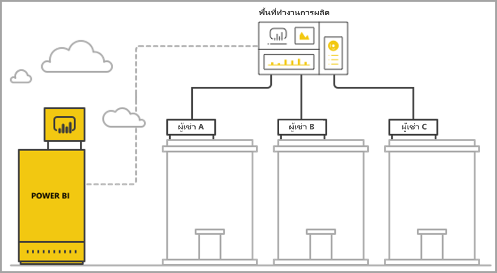

# จัดการการเช่าหลายรายการด้วยการวิเคราะห์ของ Power BI Embedded

เมื่อออกแบบแอปพลิเคชัน SaaS แบบหลายผู้เช่า คุณต้องเลือกแบบจำลองการเช่าอย่างระมัดระวังให้เหมาะสมกับความต้องการแอปพลิเคชัน SaaS ของคุณที่สุด กระบวนการนี้ยังใช้ได้กับ Power BI ในฐานะส่วนการวิเคราะห์แบบฝังตัวของแอปพลิเคชัน SaaS ของคุณ แบบจำลองการเช่าจะกำหนดวิธีการแมปและการจัดการข้อมูลของผู้เช่าแต่ละรายภายใน Power BI และบัญชีการจัดเก็บ แบบจำลองการเช่าของคุณจะมีผลต่อการออกแบบและการจัดการแอปพลิเคชัน สลับไปยังแบบจำลองอื่นในภายหลังอาจมีค่าใช้จ่ายสูงและเกิดความเสียหายได้

ด้วย Power BI Embedded มีแนวทางพื้นฐานหลักสองทางเพื่อรักษาการแยกระหว่างผู้เช่า

   1. **การแยกตามพื้นที่ทำงาน** - สร้างพื้นที่ทำงาน Power BI แยกต่างหากต่อผู้เช่า
   2. **การแยกตามการรักษาความปลอดภัยระดับแถว** - เมื่อใช้ข้อมูลเบื้องต้นเพื่อควบคุมและจัดการการเข้าถึงข้อมูลต่อผู้ใช้หรือกลุ่ม

บทความนี้อธิบายแนวทางที่แตกต่างกันและวิเคราะห์ตามเกณฑ์การประเมินหลายประการ

## แนวคิดและศัพท์เฉพาะ

**[AAD](https://docs.microsoft.com/azure/active-directory/fundamentals/active-directory-whatis)** - Azure Active Directory

**แอปพลิเคชัน AAD** - ข้อมูลประจำตัวของแอปพลิเคชันใน AAD แอปพลิเคชัน AAD จำเป็นต้องมีการรับรองความถูกต้อง

**แอปพลิเคชัน SaaS (การให้บริการซอฟต์แวร์)** - องค์กรหรือ ISV เป็นผู้นำระบบมาใช้ โดยปกติแล้วจะเป็นบริการออนไลน์ นอกจากนี้ยังเกี่ยวข้องกับระบบซอฟต์แวร์สำหรับการให้บริการผู้เช่าลูกค้าหลายราย (องค์กร) สำหรับบทความนี้ **แอปพลิเคชัน SaaS ใช้ Power BI Embedded เพื่อวิเคราะห์ผู้เช่าที่แตกต่างกัน** Power BI Embedded ยังสามารถทำงานให้กับแอปพลิเคชันทุกประเภท เมื่อแอปพลิเคชันเหล่านั้นมีการเชื่อมต่อออนไลน์

**ผู้เช่า** - ลูกค้ารายเดียว (องค์กร) ที่ใช้แอปพลิเคชัน SaaS และทรัพยากรหรือแหล่งข้อมูลใด ๆ ที่ลูกค้านำมาใช้กับแอปพลิเคชัน SaaS

**[Power BI](../../fundamentals/power-bi-overview.md)** - บริการ Cloud ของ Power BI ที่ให้บริการเป็นแพลตฟอร์มสำหรับ Power BI Embedded

**ผู้เช่า power BI** - คือชุดทรัพยากร Power BI ที่เกี่ยวข้องกับผู้เช่า AAD รายเดียว

**[พื้นที่ทำงานของ Power BI](../../collaborate-share/service-create-workspaces.md)** - คอนเทนเนอร์สำหรับเนื้อหาใน Power BI

**วัตถุของ Power BI** - มีวัตถุของ Power BI หลายชิ้นในพื้นที่ทำงานของ Power BI เช่น แดชบอร์ด รายงาน ชุดข้อมูล และกระแสข้อมูล

**[Power BI Embedded](azure-pbie-what-is-power-bi-embedded.md)** - ชุดของ API สาธารณะที่อนุญาตให้นักพัฒนาสร้างแอปพลิเคชันที่จัดการเนื้อหา Power BI และองค์ประกอบ Power BI ที่ฝังไว้

**[การรักษาความปลอดภัยระดับแถว (RLS)](embedded-row-level-security.md)** - ช่วยให้สามารถควบคุมผู้ใช้เข้าถึงข้อมูลสำหรับแต่ละแถวในตาราง คุณสามารถใช้การรักษาความปลอดภัยระดับแถวที่ระดับแหล่งข้อมูลหรือในแบบจำลองเชิงความหมายของ Power BI

**ผู้ใช้หลัก** - ข้อมูลประจำตัวที่แสดงถึงแอปพลิเคชัน SaaS ใน Power BI และแอปพลิเคชัน SaaS ดังกล่าวจะใช้เมื่อเรียกใช้ API ของ Power BI ต้องเป็นผู้ใช้ AAD พร้อมสิทธิ์การใช้งาน Power BI Pro

**ผู้ใช้แอปพลิเคชัน AAD (บริการหลัก)** - ข้อมูลประจำตัวที่แสดงถึงแอปพลิเคชัน SaaS ใน Power BI และแอปพลิเคชัน SaaS ดังกล่าวจะใช้เมื่อเรียกใช้ API ของ Power BI ต้องเป็นแอปพลิเคชันบนเว็บ AAD สามารถใช้แทนผู้ใช้*หลัก*เพื่อรับรองความถูกต้องกับ Power BI ได้

**กำลังการผลิต** - ชุดของทรัพยากรที่ใช้ไปกับการให้บริการ Power BI [กำลังการผลิตแบบพรีเมียมของ Power BI](../../admin/service-premium-what-is.md) มีไว้สำหรับ บริษัทองค์กรที่ใช้ Power BI แบบภายใน ส่วน[ความจุ Power BI Embedded](azure-pbie-create-capacity.md) มีไว้สำหรับนักพัฒนาแอปพลิเคชันเพื่อพัฒนาแอปพลิเคชัน SaaS ให้กับบุคคลที่สาม

**[สิทธิ์การใช้งาน Power BI Pro](../../admin/service-admin-purchasing-power-bi-pro.md)** - สิทธิ์การใช้งานตามผู้ใช้ ซึ่งจะมีสิทธิ์ในการเผยแพร่เนื้อหาไปยังพื้นที่ทำงาน ใช้แอปโดยไม่ต้องมีความจุแบบพรีเมียม แชร์แดชบอร์ด และสมัครใช้งานแดชบอร์ดและรายงานได้

**[โหมดการเชื่อมต่อข้อมูล](../../connect-data/desktop-directquery-about.md)** - เชื่อมต่อแหล่งข้อมูลไปยัง Power BI ที่สามารถทำได้ในโหมดที่แตกต่างกัน:

   * นำเข้า - ซึ่งเป็นวิธีที่พบมากที่สุดในการรับข้อมูล
   * DirectQuery - เชื่อมต่อโดยตรงไปยังข้อมูลในที่เก็บแหล่งข้อมูล
   * การเชื่อมต่อสด - โหมดอื่นที่เชื่อมต่อโดยตรงกับข้อมูล Analysis Services (ทั้ง Azure และภายในองค์กร)

## เกณฑ์การประเมิน

ตัวเลือกที่เหมาะสมสำหรับแบบจำลองการเช่าที่ถูกต้องสำหรับแอปพลิเคชัน SaaS ของคุณจะแตกต่างกันตามธุรกิจเฉพาะ และข้อกำหนดด้านเทคนิค ข้อมูลสถาปัตยกรรม และอื่น ๆ การทำความเข้าใจอย่างลึกซึ้งถึงข้อกำหนดเหล่านี้พร้อมกับตัวเลือกแบบจำลองการเช่าและการแลกเปลี่ยนที่มีอยู่ สามารถช่วยกำหนดสถาปัตยกรรมที่มีเสถียรภาพ ประสิทธิภาพ คุ้มค่า และปรับขนาดได้สำหรับแอปพลิเคชัน SaaS ของคุณ

ต่อไปนี้คือชุดของพื้นที่ที่ต้องพิจารณาเมื่อเลือกระหว่างแบบจำลองการเช่าที่แตกต่างกัน

### สถาปัตยกรรมข้อมูล

โดยปกติแล้ว นักพัฒนาที่สร้างแอปพลิเคชันด้วย Power BI Embedded จะมีฐานข้อมูลผู้เช่ารายเดียวหรือหลายผู้เช่าอยู่แล้ว จะเป็นการสะดวกกว่าหากใช้แบบจำลองการเช่าสำหรับ Power BI Embedded ซึ่งจะคล้ายกับแบบจำลองการเช่าของฐานข้อมูล หากยังไม่ได้กำหนดแบบจำลองการเช่าฐานข้อมูล คุณอาจต้องพิจารณามุมมองอื่น ๆ ก่อนตัดสินใจเลือกสถาปัตยกรรมข้อมูลของคุณ

### การแยกข้อมูล

ข้อมูลที่จัดเก็บมีความละเอียดอ่อนมากน้อยเพียงใด กรุณาระบุระดับการแยกที่คุณจำเป็นต้องแยกผู้เช่าลูกค้าที่แตกต่างกัน คำตอบอาจแตกต่างกันไปตามอุตสาหกรรมต่าง ๆ หรือลูกค้าเฉพาะที่มีความต้องการบางอย่าง

### ความสามารถในการขยาย

ในการค้นหาโซลูชันที่ดีที่สุด กำหนดมาตราส่วนที่คุณเข้าถึงในอนาคตที่คาดการณ์ได้ โปรดทราบว่าโซลูชันที่อาจเหมาะสมขณะนี้อาจไม่เพียงพอเมื่อมีการใช้งานและข้อมูลเพิ่มขึ้น เมื่อวิเคราะห์ความสามารถในการขยาย กรุณาพิจารณารายการต่อไปนี้:

   * จำนวนผู้เช่า (ลูกค้า)
   * จำนวนรายงาน แดชบอร์ด และชุดข้อมูลสำหรับผู้เช่าแต่ละราย
   * ขนาดของข้อมูลในแต่ละชุดข้อมูลและความถี่ของการรีเฟรช
   * จำนวนผู้ใช้
   * จำนวนผู้ใช้พร้อมกันในเวลาสูงสุด

แอปพลิเคชัน SaaS บางส่วนอาจมีจำนวนลูกค้าต่ำและการใช้งานต่ำ แต่มีปริมาณข้อมูลจำนวนมาก แอปพลิเคชันอื่น ๆ อาจมีลูกค้าจำนวนมากและการใช้งานสูง แต่มีปริมาณข้อมูลและรายงานจำนวนน้อยสำหรับลูกค้าแต่ละราย จำนวนที่สูงในสถานการณ์เหล่านี้อาจส่งผลต่อต้นทุนในอนาคตและความซับซ้อนในการดำเนินงาน

### ระบบอัตโนมัติและความซับซ้อนในการดำเนินงาน

ระบุกระบวนการที่เกิดขึ้นบ่อยซึ่งจำเป็นต้องใช้ระบบอัตโนมัติ

   * กรุณาระบุความถี่ของการเตรียมความพร้อมกับผู้เช่าใหม่ การดำเนินการที่จำเป็นในการเตรียมความพร้อมทั้งหมดกับผู้เช่าแต่ละรายคืออะไร
   * กรุณาระบุช่วงเวลาการนำออกใช้สำหรับเนื้อหา Power BI ใหม่หรือที่อัปเดตแล้ว ซึ่งจำเป็นต้องมีการปรับใช้
   * มีการกำหนดการรักษาความปลอดภัยระดับแถวกี่บทบาทสำหรับผู้เช่าแต่ละราย  

การระบุกระบวนการเหล่านี้และวิธีการที่คุณจัดการปัญหา สามารถช่วยให้คุณเข้าใจความซับซ้อนในการดำเนินงานที่เกี่ยวข้องในการบำรุงรักษาแบบจำลองแต่ละรุ่น

### ความต้องการที่อยู่ข้อมูลและความต้องการในการสนับสนุนภูมิศาสตร์หลายแห่ง

Power BI Embedded สนับสนุนการปรับใช้แบบ multi-geo (คุณลักษณะตัวอย่าง) [Multi-Geo](embedded-multi-geo.md) ช่วยให้ทรัพยากรของ Power BI Embedded นำมาปรับใช้ในภูมิภาคต่าง ๆ ด้วยเนื้อหาเฉพาะที่กำหนดให้อยู่ในภูมิภาคที่เฉพาะเจาะจง คุณลักษณะนี้สามารถใช้ได้กับแบบจำลองทั้งหมด แต่อาจส่งผลต่อปริมาณของเนื้อหาในการจัดการและคำนวณต้นทุน ปัจจุบัน multi-geo ได้รับการออกแบบมาเพื่อตอบสนองความต้องการที่อยู่ข้อมูล และไม่ได้ปรับปรุงประสิทธิภาพโดยการย้ายข้อมูลเข้าใกล้ลูกค้ามากขึ้น

### ค่าใช้จ่าย

[Power BI Embedded](azure-pbie-what-is-power-bi-embedded.md) มีแบบจำลองการซื้อตามทรัพยากร เหมือนกับ **Power BI Premium** คุณซื้อหนึ่งกำลังการผลิตหรือมากกว่าพร้อมกำลังการประมวลผลและหน่วยความจำแบบคงที่ กำลังการผลิตนี้เป็นสินค้าต้นทุนหลักเมื่อทำงานกับ **Power BI Embedded** ไม่มีการจำกัดจำนวนของผู้ใช้ขณะที่ใช้กำลังการผลิต มีข้อจำกัดเดียวคือประสิทธิภาพของกำลังการผลิต ผู้ใช้[หลัก](../../admin/service-admin-licensing-organization.md)แต่ละรายหรือหรือผู้ใช้ที่จำเป็นต้องเข้าถึงพอร์ทัล Power BI ต้องมี*สิทธิ์การใช้งาน Power BI Pro*

เราขอแนะนำให้ทดสอบและวัดโหลดที่คาดไว้บนกำลังการผลิตของคุณ โดยการจำลองสภาพแวดล้อมและการใช้แบบสด ตลอดจนเรียกใช้การทดสอบโหลดบนกำลังการผลิต คุณสามารถวัดโหลดและประสิทธิภาพด้วยเมตริกต่าง ๆ ที่พร้อมใช้งานในกำลังการผลิตของ Azure หรือ[แอปเมตริกกำลังการผลิตแบบพรีเมียม](../../admin/service-admin-premium-monitor-capacity.md)ได้

### การปรับแก้และการเขียนแก้เนื้อหา

แอปพลิเคชัน SaaS มีสองแนวทางในการมอบความสามารถแก่ผู้ใช้ในการแก้ไขและสร้างรายงาน หรืออัปโหลดข้อมูลลงในบริการที่เป็นส่วนหนึ่งของโฟลว์:

   * [โหมดแก้ไข/สร้างใน iFrame แบบฝังตัว](https://github.com/Microsoft/PowerBI-JavaScript/wiki/Create-Report-in-Embed-View) - ผู้ใช้จะได้รับมุมมองรายงานหรือพื้นที่ว่างเปล่าใหม่ภายในแอปพลิเคชัน SaaS ด้วยวิธีนี้ สามารถใช้แถบเครื่องมือ Power BI เพื่อสร้างเนื้อหาตามชุดข้อมูลในพื้นที่ทำงาน เราขอแนะนำตัวเลือกนี้ เนื่องจากอยู่ในบริบทของผู้ใช้ในสภาพแวดล้อมที่คุ้นเคย ซึ่งสามารถเริ่มต้นทำงานและแก้ไขได้ง่ายกว่า และผู้ใช้สามารถสร้างรายงานที่แนบไปกับชุดข้อมูลที่มีอยู่ได้

   * ใช้ Power BI Desktop เพื่อสร้างเนื้อหาและอัปโหลดผ่าน UI แอปพลิเคชัน SaaS ไปยังพื้นที่ทำงาน ในแนวทางนี้ ผู้ใช้จะมีเครื่องมือมากขึ้นในการทำงานโดยใช้ Power BI Desktop อย่างไรก็ตาม เราไม่แนะนำแนวทางนี้ เนื่องจากผู้ใช้จำเป็นต้องคุ้นเคยกับเครื่องมือเพิ่มเติมภายนอกบริบทของแอปพลิเคชัน SaaS การอัปโหลดไฟล์ PBIX หมายถึง ผู้ใช้กำลังเพิ่มชุดข้อมูลเพิ่มเติม ซึ่งอาจเป็นรายการซ้ำของชุดข้อมูลที่มีอยู่แล้วในพื้นที่ทำงาน

## การแยกตามพื้นที่ทำงานของ power BI

ด้วยการแยกตามพื้นที่ทำงานของ Power BI แอปพลิเคชัน SaaS จะสนับสนุนหลายผู้เช่าจากผู้เช่า Power BI รายเดียว การแยกตามพื้นที่ทำงานประกอบด้วยเนื้อหา Power BI ทั้งหมดที่ผู้เช่าอื่นใช้ การแยกผู้เช่าจะดำเนินการเสร็จสิ้นในระดับพื้นที่ทำงานของ Power BI โดยการสร้างพื้นที่ทำงานหลายพื้นที่ พื้นที่ทำงานแต่ละแห่งประกอบด้วยชุดข้อมูล รายงาน และแดชบอร์ดที่เกี่ยวข้องกับผู้เช่าดังกล่าว นอกจากนี้ พื้นที่ทำงานแต่ละแห่งเชื่อมต่อเฉพาะกับข้อมูลของผู้เช่าดังกล่าว หากคุณต้องดำเนินการแยกเพิ่มเติม คุณสามารถสร้างผู้ใช้*หลัก*หรือบริการหลักสำหรับพื้นที่ทำงานแต่ละแห่งและเนื้อหาได้

### สถาปัตยกรรมข้อมูล

มีสองแนวทางหลักในการจัดการข้อมูลของผู้เช่า

* ฐานข้อมูลแยกต่อผู้เช่า
* ฐานข้อมูลเดียวแบบหลายผู้เช่า

หากพื้นที่จัดเก็บของแอปพลิเคชัน SaaS กำลังจัดเก็บฐานข้อมูลแยกต่อผู้เช่าอยู่ ดังนั้น ตัวเลือกที่มีให้คือการใช้ชุดข้อมูลผู้เช่ารายเดียวใน Power BI ด้วยสตริงการเชื่อมต่อสำหรับแต่ละชุดข้อมูลที่ชี้ไปยังฐานข้อมูลที่ตรงกัน

หากพื้นที่จัดเก็บของแอปพลิเคชัน SaaS กำลังใช้ฐานข้อมูลการเช่าหลายรายการสำหรับผู้เช่าทั้งหมด การแยกผู้เช่าตามพื้นที่ทำงานก็สามารถดำเนินการได้อย่างง่ายดาย คุณสามารถกำหนดค่าการเชื่อมต่อฐานข้อมูลสำหรับชุดข้อมูล Power BI ด้วยคิวรีฐานข้อมูลที่มีการกำหนดพารามิเตอร์ซึ่งเรียกใช้เฉพาะข้อมูลของผู้เช่าเกี่ยวข้อง คุณสามารถอัปเดตการเชื่อมต่อโดยใช้ [Power BI Desktop](../../transform-model/desktop-query-overview.md) หรือใช้ [API](https://docs.microsoft.com/rest/api/power-bi/datasets/updatedatasourcesingroup) กับ[พารามิเตอร์](https://docs.microsoft.com/rest/api/power-bi/datasets/updateparametersingroup)บนคิวรี

### การแยกข้อมูล

ข้อมูลในแบบจำลองการเช่านี้ถูกแยกจากกันในระดับพื้นที่ทำงาน การแมปอย่างง่ายระหว่างพื้นที่ทำงานและผู้เช่าจะช่วยป้องกันไม่ให้ผู้ใช้จากผู้เช่าหนึ่งมองเห็นเนื้อหาจากผู้เช่าอื่น ในการใช้ผู้ใช้*หลัก*รายเดียว คุณต้องสามารถเข้าถึงพื้นที่ทำงานต่าง ๆ ได้ทั้งหมด มีการกำหนดค่าของข้อมูลที่จะแสดงให้ผู้ใช้ปลายทางดูในระหว่าง[การสร้างโทเค็นที่ฝังไว้](https://docs.microsoft.com/rest/api/power-bi/embedtoken) ซึ่งเป็นกระบวนการเฉพาะส่วนหลังซึ่งผู้ใช้ปลายทางไม่สามารถดูหรือเปลี่ยนแปลงได้

ในการเพิ่มการแยกเพิ่มเติม นักพัฒนาแอปพลิเคชันสามารถกำหนดผู้ใช้*หลัก*หรือแอปพลิเคชันต่อพื้นที่ทำงานมากกว่าผู้ใช้*หลัก*รายเดียว หรือแอปพลิเคชันที่สามารถเข้าถึงพื้นที่ทำงานได้หลายพื้นที่ ด้วยวิธีนี้ คุณจะมั่นใจได้ว่าหากเกิดข้อผิดพลาดจากมนุษย์หรือการรั่วไหลของข้อมูลประจำตัว จะไม่ทำให้ข้อมูลของลูกค้าหลายรายถูกเปิดเผย

### ความสามารถในการขยาย

ข้อดีประการหนึ่งของแบบจำลองนี้คือ การแยกข้อมูลเป็นชุดข้อมูลหลายชุดสำหรับผู้เช่าแต่ละรายจะไม่มีปัญหากับ[ขีดจำกัดขนาดของชุดข้อมูลเดียว ](https://docs.microsoft.com/power-bi/service-premium-large-datasets)(ความจุ 10 GB ในปัจจุบัน) เมื่อความจุโอเวอร์โหลด สามารถลบชุดข้อมูลที่ไม่ได้ใช้เพื่อเพิ่มหน่วยความจำสำหรับชุดข้อมูลที่ใช้งานอยู่ งานนี้ไม่สามารถใช้ชุดข้อมูลเดียวที่มีขนาดใหญ่ นอกจากนี้ การใช้ชุดข้อมูลหลายชุดยังสามารถแยกผู้เช่าเป็นกำลังการผลิต Power BI หลายรายการเมื่อจำเป็น

แม้ว่าจะมีข้อดีหลายประการ สิ่งหนึ่งที่ต้องพิจารณาคือมาตราส่วนที่แอปพลิเคชัน SaaS สามารถเข้าถึงในอนาคต เช่น อาจถึงขีดจำกัดใกล้เคียงจำนวนวัตถุที่สามารถจัดการได้ ดู[ข้อจำกัด](#summary-comparison-of-the-different-approaches)การปรับใช้ในภายหลังในบทความนี้สำหรับรายละเอียดเพิ่มเติม SKU ของความจุที่ใช้แนะนำการจำกัดขนาดของหน่วยความจำที่ชุดข้อมูลที่จำเป็นต้องมีพอดี จำนวนการรีเฟรชที่สามารถเรียกใช้ได้พร้อมกัน และความถี่สูงสุดของการรีเฟรชข้อมูล เราขอแนะนำให้ดำเนินการทดสอบเมื่อจัดการชุดข้อมูลหลายร้อยหรือหลายพันชุด นอกจากนี้ยังแนะนำให้พิจารณาค่าเฉลี่ยและปริมาณสูงสุดของการใช้งาน ตลอดจนผู้เช่าที่เฉพาะเจาะจงใด ๆ ที่มีชุดข้อมูลขนาดใหญ่ หรือรูปแบบการใช้งานที่แตกต่างกัน ซึ่งจะได้รับการจัดการที่แตกต่างจากผู้เช่าอื่น ๆ

### ระบบอัตโนมัติและความซับซ้อนในการดำเนินงาน

ด้วยการแยกตามพื้นที่ทำงานของ Power BI นักพัฒนาแอปพลิเคชันอาจต้องจัดการวัตถุหลายร้อยหรือหลายพันชิ้น จึงจำเป็นต้องกำหนดกระบวนการที่เกิดขึ้นบ่อยครั้งในการจัดการวงจรชีวิตของแอปพลิเคชันของคุณ และเพื่อให้แน่ใจว่าคุณมีชุดเครื่องมือที่เหมาะสมกับการดำเนินการเหล่านี้ตามมาตราส่วนในแบบจำลองการเช่านี้ การดำเนินการตัวอย่างบางส่วนรวมถึง:

   * การเพิ่มผู้เช่าใหม่ (ลูกค้า)
   * การอัปเดตรายงานหรือแดชบอร์ดสำหรับผู้เช่าบางส่วนหรือทั้งหมด
   * การอัปเดต schema ชุดข้อมูลสำหรับผู้เช่าบางส่วนหรือทั้งหมด
   * การปรับแก้ที่ไม่ได้วางแผนไว้สำหรับผู้เช่าเฉพาะ
   * ความถี่ของการรีเฟรชชุดข้อมูล

ตัวอย่าง การสร้างพื้นที่ทำงานสำหรับผู้เช่าใหม่ถือว่าเป็นงานทั่วไป ซึ่งจำเป็นต้องใช้ระบบอัตโนมัติ ด้วย [Power BI REST API](https://docs.microsoft.com/rest/api/power-bi/) คุณสามารถใช้งาน[ระบบอัตโนมัติได้อย่างเต็มรูปแบบเมื่อสร้างพื้นที่ทำงาน](https://powerbi.microsoft.com/blog/duplicate-workspaces-using-the-power-bi-rest-apis-a-step-by-step-tutorial/)

### ความต้องการของ Multi-Geo

Multi-Geo เกี่ยวข้องกับการซื้อกำลังการผลิตในภูมิภาคที่ต้องการ และกำหนดพื้นที่ทำงานตามกำลังการผลิตดังกล่าว หากคุณต้องการสนับสนุนผู้เช่าอื่นในภูมิภาคต่าง ๆ คุณจำเป็นต้องกำหนดพื้นที่ทำงานของผู้เช่าตามกำลังการผลิตในภูมิภาคที่ต้องการ งานนี้เป็นการดำเนินการอย่างง่ายและมีต้นทุนไม่เกินพื้นที่ทำงานทั้งหมดในกำลังการผลิตเดียวกัน อย่างไรก็ตาม หากคุณมีผู้เช่าที่ต้องการที่อยู่ข้อมูลในหลายภูมิภาค จำเป็นต้องทำซ้ำวัตถุทั้งหมดในพื้นที่ทำงานในกำลังการผลิตแต่ละภูมิภาค ซึ่งทำให้มีต้นทุนและความซับซ้อนในการจัดการเพิ่มขึ้น

### ค่าใช้จ่าย

นักพัฒนาแอปพลิเคชันที่ใช้ Power BI Embedded จำเป็นต้อง[ซื้อกำลังการผลิตของ Power BI Embedded เพื่อไปใช้ในการผลิต](embed-sample-for-customers.md#move-to-production)  ต้องทำความเข้าใจผลกระทบของแบบจำลองการแยกตามพื้นที่ทำงานและผลกระทบของกำลังการผลิต

แบบจำลองการแยกตามพื้นที่ทำงานได้ดีกับกำลังการผลิตเนื่องจากเหตุผลต่อไปนี้:

   * คุณสามารถกำหนดวัตถุที่เล็กที่สุดให้กับกำลังการผลิตตามพื้นที่ทำงานได้อย่างอิสระ แต่ไม่สามารถกำหนดรายงานได้ ดังนั้น การแยกผู้เช่าด้วยพื้นที่ทำงาน คุณจะมีความยืดหยุ่นสูงในการจัดการผู้เช่าแต่ละรายและความต้องการด้านประสิทธิภาพ รวมถึงการใช้งานกำลังการผลิตที่ปรับให้เหมาะสมโดยปรับมาตราส่วนขึ้น/ลง ตัวอย่าง สามารถจัดการผู้เช่ารายสำคัญขนาดใหญ่ที่มีปริมาณและความผันผวนสูงในกำลังการผลิตแยก เพื่อให้แน่ใจว่ามีระดับการบริการที่สอดคล้องกัน ขณะจัดกลุ่มผู้เช่าที่มีขนาดเล็กกว่าในกำลังการผลิตอื่นเพื่อปรับให้เหมาะสมกับต้นทุน

   * นอกจากนี้ การแยกพื้นที่ทำงานยังหมายความถึงการแยกชุดข้อมูลระหว่างผู้เช่า เพื่อให้แบบจำลองข้อมูลกลายเป็นกลุ่มขนาดเล็กแทนชุดข้อมูลเดียวขนาดใหญ่ งานนี้จะช่วยให้กำลังการผลิตจัดการการใช้หน่วยความจำได้ดียิ่งขึ้น รวมถึงลบชุดข้อมูลขนาดเล็กและที่ไม่ได้ใช้เมื่อไม่จำเป็น ขณะที่ยังมอบความพึงพอใจแก่ผู้ใช้ในด้านประสิทธิภาพ

นักพัฒนาแอปพลิเคชันต้องพิจารณาขีดจำกัดจำนวนการรีเฟรชพร้อมกัน เนื่องจากกระบวนการรีเฟรชอาจต้องใช้กำลังการผลิตเพิ่มเติมเมื่อคุณมีชุดข้อมูลหลายชุด

### การปรับแก้และการเขียนแก้เนื้อหา

สำหรับกรณีการใช้หลักของการสร้างเนื้อหา นักพัฒนาแอปพลิเคชันต้องพิจารณาอย่างถี่ถ้วนว่า ผู้เช่ารายใดมีความสามารถในการแก้ไขได้ และผู้ใช้กี่คนในผู้เช่าแต่ละรายที่สามารถแก้ไขได้ การอนุญาตให้ผู้ใช้หลายคนในผู้เช่าแต่ละรายแก้ไข อาจทำให้เกิดการสร้างเนื้อหามากมาย ซึ่งสามารถไปถึงข้อจำกัดของชุดข้อมูล เช่น จำนวนรายงานต่อชุดข้อมูล หรือจำนวนชุดข้อมูลในพื้นที่ทำงาน หากคุณมอบความสามารถนี้แก่ผู้ใช้ เราขอแนะนำให้ตรวจสอบการสร้างเนื้อหาอย่างใกล้ชิด และปรับมาตราส่วนขึ้นตามความจำเป็น ด้วยเหตุผลเดียวกันนี้ เราไม่แนะนำให้ใช้ความสามารถนี้สำหรับการตั้งค่าส่วนบุคคลของเนื้อหา เนื่องจากผู้ใช้แต่ละรายสามารถทำการเปลี่ยนแปลงเล็กน้อยกับรายงาน แล้วบันทึกเก็บไว้เป็นของตัวเอง หากแอปพลิเคชัน SaaS อนุญาตให้มีการตั้งค่าส่วนบุคคลของเนื้อหา ให้พิจารณานโยบายการเก็บข้อมูลพื้นที่ทำงานที่ใช้งานและสื่อสารสำหรับเนื้อหาเฉพาะผู้ใช้เพื่ออำนวยความสะดวกโฟลว์ของการลบเนื้อหา เมื่อผู้ใช้ปลายทางเลื่อนตำแหน่งใหม่ ลาออกจากบริษัท หรือไม่ได้ใช้แพลตฟอร์มแล้ว

## การแยกตามการรักษาความปลอดภัยระดับแถว

ด้วยการแยกตามการรักษาความปลอดภัยระดับแถว แอปพลิเคชัน SaaS จะใช้พื้นที่ทำงานเดียวเพื่อโฮสต์ผู้เช่าหลายราย นั่นหมายความว่าแต่ละวัตถุ รายงาน แดชบอร์ด และชุดข้อมูลของ Power BI ถูกสร้างขึ้นเมื่อผู้เช่าทั้งหมดใช้งาน การแยกข้อมูลระหว่างผู้เช่าสามารถทำได้โดยใช้[การรักษาความปลอดภัยระดับแถว](embedded-row-level-security.md)ในชุดข้อมูลแบบหลายผู้เช่า เมื่อผู้ใช้ปลายทางลงชื่อเข้าใช้แอปพลิเคชัน SaaS และเปิดเนื้อหา โทเค็นที่ฝังไว้จะถูกสร้างขึ้นสำหรับเซสชันของผู้ใช้ ซึ่งมีบทบาทและตัวกรองเพื่อให้แน่ใจว่าผู้ใช้เห็นเฉพาะข้อมูลที่อนุญาตให้เห็น หากผู้ใช้จากผู้เช่าเดียวกันไม่ได้รับอนุญาตให้ดูข้อมูลเดียวกัน นักพัฒนาแอปพลิเคชันต้องใช้บทบาทตามลำดับชั้นกับทั้งผู้เช่าและภายในผู้เช่าเดียวกัน

### สถาปัตยกรรมข้อมูล

การใช้การแยกตามการรักษาความปลอดภัยระดับแถวจะมีความสะดวกที่สุดเมื่อข้อมูลของผู้เช่าทั้งหมดถูกจัดเก็บไว้ในคลังข้อมูลเดียว ในกรณีนี้ นักพัฒนาแอปพลิเคชันสามารถส่งข้อมูลที่เกี่ยวข้องจากคลังข้อมูลไปยังชุดข้อมูลของ Power BI เท่านั้น โดยใช้ Direct Query หรือการนำเข้าข้อมูล หากข้อมูลในฐานข้อมูลถูกแยกจากกันต่อผู้เช่า จำเป็นต้องรวมฐานข้อมูลเป็นฐานข้อมูลเดียว ซึ่งส่งผลให้มีระดับการแยกที่ต่ำลงระหว่างผู้เช่าที่มีอยู่ในฐานข้อมูล

### การแยกข้อมูล

การแยกตามการรักษาความปลอดภัยระดับแถว การแยกข้อมูลสามารถทำได้โดยใช้[ข้อกําหนดการรักษาความปลอดภัยระดับแถว](embedded-row-level-security.md)ในชุดข้อมูล ซึ่งหมายความว่าข้อมูลทั้งหมดมีอยู่ร่วมกัน การแยกข้อมูลรูปแบบนี้มีความเสี่ยงต่อการรั่วไหลของข้อมูลจากข้อผิดพลาดของนักพัฒนามากกว่า แม้ว่าการรักษาความปลอดภัยระดับแถวจะทำได้บน backend และมีความปลอดภัยจากผู้ใช้ปลายทาง แต่หากข้อมูลมีความละเอียดอ่อนสูงหรือลูกค้าขอให้มีการแยกข้อมูล ควรใช้การแยกตามพื้นที่ทำงานจะเหมาะสมมากกว่า

### ความสามารถในการขยาย

ด้วยการแยกตามการรักษาความปลอดภัยระดับแถว ข้อมูลต้องมีขนาดพอดีกับขีดจำกัดขนาดชุดข้อมูล ซึ่งก็คือ 10 GB ในปัจจุบัน จากการนำ[การรีเฟรชแบบเพิ่มหน่วย](../../admin/service-premium-incremental-refresh.md)มาใช้และการนำออกใช้จุดสิ้นสุด XMLA ที่กำลังมาถึงสำหรับชุดข้อมูล Power BI ขีดจำกัดขนาดของชุดข้อมูลจะต้องเพิ่มขึ้นอย่างมาก อย่างไรก็ตาม ข้อมูลยังต้องมีขนาดพอดีกับหน่วยความจำของกำลังการผลิต พร้อมหน่วยความจำที่เหลืออยู่มากพอสำหรับการรีเฟรชข้อมูลเพื่อใช้งาน การปรับใช้ขนาดใหญ่จำเป็นต้องใช้ความจุขนาดใหญ่เพื่อหลีกเลี่ยงให้ผู้ใช้พบปัญหาต่าง ๆ เนื่องจากหน่วยความจำเกินขีดจำกัดของความจุปัจจุบัน วิธีอื่นในการจัดการมาตราส่วนที่รวมการใช้ [การรวม](../../transform-model/desktop-aggregations.md) หรือเชื่อมต่อกับแหล่งข้อมูลโดยตรงโดยใช้ DirectQuery หรือการเชื่อมต่อสด แทนการแคชข้อมูลทั้งหมดในความจุ Power BI

### ระบบอัตโนมัติและความซับซ้อนในการดำเนินงาน

การจัดการวัตถุจะมีความสะดวกมากกว่าเมื่อใช้การแยกตามการรักษาความปลอดภัยระดับแถวหากเทียบกับการแยกตามพื้นที่ทำงาน เนื่องจากมีวัตถุเพียงเวอร์ชันเดียวสำหรับแต่ละสภาพแวดล้อม (พัฒนา/ทดสอบ/การผลิต) แทนเวอร์ชันต่อผู้เช่า ที่มาตราส่วนขนาดใหญ่ การจัดการวัตถุหมายถึง การจัดการและการอัปเดตวัตถุสิบชิ้น ไม่ใช่หนึ่งพันถึงหนึ่งหมื่นชิ้น

Power BI ยังไม่มี API เพื่อปรับเปลี่ยนหรือสร้างบทบาทและกฎ RLS การเพิ่มหรือการเปลี่ยนบทบาทสามารถทำได้ด้วยตนเองเท่านั้นใน Power BI Desktop หากจำเป็นต้องใช้ลำดับชั้น RLS อาจมีความซับซ้อนและมีโอกาสเกิดข้อผิดพลาดในการจัดการหากคุณไม่วางแผนอย่างระมัดระวัง

หากนักพัฒนาแอปพลิเคชันจำเป็นต้องจัดการบทบาทและข้อกำหนดบทบาทหลายอย่างที่จำเป็นต้องสร้างหรืออัปเดตบ่อยครั้ง การแยกตามการรักษาความปลอดภัยระดับแถวจะปรับขนาดไม่ได้จากมุมมองความสามารถในการจัดการ

ความซับซ้อนในการดำเนินงานอื่นจะต้องตรวจสอบการใช้หน่วยความจำอย่างใกล้ชิด และสร้างกลไกการแจ้งเตือนที่มีประสิทธิภาพ รวมถึงการปรับมาตราส่วนเพื่อให้แน่ใจว่าผู้ใช้ได้รับประสบการณ์ที่ราบรื่น  

### ความต้องการของ Multi-Geo

เนื่องจากข้อมูลทั้งหมดถูกจัดเก็บอยู่ในชุดข้อมูลเดียว จึงเป็นสิ่งท้าทายที่ต้องตอบสนองความต้องการที่อยู่ข้อมูลที่จำเป็นต้องผูกข้อมูลบางอย่างกับตําแหน่งที่ตั้งเฉพาะ นอกจากนี้ ยังเพิ่มต้นทุนอย่างมากในการใช้ในหลายภูมิภาค เนื่องจากมีการทำซ้ำและจัดเก็บข้อมูลทั้งหมดในแต่ละภูมิภาค หากมีผู้เช่าในจำนวนจำกัดเท่านั้นซึ่งจำเป็นต้องใช้ภูมิศาสตร์อื่น คุณสามารถเก็บเฉพาะข้อมูลของผู้เช่าเหล่านั้นในภูมิภาคอื่น โดยใช้แบบจำลองการแยกตามพื้นที่ทำงานตามที่อธิบายไว้ข้างต้น

### ค่าใช้จ่าย

โปรแกรมควบคุมต้นทุนหลักที่มีการแยกการรักษาความปลอดภัยระดับแถวคือรอยเท้าหน่วยความจำของชุดข้อมูล คุณต้องมีความจุเพียงพอเพื่อจัดเก็บชุดข้อมูลและเก็บบัฟเฟอร์หน่วยความจำเพิ่มเติมบางส่วนสำหรับจุดสูงสุดใด ๆ ในความต้องการหน่วยความจำ วิธีหนึ่งในการลดสถานการณ์นี้คือการ จัดเก็บข้อมูลในฐานข้อมูล SQL Server หรือคิวบ์ SQL Server Analysis Services และใช้ Direct Query หรือการเชื่อมต่อสดเพื่อเรียกใช้ข้อมูลจากแหล่งข้อมูลในเวลาจริง วิธีนี้จะเพิ่มต้นทุนของแหล่งข้อมูล แต่จะลดความจำเป็นสำหรับความจุขนาดใหญ่เนื่องจากความต้องการของหน่วยความจำ ดังนั้น การลดต้นทุนของความจุ Power BI

### การปรับแก้และการเขียนแก้เนื้อหา

เนื่องจากผู้ใช้ปลายทางแก้ไขหรือสร้างรายงาน จึงสามารถใช้ชุดข้อมูลแบบหลายผู้เช่าสำหรับการผลิต ด้วยเหตุผลดังกล่าว เราขอแนะนำให้ใช้เฉพาะตัวเลือก iFrame แบบฝังตัวเพื่อแก้ไขหรือ[สร้างรายงาน](https://github.com/Microsoft/PowerBI-JavaScript/wiki/Create-Report-in-Embed-View) เนื่องจากต้องอาศัยชุดข้อมูลเดียวกันที่ใช้การรักษาความปลอดภัยระดับแถว เมื่อผู้ใช้อัปโหลดไฟล์ PBIX ที่มีชุดข้อมูลเพิ่มเติมอาจทำให้มีต้นทุนสูงและจัดการยากกับการแยกตามการรักษาความปลอดภัยระดับแถว นอกจากนี้ เมื่อผู้ใช้สร้างเนื้อหาใหม่ที่อยู่ในพื้นที่ทำงานเดียวกัน คุณต้องตรวจสอบให้แน่ใจว่าพื้นที่ทำงานการผลิตนั้นยังไม่ถึงขีดจำกัด และสร้างกลไกที่มีประสิทธิภาพเพื่อจำแนกว่าเนื้อหาใดเชื่อมต่อกับผู้เช่ารายใด

## สรุปการเปรียบเทียบวิธีที่แตกต่างกัน

> [!Important]
> การวิเคราะห์ต่อไปนี้อ้างอิงตามสถานะปัจจุบันของผลิตภัณฑ์ ขณะที่เรากำลังเผยแพร่คุณลักษณะใหม่ในช่วงเวลาแบบรายเดือน เรายังมอบความสามารถและคุณลักษณะใหม่ ๆ ที่ช่วยแก้ไขข้อจำกัดและจุดอ่อนที่มีอยู่ อย่าลืมตรวจสอบโพสต์ในบล็อกของเราทุกเดือนเพื่อดูว่ามีอะไรใหม่ และกลับมายังบทความนี้เพื่อดูคุณลักษณะใหม่ที่ส่งผลต่อคำแนะนำแบบจำลองการเช่า

| เกณฑ์การประเมิน | ตามพื้นที่ทำงาน   | ตามการรักษาความปลอดภัยระดับแถว  |  |  |
|--------------------------------------|----------------------------------------------------------------------------------------------------------------------|---------------------------------------------------------------------------------------|---|---|
| สถาปัตยกรรมข้อมูล  | ใช้งานง่ายที่สุดเมื่อมีฐานข้อมูลแยกต่อผู้เช่า  | ใช้งานง่ายที่สุดเมื่อข้อมูลทั้งหมดสำหรับผู้เช่าทั้งหมดอยู่ในคลังข้อมูลเดียว   |  |  |
| การแยกข้อมูล  | ดี ผู้เช่าแต่ละรายมีชุดข้อมูลเฉพาะ  | ปานกลาง ข้อมูลทั้งหมดอยู่ในชุดข้อมูลเดียวกันที่ใช้ร่วมกัน แต่มีการจัดการผ่านการควบคุมการเข้าถึง  |  |  |
| ความสามารถในการขยาย  | ปานกลาง การแบ่งข้อมูลเป็นชุดข้อมูลหลายชุดจะเปิดใช้งานการปรับให้เหมาะสมที่สุด  | ต่ำสุด จำกัดตามขีดจำกัดของชุดข้อมูล  |  |  |
| ความต้องการของ Multi-Geo  | พอดีเมื่อผู้เช่าส่วนใหญ่อยู่ในภูมิภาคเดียวกัน  | ไม่แนะนำ จำเป็นต้องจัดเก็บชุดข้อมูลทั้งหมดในหลายภูมิภาค  |  |  |
| ระบบอัตโนมัติและความซับซ้อนในการดำเนินงาน  | ระบบอัตโนมัติที่ดีสำหรับผู้เช่ารายบุคคล   ซับซ้อนในการจัดการวัตถุหลายอย่างในระดับมาตราส่วน  | ง่ายต่อการจัดการวัตถุของ Power BI แต่ซับซ้อนในการจัดการ RLS ในระดับมาตราส่วน  |  |  |
| ค่าใช้จ่าย  | ต่ำ-ปานกลาง สามารถปรับการใช้งานให้เหมาะสมเพื่อลดต้นทุนต่อผู้เช่า  อาจเพิ่มขึ้นเมื่อจำเป็นต้องรีเฟรชบ่อยครั้ง  | ปานกลาง-สูงหากใช้โหมดการนำเข้า  ต่ำ-ปานกลางหากใช้โหมด Direct Query  |  |  |
| การปรับแก้และการเขียนแก้เนื้อหา  | พอดี อาจถึงขีดจำกัดในระดับมาตราส่วนขนาดใหญ่  | การสร้างเนื้อหาใน iFrame แบบฝังตัวเท่านั้น  |  |  |

## การพิจารณาการปรับใช้และข้อจำกัด

**วัตถุของ Power BI จะจำกัด:**

* จำนวนพื้นที่ทำงาน V1 (กลุ่ม) ที่ผู้ใช้เดี่ยว/แอปพลิเคชันสามารถเป็นสมาชิก/ผู้ดูแลระบบคือ 250
* จำนวนพื้นที่ทำงาน V2 (โฟลเดอร์) ที่ผู้ใช้เดี่ยว/แอปพลิเคชันสามารถเป็นสมาชิก/ผู้ดูแลระบบคือ 1000
* จำนวนชุดข้อมูลในพื้นที่ทำงานเดียวคือ 1,000
* จำนวนรายงาน/แดชบอร์ดที่เชื่อมต่อกับชุดข้อมูลเดียวคือ 1,000
* ขีดจำกัดของขนาดหน่วยความจำของชุดข้อมูลเพื่ออัปโหลดไฟล์ *.pbix* คือ 10 GB

**การพิจารณาและข้อจำกัดความจุ Power BI:**

* แต่ละความจุสามารถใช้หน่วยความจำที่ได้รับการจัดสรรและแกน V เท่านั้น ตาม [SKU ที่ซื้อ](../../admin/service-premium-what-is.md)
* ขนาดชุดข้อมูลที่แนะนำสำหรับแต่ละ SKU โปรดดู[ชุดข้อมูลขนาดใหญ่แบบพรีเมียม](../../admin/service-premium-what-is.md#large-datasets)
* ขนาดชุดข้อมูลสูงสุดในความจุเฉพาะคือ 10 GB
* จำนวนการรีเฟรชตามกำหนดการสำหรับชุดข้อมูล*โหมดการนำเข้า*ในหนึ่งวันคือ 48
* เวลาระหว่างการรีเฟรชตามกำหนดการสำหรับชุดข้อมูล*โหมดการนำเข้า*คือ 30 นาที
* สำหรับจำนวนการรีเฟรชที่สามารถเรียกใช้พร้อมกันบนความจุ โปรดดู[การจัดการทรัพยากรและการปรับให้เหมาะสม](../../admin/service-premium-what-is.md#capacity-nodes)
* เวลาเฉลี่ยของการปรับมาตราส่วนความจุอยู่ระหว่าง 1-2 นาที ในระหว่างเวลาดังกล่าว ความจุจะไม่พร้อมใช้งาน เราแนะนำให้ใช้วิธีปรับมาตราส่วนแบบแนวราบเพื่อ[หลีกเลี่ยงการหยุดทำงาน](https://powerbi.microsoft.com/blog/power-bi-developer-community-november-update-2018/#scale-script)

## ขั้นตอนถัดไป

* [การวิเคราะห์แบบฝังตัวด้วย Power BI](embedding.md)
* [Power BI Embedded](azure-pbie-what-is-power-bi-embedded.md)
* [Power BI Premium](../../admin/service-premium-what-is.md)
* [การรักษาความปลอดภัยระดับแถว](embedded-row-level-security.md)
