# <a name="tutorial-embed-power-bi-paginated-reports-into-an-application-for-your-organization"></a>บทช่วยสอน: ฝังรายงานที่มีการแบ่งหน้าของ Power BI ในแอปพลิเคชันสำหรับองค์กรของคุณ

ใน **Power BI** คุณสามารถฝังรายงานที่มีการแบ่งหน้าลงในแอปพลิเคชันสำหรับองค์กรของคุณโดยใช้สถานการณ์จำลอง *ผู้ใช้เป็นเจ้าของข้อมูล*

รายงานแบบแบ่งหน้าคือรายงานที่ออกแบบมาสำหรับการพิมพ์ที่มีคุณภาพสูง โดยทั่วไปรายงานเหล่านี้ประกอบด้วยข้อมูลจำนวนมากซึ่งแสดงในลักษณะที่ทำให้มีการพิมพ์หน้าให้พอดี
หากต้องการทำความเข้าใจวิธีที่ Power BI รองรับรายงานที่มีการแบ่งหน้าดู [รายงานที่มีการแบ่งหน้าใน Power BI Premium คืออะไร](https://docs.microsoft.com/power-bi/paginated-reports-report-builder-power-bi)

**ผู้ใช้ที่เป็นเจ้าของข้อมูล** ช่วยให้แอปพลิเคชันของคุณขยายบริการ Power BI เพื่อใช้การวิเคราะห์แบบฝังตัว การสอนนี้จะแสดงวิธีวิธีการรวมรายงานที่มีการแบ่งหน้าเข้าไปในแอปพลิเคชัน

คุณใช้ Power BI .NET SDK กับ Power BI JavaScript API เพื่อฝัง Power BI เข้าไปในแอปพลิเคชันสำหรับองค์กรของคุณ

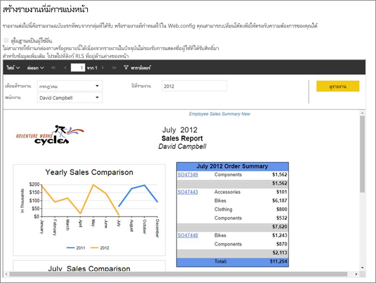

ในการสอนนี้ คุณจะได้เรียนรู้งานต่อไปนี้:
> [!div class="checklist"]
> * ลงทะเบียนแอปพลิเคชันใน Azure
> * ฝังรายงานที่มีการแบ่งหน้า Power BI เข้าไปในแอปพลิเคชันโดยใช้ผู้เช่า Power BI ของคุณ

## <a name="prerequisites"></a>ข้อกำหนดเบื้องต้น
เมื่อต้องเริ่มต้นใช้งาน คุณจำเป็นต้องมี:

* [บัญชี Power BI Pro](../../admin/service-admin-purchasing-power-bi-pro.md)

* คุณจำเป็นต้องตั้งค่า[ผู้เช่า Azure Active Directory](create-an-azure-active-directory-tenant.md) ของคุณเอง

* ความจุ P1 อย่างน้อย ดู [ฉันต้องมีความจุพรีเมียมขนาดเท่าใดสำหรับรายงานแบบแบ่งหน้า](../../paginated-reports/paginated-reports-faq.md#what-size-premium-capacity-do-i-need-for-paginated-reports)

ถ้าคุณยังไม่ได้ลงทะเบียนสำหรับ **Power BI Pro**[ลงทะเบียนทดลองใช้ฟรี](https://powerbi.microsoft.com/pricing/)ก่อนที่คุณจะเริ่ม

## <a name="set-up-your-power-bi-environment"></a>ตั้งค่าสภาพแวดล้อม Power BI ของคุณ

ทำตามคำแนะนำในส่วนนี้เพื่อตั้งค่า Power BI สำหรับการฝังรายงานที่มีการแบ่งหน้าของคุณ

### <a name="register-a-server-side-web-application-app"></a>ลงทะเบียนแอปพลิเคชันเว็บฝั่งเซิร์ฟเวอร์

ทำตามคำแนะนำใน [ลงทะเบียนแอปพลิเคชัน Azure AD เพื่อใช้กับ Power BI](register-app.md) ลงทะเบียนแอปพลิเคชันเว็บฝั่งเซิร์ฟเวอร์

>[!NOTE]
>เมื่อลงทะเบียนแอปตรวจสอบให้แน่ใจว่าได้ทำดังต่อไปนี้:
>* รับความลับของแอปพลิเคชัน
>* ใช้สิทธิ์ **Report.ReadAll** (ขอบเขต) ไปยังแอปของคุณ

### <a name="create-a-dedicated-capacity"></a>สร้างความจุเฉพาะ

โดยการสร้างความจุเฉพาะ คุณสามารถใช้ประโยชน์จากการมีทรัพยากรเฉพาะสำหรับเนื้อหาในพื้นที่ทำงานแอปของคุณ สำหรับรายงานที่มีการแบ่งหน้า คุณต้องย้อนกลับพื้นที่ทำงานของแอปของคุณด้วยความจุ P1 อย่างน้อย คุณสามารถสร้างความจุเฉพาะโดยการใช้ [Power BI Premium](../../admin/service-premium-what-is.md)

ตารางต่อไปนี้แสดงรายการ Power BI Premium SKU ที่สามารถใช้เพื่อสร้างความจุเฉพาะสำหรับรายงานที่มีการแบ่งหน้าใน [Microsoft Office 365](../../admin/service-admin-premium-purchase.md):

| โหนดของความจุ | vCores ทั้งหมด<br/>(back end + front end) | Back-end vCores | Front-end vCores | การจำกัดการเชื่อมต่อ DirectQuery/live |
| --- | --- | --- | --- | --- | --- |
| P1 |8 vCores |4 vCore, 25 GB ของ RAM |4 vCores |30 ต่อวินาที |
| P2 |16 vCores |8 vCores, 50 GB ของ RAM |8 vCores |60 ต่อวินาที |
| P3 |32 vCores |16 vCores, 100 GB ของ RAM |16 vCores |120 ต่อวินาที |
| P4 |64 vCores |32 vCores, 200 GB ของ RAM |32 vCores |240 ต่อวินาที |
| P5 |128 vCores |64 vCores, 400 GB ของ RAM |64 vCores |480 ต่อวินาที |
|||||

### <a name="enable-paginated-reports-workload"></a>เปิดใช้งานเวิร์กโหลดรายงานที่มีการแบ่งหน้า

คุณจำเป็นต้องเปิดใช้งานรายงานที่มีการแบ่งหน้าบนความจุเฉพาะของคุณ

1. ลงชื่อเข้าใช้ [Power BI > พอร์ทัลผู้ดูแลระบบ > การตั้งค่าความจุ](https://app.powerbi.com/admin-portal/capacities)

2. เลือกความจุที่มีพื้นที่ทำงานที่คุณต้องการอัปโหลดรายงานที่มีการแบ่งหน้า

    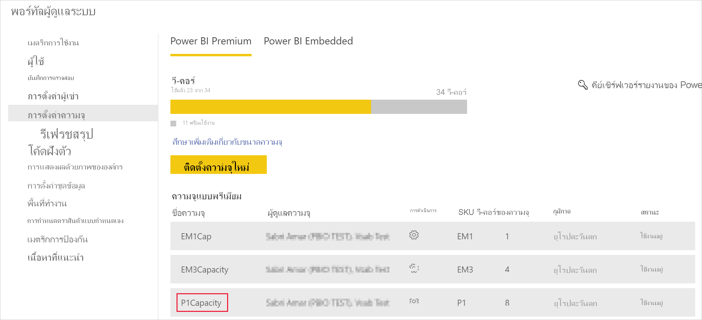

3. ขยาย **ปริมาณงาน**

    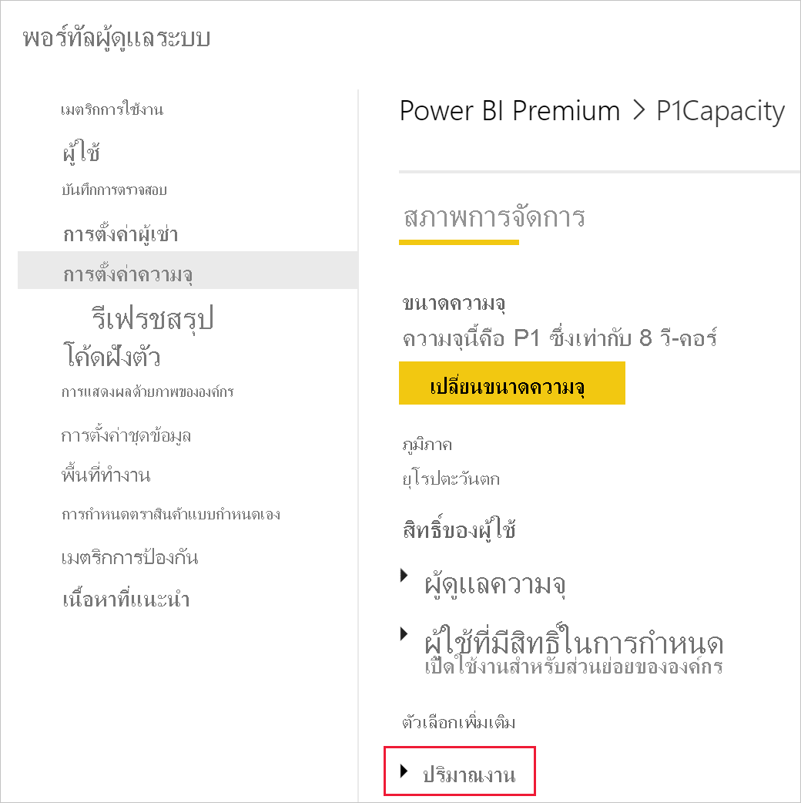

4. เปิดใช้งานเวิร์กโหลดรายงานที่มีการแบ่งหน้า

    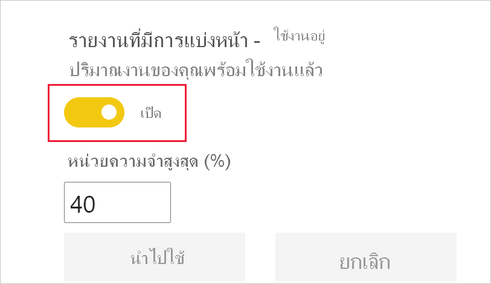

### <a name="assign-an-app-workspace-to-a-dedicated-capacity"></a>กำหนดพื้นที่ทำงานของแอปให้กับความจุเฉพาะ

หลังจากคุณสร้างความจุเฉพาะแล้ว คุณสามารถกำหนดพื้นที่ทำงานแอปไปยังความจุเฉพาะได้ สำหรับวิธีจบกระบวนการนี้ ให้ทำตามขั้นตอนต่อไปนี้:

1. ภายในบริการของ Power BI ให้ขยายพื้นที่ทำงานและเลือก **เพิ่มเติม** สำหรับพื้นที่ทำงานที่คุณกำลังใช้เพื่อการฝังเนื้อหา จากนั้นเลือก **การตั้งค่าพื้นที่ทำงาน**

    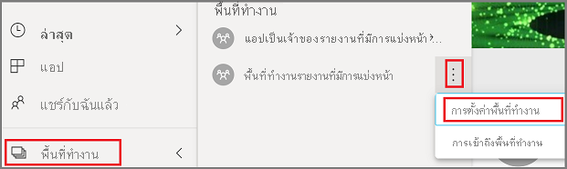

2. เลือก **Premium** และเปิดใช้งาน **ความจุเฉพาะ** เลือกความจุเฉพาะที่คุณสร้าง จากนั้นเลือก**บันทึก**

    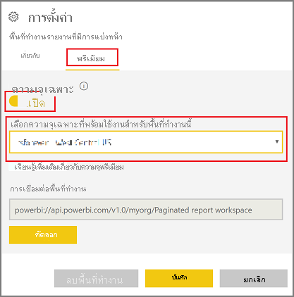

3. หลังจากเลือก **บันทึก** คุณควรจะเห็นรูปข้าวหลามตัดถัดจากชื่อพื้นที่ทำงานแอป

    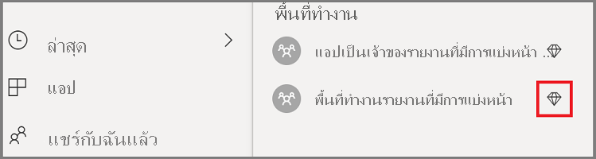

### <a name="create-and-publish-your-power-bi-paginated-reports"></a>สร้าง และเผยแพร่รายงานที่มีการแบ่งหน้า Power BI ของคุณ

คุณสามารถสร้างรายงานที่มีการแบ่งหน้าของคุณได้โดยใช้[ตัวสร้างรายงาน Power BI](../../paginated-reports/paginated-reports-report-builder-power-bi.md#create-reports-in-power-bi-report-builder) จากนั้นคุณสามารถ[อัปโหลดรายงาน](../../paginated-reports/paginated-reports-quickstart-aw.md#upload-the-report-to-the-service)ไปยังพื้นที่ทำงานของแอปที่กำหนดให้เป็นความจุ P1 อย่างน้อยและเปิด [ปริมาณงานรายงานที่มีการแบ่งหน้า](#enable-paginated-reports-workload) การอัปโหลดของผู้ใช้ปลายทางจำเป็นต้องมีสิทธิ์การใช้งาน Power BI Pro เพื่อเผยแพร่ไปยังพื้นที่ทำงานแอป
   
## <a name="embed-your-content-by-using-the-sample-application"></a>ฝังเนื้อหาของคุณโดยการใช้แอปพลิเคชันตัวอย่าง

ตัวอย่างนี้ถูกเก็บไว้อย่างตั้งใจเพื่อวัตถุประสงค์ในการสาธิต

ทำตามขั้นตอนด้านล่างเพื่อเริ่มการฝังเนื้อหาของคุณโดยใช้แอปพลิเคชันตัวอย่าง

1. ดาวน์โหลด[Visual Studio](https://www.visualstudio.com/) (เวอร์ชัน 2013 หรือใหม่กว่า) ทำให้แน่ใจว่าได้ดาวน์โหลด[แพคเกจ NuGet](https://www.nuget.org/profiles/powerbi)ล่าสุด

2. ดาวน์โหลด [PowerBI-Developer-Samples](https://github.com/Microsoft/PowerBI-Developer-Samples) และเปิด .NET Framework > ฝังสำหรับองค์กรของคุณ > Integration-web-app > **PBIWebApp**

    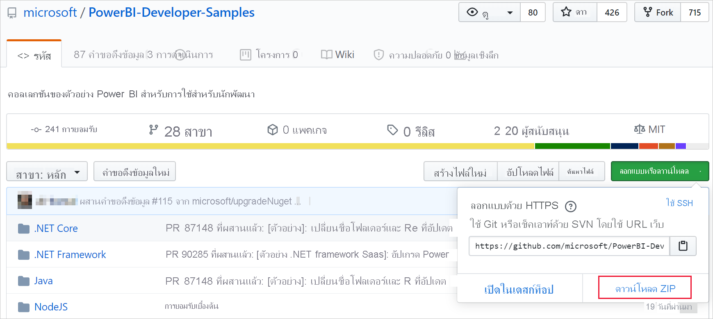

3. เปิดไฟล์ **Cloud.config** ในแอปพลิเคชันตัวอย่างและกรอกข้อมูลในฟิลด์ต่อไปนี้เพื่อรันแอปพลิเคชันของคุณ:
    * [รหัสแอปพลิเคชัน](#application-id)
    * [รหัสพื้นที่ทำงาน](#workspace-id)
    * [รหัสรายงาน](#report-id)
    * [AADAuthorityUrl](#aadauthorityurl)

    

### <a name="application-id"></a>รหัสแอปพลิเคชัน

ป้อนข้อมูล **applicationId** ด้วย **ID แอปพลิเคชัน** จาก **Azure** แอปพลิเชันจะใช้ **applicationId** เพื่อระบุตัวเองไปยังผู้ใช้จากที่คุณกำลังขอสิทธิ์

สำหรับวิธีรับ **applicationId** ให้ทำตามขั้นตอนต่อไปนี้:

1. ลงชื่อเข้าใช้[พอร์ทัล Azure](https://portal.azure.com)

2. ในบานหน้าต่างนำทางซ้ายมือ เลือก **บริการทั้งหมด** และเลือก **การลงทะเบียนแอป**

3. เลือกแอปพลิเคชันที่ต้องใช้ **ApplicationID**

    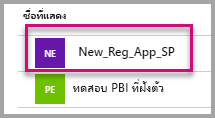

4. มี **ID แอปพลิเคชัน** ที่แสดงในรูปของ GUID ใช้ **ID แอปพลิเคชัน** นี้เป็น **applicationId** สำหรับแอปพลิเคชัน

    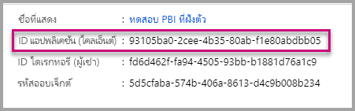

### <a name="workspace-id"></a>ID พื้นที่ทำงาน

กรอกข้อมูล **workspaceId** ด้วย พื้นที่ทำงานแอป (กลุ่ม) GUID จาก Power BI คุณสามารถดูข้อมูลนี้จาก URL เมื่อลงชื่อเข้าใช้บริการ Power BI หรือโดยการใช้ Powershell

URL <br>


PowerShell <br>

```powershell
Get-PowerBIworkspace -name "User Owns Embed Test"
```

   

### <a name="report-id"></a>รหัสรายงาน

กรอกข้อมูล **reportId** ด้วย GUID รายงานจาก Power BI คุณสามารถดูข้อมูลนี้จาก URL เมื่อลงชื่อเข้าใช้บริการ Power BI หรือโดยการใช้ Powershell


PowerShell <br>

```powershell
Get-PowerBIworkspace -name "User Owns Embed Test" | Get-PowerBIReport -Name "Sales Paginated Report"
```


### <a name="aadauthorityurl"></a>AADAuthorityUrl

กรอกข้อมูลใน **AADAuthorityUrl** พร้อม URL ที่อนุญาตให้คุณฝังภายในผู้เช่าองค์กรของคุณหรือฝังด้วยผู้ใช้ที่เป็นผู้เยี่ยมชม

สำหรับการฝังกับผู้เช่าขององค์กรของคุณ กรุณาใช้ URL - *https://login.microsoftonline.com/common/oauth2/authorize*

สำหรับการฝังกับผู้เยี่ยมชม กรุณาใช้ URL - *https://login.microsoftonline.com/report-owner-tenant-id* - ที่ซึ่งคุณเพิ่มรหัสผู้เช่าของเจ้าของรายงานในการแทนที่ของ*report-owner-tenant-id*

### <a name="run-the-application"></a>เรียกใช้แอปพลิเคชัน

1. เลือก**เรียกใช้**ใน **Visual Studio**

    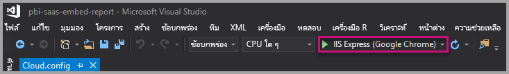

2. จากนั้นเลือก **Embed Report** ขึ้นอยู่กับเนื้อหาที่คุณเลือกที่จะทดสอบ - รายงาน, แดชบอร์ด หรือไทล์ - แล้วเลือกตัวเลือกนั้นในแอปพลิเคชัน

    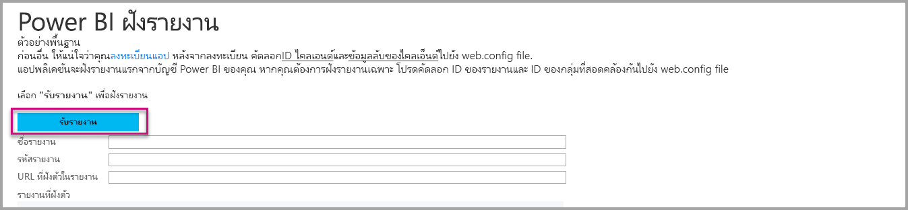

3. ตอนนี้ คุณสามารถดูรายงานในแอปพลิเคชันตัวอย่างได้แล้ว

    

## <a name="next-steps"></a>ขั้นตอนถัดไป

ในการสอนนี้ คุณจะได้เรียนรู้วิธีการฝังรายงานที่มีการแบ่งหน้า Power BI เข้าไปในแอปพลิเคชันโดยการใช้บัญชีองค์กร Power BI 

> [!div class="nextstepaction"]
> [ฝังตัวจากแอป](embed-from-apps.md)

> [!div class="nextstepaction"]
>[ฝังเนื้อหา Power BI สำหรับลูกค้าของคุณ](embed-sample-for-customers.md)

> [!div class="nextstepaction"]
>[ฝังรายงานที่มีการแบ่งหน้าของ Power BI สำหรับลูกค้าของคุณ](embed-paginated-reports-customers.md)

หากมีข้อสงสัย [ลองถามชุมชน Power BI](http://community.powerbi.com/)