# <a name="tutorial-embed-power-bi-content-into-an-application-for-your-customers"></a>บทช่วยสอน: ฝังเนื้อหา Power BI ลงในแอปพลิเคชันสำหรับลูกค้าของคุณ

ด้วย **Power BI Embedded ใน Azure** หรือ**การฝัง Power BI ใน Office**คุณสามารถฝังรายงาน, แดชบอร์ด หรือไทล์ลงในการใช้แอปพลิเคชันโดยใช้แอปเป็นเจ้าของข้อมูลได้ **แอปเป็นเจ้าของข้อมูล** เกี่ยวกับแอปพลิเคชันที่ใช้ Power BI เป็นแพลตฟอร์มการวิเคราะห์แบบฝังตัว ในฐานะเป็น**ISV** หรือ**นักพัฒนา** คุณสามารถสร้างเนื้อหา Power BI ที่แสดงรายงาน, แดชบอร์ด หรือไทล์ในแอปพลิเคชันที่รวมงานทั้งหมดไว้ด้วยกันและที่โต้ตอบได้ โดยผู้ใช้ไม่ต้องมีสิทธิ์การใช้งาน Power BI บทช่วยสอนนี้สาธิตวิธีการรวมรายงานลงในแอปพลิเคชัน โดยใช้ Power BI SDK .NET กับ Power BI JavaScript API.

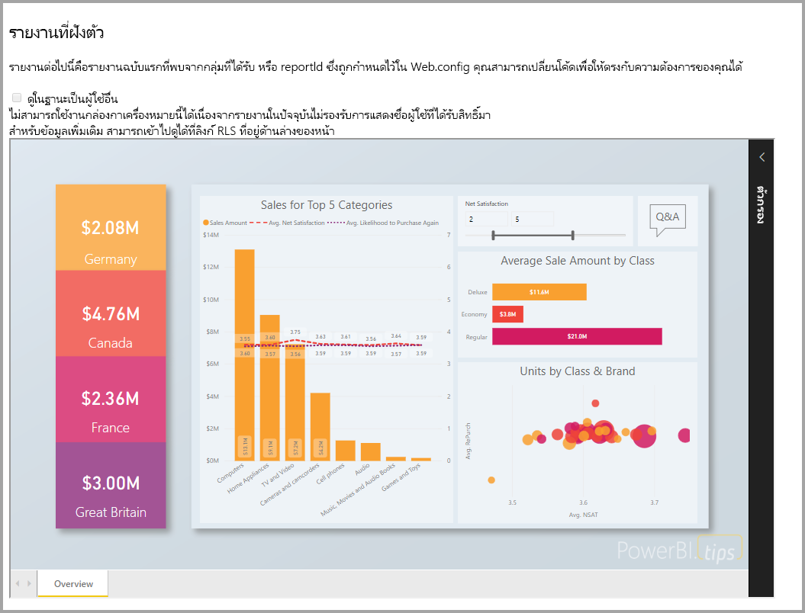

ในบทช่วยสอนนี้ คุณจะเรียนรู้วิธีการ:
> [!div class="checklist"]
> * ลงทะเบียนแอปพลิเคชันใน Azure
> * ฝังรายงาน Power BI ลงในแอปพลิเคชัน

## <a name="prerequisites"></a>ข้อกำหนดเบื้องต้น

เมื่อต้องเริ่มต้นใช้งาน คุณจำเป็นต้องมี:

* [บัญชี Power BI Pro](../../fundamentals/service-self-service-signup-for-power-bi.md) (บัญชีหลักที่มีชื่อผู้ใช้และรหัสผ่านเพื่อลงชื่อเข้าใช้บัญชี Power BI Pro), หรือ[บริการหลัก (โทเค็นเฉพาะแอปเท่านั้น)](embed-service-principal.md)
* คุณจำเป็นต้องตั้งค่า[ผู้เช่า Azure Active Directory](create-an-azure-active-directory-tenant.md) ของคุณเอง

ถ้าคุณยังไม่ได้ลงทะเบียนสำหรับ **Power BI Pro**[ลงทะเบียนทดลองใช้ฟรี](https://powerbi.microsoft.com/pricing/)ก่อนที่คุณจะเริ่ม

## <a name="set-up-your-embedded-analytics-development-environment"></a>ตั้งค่าสภาพแวดล้อมการพัฒนาการวิเคราะห์แบบฝังตัวของคุณ

ก่อนที่คุณจะเริ่มฝังรายการ, แดชบอร์ด หรือไทล์ลงในแอปพลิเคชันของคุณ คุณจำเป็นต้องตรวจสอบให้แน่ใจว่าสภาพแวดล้อมเอื้ออำนวยต่อการฝังด้วย Power BI

คุณสามารถเข้าถึง [เครื่องมือตั้งค่าการฝังตัว](https://aka.ms/embedsetup/AppOwnsData) เพื่อให้คุณสามารถเริ่มต้นใช้งาน และดาวน์โหลดแอปพลิเคชันตัวอย่างที่ช่วยแนะนำคุณไปตามขั้นตอนการสร้างสภาพแวดล้อม และการฝังรายงานได้

แต่ถ้าคุณเลือกที่จะตั้งค่าสภาพแวดล้อมด้วยตนเอง คุณสามารถดำเนินต่อตามด้านล่าง

### <a name="register-an-application-in-azure-active-directory-azure-ad"></a>ลงทะเบียนแอปพลิเคชันใน Azure Active Directory (Azure AD)

[ลงทะเบียนแอปพลิเคชัน](register-app.md)กับ Azure Active Directory เพื่ออนุญาตให้เข้าถึงแอปพลิเคชัน[Power BI REST ](https://docs.microsoft.com/rest/api/power-bi/) การลงทะเบียนแอปพลิเคชันจะทำให้คุณสร้างอัตลักษณ์แอปพลิเคชันของคุณและระบุ[สิทธิ์ไปยังทรัพยากร Power BI REST](https://docs.microsoft.com/azure/active-directory/develop/v2-permissions-and-consent) โดยขึ้นอยู่กับถ้าคุณต้องการใช้บัญชีหลัก หรือ[บริการหลัก](embed-service-principal.md)กำหนดวิธีการเริ่มต้นใช้งานการลงทะเบียนแอปพลิเคชัน

ซึ่งขึ้นอยู่กับวิธีที่คุณใช้ มีผลต่อแอปพลิเคชันชนิดใดที่คุณลงทะเบียนใน Azure

ถ้าคุณดำเนินต่อโดยใช้บัญชีหลัก จากนั้นดำเนินการลงทะเบียนแอป**แบบดั้งเดิม** คุณใช้แอปแบบดั้งเดิมเนื่องจากคุณกำลังทำงานกับการเข้าสู่ระบบที่ไม่ใช่แบบโต้ตอบ

อย่างไรก็ตาม ถ้าคุณดำเนินต่อโดยใช้บริการหลัก คุณจำเป็นต้องดำเนินการลงทะเบียนเป็นแอป**แอปพลิเคชันเว็บฝั่งเซิร์ฟเวอร์** คุณลงทะเบียนแอปพลิเคชันเว็บฝั่งเซิร์ฟเวอร์เพื่อสร้างเป็นความลับของแอปพลิเคชัน

## <a name="set-up-your-power-bi-environment"></a>ตั้งค่าสภาพแวดล้อม Power BI ของคุณ

### <a name="create-a-workspace"></a>สร้างพื้นที่ทำงาน

หากคุณกำลังฝังรายงาน, แดชบอร์ด หรือไทล์สำหรับลูกค้า คุณต้องวางเนื้อหาลงในพื้นที่ทำงาน พื้นที่ทำงานมีหลายประเภทที่คุณสามารถตั้งค่า: [พื้นที่ทำงานแบบดั้งเดิม](../../collaborate-share/service-create-workspaces.md)หรือ[พื้นที่ทำงานใหม่](../../collaborate-share/service-create-the-new-workspaces.md) ถ้าคุณกำลังใช้บัญชี*หลัก* จากนั้นไม่สำคัญว่าคุณจะพื้นที่ทำงานชนิดใด อย่างไรก็ตาม ถ้าคุณใช้ *[บริการหลัก](embed-service-principal.md)* เพื่อเข้าสู่ระบบแอปพลิเคชัน จากนั้นคุณจำเป็นต้องใช้พื้นที่ทำงานใหม่ ในสถานการณ์ใด ๆ ทั้งบัญชี*หลัก* หรือ*บริการหลัก*ต้องเป็นผู้ดูแลระบบของพื้นที่ทำงานที่เกี่ยวข้องกับแอปพลิเคชันของคุณ

### <a name="create-and-publish-your-reports"></a>สร้าง และเผยแพร่รายงานของคุณ

คุณสามารถสร้างรายงานและชุดข้อมูลของคุณโดยใช้ Power BI Desktop แล้วจึงเผยแพร่รายงานเหล่านั้นไปยังพื้นที่ทำงาน คุณมีสองวิธีในการทำงานนี้ ได้แก่ ในฐานะที่เป็นผู้ใช้ปลายทาง คุณสามารถเผยแพร่รายงานไปยังพื้นที่ทำงานดั้งเดิมด้วยบัญชีหลัก (สิทธิ์การใช้งาน Power BI Pro) ถ้าคุณกำลังใช้บริการหลัก คุณสามารถเผยแพร่รายงานไปยังพื้นที่ทำงานใหม่ที่ใช้ใน[Power BI REST API](https://docs.microsoft.com/rest/api/power-bi/imports/postimportingroup)ได้

ขั้นตอนด้านล่างแนะนำวิธีการเผยแพร่รายงาน PBIX ของคุณไปยังพื้นที่ทำงาน Power BI

1. ดาวน์โหลดตัวอย่าง[การสาธิตบล็อก](https://github.com/Microsoft/powerbi-desktop-samples)จาก GitHub

    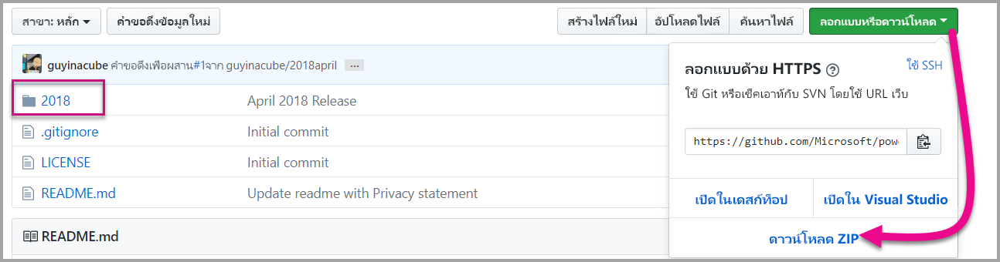

2. เปิดรายงาน PBIX ตัวอย่างใน **Power BI Desktop**

   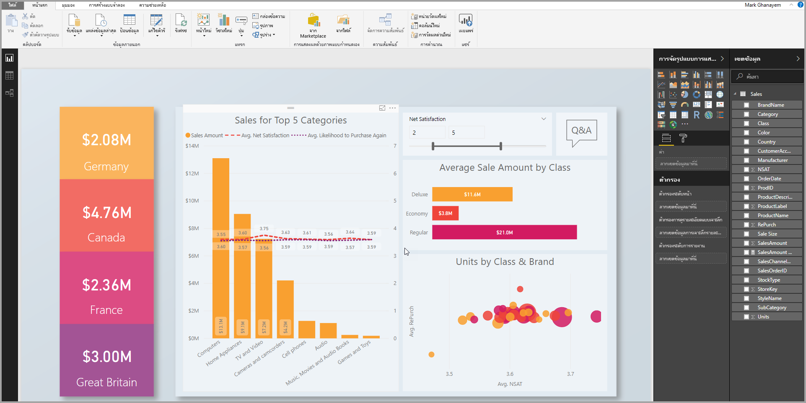

3. เผยแพร่ไปยัง**พื้นที่ทำงาน** กระบวนการนี้แตกต่างกันขึ้นอยู่กับว่าคุณกำลังใช้บัญชีหลัก (ใบอนุญาต Power Pro), หรือบริการหลัก ถ้าคุณกำลังใช้บัญชีหลัก จากนั้นคุณสามารถเผยแพร่รายงานของคุณผ่านทาง Power BI Desktop  ในตอนนี้ถ้าคุณกำลังใช้บริการหลัก คุณต้องใช้ Power BI REST API

## <a name="embed-content-using-the-sample-application"></a>ฝังเนื้อหาโดยใช้แอปพลิเคชันตัวอย่าง

ตัวอย่างนี้ถูกเก็บไว้อย่างตั้งใจเพื่อวัตถุประสงค์ในการสาธิต ทั้งนี้ขึ้นอยู่กับคุณหรือนักพัฒนาของคุณในการปกป้องความลับของแอปพลิเคชันหรือข้อมูลบัญชีมาสเตอร์

ทำตามขั้นตอนด้านล่างเพื่อเริ่มการฝังเนื้อหาของคุณโดยใช้แอปพลิเคชันตัวอย่าง

1. ดาวน์โหลด[Visual Studio](https://www.visualstudio.com/) (เวอร์ชัน 2013 หรือใหม่กว่า) ทำให้แน่ใจว่าได้ดาวน์โหลด[แพคเกจ NuGet](https://www.nuget.org/profiles/powerbi)ล่าสุด

2. ดาวน์โหลด[ตัวอย่างแอปเป็นเจ้าของข้อมูล](https://github.com/Microsoft/PowerBI-Developer-Samples)จาก GitHub เพื่อเริ่มต้น

    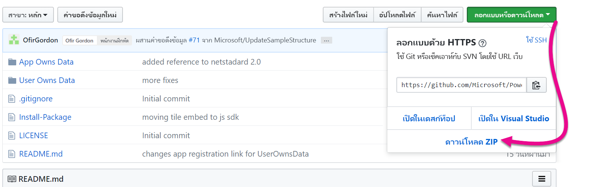

3. เปิดไฟล์**Web.config**ในแอปพลิเคชันตัวอย่าง มีเขตข้อมูลที่คุณต้องกรอกข้อมูลเพื่อเรียกใช้แอปพลิเคชันให้สำเร็จ คุณสามารถเลือก**MasterUser**หรือ**ServicePrincipal**สำหรับการ**AuthenticationType**ได้ มีเขตข้อมูลต่าง ๆ ที่ต้องกรอกข้อมูล ขึ้นอยู่กับชนิดของวิธีการรับรองความถูกต้องที่คุณเลือก

    > [!Note]
    > **AuthenticationType**ค่าเริ่มต้นในตัวอย่างนี้คือ MasterUser

    <center>

    | **MasterUser** <br> (ใบอนุญาต Power BI Pro) | **ServicePrincipal** <br> (โทเค็นเฉพาะแอปเท่านั้น)|
    |---------------|-------------------|
    | [applicationId](#application-id) | [applicationId](#application-id) |
    | [workspaceId](#workspace-id) | [workspaceId](#workspace-id) |
    | [reportId](#report-id) | [reportId](#report-id) |
    | [pbiUsername](#power-bi-username-and-password) |  |
    | [pbiPassword](#power-bi-username-and-password) |  |
    |  | [applicationsecret](#application-secret) |
    |  | [tenant](#tenant) |

   </center>

    

### <a name="application-id"></a>รหัสแอปพลิเคชัน

แอตทริบิวต์นี้จำเป็นสำหรับ AuthenticationTypes ทั้งสอง (บัญชีหลัก และ[บริการหลัก](embed-service-principal.md))

ป้อนข้อมูล **applicationId** ด้วย **ID แอปพลิเคชัน** จาก **Azure** แอปพลิเชันจะใช้ **applicationId** เพื่อระบุตัวเองไปยังผู้ใช้จากที่คุณกำลังขอสิทธิ์

สำหรับวิธีรับ **applicationId** ให้ทำตามขั้นตอนต่อไปนี้:

1. ลงชื่อเข้าใช้[พอร์ทัล Azure](https://portal.azure.com)

2. ในบานหน้าต่างนำทางซ้ายมือ เลือก **บริการทั้งหมด** และเลือก **การลงทะเบียนแอป**

    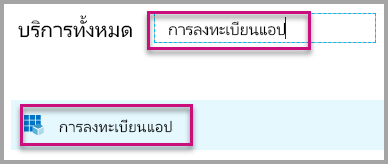

3. เลือกแอปพลิเคชันที่ต้องใช้ **ApplicationID**

    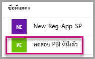

4. มี **ID แอปพลิเคชัน** ที่แสดงในรูปของ GUID ใช้ **ID แอปพลิเคชัน** นี้เป็น **applicationId** สำหรับแอปพลิเคชัน

    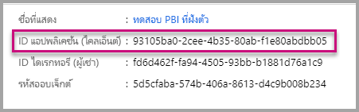

### <a name="workspace-id"></a>ID พื้นที่ทำงาน

แอตทริบิวต์นี้จำเป็นสำหรับ AuthenticationTypes ทั้งสอง (บัญชีหลัก และ[บริการหลัก](embed-service-principal.md))

กรอกข้อมูล**workspaceId**ด้วย GUID พื้นที่ทำงาน (กลุ่ม) จาก Power BI คุณสามารถดูข้อมูลนี้จาก URL เมื่อลงชื่อเข้าใช้บริการ Power BI หรือโดยการใช้ Powershell

URL <br>


PowerShell <br>

```powershell
Get-PowerBIworkspace -name "App Owns Embed Test"
```

   

### <a name="report-id"></a>รหัสรายงาน

แอตทริบิวต์นี้จำเป็นสำหรับ AuthenticationTypes ทั้งสอง (บัญชีหลัก และ[บริการหลัก](embed-service-principal.md))

กรอกข้อมูล **reportId** ด้วย GUID รายงานจาก Power BI คุณสามารถดูข้อมูลนี้จาก URL เมื่อลงชื่อเข้าใช้บริการ Power BI หรือโดยการใช้ Powershell

URL<br>


PowerShell <br>

```powershell
Get-PowerBIworkspace -name "App Owns Embed Test" | Get-PowerBIReport
```


### <a name="power-bi-username-and-password"></a>ชื่อผู้ใช้และรหัสผ่าน Power BI

แอตทริบิวต์เหล่านี้จำเป็นสำหรับบัญชีหลัก AuthenticationType เท่านั้น

ถ้าคุณกำลังใช้[บริการหลัก](embed-service-principal.md)เพื่อรับรองความถูกต้อง จากนั้นคุณไม่จำเป็นต้องเติมในแอตทริบิวต์ชื่อผู้ใช้หรือรหัสผ่าน

* กรอกข้อมูล **pbiUsername** ด้วยบัญชีหลัก Power BI
* กรอกข้อมูล **pbiPassword** ด้วยรหัสผ่านสำหรับบัญชีหลัก Power BI

### <a name="application-secret"></a>ข้อมูลลับของแอปพลิเคชัน

แอตทริบิวต์นี้จำเป็นสำหรับ AuthenticationType ของ[บริการหลัก](embed-service-principal.md)เท่านั้น

ป้อนข้อมูล **ApplicationSecret** จากส่วน **คีย์** ของส่วน **การลงทะเบียนแอปพลิเคชัน** ใน **Azure**  แอตทริบิวต์นี้ทำงานเมื่อใช้[บริการหลัก](embed-service-principal.md)

สำหรับวิธีรับ **ApplicationSecret** ให้ทำตามขั้นตอนต่อไปนี้:

1. ลงชื่อเข้าใช้ไปยัง [พอร์ทัล Azure](https://portal.azure.com)

2. ในบานหน้าต่างนำทางซ้ายมือ เลือก **บริการทั้งหมด** และเลือก **การลงทะเบียนแอป**

    

3. เลือกแอปพลิเคชันที่ต้องใช้ **ApplicationSecret**

    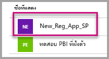

4. เลือก **ใบรับรองและข้อมูลลับ** ภายใต้ **จัดการ**

5. เลือก **ข้อมูลลับไคลเอ็นต์ใหม่**

6. ป้อนชื่อในกล่อง **Description** และเลือกระยะเวลา จากนั้นเลือก **บันทึก** เพื่อรับ **ค่า** สำหรับแอปพลิเคชัน เมื่อคุณเลือกบานหน้าต่าง **คีย์** หลังจากการบันทึกค่าคีย์แล้ว ช่องค่าจะถูกซ่อนเท่านั้น ในขั้นตอนนี้คุณจะไม่สามารถเรียกดูค่าคีย์ได้ หากคุณทำค่าคีย์หาย ให้สร้างใหม่ในพอร์ทัล Azure

    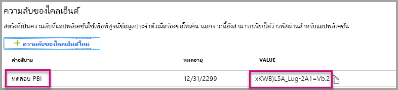

### <a name="tenant"></a>ผู้เช่า

แอตทริบิวต์นี้จำเป็นสำหรับ AuthenticationType ของ[บริการหลัก](embed-service-principal.md)เท่านั้น

กรอกข้อมูล**ผู้เช่า** ด้วย ID ผู้เช่า Azure ของคุณ คุณสามารถรับข้อมูลนี้ได้จาก[ศูนย์ผู้ดูแลระบบ Azure AD](/onedrive/find-your-office-365-tenant-id) เมื่อลงชื่อเข้าใช้บริการของ Power BI หรือใช้ Powershell

### <a name="run-the-application"></a>เรียกใช้แอปพลิเคชัน

1. เลือก**เรียกใช้**ใน **Visual Studio**

    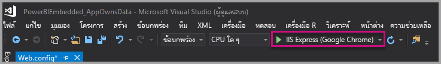

2. จากนั้นเลือก **Embed Report** ขึ้นอยู่กับเนื้อหาที่คุณเลือกที่จะทดสอบ - รายงาน, แดชบอร์ด หรือไทล์ - แล้วเลือกตัวเลือกนั้นในแอปพลิเคชัน

    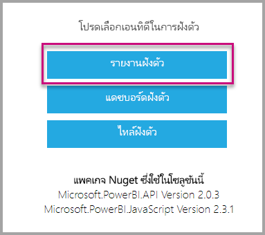

3. ตอนนี้ คุณสามารถดูรายงานในแอปพลิเคชันตัวอย่างได้แล้ว

    

## <a name="embed-content-within-your-application"></a>ฝังเนื้อหาภายในแอปพลิเคชันของคุณ

แม้ว่าขั้นตอนในการฝังเนื้อหาของคุณอาจทำได้ด้วย [Power BI REST API](https://docs.microsoft.com/rest/api/power-bi/) แต่ตัวอย่างรหัสที่อธิบายในบทความนี้ถูกสร้างด้วย **.NET SDK**

การฝังตัวสำหรับลูกค้าภายในแอปพลิเคชันของคุณ จำเป็นต้องให้คุณรับ**โทเค็นการเข้าถึง**สำหรับบัญชีหลักของคุณหรือ[บริการหลัก](embed-service-principal.md) จาก **Azure AD** คุณต้องได้รับ[โทเค็นการเข้าถึง Azure AD](get-azuread-access-token.md#access-token-for-non-power-bi-users-app-owns-data) สำหรับแอปพลิเคชัน Power BI ของคุณก่อนที่คุณจะเรียกใช้ [Power BI REST API](https://docs.microsoft.com/rest/api/power-bi/)

ในการสร้าง Power BI Client ด้วย **โทเค็นการเข้าถึง** คุณต้องการสร้างวัตถุไคลเอ็นต์ Power BI ซึ่งช่วยให้คุณสามารถติดต่อกับ [Power BI REST APIs](https://docs.microsoft.com/rest/api/power-bi/) ได้ คุณสร้างวัตถุไคลเอ็นต์ Power BI ได้โดยการคลุม **AccessToken** ด้วยวัตถุ ***Microsoft.Rest.TokenCredentials***

```csharp
using Microsoft.IdentityModel.Clients.ActiveDirectory;
using Microsoft.Rest;
using Microsoft.PowerBI.Api.V2;

var tokenCredentials = new TokenCredentials(authenticationResult.AccessToken, "Bearer");

// Create a Power BI Client object. it's used to call Power BI APIs.
using (var client = new PowerBIClient(new Uri(ApiUrl), tokenCredentials))
{
    // Your code to embed items.
}
```

### <a name="get-the-content-item-you-want-to-embed"></a>รับเนื้อหาที่คุณต้องการฝังตัว

คุณสามารถใช้วัตถุไคลเอ็นต์ Power BI เพื่อดึงตัวอ้างอิงไปยังเนื้อหาที่คุณต้องการฝังตัว

นี่คือตัวอย่างรหัสวิธีการดึงรายงานตัวแรกจากพื้นที่ทำงานที่ระบุไว้

*ตัวอย่างของการรับรายการเนื้อหาไม่ว่าจะเป็นรายงาน แดชบอร์ด หรือไทล์ที่คุณต้องการฝังจะมีให้ในไฟล์ Services\EmbedService.cs ใน[แอปพลิเคชันตัวอย่าง](https://github.com/Microsoft/PowerBI-Developer-Samples)*

```csharp
using Microsoft.PowerBI.Api.V2;
using Microsoft.PowerBI.Api.V2.Models;

// You need to provide the workspaceId where the dashboard resides.
ODataResponseListReport reports = await client.Reports.GetReportsInGroupAsync(workspaceId);

// Get the first report in the group.
Report report = reports.Value.FirstOrDefault();
```

### <a name="create-the-embed-token"></a>สร้างโทเค็นแบบฝังตัว
สร้างโทเค็นแบบฝังตัวซึ่งสามารถใช้ได้จาก JavaScript API มี API สองประเภท กลุ่มแรกมีห้า API โดยแต่ละตัวจะสร้างโทเค็นแบบฝังตัวสำหรับรายการเฉพาะ กลุ่มที่สองซึ่งประกอบด้วย API เดียวเท่านั้นจะสร้างโทเค็นที่สามารถใช้เพื่อฝังหลายรายการ

**API สำหรับการสร้างโทเค็นแบบฝังตัวในรายการเฉพาะ**

โทเค็นแบบฝังตัวที่สร้างด้วย API เหล่านี้เป็นรายการเฉพาะที่คุณกำลังฝัง ทุกครั้งที่คุณฝังรายการ Power BI (เช่น รายงาน แดชบอร์ด หรือไทล์) ด้วย API เหล่านี้ คุณจำเป็นต้องสร้างโทเค็นแบบฝังตัวใหม่
* [แดชบอร์ด GenerateTokenInGroup](https://docs.microsoft.com/rest/api/power-bi/embedtoken/dashboards_generatetokeningroup)
* [ชุดข้อมูล GenerateTokenInGroup](https://docs.microsoft.com/rest/api/power-bi/embedtoken/datasets_generatetokeningroup)
* [รายงาน GenerateTokenForCreateInGroup](https://docs.microsoft.com/rest/api/power-bi/embedtoken/reports_generatetokenforcreateingroup)
* [รายงาน GenerateTokenInGroup](https://docs.microsoft.com/rest/api/power-bi/embedtoken/reports_generatetokeningroup)
* [ไทล์ GenerateTokenInGroup](https://docs.microsoft.com/rest/api/power-bi/embedtoken/tiles_generatetokeningroup)

ตัวอย่างของการสร้างโทเค็นแบบฝังตัวสำหรับรายงาน แดชบอร์ด หรือไทล์จะพร้อมใช้งานจากไฟล์ต่อไปนี้ใน[แอปพลิเคชันตัวอย่าง](https://github.com/Microsoft/PowerBI-Developer-Samples).
* Services\EmbedService.cs
* Models\EmbedConfig.cs
* Models\TileEmbedConfig.cs

ด้านล่างนี้คือตัวอย่างรหัสสำหรับการใช้งาน API ของโทเค็นแบบฝังตัวสำหรับรายงาน GenerateTokenInGroup
```csharp
using Microsoft.PowerBI.Api.V2;
using Microsoft.PowerBI.Api.V2.Models;

// Generate Embed Token.
var generateTokenRequestParameters = new GenerateTokenRequest(accessLevel: "view");
EmbedToken tokenResponse = client.Reports.GenerateTokenInGroup(workspaceId, report.Id, generateTokenRequestParameters);

// Generate Embed Configuration.
var embedConfig = new EmbedConfig()
{
    EmbedToken = tokenResponse,
    EmbedUrl = report.EmbedUrl,
    Id = report.Id
};
```

**API สำหรับการสร้างโทเค็นแบบฝังตัวในหลายรายการ**<a id="multiEmbedToken"></a>

API แบบฝังตัวสำหรับ[สร้างโทเค็น](https://docs.microsoft.com/rest/api/power-bi/embedtoken/generatetoken) จะสร้างโทเค็นที่สามารถใช้สำหรับการฝังหลายรายการ

นอกจากนี้ยังสามารถใช้สำหรับการเลือกชุดข้อมูลแบบไดนามิกในขณะที่ฝังรายงาน สำหรับข้อมูลเพิ่มเติมเกี่ยวกับการใช้ API นี้ ให้ดู[การเชื่อมโยงแบบไดนามิก](embed-dynamic-binding.md).


ด้านล่างนี้คือตัวอย่างของการใช้ API นี้
 
```csharp
using Microsoft.PowerBI.Api.V2;
using Microsoft.PowerBI.Api.V2.Models;

var reports = new List<GenerateTokenRequestV2Report>()
{ 
    new GenerateTokenRequestV2Report()
    {
        AllowEdit = false,
        Id = report1.Id
    },
    new GenerateTokenRequestV2Report()
    {
        AllowEdit = true,
        Id = report2.Id
    }
};

var datasets= new List<GenerateTokenRequestV2Dataset>()
{
    new GenerateTokenRequestV2Dataset(dataset1.Id),
    new GenerateTokenRequestV2Dataset(dataset2.Id),
    new GenerateTokenRequestV2Dataset(dataset3.Id),
};

var targetWorkspaces = new List<GenerateTokenRequestV2TargetWorkspace>()
{
    new GenerateTokenRequestV2TargetWorkspace(workspace1.Id),
    new GenerateTokenRequestV2TargetWorkspace(workspace2.Id),
};

var request = new GenerateTokenRequestV2()
{
    Datasets = datasetsRequestDetails ?? null,
    Reports = reportsRequestDetails,
    TargetWorkspaces = targetWSRequestdetials ?? null,
};

var token = client.GetClient().EmbedToken.GenerateToken(request);
```

### <a name="load-an-item-using-javascript"></a>โหลดเนื้อหาโดยใช้ JavaScript

คุณสามารถใช้ JavaScript เพื่อโหลดรายงานลงในองค์ประกอบ div บนเว็บเพจของคุณ

สำหรับตัวอย่างแบบเต็มของการใช้ JavaScript API คุณสามารถใช้[เครื่องมือ Playground](https://microsoft.github.io/PowerBI-JavaScript/demo) ได้ เครื่องมือ Playground คือวิธีที่รวดเร็วเพื่อลองเล่นกับตัวอย่าง Power BI Embedded ชนิดต่าง ๆ กัน คุณยังสามารถรับข้อมูลเพิ่มเติมเกี่ยวกับ JavaScript API โดยเข้าดูที่หน้า [Powerbi-javascript wiki](https://github.com/Microsoft/powerbi-javascript/wiki) ได้

ตัวอย่างนี้ใช้รูปแบบ **EmbedConfig** และรูปแบบ **TileEmbedConfig** พร้อมกับมุมมองรายงาน

*ตัวอย่างของการเพิ่มมุมมองสำหรับรายงาน แดชบอร์ด หรือไทล์มีให้ในไฟล์ Views\Home\EmbedReport.cshtml, Views\Home\EmbedDashboard.cshtml หรือ Views\Home\Embedtile.cshtml ใน [ตัวอย่างแอปพลิเคชัน](#embed-content-using-the-sample-application)*

```javascript
<script src="~/scripts/powerbi.js"></script>
<div id="reportContainer"></div>
<script>
    // Read embed application token from Model
    var accessToken = "@Model.EmbedToken.Token";

    // Read embed URL from Model
    var embedUrl = "@Html.Raw(Model.EmbedUrl)";

    // Read report Id from Model
    var embedReportId = "@Model.Id";

    // Get models. models contains enums that can be used.
    var models = window['powerbi-client'].models;

    // Embed configuration used to describe what and how to embed.
    // This object is used when calling powerbi.embed.
    // This also includes settings and options such as filters.
    // You can find more information at https://github.com/Microsoft/PowerBI-JavaScript/wiki/Embed-Configuration-Details.
    var config = {
        type: 'report',
        tokenType: models.TokenType.Embed,
        accessToken: accessToken,
        embedUrl: embedUrl,
        id: embedReportId,
        permissions: models.Permissions.All,
        settings: {
            filterPaneEnabled: true,
            navContentPaneEnabled: true
        }
    };

    // Get a reference to the embedded report HTML element
    var reportContainer = $('#reportContainer')[0];

    // Embed the report and display it within the div container.
    var report = powerbi.embed(reportContainer, config);
</script>
```

## <a name="move-to-production"></a>ย้ายไปยังการผลิต

ตอนนี้คุณได้พัฒนาแอปพลิเคชันของคุณเรียบร้อยแล้ว ก็ถึงเวลาที่จะต้องสนับสนุนพื้นที่ทำงานของคุณด้วยความจุเฉพาะ 

> [!Important]
> ความจุเฉพาะ จำเป็นสำหรับการย้ายไปยังการผลิต พื้นที่ทำงานทั้งหมด (ที่มีรายงานหรือแดชบอร์ดและที่มีชุดข้อมูล) จะต้องกำหนดไว้สำหรับความจุ

### <a name="create-a-dedicated-capacity"></a>สร้างความจุเฉพาะ

เมื่อสร้างความจุเฉพาะ คุณสามารถใช้ประโยชน์จากการมีทรัพยากรเฉพาะที่จัดสรรไว้สำหรับลูกค้าของคุณ มีความจุสองชนิดที่คุณสามารถเลือกได้จาก:
* **Power BI Premium** - การสมัครใช้งาน Office 356 ระดับผู้เช่าที่มีอยู่สองกลุ่ม SKU ได้แก่ *EM* และ *P* เมื่อมีการฝังเนื้อหา Power BI โซลูชันนี้จะเรียกว่า *การฝัง Power BI* สำหรับข้อมูลเพิ่มเติมเกี่ยวกับการสมัครสมาชิกนี้ โปรดดู [Power BI Premium คืออะไร](../../admin/service-premium-what-is.md)
* **Azure Power BI Embedded** - คุณสามารถซื้อความจุเฉพาะจาก [พอร์ทัล Microsoft Azure](https://portal.azure.com) การสมัครใช้งานนี้ใช้ *A* SKU สำหรับรายละเอียดเกี่ยวกับวิธีการสร้างความจุ Power BI Embedded โปรดดู[สร้างความจุ Power BI Embedded ในพอร์ทัล Azure](azure-pbie-create-capacity.md)
> [!NOTE]
> ด้วย A SKU คุณไม่สามารถเข้าถึงเนื้อหา Power BI ที่มีสิทธิ์การใช้งาน Power BI ฟรี

ตารางด้านล่างอธิบายแหล่งข้อมูลและขีดจำกัดของแต่ละ SKU หากต้องการตรวจสอบความจุที่เหมาะสมที่สุดกับความต้องการของคุณ ให้ดูตาราง [SKU ใดที่ฉันควรซื้อสำหรับสถานการณ์ของฉัน](https://docs.microsoft.com/power-bi/developer/embedded-faq#which-solution-should-i-choose)

| โหนดความจุ | วี-คอร์รวม | Backend v-cores | RAM (GB) | Frontend v-cores | DirectQuery/Live Connection (ต่อวินาที) | การรีเฟรชแบบจำลองแบบคู่ขนาน |
| --- | --- | --- | --- | --- | --- | --- |
| EM1/A1 | 1 | 0.5 | 2.5 | 0.5 | 3.75 | 1 |
| EM2/A2 | 2 | 1 | 5 | 1 | 7.5 | 2 |
| EM3/A3 | 4 | 2 | 10 | 2 | 15 | 3 |
| P1/A4 | 8 | 4 | 25 | 4 | 30 | 6 |
| P2/A5 | 16 | 8 | 50 | 8 | 60 | 12 |
| P3/A6 | 32 | 16 | 100 | 16 | 120 | 24 |
| | | | | | | |

### <a name="development-testing"></a>การทดสอบการพัฒนา

โทเค็นแบบฝังตัวที่มีสิทธิ์การใช้งาน PRO มีไว้สำหรับทดสอบการพัฒนา ดังนั้นจำนวนของโทเค็นแบบฝังตัวที่บัญชีหลัก Power BI หรือบริการหลักสามารถสร้างได้จึงมีจำนวนจำกัด ความจุเฉพาะจำเป็นสำหรับการฝังตัวในสภาพแวดล้อมการผลิต ไม่มีข้อจำกัดในจำนวนโทเค็นแบบฝังตัวที่คุณสามารถสร้างด้วยความจุเฉพาะ ไปยัง[คุณลักษณะที่มี](https://docs.microsoft.com/rest/api/power-bi/availablefeatures/getavailablefeatures) เพื่อตรวจสอบค่าการใช้งาน ที่สามารถบอกได้ว่าปัจจุบันมีการใช้งานฝังตัวแล้วกี่เปอร์เซ็นต์ ปริมาณการใช้งานขึ้นอยู่กับบัญชีผู้ใช้หลัก

สำหรับรายละเอียดเพิ่มเติม ดูได้ที่ [เอกสารทางเทคนิคเรื่องการวางแผนความจุวิเคราะห์แบบฝัง](https://aka.ms/pbiewhitepaper)

### <a name="assign-a-workspace-to-a-dedicated-capacity"></a>กำหนดพื้นที่ทำงานสำหรับความจุเฉพาะ

เมื่อคุณสร้างความจุเฉพาะแล้ว คุณสามารถกำหนดพื้นที่ทำงานสำหรับความจุเฉพาะดังกล่าวได้

พื้นที่ทำงานทั้งหมดที่ประกอบด้วยแหล่งข้อมูล Power BI ที่เกี่ยวข้องกับเนื้อหาแบบฝังตัว (รวมถึงชุดข้อมูล รายงานและแดชบอร์ด) จะต้องได้รับมอบหมายไปยังความจุที่กำหนด ตัวอย่างเช่น หากรายงานแบบฝังและชุดข้อมูลที่ผูกไว้อยู่ในพื้นที่ทำงานที่ต่างกันสองแห่ง ต้องมอบหมายพื้นที่ทำงานทั้งสองแห่งเป็นความจุที่กำหนด

เมื่อต้องกำหนดความจุเฉพาะกับพื้นที่ทำงานโดยใช้[บริการหลัก](embed-service-principal.md) ให้ใช้[Power BI REST API](https://docs.microsoft.com/rest/api/power-bi/capacities/groups_assigntocapacity) เมื่อคุณกำลังใช้ Power BI REST API ทำให้แน่ใจว่าใช้[ ID ออบเจ็กต์ของบริการหลัก](embed-service-principal.md)

ทำตามขั้นตอนด้านล่างเพื่อกำหนดความจุเฉพาะสำหรับพื้นที่ทำงานโดยใช้**บัญชีหลัก**

1. ภายใน**บริการของ Power BI** ขยายพื้นที่ทำงาน และเลือกที่จุดไข่ปลาสำหรับพื้นที่ทำงานที่คุณกำลังใช้เพื่อฝังเนื้อหา แล้วเลือก**แก้ไขพื้นที่ทำงาน**

    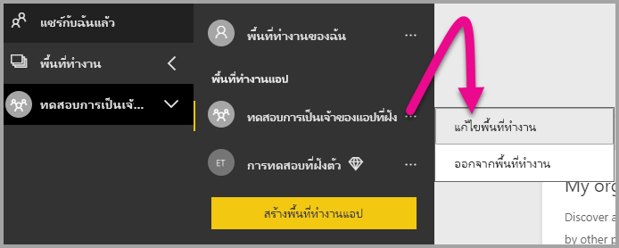

2. ขยาย**ขั้นสูง** แล้วเปิดใช้งาน**ความจุเฉพาะ** จากนั้นเลือกความจุเฉพาะที่คุณสร้างขึ้น จากนั้นเลือก**บันทึก**

    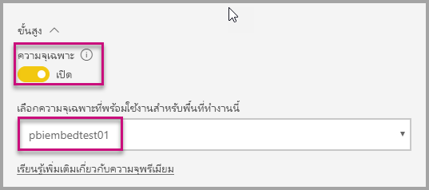

3. หลังจากเลือก **บันทึก** คุณควรจะเห็น**รูปข้าวหลามตัด**ถัดจากชื่อพื้นที่ทำงาน

    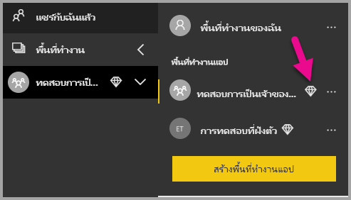

## <a name="next-steps"></a>ขั้นตอนถัดไป

ในบทช่วยสอนนี้ คุณจะได้เรียนรู้วิธีฝังเนื้อหา Power BI ในแอปพลิเคชันสำหรับลูกค้าของคุณ คุณยังสามารถทดลองฝังเนื้อหา Power BI สำหรับองค์กรของคุณ

> [!div class="nextstepaction"]
>[ฝังตัวสำหรับองค์กรของคุณ](embed-sample-for-your-organization.md)

มีคำถามเพิ่มเติมหรือไม่ [ลองถามชุมชน Power BI](https://community.powerbi.com/)
