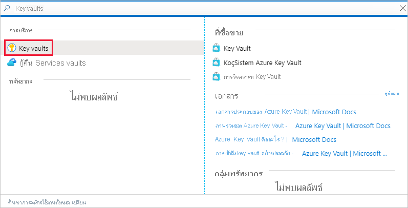

# <a name="embed-power-bi-content-with-service-principal-and-a-certificate"></a>การฝังเนื้อหา Power BI ด้วยบริการหลักและใบรับรอง

[!INCLUDE[service principal overview](../../includes/service-principal-overview.md)]

>[!NOTE]
>เราขอแนะนำให้คุณรักษาความปลอดภัยบริการหลังบ้านของคุณโดยใช้ใบรับรอง แทนที่จะเป็นคีย์ลับ [เรียนรู้เพิ่มเติมเกี่ยวกับการรับโทเค็นการเข้าถึงจาก Azure AD โดยใช้คีย์ลับหรือใบรับรอง](https://docs.microsoft.com/azure/architecture/multitenant-identity/client-assertion)

## <a name="certificate-based-authentication"></a>การรับรองความถูกต้องตามใบรับรอง

การรับรองความถูกต้องตามใบรับรองช่วยให้คุณได้รับการรับรองจาก Azure Active Directory (Azure AD) ที่มีใบรับรองไคลเอ็นต์บนอุปกรณ์ Windows, Android หรือ iOS หรือเก็บไว้ใน [Azure Key Vault](https://docs.microsoft.com/azure/key-vault/basic-concepts)

การใช้วิธีการรับรองความถูกต้องนี้อนุญาตให้จัดการใบรับรองจากจุดศูนย์กลางโดยใช้ CA สำหรับการสับเปลี่ยนหรือการเพิกถอน

คุณสามารถเรียนรู้เพิ่มเติมเกี่ยวกับใบรับรองใน Azure AD ได้จากหน้า [โฟลว์ข้อมูลประจำตัวของไคลเอ็นต์](https://github.com/AzureAD/microsoft-authentication-library-for-dotnet/wiki/Client-credential-flows) ใน GitHub

## <a name="method"></a>วิธี

เมื่อต้องการใช้บริการหลักและใบรับรองที่มีการวิเคราะห์แบบฝังตัว ให้ทำตามขั้นตอนเหล่านี้:

1. สร้างใบรับรอง

2. สร้างแอปพลิเคชัน Azure AD

3. ตั้งค่าการรับรองความถูกต้องใบรับรอง

4. รับใบรับรองจาก Azure Key Vault

5. รับรองความถูกต้องโดยใช้บริการหลักและใบรับรอง

## <a name="step-1---create-a-certificate"></a>ขั้นตอนที่ 1 - สร้างใบรับรอง

คุณสามารถจัดหาใบรับรองจาก*ผู้ให้บริการออกใบรับรอง*ที่เชื่อถือได้ หรือสร้างใบรับรองด้วยตัวคุณเอง

ในส่วนนี้จะอธิบายการสร้างใบรับรองโดยใช้ [Azure Key Vault](https://docs.microsoft.com/azure/key-vault/create-certificate) และดาวน์โหลดไฟล์ *.cer* ซึ่งประกอบด้วยคีย์สาธารณะ

1. ลงชื่อเข้าใช้ใน [Microsoft Azure](https://ms.portal.azure.com/#allservices)

2. ค้นหา **ชุดเก็บคีย์** และคลิกที่ลิงก์ **ชุดเก็บคีย์**

    

3. คลิกชุดเก็บคีย์ที่คุณต้องการเพิ่มใบรับรอง

    

4. คลิก **ใบรับรอง**

    

5. คลิก **สร้าง/นำเข้า**

    

6. กำหนดค่างเขตข้อมูล **สร้างใบรับรอง** ดังนี้:

    * **วิธีการสร้างใบรับรอง** - ทั่วไป

    * **ชื่อใบรับรอง** - ป้อนชื่อสำหรับใบรับรองของคุณ

    * **ชนิดของผู้ให้บริการออกใบรับรอง (CA)** - ใบรับรองแบบสร้างขึ้นมาเอง

    * **หัวเรื่อง** - ชื่อจำเพาะ [X.500](https://wikipedia.org/wiki/X.500)

    * **ชื่อ DNS** - ชื่อ DNS 0

    * **ระยะเวลาการมีผลบังคับใช้ (เดือน)** - ป้อนระยะเวลาการมีผลบังคับใช้ของใบรับรอง

    * **ชนิดเนื้อหา** - PKCS #12

    * **ชนิดการดำเนินการตลอดอายุการใช้** - ต่ออายุอัตโนมัติตามเปอร์เซ็นต์อายุการใช้งานที่ระบุ

    * **เปอร์เซ็นต์อายุการใช้งาน** - 80

    * **การกำหนดค่านโยบายขั้นสูง** - ไม่ได้กำหนดค่า

7. คลิก**สร้าง** ใบรับรองที่สร้างขึ้นใหม่ถูกปิดใช้งานตามค่าเริ่มต้น อาจใช้เวลานานถึงห้านาทีในการเปิดใช้งาน

8. เลือกใบรับรองที่คุณสร้างขึ้น

9. คลิก **ดาวน์โหลดในรูปแบบ CER** ไฟล์ที่ดาวน์โหลดประกอบด้วยคีย์สาธารณะ

    

## <a name="step-2---create-an-azure-ad-application"></a>ขั้นตอนที่ 2 - สร้างแอปพลิเคชัน Azure AD

[!INCLUDE[service principal create app](../../includes/service-principal-create-app.md)]

## <a name="step-3---set-up-certificate-authentication"></a>ขั้นตอนที่ 3 - ตั้งค่าการรับรองความถูกต้องใบรับรอง

1. ในแอปพลิเคชัน Azure AD ของคุณ ให้คลิกที่แท็บ **ใบรับรอง & ความลับ**

     

2. คลิก **อัปโหลดใบรับรอง** และอัปโหลดไฟล์ *.cer* ที่คุณสร้างและดาวน์โหลดใน [ขั้นตอนแรก](#step-1---create-a-certificate) ของบทช่วยสอนนี้ ไฟล์ *.cer* ประกอบด้วยคีย์สาธารณะ

## <a name="step-4---get-the-certificate-from-azure-key-vault"></a>ขั้นตอนที่ 4 - รับใบรับรองจาก Azure Key Vault

ใช้ข้อมูลประจำตัวของบริการที่มีการจัดการ (MSI) เพื่อรับใบรับรองจาก Azure Key Vault กระบวนการนี้เกี่ยวข้องกับการรับใบรับรอง *.pfx* ที่ประกอบด้วยคีย์สาธารณะและส่วนตัว

อ้างถึงตัวอย่างโค้ดสำหรับการอ่านใบรับรองจาก Azure Key Vault ถ้าคุณต้องการใช้ Visual Studio ให้อ้างอิงถึง [กำหนดค่า Visual Studio เพื่อใช้ MSI](#configure-visual-studio-to-use-msi)

```csharp
private X509Certificate2 ReadCertificateFromVault(string certName)
{
    var serviceTokenProvider = new AzureServiceTokenProvider();
    var keyVaultClient = new KeyVaultClient(new KeyVaultClient.AuthenticationCallback(serviceTokenProvider.KeyVaultTokenCallback));
    CertificateBundle certificate = null;
    SecretBundle secret = null;
    try
    {
        certificate = keyVaultClient.GetCertificateAsync($"https://{KeyVaultName}.vault.azure.net/", certName).Result;
        secret = keyVaultClient.GetSecretAsync(certificate.SecretIdentifier.Identifier).Result;
    }
    catch (Exception)
    {
        return null;
    }

    return new X509Certificate2(Convert.FromBase64String(secret.Value));
}
```

## <a name="step-5---authenticate-using-service-principal-and-a-certificate"></a>ขั้นตอนที่ 5 - รับรองความถูกต้องโดยใช้บริการหลักและใบรับรอง

คุณสามารถรับรองความถูกต้องของแอปของคุณโดยใช้บริการหลักและใบรับรองที่จัดเก็บไว้ใน Azure Key Vault ได้โดยการเชื่อมต่อกับ Azure Key Vault

หากต้องการเชื่อมต่อและอ่านใบรับรองจาก Azure Key Vault โปรดดูโค้ดด้านล่าง

>[!NOTE]
>ถ้าคุณมีใบรับรองที่สร้างโดยองค์กรของคุณแล้ว ให้อัปโหลดไฟล์ *.pfx* ไปยัง Azure Key Vault

```csharp
// Preparing needed variables
var Scope = "https://analysis.windows.net/powerbi/api/.default"
var ApplicationId = "{YourApplicationId}"
var tenantSpecificURL = "https://login.microsoftonline.com/{YourTenantId}/"
X509Certificate2 certificate = ReadCertificateFromVault(CertificateName);

// Authenticating with a SP and a certificate
public async Task<AuthenticationResult> DoAuthentication(){
    IConfidentialClientApplication clientApp = null;
    clientApp = ConfidentialClientApplicationBuilder.Create(ApplicationId)
                                                    .WithCertificate(certificate)
                                                    .WithAuthority(tenantSpecificURL)
                                                    .Build();
    try
    {
        authenticationResult = await clientApp.AcquireTokenForClient(Scope).ExecuteAsync();
    }
    catch (MsalException)
    {
        throw;
    }
    return authenticationResult
}
```

## <a name="configure-visual-studio-to-use-msi"></a>กำหนดค่า Visual Studio เพื่อใช้ MSI

เมื่อสร้างโซลูชันแบบฝังตัวของคุณ อาจเป็นประโยชน์ในการกำหนดค่า Visual Studio เพื่อใช้ข้อมูลประจำตัวของบริการที่มีการจัดการ (MSI) [MSI](https://docs.microsoft.com/azure/active-directory/managed-identities-azure-resources/overview) คือคุณลักษณะที่ช่วยให้คุณสามารถจัดการข้อมูลประจำตัว Azure AD ของคุณได้ เมื่อกำหนดค่าแล้ว จะอนุญาตให้ Visual Studio รับรองความถูกต้องเทียบกับ Azure Key Vault ของคุณ

1. เปิดโครงการของคุณใน Visual Studio

2. คลิก **เครื่องมือ** > **ตัวเลือก**

     

3. ค้นหา**การเลือกบัญชี** และคลิก**การเลือกบัญชี**

    

4. เพิ่มบัญชีที่สามารถเข้าถึง Azure Key Vault ของคุณ

[!INCLUDE[service principal limitations](../../includes/service-principal-limitations.md)]

## <a name="next-steps"></a>ขั้นตอนถัดไป

>[!div class="nextstepaction"]
>[ลงทะเบียนแอป](register-app.md)

>[!div class="nextstepaction"]
>[Power BI Embedded สำหรับลูกค้าของคุณ](embed-sample-for-customers.md)

>[!div class="nextstepaction"]
>[แอปพลิเคชันและออบเจ็กต์บริการหลักใน Azure Active Directory](https://docs.microsoft.com/azure/active-directory/develop/app-objects-and-service-principals)

>[!div class="nextstepaction"]
>[ความปลอดภัยระดับแถวโดยใช้เกตเวย์ข้อมูลภายในองค์กรที่มีโครงร่างสำคัญของบริการ](embedded-row-level-security.md#on-premises-data-gateway-with-service-principal)

>[!div class="nextstepaction"]
>[การฝังเนื้อหา Power BI ด้วยบริการหลักและความลับของแอปพลิเคชัน](embed-service-principal.md)