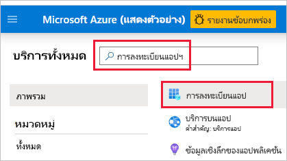
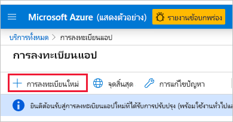
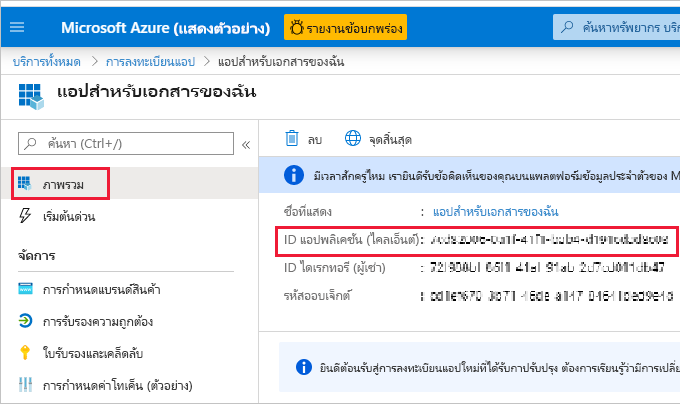
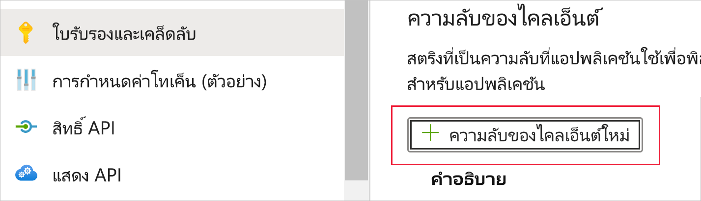
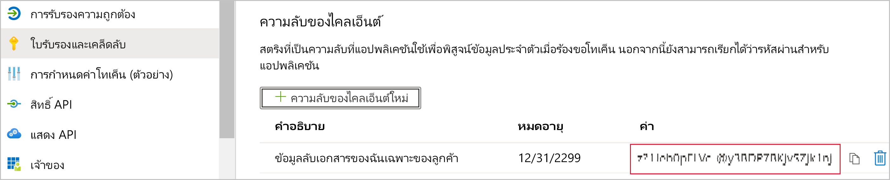
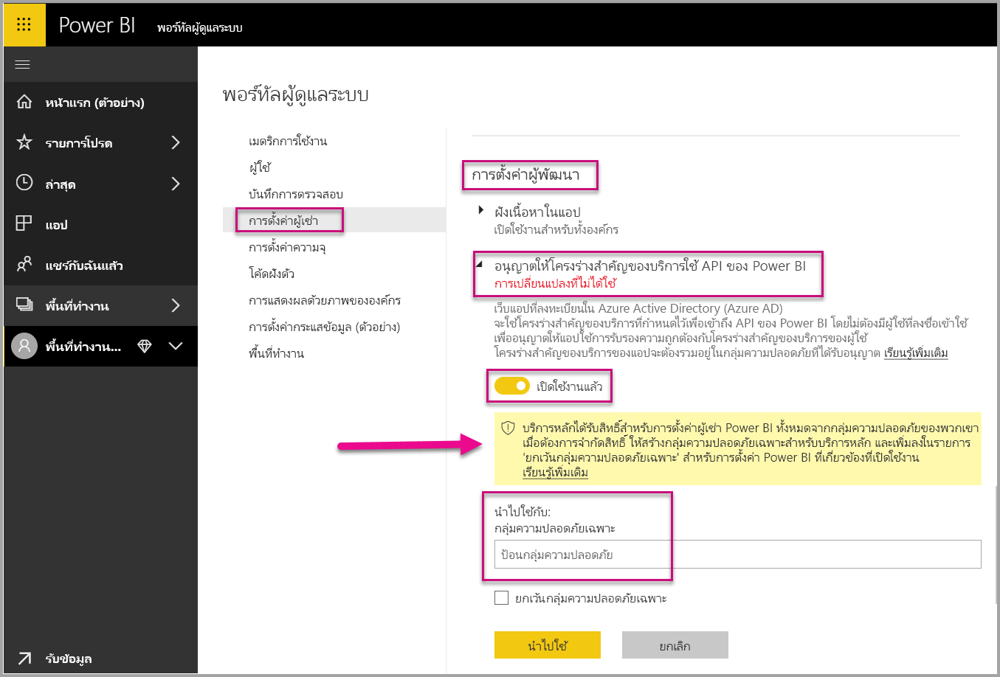
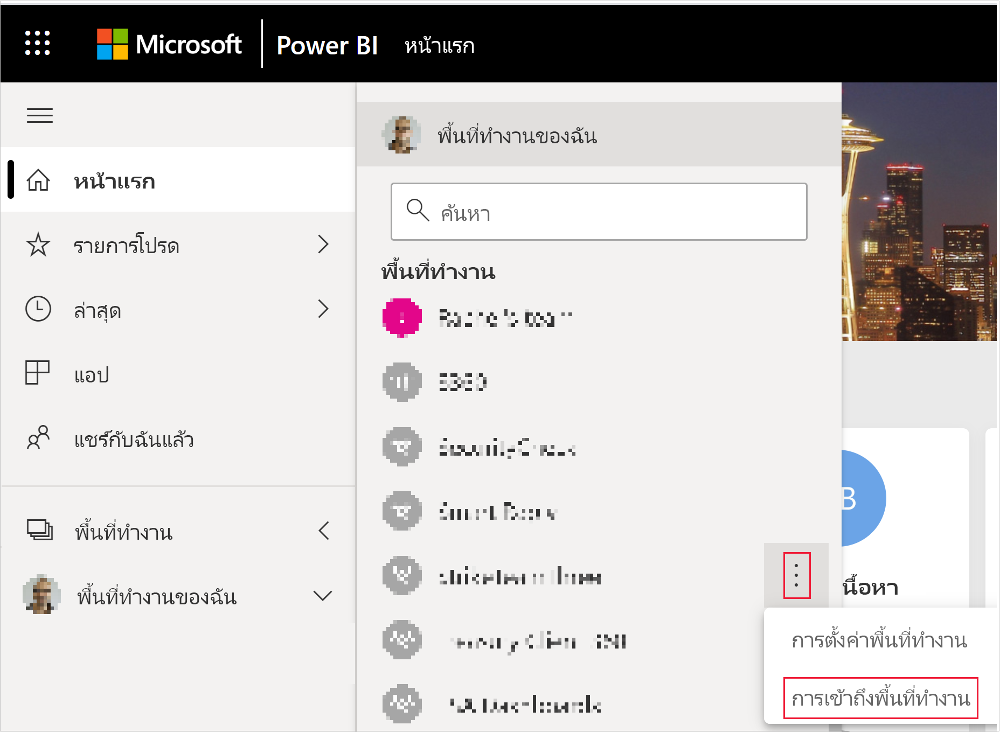
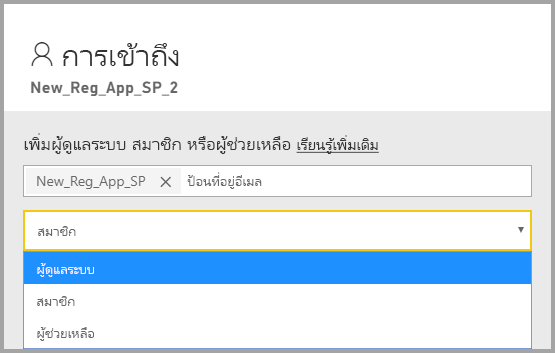

# <a name="embedding-power-bi-content-with-service-principal-and-application-secret"></a>การฝังเนื้อหา Power BI ด้วยบริการหลักและความลับของแอปพลิเคชัน

[!INCLUDE[service principal overview](../../includes/service-principal-overview.md)]

บทความนี้อธิบายการรับรองความถูกต้องของบริการหลักโดยใช้ *รหัสแอปพลิเคชัน* และ *ความลับของแอปพลิเคชัน*

## <a name="method"></a>วิธี

เมื่อต้องการใช้บริการหลักและรหัสแอปพลิเคชันที่มีการวิเคราะห์แบบฝังตัว ให้ทำตามขั้นตอนเหล่านี้:

1. สร้าง [แอป Azure AD](https://docs.microsoft.com/azure/active-directory/manage-apps/what-is-application-management)

    1. สร้างความลับของแอป Azure AD
    
    2. รับ *รหัสแอปพลิเคชัน* และ *ความลับของแอปพลิเคชัน* ของแอป

    >[!NOTE]
    >ขั้นตอนเหล่านี้จะอธิบายไว้ใน **ขั้นตอนที่ 1** สำหรับข้อมูลเพิ่มเติมเกี่ยวกับการสร้างแอป Azure AD โปรดดูบทความ [สร้างแอป Azure AD](https://docs.microsoft.com/azure/active-directory/develop/howto-create-service-principal-portal)

2. สร้างกลุ่มความปลอดภัย Azure AD

3. เปิดใช้งานการตั้งค่าการจัดการบริการของ Power BI

4. เพิ่มบริการหลักไปยังพื้นที่ทำงานของคุณ

5. ฝังเนื้อหาของคุณ

> [!IMPORTANT]
> เมื่อคุณเปิดใช้งานบริการหลักที่จะใช้กับ Power BI สิทธิ์ AD ของแอปพลิเคชันไม่มีผลบังคับใช้อีกต่อไป มีจัดการสิทธิ์ของแอปพลิเคชันแล้วผ่านทางพอร์ทัลผู้ดูแลระบบ Power BI

## <a name="step-1---create-an-azure-ad-app"></a>ขั้นตอนที่ 1 - สร้าง แอป Azure AD

สร้างแอป Azure AD โดยใช้วิธีใดวิธีหนึ่งต่อไปนี้:
* สร้างแอปใน [พอร์ทัล Microsoft Azure](https://portal.azure.com/#allservices)
* สร้างแอปโดยใช้ [PowerShell](https://docs.microsoft.com/powershell/azure/create-azure-service-principal-azureps?view=azps-3.6.1)

### <a name="creating-an-azure-ad-app-in-the-microsoft-azure-portal"></a>การสร้างแอป Azure AD ในพอร์ทัล Microsoft Azure

1. ลงชื่อเข้าใช้ใน [Microsoft Azure](https://portal.azure.com/#allservices)

2. ค้นหา **การลงทะเบียนแอป** และคลิกลิงก์ **การลงทะเบียนแอป**

    

3. คลิก **การลงทะเบียนใหม่**

    

4. ระบุข้อมูลที่จำเป็น:
    * **ชื่อ** - กรอกชื่อสำหรับแอปพลิเคชันของคุณ
    * **ประเภทบัญชีที่รองรับการใช้งาน** - เลือกบัญชี Azure AD ที่คุณต้องการ
    * (ไม่บังคับ) **เปลี่ยนเส้นทาง URI** - กรอก URI ถ้าจำเป็น

5. คลิก **ลงทะเบียน**

6. หลังจากลงทะเบียนแล้ว *รหัสแอปพลิเคชัน* จะพร้อมใช้งานจากแท็บ **ภาพรวม** คัดลอกและบันทึก *รหัสแอปพลิเคชัน* สำหรับใช้งานในภายหลัง

    

7. คลิกแท็บ **ใบรับรองและความลับ**

     

8. คลิก **ความลับของไคลเอ็นต์ใหม่**

    

9. ในหน้าต่าง *เพิ่มความลับของไคลเอ็นต์* กรอกคำอธิบาย ระบุเวลาที่คุณต้องการให้ความลับของไคลเอ็นต์หมดอายุ จากนั้นคลิก **เพิ่ม**

10. คัดลอกและบันทึกค่า *ความลับของไคลเอ็นต์*

    

    >[!NOTE]
    >หลังจากที่คุณออกจากหน้าต่างนี้ ค่าความลับของไคลเอ็นต์จะถูกซ่อนอยู่และคุณจะไม่สามารถดูหรือคัดลอกอีกครั้งได้

### <a name="creating-an-azure-ad-app-using-powershell"></a>การสร้างแอป Azure AD โดยใช้ PowerShell

ส่วนนี้จะประกอบด้วยสคริปต์ตัวอย่างในการสร้างแอป Azure AD ใหม่โดยใช้ [PowerShell](https://docs.microsoft.com/powershell/azure/create-azure-service-principal-azureps?view=azps-1.1.0)

```powershell
# The app ID - $app.appid
# The service principal object ID - $sp.objectId
# The app key - $key.value

# Sign in as a user that's allowed to create an app
Connect-AzureAD

# Create a new Azure AD web application
$app = New-AzureADApplication -DisplayName "testApp1" -Homepage "https://localhost:44322" -ReplyUrls "https://localhost:44322"

# Creates a service principal
$sp = New-AzureADServicePrincipal -AppId $app.AppId

# Get the service principal key
$key = New-AzureADServicePrincipalPasswordCredential -ObjectId $sp.ObjectId
```

## <a name="step-2---create-an-azure-ad-security-group"></a>ขั้นตอนที่ 2 - สร้างกลุ่มความปลอดภัย Azure AD

บริการหลักของคุณไม่มีสิทธิ์ในการเข้าถึงเนื้อหา Power BI และ API ของคุณ ในการให้สิทธิ์การเข้าถึงบริการหลัก ให้สร้างกลุ่มความปลอดภัยใน Azure AD และเพิ่มบริการหลักที่คุณสร้างไว้ในกลุ่มความปลอดภัยนั้น

มีสองวิธีในการสร้างกลุ่มความปลอดภัยใน Azure AD:
* ด้วยตนเอง (ใน Azure)
* ใช้ PowerShell

### <a name="create-a-security-group-manually"></a>สร้างกลุ่มความปลอดภัยด้วยตนเอง

หากต้องการสร้างกลุ่มความปลอดภัยใน Azure ด้วยตนเอง ให้ทำตามคำแนะนำในบทความ [สร้างกลุ่มพื้นฐานและเพิ่มสมาชิกโดยใช้ Azure Active Directory](https://docs.microsoft.com/azure/active-directory/fundamentals/active-directory-groups-create-azure-portal) 

### <a name="create-a-security-group-using-powershell"></a>สร้างกลุ่มความปลอดภัยโดยใช้ PowerShell

ในด้านล่างจะแสดงสคริปต์ตัวอย่างในการสร้างกลุ่มความปลอดภัยใหม่ และการเพิ่มแอปไปยังกลุ่มความปลอดภัยนั้น

>[!NOTE]
>หากคุณต้องการเปิดใช้สิทธิ์การเข้าถึงบริการหลักสำหรับทั้งองค์กร โปรดข้ามขั้นตอนนี้

```powershell
# Required to sign in as a tenant admin
Connect-AzureAD

# Create an Azure AD security group
$group = New-AzureADGroup -DisplayName <Group display name> -SecurityEnabled $true -MailEnabled $false -MailNickName notSet

# Add the service principal to the group
Add-AzureADGroupMember -ObjectId $($group.ObjectId) -RefObjectId $($sp.ObjectId)
```

## <a name="step-3---enable-the-power-bi-service-admin-settings"></a>ขั้นตอนที่ 3 - เปิดใช้งานการตั้งค่าการจัดการบริการของ Power BI

เพื่อให้แอป Azure AD สามารถเข้าถึงเนื้อหา Power BI และ API ได้ ผู้ดูแลระบบ Power BI จำเป็นต้องเปิดใช้งานการเข้าถึงบริการหลักในพอร์ทัลผู้ดูแลระบบของ Power BI

เพิ่มกลุ่มความปลอดภัยที่คุณสร้างใน Azure AD สำหรับส่วนกลุ่มความปลอดภัยเฉพาะใน **การตั้งค่านักพัฒนา**

>[!IMPORTANT]
>บริการหลักมีสิทธิ์เข้าถึงการตั้งค่าผู้เช่าใดๆ ที่เปิดใช้งานอยู่ โดยจะรวมถึงกลุ่มความปลอดภัยเฉพาะหรือทั้งองค์กร ขึ้นอยู่กับการตั้งค่าผู้ดูแลระบบของคุณ
>
>เพื่อจำกัดการเข้าถึงบริการหลักของการตั้งค่าผู้เช่าเฉพาะ จะมีการอนุญาตให้เข้าถึงเพียงกลุ่มความปลอดภัยเฉพาะเท่านั้น อีกวิธีหนึ่งคือคุณสามารถสร้างกลุ่มความปลอดภัยเฉพาะสำหรับบริการหลัก และแยกออกไปจากการตั้งค่าผู้เช่าที่ต้องการได้



## <a name="step-4---add-the-service-principal-as-an-admin-to-your-workspace"></a>ขั้นตอนที่ 4 - เพิ่มบริการหลักเป็นผู้ดูแลระบบในพื้นที่ทำงานของคุณ

ในการเปิดใช้งานการเข้าถึงแอป Azure AD ของคุณ เช่น รายงาน แดชบอร์ด และชุดข้อมูลในบริการ Power BI ให้เพิ่มเอนทิตีบริการหลักเป็นสมาชิกหรือผู้ดูแลระบบในพื้นที่ทำงานของคุณ

>[!NOTE]
>ส่วนนี้แสดงคำแนะนำของ UI คุณยังสามารถเพิ่มบริการหลักให้กับพื้นที่ทำงานโดยใช้ [กลุ่ม - เพิ่ม API ของผู้ใช้กลุ่ม](https://docs.microsoft.com/rest/api/power-bi/groups/addgroupuser)

1. เลื่อนไปยังพื้นที่ทำงานที่คุณต้องการเปิดใช้งานการเข้าถึง และจากเมนู **เพิ่มเติม** เลือก **การเข้าถึงพื้นที่ทำงาน**

    

2. เพิ่มบริการหลักเป็น **ผู้ดูแลระบบ** หรือ **สมาชิก** ในพื้นที่ทำงาน

    

## <a name="step-5---embed-your-content"></a>ขั้นตอนที่ 5 - ฝังเนื้อหาของคุณ

คุณสามารถฝังเนื้อหาของคุณภายในแอปพลิเคชันตัวอย่าง หรือภายในแอปพลิเคชันของคุณเอง

* [ฝังเนื้อหาโดยใช้แอปพลิเคชันตัวอย่าง](embed-sample-for-customers.md#embed-content-using-the-sample-application)
* [ฝังเนื้อหาภายในแอปพลิเคชันของคุณ](embed-sample-for-customers.md#embed-content-within-your-application)

หลังจากที่มีการฝังเนื้อหาของคุณแล้ว คุณก็พร้อมที่จะ [ย้ายไปยังการผลิต](embed-sample-for-customers.md#move-to-production)

## <a name="considerations-and-limitations"></a>ข้อควรพิจารณาและข้อจำกัด

* บริการหลักจะทำงานร่วมกับ[พื้นที่ทำงานใหม่](../../collaborate-share/service-create-the-new-workspaces.md)เท่านั้น
* **ความจุเฉพาะของฉัน** ไม่ได้รับการสนับสนุนเมื่อใช้บริการหลัก
* ต้องใช้ความจุเฉพาะเมื่อย้ายไปยังการผลิต
* คุณไม่สามารถลงชื่อเข้าใช้พอร์ทัล Power BI ด้วยบริการหลัก
* คุณจำเป็นต้องมีสิทธิ์ของผู้ดูแลระบบ Power BI เพื่อเปิดใช้งานบริการหลักในการตั้งค่านักพัฒนาภายในพอร์ทัลผู้ดูแลระบบของ Power BI
* แอปพลิเคชัน [แบบฝังตัวสำหรับองค์กรของคุณ](embed-sample-for-your-organization.md) ไม่สามารถใช้บริการหลักได้
* [Dataflows](../../transform-model/service-dataflows-overview.md) การจัดการไม่ได้รับการสนับสนุน
* ปัจจุบัน โครงร่างสำคัญของบริการไม่สนับสนุนผู้ดูแลระบบ APIs
* เมื่อใช้โครงร่างสำคัญของบริการด้วยแหล่งข้อมูล [Azure Analysis Services](https://docs.microsoft.com/azure/analysis-services/analysis-services-overview) โครงร่างสำคัญของบริการจะต้องมีสิทธิ์อินสแตนซ์ Azure Analysis Services การใช้กลุ่มความปลอดภัยที่ประกอบด้วยโครงร่างสำคัญของบริการสำหรับวัตถุประสงค์นี้ไม่ได้ผล

## <a name="next-steps"></a>ขั้นตอนถัดไป

* [Power BI Embedded สำหรับลูกค้าของคุณ](embed-sample-for-customers.md)

* [ความปลอดภัยระดับแถวโดยใช้เกตเวย์ข้อมูลภายในองค์กรที่มีโครงร่างสำคัญของบริการ](embedded-row-level-security.md#on-premises-data-gateway-with-service-principal)
