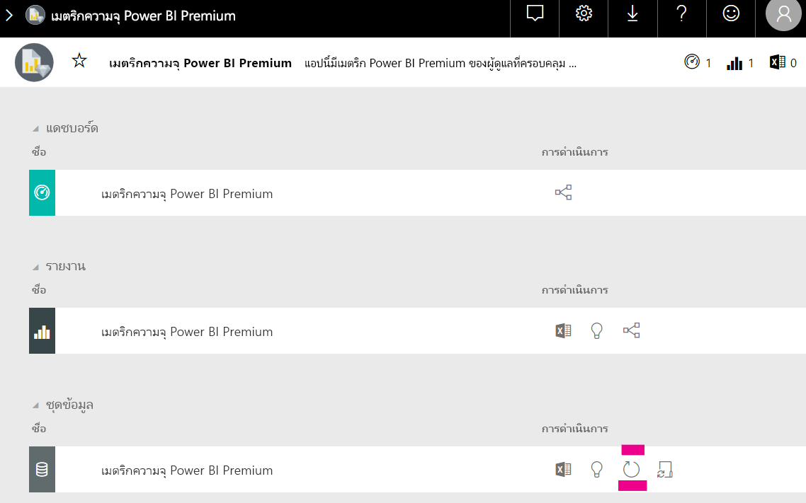

# ความจุและ SKU ในการวิเคราะห์แบบฝังของ Power BI

การคำนวณชนิดของความจุที่จำเป็นสำหรับการปรับใช้การวิเคราะห์แบบฝังของ Power BI อาจซับซ้อนได้ ทั้งนี้ เนื่องจากการคำนวณนี้จะขึ้นอยู่กับพารามิเตอร์หลายพารามิเตอร์ ซึ่งยากต่อการคาดการณ์บางส่วน

บางสิ่งที่ต้องคำนึงถึงเมื่อวางแผนความจุของคุณ:

* รูปแบบข้อมูลที่คุณกำลังใช้
* ตัวเลขและความซับซ้อนของคิวรีที่จำเป็น
* การแจกจ่ายรายชั่วโมงของการใช้งานแอปพลิเคชันของคุณ
* อัตราการรีเฟรชข้อมูล
* รูปแบบการใช้งานเพิ่มเติมที่ยากต่อการคาดการณ์

บทความนี้ได้รับการออกแบบมาเพื่อทำให้การวางแผนความจุสำหรับการวิเคราะห์แบบฝังของ Power BI ง่ายขึ้นโดยการแนะนำเครื่องมือการประเมินความจุของ [Power BI ที่จัดสรรไว้](https://github.com/microsoft/PowerBI-Tools-For-Capacities/tree/master/LoadTestingPowerShellTool/) ที่สร้างขึ้นการโหลดการทดสอบสำหรับความจุการวิเคราะห์แบบฝังของ Power BI แบบอัตโนมัติ(*A*, *EM* หรือ *P*SKU)

## เครื่องมือการวางแผน

 เครื่องมือการประเมินความจุของ[Power BI ที่จัดสรรไว้](https://github.com/microsoft/PowerBI-Tools-For-Capacities/tree/master/LoadTestingPowerShellTool/) สามารถช่วยให้คุณรู้จำนวนความจุผู้ใช้ที่คุณจะสามารถมีได้ ใช้ PowerShell เพื่อสร้างการทดสอบการโหลดอัตโนมัติกับความจุของคุณ และช่วยให้คุณสามารถเลือกรายงานที่จะทดสอบและจำนวนผู้ใช้พร้อมกันหลายรายที่จะจำลองได้

เครื่องมือสร้างการโหลดความจุโดยการแสดงรายงานแต่ละครั้งอย่างต่อเนื่องด้วยค่าตัวกรองใหม่ (เพื่อป้องกันไม่ให้ประสิทธิภาพที่ดีเกินจริงรายงานแคช) จนโทเค็นที่จำเป็นสำหรับการตรวจสอบความถูกต้องของเครื่องมือกับบริการหมดอายุ

### การใช้เครื่องมือการวางแผน

เมื่อเรียกใช้เครื่องมือ ให้ระวังการโหลดที่มีอยู่บนความจุของคุณและตรวจสอบให้แน่ใจว่าไม่ได้เรียกใช้การทดสอบการโหลดในช่วงเวลาการใช้งานสูงสุด

ต่อไปนี้คือตัวอย่างของวิธีที่คุณสามารถใช้เครื่องมือการวางแผนได้

* ผู้ดูแลความจุสามารถรู้จำนวนผู้ใช้ที่สามารถจัดการได้ในรอบเวลาที่กำหนดได้ดีขึ้นได้
* ผู้เขียนรายงานสามารถทำความเข้าใจลักษณะการทำงานของการโหลด โดยใช้การวัดด้วย[ตัววิเคราะห์ประสิทธิภาพ](https://docs.microsoft.com/power-bi/desktop-performance-analyzer)ของ Power BI desktop 
* คุณสามารถเห็นการแสดงผลที่เกิดขึ้นตามเวลาจริงบนเบราว์เซอร์ของคุณได้
* ในการใช้ตัวสร้างโพรไฟล์ของ SQL Server คุณสามารถ[เชื่อมต่อกับปลายทาง XMLA](https://powerbi.microsoft.com/blog/power-bi-open-platform-connectivity-with-xmla-endpoints-public-preview/) ของความจุที่วัดเพื่อดูคิวรีที่กำลังดำเนินการได้
* ผลการทดสอบการโหลดจะปรากฏในหน้าชุดข้อมูลแอปเมตริกของความจุแบบพรีเมียม ผู้ดูแลความจุสามารถใช้เครื่องมือนี้เพื่อสร้างการโหลดและดูว่าการโหลดจะแสดงขึ้นได้อย่างไรได้

### ตรวจทานผลการทดสอบ

หากต้องการดูผลกระทบของการทดสอบการโหลดในแอปเมตริกหลังจากการทดสอบ ให้ทำตามคำแนะนำด้านล่าง คาดว่าจะมีความล่าช้า 15 นาทีตั้งแต่เวลาที่การทดสอบเริ่มสร้างการโหลด จนกว่าเวลาที่โหลดจะปรากฏในเมตริก

1. ขยายแถบ**ชุดข้อมูล**ของหน้าเริ่มต้น[แอปเมตริก](../../admin/service-admin-premium-monitor-capacity.md)ของคุณ
2. เริ่มต้นการรีเฟรชตามความต้องการโดยการคลิก**รีเฟรชทันที** ผู้ดูแลระบบควร

    

## เครื่องมือความจุของ Power BI ที่เก็บ GitHub

เครื่องมือความจุของ [Power BI ที่เก็บ GitHub](https://github.com/microsoft/PowerBI-Tools-For-Capacities) ถูกสร้างขึ้นเพื่อโฮสต์เครื่องมือการวางแผนความจุและเครื่องมือและโปรแกรมอรรถประโยชน์อื่นๆ ในอนาคต

ที่เก็บข้อมูลเป็นโอเพ่นซอร์สและผู้ใช้ควรได้รับการสนับสนุน มีส่วนร่วม เพิ่มเครื่องมือเพิ่มเติมที่เกี่ยวข้องกับ Power BI Premium และความสามารถในการฝังและปรับปรุงเครื่องมือเดิมที่มีอยู่

## ขั้นตอนถัดไป

> [!div class="nextstepaction"]
>[ความจุและ SKU ในการวิเคราะห์แบบฝังตัวของ Power BI](embedded-capacity.md)

> [!div class="nextstepaction"]
>[แนวทางปฏิบัติที่ดีที่สุดเพื่อประสิทธิภาพการทำงานของ Power BI Embedded](embedded-performance-best-practices.md)