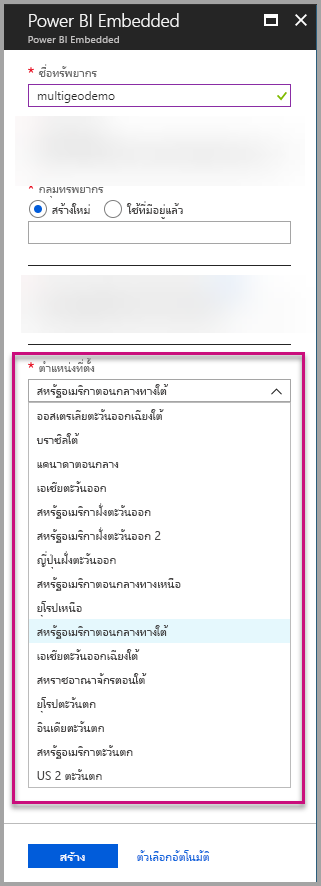
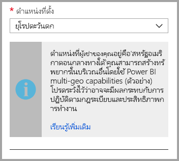
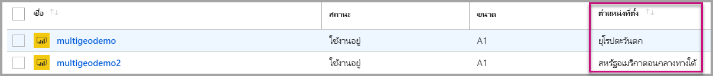
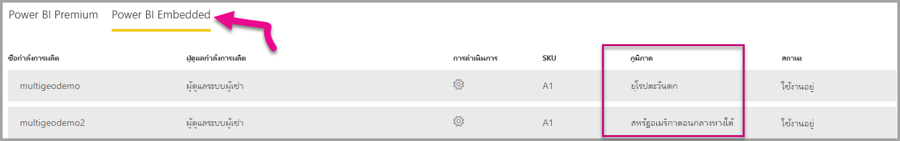

# การสนับสนุนหลายภูมิภาคสำหรับ Power BI Embedded

**การสนับสนุนหลายภูมิภาคเพื่อ Power BI Embedded**หมายความว่า Isv และองค์กรที่สร้างแอปพลิเคชันโดยใช้ Power BI Embedded ฝังตัววิเคราะห์ลงในแอปของพวกเขา จะสามารถปรับใช้ข้อมูลของพวกเขาในภูมิภาคต่างๆ ได้ทั่วโลก

ตอนนี้ลูกค้าที่ใช้**Power BI Embedded**สามารถตั้งค่า**ความจุ**โดยใช้ตัวเลือก**หลายภูมิภาค**ตามคุณลักษณะและข้อจำกัดที่[Power BI Premium สนับสนุน](../../service-admin-premium-Multi-Geo.md)

## สร้างทรัพยากรความจุ Power BI Embedded ใหม่ด้วย Multi-Geo

ในหน้าจอ**สร้างทรัพยากร** คุณจำเป็นต้องเลือกตำแหน่งที่ตั้งของความจุของคุณ จนถึงตอนนี้ ความจุจะถูกจำกัดไว้ที่ตำแหน่งที่ตั้งของผู้เช่า Power BI ของคุณเท่านั้น ดังนั้นจึงสามารถใช้งานได้เฉพาะสถานที่เดียว ด้วย Multi-Geo คุณสามารถเลือกภูมิภาคต่างๆ เพื่อปรับใช้ความจุของคุณ

โปรดสังเกตว่า เมื่อเปิดเมนูดรอปดาวน์ตำแหน่งที่ตั้ง ตัวเลือกในค่าเริ่มต้นคือบ้านผู้เช่า
  

เมื่อเลือกตำแหน่งที่ตั้งอื่น ข้อความจะพร้อมท์ให้คุณทราบถึงสิ่งที่เลือก

## ดูตำแหน่งที่ตั้งความจุ

คุณสามารถดูตำแหน่งที่ตั้งความจุของคุณได้อย่างง่ายดายเมื่อไปที่หน้าการจัดการ Power BI Embedded หลัก ในพอร์ทัล Azure

จะพร้อมใช้งานในพอร์ทัลผู้ดูแลระบบใน Powerbi.com ในพอร์ทัลผู้ดูแลระบบ เลือก 'ตั้งค่าความจุ' และจากนั้น สลับไปยังแท็บ 'Power BI Embedded '

[เรียนรู้เพิ่มเติมเกี่ยวกับการสร้างความจุด้วย Power BI Embedded](azure-pbie-create-capacity.md)

## จัดการตำแหน่งที่ตั้งความจุที่มีอยู่

คุณไม่สามารถเปลี่ยนตำแหน่งที่ตั้งของทรัพยากรของ Power BI Embedded เมื่อคุณสร้างความจุใหม่

เมื่อต้องย้ายเนื้อหา Power BI ของคุณไปยังภูมิภาคอื่น ทำตามขั้นตอนเหล่านี้:

1. [สร้างความจุใหม่](azure-pbie-create-capacity.md)ในภูมิภาคอื่น

2. กำหนดพื้นที่ทำงานทั้งหมดจากความจุที่มีอยู่ให้กับความจุใหม่

3. ลบความจุเก่าหรือหยุดชั่วคราว

สิ่งสำคัญคือ ถ้าคุณตัดสินใจที่จะลบความจุโดยไม่กำหนดเนื้อหาของความจุนั้นใหม่ เนื้อหาทั้งหมดจะย้ายไปยังความจุที่แชร์ร่วมกัน ซึ่งอยู่ในภูมิภาคบ้านของคุณ

## การสนับสนุน API สำหรับ Multi-Geo

เพื่อสนับสนุนการจัดการความจุด้วย Multi-Geo ผ่าน API เราได้ทำการเปลี่ยนแปลง API ที่มีอยู่:

1. **[รับความจุ](https://docs.microsoft.com/rest/api/power-bi/capacities/getcapacities)** - API จะส่งกลับรายการความจุพร้อมด้วยการเข้าถึงให้แก่ผู้ใช้ การตอบสนองตอนนี้มีคุณสมบัติเพิ่มเติมที่เรียกว่า 'ภูมิภาค' ที่ระบุตำแหน่งที่ตั้งของความจุ

2. **[กำหนดความจุ](https://docs.microsoft.com/rest/api/power-bi/capacities)** - API จะอนุญาตให้กำหนดพื้นที่ทำงานให้กับความจุ การดำเนินการนี้ไม่อนุญาตให้คุณกำหนดพื้นที่ทำงานให้กับความจุภายนอกภูมิภาคบ้านของคุณ หรือย้ายพื้นที่ทำงานระหว่างความจุในภูมิภาคอื่น เมื่อต้องดำเนินการนี้ ผู้ใช้หรือ[บริการหลัก](embed-service-principal.md)ยังคงต้องใช้สิทธิ์ระดับผู้ดูแลระบบบนพื้นที่ทำงาน และจัดการและกำหนดสิทธิ์บนความจุเป้าหมาย

3. **[ Azure Resource Manager API](https://docs.microsoft.com/rest/api/power-bi-embedded/capacities)** - :ซึ่งเป็นตัวดำเนินการ API การจัดการทรัพยากร Azure ทั้งหมด รวมทั้ง*สร้าง*และ*ลบ*ให้การสนับสนุน Multi-Geo

## ข้อจำกัดและข้อควรพิจารณา

* ยืนยันว่า การโยกย้ายที่คุณเริ่มต้นระหว่างภูมิภาคปฏิบัติตามข้อบังคับของบริษัทและภาครัฐของก่อนเริ่มต้นการถ่ายโอนข้อมูล

* คิวรีที่ได้รับการแคชที่เก็บอยู่ในภูมิภาคระยะไกลจะพักอยู่ในภูมิภาคนั้น อย่างไรก็ตาม ข้อมูลอื่นๆ ในการส่งต่ออาจไปกลับมาระระหว่างพื้นที่ที่แตกต่างกัน

* เมื่อมีการย้ายข้อมูลจากภูมิภาคหนึ่งไปอีกภูมิภาคหนึ่งในสภาพแวดล้อมของ Multi-Geo ข้อมูลต้นทางอาจอยู่ในภูมิภาคที่ใช้เวลาย้ายนานถึง 30 วัน ในช่วงเวลาดังกล่าว ผู้ใช้ไม่สามารถเข้าถึงข้อมูลได้ ข้อมูลจะถูกลบออกจากภูมิภาคและทำลายในระยะเวลา 30 วันนั้น

* Multi-Geo ไม่ได้ส่งผลให้เกิดประสิทธิภาพที่ดีขึ้นโดยทั่วไป การโหลดรายงานและแดชบอร์ดยังเกี่ยวข้องกับคำร้องขอเมต้าดาต้าไปยังภูมิภาคบ้าน

## ขั้นตอนถัดไป

เรียนรู้เพิ่มเติมเกี่ยวกับความจุ Power BI Embedded และตัวเลือก Multi-Geo สำหรับความจุทั้งหมด โดยอ้างอิงลิงก์ด้านล่าง

* [Power BI Embedded คืออะไร](azure-pbie-what-is-power-bi-embedded.md)

* [สร้างความจุ Power BI Embedded](azure-pbie-create-capacity.md)

* [Multi-Geo ในความจุ Power BI Premium](../../service-admin-premium-multi-geo.md)

มีคำถามเพิ่มเติมหรือไม่ [ลองถามชุมชน Power BI](https://community.powerbi.com/)