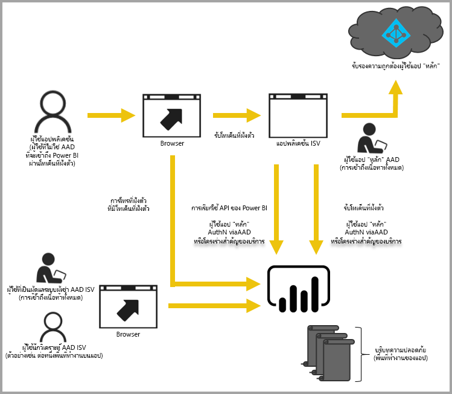

# การวิเคราะห์แบบฝังตัวด้วย Power BI

บริการ Power BI (SaaS) และบริการ Power BI Embedded ใน Azure (PaaS) มี API สำหรับการฝังสำหรับแดชบอร์ดและรายงาน เมื่อทำการฝังเนื้อหา คุณจะสามารถเข้าถึงคุณลักษณะล่าสุดของ Power BI เช่น แดชบอร์ด เกตเวย์ และพื้นที่ทำงาน

คุณสามารถเข้าถึง[เครื่องมือตั้งค่าการฝังตัว](https://aka.ms/embedsetup)เพื่อเริ่มต้นใช้งานได้อย่างรวดเร็ว และดาวน์โหลดแอปพลิเคชันตัวอย่างได้

เลือกโซลูชันที่เหมาะกับคุณ:

* [การฝังตัวสำหรับองค์กรของคุณ](embedding.md#embedding-for-your-organization) ให้คุณสามารถขยายบริการของ Power BI ในการทำเช่นนี้ เรียกใช้โซลูชัน[การฝังตัวสำหรับองค์กรของคุณ](https://aka.ms/embedsetup/UserOwnsData)
* [การฝังสำหรับลูกค้าของคุณ](embedding.md#embedding-for-your-customers)ช่วยให้คุณสามารถฝังแดชบอร์ดและรายงานสำหรับผู้ใช้ที่ไม่มีบัญชี Power BI ในการทำเช่นนี้ เรียกใช้โซลูชัน[การฝังตัวสำหรับลูกค้าของคุณ](https://aka.ms/embedsetup/AppOwnsData)

## ใช้ API

มีสองสถานการณ์หลักสำหรับการฝังเนื้อหา Power BI:
- การฝังสำหรับผู้ใช้ขององค์กรของคุณ (ที่มีสิทธิการใช้งาน Power BI) 
 
- การฝังสำหรับผู้ใช้และลูกค้าของคุณโดยไม่จำเป็นต้องมีสิทธิการใช้งาน Power BI 

[Power BI REST API](https://docs.microsoft.com/rest/api/power-bi/) ใช้ได้สำหรับทั้งสองสถานการณ์

สำหรับลูกค้าและผู้ใช้ที่มีใบอนุญาต Power BI คุณสามารถฝังแดชบอร์ดและรายงานลงในแอปพลิเคชันแบบกำหนดเองโดยใช้ API เดียวกันเพื่อให้บริการแก่องค์กรหรือลูกค้าของคุณ ลูกค้าของคุณจะเห็นข้อมูลที่จัดการโดยแอปพลิเคชัน นอกจากนี้ ผู้ใช้ Power BI ในองค์กรของคุณจะมีทางเลือกเพิ่มเติมในการดู*ข้อมูลของพวกเขา*ได้โดยตรงใน Power BI หรือบริบทของแอปพลิเคชันแบบฝัง คุณสามารถใช้ประโยชน์สูงสุดจาก JavaScript และ REST API สำหรับความต้องการในการฝังของคุณ

เมื่อต้องการทำความเข้าใจวิธีการทำงานของการฝัง โปรดดู[ตัวอย่างการฝัง JavaScript](https://microsoft.github.io/PowerBI-JavaScript/demo/)

## การฝังสำหรับองค์กรของคุณ

**การฝังตัวสำหรับองค์กรของคุณ** ให้คุณสามารถขยายบริการของ Power BI การฝังประเภทนี้ต้องการให้ผู้ใช้แอปพลิเคชันของคุณลงชื่อเข้าใช้บริการ Power BI เพื่อดูเนื้อหา เมื่อบุคคลใดบุคคลหนึ่งในองค์กรลงชื่อเข้าใช้ พวกเขาสามารถเข้าถึงแดชบอร์ดและรายงานที่พวกเขาเป็นเจ้าของ หรือที่แชร์กับบุคคลเหล่านั้นในบริการ Power BI เท่านั้น

ตัวอย่างการฝังสำหรับองค์กรรวมถึงแอปพลิเคชันภายใน เช่น [SharePoint Online](https://powerbi.microsoft.com/blog/integrate-power-bi-reports-in-sharepoint-online/)[การทำงานร่วมกับ Microsoft Teams (คุณต้องมีสิทธิผู้ดูแลระบบ)](https://powerbi.microsoft.com/blog/power-bi-teams-up-with-microsoft-teams/) และ [Microsoft Dynamics](https://docs.microsoft.com/dynamics365/customer-engagement/basics/add-edit-power-bi-visualizations-dashboard)

เมื่อต้องฝังสำหรับองค์กรของคุณ ดู[บทช่วยสอน: ฝังเนื้อหา Power BI ลงในแอปพลิเคชันสำหรับองค์กรของคุณ](embed-sample-for-your-organization.md)

ความสามารถในการทำงานด้วยตนเอง เช่น แก้ไข บันทึก และอื่นๆ จะพร้อมใช้งานผ่าน [JavaScript API](https://github.com/Microsoft/PowerBI-JavaScript) เมื่อมีการฝังสำหรับผู้ใช้ Power BI

คุณสามารถใช้[เครื่องมือตั้งค่าการฝัง](https://aka.ms/embedsetup/UserOwnsData)เพื่อเริ่มต้นและดาวน์โหลดแอปพลิเคชันตัวอย่างที่จะนำคุณไปสู่การรวมรายงานสำหรับองค์กรของคุณ

## การฝังสำหรับลูกค้าของคุณ

**การฝังสำหรับลูกค้าของคุณ**ช่วยให้คุณสามารถฝังแดชบอร์ดและรายงานสำหรับผู้ใช้ที่ไม่มีบัญชี Power BI การฝังประเภทนี้ยังเรียกว่า *Power BI Embedded* ด้วย

[Power BI Embedded](azure-pbie-what-is-power-bi-embedded.md) เป็นบริการของ **Microsoft Azure** ที่ช่วยให้นักพัฒนาและผู้จำหน่ายซอฟต์แวร์อิสระ (ISV) ฝังภาพ รายงาน และแดชบอร์ดลงในแอปพลิเคชันได้อย่างรวดเร็ว การฝังนี้สามารถทำผ่านแบบจำลองการวัดผลรายชั่วโมงตามความจุ

Power BI Embedded มีประโยชน์สำหรับ ISV นักพัฒนาซอฟต์แวร์ และลูกค้า ตัวอย่างเช่น ISV สามารถเริ่มต้นสร้างภาพฟรีด้วย Power BI Desktop ISV สามารถบรรลุเวลาในการทำตลาดได้เร็วขึ้นโดยลดความพยายามในการพัฒนาเชิงวิเคราะห์ทางภาพให้เหลือน้อยที่สุดและโดดเด่นท่ามกลางการแข่งขันด้วยประสบการณ์ด้านข้อมูลที่แตกต่างกัน ISV ยังสามารถเลือกการชำระค่าบริการระดับพรีเมียมสำหรับค่าเพิ่มเติมที่สร้างโดยระบบการวิเคราะห์ที่ฝังมาด้วย

ด้วย Power BI Embedded ลูกค้าของคุณไม่จำเป็นต้องทราบอะไรเลยเกี่ยวกับ Power BI คุณสามารถใช้สองวิธีการที่แตกต่างกันเพื่อสร้างแอปพลิเคชันแบบฝังตัว
- บัญชี Power BI Pro 
- โครงร่างสำคัญของบริการ 

บัญชี Power BI Pro ทำหน้าที่เป็นบัญชีหลักสำหรับแอปพลิเคชัน (ให้คิดว่านี่เป็นบัญชีพร็อกซี) บัญชีนี้ช่วยให้คุณสามารถสร้างโทเค็นแบบฝังที่มีการเข้าถึงแดชบอร์ดและรายงาน Power BI ของแอปพลิเคชั่น

[บริการหลัก](embed-service-principal.md)สามารถฝังเนื้อหา Power BI ลงในแอปพลิเคชันโดยใช้โทเค็น**เฉพาะแอป**เท่านั้น นอกจากนี้ยังช่วยให้คุณสามารถสร้างโทเค็นแบบฝังที่มีการเข้าถึงแดชบอร์ดและรายงาน Power BI ของแอปพลิเคชั่น

นักพัฒนาที่ใช้ Power BI Embedded สามารถเน้นการสร้างฟังก์ชันการทำงานหลักของแอปพลิเคชันแทนที่จะใช้เวลาพัฒนาภาพและการวิเคราะห์ ซึ่งสามารถตอบสนองความต้องการด้านรายงานและแดชบอร์ดของลูกค้าได้อย่างรวดเร็วและสามารถฝังได้ง่ายด้วย API และ SDK ที่ได้รับการจัดทำขึ้นเป็นเอกสารอย่างครบถ้วน การเปิดใช้งานการสำรวจข้อมูลที่ค้นหาได้ง่ายในแอปทำให้ ISV ช่วยให้ลูกค้าทำการตัดสินใจได้อย่างรวดเร็วเนื่องจากมีข้อมูลจากอุปกรณ์

> [!IMPORTANT]
> ในขณะที่การฝังจำเป็นต้องใช้บริการของ Power BI ลูกค้าของคุณไม่จำเป็นต้องมีบัญชี Power BI เพื่อดูเนื้อหาแบบฝังตัวของแอปพลิเคชั่น 

เมื่อคุณพร้อมที่จะย้ายไปยังการผลิต ต้องกำหนดความจุเฉพาะให้กับพื้นที่ทำงาน Power BI Embedded ใน Microsoft Azure มี [ความจุเฉพาะ](azure-pbie-create-capacity.md)ให้ใช้กับแอปพลิเคชันของคุณ

สำหรับรายละเอียดการฝัง ดู[วิธีการฝังเนื้อหา Power BI](embed-sample-for-customers.md)

## ขั้นตอนถัดไป

ตอนนี้คุณสามารถลองฝังเนื้อหา Power BI ไปยังแอปพลิเคชัน หรือลองฝังเนื้อหา Power BI สำหรับลูกค้าของคุณ

> [!div class="nextstepaction"]
> [ฝังตัวสำหรับองค์กรของคุณ](embed-sample-for-your-organization.md)

> [!div class="nextstepaction"]
> [Power BI Embedded คืออะไร](azure-pbie-what-is-power-bi-embedded.md)

> [!div class="nextstepaction"]
>[ฝังสำหรับลูกค้าของคุณ](embed-sample-for-customers.md)

มีคำถามเพิ่มเติมหรือไม่ [ลองถามชุมชน Power BI](https://community.powerbi.com/)
