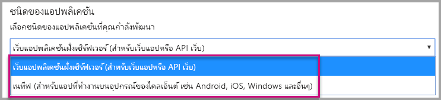
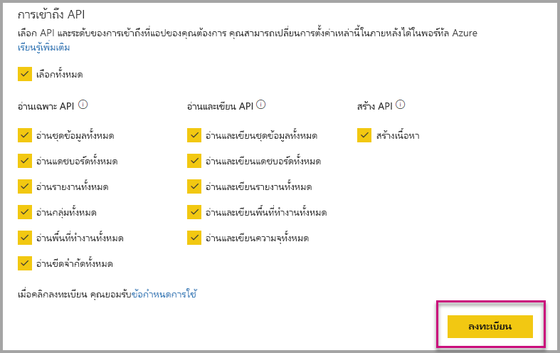
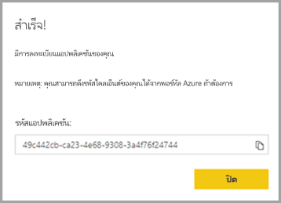
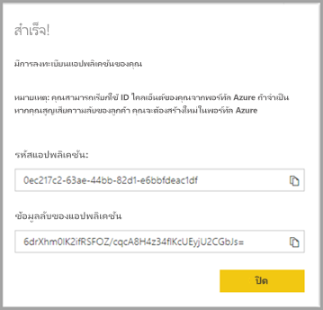
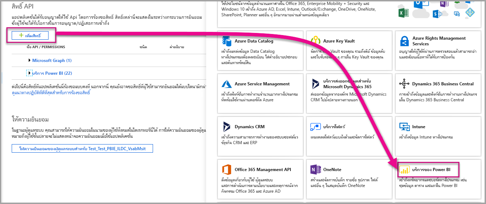

# <a name="register-an-azure-ad-application-to-use-with-power-bi"></a>ลงทะเบียนแอปพลิเคชัน Azure AD เพื่อใช้กับ Power BI

เรียนรู้วิธีการลงทะเบียนแอปพลิเคชันภายใน Azure Active Directory (Azure AD) สำหรับการใช้งานด้วยการฝังเนื้อหา Power BI

คุณลงทะเบียนแอปพลิเคชันของคุณด้วย Azure AD เพื่ออนุญาตให้แอปพลิเคชันของคุณเข้าถึง [Power BI REST API](https://docs.microsoft.com/rest/api/power-bi/) เมื่อคุณลงทะเบียนแอปพลิเคชันจะทำให้คุณสร้างอัตลักษณ์แอปพลิเคชันของคุณและระบุสิทธิ์ไปยังทรัพยากร Power BI REST

> [!IMPORTANT]
> ก่อนที่คุณลงทะเบียนแอป Power BI คุณต้องการ[ผู้เช่า Azure Active Directory และผู้ใช้ขององค์กร](create-an-azure-active-directory-tenant.md) ถ้าคุณยังไม่ได้ลงทะเบียนสำหรับ Power BI ด้วยผู้ใช้ในผู้เช่าของคุณ การลงทะเบียนแอปจะไม่สามารถเสร็จสมบูรณ์ได้

มีสองวิธีในการลงทะเบียนแอปพลิเคชันของคุณ วิธีแรกคือด้วย [Power BI App Registration Tool](https://dev.powerbi.com/apps/) หรือคุณสามารถทำได้โดยตรงภายในพอร์ทัล Azure เครื่องมือการลงทะเบียนแอป Power BI เป็นตัวเลือกที่สะดวกมากขึ้นเนื่องจากมีเขตข้อมูลเพื่อที่ต้องกรอกน้อย ใช้พอร์ทัล Azure ถ้าคุณต้องการทำการเปลี่ยนแปลงไปยังแอปของคุณ

## <a name="register-with-the-power-bi-application-registration-tool"></a>ลงทะเบียนด้วยเครื่องมือการลงทะเบียนแอป Power BI

ลงทะเบียนแอปพลิเคชันของคุณใน **Azure Active Directory** เพื่อสร้างข้อมูลประจำตัวสำหรับแอปพลิเคชันของคุณ และระบุสิทธิ์ไปยังแหล่งข้อมูล Power BI REST เมื่อคุณลงทะเบียนแอปพลิเคชัน เช่น แอปคอนโซล หรือเว็บไซต์ คุณจะได้รับตัวระบุที่แอปพลิเคชันใช้เพื่อระบุตัวตนต่อผู้ใช้ว่าพวกเขาต้องการสิทธิ์

นี่คือวิธีการลงทะเบียนแอปพลิเคชันของคุณด้วย Power BI App Registration Tool:

1. ไปยัง [dev.powerbi.com/apps](https://dev.powerbi.com/apps)

2. เลือก**ลงชื่อเข้าใช้**ด้วยบัญชีที่มีอยู่ แล้วเลือก**ถัดไป**

3. ระบุ **ชื่อแอปพลิเคชัน**

4. ระบุ **ประเภทแอปพลิเคชัน**

    ต่อไปนี้คือความแตกต่างสำหรับเหตุผลที่คุณเลือก**แบบดั้งเดิม**เทียบกับ**แอปพลิเคชันเว็บฝั่งเซิร์ฟเวอร์**สำหรับชนิดของแอปพลิเคชัน

    ดั้งเดิม:
    * คุณวางแผนการสร้างแอปพลิเคชันที่[ออกแบบมาสำหรับลูกค้าของคุณ](embed-sample-for-customers.md)โดยใช้บัญชีผู้ใช้หลัก (ใบอนุญาต Power BI Pro ที่ใช้งานสำหรับลงชื่อเข้าใช้ Power BI) เพื่อรับรองความถูกต้อง

    แอปพลิเคชันเว็บฝั่งเซิร์ฟเวอร์:
    * คุณวางแผนการสร้างแอปพลิเคชัน[ที่ออกแบบมาสำหรับองค์กรของคุณ](embed-sample-for-your-organization.md)
    * คุณวางแผนการสร้างแอปพลิเคชัน[ที่ออกแบบมาสำหรับลูกค้าของคุณ](embed-sample-for-customers.md)โดยใช้บริการหลักเพื่อรับรองความถูกต้อง
    * คุณวางแผนการสร้างแอปเว็บ หรือ API ของเว็บ

    

5. ถ้าคุณเลือก**แอปพลิเคชันเว็บฝั่งเซิร์ฟเวอร์**สำหรับชนิดแอปพลิเคชัน จากนั้นดำเนินการต่อเนื่องโดยการใส่ค่าสำหรับ **URL โฮมเพจ** และ **URL เปลี่ยนเส้นทาง** **URL เปลี่ยนเส้นทาง**ทำงานร่วมกับ URL ที่ถูกต้อง และควรตรงกับแอปพลิเคชันที่คุณสร้างขึ้น ถ้าคุณเลือก**ดั้งเดิม**ดำเนินการต่อในขั้นตอนที่ 6

6. เลือก Power BI API ที่แอปพลิเคชันของคุณต้องการ สำหรับข้อมูลเพิ่มเติมเกี่ยวกับสิทธิ์การเข้าถึง Power BI ให้ดู [สิทธิ์และการยินยอมในจุดสิ้นสุดของแพลตฟอร์มข้อมูลประจำตัวของ Microsoft](https://docs.microsoft.com/azure/active-directory/develop/v2-permissions-and-consent) จากนั้นเลือก**ลงทะเบียน**

    

    > [!Important]
    > หากคุณเปิดใช้งานบริการหลักที่จะใช้กับ Power BI สิทธิ์ของ Azure Active Directory ไม่มีผลบังคับใช้อีกต่อไป มีจัดการสิทธิ์แล้วผ่านทางพอร์ทัลผู้ดูแลระบบ Power BI

7. ถ้าคุณเลือก**ดั้งเดิม**สำหรับชนิดของแอปพลิเคชัน แล้วคุณจะได้รับ **ID แอปพลิเคชัน** ถ้าคุณเลือก**แอปเว็บฝั่งเซิร์ฟเวอร์**สำหรับชนิดของแอปพลิเคชัน แล้วคุณได้รับ**ID แอปพลิเคชัน**และ**ข้อมูลลับของแอปพลิเคชัน**

    > [!Note]
    > **ID แอปพลิเคชัน**สามารถเรียกข้อมูลได้จากพอร์ทัล Azure ในภายหลังถ้าต้องการ ถ้าคุณทำ**ข้อมูลลับของแอปพลิเคชัน**หาย คุณจำเป็นต้องสร้างใหม่ภายในพอร์ทัล Azure

| ดั้งเดิม | แอปพลิเคชันเว็บฝั่งเซิร์ฟเวอร์ |
|--------|-----------------------------|
|  |  |

ตอนนี้คุณสามารถใช้แอปพลิเคชันที่ลงทะเบียนไว้เป็นส่วนหนึ่งของแอปพลิเคชันแบบกำหนดเองของคุณเพื่อโต้ตอบกับบริการ Power BI และแอปพลิเคชัน Power BI Embedded

## <a name="register-with-the-azure-portal"></a>ลงทะเบียนกับพอร์ทัล Azure

ตัวเลือกอื่นของคุณสำหรับการลงทะเบียนแอปพลิเคชันของคุณจะทำได้โดยตรงในพอร์ทัล Azure เมื่อต้องการลงทะเบียนแอปพลิเคชันของคุณ ทำตามขั้นตอนเหล่านี้

1. ยอมรับ[เงื่อนไขของ Microsoft Power BI API](https://powerbi.microsoft.com/api-terms)

2. ลงชื่อเข้าใช้[พอร์ทัล Azure](https://portal.azure.com)

3. เลือกผู้เช่า Azure AD ของคุณ โดยการเลือกบัญชีของคุณในมุมบนขวาของหน้า

4. ในบานหน้าต่างนำทางด้านซ้ายมือ ไปยัง**บริการทั้งหมด** จากนั้นเลือก**การลงทะเบียนแอป** แล้วเลือก **ลงทะเบียนใหม่**

5. ทำตามพร้อมท์และสร้างแอปพลิเคชัน์ใหม่

   สำหรับข้อมูลเพิ่มเติมเกี่ยวกับวิธีการลงทะเบียนแอปพลิเคชันใน Azure Active Directory ดู[กาลงทะเบียนใช้แอปพลิเคชันด้วย Azure Active Directory](https://docs.microsoft.com/azure/active-directory/develop/quickstart-v2-register-an-app)

## <a name="how-to-get-the-application-id"></a>วิธีการขอรับ ID แอปพลิเคชัน

เมื่อคุณลงทะเบียนแอปพลิเคชัน คุณจะได้รับ [ID แอปพลิเคชัน](embed-sample-for-customers.md#application-id)  **ID แอปพลิเคชัน** ใช้ระบุตัวตนของแอปพลิเคชัน เมื่อร้องขอสิทธิ์สำหรับผู้ใช้

## <a name="how-to-get-the-service-principal-object-id"></a>วิธีการขอรับ ID ออบเจ็กต์ของบริการหลัก

เมื่อใช้ [Power BI API](https://docs.microsoft.com/rest/api/power-bi/) ต้องให้แน่ใจว่าได้กำหนดการดำเนินการ โดยใช้[ID ออบเจ็กต์ของบริการหลัก](embed-service-principal.md)เพื่ออ้างอิงบริการหลัก - ตัวอย่าง การใช้บริการหลักเป็นผู้ดูแลระบบในพื้นที่ทำงาน

## <a name="apply-permissions-to-your-application-within-azure-ad"></a>นำสิทธิ์ไปใช้กับแอปพลิเคชันของคุณภายใน Azure AD

เปิดใช้งานสิทธิ์เพิ่มเติมให้กับแอปพลิเคชันของคุณ นอกเหนือจากสิทธิ์ที่มีในหน้าลงทะเบียนแอปพลิเคชัน คุณสามารถทำงานนี้ได้ผ่านพอร์ทัล Azure AD หรือผ่านทางการเขียนโปรแกรม

คุณจะต้องเข้าสู่ระบบ ด้วยบัญชี*หลัก*ที่ใช้สำหรับฝังตัว หรือบัญชีผู้ดูแลระบบส่วนกลาง

### <a name="using-the-azure-ad-portal"></a>ใช้พอร์ทัล Azure AD

1. เรียกดู [การลงทะเบียนแอป](https://portal.azure.com/#blade/Microsoft_AAD_RegisteredApps/ApplicationsListBlade/quickStartType//sourceType/) ภายในพอร์ทัล Azure และเลือกแอปที่คุณกำลังใช้เพื่อการฝังตัว

2. เลือก**สิทธิ์ API** ภายใต้หัวข้อ **จัดการ**

3. ภายใน **สิทธิ์ API** เลือก **เพิ่มสิทธิ์**  จากนั้นเลือก **Power BI Service**

    

4. เลือกสิทธิ์เฉพาะที่คุณต้องการภายใต้ **การอนุญาตที่ได้รับสิทธิ์** เลือกทีละตัวเลือกเพื่อบันทึกการเลือก เลือก**บันทึก**เมื่อทำเสร็จแล้ว

5. เลือก **ให้ความยินยอม**

    การดำเนินการ**ให้ความยินยอม** จำเป็นต้องมี*บัญชีหลัก*เพื่อหลีกเลี่ยงการถามความยินยอมโดย Azure AD ถ้าบัญชีที่ดำเนินการนี้เป็นผู้ดูแลระบบส่วนกลาง คุณมอบสิทธิ์ให้แก่ผู้ใช้ทั้งหมดภายในองค์กรของคุณสำหรับแอปพลิเคชันนี้ ถ้าบัญชีที่ดำเนินการนี้เป็น*บัญชีผู้ใช้หลัก* และไม่ใช่ผู้ดูแลระบบส่วนกลาง คุณจะให้สิทธิ์*บัญชีหลัก*สำหรับแอปพลิเคชันนี้เท่านั้น

### <a name="applying-permissions-programmatically"></a>กำลังใช้สิทธิ์ผ่านทางการเขียนโปรแกรม

1. คุณจำเป็นต้องรับบริการหลัก (service principal) ที่มีอยู่แล้วภายในผู้เช่าของคุณ สำหรับข้อมูลเกี่ยวกับวิธีการดังกล่าว ดู[servicePrincipal](https://docs.microsoft.com/graph/api/resources/serviceprincipal?view=graph-rest-beta)

    คุณสามารถเรียกใช้ API *รับ servicePrincipal* โดยไม่มี {ID} และจะช่วยให้คุณได้รับบริการหลักทั้งหมดภายในผู้เช่า

2. ตรวจสอบบริการหลักด้วย ID แอปของคุณที่เป็นคุณสมบัติ **appId**

3. สร้างแผนการบริการใหม่ ถ้ายังไม่มีในแอปของคุณ

    ```json
    Post https://graph.microsoft.com/beta/servicePrincipals
    Authorization: Bearer ey..qw
    Content-Type: application/json
    {
    "accountEnabled" : true,
    "appId" : "{App_Client_ID}",
    "displayName" : "{App_DisplayName}"
    }
    ```

4. ให้สิทธิ์แอปไปยัง Power BI API

   ถ้าคุณกำลังใช้ผู้เช่าที่มีอยู่และไม่สนใจมอบสิทธิ์ในนามของผู้ใช้ที่เป็นผู้เช่าทั้งหมด คุณสามารถให้สิทธิ์กับผู้ใช้ที่ระบุโดยการแทนที่ค่าของ **contentType** ให้เป็น**หลัก**

   ค่าสำหรับ **consentType** สามารถใส่ **AllPrincipals** หรือ **Principal** อย่างใดอย่างหนึ่ง

   * **AllPrincipals** สามารถใช้ได้โดยผู้ดูแลผู้เช่าเท่านั้น เพื่อให้สิทธิ์ในนามของผู้ใช้ทั้งหมดในผู้เช่าได้
   * **Principal** จะใช้เพื่อให้สิทธิ์ในนามของผู้ใช้ที่ระบุ ในกรณีนี้ ควรเพิ่มอีกคุณสมบัติหนึ่งลงในเนื้อความของการร้องขอ - *principalId={User_ObjectId}*

     *การให้สิทธิ์*จำเป็นสำหรับบัญชีหลัก เพื่อหลีกเลี่ยงการพร้อมท์ถามความยินยอมโดย Azure AD ซึ่งไม่สามารถทำได้ เมื่อลงชื่อเข้าใช้แบบไม่โต้ตอบ

     ```json
     Post https://graph.microsoft.com/beta/OAuth2PermissionGrants
     Authorization: Bearer ey..qw
     Content-Type: application/json
     {
     "clientId":"{Service_Plan_ID}",
     "consentType":"AllPrincipals",
     "resourceId":"c78a3685-1ce7-52cd-95f7-dc5aea8ec98e",
     "scope":"Dataset.ReadWrite.All Dashboard.Read.All Report.Read.All Group.Read Group.Read.All Content.Create Metadata.View_Any Dataset.Read.All Data.Alter_Any",
     "expiryTime":"2018-03-29T14:35:32.4943409+03:00",
     "startTime":"2017-03-29T14:35:32.4933413+03:00"
     }
     ```

    **resourceId** *c78a3685-1ce7-52cd-95f7-dc5aea8ec98e* ไม่ใช่สากล แต่จะขึ้นอยู่กับผู้เช่า ค่านี้คือ objectId ของแอปพลิเคชัน "บริการ Power BI" ในผู้เช่า Azure Active Directory (AAD)

    ผู้ใช้สามารถได้รับค่านี้ได้อย่างรวดเร็วในพอร์ทัล Azure:
    1. https://portal.azure.com/#blade/Microsoft_AAD_IAM/StartboardApplicationsMenuBlade/AllApps

    2. ค้นหา "บริการ Power BI" ใน SearchBox

5. ให้สิทธิ์แอปกับ Azure Active Directory (AAD)

   ค่าสำหรับ **consentType** สามารถใส่ **AllPrincipals** หรือ **Principal** อย่างใดอย่างหนึ่ง

   * **AllPrincipals** สามารถใช้ได้โดยผู้ดูแลผู้เช่าเท่านั้น เพื่อให้สิทธิ์สำหรับผู้ใช้ทั้งหมดในผู้เช่าได้
   * **หลัก**ใช้เพื่อให้สิทธิ์สำหรับผู้ใช้ที่ระบุ ในกรณีนี้ ควรเพิ่มอีกคุณสมบัติหนึ่งลงในเนื้อความของการร้องขอ - *principalId={User_ObjectId}*

   *การให้สิทธิ์*จำเป็นสำหรับบัญชีหลัก เพื่อหลีกเลี่ยงการพร้อมท์ถามความยินยอมโดย Azure AD ซึ่งไม่สามารถทำได้ เมื่อลงชื่อเข้าใช้แบบไม่โต้ตอบ

   ```json
   Post https://graph.microsoft.com/beta/OAuth2PermissionGrants
   Authorization: Bearer ey..qw
   Content-Type: application/json
   { 
   "clientId":"{Service_Plan_ID}",
   "consentType":"AllPrincipals",
   "resourceId":"61e57743-d5cf-41ba-bd1a-2b381390a3f1",
   "scope":"User.Read Directory.AccessAsUser.All",
   "expiryTime":"2018-03-29T14:35:32.4943409+03:00",
   "startTime":"2017-03-29T14:35:32.4933413+03:00"
   }
   ```

## <a name="next-steps"></a>ขั้นตอนถัดไป

หลังจากที่คุณลงทะเบียนแอปพลิเคชันของคุณภายใน Azure AD แล้ว คุณต้องรับรองความถูกต้องของผู้ใช้ภายในแอปพลิเคชันของคุณ ดูที่[รับรองความถูกต้องผู้ใช้ และรับโทเค็นการเข้าถึง Azure AD สำหรับแอป Power BI ของคุณ](get-azuread-access-token.md)เมื่อต้องการเรียนรู้เพิ่มเติม

มีคำถามเพิ่มเติมหรือไม่ [ลองถามชุมชน Power BI](https://community.powerbi.com/)