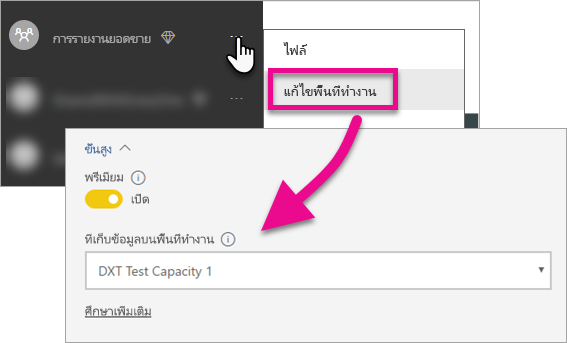

# ฝังตัวแดชบอร์ด รายงานและไทล์ Power BI ของคุณ

เรียนรู้เกี่ยวกับขั้นตอนที่คุณจำเป็นต้องดำเนินการเพื่อฝังเนื้อหา Power BI ภายในแอปพลิเคชันของคุณ

Microsoft [ประกาศเปิดตัว Power BI Premium](https://powerbi.microsoft.com/blog/microsoft-accelerates-modern-bi-adoption-with-power-bi-premium/) ซึ่งเป็นแบบจำลองการให้สิทธิ์การใช้งานตามความจุใหม่ที่เพิ่มความยืดหยุ่นสำหรับวิธีที่ผู้ใช้เข้าถึง แชร์และแจกจ่ายเนื้อหา ข้อเสนอนี้ยังทำให้บริการ Power BI มีความสามารถปรับขนาดและประสิทธิภาพการทำงานเพิ่มเติมอีกด้วย ยังประกาศอีกด้วยว่า Power BI Embedded ได้รับอนุญาตให้สร้างความจุภายใน Microsoft Azure Power BI Embedded มุ่งเน้นไปที่แอปพลิเคชันและลูกค้าของคุณ 

บทความนี้จะกล่าวถึงการฝังเนื้อหา Power BI ของคุณสำหรับทั้งองค์กรและลูกค้าของคุณ ขั้นตอนเหล่านี้จะคล้ายคลึงกันในสองสถานการณ์สมมติ จะมีการบรรยายภาพเมื่อเป็นขั้นตอนเฉพาะ สำหรับการฝังสำหรับลูกค้าคุณ

มีไม่กี่ขั้นตอนที่คุณต้องดำเนินการกับแอปพลิเคชันของคุณเพื่อทำให้สิ่งนี้เป็นไปได้ เราจะไปตามขั้นตอนต่าง ๆ ที่จำเป็นเพื่อให้คุณสามารถสร้างและใช้เนื้อหาแบบฝังตัวภายในแอปพลิเคชันของคุณ

> [!NOTE]
> Power BI API ยังคงอ้างอิงถึงพื้นที่ทำงานของแอปเป็นกลุ่ม การอ้างอิงใดๆ ถึงกลุ่มจะหมายความว่า คุณกำลังทำงานอยู่กับพื้นที่ทำงานของแอป

## ขั้นตอนที่ 1: ตั้งค่าสภาพแวดล้อมการพัฒนาการวิเคราะห์แบบฝังของคุณ

ก่อนที่จะเริ่มฝังแดชบอร์ดและรายงานลงในแอปพลิเคชันของคุณ คุณต้องตรวจสอบให้แน่ใจว่า สภาพแวดล้อมของคุณถูกตั้งค่าเพื่ออนุญาตให้ทำการฝัง โดยถือเป็นส่วนหนึ่งของการตั้งค่า คุณจะต้องทำสิ่งต่อไปนี้

* [ตรวจสอบให้แน่ใจว่า คุณมีผู้เช่า Azure Active Directory](embedding-content.md#azureadtenant)
* [สร้างบัญชีผู้ใช้ Power BI Pro](embedding-content.md#proaccount)
* [การลงทะเบียนแอปและสิทธิ์ใช้งาน](embedding-content.md#appreg)
* [สร้างพื้นที่ทำงานของแอป](embedding-content.md#appws)
* [สร้างและอัปโหลดรายงานของคุณ](embedding-content.md#createreports)

คุณสามารถเข้าถึง[เครื่องมือประสบการณ์การเตรียมความพร้อม](https://aka.ms/embedsetup) เพื่อเริ่มต้นใช้งานได้อย่างรวดเร็ว และดาวน์โหลดแอปพลิเคชันตัวอย่างได้

เลือกโซลูชันที่เหมาะกับคุณ:
* [การฝังตัวสำหรับลูกค้าของคุณ](embedding.md#embedding-for-your-customers) จะมอบความสามารถในการฝังแดชบอร์ดและรายงานสำหรับผู้ใช้ที่ไม่มีบัญชี Power BI เรียกใช้โซลูชัน[การฝังตัวสำหรับลูกค้าของคุณ](https://aka.ms/embedsetup/AppOwnsData)
* [การฝังตัวสำหรับองค์กรของคุณ](embedding.md#embedding-for-your-organization) ให้คุณสามารถขยายบริการของ Power BI เรียกใช้โซลูชัน[การฝังตัวสำหรับองค์กรของคุณ](https://aka.ms/embedsetup/UserOwnsData)

แต่ถ้าคุณเลือกที่จะตั้งค่าสภาพแวดล้อมด้วยตนเอง คุณสามารถดำเนินต่อตามด้านล่าง 

> [!NOTE]
> ความจุเฉพาะ ไม่จำเป็นสำหรับการพัฒนาแอปพลิเคชันของคุณ นักพัฒนาของแอปพลิเคชันจำเป็นต้องมีสิทธิ์การใช้งาน Power BI Pro

### ผู้เช่า Azure Active Directory

คุณจะต้องมีผู้เช่า Azure Active Directory (Azure AD) เพื่อฝังรายการจาก Power BI ผู้เช่านี้ต้องมีผู้ใช้ Power BI Pro อย่างน้อยหนึ่งราย คุณยังจำเป็นต้องกำหนดแอป Azure AD ภายในผู้เช่า คุณสามารถใช้ผู้เช่า Azure AD ที่มีอยู่แล้วหรือสร้างขึ้นมาใหม่เพื่อวัตถุประสงค์ในการฝังโดยเฉพาะ

คุณจำเป็นต้องตรวจสอบว่าการตั้งค่าผู้เช่าเป็นอะไร ถ้าคุณกำลังฝังตัวสำหรับลูกค้าของคุณ

* ใช้ผู้เช่า Power BI ขององค์กรที่มีอยู่แล้ว?
* ใช้ผู้เช่าที่แยกต่างหากสำหรับแอปพลิเคชันของคุณ?
* ใช้ผู้เช่าที่แยกต่างหากสำหรับลูกค้าแต่ละราย?

ถ้าไม่ต้องการใช้ผู้เช่าที่มีอยู่แล้ว คุณก็สามารถสร้างผู้เช่าใหม่สำหรับแอปพลิเคชันของคุณหรือสำหรับลูกค้าแต่ละรายได้ ดู [สร้างผู้เช่า Azure Active Directory](create-an-azure-active-directory-tenant.md) หรือ [วิธีการได้รับผู้เช่า Azure Active Directory](https://docs.microsoft.com/azure/active-directory/develop/active-directory-howto-tenant)

### สร้างบัญชีผู้ใช้ Power BI Pro

คุณจำเป็นต้องใช้เพียงบัญชี Power BI Pro บัญชีเดียวเพื่อฝังเนื้อหา อย่างไรก็ตาม คุณอาจต้องการมีผู้ใช้รายอื่นบางรายที่มีสิทธิ์เฉพาะในการเข้าถึงรายการ ต่อไปนี้จะกล่าวถึงผู้ใช้ที่เป็นไปได้สำหรับพิจารณาภายในผู้เช่าของคุณ

บัญชีผู้ใช้ต่อไปนี้จะต้องมีอยู่แล้วภายในผู้เช่าของคุณ และต้องมีการกำหนดสิทธิ์การใช้งาน Power BI Pro ให้กับบัญชีเหล่านี้ จำเป็นต้องมีสิทธิ์การใช้งาน Power BI Pro เพื่อทำงานกับพื้นที่ทำงานของแอปภายใน Power BI

#### ผู้ใช้ที่เป็นผู้ดูแลระบบองค์กร/ผู้เช่า

ขอแนะนำว่า ผู้ใช้ที่เป็นผู้ดูแลระบบส่วนกลางขององค์กร/ผู้เช่าของคุณไม่ควรใช้เป็นบัญชีที่แอปพลิเคชันของคุณใช้อยู่ถ้าการฝังสำหรับลูกค้าของคุณ นี่คือการลดการเข้าถึงโดยบัญชีผู้ใช้แอปพลิเคชันภายในผู้เช่าของคุณให้เหลือน้อยที่สุด ผู้ใช้ที่เป็นผู้ดูแลระบบต้องเป็นผู้ดูแลระบบพื้นที่ทำงานทั้งหมดของแอปที่สร้างขึ้นเพื่อการฝัง

#### บัญชีสำหรับนักวิเคราะห์ที่จะสร้างเนื้อหา

คุณอาจมีผู้ใช้หลายรายที่สร้างเนื้อหาสำหรับ Power BI คุณต้องมีบัญชี Power BI Pro สำหรับนักวิเคราะห์แต่ละราย ที่จะสร้างและปรับใช้เนื้อหาไปยัง Power BI

#### แอปพลิเคชันบัญชีผู้ใช้*หลัก*ในการฝังสำหรับลูกค้าของคุณ

บัญชีผู้ใช้หลักคือ บัญชีที่แอปพลิเคชันของคุณใช้ เมื่อมีการฝังเนื้อหาสำหรับลูกค้าของคุณ โดยทั่วไปแล้ว สถานการณ์สมมติดังกล่วมีไว้สำหรับแอปพลิเคชัน ISV บัญชีผู้ใช้หลักเป็นบัญชีเดียวที่คุณจำเป็นต้องมีภายในองค์กรของคุณ ซึ่งยังสามารถใช้เป็นบัญชีผู้ดูแลระบบและนักวิเคราะห์ได้ แต่ไม่แนะนำ Backend ของแอปพลิเคชันคุณจัดเก็บข้อมูลประจำตัวสำหรับบัญชีนี้ และใช้ในการขอรับโทเค็นการรับรองความถูกต้องของ Azure AD สำหรับใช้กับ Power BI API บัญชีนี้สร้างโทเค็นฝังตัวสำหรับให้แอปพลิเคชันใช้กับลูกค้าของคุณ

บัญชีผู้ใช้หลักเป็นเพียงผู้ใช้ทั่วไปที่มีสิทธิ์การใช้งาน Power BI Pro ที่ใช้กับแอปพลิเคชันของคุณ บัญชีนี้ต้องเป็นผู้ดูแลระบบพื้นที่ทำงานของแอปที่ใช้สำหรับฝัง

###  การลงทะเบียนแอปและสิทธิ์

คุณจำเป็นต้องลงทะเบียนแอปพลิเคชันของคุณกับ Azure AD เพื่อเรียกใช้ REST API สำหรับข้อมูลเพิ่มเติม ดู[ลงทะเบียนแอป Azure AD เพื่อฝังเนื้อหา Power BI](register-app.md)

### สร้างพื้นที่ทำงานของแอป

ถ้าคุณกำลังฝังแดชบอร์ดและรายงานสำหรับลูกค้าของคุณ แดชบอร์ดและรายงานเหล่านั้นต้องวางไว้ภายในพื้นที่ทำงานของแอป บัญชี*หลัก*ที่กล่าวถึงข้างต้น ต้องเป็นผู้ดูแลระบบของพื้นที่ทำงานแอป

[!INCLUDE [powerbi-service-create-app-workspace](../includes/powerbi-service-create-app-workspace.md)]

> [!NOTE]
> ผู้ใช้ที่ไม่ใช่ผู้ดูแลระบบสามารถสร้างพื้นที่ทำงานของแอปได้สูงสุด 250 จุดเท่านั้น เมื่อต้องสร้างพื้นที่ทำงานของแอปเพิ่มเติม คุณจำเป็นต้องใช้บัญชีผู้ดูแลระบบผู้เช่า
>

### สร้างและอัปโหลดรายงานของคุณ

คุณสามารถสร้างรายงานและชุดข้อมูลของคุณโดยใช้ Power BI Desktop แล้วจึงเผยแพร่รายงานเหล่านั้นไปยังพื้นที่ทำงานของแอป ผู้ใช้ปลายทางที่เผยแพร่รายงาน จำเป็นต้องมีสิทธิ์การใช้งาน Power BI Pro เพื่อเผยแพร่ไปยังพื้นที่ทำงานของแอป

## ขั้นตอนที่ 2: ฝังเนื้อหาของคุณ

ภายในแอปพลิเคชันของคุณ คุณจำเป็นต้องรับรองความถูกต้องกับ Power BI ถ้าคุณกำลังฝังเนื้อหาสำหรับลูกค้าของคุณ คุณจะจัดเก็บข้อมูลประจำตัวสำหรับบัญชี*หลัก*ภายในแอปพลิเคชันของคุณ

> [!NOTE]
> สำหรับข้อมูลเพิ่มเติมเกี่ยวกับการรับรองความถูกต้องของผู้ใช้ในขณะที่ทำการฝังตัวเพื่อลูกค้าของคุณ ดู[รับรองความถูกต้องผู้ใช้และรับโทเค็นการเข้าถึง Azure AD สำหรับแอป Power BI ของคุณ](get-azuread-access-token.md)
>

ภายในแอปพลิเคชันของคุณ หลังจากที่รับรองความถูกต้องแล้ว ใช้ Power BI REST API และ JavaScript API เพื่อฝังแดชบอร์ดและรายงานลงในแอปพลิเคชันของคุณ 

สำหรับ**การฝังสำหรับองค์กรของคุณ** ให้ดูขั้นตอนด้านล่าง:

* [รวมรายงานลงในแอป](embed-sample-for-your-organization.md)

สำหรับ**การฝังตัวสำหรับลูกค้าของคุณ** ซึ่งเป็นกรณีปกติสำหรับ ISV โปรดดูต่อไปนี้:

* [รวมรายงานลงในแอปพลิเคชันของคุณ](embed-sample-for-customers.md)

เมื่อมีการฝังสำหรับลูกค้าของคุณ ก็จำเป็นต้องใช้โทเค็นแบบฝัง เพื่อเรียนรู้เพิ่มเติม ดูที่[โทเค็นการฝัง](https://docs.microsoft.com/rest/api/power-bi/embedtoken)

## ขั้นตอนที่ 3: เลื่อนระดับโซลูชันของคุณสู่การผลิต

การเคลื่อนไปสู่การผลิตจำเป็นต้องมีบางขั้นตอนเพิ่มเติม

### การฝังสำหรับองค์กรของคุณ

ถ้าคุณทำการฝังสำหรับองค์กรของคุณ คุณเพียงแค่ต้องให้ผู้อื่นทราบวิธีการเข้าถึงแอปพลิเคชันของคุณ 

ผู้ใช้ทั้งหมดไม่ว่ามีสิทธิ์เข้าใช้ใด สามารถใช้เนื้อหาที่ฝังจากพื้นที่ทำงานของแอป (กลุ่ม) ถ้าความจุเฉพาะรองรับพื้นที่ทำงานนั้น กล่าวคือ คุณต้องเพิ่มผู้ใช้ใดๆที่ไม่มีสิทธิ์การใช้งาน Power BI Pro ในพื้นที่ทำงานของแอป มิฉะนั้น คุณจะได้รับข้อความผิดพลาด 401 ที่แสดงว่าไม่ได้รับอนุญาต ตารางต่อไปนี้แสดงรายการ Power BI Premium SKU แบบพร้อมใช้งานซึ่งพร้อมใช้งานภายใน Office 365

| โหนดของความจุ | แกนทั้งหมด *(Backend + frontend)* | Backend Cores | Frontend Cores | การจำกัดการเชื่อมต่อ DirectQuery/live | หน้าสูงสุดที่แสดงในชั่วโมงที่เรียกใช้มากที่สุด |
| --- | --- | --- | --- | --- | --- |
| EM3 |4 v-cores |2 cores, 10GB RAM |2 cores | |601-1,200 |
| P1 |8 v-cores |4 cores, 25GB RAM |4 cores |30 ต่อวินาที |1,201-2,400 |
| P2 |16 v-cores |8 cores, 50GB RAM |8 cores |60 ต่อวินาที |2,401-4,800 |
| P3 |32 v-cores |16 cores, 100GB RAM |16 cores |120 ต่อวินาที |4,801-9600 |

> [!NOTE]
> คุณต้องเป็นผู้ดูแลระบบส่วนกลางหรือผู้ดูแลการเรียกเก็บเงิน ภายในผู้เช่าของคุณ เพื่อซื้อ Power BI Premium สำหรับข้อมูลเกี่ยวกับวิธีการซื้อ Power BI Premium ดู[วิธีการซื้อ Power BI Premium](../service-admin-premium-purchase.md)

>[!Note]
>[ตั้งค่าสภาพแวดล้อมการวิเคราะห์แบบฝังตัวสำหรับองค์กรของคุณ](#step-1-setup-your-embedded-analytics-development-environment)
>

### การฝังสำหรับลูกค้าของคุณ

ถ้าคุณทำการฝังสำหรับลูกค้าของคุณ ให้ทำต่อไปนี้

* ถ้าคุณใช้ผู้เช่าแบบแยกต่างหากเพื่อการพัฒนา คุณก็ต้องตรวจสอบให้แน่ใจว่าพื้นที่ทำงานของแอปร่วมกับแดชบอร์ดและรายงานของคุณพร้อมใช้งานในสภาพแวดล้อมการผลิตของคุณ ต้องตรวจสอบให้แน่ใจว่า คุณได้สร้างแอปพลิเคชันใน Azure AD สำหรับผู้เช่าการผลิตของคุณและกำหนดสิทธิ์แอปที่เหมาะสมตามที่ระบุในขั้นตอนที่ 1
* ซื้อความจุที่เหมาะกับความต้องการของคุณ คุณสามารถใช้ตารางด้านล่างเพื่อทำความเข้าใจเกี่ยวกับ SKU ความจุ Power BI Embedded ที่คุณอาจต้องการ สำหรับรายละเอียดเพิ่มเติม [เอกสารทางเทคนิคเรื่องการวางแผนความจุวิเคราะห์แบบฝัง](https://aka.ms/pbiewhitepaper) เมื่อพร้อมที่จะซื้อแล้ว คุณก็สามารถทำเช่นนั้นได้ภายใน [พอร์ทัล Microsoft Azure](https://portal.azure.com) สำหรับรายละเอียดเกี่ยวกับวิธีการสร้างความจุ Power BI Embedded ดู[สร้างความจุ Power BI Embedded ในพอร์ทัล Azure](https://docs.microsoft.com/azure/power-bi-embedded/create-capacity)

> [!IMPORTANT]
> เนื่องจากโทเค็นแบบฝังตัวมีไว้สำหรับการทดสอบของนักพัฒนาเท่านั้น จำนวนโทเค็นแบบฝังตัวที่บัญชีหลักของ Power BI สร้างได้ มีได้จำกัด [ต้องซื้อความจุ](https://docs.microsoft.com/power-bi/developer/embedded-faq#technical) สำหรับสถานการณ์ที่มีการฝังในโปรดักชั่น ไม่มีข้อจำกัดการสร้างโทเค็นฝังตัว เมื่อซื้อความจุเฉพาะแล้ว ไปยัง[คุณลักษณะที่พร้อมใช้งาน](https://docs.microsoft.com/rest/api/power-bi/availablefeatures) เพื่อตรวจสอบจำนวนโทเค็นการฝังที่เหลืออยู่

| โหนดของความจุ | แกนทั้งหมด *(Backend + frontend)* | Backend Cores | Frontend Cores | การจำกัดการเชื่อมต่อ DirectQuery/live | หน้าสูงสุดที่แสดงในชั่วโมงที่เรียกใช้มากที่สุด |
| --- | --- | --- | --- | --- | --- |
| A1 |1 v-cores |.5 cores, 3GB RAM |.5 cores | 5 ต่อวินาที |1-300 |
| A2 |2 v-cores |1 core, 5GB RAM |1 core | 10 ต่อวินาที |301-600 |
| A3 |4 v-cores |2 cores, 10GB RAM |2 cores | 15 ต่อวินาที |601-1,200 |
| A4 |8 v-cores |4 cores, 25GB RAM |4 cores |30 ต่อวินาที |1,201-2,400 |
| A5 |16 v-cores |8 cores, 50GB RAM |8 cores |60 ต่อวินาที |2,401-4,800 |
| A6 |32 v-cores |16 cores, 100GB RAM |16 cores |120 ต่อวินาที |4,801-9600 |

* แก้ไขพื้นที่ทำงานแอป และกำหนดความจุเฉพาะให้ ภายใต้ ขั้นสูง

    

* ปรับใช้แอปพลิเคชันที่อัปเดตแล้วของคุณกับการผลิต และเริ่มฝังแดชบอร์ดและรายงานจาก Power BI

>[!Note]
>[ตั้งค่าสภาพแวดล้อมการวิเคราะห์แบบฝังตัวสำหรับลูกค้าของคุณ](#step-1-setup-your-embedded-analytics-development-environment) 
>

## การตั้งค่าผู้ดูแลระบบ

ผู้ดูแลระบบส่วนกลางหรือผู้ดูแลระบบบริการ Power BI สามารถเปิดใช้งานความสามารถในการใช้ REST API โดยเปืดหรือปิดสำหรับผู้เช่า ผู้ดูแลระบบ Power BI สามารถตั้งการตั้งค่านี้สำหรับทั้งองค์กรหรือกลุ่มความปลอดภัยแต่ละกลุ่มก็ได้ มีการเปิดใช้งานสำหรับทั้งองค์กรตามค่าเริ่มต้น ทำสิ่งนี้ได้ผ่าน [พอร์ทัลผู้ดูแลระบบ Power BI](../service-admin-portal.md)

## ขั้นตอนถัดไป

[การฝังด้วย Power BI](embedding.md)  
[วิธีการย้ายเนื้อหาคอลเลกชันพื้นที่ทำงานแบบฝัง Power BI ไปยัง Power BI](migrate-from-powerbi-embedded.md)  
[Power BI Premium คืออะไร](../service-premium.md)  
[วิธีการซื้อ Power BI Premium](../service-admin-premium-purchase.md)  
[JavaScript API Git repo](https://github.com/Microsoft/PowerBI-JavaScript)  
[Power BI C# Git repo](https://github.com/Microsoft/PowerBI-CSharp)  
[ตัวอย่างการฝัง JavaScript](https://microsoft.github.io/PowerBI-JavaScript/demo/)  
[เอกสารทางเทคนิคเรื่องการวางแผนความจุวิเคราะห์แบบฝัง](https://aka.ms/pbiewhitepaper)  
[เอกสารทางเทคนิคเรื่อง Power BI Premium](https://aka.ms/pbipremiumwhitepaper)  

มีคำถามเพิ่มเติมหรือไม่ [ลองถามชุมชน Power BI](http://community.powerbi.com/)