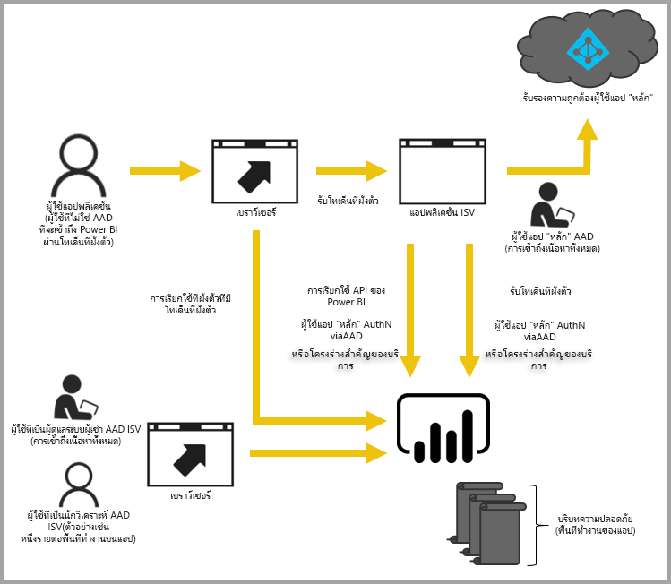

# การฝังด้วย Power BI
Power BI มี API สำหรับฝังแดชบอร์ดและรายงานของคุณลงในแอปพลิเคชัน Power BI API มีชุดความสามารถที่สอดคล้องกันและสิทธิ์เข้าถึงฟีเจอร์ล่าสุดของ Power BI เช่น แดชบอร์ด เกตเวย์ และพื้นที่ทำงานแอปขณะฝังเนื้อหาของคุณ

## API เดียว
มีสองสถานการณ์หลักเมื่อมีการฝังเนื้อหา Power BI  การฝังสำหรับผู้ใช้ในองค์กรของคุณ (ที่มีใบอนุญาต Power BI) และการฝังสำหรับผู้ใช้และลูกค้าของคุณโดยที่พวกเขาไม่จำเป็นต้องมีใบอนุญาต Power BI Power BI REST API ใช้ได้สำหรับทั้งสองสถานการณ์ 

สำหรับลูกค้าและผู้ใช้ที่มีใบอนุญาต Power BI คุณสามารถฝังแดชบอร์ดและรายงานลงในแอปพลิเคชันแบบกำหนดเองโดยใช้ API เดียวกันเพื่อให้บริการแก่องค์กรหรือลูกค้าของคุณ ลูกค้าของคุณจะเห็นข้อมูลที่จัดการโดยแอปพลิเคชัน และสำหรับผู้ใช้ Power BI ในองค์กรของคุณ พวกเขาจะมีตัวเลือกเพิ่มเติมเพื่อดู*ข้อมูลของพวกเขาเอง*โดยตรง ใน Power BI หรือในบริบทของแอปพลิเคชันแบบฝังตัว คุณสามารถใช้ประโยชน์สูงสุดจาก JavaScript และ REST API สำหรับความต้องการในการฝังของคุณ

เมื่อต้องการดูตัวอย่างของวิธีการทำงานของการฝัง โปรดดู[ตัวอย่างการฝัง JavaScript](https://microsoft.github.io/PowerBI-JavaScript/demo/)

## สำหรับองค์กรของคุณ
การฝังสำหรับองค์กรช่วยให้คุณขยายบริการ Power BI การดำเนินการนี้จำเป็นต้องให้ผู้ใช้แอปพลิเคชันลงชื่อเข้าใช้บริการ Power BI เมื่อต้องการดูเนื้อหาของตนเอง เมื่อบุคคลอื่นในองค์กรลงชื่อเข้าใช้ พวกเขาจะสามารถเข้าถึงแดชบอร์ดและรายงานที่พวกเขาเป็นเจ้าของ หรือที่แชร์กับบุคคลเหล่านั้นในบริการ Power BI เท่านั้น 

*ตัวอย่างของการฝังสำหรับองค์กรรวมถึงแอปพลิเคชันบนเว็บภายใน, Web Part SharePoint Online และการรวมกับ Microsoft Teams*

สำหรับการฝังสำหรับองค์กรของคุณ โปรดดูข้อมูลต่อไปนี้:

* [รวมแดชบอร์ดลงในแอป](integrate-dashboard.md)
* [รวมไทล์ลงในแอป](integrate-tile.md)
* [รวมรายงานลงในแอป](integrate-report.md)

ความสามารถในการทำงานด้วยตนเอง เช่น แก้ไข บันทึก และอื่นๆ จะพร้อมใช้งานผ่าน [JavaScript API](https://github.com/Microsoft/PowerBI-JavaScript) เมื่อมีการฝังสำหรับผู้ใช้ Power BI

## การฝังสำหรับลูกค้าของคุณ
การฝังสำหรับลูกค้าของคุณจะมอบความสามารถในการฝังแดชบอร์ดและรายงานสำหรับผู้ใช้ที่ไม่มีบัญชี Power BI ลูกค้าของคุณไม่จำเป็นต้องทราบอะไรเกี่ยวกับ Power BI เลย จำเป็นต้องมีบัญชี Power BI Pro อย่างน้อยหนึ่งบัญชีเพื่อสร้างแอปพลิเคชันแบบฝัง บัญชีผู้ใช้ Power BI Pro จะทำหน้าที่เป็นบัญชีหลักสำหรับแอปพลิเคชันของคุณ สิ่งนี้จะคล้ายกับบัญชีพร็อกซี นอกจากนี้บัญชี Power BI Pro ยังให้คุณสร้างโทเค็นแบบฝังสำหรับให้สิทธิ์เข้าถึงแดชบอร์ดและรายงานภายในบริการ Power BI ที่เป็นเจ้าของ/จัดการโดยแอปพลิเคชันของคุณ 

*ตัวอย่างการฝังสำหรับลูกค้าของคุณคือแอปพลิเคชัน ISV ที่กำลังถูกขายให้กับบริษัทอื่น*

เมื่อต้องฝังแดชบอร์ด รายงาน และไทล์ คุณจะใช้ API เดียวกันกับที่ใช้ในการฝังสำหรับองค์กรของคุณ

> [!IMPORTANT]
> แม้ว่าการฝังจะมีการขึ้นต่อกันบนบริการ Power BI แต่ไม่มีการขึ้นต่อกันบน Power BI สำหรับลูกค้าของคุณ พวกเขาจึงไม่ต้องลงทะเบียนใช้งาน Power BI เพื่อดูเนื้อหาที่ฝังในแอปพลิเคชันของคุณ
> 
> 

เมื่อคุณพร้อมที่จะย้ายไปยังการผลิต คุณต้องกำหนดพื้นที่ทำงานแอปให้กับกำลังการผลิต Power BI Embedded ภายใน Microsoft Azure สามารถใช้กับแอปพลิเคชันของคุณได้

สำหรับข้อมูลเกี่ยวกับวิธีฝังเนื้อหาของคุณ โปรดดู[วิธีฝัง Power BI แดชบอร์ด รายงาน และไทล์](embedding-content.md)

ถ้าคุณกำลังใช้บริการคอลเลกชันพื้นที่ทำงาน Power BI ภายใน Azure โปรดดู[การย้ายข้อมูลเนื้อหาจากบริการคอลเลกชันพื้นที่ทำงาน Power BI ของ Azure](migrate-from-powerbi-embedded.md) สำหรับข้อมูลเกี่ยวกับวิธีย้ายข้อมูลเนื้อหาของคุณ

## ขั้นตอนถัดไป
[วิธีฝัง Power BI แดชบอร์ด รายงาน และไทล์](embedding-content.md)  
[วิธีการย้ายเนื้อหาคอลเลกชันพื้นที่ทำงาน Power BI Embedded ไปยัง Power BI](migrate-from-powerbi-embedded.md)  
[Power BI Premium คืออะไร](../service-premium.md)  
[JavaScript API Git repo](https://github.com/Microsoft/PowerBI-JavaScript)  
[Power BI C# Git repo](https://github.com/Microsoft/PowerBI-CSharp)  
[ตัวอย่างการฝัง JavaScript](https://microsoft.github.io/PowerBI-JavaScript/demo/)  
[เอกสารทางเทคนิคเรื่องการวิเคราะห์การวางแผนกำลังการผลิตแบบฝัง](https://aka.ms/pbiewhitepaper)  
[เอกสารทางเทคนิคเรื่อง Power BI Premium](https://aka.ms/pbipremiumwhitepaper)  

มีคำถามเพิ่มเติมหรือไม่ [ลองถามชุมชน Power BI](http://community.powerbi.com/)

