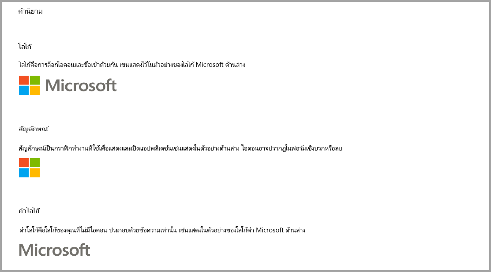
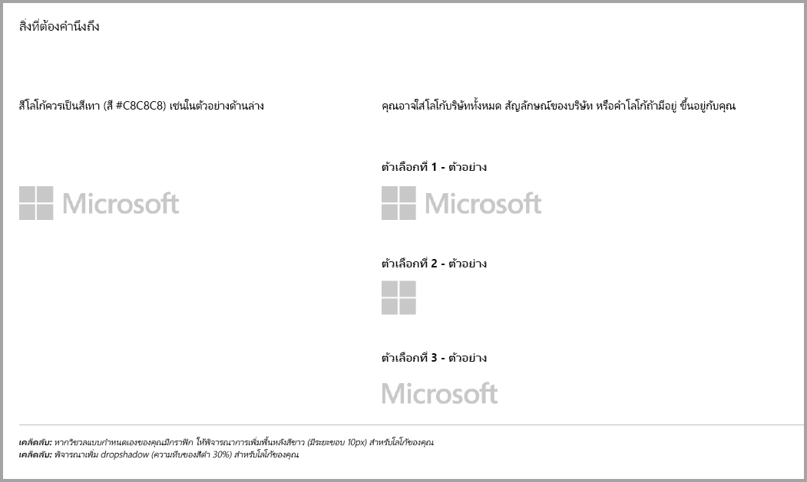
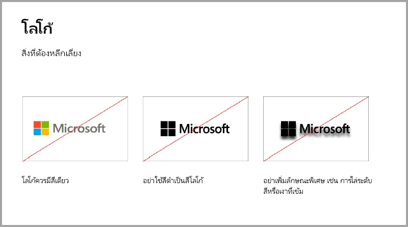
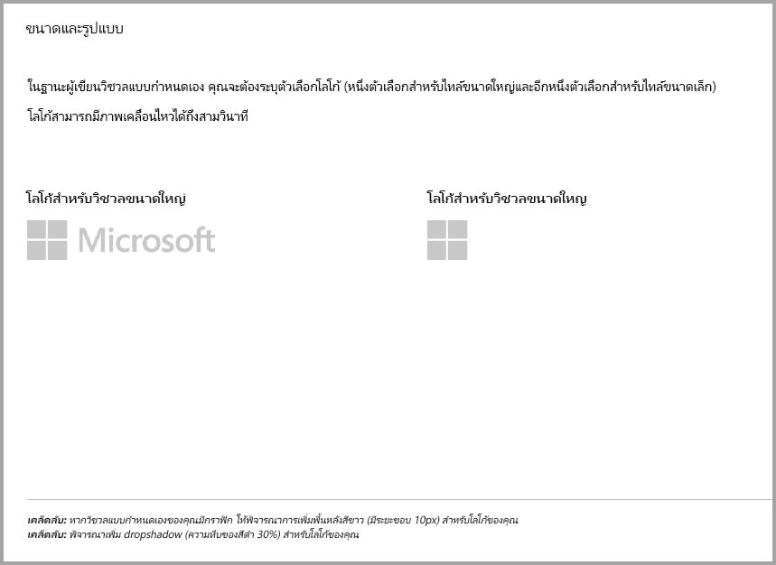
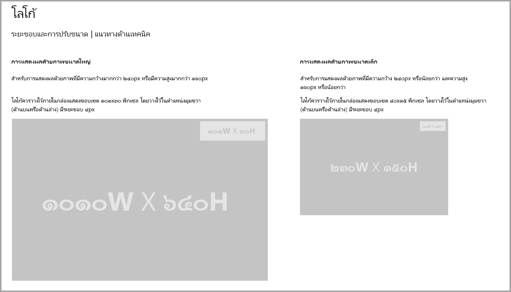
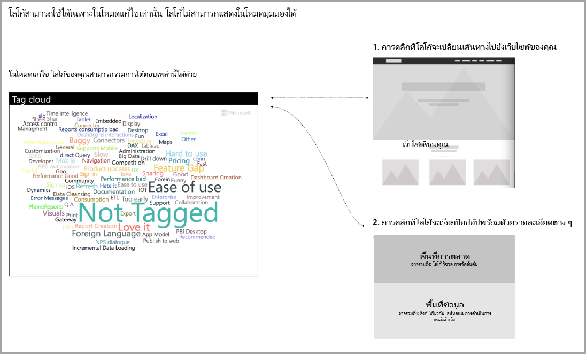

# คำแนะนำสำหรับการแสดงภาพ Power BI

## คำแนะนำการใช้วิชวลของ Power BI ที่มีการซื้อเพิ่มเติม

จนกระทั่งเมื่อไม่นานมานี้  Marketplace (AppSource) ยอมรับเฉพาะวิชวล Power BI ที่ฟรีเท่านั้น นโยบายนี้มีการเปลี่ยนแปลง (ธันวาคม '18) เพื่อให้คุณสามารถส่งวิชวลไปยัง AppSource ที่มีแท็กราคาเขียนว่า "อาจจำเป็นที่ต้องซื้อเพิ่ม" 

วิชวลที่อาจจำเป็นต้องซื้อเพิ่มเติมมีลักษณะคล้ายกับ Add-in ที่ซื้อเพิ่มภายในแอป (IAP) ในร้านสำนักงาน นักพัฒนาสามารถส่งวิชวลเหล่านี้เพื่อขอการรับรองหลังจากทีมงาน AppSource อนุมัติและหลังจากตรวจสอบให้แน่ใจว่าสอดคล้องกับข้อกำหนดการรับรอง สำหรับข้อมูลเพิ่มเติมเกี่ยวกับข้อกำหนดการรับรอง ให้ดูที่[รับรองวิชวลแบบกำหนดเอง](../power-bi-custom-visuals-certified.md)

> [!NOTE]
> สำหรับวิชวลที่ผ่านการรับรอง จะต้องไม่เข้าถึงบริการหรือแหล่งข้อมูลภายนอก

>[!IMPORTANT]  
> หากคุณอัปเดตวิชวลจากฟรีเป็น "อาจจำเป็นต้องซื้อเพิ่มเติม" ผู้ใช้จะต้องได้รับฟังก์ชั่นการใช้งานฟรีในระดับเดียวกับก่อนการอัพเดท คุณอาจเพิ่มคุณลักษณะขั้นสูงแบบชำระเงินนอกเหนือจากคุณลักษณะฟรีแบบเก่าที่มีอยู่ เราขอแนะนำให้คุณส่งวิชวล IAP กับคุณลักษณะขั้นสูงเป็นวิชวลใหม่และไม่อัปเดตคุณลักษณะฟรีแบบเก่าที่มีอยู่

## มีอะไรเปลี่ยนแปลงในกระบวนการส่งหรือไม่

นักพัฒนาอัปโหลดวิชวล IAP ไปยัง AppSource ผ่านหน้าแดชบอร์ดของผู้ขายตามที่ได้กำหนดไว้สำหรับวิชวลฟรี เพื่อแสดงให้เห็นว่าวิชวลที่ส่งมามีคุณลักษณะ IAP นักพัฒนาควรเขียนไว้ในบันทึกย่อบนแดชบอร์ดผู้ขายว่า: "วิชวลที่มีการซื้อเพิ่มภายในแอป" นอกจากนี้นักพัฒนาจำเป็นต้องแจ้งคีย์ใบอนุญาตและโทเค็นเพื่อให้ทีมงานตรวจสอบสามารถตรวจสอบคุณลักษณะ IAP ได้ หลังจากวิชวลได้รับการตรวจสอบและอนุมัติแล้ว การลงรายการ AppSource สำหรับวิชวล IAP จะระบุว่า 'อาจจำเป็นต้องซื้อเพิ่ม' ภายใต้ตัวเลือกการกำหนดราคา

## วิชวล Power BI ที่มีคุณลักษณะ IAP คืออะไร?

วิชวล IAP คือวิชวลแบบ **ฟรี** ที่ให้บริการ **คุณลักษณะแบบฟรี** วิชวล IAP ยังมีคุณลักษณะขั้นสูงบางอย่างสำหรับค่าธรรมเนียมเพิ่มเติมซึ่งอาจถูกนำไปใช้เพื่อให้ใช้งานวิชวล IAP เหล่านั้นได้ ในการอธิบายวิชวล นักพัฒนาต้องแจ้งผู้ใช้ในคำอธิบายของวิชวลเกี่ยวกับคุณลักษณะที่ต้องซื้อเพิ่มเติมเพื่อใช้งาน ปัจจุบัน Microsoft ไม่ได้มี APIs แบบเนทีฟเพื่อสนับสนุนการซื้อเพิ่มภายของแอปและ Add-ins

นักพัฒนาอาจใช้ระบบการชำระเงินอื่นสำหรับการซื้อเหล่านี้ สำหรับข้อมูลเพิ่มเติม ให้ดูที่[นโยบายร้านค้าของเรา](https://docs.microsoft.com/office/dev/store/validation-policies#2-apps-or-add-ins-can-display-certain-ads)

> [!NOTE]
> ลายน้ำไม่สามารถใช้งานได้กับคุณลักษณะแบบฟรีหรือวิชวลแบบฟรี ลายน้ำสามารถใช้ได้เฉพาะกับคุณลักษณะที่ต้องชำระซึ่งใช้โดยไม่ต้องมีใบอนุญาตที่ถูกต้อง เราขอแนะนำให้แสดงหน้าต่างป๊อปอัปพร้อมข้อมูลสิทธิ์การใช้งานที่เกี่ยวข้องทั้งหมดหากคุณใช้คุณลักษณะแบบชำระเงินขั้นสูงโดยไม่มีสิทธิ์การใช้งานที่ถูกต้อง  

## หลักเกณฑ์เกี่ยวกับโลโก้

ส่วนนี้จะอธิบายข้อกำหนดสำหรับการเพิ่มโลโก้และรูปแบบโลโก้ในวิชวล

> [!IMPORTANT]
> โลโก้สามารถใช้ได้เฉพาะใน **โหมดแก้ไขเท่านั้น** โลโก้**ไม่**สามารถแสดงในโหมดมุมมองได้

## แนวทางปฏิบัติที่ดีที่สุด

### หน้าเริ่มต้นของวิชวล

ใช้หน้าเริ่มต้นเพื่อชี้แจงให้ผู้ใช้ทราบพวกเขาสามารถใช้วิชวลของคุณได้อย่างไรและสามารถซื้อใบอนุญาตได้ที่ไหน อย่าใส่วิดีโอที่เรียกใช้งานโดยอัตโนมัติ เพิ่มเฉพาะเนื้อหาที่ช่วยเพิ่มประสบการณ์ของผู้ใช้ เช่น ข้อมูลหรือลิงก์ไปยังรายละเอียดการซื้อใบอนุญาตและวิธีใช้คุณลักษณะ IAP เท่านั้น

### คีย์ใบอนุญาตและโทเค็น

เพื่อความสะดวกของผู้ใช้ เพิ่มคีย์ใบอนุญาตหรือโทเค็นที่เกี่ยวข้องกับเขตข้อมูลที่ด้านบนของบานหน้าต่างการจัดรูปแบบ

## คำถามที่ถามบ่อย

สำหรับข้อมูลเพิ่มเติมเกี่ยวกับวิชวล ให้ดูที่[คำถามที่ถามบ่อยเกี่ยวกับวิชวลที่มีการซื้อเพิ่มเติม](https://docs.microsoft.com/power-bi/power-bi-custom-visuals-faq#visuals-with-additional-purchases)

## ขั้นตอนถัดไป

เรียนรู้วิธีที่คุณสามารถเผยแพร่วิชวลแบบกำหนดเองของคุณไปยัง [AppSource](office-store.md) เพื่อให้บุคคลอื่นสามารถค้นหาและใช้งาน
