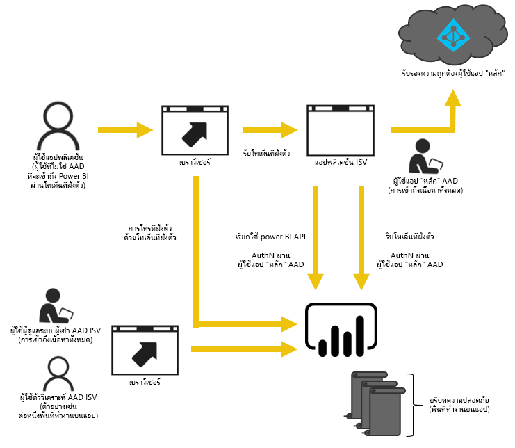
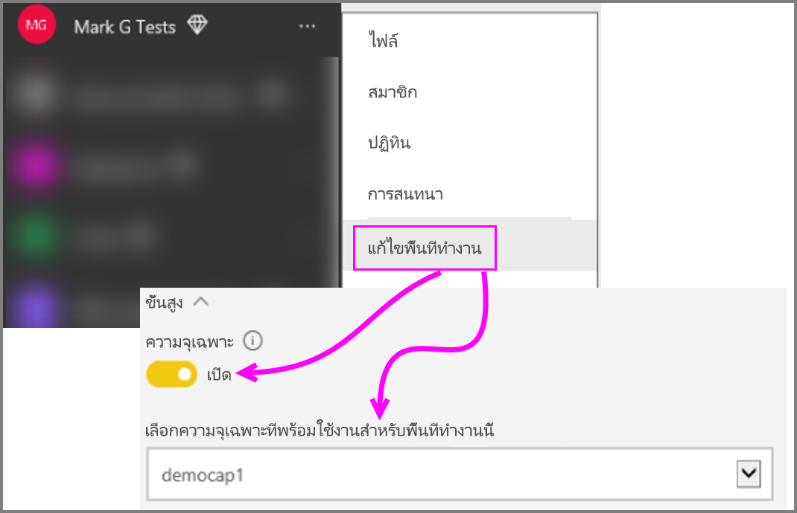

# วิธีการย้ายเนื้อหาจาก Power BI Workspace Collection ไปยัง Power BI Embedded

เรียนรู้วิธีการโยกย้ายจาก Power BI Workspace Collection ไปยัง Power BI Embedded และใช้ประโยชน์การพัฒนาเพื่อการฝังในแอป

เมื่อไม่นานมานี้ Microsoft [ประกาศเปิดตัว Power BI Embedded](https://powerbi.microsoft.com/blog/power-bi-embedded-capacity-based-skus-coming-to-azure/) ซึ่งเป็นแบบจำลองิ์ความสามารถใหม่่ที่ให้สิทธเพื่อเพิ่มวิธีที่ผู้ใช้เข้าถึง แชร์ และแจกจ่ายเนื้อหา นอกจากนียังทำให้ปรับขนาดและทำงานเพิ่มเติมได้อีกด้วย

ซึ่งหมายความว่า ด้วย Power BI Embedded คุณจะมี API surface ซึ่งเป็นชุดความสามารถและการเข้าถึงฟีเจอร์ล่าสุดของ Power BI – เช่น แดชบอร์ด เกตเวย์ และพื้นที่ทำงานของแอป – เมื่อทำการฝังเนื้อหาของคุณ ดำเนินต่อไป แล้วคุณจะสามารถเริ่มต้นใช้งาน Power BI Desktop และใช้ Power BI Embedded

Power BI Workspace Collection รุ่นปัจจุบันจะยังคงมีให้ใช้งานในช่วงเวลาที่จำกัด ลูกค้าภายใต้ข้อตกลงขององค์กรจะสามารถใช้งานได้จนกว่าข้อตกลงที่มีอยู่จะหมดอายุ ลูกค้าที่ได้ซื้อ Power BI Workspace Collection ทางช่องทาง Direct หรือ CSP จะยังคงใช้งานได้อีกหนึ่งปีนับจากเปิดตัว Power BI Embedded  บทความนี้จะให้คำแนะนำบางอย่างสำหรับการโยกย้ายเนื้อหาจาก Power BI Workspace Collection ไปยัง Power BI Embedded และการเปลี่ยนแปลงใหม่ๆที่คาดได้ในแอปของคุณ

> [!IMPORTANT]
> ในขณะที่การโยกย้ายเนื้อหาจะขึ้นอยู่กับ Power BI Embedded ผู้ใช้แอปของคุณจะไม่จำเป็นต้องใช้ Power BI เมื่อใช้**โทเค็นการฝัง** พวกเขาจึงไม่ต้องลงทะเบียนใช้งาน Power BI เพื่อดูเนื้อหาที่ฝังในแอปของคุณ คุณสามารถใช้วิธีฝังนี้กับผู้ใช้ที่ไม่ใช้ Power BI

ก่อนที่คุณจะเริ่มต้นย้ายไปยัง Power BI Embedded ใหม่ คุณสามารถไปยังคำแนะนำที่ช่วยให้คุณตั้งค่าสภาพแวดล้อม Power BI Embedded ใหม่ของคุณ โดยใช้[เครื่องมือตั้งค่าการฝังตัว](https://aka.ms/embedsetup)ได้

เลือกโซลูชันที่เหมาะกับคุณ:
* **การฝังตัวสำหรับลูกค้าของคุณ** - เมื่อคุณกำลังสนใจโซลูชันที่[แอปเป็นเจ้าของข้อมูล](https://aka.ms/embedsetup/AppOwnsData) [การฝังตัวสำหรับลูกค้าของคุณ](embedding.md#embedding-for-your-customers) จะมอบความสามารถในการฝังแดชบอร์ดและรายงานสำหรับผู้ใช้ที่ไม่มีบัญชี Power BI 

* **การฝังตัวสำหรับองค์กรของคุณ** - เมื่อคุณกำลังสนใจโซลูชันที่[ผู้ใช้เป็นเจ้าของข้อมูล](https://aka.ms/embedsetup/UserOwnsData) [การฝังตัวสำหรับองค์กรของคุณ](embedding.md#embedding-for-your-organization) ให้คุณสามารถขยายบริการของ Power BI

## เตรียมพร้อมสำหรับการโยกย้ายเนื้อหา

มีบางสิ่งที่คุณจำเป็นต้องทำเพื่อเตรียมพร้อมสำหรับการโยกย้ายเนื้อหาจาก Power BI Workspace Collection ไปยัง Power BI Embedded คุณจะต้องมีผู้เช่าที่พร้อมใช้งาน พร้อมกับผู้ใช้ที่มีสิทธิ์การใช้งาน Power BI Pro

1. ตรวจสอบให้แน่ใจว่า คุณสามารถเข้าถึงผู้เช่าของ Azure Active Directory (Azure AD) ได้

    คุณจำเป็นต้องระบุการตั้งค่าผู้เช่าเมื่อต้องใช้

   * ใช้ผู้เช่าของ Power BI ขององค์กรของคุณที่มีอยู่ได้อย่างไร
   * ใช้ผู้เช่าที่แยกต่างหากสำหรับแอปพลิเคชันของคุณ?
   * ใช้ผู้เช่าที่แยกต่างหากสำหรับลูกค้าแต่ละรายการได้อย่างไร

     ถ้าคุณตัดสินใจที่จะสร้างผู้เช่าใหม่สำหรับแอปของคุณหรือสำหรับลูกค้าแต่ละราย ดู[สร้างผู้เช่า Azure Active Directory](create-an-azure-active-directory-tenant.md) หรือ[วิธีการได้รับผู้เช่า Azure Active Directory](https://docs.microsoft.com/azure/active-directory/develop/active-directory-howto-tenant)
2. สร้างผู้ใช้ภายในผู้เช่าใหม่นี้ซึ่งจะทำหน้าที่เป็นบัญชีแอป "หลัก" ของคุณ บัญชีผู้ใช้นี้จำเป็นต้องลงทะเบียนใน Power BI และจำเป็นต้องมีสิทธิ์การใช้งานใน Power BI Pro

## บัญชีผู้ใช้ภายใน Azure AD

บัญชีผู้ใช้ต่อไปนี้จะต้องอยูในผู้เช่าของคุณ

> [!NOTE]
> บัญชีผู้ใช้เหล่านี้จะต้องมีสิทธิ์การใช้งาน Power BI Pro เพื่อใช้พื้นที่ทำงานของ App

1. ผู้ใช้ที่เป็นผู้ดูแลระบบผู้เช่า

    ขอแนะนำว่า ผู้ใช้รายนี้เป็นสมาชิกของพื้นที่ทำงานทั้งหมดของแอปที่ถูกสร้างขึ้นเพื่อการฝัง

2. บัญชีผู้ใช้สำหรับนักวิเคราะห์ที่จะสร้างเนื้อหา

    ควรกำหนดผู้ใช้เหล่านี้ในพื้นที่ทำงานของแอปตามความจำเป็น

3. บัญชีผู้ใช้*หลัก* หรือบัญชีผู้ใช้แบบฝังตัว

    Backend แอปพลิเคชันจะจัดเก็บข้อมูลประจำตัวสำหรับบัญชีนี้ และใช้บัญชีนี้ขอรับโทเค็น Azure AD เพื่อใช้กับ Power BI REST API บัญชีนี้จะถูกใช้เพื่อสร้างโทเค็นฝังตัวสำหรับแอป บัญชีผู้ใช้นี้ยังจำเป็นต้องเป็นผู้ดูแลระบบของพื้นที่ทำงานของ App ที่ถูกสร้างขึ้นสำหรับการฝัง

> [!NOTE]
> นี่คือบัญชีผู้ใช้ทั่วไปในองค์กรของคุณที่จะถูกใช้เพื่อทำการฝัง(embedding)

## การลงทะเบียนแอปและสิทธิ์

คุณจะต้องลงทะเบียนแอปภายใน Azure AD และให้สิทธิ์บางอย่าง

### ลงทะเบียนแอป

คุณจะต้องลงทะเบียนแอปของคุณกับ Azure AD เพื่อเรียกใช้ REST API ซึ่งรวมถึงการไปยังพอร์ทัล Azure เพื่อใช้ค่าคอนฟิกเพิ่มเติมนอกเหนือจากไปหน้าการลงทะเบียนแอป Power BI สำหรับข้อมูลเพิ่มเติม ดู[ลงทะเบียนแอป Azure AD เพื่อฝังเนื้อหา Power BI](register-app.md)

คุณควรลงทะเบียนแอปด้วยบัญชีแอป**หลัก**

## สร้างพื้นที่ทำงานของ App (จำเป็น)

คุณสามารถใช้ประโยชน์จากพื้นที่ทำงานของแอป เพื่อทำการแบ่งแยกต่างๆ ที่ ดีขึ้นได้ หากแอปของคุณให้บริการลูกค้าหลายราย ลูกค้าแต่ละรายของคุณจะได้รับแดชบอร์ดและรายงานที่ต่างกัน คุณสามารถใช้บัญชี Power BI หนึ่งบัญชีต่อหนึ่งพื้นที่ทำงานของ App เพื่อทำให้เกิดการใช้แอปในลักษณะที่ต่างกันเพื่อลูกค้าต่างๆ

> [!IMPORTANT]
> คุณไม่สามารถใช้พื้นที่ทำงานส่วนบุคคลเพื่อใช้งานการฝังสำหรับผู้ใช้ที่ไม่ใช่ Power BI

คุณจะต้องเป็นผู้ใช้ที่มีสิทธิ์การใช้งานรุ่น Pro เมื่อต้องสร้างพื้นที่ทำงานของแอปภายใน Power BI ผู้ใช้ Power BI ที่สร้างพื้นที่ทำงานของแอปจะเป็นผู้ดูแลระบบของพื้นที่ทำงานนั้นตามค่าดีฟอล์ต

> [!NOTE]
> บัญชีแอป*หลัก*ต้องเป็นผู้ดูแลระบบของพื้นที่ทำงาน

## การโยกย้ายเนื้อหา

การย้ายเนื้อหาของคุณจาก workspace collection ของคุณไปยัง Power BI Embedded สามารถทำได้ควบคู่ไปกับโซลูชันปัจจุบันของคุณ และไม่จำเป็นต้องหยุดการทำงานใดๆ

**เครื่องมือการโยกย้าย**จะพร้อมใช้งานเพื่อช่วยคุณคัดลอกเนื้อหาจาก Power BI Workspace Collection ไปยัง Power BI Embedded โดยเฉพาะอย่างยิ่ง ถ้าคุณมีเนื้อหาจำนวนมาก สำหรับข้อมูลเพิ่มเติม ดู[เครื่องมือการโยกย้ายของ Power BI Embedded](migrate-tool.md)

การโยกย้ายเนื้อหามักใช้ API สองตัว

1. ดาวน์โหลด PBIX - API นี้สามารถดาวน์โหลดไฟล์ PBIX ซึ่งถูกอัปโหลดไปยัง Power BI หลังจากเดือนตุลาคม 2016
2. นำเข้า PBIX - API นี้อัปโหลดไฟล์ PBIX ใดๆ ไปยัง Power BI

สำหรับรหัสชุดย่อยที่เกี่ยวข้องบางอย่าง ดู[รหัสชุดย่อยเพื่อการโยกย้ายเนื้อหาจาก Power BI Workspace Collection](migrate-code-snippets.md)

### ชนิดของรายงาน

มีรายงานหลายชนิด แต่ละชนิดใช้โฟลว์การโยกย้ายที่แตกต่างกัน

#### ชุดข้อมูลและรายงานที่แคชไว้

ชุดข้อมูลที่แคชหมายถึงไฟล์ PBIX ที่มีข้อมูลนำเข้าซึ่งตรงกันข้ามกับการเชื่อมต่อแบบสดหรือการเชื่อมต่อของ DirectQuery

**ขั้นตอน**

1. เรียก ดาวน์โหลด PBIX API จากพื้นที่ทำงาน PaaS
2. บันทึก PBIX
3. เรียก นำเข้า PBIX ไปยังพื้นที่ทำงาน SaaS

#### ชุดข้อมูลและรายงาน DirectQuery

**ขั้นตอน**

1. เรียก รับ https://api.powerbi.com/v1.0/collections/{collection_id}/workspaces/{wid}/datasets/{dataset_id}/Default.GetBoundGatewayDataSources และบันทึกสตริงการเชื่อมต่อที่ได้รับ
2. เรียก ดาวน์โหลด PBIX API จากพื้นที่ทำงาน PaaS
3. บันทึก PBIX
4. เรียก นำเข้า PBIX ไปยังพื้นที่ทำงาน SaaS
5. อัปเดตสตริงการเชื่อมต่อโดยการเรียก - โพสต์  https://api.powerbi.com/v1.0/myorg/datasets/{dataset_id}/Default.SetAllConnections
6. รับ GW id และ id แหล่งข้อมูลโดยการเรียก - รับ https://api.powerbi.com/v1.0/myorg/datasets/{dataset_id}/Default.GetBoundGatewayDataSources
7. ปรับปรุงข้อมูลประจำตัวของผู้ใช้โดยการเรียก - โปรแกรมแก้ไข https://api.powerbi.com/v1.0/myorg/gateways/{gateway_id}/datasources/{datasource_id}

#### ชุดข้อมูลและรายงานเก่า

ต่อไปนี้เป็นชุดข้อมูล/รายงานที่สร้างขึ้นก่อนเดือนตุลาคม 2016 ดาวน์โหลด PBIX ไม่สนับสนุนไฟล์ PBIXs ซึ่งถูกอัปโหลดก่อนเดือนตุลาคม 2016

**ขั้นตอน**

1. รับ PBIX จากสภาพแวดล้อมการพัฒนาของคุณ (ตัวควบคุมแหล่งข้อมูลภายในของคุณ)
2. เรียก นำเข้า PBIX ไปยังพื้นที่ทำงาน SaaS

#### พุช (Push) ชุดข้อมูลและรายงาน

ดาวน์โหลด PBIX ไม่สนับสนุนชุดข้อมูล *API พุช* ข้อมูลของชุดข้อมูล API พุชไม่สามารถโอนย้ายจาก PaaS ไปยัง SaaS ได้

**ขั้นตอน**

1. เรียก "สร้างชุดข้อมูล" API ด้วยชุดข้อมูล json เมื่อต้องสร้างชุดข้อมูลในพื้นที่ทำงาน SaaS
2. สร้างรายงานอีกครั้งสำหรับชุดข้อมูลที่ถูกสร้าง*

โดยใช้วิธีแก้ไขปัญหาบางอย่าง คุณสามารถโยกย้ายรายงาน API พุชจาก PaaS ไปยัง SaaS ด้วยการทำต่อไปนี้

1. อัปโหลด PBIX บางตัวอย่างไปยังพื้นที่ทำงาน PaaS
2. โคลนรายงาน API พุชและผูกกับ PBIX ตัวอย่างจากขั้นตอนที่ 1
3. ดาวน์โหลดรายงาน API พุชด้วย PBIX ตัวอย่าง
4. อัปโหลด PBIX ตัวอย่างไปยังพื้นที่ทำงานของ SaaS
5. สร้างชุดข้อมูลแบบพุชในพื้นที่ทำงาน SaaS ของคุณ
6. ผูกรายงานกับชุดข้อมูล API พุชอีกครั้ง

## สร้างและอัปโหลดรายงานใหม่

นอกเหนือจากเนื้อหาที่คุณโยกย้ายจาก Power BI Workspace Collection คุณสามารถสร้างรายงานและชุดข้อมูลโดยใช้ Power BI Desktop แล้วตีพิมพ์รายงานเหล่านั้นไปยังพื้นที่ทำงานของแอป ซึ่งหมายความว่า ผู้ใช้ที่ตีพิมพ์รายงานจำเป็นต้องมีสิทธิ์การใช้งาน Power BI Pro เพื่อเผยแพร่ไปยังพื้นที่ทำงานของแอป

## สร้างแอปพลิเคชันของคุณอีกครั้ง

1. คุณจะต้องปรับเปลี่ยนแอปของคุณเมื่อต้องใช้ Power BI REST API และตำแหน่งที่ตั้งของรายงานภายใน powerbi.com
2. สร้างการรับรองสิทธิ์ AuthN/AuthZ ของคุณอีกครั้งโดยใช้บัญชีผู้ใช้*หลัก*ของแอปของคุณ คุณสามารถใช้[โทเค็นการฝัง](https://docs.microsoft.com/rest/api/power-bi/embedtoken)เพื่ออนุญาตให้ผู้ใช้รายนี้ดำเนินการในนามของผู้ใช้อื่นได้
3. ฝังรายงานของคุณจาก powerbi.com ลงในแอปของคุณ

## แมปผู้ใช้ของคุณให้กับผู้ใช้ Power BI

ภายในแอปของคุณ คุณจะแมปผู้ใช้ที่คุณจัดการภายในแอปไปยังข้อมูลประจำตัว *หลัก*ของ Power BI เพื่อใช้งานแอปพลิเคชันของคุณ ข้อมูลประจำตัวสำหรับบัญชี *หลัก*Power BI นี้ีจะถูกเก็บไว้ภายในแอปพลิเคชันของคุณ และใช้เพื่อสร้างโทเค็นแบบฝัง

## สิ่งที่ต้องทำเมื่อคุณพร้อมสำหรับการผลิต

เมื่อคุณพร้อมที่จะทำการผลิต คุณจะต้องทำสิ่งต่อไปนี้

* ถ้าคุณกำลังใช้ผู้เช่าที่แยกต่างหากเพื่อการทำงานนี้ คุณจะต้องตรวจสอบให้แน่ใจว่าพื้นที่ทำงานของแอปของคุณและแดชบอร์ดและรายงานพร้อมใช้งานในสภาพแวดล้อมการผลิตของคุณ นอกจากนี้ คุณจะจำเป็นต้องตรวจสอบให้แน่ใจว่าคุณได้สร้างแอปใน Azure AD สำหรับผู้เช่าการผลิตของคุณ และกำหนดสิทธิ์ app ที่เหมาะสมตามที่ระบุในขั้นตอนที่ 1
* ซื้อความสามารถการผลิต (capacity) ที่เหมาะสมกับความต้องการของคุณ เพื่อให้เข้าใจว่าคุณต้องใช้ปริมาณและชนิดของความสามารถการผลิตอย่างไร ดูเอกสารทางเทคนิคเรื่องการวางแผนความสามารถวิเคราะห์ของ[Power BI Embedded](https://aka.ms/pbiewhitepaper) คุณสามารถ[ซื้อความสามารถการผลิต](https://portal.azure.com/#create/Microsoft.PowerBIDedicated)ใน Azure ได้
* แก้ไขพื้นที่ทำงานของแอป และกำหนดพื้นที่นี้เป็นความสามารถระดับพรีเมียมภายใต้ขั้นสูง

    

* ปรับใช้แอปของคุณที่อัปเดตแล้วกับการผลิต และเริ่มต้นฝังรายงานจาก Power BI Embedded

## หลังจากการโยกย้าย

คุณควรทำการล้างข้อมูลบางอย่างภายใน Azure

* ลบพื้นที่ทำงานทั้งหมดออกจากโซลูชันที่ถูกใช้ภายใน Azure Embedded ของ Power BI Workspace Collection
* ลบคอลเลกชันพื้นที่ทำงานใดๆ ที่มีอยู่ภายใน Azure

## ขั้นตอนถัดไป

[ฝังด้วย Power BI](embedding.md)  
[เครื่องมือการโยกย้ายเนื้อหาของ Power BI Worksapce Collection](migrate-tool.md)  
[รหัสชุดย่อยสำหรับการโยกย้ายเนื้อหาจาก Power BI Workspace Collection](migrate-code-snippets.md)  
[วิธีฝัง แดชบอร์ด รายงาน และไทล์ Power BI ของคุณ](embedding-content.md)  
[Power BI Premium คืออะไร](../service-premium.md)  
[พื้นที่เก็บข้อมูลของ JavaScript API Git](https://github.com/Microsoft/PowerBI-JavaScript)  
[Power BI C# Git repo](https://github.com/Microsoft/PowerBI-CSharp)  
[ตัวอย่างการฝัง JavaScript](https://microsoft.github.io/PowerBI-JavaScript/demo/)  
[เอกสารทางเทคนิคเรื่องการวางแผนความสามารถวิเคราะห์ของ Workspace Collection](https://aka.ms/pbiewhitepaper)  
[เอกสารทางเทคนิคของ Power BI Premium](https://aka.ms/pbipremiumwhitepaper)  

มีคำถามเพิ่มเติมหรือไม่ [ลองถามชุมชน Power BI](http://community.powerbi.com/)
