# <a name="power-bi-embedded-migration-tool"></a>เครื่องมือการย้าย Power BI แบบฝัง
เครื่องมือการย้ายนี้สามารถใช้เพื่อคัดลอกรายงานของคุณจากบริการ Azure แบบฝังของ Power BI (PaaS) ไปยังบริการ Power BI (SaaS)

การย้ายเนื้อหาของคุณจากคอลเลกชันพื้นที่ทำงานของคุณไปยังบริการ Power BI สามารถทำได้ควบคู่ไปกับโซลูชันปัจจุบันของคุณ และไม่จำเป็นต้องหยุดการทำงานใดๆ

## <a name="limitations"></a>ข้อจำกัด
* ไม่สามารถดาวน์โหลดชุดข้อมูลที่ส่ง และจะต้องได้รับการสร้างขึ้นใหม่โดยใช้ Power BI REST APIs สำหรับบริการ Power BI
* ไฟล์ PBIX ได้รับการนำเข้าก่อนวันที่ 26 พฤศจิกายน 2016 และจะไม่สามารถดาวน์โหลดได้

## <a name="download"></a>ดาวน์โหลด
คุณสามารถดาวน์โหลดตัวอย่างเครื่องมือการย้ายจาก[GitHub](https://github.com/Microsoft/powerbi-migration-sample)ได้ คุณสามารถดาวน์โหลด zip ของพื้นที่เก็บข้อมูล หรือคุณสามารถโคลนภายในเครื่อง เมื่อดาวน์โหลดแล้ว คุณสามารถเปิด*powerbi-migration-sample.sln*ใน Visual Studio เพื่อสร้าง และเรียกใช้เครื่องมือการย้ายได้

## <a name="migration-plans"></a>แผนการย้าย
แผนการย้ายของคุณเป็นเพียงแค่เมตาดาต้าที่จัดหมวดหมู่เนื้อหาภายใน Power BI แบบฝัง และคุณต้องการเผยแพร่ไปยังบริการ Power BI ด้วยวิธีใด

### <a name="start-with-a-new-migration-plan"></a>เริ่มต้นด้วยแผนการย้ายใหม่
แผนการย้ายเป็นเมตาดาต้าของรายการที่พร้อมใช้งานใน Power BI แบบฝังที่คุณต้องการย้ายไปยังบริการ Power BI แผนการย้ายที่ถูกจัดเก็บเป็นไฟล์ XML

คุณจะต้องการเริ่มต้นโดยการสร้างแผนการย้ายใหม่ เมื่อต้องสร้างแผนการย้ายใหม่ ทำตามขั้นตอนต่อไปนี้

1. เลือก **”ไฟล์”** > **”แผนการย้ายใหม่”**
   
    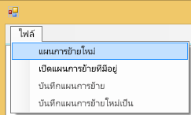
2. ในการ**เลือกกล่องโต้ตอบ กลุ่มทรัพยากร Power BI แบบฝัง** คุณจะต้องเลือกเมนูแบบเลื่อนลงของ Environment และเลือก prod
3. คุณจะได้รับแจ้งให้ลงชื่อเข้าใช้ คุณเข้าสู่ระบบการสมัครใช้งาน Azure ของคุณ
   
   > [!IMPORTANT]
   > นี่**ไม่**ใช่บัญชีองค์กร Office 365 ของคุณที่คุณใช้เพื่อลงชื่อเข้าใช้ Power BI
   > 
   > 
4. เลือกการสมัครใช้งาน Azure ซึ่งเก็บคอลเลกชันพื้นที่ทำงาน Power BI แบบฝังของคุณ
   
    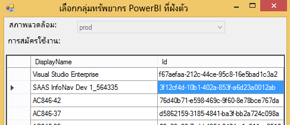
5. ด้านล่างรายการสมัครใช้งาน เลือก **”กลุ่มทรัพยากร”** ที่ประกอบด้วยคอลเลกชันพื้นที่ทำงานของคุณแล้วเลือก **”เลือก”**
   
    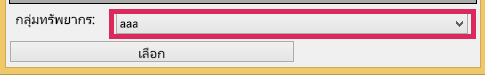
6. เลือก **”วิเคราะห์”** ซึ่งจะได้รับสินค้าคงคลังในการสมัครใช้งาน Azure เพื่อให้คุณสามารถเริ่มแผนของคุณ
   
    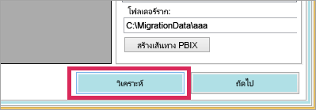
   
   > [!NOTE]
   > กระบวนการวิเคราะห์อาจใช้เวลาหลายนาที ขึ้นอยู่กับจำนวนของคอลเลกชันพื้นที่ทำงานและปริมาณของเนื้อหาที่มีอยู่ในคอลเลกชันพื้นที่ทำงาน
   > 
   > 
7. เมื่อ**วิเคราะห์**เสร็จสมบูรณ์ จะมีการแจ้งให้คุณบันทึกแผนการย้ายของคุณ

ณ จุดนี้ คุณได้เชื่อมต่อแผนการย้ายของคุณกับการสมัครใช้งาน Azure แล้ว อ่านด้านล่างเพื่อทำความเข้าใจขั้นตอนของวิธีการทำงานกับแผนการย้ายของคุณ ซึ่งรวมถึงการวิเคราะห์และการย้ายแผน การดาวน์โหลด การสร้างกลุ่ม และการอัปโหลด

### <a name="save-your-migration-plan"></a>บันทึกแผนการย้ายของคุณ
คุณสามารถบันทึกแผนการย้ายของคุณสำหรับการใช้งานในภายหลัง การดำเนินการนี้จะสร้างไฟล์ XML ที่จะเก็บข้อมูลทั้งหมดในแผนการย้ายของคุณ

เมื่อต้องบันทึกแผนการย้ายของคุณ ทำตามขั้นตอนต่อไปนี้

1. เลือก **”ไฟล์”** > **บันทึกแผนการย้าย**
   
    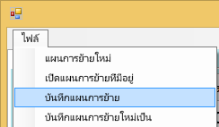
2. ตั้งชื่อไฟล์ของคุณ หรือใช้ชื่อไฟล์ที่สร้างขึ้น แล้วเลือก **”บันทึก”**

### <a name="open-an-existing-migration-plan"></a>เปิดแผนการย้ายที่มีอยู่
คุณสามารถเปิดแผนการย้ายที่บันทึกไว้เพื่อการดำเนินการย้ายต่อ

เมื่อต้องเปิดแผนการย้ายของคุณที่มีอยู่ ทำตามขั้นตอนต่อไปนี้

1. เลือก**ไฟล์** > **เปิดแผนการย้ายที่มีอยู่**
   
    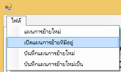
2. เลือกไฟล์การย้ายของคุณ แล้วเลือก **”เปิด”**

## <a name="step-1-analyze--plan-migration"></a>ขั้นตอนที่ 1: การวิเคราะห์และการวางแผนการย้าย
แท็บการ**วิเคราะห์และการวางแผนการย้าย**จะทำให้คุณสามารถมองเห็นสิ่งที่อยู่ในกลุ่มทรัพยากรของการสมัครใช้งาน Azure ในขณะนั้น

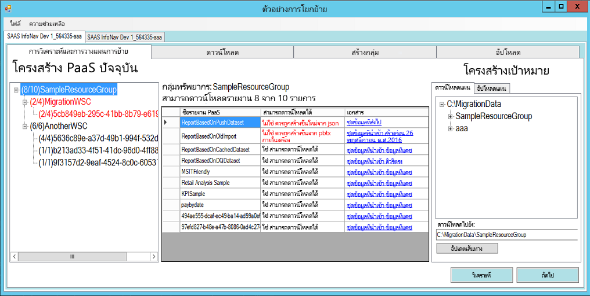

เราจะดู*SampleResourceGroup*เป็นตัวอย่าง

### <a name="paas-topology"></a>โทโพโลยี PaaS
นี่คือรายการ*กลุ่มทรัพยากร > คอลเลกชันพื้นที่ทำงาน > พื้นที่ทำงาน*ของคุณ กลุ่มทรัพยากรและคอลเลกชันพื้นที่ทำงานจะแสดงชื่อที่เรียกง่าย พื้นที่ทำงานจะแสดง GUID

นอกจากนี้รายการจะแสดงสีและตัวเลขในรูปแบบของ (#/#) ซึ่งระบุหมายเลขของรายงานที่สามารถดาวน์โหลดได้ สีดำหมายความว่าคุณสามารถดาวน์โหลดรายงานทั้งหมด

สีแดงหมายความว่าไม่สามารถดาวน์โหลดบางรายงานได้ หมายเลขด้านซ้ายจะระบุจำนวนรวมของรายงานที่สามารถดาวน์โหลดได้ หมายเลขทางด้านขวาจะระบุจำนวนรวมของรายงานภายในการจัดกลุ่ม

คุณสามารถเลือกรายการภายในโทโพโลยี PaaS เพื่อแสดงรายงานในส่วนของรายงาน

### <a name="reports"></a>รายงาน
ส่วนของรายงานจะแสดงรายงานที่พร้อมใช้งาน และจะระบุว่าสามารถดาวน์โหลดหรือไม่

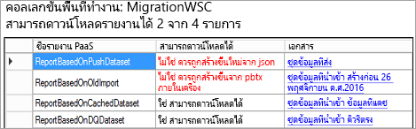

### <a name="target-structure"></a>โครงสร้างเป้าหมาย
โครงสร้าง**เป้าหมาย**คือตำแหน่งที่คุณบอกเครื่องมือว่าสิ่งต่างๆจะถูกดาวน์โหลดไปที่ใดและวิธีการอัปโหลด

#### <a name="download-plan"></a>ดาวน์โหลดแผน
เส้นทางจะถูกสร้างขึ้นสำหรับคุณโดยอัตโนมัติ คุณสามารถเปลี่ยนเส้นทางนี้ได้ถ้าคุณต้องการ ถ้าคุณเปลี่ยนเส้นทาง คุณจะต้องเลือก **”อัปเดตเส้นทาง”**

> [!NOTE]
> ซึ่งไม่ได้ทำการดาวน์โหลด เพียงแค่ระบุโครงสร้างของสถานที่ที่รายงานจะถูกดาวน์โหลดไปไว้
> 
> 

#### <a name="upload-plan"></a>อัปโหลดแผน
คุณสามารถระบุคำนำหน้าที่นี่เพื่อใช้สำหรับ พื้นที่ทำงานของแอป ที่จะถูกสร้างขึ้นภายในบริการ Power BI หลังจากคำนำหน้าจะเป็น GUID สำหรับพื้นที่ทำงานที่มีอยู่ใน Azure


> [!NOTE]
> ซึ่งไม่ได้สร้างกลุ่มภายในบริการ Power BI แต่เพียงแค่กำหนดโครงสร้างการตั้งชื่อสำหรับกลุ่มเท่านั้น
> 
> 

ถ้าคุณเปลี่ยนคำนำหน้า คุณจะต้องเลือก **”สร้างการอัปโหลดแผน”**

ถ้าคุณต้องการ คุณสามารถคลิกขวาบนกลุ่ม และเลือกเพื่อเปลี่ยนชื่อกลุ่มใน “แผนการอัปโหลด” โดยตรง

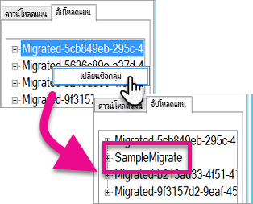

> [!NOTE]
> ชื่อของ*กลุ่ม*ต้องไม่ประกอบด้วยช่องว่างหรืออักขระที่ไม่ถูกต้อง
> 
> 

## <a name="step-2-download"></a>ขั้นตอนที่ 2: ดาวน์โหลด
ในแท็บ**ดาวน์โหลด**คุณจะเห็นรายการของรายงานและเมตาดาต้าที่เกี่ยวข้อง คุณสามารถดูสถานะการส่งออกและสถานะการส่งออกก่อนหน้านี้

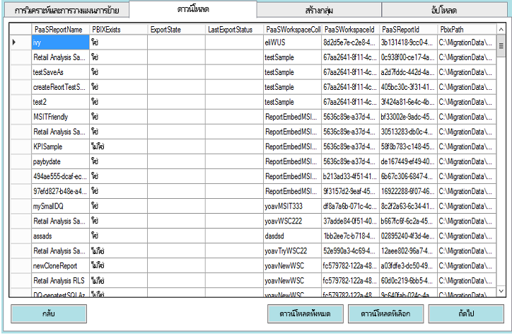

คุณมีสองตัวเลือก

* เลือกรายงาน แล้วเลือก**ดาวน์โหลดที่เลือก**
* เลือก**ดาวน์โหลดทั้งหมด**

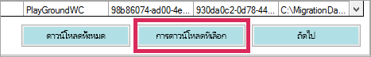

หากการดาวน์โหลดเสร็จสมบูรณ์ คุณจะเห็นสถานะ *”เสร็จสิ้น”* ซึ่งแสดงว่ามี ไฟล์ PBIX อยู่

หลังจากการดาวน์โหลดเสร็จสมบูรณ์ เลือกแท็บ **”สร้างกลุ่ม”**

## <a name="step-3-create-groups"></a>ขั้นตอนที่ 3: สร้างกลุ่ม
หลังจากที่คุณดาวน์โหลดรายงานที่พร้อมใช้งานแล้ว คุณสามารถไปที่แท็บ **”สร้างกลุ่ม”** แท็บนี้จะสร้างพื้นที่ทำงานของแอปในบริการ Power BI ตามแผนการย้ายที่คุณสร้างขึ้น ระบบจะสร้างพื้นที่ทำงานของแอปพร้อมกับชื่อที่คุณตั้งในแท็บ**อัปโหลด**ใน**การวิเคราะห์และการวางแผนการย้าย**

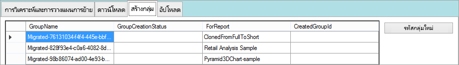

เมื่อต้องการสร้างพื้นที่ทำงานของแอป คุณสามารถเลือกว่าจะ **”สร้างกลุ่มที่เลือก”** หรือ **”สร้างกลุ่มทั้งหมดที่หายไป”** ได้

เมื่อคุณเลือกตัวเลือกเหล่านี้อย่างใดอย่างหนึ่ง คุณจะได้รับการแจ้งให้ลงชื่อเข้าใช้ *คุณจะต้องใช้ข้อมูลประจำตัวของคุณสำหรับบริการ Power BI ที่คุณต้องการสร้างพื้นที่การทำงานของแอป*

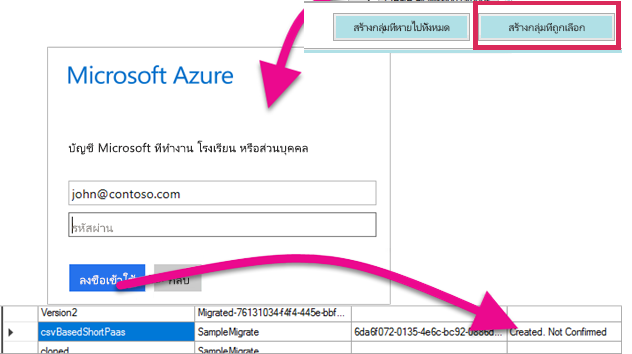

ซึ่งจะสร้างพื้นที่ทำงานของแอปภายในบริการ Power BI และจะไม่อัปโหลดรายงานไปยังพื้นที่ทำงานของแอป

คุณสามารถตรวจสอบว่าพื้นที่ทำงานของแอปถูกสร้างขึ้นโดยการลงชื่อเข้าใช้ Power BI และตรวจสอบว่ามีพื้นที่ทำงานอยู่หรือไม่ คุณจะสังเกตเห็นว่า ไม่มีสิ่งใดในพื้นที่ทำงาน

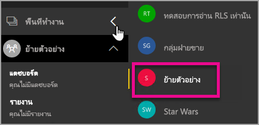

หลังจากที่มีการสร้างพื้นที่ทำงาน คุณสามารถย้ายไปยังแท็บ **อัปโหลด** ได้

## <a name="step-4-upload"></a>ขั้นตอนที่ 4: อัปโหลด
ในแท็บ **”อัปโหลด”** จะอัปโหลดรายงานไปยังบริการ Power BI คุณจะเห็นรายการของรายงานที่เราดาวน์โหลดบนแท็บ “ดาวน์โหลด” พร้อมกับชื่อกลุ่มเป้าหมายที่ยึดตามแผนการย้ายของคุณ

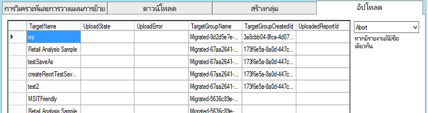

คุณสามารถอัปโหลดรายงานที่เลือก หรือคุณสามารถอัปโหลดรายงานทั้งหมด นอกจากนี้คุณยังสามารถรีเซ็ตสถานะอัปโหลดให้เป็นรายการอัปโหลดใหม่

นอกจากนี้คุณยังมีตัวเลือกในการเลือกสิ่งที่ต้องทำ ถ้ามีรายงานที่มีชื่อเดียวกันอยู่ คุณสามารถเลือกระหว่าง**ยกเลิก**, **ละเว้น**และ**เขียนทับ**ได้

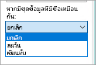

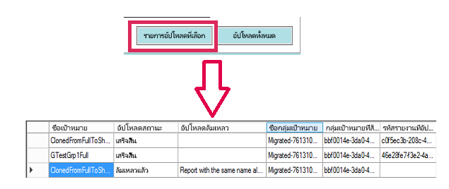

### <a name="duplicate-report-names"></a>ชื่อรายงานซ้ำ
ถ้าคุณมีรายงานที่มีชื่อเดียวกัน แต่คุณทราบว่ารายงานนั้นแตกต่างกัน คุณจะต้องเปลี่ยนการ **”ชื่อเป้าหมาย”** ของรายงาน คุณสามารถเปลี่ยนชื่อโดยการแก้ไข XML แผนการย้ายด้วยตนเอง

คุณจะต้องปิดเครื่องมือการย้ายเพื่อทำการเปลี่ยนแปลง จากนั้นเปิดเครื่องมือและแผนการย้ายอีกครั้ง

ในตัวอย่างข้างต้น หนึ่งในรายงานที่ถูกโคลนล้มเหลวในการระบุรายงานที่มีชื่อเดียวกัน เราจะเห็นสิ่งต่อไปนี้ ถ้าเราดูที่ XML แผนการย้าย

```
<ReportMigrationData>
    <PaaSWorkspaceCollectionName>SampleWorkspaceCollection</PaaSWorkspaceCollectionName>
    <PaaSWorkspaceId>4c04147b-d8fc-478b-8dcb-bcf687149823</PaaSWorkspaceId>
    <PaaSReportId>525a8328-b8cc-4f0d-b2cb-c3a9b4ba2efe</PaaSReportId>
    <PaaSReportLastImportTime>1/3/2017 2:10:19 PM</PaaSReportLastImportTime>
    <PaaSReportName>cloned</PaaSReportName>
    <IsPushDataset>false</IsPushDataset>
    <IsBoundToOldDataset>false</IsBoundToOldDataset>
    <PbixPath>C:\MigrationData\SampleResourceGroup\SampleWorkspaceCollection\4c04147b-d8fc-478b-8dcb-bcf687149823\cloned-525a8328-b8cc-4f0d-b2cb-c3a9b4ba2efe.pbix</PbixPath>
    <ExportState>Done</ExportState>
    <LastExportStatus>OK</LastExportStatus>
    <SaaSTargetGroupName>SampleMigrate</SaaSTargetGroupName>
    <SaaSTargetGroupId>6da6f072-0135-4e6c-bc92-0886d8aeb79d</SaaSTargetGroupId>
    <SaaSTargetReportName>cloned</SaaSTargetReportName>
    <SaaSImportState>Failed</SaaSImportState>
    <SaaSImportError>Report with the same name already exists</SaaSImportError>
</ReportMigrationData>
```

สำหรับรายการที่ล้มเหลว เราสามารถเปลี่ยนชื่อของ SaaSTargetReportName ได้

```
<SaaSTargetReportName>cloned2</SaaSTargetReportName>
```

จากนั้นเราจะสามารถเปิดแผนและอัปโหลดรายงานที่ล้มเหลวในเครื่องมือการย้ายใหม่อีกครั้ง

เมื่อกลับไปยัง Power BI เราจะเห็นว่ารายงานและชุดข้อมูลได้รับการอัปโหลดลงในพื้นที่ทำงานของแอปแล้ว

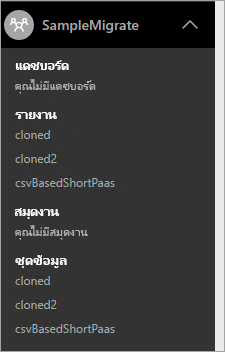

<a name="upload-local-file"></a>

### <a name="upload-a-local-pbix-file"></a>อัปโหลดไฟล์ PBIX ภายในเครื่อง
คุณสามารถอัปโหลดไฟล์ Power BI Desktop รุ่นภายในเครื่องได้ คุณจะต้องปิดเครื่องมือ แก้ไข XML และใส่เส้นทางแบบเต็มไปยัง PBIX ภายในเครื่องของคุณในคุณสมบัติ**PbixPath**

```
<PbixPath>[Full Path to PBIX file]</PbixPath>
```

หลังจากที่คุณแก้ไข xml แล้ว เปิดแผนในเครื่องมือการย้ายใหม่อีกครั้ง และอัปโหลดรายงาน

<a name="directquery-reports"></a>

### <a name="directquery-reports"></a>รายงาน DirectQuery
คุณจะต้องอัปเดตเพื่อปรับปรุงสตริงการเชื่อมต่อสำหรับรายงาน DirectQuery ซึ่งสามารถทำได้ใน*powerbi.com*หรือคุณสามารถค้นหาสตริงการเชื่อมต่อจาก Power BI แบบฝัง (Paas) ทางโปรแกรมได้ สำหรับตัวอย่าง ดูที่[สตริงการเชื่อมต่อ “DirectQuery ที่แยกออก” จากรายงาน PaaS](migrate-code-snippets.md#extract-directquery-connection-string-from-paas-report)

จากนั้นคุณจะสามารถอัปเดตสตริงการเชื่อมต่อสำหรับชุดข้อมูลในบริการ Power BI (Saas) และตั้งค่าข้อมูลประจำตัวสำหรับแหล่งข้อมูล คุณสามารถดูตัวอย่างต่อไปนี้เพื่อดูวิธีการทำ

* [การอัปเดตสตริงเชื่อมต่อ DirectQuery คือ พื้นที่ทำงาน SaaS](migrate-code-snippets.md#update-directquery-connection-string-is-saas-workspace)
* [ตั้งค่าข้อมูลประจำตัวของ DirectQuery ในพื้นที่ทำงาน SaaS](migrate-code-snippets.md#set-directquery-credentials-in-saas-workspace)

## <a name="embedding"></a>การฝัง
ในตอนนี้รายงานของคุณได้ถูกย้ายจากบริการ Azure แบบฝัง Power BI ไปยังบริการ Power BI คุณสามารถอัปเดตแอปพลิเคชันของคุณได้เดี๋ยวนี้ และเริ่มการฝังรายงานในพื้นที่ทำงานของแอปนี้

สำหรับข้อมูลเพิ่มเติม ดูที่[วิธีการย้ายเนื้อหาคอลเลกชันพื้นที่ทำงานแบบฝัง Power BI ไปยัง Power BI](migrate-from-powerbi-embedded.md)

## <a name="next-steps"></a>ขั้นตอนถัดไป
[การฝังด้วย Power BI](embedding.md)  
[วิธีการย้ายเนื้อหาคอลเลกชันพื้นที่ทำงานแบบฝัง Power BI ไปยัง Power BI](migrate-from-powerbi-embedded.md)  
[Power BI Premium คืออะไร](../service-premium.md)  
[พื้นที่เก็บข้อมูลของ JavaScript API Git](https://github.com/Microsoft/PowerBI-JavaScript)  
[Power BI C# Git repo](https://github.com/Microsoft/PowerBI-CSharp)  
[ตัวอย่างการฝัง JavaScript](https://microsoft.github.io/PowerBI-JavaScript/demo/)  
[เอกสารบรรยายแนวความคิดของ Power BI Premium](https://aka.ms/pbipremiumwhitepaper)  

มีคำถามเพิ่มเติมหรือไม่ [ลองถามชุมชน Power BI](http://community.powerbi.com/)

