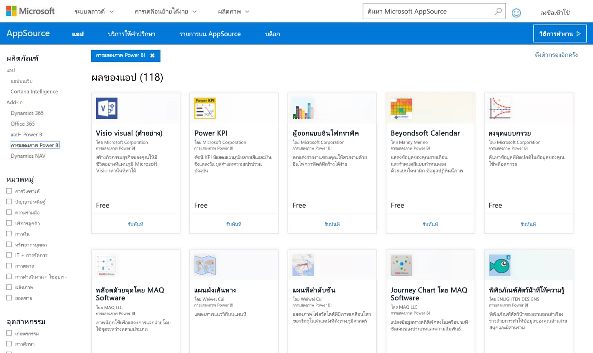
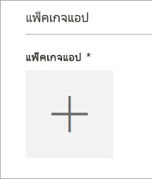
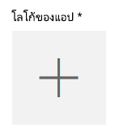
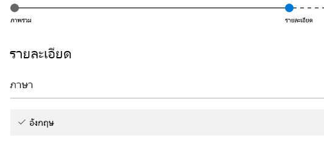

# เผยแพร่วิชวลแบบกำหนดเองลงใน AppSource
เรียนรู้วิธีที่คุณสามารถเผยแพร่วิชวลแบบกำหนดเองของคุณไปยัง AppSource ให้บุคคลอื่นค้นหาและใช้งาน office

เมื่อคุณสร้างวิชวลแบบกำหนดเองของคุณเสร็จ คุณอาจต้องการเผยแพร่ลงใน AppSource ให้บุคคลอื่นสามารถค้นหา และใช้งาน มีบางอย่างที่จะต้องเตรียม ก่อนที่คุณจะทำอย่างนั้นได้ สำหรับข้อมูลเพิ่มเติมสำหรับวิธีสร้างวิชวลแบบกำหนดเอง ดู[ใช้เครื่องมือสำหรับนักพัฒนา มาสร้างวิชวลแบบกำหนดเอง](../service-custom-visuals-getting-started-with-developer-tools.md)

AppSource คืออะไร พูดง่าย ๆ คือ เป็นที่ที่จะค้นหาแอป SaaS และ add-in สำหรับผลิตภัณฑ์และบริการ Microsoft ของคุณ [AppSource](https://appsource.microsoft.com/marketplace/apps?product=power-bi-visuals) เชื่อมต่อผู้ใช้ Office 365, Dynamics 365, Cortana Intelligence ฯลฯ นับล้านคน ไปยังโซลูชันที่ช่วยให้พวกเขาทำงานสำเร็จ ได้อย่างมีประสิทธิภาพขึ้น เข้าใจได้ลึกซึ้งขึ้น หรือสวยงามขึ้นกว่าที่เคย

## การเตรียมเพื่อส่งวิชวลแบบกำหนดเองของคุณ
คุณเขียนโค้ดและทดสอบวิชวลแบบกำหนดเองของคุณเสร็จแล้ว และบรรจุลงในไฟล์ pbiviz คุณจะต้องเครียมสิ่งต่อไปนี้ให้พร้อมสำหรับส่งวิชวลของคุณ

| รายการ | จำเป็นต้องมี | คำอธิบาย |
| --- | --- | --- |
| แพคเกจ pbiviz ที่มี เมตาดาต้า ที่จำเป็นทั้งหมด |ใช่ |ชื่อของวิชวล ชื่อที่แสดง GUID เวอร์ชัน คำอธิบาย ชื่อผู้เขียนและอีเมล |
| ตัวอย่างไฟล์รายงาน .pbix |ใช่ |เพื่อใช้แสดงผลงานวิชวลของคุณ คุณควรช่วยให้ผู้ใช้สามารถทำความคุ้นเคยการใช้งานวิชวล คุณควรเน้นสิ่งที่วิชวลเพิ่มคุณค่าให้กับผู้ใช้ และให้ตัวอย่างของการใช้งาน ตัวเลือกจัดรูปแบบ ฯลฯ คุณยังสามารถเพิ่มหน้า *"คำแนะนำ"* ตอนท้ายที่ให้เคล็ดลับ เทคนิคการใช้ สิ่งที่ต้องหลีกเลี่ยง เป็นต้น ไฟล์รายงาน .pbix ตัวอย่างจะต้องทำงานแบบออฟไลน์ โดยไม่ต้องเชื่อมต่อใด ๆ กับภายนอก |
| ไอคอน |ใช่ |คุณควรใส่โลโก้ของวิชวลแบบกำหนดเองที่จะปรากฏในหน้าร้านค้า รูปแบบสามารถเป็น .png, .jpg, .jpeg หรือ .gif ต้องมีขนาด 300px (ความกว้าง) x 300px (ความสูง) เท่านั้น **สิ่งสำคัญ** โปรดดู[คำแนะนำสั้น ๆ](https://docs.microsoft.com/en-us/office/dev/store/craft-effective-appsource-store-images) อย่างระมัดระวังก่อนที่จะส่งไอคอน |
| ภาพหน้าจอ |ใช่ |คุณต้องมีภาพหน้าจอให้อย่างน้อยหนึ่งภาพ รูปแบบสามารถเป็น .png, .jpg, .jpeg หรือ .gif ต้องมีขนาด 1366px (ความกว้าง) x 768px (ความสูง) เท่านั้น ขนาดไฟล์ต้องไม่เกิน 1024kb *เพื่อดึงดูดให้มีคนใช้มากขึ้น เพิ่มข้อความอธิบายลงในภาพหน้าจอเพื่อแสดงความสามารถ และประโยชน์ที่มีให้กับผู้ใช้* |
| ลิงก์ดาวน์โหลดสนับสนุน |ใช่ |ให้ URL สำหรับให้การสนับสนุนลูกค้าที่มีปัญหากับวิชวลของคุณ รูปแบบของ URL ของคุณควรมี http:// หรือ https:// |
| ลิงก์ไปยังเอกสารความเป็นส่วนตัว |ใช่ |ให้ลิงก์ไปยังนโยบายความเป็นส่วนตัว สำหรับลูกค้าที่ใช้วิชวลของคุณ รูปแบบของลิงค์ของคุณควรมี http:// หรือ https:// |
| ข้อตกลงสิทธิการใช้งานสำหรับผู้ใช้ (EULA) |ใช่ |คุณต้องอัปโหลดไฟล์ EULA ซึ่งอาจเป็น EULA ของคุณเอง หรือใช้ EULA ค่าเริ่มต้นภายใน Office store สำหรับวิชวลแบบกำหนดเองของ Power BI เมื่อต้องการใช้ EULA ค่าเริ่มต้น วาง URL ต่อไปนี้ในกล่องโต้ตอบการอัปโหลดไฟล์ "ข้อตกลงสิทธิ์การใช้งานสำหรับผู้ใช้" ของแดชบอร์ดผู้ขาย: [ https://visuals.azureedge.net/app-store/PowerBI - Default Custom Visual EULA.pdf](https://visuals.azureedge.net/app-store/Power BI - Default Custom Visual EULA.pdf) |
| ลิงก์วิดีโอ |ไม่ใช่ |เพื่อเพิ่มความน่าสนใจของวิชวลแบบกำหนดเองของคุณ เราแนะนำให้มีลิงก์ไปยังวิดีโอเกี่ยวกับวิชวลของคุณ รูปแบบของ URL ของคุณควรมี http:// หรือ https:// |
| ที่จัดเก็บ GitHub |ไม่ใช่ |จะเป็นการดีมากถ้าคุณมีลิงก์ไปยังที่เก็บ [GitHub](https://www.github.com) สาธารณะที่มีโค้ดต้นฉบับของวิชวลและตัวอย่างข้อมูล เพื่อให้นักพัฒนาอื่น ๆ แนะนำติชม และเสนอการปรับปรุงโค้ดให้กับคุณ |

## การส่งไปยัง Power BI
การส่งจะเริ่มต้น ด้วยการส่งอีเมลไปยังทีมที่ดูแลการส่งวิชวลแบบกำหนดเองของ Power BI คุณสามารถส่งอีเมลไปที่ [ pbivizsubmit@microsoft.com](mailto:pbivizsubmit@microsoft.com)

> [!IMPORTANT]
> คุณต้องกรอกข้อมูลต่อไปนี้ในไฟล์ pbiviz.json: "description", "supportUrl", "author", "name" และ "email" ก่อนที่คุณจะสร้างแพคเกจ .pbiviz
> 

แนบไฟล์ .pbiviz และไฟล์ตัวอย่างรายงาน .pbix ในอีเมลของคุณ ทีม Power BI จะตอบกลับพร้อมคำชี้แนะ และไฟล์ XML ของแพคเกจแอปเพื่อการอัปโหลด ไฟล์ XML ของแพคเกจแอป นี้จำเป็นตอนส่งวิชวลของคุณผ่านทาง ศูนย์นักพัฒนา Office

> [!NOTE]
> เพื่อคุณภาพที่ดีขึ้น และมั่นใจว่ารายงานที่มีอยู่ก่อนแล้วจะไม่มีปัญหา การปรับปรุงวิชวลที่มีเดิม จะใช้เวลาเพิ่มอีกสองสัปดาห์ถึงไปยังสภาพแวดล้อมการทำงานจริง หลังจากผ่านการอนุมัติจากร้านค้า
> 
> 

## การส่งไป AppSource
เมื่อคุณได้รับไฟล์ XML ของแพคเกจแอปจากทีม Power BI ไปที่[ศูนย์นักพัฒนา](https://sellerdashboard.microsoft.com/Application/Summary) เพื่อส่งวิชวลของคุณไป AppSource

> [!NOTE]
> คุณต้องมีบัญชีนักพัฒนา Office ที่ถูกต้องเพื่อเข้าสู่ระบบ[ศูนย์นักพัฒนา Office](https://dev.office.com/) บัญชีผู้ใช้สำหรับนักพัฒนา Office ต้องเป็นบัญชี Microsoft (Live ID เช่น hotmail.com หรือ outlook.com)
> 
> [!IMPORTANT]
> คุณต้องส่งอีเมลที่ มีไฟล์ .pbiviz และไฟล์ .pbix ไปยังทีม Power BI ก่อนที่จะส่งไปที่ AppSource ซึ่งทีม Power BI อัปโหลดไฟล์ดังกล่าวไปยังเซิร์ฟเวอร์ที่แชร์กับสาธารณะ มิฉะนั้นร้านค้าจะไม่สามารถดึงไฟล์นั้นได้ คุณต้องส่งไฟล์ทุกครั้ง ไม่ว่าจะเป็นการส่งวิชวลใหม่ ปรับปรุงวิชวลที่มีอยู่ และการแก้ไขปัญหาการส่งที่ถูกปฏิเสธ
> 
> 

### กระบวนการส่งวิชวล
ทำตามขั้นตอนด้านล่างเพื่อทำให้การส่งเสร็จสมบูรณ์

1. เลือก**เพิ่มแอปใหม่**
   
    
2. เลือก**วิชวลแบบกำหนดเองของ Power BI** แล้วเลือก**ถัดไป**
3. เลือก **+** ข้างใต้**แพคเกจแอป** และเลือกไฟล์ XML ของแพคเกจแอป ที่คุณได้รับจากทีม Power BI ในกล่องโต้ตอบเพื่อเปิดไฟล์
   
    
4. คุณควรได้รับการอนุมัติว่า นี่คือแพคเกจแอป Power BI ที่ถูกต้อง
   
    
5. กรอกรายละเอียดใน**ข้อมูลทั่วไป**
   
   * *ชื่อที่ส่ง:* คุณจะใช้ชื่อแอปของคุณว่าอะไรในศูนย์นักพัฒนา
   * *เวอร์ชัน:* หมายเลขเวอร์ชันของคุณ จะถูกใส่ให้โดยอัตโนมัติจาก add-in ในแพคเกจแอปของคุณ
   * *วันที่เผยแพร่ (UTC):* เลือกวันที่ที่แอปของคุณจะเผยแพร่ในร้านค้า ถ้าคุณเลือกวันที่ในอนาคต แอปของคุณจะยังไม่ให้บริการในร้านค้าจนกว่าจะถึงวันที่ระบุ
   * *ประเภท:* จะมีการใส่ค่าประเภท "Data Visualization + BI" ให้โดยอัตโนมัติ นั้นเป็นวิธีการแท็กวิชวลแบบกำหนดเองของ Power BI คุณสามารถใส่ประเภทได้เพิ่มเติมได้อีก 2 ประเภท เพื่อช่วยให้ผู้ใช้ค้นหาวิชวลของคุณได้ง่ายขึ้น
   * *หมายเหตุสำหรับผู้ทดสอบ:* ไม่บังคับ ถ้าคุณส่งขั้นตอนบางอย่างสำหรับนักทดสอบที่ Microsoft
   * *แอปของฉันเรียกใช้ สนับสนุน ประกอบด้วย หรือใช้การเข้ารหัสหรือการเข้ารหัสลับ:* ปล่อยไว้ไม่ต้องเลือก
   * *ทำให้ add-in นี้อยู่ในแค็ตตาล็อก add-in ของ Office บน iPad:* ปล่อยไว้ไม่ต้องเลือก
6. อัปโหลดโลโก้ของวิชวลคุณ โดยการเลือกที่ **+** ภายใต้**โลโก้แอป** จากนั้น เลือกแฟ้มไอคอนในกล่องโต้ตอบการเปิดไฟล์ ไฟล์ต้องเป็นชนิด .png, .jpg, .jpeg หรือ .gif จะต้องมีขนาด 300px (ความกว้าง) x 300px (ความสูง) เท่านั้น และมีขนาดไฟล์ไม่เกิน 512 kb
   
    
7. กรอกรายละเอียดใน**เอกสารสนับสนุน**
   
   * ลิงก์ไปยังเอกสารสนับสนุน
   * ลิงก์ไปยังเอกสารความเป็นส่วนตัว
   * ลิงก์วิดีโอ
   * ข้อตกลงสิทธิการใช้งานสำหรับผู้ใช้ (EULA)
     
       คุณต้องอัปโหลดไฟล์ EULA ซึ่งอาจเป็น EULA ของคุณเอง หรือใช้ EULA ค่าเริ่มต้นภายใน Office store สำหรับวิชวลแบบกำหนดเองของ Power BI เมื่อต้องการใช้ EULA ค่าเริ่มต้น วาง URL ต่อไปนี้ในกล่องโต้ตอบการอัปโหลดไฟล์ "ข้อตกลงสิทธิ์การใช้งานสำหรับผู้ใช้" ของแดชบอร์ดผู้ขาย: [ https://visuals.azureedge.net/app-store/PowerBI - Default Custom Visual EULA.pdf](https://visuals.azureedge.net/app-store/Power BI - Default Custom Visual EULA.pdf)
8. เลือก**ถัดไป** เพื่อไปต่อยังหน้า**รายละเอียด**
9. เลือก**ภาษา** แล้วเลือกภาษาจากรายการ
   
    
10. กรอกรายละเอียด "คำอธิบาย"
    
    * *ชื่อแอป (สำหรับภาษานี้):* ใส่ชื่อของแอปคุณ ที่จะปรากฏในหน้าร้าน
    * *คำอธิบายที่แบบสั้น:* ใส่คำอธิบายสั้น ๆ ของแอป สูงสุด 100 ตัวอักษร ที่จะปรากฏในหน้าร้าน คำอธิบายนี้จะแสดงขึ้นในหน้าระดับบนสุดพร้อมกับโลโก้ คุณสามารถใช้คำอธิบายจากแพคเกจ pbiviz ได้
    * *คำอธิบายแบบยาว:* ใส่คำอธิบายที่ละเอียดขึ้นของแอปคุณ ที่ลูกค้าจะเห็นบนหน้ารายละเอียดแอปของคุณ ถ้าคุณต้องการอนุญาตให้ชุมชนปรับปรุงวิชวลของคุณ โดยเปิดให้เป็นโอเพนซอร์ส ใส่ลิงก์ไปที่เก็บโค้ดสาธารณะเช่น GitHub ตรงนี้
11. อัปโหลดภาพหน้าจออย่างน้อยหนึ่งภาพ รูปแบบสามารถเป็น .png, .jpg, .jpeg หรือ .gif ต้องมีขนาด 1366px (ความกว้าง) x 768px (ความสูง) เท่านั้น ขนาดไฟล์ต้องไม่เกิน 1024kb *เพื่อดึงดูดให้มีคนใช้มากขึ้น เพิ่มข้อความอธิบายลงในภาพหน้าจอเพื่อแสดงความสามารถ และประโยชน์ที่มีให้กับผู้ใช้*
12. ถ้าคุณต้องการเพิ่มภาษา เลือก**เพิ่มภาษา**และทำซ้ำขั้นตอนที่ 10 และ 11 การเพิ่มภาษาจะช่วยให้ผู้ใช้ของคุณ เห็นรายละเอียดวิชวลแบบกำหนดเองในภาษาของพวกเขา ส่วนภาษาที่จะไม่อยู่ในรายการ จะใช้ภาษาแรกที่เลือก
13. เมื่อคุณเพิ่มภาษาเสร็จแล้ว เลือก**ถัดไป** ไปต่อยังหน้า**บล็อกการเข้าถึง**
14. ถ้าคุณต้องการป้องกันไม่ให้ลูกค้าในบางประเทศหรือบางภูมิภาคใช้ หรือซื้อแอปของคุณ กาเครื่องหมาย และเลือกจากรายการ
15. เลือก**ถัดไป** เพื่อไปต่อยังหน้า**การกำหนดราคา**
16. ในปัจจุบัน เราสนับสนุนเฉพาะวิชวลที่*ฟรี*เท่านั้น ยังไม่อนุญาตให้มีการซื้อเพิ่มภายในวิชวล (การซื้อเพิ่มเติมในแอป) เลือก**แอปนี้ให้ฟรี** 
    
    > [!NOTE]
    > ถ้าคุณเลือก ตัวเลือกอื่น ๆ นอกจากฟรี หรือมีการซื้อเพิ่มเติมในวิชวลที่ส่ง การส่งจะถูกปฏิเสธ
    > 
    > 
17. ตอนนี้คุณสามารถเลือก**บันทึกเป็นแบบร่าง** และส่งในภายหลัง หรือเลือก**ส่งเพื่อขอการอนุมัติ** เพื่อส่งวิชวลแบบกำหนดเองไปยัง Office store ได้

## การติดตามสถานะการส่งและการใช้งาน
คุณสามารถตรวจดู[นโยบายการตรวจสอบ](https://dev.office.com/officestore/docs/validation-policies#13-power-bi-custom-visuals)ได้

หลังจากส่งแล้ว คุณจะสามารถดูสถานะการส่งได้ใน[แดชบอร์ดแอป](https://sellerdashboard.microsoft.com/Application/Summary/)

## การรับรองวิชวลของคุณ
เมื่อคุณได้สร้างวิชวลของคุณแล้ว คุณสามารถเลือกที่จะนำวิชวลของคุณไปขอการรับรองได้ ซึ่งหมายความว่า มันสามารถเรียกใช้ภายในบริการของ Power BI และสามารถใช้งานคุณลักษณะอื่น ๆ เช่นส่งวิชวลออกไปยัง PowerPoint เป็นต้น สำหรับข้อมูลเพิ่มเติม ดู[การนำวิชวลแบบกำหนดเอง*เข้ารับการรับรอง*](../power-bi-custom-visuals-certified.md)

## ขั้นตอนถัดไป
[ใช้เครื่องมือสำหรับนักพัฒนา มาสร้างวิชวลแบบกำหนดเอง](../service-custom-visuals-getting-started-with-developer-tools.md)  
[การแสดงข้อมูลใน Power BI](../power-bi-report-visualizations.md)  
[การแสดงข้อมูลแบบกำหนดเองใน Power BI](../power-bi-custom-visuals.md)  
[การนำวิชวลแบบกำหนดเอง*เข้ารับการรับรอง*](../power-bi-custom-visuals-certified.md)

ถ้าคุณมีคำถามเพิ่มเติม [ลองถามชุมชน Power BI](http://community.powerbi.com/)

