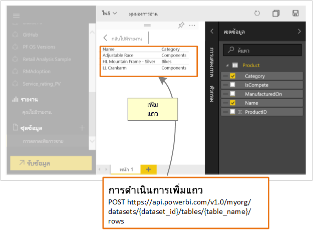

# นักพัฒนาสามารถใช้ Power BI API ทำอะไรได้บ้าง

Power BI แสดงแดชบอร์ดที่สามารถโต้ตอบกับผู้ใช้ และสามารถสร้างและปรับปรุงข้อมูลจากแหล่งข้อมูลที่หลากหลายในเวลาจริง เมื่อใช้ภาษาโปรแกรมใด ๆ ที่สนับสนุนการเรียก REST คุณสามารถสร้างแอปที่ทำงานร่วมกับแดชบอร์ด Power BI แบบเรียลไทม์ คุณยังสามารถรวมไทล์และรายงาน Power BI เข้าไปในแอป

นักพัฒนายังสามารถสร้างการแสดงภาพจากข้อมูลของพวกเขาเอง ที่สามารถใช้ในรายงานและแดชบอร์ดที่โต้ตอบกับผู้ใช้ได้

ต่อไปนี้เป็นตัวอย่าง สิ่งที่คุณสามารถทำได้ด้วย Power BI API

| **เมื่อต้องการทำสิ่งต่อไปนี้** | **ให้ไปที่** |
| --- | --- |
| ฝังแดชบอร์ด รายงาน และไทล์ สำหรับผู้ใช้ Power BI และผู้ที่ไม่ใช้ Power BI (ข้อมูลที่แอปเป็นเจ้าของ) |[วิธีฝังแดชบอร์ด รายงานและไทล์ Power BI ของคุณ](embedding-content.md) |
| ขยายเวิร์กโฟลว์ทางธุรกิจที่มีอยู่แล้ว โดยการพุชข้อมูลสำคัญลงในแดชบอร์ด Power BI |[การพุชข้อมูลลงในแดชบอร์ด](walkthrough-push-data.md) |
| การรับรองความถูกต้องกับ Power BI |[การรับรองความถูกต้องกับ Power BI](get-azuread-access-token.md) |
| สร้างวิชวลแบบกำหนดเอง |[พัฒนาภาพแบบกำหนดเองของ Power BI](custom-visual-develop-tutorial.md) |

> [!NOTE]
> Power BI API ยังคงอ้างอิงถึงพื้นที่ทำงานของแอปเป็นกลุ่ม การอ้างอิงใดๆ ถึงกลุ่มจะหมายความว่า คุณกำลังทำงานอยู่กับพื้นที่ทำงานของแอป

## ตัวอย่างสำหรับนักพัฒนา Power BI

ตัวอย่างสำหรับนักพัฒนา Power BI มีไฟล์ที่เอาไว้ใช้ฝังแดชบอร์ด รายงาน และไทล์

[ตัวอย่างสำหรับนักพัฒนา Power BI](https://github.com/Microsoft/PowerBI-Developer-Samples)

* ตัวอย่างภายใน **App Owns Data** สำหรับใช้ฝังกรณี ผู้ที่ไม่ได้ใช้ Power BI
* ตัวอย่างภายใน **User Owns Data** สำหรับใช้ฝังกรณี ผู้ใช้ Power BI

## ที่เก็บ GitHub

* [.NET SDK](https://github.com/Microsoft/PowerBI-CSharp)
* [JavaScript API](https://github.com/Microsoft/PowerBI-JavaScript)
* [วิชวลแบบกำหนดเอง](https://github.com/Microsoft/PowerBI-visuals)

## เครื่องมือสำหรับนักพัฒนา

ต่อไปนี้คือ เครื่องมือที่คุณสามารถใช้เพื่อช่วยการพัฒนาสิ่งต่าง ๆ สำหรับ Power BI

คุณสามารถเข้าถึง[เครื่องมือตั้งค่าการฝังตัว](https://aka.ms/embedsetup) เพื่อเริ่มต้นใช้งานได้อย่างรวดเร็ว และดาวน์โหลดแอปพลิเคชันตัวอย่างสำหรับวิธีการฝังเนื้อหา Power BI ได้

เลือกโซลูชันที่เหมาะกับคุณ:

* [การฝังตัวสำหรับลูกค้าของคุณ](embedding.md#embedding-for-your-customers) จะมอบความสามารถในการฝังแดชบอร์ดและรายงานสำหรับผู้ใช้ที่ไม่มีบัญชี Power BI เรียกใช้โซลูชัน[การฝังตัวสำหรับลูกค้าของคุณ](https://aka.ms/embedsetup/AppOwnsData)

* [การฝังตัวสำหรับองค์กรของคุณ](embedding.md#embedding-for-your-organization) ให้คุณสามารถขยายบริการของ Power BI เรียกใช้โซลูชัน[การฝังตัวสำหรับองค์กรของคุณ](https://aka.ms/embedsetup/UserOwnsData)

สำหรับตัวอย่างแบบเต็มของการใช้ JavaScript API คุณสามารถใช้[เครื่องมือ Playground](https://microsoft.github.io/PowerBI-JavaScript/demo) ได้ เครื่องมือนี้คือวิธีที่รวดเร็วเพื่อลองเล่นกับตัวอย่าง Power BI Embedded ชนิดต่าง ๆ กัน คุณยังสามารถรับข้อมูลเพิ่มเติมเกี่ยวกับ JavaScript API โดยไปที่หน้า [PowerBI-JavaScript wiki](https://github.com/Microsoft/powerbi-javascript/wiki) ได้

## ส่งข้อมูลไปยัง Power BI

คุณสามารถใช้ API Power BI เพื่อส่งข้อมูลไปยังชุดข้อมูล คุณลักษณะนี้ทำให้คุณสามารถเพิ่มแถวลงในตารางภายในชุดข้อมูลได้ จากนั้น ข้อมูลใหม่จะสามารถสะท้อนผลในไทล์บนแดชบอร์ด และในวิชวลภายในรายงานของคุณ

## ขั้นตอนถัดไป

[การพุชข้อมูลลงในชุดข้อมูล](walkthrough-push-data.md)  
[พัฒนาภาพแบบกำหนดเองของ Power BI](custom-visual-develop-tutorial.md)  
[การอ้างอิง Power BI REST API](https://docs.microsoft.com/rest/api/power-bi/)  

มีคำถามเพิ่มเติมหรือไม่? [ลองถามชุมชน Power BI](http://community.powerbi.com/)
