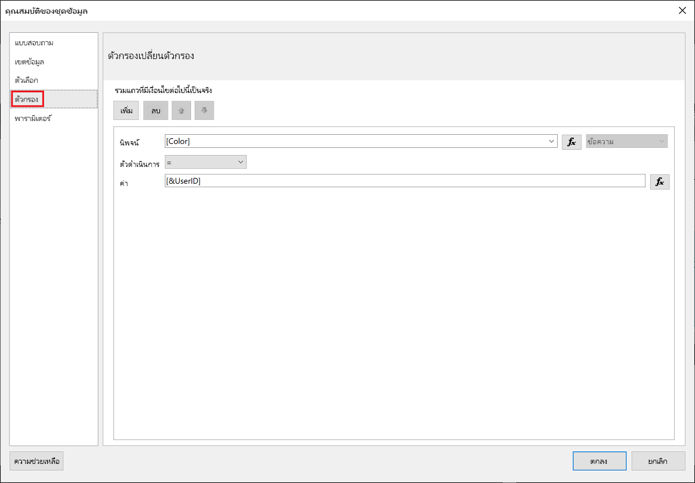
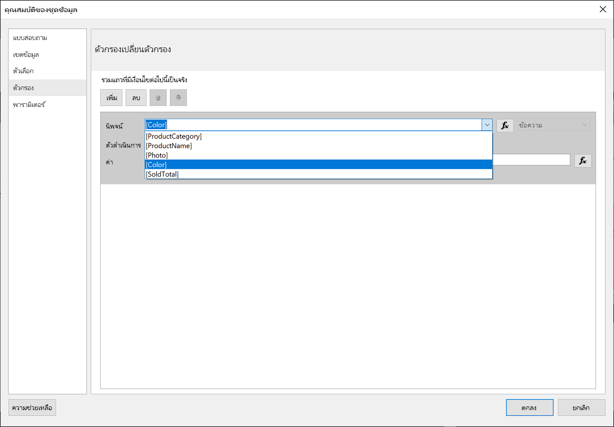
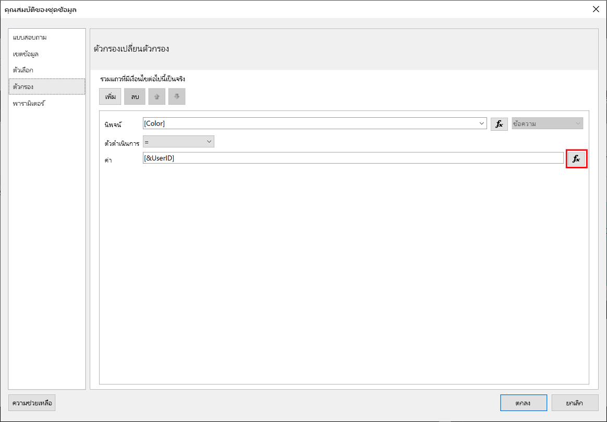
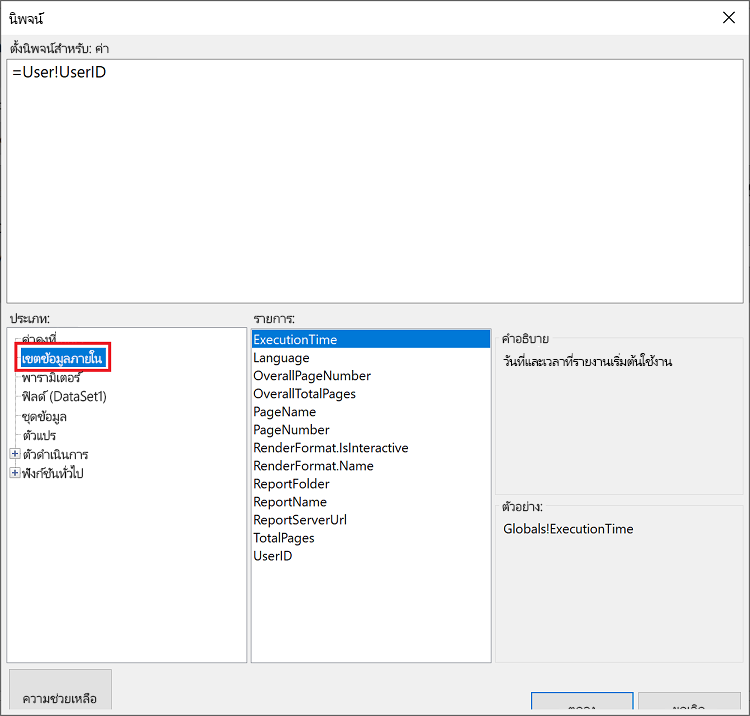
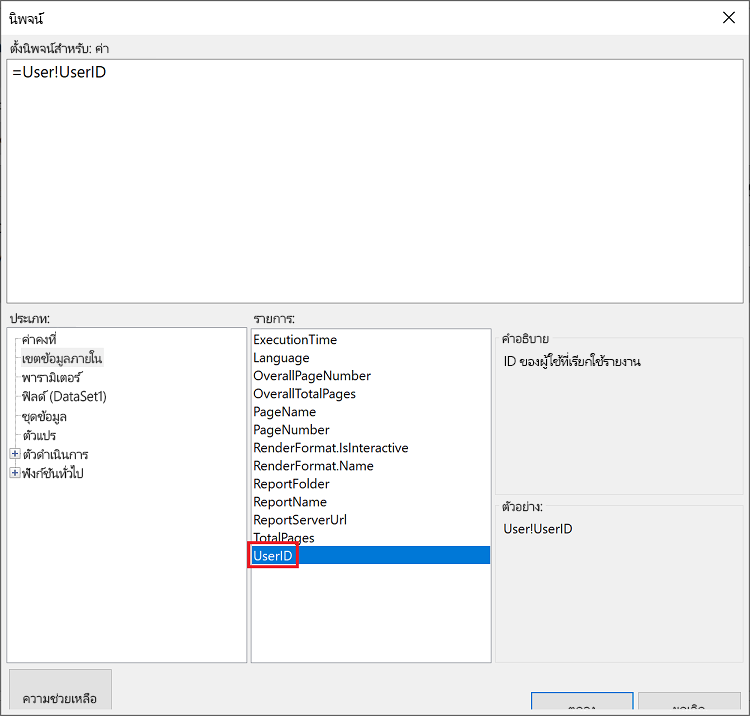
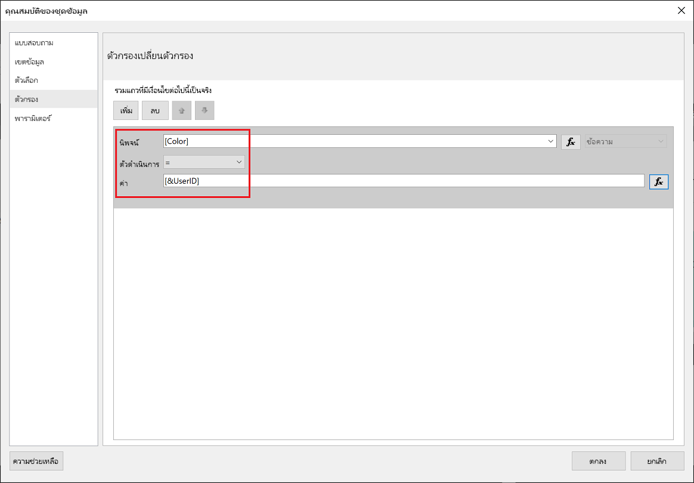
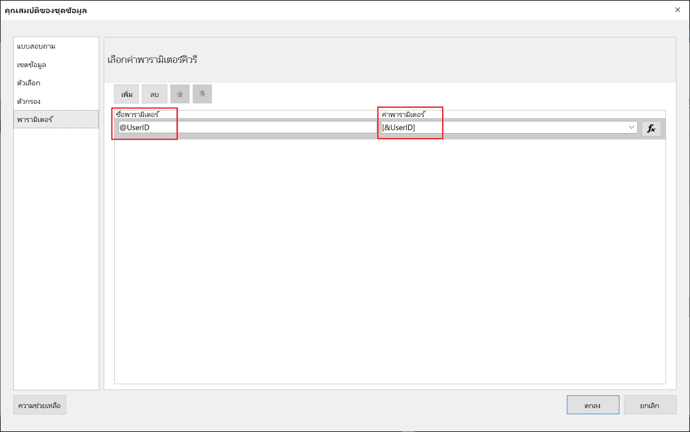
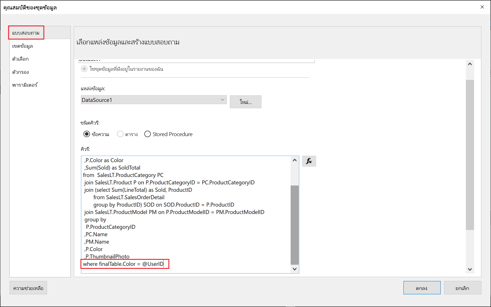

# <a name="implementing-row-level-security-in-embedded-paginated-reports-preview"></a>การใช้การรักษาความปลอดภัยระดับแถวในรายงานที่มีการแบ่งหน้าแบบฝัง (ตัวอย่าง)

เมื่อคุณฝังรายงานที่มีการแบ่งหน้า คุณสามารถควบคุมว่าจะแสดงข้อมูลใด ซึ่งช่วยปรับแต่งข้อมูลที่แสดงให้เหมาะสมสำหรับผู้ใช้แต่ละราย ตัวอย่างเช่น ถ้าคุณมีรายงานที่มีการแบ่งหน้าของ Power BI ที่มีผลการขายทั่วโลก คุณสามารถฝังข้อมูลดังกล่าวเพื่อให้แสดงเฉพาะผลการขายจากบางภูมิภาคเท่านั้นได้

คุณลักษณะนี้เป็นวิธีที่ปลอดภัยในการแสดงข้อมูลชุดย่อยในลักษณะที่ไม่ทำให้ข้อมูลที่เหลือด้อยลง คล้ายกับคุณลักษณะ [การรักษาความปลอดภัยระดับแถว (RLS)](embedded-row-level-security.md) ซึ่งเป็นวิธีที่ปลอดภัยในการแสดงข้อมูลในรายงาน Power BI (ที่ไม่ได้แบ่งหน้า) แดชบอร์ด ไทล์ และชุดข้อมูล  

> [!Note]
> คุณลักษณะนี้ทำงานร่วมกับการฝังรายงานที่มีการแบ่งหน้าสำหรับลูกค้า

## <a name="configuring-a-parameter-to-filter-the-dataset"></a>กำหนดค่าพารามิเตอร์เพื่อกรองชุดข้อมูล

เมื่อใช้การรักษาความปลอดภัยระดับแถวกับรายงานที่มีการแบ่งหน้าของ Power BI คุณจำเป็นต้องกำหนดแอตทริบิวต์ [พารามิเตอร์](../report-builder-parameters.md) เป็น **UserID** พารามิเตอร์นี้จะจำกัดข้อมูลที่ดึงมาจากชุดข้อมูล ก่อนทำการฝังรายงาน

หลังจากกำหนดพารามิเตอร์เป็น **UserID** แล้ว ให้ใช้ API [Reports GenerateTokenForCreateInGroup](https://docs.microsoft.com/rest/api/power-bi/embedtoken/reports_generatetokenforcreateingroup) เพื่อรับโทเค็นแบบฝัง

## <a name="use-userid-as-a-filter-at-report-or-query-level"></a>ใช้ UserID เป็นตัวกรองที่ระดับรายงานหรือคิวรี

คุณสามารถใช้ **UserId** เป็น *ตัวกรอง* หรือใน *คิวรี* กับแหล่งข้อมูลใน [ตัวช่วยสร้างรายงานที่มีการแบ่งหน้าของ Power BI](../report-builder-power-bi.md)

### <a name="using-the-filter"></a>ใช้ตัวกรอง

1. ในหน้าต่าง **คุณสมบัติของชุดข้อมูล** จากบานหน้าต่างด้านซ้าย ให้เลือก **ตัวกรอง**

    

2. จากเมนูดรอปดาวน์ **นิพจน์** ให้เลือกพารามิเตอร์ที่คุณต้องการใช้สำหรับการกรองข้อมูล

     

3. คลิกปุ่มฟังก์ชัน **ค่า** 

    

4. ในหน้าต่าง **นิพจน์** จากรายการ **หมวดหมู่** ให้เลือก **เขตข้อมูลที่มีอยู่แล้วภายใน**

    

5. จากรายการ **หน่วยข้อมูล** ให้เลือก **UserID** และคลิก **ตกลง**

    

6. ในหน้าต่าง **คุณสมบัติชุดข้อมูล** ให้ตรวจสอบว่านิพจน์คือ *พารามิเตอร์ที่คุณเลือก = UserID* และคลิก **ตกลง**

    

### <a name="using-a-query"></a>การใช้คิวรี

1. ในหน้าต่าง **คุณสมบัติของชุดข้อมูล** จากบานหน้าต่างด้านซ้าย ให้เลือก **พารามิเตอร์** และคลิก **เพิ่ม**

    

2. ใน **ชื่อพารามิเตอร์** ให้ป้อน **\@UserID** และใน**ค่าพารามิเตอร์** ให้เพิ่ม **[&UserID]**

     

3. จากบานหน้าต่างด้านซ้าย ให้เลือก **คิวรี** ในคิวรี ให้เพิ่มพารามิเตอร์ **UserID** เป็นส่วนหนึ่งของคิวรีของคุณ และคลิก **ตกลง**
    > [!NOTE]
    > ในภาพหน้าจอด้านล่างเป็นการแสดงตัวอย่าง การใช้งานพารามิเตอร์สี (whereFinalTable.Color = @UserID) ถ้าจำเป็น คุณสามารถสร้างคิวรีที่ซับซ้อนมากขึ้นได้

    

## <a name="passing-the-configured-parameter-using-the-embed-token"></a>การส่งผ่านพารามิเตอร์ที่กำหนดค่าโดยใช้โทเค็นแบบฝังตัว

เมื่อทำการฝังรายงานที่มีการแบ่งหน้าสำหรับลูกค้าของคุณ จะมีการใช้ API [Reports GenerateTokenForCreateInGroup](https://docs.microsoft.com/rest/api/power-bi/embedtoken/reports_generatetokenforcreateingroup) เพื่อรับโทเค็นแบบฝังตัว โทเค็นนี้ยังสามารถใช้เพื่อกรองข้อมูลบางส่วนที่ถูกดึงออกจากรายงานที่มีการแบ่งหน้าได้อีกด้วย

หากต้องการเปิดเผยข้อมูลเพียงบางส่วน ให้กำหนดเขตข้อมูล `username` ด้วยข้อมูลที่คุณต้องการให้แสดง ตัวอย่างเช่น ในรายงานที่มีการแบ่งหน้าซึ่งมีพารามิเตอร์สี ถ้าคุณป้อน *สีเขียว* ในเขตข้อมูล `username` โทเค็นแบบฝังตัวจะจำกัดข้อมูลที่ถูกฝังเพื่อแสดงเฉพาะข้อมูลที่มีค่า *สีเขียว* ในคอลัมน์สี

```JSON
{
    "accessLevel": "View",
    "reportId": "cfafbeb1-8037-4d0c-896e-a46fb27ff229",
    "identities": [
            {
                    // Replace the 'username' with a paginated report parameter
                    "username":     "...",
                    "reports: [
                        "cfafbeb1-8037-4d0c-896e-a46fb27ff229"
                    ]
            }
    ]
}
```
