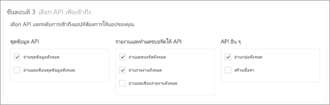
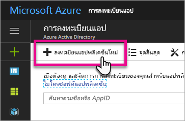
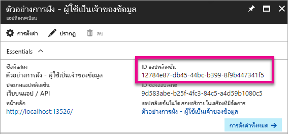
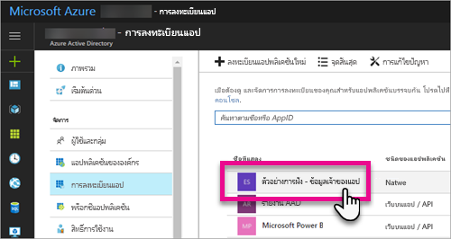
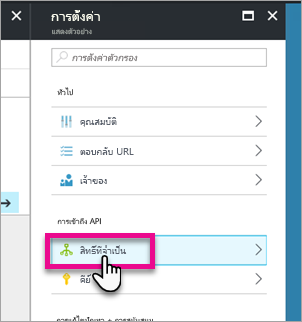
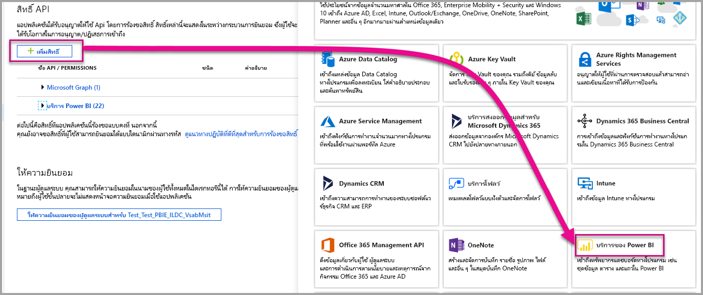
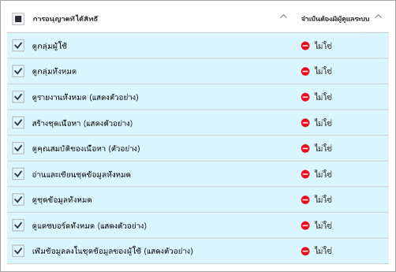
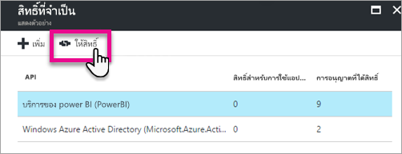

# <a name="register-an-azure-ad-app-to-embed-power-bi-content"></a>ลงทะเบียนแอป Azure AD เพื่อฝังเนื้อหา Power BI
เรียนรู้วิธีการลงทะเบียนแอปพลิเคชันภายใน Azure Active Directory (Azure AD) สำหรับการใช้งานด้วยการฝังเนื้อหา Power BI

คุณลงทะเบียนแอปพลิเคชันของคุณกับ Azure AD เพื่ออนุญาตให้แอปพลิเคชันของคุณเข้าถึง Power BI REST API ซึ่งจะช่วยให้คุณสร้างข้อมูลประจำตัวสำหรับแอปพลิเคชันของคุณ และระบุสิทธิ์ไปยังแหล่งข้อมูล Power BI REST

> [!IMPORTANT]
> ก่อนที่คุณลงทะเบียนแอป Power BI คุณต้องการ[ผู้เช่า Azure Active Directory และผู้ใช้ขององค์กร](create-an-azure-active-directory-tenant.md) ถ้าคุณยังไม่ได้ลงทะเบียนสำหรับ Power BI ด้วยผู้ใช้ในผู้เช่าของคุณ การลงทะเบียนแอปจะไม่เสร็จสมบูรณ์
> 
> 

มีสองวิธีในการลงทะเบียนแอปพลิเคชันของคุณ วิธีแรกคือด้วย [Power BI App Registration Tool](https://dev.powerbi.com/apps/) หรือคุณสามารถทำได้โดยตรงภายในพอร์ทัล Azure Power BI App Registration Tool เป็นตัวเลือกที่ง่ายที่สุดเนื่องจากมีเขตข้อมูลเพื่อที่ต้องกรอกน้อย ถ้าคุณต้องการทำการเปลี่ยนแปลงไปยังแอปของคุณ ให้ใช้พอร์ทัล Azure

## <a name="register-with-the-power-bi-app-registration-tool"></a>ลงทะเบียนด้วย Power BI App Registration Tool
คุณจำเป็นต้องลงทะเบียนแอปพลิเคชันของคุณใน **Azure Active Directory** เพื่อสร้างข้อมูลประจำตัวสำหรับแอปพลิเคชันของคุณ และระบุสิทธิ์ไปยังแหล่งข้อมูล Power BI REST เมื่อคุณลงทะเบียนแอปพลิเคชัน เช่น แอปคอนโซลหรือเว็บไซต์ คุณจะได้รับตัวระบุที่ถูกใช้โดยแอปพลิเคชันเพื่อระบุตัวเองกับผู้ใช้ว่ากำลังร้องขอสิทธิ์

นี่คือวิธีการลงทะเบียนแอปพลิเคชันของคุณด้วย Power BI App Registration Tool:

1. ไปยัง [dev.powerbi.com/apps](https://dev.powerbi.com/apps)
2. เลือก**ลงชื่อเข้าใช้ด้วยบัญชีของคุณที่มีอยู่**
3. ใส่**ชื่อแอป**
4. การเลือกชนิดแอปจะขึ้นอยู่กับชนิดของแอปพลิเคชันที่คุณกำลังใช้
   
   * ใช้**เว็บแอปฝั่งเซิร์ฟเวอร์**สำหรับเว็บแอปหรือ API เว็บ
   * ใช้**แอปแบบดั้งเดิม**สำหรับแอปที่ทำงานบนอุปกรณ์ไคลเอ็นต์ ***นอกจากนี้คุณจะเลือก**แอปแบบดั้งเดิม**ถ้าคุณกำลังฝังเนื้อหาสำหรับลูกค้าของคุณโดยไม่คำนึงว่าแอปพลิเคชันจริงคืออะไร แม้แต่แอปพลิเคชันบนเว็บ***
5. ป้อนค่าสำหรับ **URL ที่เปลี่ยนเส้นทาง**และ **URL โฮมเพจ** URL ที่ถูกต้องจะทำงาน
   
    **URL โฮมเพจ**จะพร้อมใช้งานถ้าคุณเลือก**เว็บแอปฝั่งเซิร์ฟเวอร์**สำหรับชนิดแอปพลิเคชันเท่านั้น
   
    สำหรับตัวอย่าง*การฝังสำหรับลูกค้าของคุณ*และ*เว็บแอปแดชบอร์ดรวม* URL ที่เปลี่ยนเส้นทางคือ`http://localhost:13526/redirect` สำหรับตัวอย่างรายงานและไทล์ URL ที่เปลี่ยนเส้นทางคือ`http://localhost:13526/`
6. เลือก API ที่แอปพลิเคชันนี้จะสามารถเข้าถึง สำหรับข้อมูลเพิ่มเติมเกี่ยวกับสิทธิ์การเข้าถึง Power BI ดูที่[สิทธิ์ Power BI](power-bi-permissions.md)
   
    
7. เลือก**ลงทะเบียนแอป**
   
    จากนั้นคุณจะได้ **ID ไคลเอ็นต์** ถ้าคุณเลือก**เว็บแอปฝั่งเซิร์ฟเวอร์**คุณจะได้รับการ**ข้อมูลลับไคลเอ็นต์** **ID ไคลเอ็นต์**สามารถเรียกข้อมูลได้จากพอร์ทัล Azure ในภายหลังถ้าต้องการ ถ้าคุณทำ**ความลับไคลเอ็นต์**หาย คุณจะต้องสร้างใหม่ภายในพอร์ทัล Azure

8. คุณจะต้องไปที่ Azure เพื่อเลือก **ให้สิทธิ์**
> [!Note]
    > ต้องเป็นผู้ดูแลระบบส่วนกลางในผู้เช่า Azure เพื่อดำเนินการขั้นตอนนี้ให้เสร็จ
>

* ไปที่ Azure
* ค้นหาและเลือก **การลงทะเบียนแอป**
* เลือกแอปของคุณ
* เลือก **การตั้งค่า**
* เลือก **สิทธิ์ที่จำเป็น**
* เลือก **บริการ Power BI** เพื่อตรวจสอบสิทธิ์ที่คุณเลือกจากไซต์การลงทะเบียนแอป
* เลือก **ให้สิทธิ์**


ตอนนี้คุณสามารถใช้แอปพลิเคชันที่ลงทะเบียนไว้เป็นส่วนหนึ่งของแอปพลิเคชันแบบกำหนดเองของคุณเพื่อโต้ตอบกับบริการ Power BI

> [!IMPORTANT]
> ถ้าคุณกำลังฝังเนื้อหาสำหรับลูกค้าของคุณ คุณจะต้องกำหนดค่าสิทธิ์เพิ่มเติมภายในพอร์ทัล Azure สำหรับข้อมูลเพิ่มเติม ดู[นำสิทธิ์ไปใช้กับแอปพลิเคชันของคุณ](#apply-permissions-to-your-application)
> 
> 

## <a name="register-with-the-azure-portal"></a>ลงทะเบียนกับพอร์ทัล Azure
ตัวเลือกอื่นของคุณสำหรับการลงทะเบียนแอปพลิเคชันของคุณจะทำได้โดยตรงในพอร์ทัล Azure เมื่อต้องการลงทะเบียนแอปพลิเคชันของคุณ ทำตามขั้นตอนเหล่านี้

1. ยอมรับ[เงื่อนไขของ Microsoft Power BI API](https://powerbi.microsoft.com/api-terms)
2. ลงชื่อเข้าใช้[พอร์ทัล Azure](https://portal.azure.com)
3. เลือกผู้เช่า Azure AD ของคุณ โดยการเลือกบัญชีของคุณในมุมบนขวาของหน้า
4. ในบานหน้าต่างนำทางด้านซ้าย เลือก**บริการเพิ่มเติม**เลือก**การลงทะเบียนแอป**ด้านล่าง**ความปลอดภัย + ข้อมูลประจำตัว**และเลือก**การลงทะเบียนแอปพลิเคชันใหม่**
   
    
5. ทำตามพร้อมท์และสร้างแอปพลิเคชัน์ใหม่
   
   * สำหรับแอปพลิเคชันเว็บ ให้ระบุ URL การเข้าสู่ระบบ ซึ่งก็คือ URL พื้นฐานของแอปของคุณ ที่ผู้ใช้สามารถลงชื่อเข้าใช้ เช่น http://localhost:13526
   * สำหรับแอปพลิเคชันดั้งเดิม ให้ใส่ URL ที่เปลี่ยนเส้นทางซึ่ง Azure AD ใช้เพื่อส่งกลับการตอบสนองโทเค็น ใส่ค่าที่เจาะจงสำหรับแอปพลิเคชันของคุณ เช่น http://myapplication/redirect

สำหรับข้อมูลเพิ่มเติมเกี่ยวกับวิธีการลงทะเบียนแอปพลิเคชันใน Azure Active Directory ดู[การรวมแอปพลิเคชันกับ Azure Active Directory](https://docs.microsoft.com/azure/active-directory/develop/active-directory-integrating-applications)

## <a name="how-to-get-the-client-id"></a>วิธีการขอรับ ID ไคลเอ็นต์
เมื่อคุณลงทะเบียนแอปพลิเคชัน คุณจะได้รับ **ID ไคลเอ็นต์**  **ID ไคลเอ็นต์**ถูกใช้โดยแอปพลิเคชันเพื่อระบุตัวเองกับผู้ใช้ว่ากำลังร้องขอสิทธิ์

นี่คือวิธีการขอรับ ID ไคลเอ็นต์:

1. ลงชื่อเข้าใช้[พอร์ทัล Azure](https://portal.azure.com)
2. เลือกผู้เช่า Azure AD ของคุณ โดยการเลือกบัญชีของคุณในมุมบนขวาของหน้า
3. ในบานหน้าต่างนำทางด้านซ้าย เลือก**บริการเพิ่มเติม**และเลือก**การลงทะเบียนแอป**
4. เลือกแอปพลิเคชันที่คุณต้องการเรียกใช้ ID ไคลเอ็นต์
5. คุณจะเห็น **ID แอปพลิเคชัน**ที่แสดงรายการเป็น GUID นี่คือ ID ไคลเอ็นต์สำหรับแอปพลิเคชัน
   
    

## <a name="apply-permissions-to-your-application-within-azure-ad"></a>นำสิทธิ์ไปใช้กับแอปพลิเคชันของคุณภายใน Azure AD
> [!IMPORTANT]
> ส่วนนี้นำไปใช้กับแอปพลิเคชันที่**กำลังฝังเนื้อหาสำหรับองค์กรของคุณ**เท่านั้น
> 
> 

คุณจะต้องเปิดใช้งานสิทธิ์เพิ่มเติมไปยังแอปพลิเคชันของคุณ นอกเหนือจากสิ่งที่มีให้ในหน้าการลงทะเบียนแอป คุณสามารถทำสิ่งนี้ได้ผ่านพอร์ทัล Azure AD หรือผ่านทางการเขียนโปรแกรม

คุณจะต้องถูกเข้าสู่ระบบด้วยบัญชี*หลัก*ที่ใช้สำหรับการฝัง หรือบัญชีผู้ดูแลระบบส่วนกลาง

### <a name="using-the-azure-ad-portal"></a>ใช้พอร์ทัล Azure AD
1. เรียกดู[การลงทะเบียนแอป](https://portal.azure.com/#blade/Microsoft_AAD_IAM/ApplicationsListBlade)ภายในพอร์ทัล Azure และเลือกแอปที่คุณกำลังใช้สำหรับการฝัง
   
    
2. เลือก**สิทธิ์ที่ต้องใช้**ด้านล่าง**การเข้าถึง API**
   
    
3. เลือก **Azure Active Directory Windows** จากนั้นตรวจสอบว่าได้เลือก**การเข้าถึงไดเรกทอรีในฐานะผู้ใช้ที่เข้าสู่ระบบ** เลือก**บันทึก**
   
    
4. ภายใน**สิทธิ์ที่ต้องใช้**เลือก**บริการ Power BI (Power BI)**
   
    
   
   > [!NOTE]
   > ถ้าคุณสร้างแอปโดยตรงในพอร์ทัล Azure AD **บริการ Power BI (Power BI)** อาจไม่ปรากฏขึ้น ถ้าไม่ ให้เลือก **+ เพิ่ม**แล้วเลือก **1 เลือกและ API** เลือก**บริการ Power BI** ในรายการ API และเลือก **เลือก**  ถ้า**บริการ Power BI (Power BI)** ไม่พร้อมใช้งานภายใน **+ เพิ่ม** ให้ลงทะเบียนสำหรับ Power BI ด้วยผู้ใช้อย่างน้อยหนึ่งราย
   > 
   > 
5. เลือกสิทธิ์ทั้งหมดใต้**สิทธิ์ที่ได้รับมอบ** คุณจะต้องเลือกทีละหนึ่งเพื่อบันทึกส่วนที่เลือก เลือก**บันทึก**เมื่อทำเสร็จแล้ว
   
    
6. ภายใน**สิทธิ์ที่ต้องใช้**เลือก**ให้สิทธิ์**
   
    การดำเนินการ**การให้สิทธิ์**จำเป็นสำหรับ*บัญชีหลัก*เพื่อหลีกเลี่ยงการถูกพร้อมท์เพื่อการยินยอมโดย Azure AD ถ้าบัญชีผู้ใช้ดำเนินการกระทำนี้ คือ ผู้ดูแลระบบส่วนกลาง คุณจะต้องให้สิทธิ์กับผู้ใช้ทั้งหมดภายในองค์กรของคุณสำหรับแอปพลิเคชันนี้ ถ้าบัญชีผู้ใช้ดำเนินการกระทำนี้ คือ *บัญชีหลัก*และไม่ใช่ผู้ดูแลระบบส่วนกลาง คุณจะให้สิทธิ์แก่*บัญชีหลัก*สำหรับแอปพลิเคชันนี้เท่านั้น
   
    

### <a name="applying-permissions-programmatically"></a>กำลังใช้สิทธิ์ผ่านทางการเขียนโปรแกรม
1. คุณจะต้องรับการบริการหลัก (ผู้ใช้) ที่มีอยู่ภายในผู้เช่าของคุณ สำหรับข้อมูลเกี่ยวกับวิธีการดังกล่าว ดู[รับ servicePrincipal](https://developer.microsoft.com/en-us/graph/docs/api-reference/beta/api/serviceprincipal_get)
   
    คุณสามารถเรียกใช้ api *รับ servicePrincipal* โดยไม่ต้องมี {id } และจะช่วยให้คุณได้รับบริการหลักภายในผู้เช่าทั้งหมด
2. ตรวจสอบบริการหลักกับ ID ไคลเอ็นต์แอปของคุณที่ **appId**คุณสมบัติ
3. สร้างแผนบริการใหม่ถ้าขาดหายไปสำหรับแอปของคุณ
   
    ```
    Post https://graph.microsoft.com/beta/servicePrincipals
    Authorization: Bearer ey..qw
    Content-Type: application/json
    {
    "accountEnabled" : true,
    "appId" : "{App_Client_ID}",
    "displayName" : "{App_DisplayName}"
    }
    ```
4. ให้สิทธิ์ของแอปกับ PowerBI API
   
    ```
    Post https://graph.microsoft.com/beta/OAuth2PermissionGrants
    Authorization: Bearer ey..qw
    Content-Type: application/json
    { 
    "clientId":"{Service_Plan_ID}",
    "consentType":"AllPrincipals",
    "resourceId":"c78b2585-1df6-41de-95f7-dc5aeb7dc98e",
    "scope":"Dataset.ReadWrite.All Dashboard.Read.All Report.Read.All Group.Read Group.Read.All Content.Create Metadata.View_Any Dataset.Read.All Data.Alter_Any",
    "expiryTime":"2018-03-29T14:35:32.4943409+03:00",
    "startTime":"2017-03-29T14:35:32.4933413+03:00"
    }
    ```
5. ให้สิทธิ์ของแอปกับ AAD
   
    ค่าสำหรับ **consentType** จะขึ้นอยู่กับผู้ใช้ที่กำลังดำเนินการร้องขอ คุณสามารถใส่ **AllPrincipals** หรือ**หลัก**ได้ **AllPrincipals** สามารถใช้ได้เฉพาะ โดยผู้ดูแลเพื่อให้สิทธิ์แก่ผู้ใช้ทั้งหมดได้ **หลัก**ใช้เพื่อให้สิทธิ์แก่ผู้ใช้ที่ระบุ 
   
    การให้สิทธิ์จำเป็นสำหรับ*หลักบัญชี*เพื่อหลีกเลี่ยงการถูกพร้อมท์สำหรับการยินยอม โดย Azure AD 
   
    ถ้าคุณกำลังใช้ผู้เช่าที่มีอยู่และไม่สนใจมอบสิทธิ์ในนามของผู้ใช้ที่เป็นผู้เช่าทั้งหมด คุณสามารถให้สิทธิ์กับผู้ใช้ที่ระบุโดยการแทนที่ค่าของ **contentType** ให้เป็น**หลัก**
   
    ```
    Post https://graph.microsoft.com/beta/OAuth2PermissionGrants
    Authorization: Bearer ey..qw
    Content-Type: application/json
    { 
    "clientId":"{Service_Plan_ID}",
    "consentType":"AllPrincipals",
    "resourceId":"61e57743-d5cf-41ba-bd1a-2b381390a3f1",
    "scope":"User.Read Directory.AccessAsUser.All",
    "expiryTime":"2018-03-29T14:35:32.4943409+03:00",
    "startTime":"2017-03-29T14:35:32.4933413+03:00"
    }
    ```

## <a name="next-steps"></a>ขั้นตอนถัดไป
ตอนนี้คุณได้ลงทะเบียนแอปพลิเคชันของคุณภายใน Azure AD แล้ว คุณจะต้องรับรองความถูกต้องผู้ใช้ภายในแอปพลิเคชันของคุณ ดูที่[รับรองความถูกต้องผู้ใช้ และรับโทเค็นการเข้าถึง Azure AD สำหรับแอป Power BI ของคุณ](get-azuread-access-token.md)เมื่อต้องการเรียนรู้เพิ่มเติม

มีคำถามเพิ่มเติมหรือไม่ [ลองถามชุมชน Power BI](http://community.powerbi.com/)


