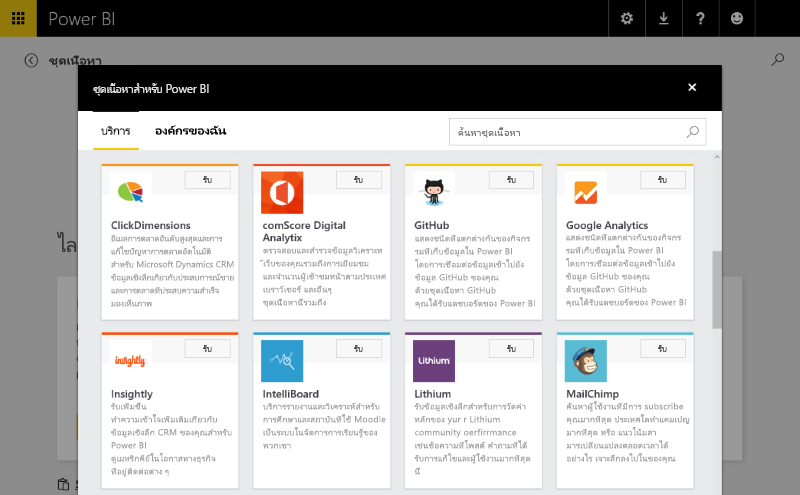
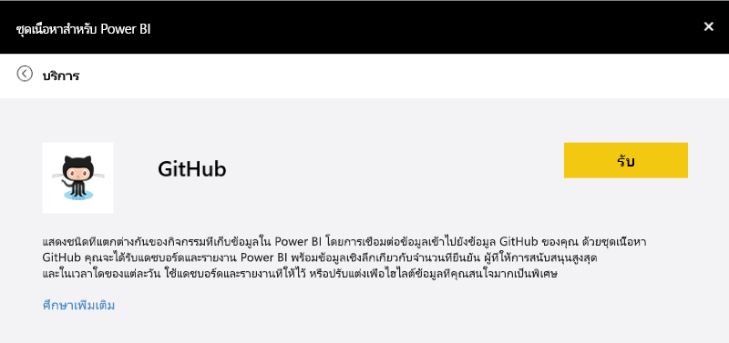
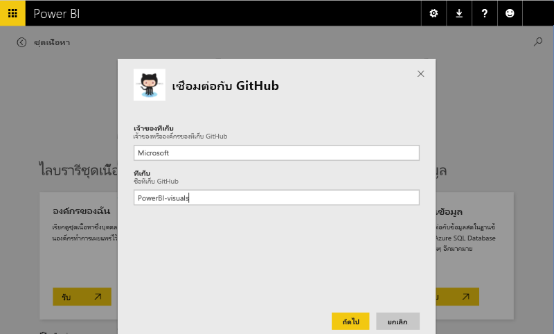
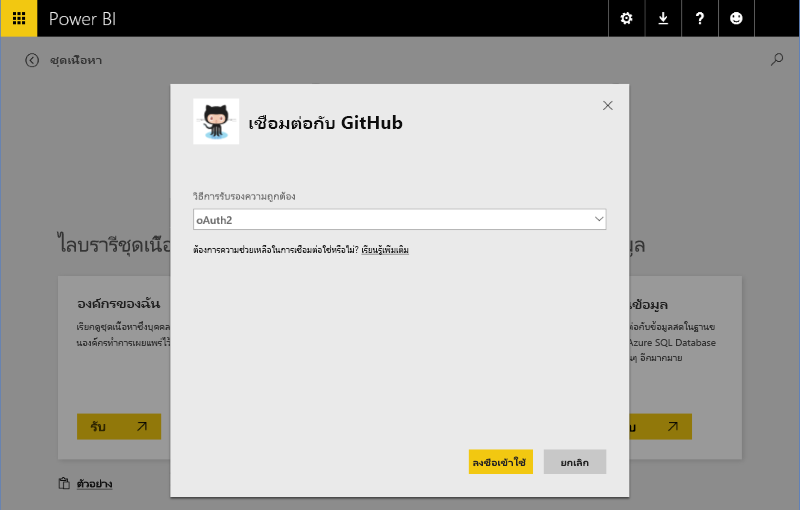
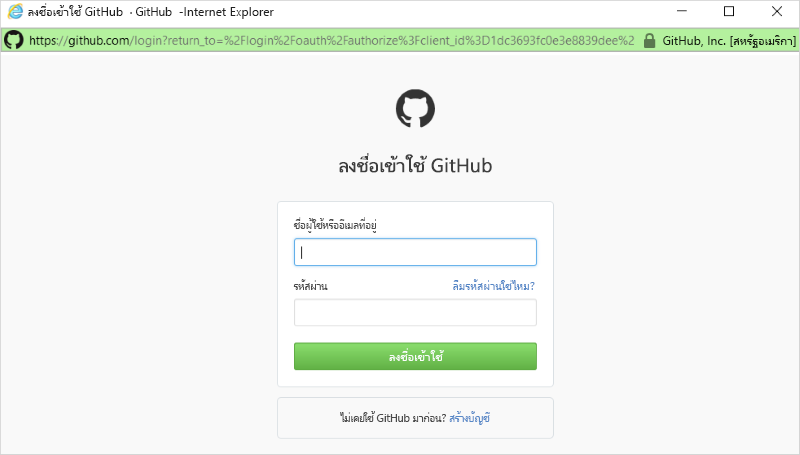
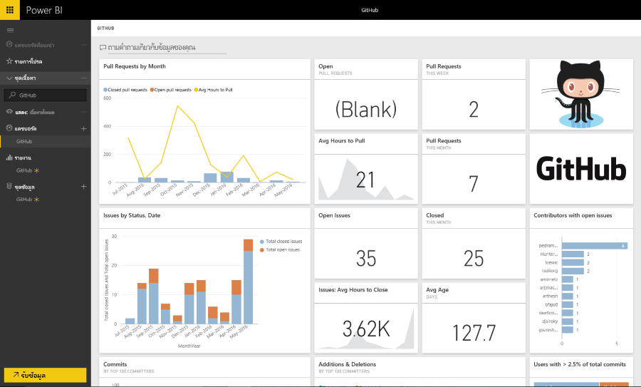

# ประสบการณ์การใช้งานชุดเนื้อหาเทมเพลตใน Power BI
ส่วนนี้เน้นไปที่ประสบการณ์การใช้งานทั่วไปสำหรับผู้ใช้ที่เชื่อมต่อกับชุดเนื้อหา [ISV](../service-connect-to-services.md) 

ลองประสบการณ์การเชื่อมต่อด้วยตัวคุณเอง โดยเชื่อมต่อกับชุดเนื้อหาที่เผยแพร่ที่ https://app.powerbi.com/getdata/services (เช่น [ชุดเนื้อหา GitHub](https://app.powerbi.com/getdata/services/github) ที่อธิบายไว้ด้านล่าง)

## เชื่อมต่อ
เมื่อต้องเริ่มต้นใช้งาน ผู้ใช้เรียกดูแกลเลอรีชุดเนื้อหา และเลือกชุดเนื้อหาเพื่อเชื่อมต่อ รายการชุดเนื้อหาประกอบด้วยชื่อ ไอคอน และข้อความอธิบายที่ให้ข้อมูลเพิ่มเติมแก่ผู้ใช้

## พารามิเตอร์
หลังจากที่เลือก ผู้ใช้จะได้รับแจ้งให้ใส่พารามิเตอร์ทันที (ถ้าจำเป็น) กล่องโต้ตอบพารามิเตอร์ได้รับการจัดเตรียมโดยผู้เขียนในระหว่างการสร้างชุดเนื้อหา

ในขณะนี้พารามิเตอร์ UI อยู่ในขั้นพื้นฐานมาก– ไม่มีวิธีการแจกแจงรายการดรอปดาวน์ และการตรวจสอบการป้อนข้อมูลถูกจำกัดการ regex

## ข้อมูลประจำตัว
หลังจากพารามิเตอร์ ผู้ใช้จะได้รับการแจ้งให้เข้าสู่ระบบ  ถ้าแหล่งข้อมูลสนับสนุนการรับรองความถูกต้องหลายชนิดของ ผู้ใช้จะเลือกตัวเลือกที่เหมาะสม ถ้าแหล่งข้อมูลจำเป็นต้องใช้ OAuth, UI เข้าสู่ระบบของบริการจะแสดงขึ้นเมื่อผู้ใช้กด “ลงชื่อเข้าใช้”  อีกประการหนึ่งคือ ผู้ใช้สามารถใส่ข้อมูลประจำตัวของพวกเขาในกล่องโต้ตอบที่เตรียมไว้ให้

## สร้างอินสแตนซ์
เมื่อเข้าสู่ระบบสำเร็จ วัตถุต่างๆที่รวมอยู่ในชุดเนื้อหา - แบบจำลอง รายงาน และแดชบอร์ด - จะปรากฏในแถบนำทาง  วัตถุเหล่านี้จะถูกเพิ่มลงในบัญชีของผู้ใช้แต่ละราย  ข้อมูลโหลดแบบอะซิงโครนัสเพื่อรวบรวมชุดข้อมูล (แบบจำลอง)  จากนั้นผู้ใช้จะสามารถใช้แดชบอร์ด รายงาน และแบบจำลอง

ตามค่าเริ่มต้น ตารางการรีเฟรชรายวันได้รับการกำหนดค่าสำหรับผู้ใช้ ซึ่งจะประเมินแบบสอบถามในแบบจำลองอีกครั้ง  ข้อมูลประจำตัวที่มอบให้กับผู้ใช ้ต้องอนุญาตให้ผู้ใช้รีเฟรชข้อมูลโดยไม่ต้องเป็นปัจจุบัน

## การสำรวจและการตรวจสอบ
เมื่อชุดเนื้อหาได้รับการไฮเดรทลงในบัญชีของผู้ใช้ ผู้ใช้สามารถสำรวจและตรวจสอบข้อมูล/ข้อมูลเชิงลึก

โดยทั่วไปแล้วรวมถึง:

* การดูและการกำหนดแดชบอร์ด
* การดูและการกำหนดรายงาน
* การใช้ภาษาธรรมชาติเพื่อถามข้อมูลคำถาม
* การใช้ canvas การสำรวจเพื่อสำรวจข้อมูลในแบบจำลองข้อมูล

ควรจะมีการพิจารณาสำหรับการสร้างโมเดลภาษาธรรมชาติ (คำพ้อง) และ schema โมเดลที่เข้าใจได้ง่ายเพื่อให้สามารถเปิดใช้ประสบการณ์การใช้งานการสำรวจได้ดียิ่งขึ้น

