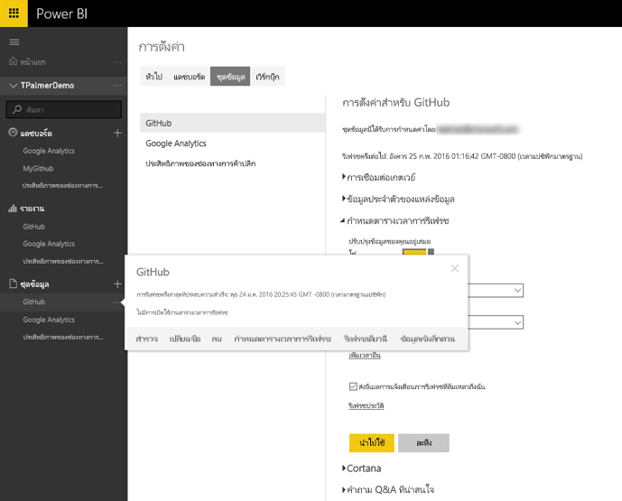
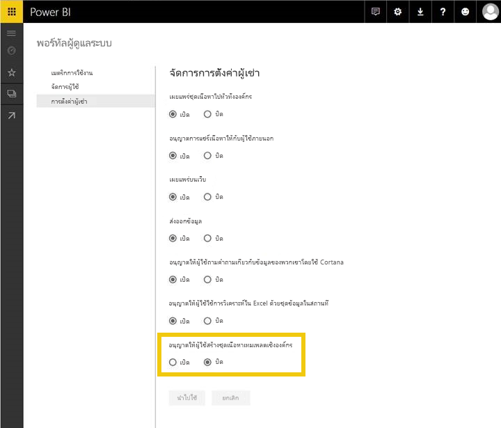
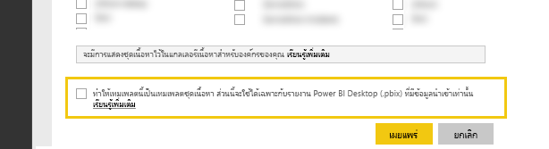
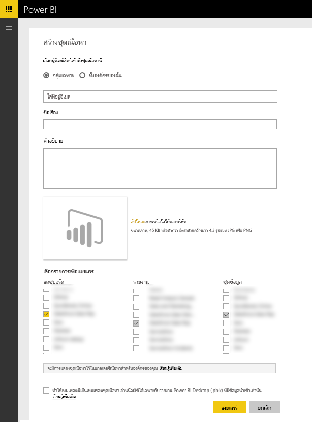

# การทดสอบชุดเนื้อหาเทมเพลตสำหรับ Power BI
มีหลายวิธีในการทดสอบชุดเนื้อหาของคุณก่อนที่จะส่งเผยแพร่  

> [!NOTE]
> ถ้าชุดเนื้อหาของคุณใช้[ตัวเชื่อมต่อข้อมูล](https://aka.ms/DataConnectors)แบบกำหนดเองที่คุณพัฒนา คุณจะไม่สามารถทดสอบการรีเฟรชข้อมูลหรือชุดเนื้อหาเทมเพลตามที่อธิบายไว้ด้านล่างนี้ ถ้าเป็นกรณีนี้ โปรดดำเนินการ[ส่ง](#submission)ชุดเนื้อหาของคุณและทีม Power BI จะทำงานร่วมกับคุณเพื่อทดสอบชุดเนื้อหา
> 
> 

## การทดสอบรีเฟรชข้อมูลตามกำหนดเวลา
ชุดเนื้อหาเทมเพลตจะใช้ประโยชน์จากการรีเฟรชใน PowerBI.com เพื่อสร้างอินสแตนซ์ของชุดเนื้อหากับข้อมูลของลูกค้าเมื่อพวกเขาเชื่อมต่อ ก่อนที่จะเผยแพร่ชุดเนื้อหาแบบสาธารณะ คุณสามารถทดสอบโฟลว์นี้กับไฟล์บนเดสก์ท็อปที่คุณสร้างขึ้นได้

หลังจากอัปโหลดไฟล์แล้ว ให้เลือก "..." ข้างชุดข้อมูล แล้วเลือกกำหนดตารางเวลาการรีเฟรช กำหนดค่าข้อมูลประจำตัวสำหรับแหล่งข้อมูล ตรวจสอบให้แน่ใจว่าชุดข้อมูลของคุณรีเฟรชเสร็จเรียบร้อยแล้วโดยลองใช้ทั้ง "รีเฟรชในตอนนี้" และ "รีเฟรชตามกำหนดเวลา" ถ้าการรีเฟรชล้มเหลว โปรดตรวจสอบข้อความแสดงข้อผิดพลาดและตรวจสอบความถูกต้องของคิวรี รวมถึงระบบปลายทางของคุณ

### เคล็ดลับการรีเฟรชเพิ่มเติม
* เมื่อคุณพยายามกำหนดตารางเวลาการรีเฟรช ระบบควรตรวจพบแหล่งข้อมูลเดียวเท่านั้น  
* การทดสอบการเชื่อมต่อควรระบุว่าผู้ใช้ของคุณจะสามารถโหลดชุดเนื้อหาได้ ถ้าไมเป็นเช่นนั้น ตรวจสอบให้แน่ใจว่าคิวรีของคุณจัดการกรณีข้อผิดพลาดเพิ่มเติมแล้ว  
* การรีเฟรชควรดำเนินการเสร็จสมบูรณ์ภายในระยะเวลาที่สมเหตุสมผล โดยเราขอแนะนำที่ 5 นาที  

## การทดสอบเทมเพลต
ชุดเนื้อหาของเทมเพลจะคล้ายกับโซลูชันที่มีอยู่เว้นแต่จะไม่รวมข้อมูลแท้จริงในชุดข้อมูล เมื่อผู้ใช้ใช้งานหรือสร้างอินสแตนซ์เทมเพลต พวกเขาจะได้รับพร้อมท์สำหรับพารามิเตอร์และข้อมูลประจำตัวเพื่อเชื่อมต่อ เมื่อเชื่อมต่อแล้ว พวกเขาจะเห็นข้อมูลของตนเองในแดชบอร์ด รายงาน และชุดข้อมูล 

หลังจากที่ผู้ใช้สร้างอินสแตนซ์ชุดเนื้อหาที่พวกเขามีสิทธิ์เข้าถึงการตั้งค่าชุดข้อมูลที่รวมถึงการรีเฟรชตามกำหนดเวลาแล้ว การตั้งค่า RLS ทั้งหมดบนชุดข้อมูลจะ**ไม่**เผยแพร่โดยใช้ชุดเนื้อหาดังกล่าว  

> [!NOTE]
> ชุดเนื้อหาเทมเพลตจะมีแดชบอร์ด รายงาน และชุดข้อมูลอย่างละ 1 รายการเท่านั้น โปรดดูรายการข้อจำกัดในหน้า[การเขียน](template-content-pack-authoring.md#restrictions) 
> 
> 

เมื่อต้องการเปิดใช้การสร้างเทมเพลตสำหรับผู้เช่า โปรดทำงานร่วมกับผู้ดูแลระบบ Power BI ของคุณเพื่อเปิดใช้การสลับฟีเจอร์ด้านล่างนี้ 

เมื่อเปิดใช้แล้ว คุณจะเห็นกล่องกาเครื่องหมายที่ด้านล่างของ ["สร้างชุดเนื้อหา"](https://app.powerbi.com/groups/me/publish-content/) ซึ่งทำให้คุณสามารถเผยแพร่ชุดเนื้อหาเทมเพลตในองค์กรของคุณได้ 

### การตั้งชื่อ
เราขอแนะนำให้ตั้งชื่อแดชบอร์ด รายงาน และชุดข้อมูลให้สอดคล้องกันทั่วทั้งชุดเนื้อหาของคุณ ชื่อเหล่านี้จะถูกฮาร์ดโค้ดและจะเหมือนกันสำหรับผู้ใช้ทั้งหมด ดังนั้นการใช้ชื่อผลิตภัณฑ์/สถานการณ์ของคุณทำให้ลูกค้าค้นหาได้ง่ายขึ้น

### เคล็ดลับเทมเพลตเพิ่มเติม
* ตรวจสอบให้แน่ใจว่าพารามิเตอร์ที่ระบุไว้ในคิวรีมีความหมายสำหรับผู้ใช้ปลายทางของคุณ
* พิจารณาระยะเวลาที่ผู้ใช้ปลายทางจะรอให้การรีเฟรชตามกำหนดเวลาดำเนินการเสร็จสมบูรณ์

## การส่ง
กระบวนการส่งผ่าน [Microsoft AppSource](https://appsource.microsoft.com/en-us/partners/list-an-app) จะทำให้คุณสามารถเผยแพร่ชุดเนื้อหาเทมเพลตในแกลเลอรีชุดเนื้อหาบริการใน PowerBI.com ตลอดจนแสดงรายการชุดเนื้อหาของคุณใน [Microsoft AppSource](http://appsource.microsoft.com)

### ก่อนส่ง
* ตรวจสอบเคล็ดลับการเขียนสำหรับวัตถุแต่ละรายการภายในชุดเนื้อหา
* ทดสอบและเชื่อมต่อกับบัญชีผู้ใช้และเงื่อนไขข้อมูลต่างๆ (ข้ามขั้นตอนนี้ถ้าคุณพัฒนา[ตัวเชื่อมต่อข้อมูล](https://aka.ms/DataConnectors)แบบกำหนดเองของคุณเอง)
* ตรวจสอบภาพทั้งหมดและค้นหาคำที่สะกดผิดอย่างระมัดระวัง
* ตรวจสอบให้แน่ใจว่าชุดเนื้อหาตอบสนองต่อการถามตอบอย่างเหมาะสม เราขอแนะนำให้ทดสอบคำถามที่แตกต่างกันอย่างน้อย 30 รายการทั่วทั้งแบบจำลองข้อมูล (ข้ามขั้นตอนนี้ถ้าคุณพัฒนา[ตัวเชื่อมต่อข้อมูล](https://aka.ms/DataConnectors)แบบกำหนดเองของคุณเอง)

### การส่ง
เมื่อพร้อมที่จะส่ง โปรดไปที่[หน้าการส่งแอป](https://appsource.microsoft.com/en-us/partners/list-an-app)บน AppSource และส่งข้อมูลของคุณ โปรดตรวจสอบให้แน่ใจว่าได้เลือก Power BI จากรายการผลิตภัณฑ์ที่พร้อมใช้งานแล้ว

ทีม Power BI จะตรวจสอบข้อมูลที่คุณส่งและจะติดต่อคุณเพื่อให้แน่ใจว่าวัตถุทั้งหมดตรงตามข้อกำหนดการส่ง นอกเหนือจากการดำเนินการให้เสร็จสมบูรณ์แล้ว เราจะตรวจสอบคุณภาพของแดชบอร์ดและรายงานที่ระบุด้วยเพื่อให้แน่ใจว่าเป็นไปตามสถานการณ์ทางธุรกิจที่อธิบายไว้ในแอปพลิเคชัน

### การอัปเดต
ปรับปรุงชุดเนื้อหาของคุณโดยทำตามโฟลว์เดียวกับที่ทำเมื่อส่งข้อมูลต้นฉบับ 

