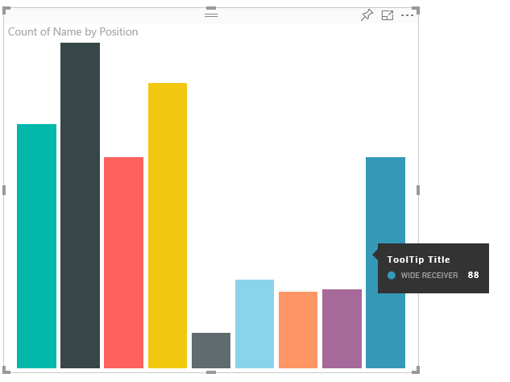
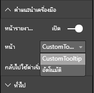

# <a name="power-bi-visuals-tooltips"></a>คำแนะนำเครื่องมือของวิชวล Power BI

ขณะนี้วิชวลสามารถใช้งานการสนับสนุนจากคำแนะนำเครื่องมือของ Power BI ได้แล้ว คำแนะนำเครื่องมือ Power BI จะจัดการการโต้ตอบต่อไปนี้:

แสดงคำแนะนำเครื่องมือ
ซ่อนคำแนะนำเครื่องมือ
ย้ายคำแนะนำเครื่องมือ

เคล็ดลับเครื่องมือสามารถแสดงองค์ประกอบที่เป็นข้อความที่มีชื่อเรื่อง ค่าที่กำหนดสีและความทึบไว้ในชุดพิกัดที่ระบุ ข้อมูลนี้จะถูกกำหนดไว้สำหรับ API และโฮสต์ Power BI จะแสดงผลในลักษณะเดียวกันกับที่แสดงคำแนะนำเครื่องมือสำหรับวิชวลต้นฉบับ

ตัวอย่างเช่น คำแนะนำเครื่องมือใน BarChart ตัวอย่าง



คำแนะนำเครื่องมือด้านบนแสดงประเภทและค่าของแถบเดียว ซึ่งอาจมีการขยายเพื่อแสดงหลายค่าภายในคำแนะนำเครื่องมือเดียว

## <a name="handling-tooltips"></a>การจัดการคำแนะนำเครื่องมือ

อินเทอร์เฟซที่คุณจัดการคำแนะนำเครื่องมือคือ 'ITooltipService' อินเทอร์เฟซนี้ใช้เพื่อแจ้งโฮสต์ว่าจำเป็นต้องแสดง ลบ หรือย้ายคำแนะนำเครื่องมือ

```typescript
    interface ITooltipService {
        enabled(): boolean;
        show(options: TooltipShowOptions): void;
        move(options: TooltipMoveOptions): void;
        hide(options: TooltipHideOptions): void;
    }
```

วิชวลของคุณจะต้องรอการติดต่อจากกิจกรรมของเมาส์ภายในวิชวลและเรียกใช้ผู้รับมอบสิทธิ์ `show()`, `move()`และ`hide()` คนตามที่จำเป็นด้วยเนื้อหาที่เหมาะสมที่เติมใน `Tooltip****Options` วัตถุ
`TooltipShowOptions` และ `TooltipHideOptions`จะกำหนดสิ่งที่จะแสดงและวิธีการทำงานในกิจกรรมเหล่านี้ตามลำดับ
เนื่องจากการเรียกใช้วิธีการเหล่านี้จะเกี่ยวข้องกับกิจกรรมของผู้ใช้เช่น การย้ายเมาส์หรือกิจกรรมการสัมผัส ถือเป็นความคิดที่ดีที่จะสร้างตัวรอรับการติดต่อสำหรับกิจกรรมเหล่านี้ซึ่งจะเรียกใช้งาน `TooltipService` สมาชิกตามลำดับ
การรวมตัวอย่างของเราในคลาสที่เรียกว่า `TooltipServiceWrapper`

### <a name="tooltipservicewrapper-class"></a>คลาส TooltipServiceWrapper

แนวคิดพื้นฐานที่อยู่เบื้องหลังนี้คือการระงับอินสแตนซ์ของ `TooltipService` การรอรับติดต่อจากกิจกรรมการใช้งานของเมาส์ D3 ผ่านองค์ประกอบที่เกี่ยวข้องและการเรียกใช้งาน `show()` และ `hide()` เมื่อจำเป็น
คลาสจะระงับและจัดการสถานะและตรรกะใด ๆ ที่เกี่ยวข้องสำหรับกิจกรรมณ์เหล่านี้ โดยส่วนใหญ่จะเปลี่ยนการอินเทอร์เฟซกับรหัส D3 พื้นฐานให้เหมาะสม การอินเทอร์เฟซและการแปลง D3 อยู่นอกขอบเขตสำหรับเอกสารนี้

คุณสามารถค้นหารหัสตัวอย่างเต็มรูปแบบได้ใน [ที่เก็บวิชวล SampleBarChart](https://github.com/Microsoft/PowerBI-visuals-sampleBarChart/commit/981b021612d7b333adffe9f723ab27783c76fb14)

### <a name="creating-tooltipservicewrapper"></a>การสร้าง TooltipServiceWrapper

ตอนนี้ คอนสตรักเตอร์ BarChart มี `tooltipServiceWrapper` สมาชิก ซึ่งมีการสร้างอินสแตนซ์ในคอนสตรักเตอรด้วยอินสแตนซ์ `tooltipService` ของโฮสต์

```typescript
        private tooltipServiceWrapper: ITooltipServiceWrapper;

        this.tooltipServiceWrapper = createTooltipServiceWrapper(this.host.tooltipService, options.element);
```

คลาส `TooltipServiceWrapper` จะระงับ อินสแตนซ์ `tooltipService` ซึ่งเป็นองค์ประกอบของ D3 ระดับสูงของวิชวลและพารามิเตอร์การสัมผัส

```typescript
    class TooltipServiceWrapper implements ITooltipServiceWrapper {
        private handleTouchTimeoutId: number;
        private visualHostTooltipService: ITooltipService;
        private rootElement: Element;
        private handleTouchDelay: number;

        constructor(tooltipService: ITooltipService, rootElement: Element, handleTouchDelay: number) {
            this.visualHostTooltipService = tooltipService;
            this.handleTouchDelay = handleTouchDelay;
            this.rootElement = rootElement;
        }
        .
        .
        .
    }
```

จุดเข้าใช้งานเดียวสำหรับคลาสนี้เพื่อลงทะเบียนตัวรอรับการติดต่อของกิจกรรม `addTooltip` เมธอด

### <a name="addtooltip-method"></a>เมธอด addTooltip

```typescript
        public addTooltip<T>(
            selection: d3.Selection<Element>,
            getTooltipInfoDelegate: (args: TooltipEventArgs<T>) => VisualTooltipDataItem[],
            getDataPointIdentity: (args: TooltipEventArgs<T>) => ISelectionId,
            reloadTooltipDataOnMouseMove?: boolean): void {

            if (!selection || !this.visualHostTooltipService.enabled()) {
                return;
            }
        ...
        ...
        }
```

* **การเลือก: d3.Selection<Element>**
* องค์ประกอบ d3 ที่จัดการคำแนะนำเครื่องมือ
* **getTooltipInfoDelegate: (args: TooltipEventArgs<T>) = > VisualTooltipDataItem []**
* มอบสิทธิ์สำหรับการเติมเนื้อหาคำแนะนำเครื่องมือ (สิ่งที่จะแสดง) ต่อบริบท
* **getDataPointIdentity: (args: TooltipEventArgs<T>) => ISelectionId**
* มอบสิทธิ์สำหรับการเรียกใช้ ID จุดข้อมูล - ไม่ได้ใช้ในตัวอย่างนี้ 
* **reloadTooltipDataOnMouseMove: บูลีน**
* บูลีนที่ระบุว่าจะรีเฟรชข้อมูลคำแนะนำเครื่องมือในระหว่างกิจกรรม mouseMove - ไม่ได้ใช้ในตัวอย่างนี้

ในขณะที่คุณสามารถดู `addTooltip` จะออกจากระบบโดยไม่มีการดำเนินการถ้าปิดใช้งาน `tooltipService` อยู่หรือไม่มีการเลือกที่แท้จริง

### <a name="call-of-show-method-to-display-a-tooltip"></a>เรียกใช้เมธอดการแสดงเพื่อแสดงคำแนะนำเครื่องมือ

`addTooltip` การรอการติดต่อถัดไปในกิจกรรม D3 `mouseover`

```typescript
        ...
        ...
        selection.on("mouseover.tooltip", () => {
            // Ignore mouseover while handling touch events
            if (!this.canDisplayTooltip(d3.event))
                return;

            let tooltipEventArgs = this.makeTooltipEventArgs<T>(rootNode, true, false);
            if (!tooltipEventArgs)
                return;

            let tooltipInfo = getTooltipInfoDelegate(tooltipEventArgs);
            if (tooltipInfo == null)
                return;

            let selectionId = getDataPointIdentity(tooltipEventArgs);

            this.visualHostTooltipService.show({
                coordinates: tooltipEventArgs.coordinates,
                isTouchEvent: false,
                dataItems: tooltipInfo,
                identities: selectionId ? [selectionId] : [],
            });
        });
```

* **makeTooltipEventArgs**
* แยกบริบทจากองค์ประกอบที่เลือกของ D3 เป็น tooltipEventArgs ซึ่งจะคำนวณพิกัดเช่นกัน
* **getTooltipInfoDelegate**
* จากนั้นสร้างเนื้อหาของคำแนะนำเครื่องมือจาก tooltipEventArgs ซึ่งเป็นการเรียกกลับไปยังคลาส BarChart เนื่องจากเป็นตรรกะของวิชวล นี่คือเนื้อหาข้อความจริงที่จะแสดงในคำแนะนำเครื่องมือ
* **getDataPointIdentity**
* ไม่ได้ใช้ในตัวอย่างนี้
* **this.visualHostTooltipService.show**
* การเรียกเพื่อแสดงคำแนะนำเครื่องมือ  

สามารถพบการจัดการเพิ่มเติมได้ในตัวอย่างสำหรับกิจกรรม `mouseout` และ `mousemove`

สำหรับข้อมูลเพิ่มเติม ให้ดู [ที่เก็บวิชวล SampleBarChart](https://github.com/Microsoft/PowerBI-visuals-sampleBarChart/commit/981b021612d7b333adffe9f723ab27783c76fb14)

### <a name="populating-the-tooltip-content-by-gettooltipdata-method"></a>การเติมเนื้อหาคำแนะนำเครื่องมือตามเมธอด getTooltipData

`BarChart` ถูกเพิ่มเข้ามาพร้อมกับสมาชิก `getTooltipData` ที่เพียงแค่แยกประเภท ค่าและสีของจุดข้อมูลเป็นองค์ประกอบของ VisualTooltipDataItem []

```typescript
        private static getTooltipData(value: any): VisualTooltipDataItem[] {
            return [{
                displayName: value.category,
                value: value.value.toString(),
                color: value.color,
                header: 'ToolTip Title'
            }];
        }
```

ในการใช้งานด้านบน สมาชิก `header` เป็นค่าคงที่แต่สามารถใช้สำหรับการดำเนินการที่ซับซ้อนมากขึ้น ซึ่งจำเป็นต้องมีข้อมูลแบบไดนามิก คุณสามารถเติมข้อมูล`VisualTooltipDataItem[]`ที่มีมากกว่าหนึ่งองค์ประกอบ ซึ่งจะเพิ่มหลายบรรทัดในคำแนะนำเครื่องมือ ซึ่งอาจเป็นประโยชน์ในวิชวลเช่น แผนภูมิแท่งแบบเรียงซ้อน ซึ่งคำแนะนำเครื่องมืออาจแสดงข้อมูลจากมากกว่าจุดข้อมูลเดียว

### <a name="calling-addtooltip-method"></a>การเรียกใช้เมธอด addTooltip

ขั้นตอนสุดท้ายคือการเรียกใช้ `addTooltip` เมื่อข้อมูลจริงอาจเปลี่ยนแปลง การเรียกใช้นี้จะเกิดขึ้นในเมธอด `BarChart.update()` ดังนั้นการเรียกใช้ถูกสร้างขึ้นเพื่อตรวจสอบการเลือกองค์ประกอบ ' bar ' ทั้งหมด ซึ่งส่งผ่านเฉพาะ `BarChart.getTooltipData()` ดังที่กล่าวถึงข้างต้นเท่านั้น

```typescript
        this.tooltipServiceWrapper.addTooltip(this.barContainer.selectAll('.bar'),
            (tooltipEvent: TooltipEventArgs<number>) => BarChart.getTooltipData(tooltipEvent.data),
            (tooltipEvent: TooltipEventArgs<number>) => null);
```

## <a name="adding-report-page-tooltips"></a>การเพิ่มคำแนะนำเครื่องมือของหน้ารายงาน

เมื่อต้องการเพิ่มการสนับสนุนคำแนะนำเครื่องมือของหน้ารายงาน การเปลี่ยนแปลงส่วนใหญ่จะอยู่ใน capabilities.json

ตัวอย่าง Schema คือ

```json
{
    "tooltips": {
        "supportedTypes": {
            "default": true,
            "canvas": true
        },
        "roles": [
            "tooltips"
        ]
    }
}
```

การกำหนดคำแนะนำเครื่องมือของหน้ารายงานสามารถทำได้ในบานหน้าต่างรูปแบบ



`supportedTypes` เป็นการกำหนดค่าคำแนะนำเครื่องมือที่ได้รับการสนับสนุนโดยวิชวลและจะปรากฏบนเขตข้อมูลดังกล่าว `default` ระบุว่ามีการสนับสนุนการผูกคำแนะนำเครื่องมือ "อัตโนมัติ" ผ่านเขตข้อมูลหรือไม่ พื้นที่ทำงานจะระบุว่าคำแนะนำเครื่องมือของหน้ารายงานได้รับการสนับสนุนหรือไม่

`roles` ทางเลือก เมื่อกำหนดแล้ว ให้แนะนำบทบาทข้อมูลที่จะผูกไว้กับตัวเลือกคำแนะนำเครื่องมือที่เลือกในเขตข้อมูลดังกล่าว

สำหรับข้อมูลเพิ่มเติม ให้ดูคำแนะนำในการใช้งานคำแนะนำเครื่องมือของหน้ารายงาน [คำแนะนำเครื่องมือของหน้ารายงาน](https://powerbi.microsoft.com/blog/power-bi-desktop-march-2018-feature-summary/#tooltips)

สำหรับการแสดงคำแนะนำเครื่องมือของหน้ารายงาน เมื่อเรียกใช้ `ITooltipService.Show(options: TooltipShowOptions)` หรือ `ITooltipService.Move(options: TooltipMoveOptions)` โฮสต์ Power BI จะใช้ selectionId (คุณสมบัติ`identities`ของ`options`อาร์กิวเมนต์ด้านบน) SelectionId ควรแสดงข้อมูลที่เลือกไว้ (ประเภท, ชุดข้อมูล และอื่นๆ) ของรายการที่คุณวางเมาส์อยู่เหนือจะถูกเรียกใช้โดยคำแนะนำเครื่องมือ

ตัวอย่างของการส่ง selectionId ไปยังคำแนะนำเครื่องมือจะแสดงการเรียกใช้:

```typescript
    this.tooltipServiceWrapper.addTooltip(this.barContainer.selectAll('.bar'),
        (tooltipEvent: TooltipEventArgs<number>) => BarChart.getTooltipData(tooltipEvent.data),
        (tooltipEvent: TooltipEventArgs<number>) => tooltipEvent.data.selectionID);
```
